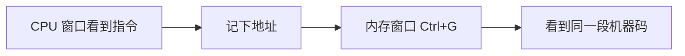
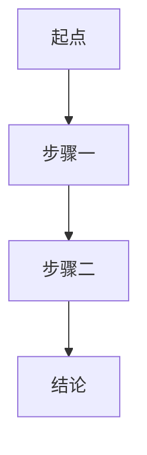
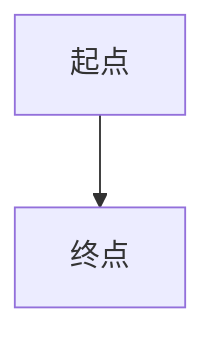

# 教程 Markdown 规范

> 适用范围：`src/data/books/**` 教学章节；`src/data/blog/**` 可复用。
> 配套文档：frontmatter、书籍目录、`SVG → PNG` 图片规则见 `agents-md/writing.md`。

## 核心原则

- **先教会，再美化。** 先用正文把概念讲清楚，再决定要不要加提示框、表格、图表。
- **一个区块只做一件事。** 一个表格只负责对比，一个图只负责解释一个变化过程，一个 callout 只强调一个结论。
- **主线永远在正文。** 初学者必须看到的步骤、结论、前置条件，不要藏进折叠内容或脚注。
- **特性服从理解成本。** 如果普通段落和列表已经够清楚，就不要为了“更丰富”硬加增强语法。
- **补充必须重新融入上下文。** 审稿或对话产生的新解释不要原样追加；先判断它属于主线还是旁支，再重读上下段。完整审查方法见 `agents-md/writing.md` 的“教程的读者视角审查”。

## 速查：要表达什么，就用什么

- **步骤顺序**：用有序列表，不要写成长段落。
- **并列要点**：用无序列表，每条只说一个点。
- **关键提醒**：用 callout，不要把警告埋在正文中间。
- **多维对比**：用表格；如果列太多，拆成列表或分段。
- **流程或状态变化**：用 Mermaid 或图片，但图前先交代读图目的。
- **旁支补充**：用脚注；主讲解不要靠脚注推进。
- **术语、寄存器名、命令、机器码**：优先用行内代码。
- **短关键词强调**：用高亮；整句强调优先改写语序，不要整段涂黄。

## 标题与段落

- 正文不要再写 `#` 一级标题；页面会用 frontmatter 的 `title` 自动生成标题，正文从 `##` 开始。
- 正文层级优先控制在 `##` 和 `###`；只有真的需要拆子话题时才继续下钻。
- 每个 `##` 开头先回答“这一节要解决什么问题”，再展开细节。
- 段落尽量短。连续 4 句以上时，优先考虑拆段、拆列表，或先给一句结论。
- 图、表、代码块前先用一句话说明“为什么现在要看它”。

**推荐：**

```md
## 为什么地址会跳着增长

地址看起来不连续，不是因为 x64dbg 显示错了，而是因为每条指令占用的字节数不同。
```

**慎用：**

```md
## 为什么地址会跳着增长

这里有很多复杂原因，下面先看一个表、一个图、再看一段代码，最后我们再回来解释。
```

## 列表与步骤

- **有顺序** 的操作用有序列表，比如“打开窗口 -> 跳到地址 -> 验证结果”。
- **无顺序** 的概念并列用无序列表，比如“寄存器的 3 个常见用途”。
- 每个列表项尽量以同一种句式开头，便于扫读。
- 列表项太长时，先给关键词，再补一句解释。

**推荐：**

```md
1. 在 CPU 窗口记下当前指令地址。
2. 切到内存窗口，按 `Ctrl+G` 输入同一个地址。
3. 对照机器码，确认两边看到的是同一段字节。
```

## Callout

教程里只推荐常用的 4 类：

- `NOTE`：补充上下文，但不影响主线理解。
- `TIP`：更快、更稳、更容易操作的小技巧。
- `WARNING`：容易踩坑，但通常还能恢复。
- `IMPORTANT`：必须记住的规则、限制或前提。

规则：

- 一个 callout 只放一个主题。
- callout 里的列表最多 3 项，避免提示框里再塞一篇小文章。
- 可折叠 callout 只放补充材料、排错细节、延伸阅读。
- 主教程步骤不要放进折叠 callout。
- 读者追问产生的边界条件或高阶解释优先放折叠 `NOTE`；如果它是理解当前步骤的必要条件，就改写进正文，不要用 callout 逃避主线解释。

**推荐：**

```md
> [!IMPORTANT]
> 同一个地址在 CPU 窗口和内存窗口里看到的是同一段字节，只是解释方式不同。
```

```md
> [!TIP]
> 想验证某条指令对应的机器码时，先记地址，再去内存窗口 `Ctrl+G` 跳转，会比肉眼找更快。
```

**补充内容可折叠：**

```md
> [!NOTE]- 为什么这里先不展开 ASLR
> 初学阶段只需要知道基址可能变化，不需要先掌握 PE 重定位细节。
```

## 表格

适合用表格的场景：

- 真值表、映射表、对照表
- 指令差异、寄存器用途、优化前后对比
- 多个对象在同一维度下做扫读比较

规则：

- 尽量控制在 **5 列以内**。
- 单元格里优先放短语，不要塞两三句完整段落。
- 如果某列必须写很长解释，改成“短表格 + 表后逐条说明”。
- 手机上横向太宽的表格，优先拆成列表。

**推荐：**

```md
| 指令           | 机器码           | 字节数 |
| -------------- | ---------------- | ------ |
| `xor eax, eax` | `31 C0`          | 2      |
| `mov eax, 0`   | `B8 00 00 00 00` | 5      |
```

## 代码块

- 必须标语言，方便高亮和扫读。
- 代码块只保留当前知识点需要的最小片段。
- 代码块后紧跟解释，说明"这一行为什么关键"。
- 连续出现多段代码时，插入一句过渡，不要让读者在代码块之间自己猜重点。
- **汇编代码块中的十六进制数字格式**：
  - 中括号内的偏移用**纯十六进制无前缀**：`[ebp-4]`、`[ebp+8]`、`[ebp-14]`、`[ebp-20]`，不写 `[ebp-0x4]` 或 `[ebp-14h]`（这些数字是十六进制，只是省略前缀）
  - 立即数用 **`0x` 前缀**：`0x41`、`0xFF`、`0xCCCCCCCC`，不写 `41h` 或 `0CCCCCCCCh`
  - 正文行内代码引用汇编时同样遵循此规则

**推荐：**

````md
```asm
xor eax, eax
mov ecx, 10
```

第一行先把 `eax` 清零，第二行再把循环计数放进 `ecx`。
````

## 图片

- 一张图只解释一个动作、一个结构或一次变化。
- 图片前先告诉读者“看图要看什么”，图片后马上点出结论。
- `alt` 文本写成“这张图解释了什么”，不要只写“截图”或“示意图”。
- 同一节连续放多张大图时，确认每张图的职责不同；否则合并或删掉。
- 章节插图遵循现有 `SVG → PNG` 工作流，不直接在章节 Markdown 里引用 `SVG`。

**推荐：**

```md
下面这张图只看一件事：`EAX`、`AX`、`AH`、`AL` 的包含关系。


图里最重要的结论是：改 `AL` 只会影响最低 8 位，不会改高 24 位。
```

## Mermaid

适合画图的场景：

- 一串步骤的执行顺序
- 条件分支
- 状态变化或窗口跳转关系

规则：

- 图前先交代“为什么要看图”。
- 节点数尽量少，让读者一屏就能读完主线。
- 图只是辅助，图后必须落回文字结论。
- 纯粹为了“更酷”不要上图；三步以内的流程通常列表更清楚。

**推荐：**

````md
下面这张图只解释一件事：同一个地址如何在两个窗口之间切换查看。



图的重点不是操作步骤本身，而是“同一地址在不同窗口里的两种视角”。
````

## 脚注

- 脚注只放旁支信息、历史背景、轻量补充，不放主结论。
- 每段最多一个脚注引用，避免读者视线来回跳。
- 同一行不要写多个脚注引用。
- 当前插件组合下，**同一个脚注不要在多处重复引用**，避免和上标语法冲突。

**推荐：**

```md
Windows 32 位程序常见的默认加载基址是 `0x00400000`[^base]。

[^base]: 入门阶段只需要记住“这是常见默认值”，不需要先掌握 PE 重定位细节。
```

## 高亮、上下标与行内 HTML

- `==高亮==` 只用于 **短关键词**、术语、结论里的信号词。
- `^上标^`、`~下标~` 只用于公式、化学式、标准记号，不当作视觉装饰。
- `<kbd>` 适合写快捷键，`<abbr>` 适合第一次出现的缩写；在教程里点到为止即可。

**推荐：**

```md
`xor eax, eax` 之后，`ZF` 会变成 ==1==。

按 <kbd>Ctrl</kbd> + <kbd>G</kbd> 可以直接跳到指定地址。
```

**慎用：**

```md
==这一整句都很重要所以全部高亮==
```

## 练习与答案折叠

书籍章节末尾的练习题，统一用**有序列表 + 折叠 callout**，不要用 `<details>`/`<summary>` 或 `### 第X题` 形式。

规则：

- 题目用有序列表 `1.` `2.` `3.`，不要用 `### 第X题` 标题。
- 答案统一用 `> [!NOTE]- 参考答案` 折叠 callout。
- 题干里的代码块缩进 3 空格，与有序列表项对齐。
- 答案里的代码块同样缩进进 callout（`   > ```lang`）。
- 同一本书的多章，练习格式必须一致——不要这章用 callout、那章用 `<details>`。

**推荐：**

````md
1. 题干写在这里。

   ```asm
   push eax
   ```

   > [!NOTE]- 参考答案
   > 答案写在这里。
   >
   > 多行用空 `>` 分隔。
````

**不要：**

````md
### 第一题

题干。

<details>
<summary>答案</summary>

答案。

</details>
````

## 慎用清单

- 不要在同一屏里同时堆 callout、表格、Mermaid、长代码块。
- 不要把正文已经说清楚的内容再重复做成花哨提示框。
- 不要把宽表格当作默认表达方式；教程优先照顾手机阅读。
- 不要为了展示插件能力而硬塞高亮、脚注、上下标。
- 不要让图片、图表、脚注承担"第一次解释核心概念"的职责。
- 不要用 `<details>`/`<summary>` 做答案折叠——统一用 `> [!NOTE]-`。

## 可复制模板

### 关键提醒

```md
> [!IMPORTANT]
> 这里写读者必须记住的规则。
```

### 操作小技巧

```md
> [!TIP]
> 这里写一个能帮读者更快验证结果的小技巧。
```

### 对比表

```md
| 对象 | 作用 | 何时使用 |
| ---- | ---- | -------- |
| A    |      |          |
| B    |      |          |
```

### 流程图

````md
先告诉读者：这张图要解释什么流程。


````

### 图片说明

```md
下面这张图只看一件事：这里写看图目标。


看完图后，立刻用一句话点出你希望读者记住的结论。
```

### 脚注

```md
正文里先讲主线，再把补充信息放到脚注里[^note]。

[^note]: 这里写补充背景、额外资料或不影响主线的说明。
```

### 练习答案折叠

````md
1. 题干写在这里。

   ```asm
   push eax
   ```

   > [!NOTE]- 参考答案
   > 答案写在这里。
````

## 语法速查表

### 文本样式

| 功能     | 语法              | 效果                                    |
| -------- | ----------------- | --------------------------------------- |
| 加粗     | `**text**`        | **text**                                |
| 斜体     | `*text*`          | *text*                                  |
| 加粗斜体 | `***text***`      | ***text***                              |
| 删除线   | `~~text~~`        | ~~text~~                                |
| 高亮     | `==text==`        | <mark>text</mark>                       |
| 上标     | `x^2^`            | x<sup>2</sup>                           |
| 下标     | `H~2~O`           | H<sub>2</sub>O                          |
| 行内代码 | `` `code` ``      | `code`                                  |
| 快捷键   | `<kbd>Ctrl</kbd>` | <kbd>Ctrl</kbd>                         |
| 缩写     | `<abbr>`          | <abbr title="HyperText Markup Language">HTML</abbr> |

### 代码块高亮（Shiki）

行高亮：` ```lang {行号} `

````md
```text {1,3-4}
第一行高亮
第二行不高亮
第三行高亮
第四行高亮
```
````

差异标记：`// [!code ++]` `// [!code --]`

````md
```ts
const old = "removed"; // [!code --]
const new = "added";   // [!code ++]
```
````

注释高亮：`// [!code highlight]`（需语言支持 `//` 注释）

````md
```ts
function important() {
  return "高亮"; // [!code highlight]
}
```
````

词高亮：`// [!code word:词]`

````md
```ts
const msg = "hello"; // [!code word:hello]
```
````

### Callout（提示框）

> [!NOTE] — 补充说明
> [!TIP] — 小技巧
> [!WARNING] — 踩坑提醒
> [!IMPORTANT] — 必须记住的规则或前提

折叠 callout：`> [!NOTE]- 标题`

````md
> [!NOTE]- 点击展开
> 折叠内容写在这里
````

### 脚注

```md
正文引用[^note]。

[^note]: 脚注内容。每行最多一个脚注引用，避免 `^` 冲突。
```

### 表格

```md
| 列 A | 列 B |
| ---- | ---- |
| 数据 | 数据 |
```

### Mermaid 流程图

````md

````

### 图片

```md

```

圆角样式已通过 `src/styles/typography.css` 全局生效，无需手动处理。
