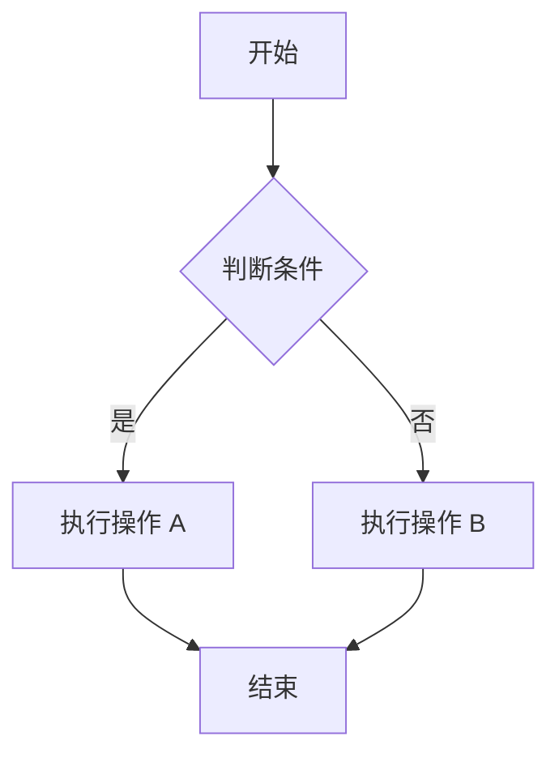
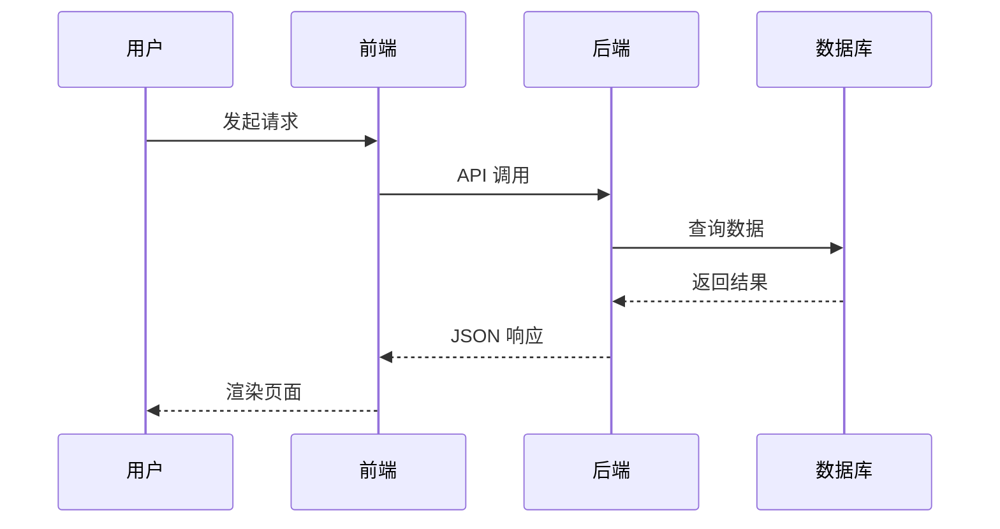
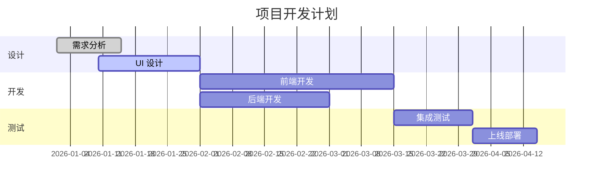
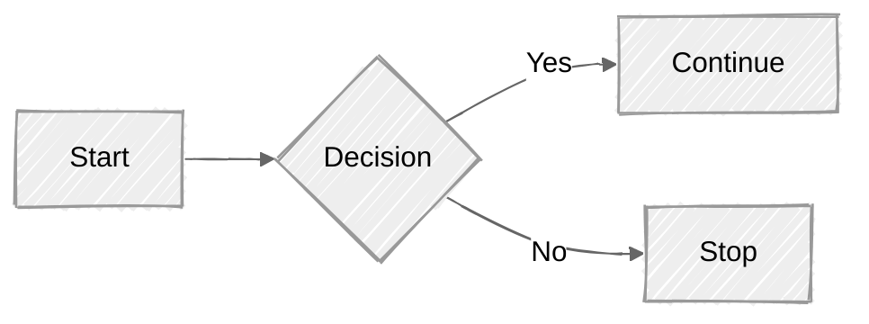

## 目录生成（remark-toc）

以下目录由 remark-toc 自动生成：

### Table of contents

## GFM 自动链接字面量

裸 URL 自动变为可点击链接：

访问 https://github.com 了解更多。

www.example.com 也会自动链接。

邮箱 test@example.com 试试（GFM autolink literal 不支持裸邮箱，需要用尖括号）。

<test@example.com> 尖括号邮箱链接。

## GFM 脚注增强

### 单行脚注

这里引用一个脚注[^simple]。

[^simple]: 这是一个简单的单行脚注。

### 多行脚注

这里引用一个多行脚注[^multi]。

[^multi]:
    这是多行脚注的第一行。
    这是第二行（缩进 4 个空格）。
    这是第三行。

    脚注中可以包含空行（缩进 4 个空格保持连续）。

### 脚注中包含复杂内容

这里引用一个包含代码的脚注[^code]。

[^code]: 脚注里也能写 `行内代码`，甚至：

    ```js
    console.log("脚注中的代码块");
    ```

### 多处引用同一脚注

同一个脚注只能引用一次，否则 `remark-supersub` 会把两次 `[^name]` 中的 `^` 误匹配为上标。

这里只引用一次[^reuse]。

[^reuse]: 这是被多处复用的脚注内容。

> **已知限制：** `remark-supersub` 用 `^` 分割文本，当同一行出现两个脚注引用 `[^name]` 时，两个 `^` 会被错误配对为上标。建议每行只使用一个脚注引用。

## 上标和下标（remark-supersub）

### 上标用法

数学公式：E = mc^2^

化学方程式中的温度：100^°C^

序数词：1^st^、2^nd^、3^rd^、4^th^

### 下标用法

化学分子式：H~2~O、CO~2~、H~2~SO~4~

变量下标：x~1~ + x~2~ = x~3~

### 混合使用

水分子 H~2~O 在 100^°C^ 时沸腾。

### 上标下标与删除线共存

单个 `~` 是下标：H~2~O

双个 `~~` 是删除线：~~已过期~~

两者不冲突。

## 高亮文本（remark-mark-highlight）

这是 ==重要内容== 请注意。

==整段高亮也可以==

混合使用：**加粗** 和 ==高亮== 和 _斜体_ 和 ~~删除线~~

==高亮中可以**嵌套加粗**和*嵌套斜体*==

## remark-toc 自定义

### 子章节 A

内容 A

### 子章节 B

内容 B

#### 更深的子章节

更深的内容

## 表格增强

### 宽表格

| 语法     | 插件                  | 写法       | 渲染结果          | 类型 |
| -------- | --------------------- | ---------- | ----------------- | ---- |
| 上标     | remark-supersub       | `x^2^`     | x<sup>2</sup>     | 扩展 |
| 下标     | remark-supersub       | `H~2~O`    | H<sub>2</sub>O    | 扩展 |
| 高亮     | remark-mark-highlight | `==text==` | <mark>text</mark> | 扩展 |
| 删除线   | remark-gfm            | `~~text~~` | ~~text~~          | GFM  |
| 任务列表 | remark-gfm            | `- [x]`    | - [x] done        | GFM  |

### 表格内包含代码

| 命令              | 说明           |
| ----------------- | -------------- |
| `npm run dev`     | 启动开发服务器 |
| `npm run build`   | 构建项目       |
| `npm run preview` | 预览构建结果   |

## 图片引用式链接

![图片描述][img1]

[img1]: https://picsum.photos/seed/ref-img/400/200 "引用式图片"

## 行内 HTML 增强

键盘快捷键：<kbd>Ctrl</kbd> + <kbd>C</kbd>

缩写：<abbr title="HyperText Markup Language">HTML</abbr> 是网页的基础。

标记：<mark>默认高亮样式</mark>（HTML 标签方式，非 == 语法）。

## 转义字符

\*不是斜体\*

\_不是斜体\_

\~不是下标\~

\^不是上标\^

\==不是高亮\==

\#不是标题

\[不是链接](

\\反斜杠本身

## 嵌套与边缘情况

### 引用中的增强语法

> GFM 表格在引用中：
>
> | A   | B   |
> | --- | --- |
> | 1   | 2   |
>
> 上标在引用中：E = mc^2^
>
> 高亮在引用中：==注意==

### 列表中的增强语法

1. 上标：E = mc^2^
2. 下标：H~2~O
3. 高亮：==重点==
4. 删除线：~~废弃~~

### 链接中包含增强语法

这不太常见，但试试 [**加粗链接文本**](https://example.com) 和 [==高亮链接==](https://example.com)

## 复杂组合

| 功能   | 语法   | 示例             |
| ------ | ------ | ---------------- |
| 温度   | 上标   | 水的沸点 100^°C^ |
| 化学式 | 下标   | 硫酸 H~2~SO~4~   |
| 重点   | 高亮   | ==考试重点==     |
| 废弃   | 删除线 | ~~旧版本~~       |

## Mermaid 图表（rehype-mermaid）

### 流程图



### 时序图



### 甘特图



### 手绘风格流程图



---

**增强语法测试完成！**
