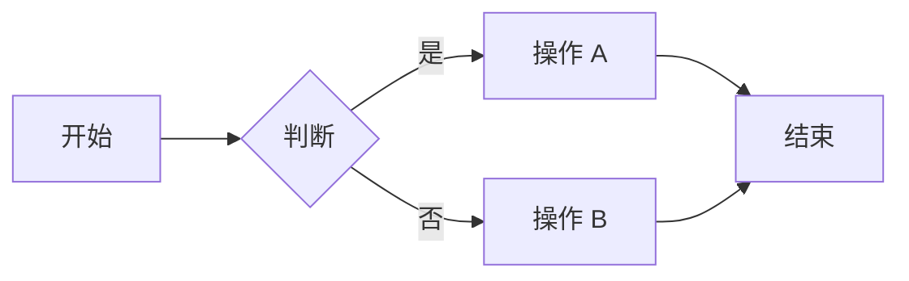
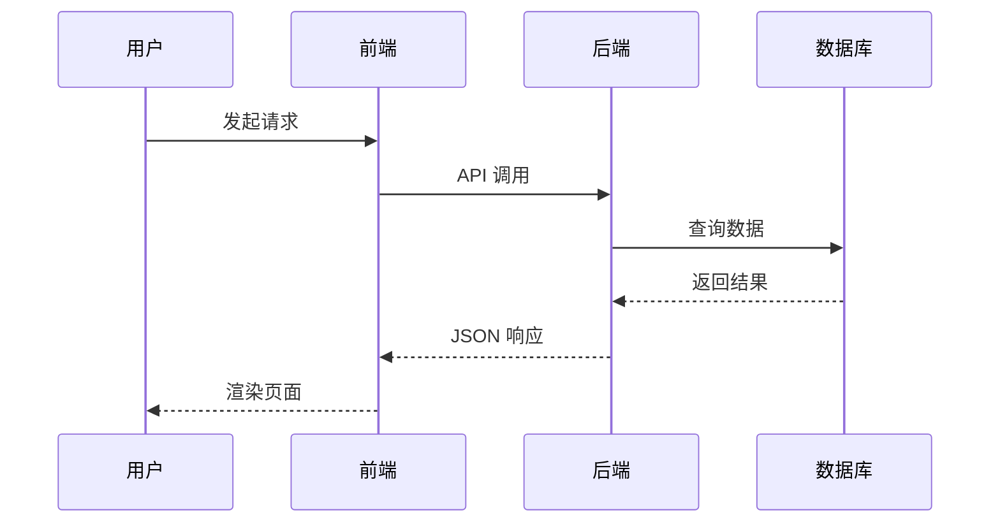
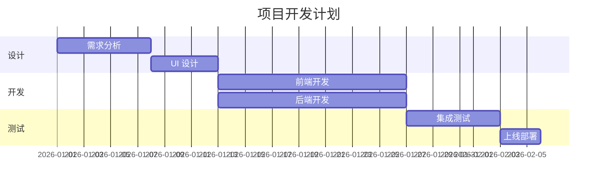
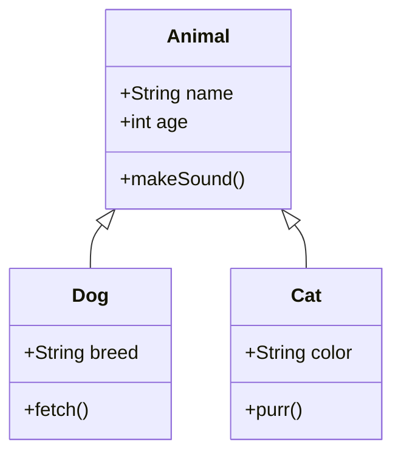

## Callout 提示框

> [!NOTE]
> 这是一条注释提示，用于补充说明重要但非关键的信息。

> [!TIP]
> 这是一条小贴士，提供有助于更好使用功能的建议。

> [!WARNING]
> 这是一条警告信息，提醒你注意可能出问题的地方。

> [!CAUTION]
> 这是一条危险警告，提醒你操作可能导致严重后果。

> [!INFO]
> 这是一条信息提示，用于提供额外的上下文信息。

## 上标和下标

### 上标用法

数学公式：E = mc^2^

序数词：1^st^、2^nd^、3^rd^、4^th^

温度：100°C

### 下标用法

化学分子式：H~2~O、CO~2~、H~2~SO~4~

变量下标：x~1~ + x~2~ = x~3~

### 混合使用

水分子 H~2~O 在 100°C 时沸腾。

## 高亮文本

这是 ==重要内容== 请注意。

也可以 ==整段高亮== 使用。

混合使用：**加粗** 和 ==高亮== 和 _斜体_ 和 ~~删除线~~

## 删除线

~~这段文字已废弃~~，请使用新版本。

## 任务列表

- [x] 已完成任务
- [x] 另一个已完成任务
- [ ] 未完成任务
- [ ] 另一个待办事项
- [ ] 还有一个待办事项

## 表格

### 基础表格

| 功能 | 语法       | 示例     |
| ---- | ---------- | -------- |
| 上标 | `x^2^`     | x^2^     |
| 下标 | `H~2~O`    | H~2~O    |
| 高亮 | `==text==` | ==text== |

### 宽表格

| 命令              | 说明            | 参数      | 默认值 | 是否必须 |
| ----------------- | --------------- | --------- | ------ | -------- |
| `npm run dev`     | 启动开发服务器  | `--port`  | 4321   | 否       |
| `npm run build`   | 构建项目        | 无        | 无     | 是       |
| `npm run preview` | 预览构建结果    | `--port`  | 4321   | 否       |
| `npm run lint`    | ESLint 检查     | 无        | 无     | 是       |
| `npm run format`  | Prettier 格式化 | `--write` | true   | 是       |

## Mermaid 流程图



## Mermaid 时序图



## 代码块

### JavaScript

```javascript
function fibonacci(n) {
  if (n <= 1) return n;
  return fibonacci(n - 1) + fibonacci(n - 2);
}

console.log(fibonacci(10));
```

### Python

```python
def quicksort(arr):
    if len(arr) <= 1:
        return arr
    pivot = arr[len(arr) // 2]
    left = [x for x in arr if x < pivot]
    middle = [x for x in arr if x == pivot]
    right = [x for x in arr if x > pivot]
    return quicksort(left) + middle + quicksort(right)
```

### Bash

```bash
#!/bin/bash
echo "Building project..."
npm run build
echo "Deploy complete!"
```

## 图片


## 引用

> 这是一段引用文本。
>
> 引用可以包含多个段落。
>
> > 引用也可以嵌套。

## 列表

### 有序列表

1. 第一步：安装依赖
2. 第二步：配置项目
3. 第三步：启动开发服务器
4. 第四步：编写代码
5. 第五步：构建部署

### 无序列表

- 前端框架：React、Vue、Svelte、Astro
- 后端语言：Node.js、Python、Go、Rust
- 数据库：PostgreSQL、MySQL、MongoDB、Redis

## 链接

访问 [GitHub](https://github.com) 了解更多。

## 脚注

这里引用一个脚注[^1]。也可以引用多个[^2]。

[^1]: 这是脚注的内容。

[^2]: 这是第二个脚注的内容，可以包含更多文字。

## 数学与物理公式

### 常用数学符号

圆的面积公式：A = πr^2^

勾股定理：a^2^ + b^2^ = c^2^

二次方程求根公式判别式：Δ = b^2^ − 4ac

### 化学方程式

光合作用：6CO~2~ + 6H~2~O → C~6~H~12~O~6~ + 6O~2~

甲烷燃烧：CH~4~ + 2O~2~ → CO~2~ + 2H~2~O

硫酸：H~2~SO~4~ 分子量为 98

### 物理单位

力的单位：N = kg·m/s^2^

能量：E = hν（普朗克公式）

电压：V = IR（欧姆定律）

## 嵌套结构测试

### 引用嵌套

> 外层引用
>
> > 内层引用
> >
> > > 更深层的引用

### 列表嵌套

1. 第一层级
   1. 第二层级
      1. 第三层级
   2. 第二层级另一个
2. 第一层级另一个

### 列表中的代码

- 安装步骤：
  1. 克隆仓库：`git clone https://github.com/example/repo.git`
  2. 进入目录：`cd repo`
  3. 安装依赖：`npm install`

- 配置文件示例：

  ```json
  {
    "name": "my-project",
    "version": "1.0.0"
  }
  ```

## 更多 Mermaid 图表

### 甘特图



### 类图



## 行内 HTML 测试

键盘快捷键：<kbd>Ctrl</kbd> + <kbd>C</kbd> 复制，<kbd>Ctrl</kbd> + <kbd>V</kbd> 粘贴。

缩写：<abbr title="HyperText Markup Language">HTML</abbr> 是网页的基础。

## 分隔线

---

## 转义字符

\*不是斜体\*

\_不是斜体\_

\~不是下标\~

\^不是上标\^

\==不是高亮\==

\#不是标题

## 可折叠 Callout

> [!TIP]+ 点击展开（默认展开）
> 这是一个可以折叠/展开的 callout，默认展开状态。

> [!WARNING]- 默认折叠的警告
> 这是一个默认折叠的 callout，需要点击才能看到内容。

## 更多表格

### 对齐方式

| 左对齐       |    居中对齐    |       右对齐 |
| :----------- | :------------: | -----------: |
| 第一行左对齐 | 第一行居中对齐 | 第一行右对齐 |
| 第二行左对齐 | 第二行居中对齐 | 第二行右对齐 |
| 第三行左对齐 | 第三行居中对齐 | 第三行右对齐 |

### 包含图片的表格

| 名称   | 图示                                     | 说明       |
| ------ | ---------------------------------------- | ---------- |
| 示例 A |  | 第一种示例 |
| 示例 B |  | 第二种示例 |

## 最终总结

本测试页面覆盖了以下所有增强语法：

1. Callout 提示框（6 种类型 + 可折叠）
2. 上标和下标（数学、化学、物理）
3. 高亮文本
4. 删除线
5. 任务列表
6. 多种表格（基础、宽表格、对齐、含图片）
7. Mermaid 图表（流程图、时序图、甘特图、类图）
8. 代码块（JavaScript、Python、Bash）
9. 图片
10. 引用嵌套
11. 列表嵌套
12. 链接
13. 脚注
14. 行内 HTML
15. 分隔线
16. 转义字符
