## 本章目标

上一章学了 `mov`、`lea`、`nop`，它们只搬运数据、算地址，不做任何计算。真正的计算由**算术指令**完成。

这一章你将学会：

- 7 条算术指令：`add`、`sub`、`inc`、`dec`、`imul`、`mul`、`idiv`/`div`
- 每条指令对 EFLAGS 标志位的影响
- 用跟踪表手动预测一段连续运算的结果
- CF/OF/ZF/SF/PF 五个标志位的常见陷阱

**不涉及的内容**：逻辑运算（`and`/`or`/`xor`/`not`）、移位（`shl`/`shr`），那是下一章的主题。比较（`cmp`/`test`）和跳转（`je`/`jne`/`jmp`），再下一章。这一章只管"算"。

## 标志位速查

第三章介绍了 EFLAGS 的 9 个标志位，但当时只是"认了个脸"。本章的每一条算术指令都会改变标志位，所以在学具体指令之前，先回顾一下五个关键标志位：

| 标志   | 触发条件                                                 |
| ------ | -------------------------------------------------------- |
| **CF** | 加法最高位有进位，或减法不够减要借位                     |
| **ZF** | 运算结果为 0                                             |
| **SF** | 运算结果的最高位为 1                                     |
| **OF** | 有符号溢出：两个正数相加变成负数，或两个负数相加变成正数 |
| **PF** | 结果中 1 的个数为偶数                                    |

AF、TF、IF、DF 四个在入门阶段不会直接用到，这里略过。

**核心概念**：CPU 不区分有符号和无符号，运算结果就是同一串 0 和 1，CF 和 OF 同时根据这串 0 和 1 算出来。无符号程序看 CF（有没有进位/借位），有符号程序看 OF（结果的正负号对不对）。CPU 两个都算了，由你决定看哪个。

## add：加法

```asm {4}
add eax, 5                  ; 寄存器 + 立即数
add eax, ebx                ; 寄存器 + 寄存器
add eax, dword ptr [ebp-4]  ; 寄存器 + 内存（可省略 dword ptr，eax 隐含大小）
add dword ptr [ebp-4], 1    ; 内存 + 立即数（不可省略大小前缀，否则报错）
add dword ptr [ebp-4], eax  ; 内存 + 寄存器（可省略 dword ptr，eax 隐含大小）
```

> [!WARNING] 内存操作数必须带大小前缀
> 当两个操作数都不是寄存器时（如内存 + 立即数），汇编器无法推断操作数大小，必须显式写 `byte ptr`、`word ptr` 或 `dword ptr`。写成 `add [ebp-4], 1` 会报错。如果有一个操作数是寄存器（如 `add eax, [ebp-4]`），则可以省略，因为寄存器已经隐含了大小。

`add` 计算 `目的操作数（左边）+ 源操作数（右边）`，结果存入目的操作数。**影响所有 6 个标志位**：ZF、SF、CF、OF、PF、AF。

操作数规则同上一章 `mov`，不再重复。

假设初始 EAX = `0x00000003`，EIP = `00401000`：

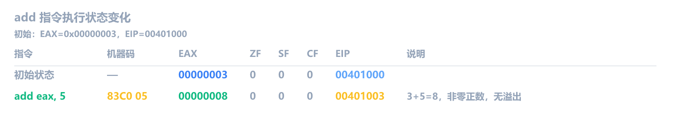

再来一个，假设 EAX = `0xFFFFFFFF`（32 位最大无符号数）：

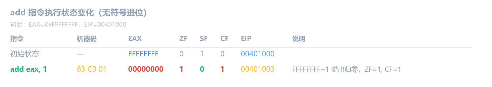

`0xFFFFFFFF + 1 = 0x100000000`，但 EAX 只有 32 位，高位被丢弃，结果变成 `0x00000000`。加法在最高位产生了进位 -> CF=1。

再看 OF 和 PF，假设 EAX = `0x7FFFFFFF`（32 位有符号最大正数）：

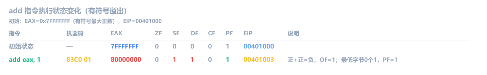

- **OF=1**：两个正数相加，结果的最高位变成了 1（负数），正负号反了，说明有符号溢出
- **PF=1**：结果的最低字节是 `0x00`（二进制 `00000000`，0 个 1，0 算偶数），所以 PF=1
- **CF=0**：加法过程没有进位出去，CF 不受影响

## sub：减法

```asm {4}
sub eax, 5                  ; 寄存器 - 立即数
sub eax, ebx                ; 寄存器 - 寄存器
sub eax, dword ptr [ebp-4]  ; 寄存器 - 内存
sub dword ptr [ebp-4], 1    ; 内存 - 立即数
sub dword ptr [ebp-4], eax  ; 内存 - 寄存器
```

`sub` 计算 `目的操作数（左边）- 源操作数（右边）`，结果存入目的操作数。**影响所有 6 个标志位**。操作数规则和大小前缀省略规则同 `add`。

假设 EAX = `0x00000003`，EIP = `00401000`：

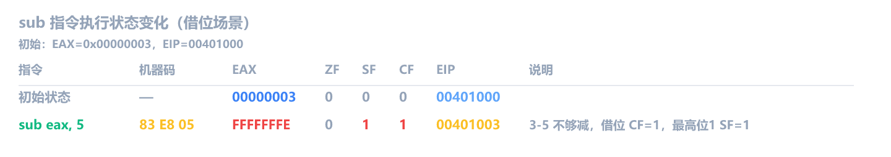

3 减 5，不够减，向高位借位 -> CF=1。结果 `0xFFFFFFFE` 的最高位是 1 -> SF=1。

> [!TIP] CF 到底怎么算出来的？
>
> - **加法**：竖式加法的进位，最高位有进位就 CF=1
> - **减法**：竖式减法的借位，不够减要借位就 CF=1
>
> 硬件实现上，CPU 没有减法器，`sub` 实际执行 `a + (~b + 1)`（加上减数的补码），然后看加法器的进位输出取反作为 CF。但作为使用者，记住"加法看进位，减法看借位"就行。

假设 EAX = `0x00000005`：

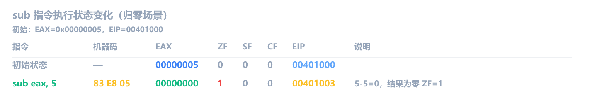

5-5=0，结果为零 -> ZF=1。刚好够减，不需要借位 -> CF=0。

再看 OF，假设 EAX = `0x80000000`（32 位有符号最小负数）：

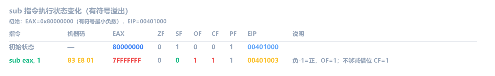

- **OF=1**：`0x80000000` 是有符号最小负数（-2147483648），减 1 变成 `0x7FFFFFFF`（最大正数），负数减正数变成了正数，正负号反了 -> 有符号溢出
- **CF=1**：不够减要借位

## inc / dec：+1 / -1

```asm
inc eax                     ; 寄存器 +1
dec ecx                     ; 寄存器 -1
inc dword ptr [ebp-4]       ; 内存 +1
```

> [!WARNING] 单操作数指令不能用立即数
> `inc`/`dec` 是单操作数指令，操作数只能是寄存器或内存。`inc 5` 没有意义，你没法给常数加 1。

和 `add eax, 1` / `sub eax, 1` 几乎一样，**但 inc/dec 不影响 CF**。这是一个重要细节：CF 保持之前的值不变。其他标志位（ZF/SF/OF/PF/AF）正常更新。

> [!TIP] 为什么 inc/dec 不影响 CF？
> 在循环里经常需要 dec 计数器，但同时要保留上一条 `cmp` 设置的 CF。如果 dec 改了 CF，循环条件就被破坏了。所以 CPU 设计者故意让 inc/dec 不动 CF。

假设 EAX = `0x00000009`，CF = `1`（之前某条指令设置的）：

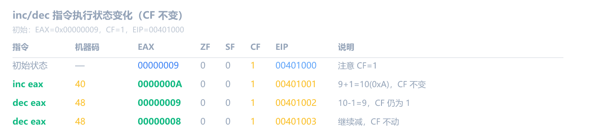

注意 EIP 每次只前进 1 字节（inc/dec 通常编码很短），不像 `add eax, 1` 要更多字节。

假设 EAX = `0x00000001`：

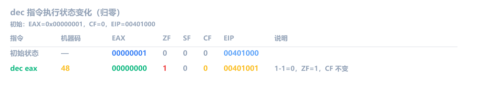

再假设 EAX = `0x00000000`：

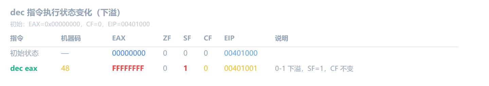

两个场景中 CF 始终不变。注意 0-1 下溢到 `0xFFFFFFFF` 时 SF=1，但 CF 仍然不动。

OF 和 PF 同理，假设 EAX = `0x7FFFFFFF`：

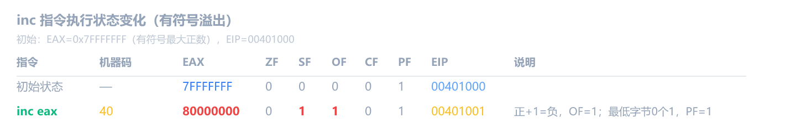

- **OF=1**：有符号最大正数 +1 变成负数，正负号反了
- **PF=1**：结果的最低字节 `0x00`（0 个 1），CF 不变

## imul：乘法

`imul` 有三种形式，操作数规则各不相同：

```asm
imul ebx                     ; 单操作数：EDX:EAX = EAX * ebx
imul dword ptr [ebp-4]       ; 单操作数：EDX:EAX = EAX * 内存
imul eax, ebx                ; 双操作数：eax = eax * ebx
imul eax, dword ptr [ebp-4]  ; 双操作数：eax = eax * 内存
imul eax, ebx, 5             ; 三操作数：eax = ebx * 5
imul eax, dword ptr [ebp-4], 3 ; 三操作数：eax = 内存 * 3
```

操作数限制：

- **单操作数**：固定用 EDX:EAX 存结果，乘数可以是寄存器或内存
- **双操作数**：目标（第一个）只能是寄存器，源可以是寄存器、内存或立即数
- **三操作数**：目标只能是寄存器，源可以是寄存器或内存，第三个只能是立即数

> [!NOTE] 为什么单操作数 imul 结果要放在 EDX:EAX？
> 两个 32 位数相乘最多产生 64 位结果，所以需要两个寄存器来装，低 32 位存 EAX，高 32 位存 EDX。
>
> 比如 `EAX = 0x00000002`，`EBX = 0x80000000`，`imul ebx` 的结果是 `0x0000000100000000`（64 位），EDX = `0x00000001`，EAX = `0x00000000`。

> [!TIP] 双操作数和三操作数最常用
> 这两种形式结果只放在目标寄存器（高 32 位丢弃），逆向中**双操作数和三操作数最常见**。

**影响标志位**：结果超过 32 位范围时 OF=1、CF=1，否则 OF=0、CF=0。其他标志位未定义（值不确定，不要依赖）。

假设 EAX = `0x00000006`，EBX = `0x00000007`：

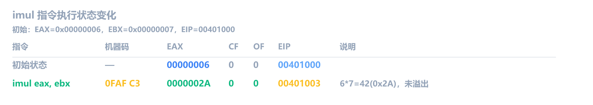

ZF/SF/PF 标记为 `?`，因为 imul 双操作数形式下这些标志位**未定义**。它们的值不确定，可能根据不同的 CPU 架构、内核实现甚至执行上下文而有所不同。因此，绝对不能依赖它们来进行后续的条件跳转（如 `jz`、`js` 等）。imul 只保证 CF 和 OF 是可靠的：结果超过 32 位范围时 CF=1、OF=1，否则都为 0。

再来看有符号的例子，假设 EAX = `0xFFFFFFFE`（有符号解读为 -2），EBX = `0x00000003`：

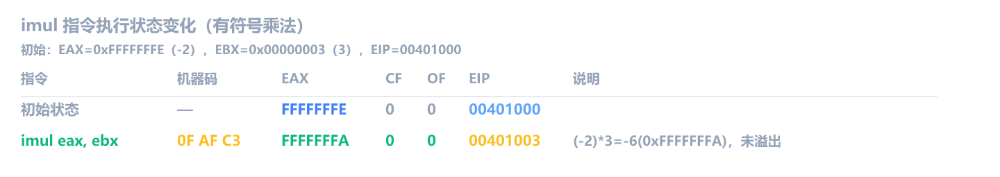

`imul` 把操作数当有符号数处理：(-2) \* 3 = -6，结果 `0xFFFFFFFA` 正好是 -6 的补码表示。CF=0、OF=0，说明没有溢出。

> [!NOTE] 同一串二进制，两种解读
> 假设是 4 位二进制运算，`1111` 无符号解读是 15，有符号补码解读是 -1。乘以 `0011`（3）：
>
> - **无符号**：15 \* 3 = 45，二进制 `0010 1101`，低 4 位是 `1101`（十进制 13）
> - **有符号**：-1 \* 3 = -3，二进制补码 `1111 1101`，低 4 位也是 `1101`（十进制 -3 的补码）
>
> 低 4 位完全一样，CPU 根本不区分有符号和无符号，同一套电路算出同一串 0 和 1，由你决定怎么解读。

乘法在逆向中**不常直接出现**，Release 模式下编译器更爱用移位和 `lea` 替代乘法。但**如果你用 Debug 模式编译，编译器不做优化，乘法全部原样保留**。比如 `x * 3` 在 Debug 下就是 `imul eax, dword ptr [x], 3`，只有 Release 模式才会变成 `lea eax, [ecx+ecx*2]`。

第四章讲过 `lea` 能做算术，下面是 **Release 模式**下编译器的典型优化结果：

| C 代码   | Debug（未优化）               | Release（优化后）                         |
| -------- | ----------------------------- | ----------------------------------------- |
| `x * 2`  | `shl eax, 1`                  | `shl eax, 1`                              |
| `x * 3`  | `imul eax, dword ptr [x], 3`  | `lea eax, [eax+eax*2]`                    |
| `x * 4`  | `shl eax, 2`                  | `shl eax, 2`                              |
| `x * 5`  | `imul eax, dword ptr [x], 5`  | `lea eax, [eax+eax*4]`                    |
| `x * 8`  | `shl eax, 3`                  | `shl eax, 3`                              |
| `x * 9`  | `imul eax, dword ptr [x], 9`  | `lea eax, [eax+eax*8]`                    |
| `x * 37` | `imul eax, dword ptr [x], 37` | `imul eax, dword ptr [x], 37`（才用乘法） |

表中 `lea eax, [eax+eax*2]` 就是第四章学的 `lea` 做算术，假装方括号不存在，算 `eax + eax*2 = eax*3`。`shl`（左移）是下一章的内容，原理是左移 N 位等于乘以 2 的 N 次方。

小常数乘法在 Release 下几乎全被优化掉了。看到 `imul` 往往意味着乘数比较大，或者是 Debug 模式没开优化，逆向真实软件（都是 Release 编译）时，优化后的形态才是你主要会遇到的。

## MUL：无符号乘法

`imul` 做有符号乘法，`mul` 做无符号乘法。形式只有一种：单操作数：

```asm
mul ebx                     ; EDX:EAX = EAX * ebx（无符号）
```

操作数可以是寄存器或内存，不能是立即数（`mul 5` 不合法）。被乘数固定是 EAX，不需要写出来。

操作数大小不同，被乘数和结果的存放位置也不同：

| 操作数大小 | 被乘数 | 结果存哪 |
| ---------- | ------ | -------- |
| 8 位       | AL     | AX       |
| 16 位      | AX     | DX:AX    |
| 32 位      | EAX    | EDX:EAX  |

和 `imul` 单操作数形式一样，乘积的高半部分存入 EDX。区别在于 `mul` 把操作数当成**无符号数**处理。

为什么单独讲？因为逆向中 `imul` 远比 `mul` 常见（编译器默认生成有符号运算），但偶尔会在大小计算、长度计算、哈希算法中碰到 `mul`。看到它要知道怎么回事。

假设 EAX = `0xFFFFFFFF`（无符号 4294967295），EBX = `0x00000002`，EDX = `0x00000000`：

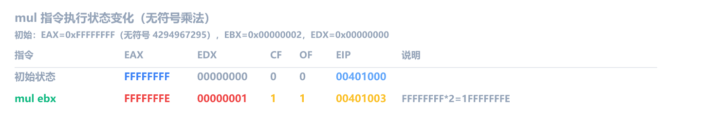

计算过程：`0xFFFFFFFF × 2 = 0x1FFFFFFFE`。低 32 位 `0xFFFFFFFE` 存入 EAX，高 32 位 `0x00000001` 存入 EDX。

**标志位**：乘法后如果高位部分（EDX）非零，CF=1、OF=1，表示结果超出了单个寄存器的范围。其他标志位（ZF/SF/PF/AF）**未定义**，不要依赖。

## MUL vs IMUL 对比

|          | MUL                   | IMUL                         |
| -------- | --------------------- | ---------------------------- |
| 操作数   | 只有无符号            | 有符号（但也可算无符号小数） |
| 形式     | 只有单操作数          | 单/双/三操作数               |
| 结果     | EDX:EAX（高位不丢弃） | 双/三操作数只存低位          |
| 常见程度 | 少见                  | 非常常见                     |

实际逆向中，碰到 `mul` 的场景不多。但遇到时别慌，它就是无符号版的 `imul`，读 EDX:EAX 就行。

## idiv / div：除法

```asm
idiv ebx                    ; 有符号除法
div ebx                     ; 无符号除法
```

和 `mul` 一样，除法也是单操作数，操作数是除数（寄存器或内存，不能是立即数），被除数固定用 `EDX:EAX`。

- **被除数**：固定用 `EDX:EAX`（64 位，高 32 位在 EDX，低 32 位在 EAX）
- **商**：存入 EAX
- **余数**：存入 EDX

除法在逆向中出现频率不高，而且用法比较死板。记住**商在 EAX、余数在 EDX**就够了，遇到再查。

做除法前通常要先**符号扩展**，把 EAX 的符号位扩展到 EDX：

```text
cdq                         ; 把 EAX 符号扩展到 EDX:EAX
idiv ecx                    ; 然后 IDIV
```

`cdq`（Convert Double to Quad），如果 EAX 最高位是 1（负数），EDX 变成 `0xFFFFFFFF`；如果最高位是 0（正数），EDX 变成 `0x00000000`。

**为什么必须 `cdq`？** 除法的被除数是 `EDX:EAX` 共 64 位。如果你忘了 `cdq`，EDX 里可能残留着之前某条指令留下的随机值。比如 EAX = `-20`（`0xFFFFFFEC`），EDX 里残留 `0x00000005`，那 `idiv` 的被除数就变成 `0x00000005FFFFFFEC`，一个巨大的正数，除出来的商完全错误。`cdq` 就是把 EDX 清干净，保证被除数的符号正确。

假设 EAX = `0x00000014`（20），ECX = `0x00000003`（3），EDX = `0x00000000`，EIP = `00401000`：

```text
指令         EAX         EDX         ZF  CF  EIP       说明
─────────────────────────────────────────────────────────────────
初始状态     00000014    00000000    0   0   00401000
cdq          00000014    00000000    0   0   00401001  正数，EDX 扩展为 0
idiv ecx     00000006    00000002    ?   ?   00401003  20/3=商6余2
```

这里 EDX 本来就是 0，所以 `cdq` 没有实质变化。但如果之前某条指令把 EDX 改成了别的值，不加 `cdq` 就会除错。

**注意**：除法不影响 ZF/SF/CF/OF（它们是未定义的）。另外如果除以 0 或者商超过 32 位范围，CPU 会触发异常（程序崩溃）。

## 标志位深入：用案例理解 CF/ZF/SF/OF/PF

上一节回顾了五个关键标志位的含义，现在用实际案例来观察每个标志位的变化。

### 正常案例：add/sub 后标志位按预期变化

先看一个简单的例子，建立基本感觉：

| 指令         | EAX 变化 | CF   | ZF   | SF   | OF   | PF   |
| ------------ | -------- | ---- | ---- | ---- | ---- | ---- |
| `mov eax, 5` | 0 -> 5   | 不变 | 不变 | 不变 | 不变 | 不变 |
| `sub eax, 3` | 5 -> 2   | 0    | 0    | 0    | 0    | 0    |
| `sub eax, 2` | 2 -> 0   | 0    | 1    | 0    | 0    | 1    |

要点：**mov 不改任何标志位**。sub 2-2=0 所以 ZF=1，结果的低字节是 `0x00`（零个 1，零算偶数）所以 PF=1。注意 PF 只看结果的最低字节，不看全部 32 位。

### 注意 1：CF 和 OF 互相独立

这是最容易搞混的地方。CPU 做一次运算，**同时设置 CF 和 OF**，两者完全独立。

- **CF 的判断规则**：加法看进位，最高位有没有进位出去；减法看借位，不够减有没有借位
- **OF 的判断规则**：看符号位。两个正数相加结果变成了负数，或者两个负数相加结果变成了正数 -> OF=1。说明结果超出了 32 位有符号数的范围，正负号反了

用 8 位 AL 寄存器举例（心算就能验证）：

| 运算          | 结果   | CF  | OF  | 怎么理解                                                   |
| ------------- | ------ | --- | --- | ---------------------------------------------------------- |
| `0xFF + 1`    | `0x00` | 1   | 0   | 有进位 CF=1；有符号：-1+1=0 正常 OF=0                      |
| `0x7F + 1`    | `0x80` | 0   | 1   | 无进位 CF=0；有符号：+127+1=-128，两个正数加出负数 OF=1    |
| `0x80 + 0x80` | `0x00` | 1   | 1   | 有进位 CF=1；有符号：-128+(-128)=+0，两个负数加出正数 OF=1 |
| `0x01 + 1`    | `0x02` | 0   | 0   | 无进位 CF=0；有符号：正+正=正，正常 OF=0                   |

第二行展开：

```text
   0x7F = 0111 1111  (无符号 127，有符号 +127)
+     1 = 0000 0001
───────────────────
   0x80 = 1000 0000  (无符号 128，有符号 -128)
```

加法过程没有进位出去 -> CF=0。但两个正数相加得到了负数（符号位从 0 变成 1）-> OF=1。

**注意**：很多人以为"溢出就是 CF=1"。错。CF 看进位/借位，OF 看结果的正负号和操作数是否一致，它们互相独立，可以同时为 1。

### 注意 2：sub eax, eax 的标志位

| 指令           | EAX 变化    | CF  | ZF  | SF  | OF  |
| -------------- | ----------- | --- | --- | --- | --- |
| `sub eax, eax` | 任意值 -> 0 | 0   | 1   | 0   | 0   |

自己减自己，结果一定是 0。不管 EAX 原来是什么值，也不管执行前标志位是什么，执行后一定变成：**ZF=1**（结果为 0）、**CF=0**（同数相减不需要借位）、**SF=0**、**OF=0**。

### 注意 3：PF 数的是 1 的个数，不是数值奇偶

| 运算                  | 结果（二进制）       | 1 的个数 | PF  |
| --------------------- | -------------------- | -------- | --- |
| `add al, 1` 从 `0x02` | `0x03` = `0000 0011` | 2 个     | 1   |
| `add al, 1` 从 `0x01` | `0x02` = `0000 0010` | 1 个     | 0   |

**注意**：`0x03` 是奇数但 PF=1（偶数个 1），`0x02` 是偶数但 PF=0（奇数个 1）。PF 跟数值的奇偶**没有任何关系**，它只看二进制中 1 的个数。

### 注意 4：inc/dec 不改 CF

| 指令         | CF 变化  | 为什么                 |
| ------------ | -------- | ---------------------- |
| `add eax, 1` | 更新     | add 正常更新所有标志位 |
| `inc eax`    | **不变** | inc 故意保留 CF        |

为什么？因为循环里经常用 `dec ecx` + `jne` 计数，或者用 `inc` 遍历数组下标。如果它们改了 CF，就会破坏循环外面对 CF 的依赖。

**实操验证**：在 x64dbg 里试这个序列：

1. `mov eax, 0` -> `add eax, 1` -> 看 CF=0
2. `mov eax, 0` -> `inc eax` -> 看 CF（没变，还是之前的值）
3. `mov eax, 0xFFFFFFFF` -> `add eax, 1` -> 看 CF=1
4. `mov eax, 0xFFFFFFFF` -> `inc eax` -> 看 CF（没变！虽然溢出了）

## 练习

1. 依次执行以下指令，填写跟踪表。初始状态 EAX = `0x0000000A`，EBX = `0x00000003`，CF = `0`。

   ```asm
   add eax, ebx
   sub eax, 5
   inc eax
   ```

   > [!NOTE]- 参考答案
   >
   > ```text
   > 指令          EAX         ZF  SF  CF  说明
   > ──────────────────────────────────────────────────────
   > 初始状态      0000000A    0   0   0
   > add eax, ebx  0000000D    0   0   0   10+3=13(0xD)
   > sub eax, 5    00000008    0   0   0   13-5=8
   > inc eax       00000009    0   0   0   8+1=9，CF 不变
   > ```
   >
   > 最终 EAX = `0x00000009`。

2. 初始 EAX = `0x7FFFFFFF`（32 位有符号最大正数，即 2147483647）。执行以下指令后，EAX 变成什么？OF 是 0 还是 1？

   ```asm
   add eax, 1
   ```

   > [!NOTE]- 参考答案
   >
   > EAX = `0x80000000`，OF = `1`。
   >
   > `0x7FFFFFFF` 是有符号 32 位能表示的最大正数。加 1 后变成 `0x80000000`，在有符号解读下这是 `-2147483648`。从正数变成了负数，这是**有符号溢出**，所以 OF=1。
   >
   > 同时 SF 从 0 变成了 1（结果最高位是 1），CF=0（加法没有产生进位）。

3. 初始 EAX = `0x00000000`，CF = `1`。执行以下指令后，CF 是什么？

   ```asm
   dec eax
   ```

   如果换成 `sub eax, 1`，CF 又是什么？

   > [!NOTE]- 参考答案
   >
   > - `dec eax` 后 CF = **1**（不变）。`dec` 不影响 CF。虽然 0 减 1 下溢到了 `0xFFFFFFFF`，但 CF 保持原值 1。
   > - `sub eax, 1` 后 CF = **1**。0 减 1 不够减，借位了，所以 CF=1。
   >
   > 这个例子里 CF 恰好一样，但如果初始 CF=0 呢？`dec` 后 CF 还是 0，`sub` 后 CF 变成 1。这就是 `inc`/`dec` 保留 CF 的意义：不破坏之前的进位状态。

4. 初始状态 EAX = `0x00000014`（20），EBX = `0x00000003`，EDX = `0x00000000`，EIP = `00401000`。手动跟踪以下指令，写出每一步的 EAX、EDX、ZF、CF：

   ```text
   00401000  imul eax, ebx
   00401003  add eax, 2
   00401006  cdq
   00401007  idiv ebx
   ```

   > [!NOTE]- 参考答案
   >
   > ```text
   > 指令              EAX         EDX         ZF  CF  EIP       说明
   > ─────────────────────────────────────────────────────────────────────────
   > 初始状态          00000014    00000000    0   0   00401000
   > imul eax, ebx    0000003C    00000000    ?   0   00401003  20*3=60(0x3C)
   > add eax, 2       0000003E    00000000    0   0   00401006  60+2=62(0x3E)
   > cdq              0000003E    00000000    0   0   00401007  符号扩展，正数所以 EDX=0
   > idiv ebx         00000014    00000002    ?   ?   00401009  62/3=商20(0x14)余2
   > ```
   >
   > 最终 EAX = `0x00000014`（20，即商），EDX = `0x00000002`（余数）。
   >
   > `idiv` 的 ZF 和 CF 是未定义的（值不可靠，取决于 CPU 实现），所以标为 `?`。

5. 假设 EAX=10, EBX=3, 依次执行以下指令，预测每一步的 EAX 和 CF/ZF/SF/OF：

   | 指令           | EAX | CF  | ZF  | SF  | OF  |
   | -------------- | --- | --- | --- | --- | --- |
   | `sub eax, ebx` | ?   | ?   | ?   | ?   | ?   |
   | `sub eax, ebx` | ?   | ?   | ?   | ?   | ?   |
   | `add eax, 7`   | ?   | ?   | ?   | ?   | ?   |
   | `sub eax, eax` | ?   | ?   | ?   | ?   | ?   |

   先自己算，再用 x64dbg 单步验证。
