上一章学了 `add`、`sub`、`and`、`xor` 这些算术和逻辑指令。它们会"算"，但不会"判断"。算完的结果留在寄存器和标志位里，没有下文。这章学**比较指令** `cmp`/`test` 和**跳转指令** `jmp`/`je`/`jne`/`jg`/`jl` 等，让程序能根据结果走不同的路。

所有条件判断，在汇编层面都是同一个三步流程：

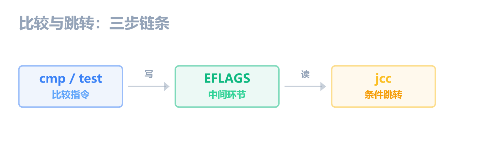

**第 1 步：cmp / test（比较）** 本质是减法 / AND，不存结果，只更新 EFLAGS 里的标志位。

**第 2 步：EFLAGS（标志位寄存器）** ZF、SF、CF、OF 等标志位记录了比较结果。

**第 3 步：jcc（条件跳转）** 读取 EFLAGS，满足条件就跳，不满足就往下走。

这个三步链条是逆向工程**最核心的知识**。你在 x64dbg 里看到的绝大多数代码，本质上都是"比较 -> 跳转"的反复组合。第一章你 NOP 掉的 `test eax, eax` + `jne`，就是这条链条的实例。

## cmp：比较

```asm
cmp eax, 0x64               ; 寄存器 vs 立即数
cmp eax, ebx                ; 寄存器 vs 寄存器
cmp dword ptr [ebp-4], 0    ; 内存 vs 立即数
cmp dword ptr [ebp-4], eax  ; 内存 vs 寄存器
```

`cmp` 的本质是**减法**，计算 `目的操作数（左边）- 源操作数（右边）`，但**不存储结果**，只根据差值更新 EFLAGS。

和 `sub` 的唯一区别：`sub` 把差值存回目的操作数，`cmp` 算完就扔，目的操作数不变。

**影响所有 6 个标志位**：ZF、SF、CF、OF、PF、AF。

操作数规则同第五章 add，禁止内存 vs 内存，禁止立即数做目的操作数。

### 三种情况的跟踪

假设 EAX = `0x64`（十进制 100），EIP = `00401000`：

**场景 1：相等（EAX == 0x64）**

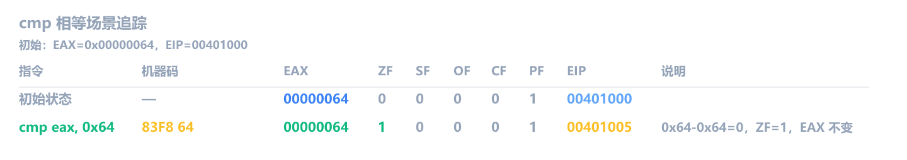

- 差值 = 0 -> ZF=1（零标志置位）
- 结果为正数 -> SF=0
- 没有借位 -> CF=0
- **相等时 ZF=1**，这是 `cmp` 最常见的结果

**场景 2：大于（EAX > 源操作数）**

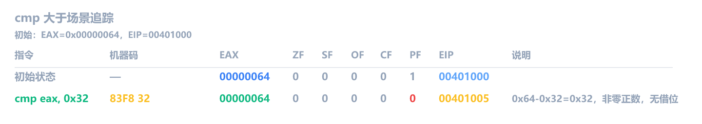

- 差值 = 0x32（50）-> 非零 -> ZF=0
- 结果为正数 -> SF=0
- 没有借位 -> CF=0
- **三个关键标志位全为 0**，表示 eax 更大

**场景 3：小于（EAX < 源操作数）**

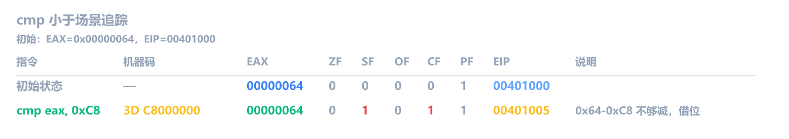

- 0x64 减 0xC8（200）不够减 -> 借位 -> CF=1
- 结果 = 0xFFFFFF9C（-0x64 的补码）-> 最高位为 1 -> SF=1
- 非零 -> ZF=0
- **CF=1 表示无符号运算借位，SF=1 表示结果为负数**

> [!IMPORTANT]
> `cmp a, b` 之后，判断大小的方法：
>
> **无符号比较**（用 CF）：
>
> - ZF=1：两个数相等
> - ZF=0 且 CF=0：a 大于 b
> - CF=1：a 小于 b
>
> **有符号比较**（用 SF 和 OF）：
>
> - ZF=1：两个数相等
> - SF=OF 且 ZF=0：a 大于 b
> - SF≠OF：a 小于 b

## test：测试

```asm
test eax, eax               ; 寄存器 vs 寄存器（检查是否为零）
test eax, 0x80              ; 寄存器 vs 立即数（检查某一位）
test dword ptr [ebp-4], 0   ; 内存 vs 立即数
```

`test` 的本质是**按位与（AND）**，计算 `目的操作数（左边）& 源操作数（右边）`，但**不存储结果**，只根据 AND 的结果更新 EFLAGS。

和 `and` 的唯一区别：`and` 把结果存回目的操作数，`test` 算完就扔，目的操作数不变。

操作数规则同第五章 add，禁止内存 vs 内存，禁止立即数做目的操作数。

**影响标志位**：ZF/SF/PF 更新，**CF=0，OF=0**（和 `and` 一样，逻辑指令永远清零这两个）。

### 用法 1：检查零值

`test eax, eax` 是逆向中**出现频率最高**的指令之一。它用 eax 和自己做 AND，一个数和自己 AND，结果还是自己。所以这个指令的实际效果是：**根据 eax 的值更新标志位，但不改变 eax**。

`test eax, eax` 对不同 EAX 值的标志位（执行后变化）：

| EAX          | 指令            | 标志位（执行后） | 含义                         |
| ------------ | --------------- | ---------------- | ---------------------------- |
| `0x00000000` | `test eax, eax` | ZF=1             | eax == 0                     |
| `0x00000064` | `test eax, eax` | ZF=0, SF=0       | eax != 0，正数               |
| `0xFFFFFFFF` | `test eax, eax` | ZF=0, SF=1       | eax != 0，负数（最高位为 1） |

**eax 为零时 ZF=1，非零时 ZF=0**。逆向里 `test eax, eax` 后面通常紧跟 `je` 或 `jne`，这两个经常是一组出现，专门拿来判断 `eax` 是不是 0。

假设 EAX = `0x00000000`，EIP = `00401000`：

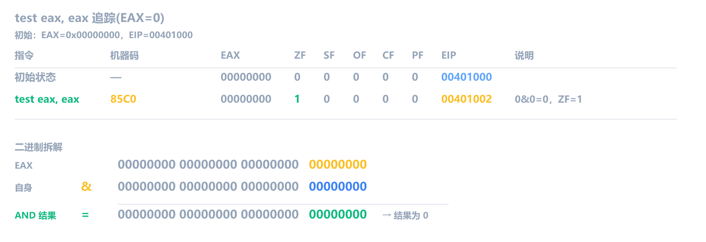

这里 `eax = 0`，`test eax, eax` 的结果还是 `0`。放到 C 里看，就是 `if (eax == 0)` 这条分支成立。所以后面如果接 `je`，程序就会跳到"eax 为 0"的那条分支；如果接 `jne`，就不会跳，而是继续往下执行。

EAX = `0x00000005`：

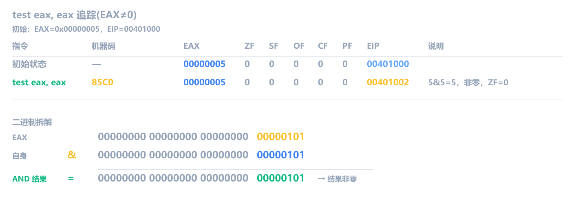

这里 `eax` 非零，`test eax, eax` 的结果也不是 `0`。放到 C 里看，就是 `if (eax != 0)` 这条分支成立。所以后面如果接 `jne`，程序就会跳到"eax 非 0"的那条分支；如果接 `je`，就不会跳。编译器也正是利用这个固定搭配，把 `if (result == 0)` 编成 `test eax, eax` + `je`，把 `if (result != 0)` 编成 `test eax, eax` + `jne`。

<!-- 📸 截图：x64dbg 中 test eax, eax 在 EAX=0 和 EAX≠0 时的标志位对比 -->

### 用法 2：检查特定位

`test eax, 0x80` 是另一种常见模式。它把 EAX 和掩码 `0x80`（二进制 `1000 0000`，只有 bit 7 是 1）做 AND。AND 的结果只保留两个操作数都是 1 的那些位，所以这条指令的实际效果是：**bit 7 是 1，结果非零（ZF=0）；bit 7 是 0，结果为零（ZF=1）**。

`test eax, 0x80` 对不同 EAX 值的标志位（执行后变化）：

| EAX          | bit 7 | 标志位（执行后） | 含义         |
| ------------ | ----- | ---------------- | ------------ |
| `0x000000AB` | 1     | ZF=0             | bit 7 已设置 |
| `0x0000007F` | 0     | ZF=1             | bit 7 未设置 |
| `0x00000080` | 1     | ZF=0             | bit 7 已设置 |

**bit 7 为 1 时 ZF=0，bit 7 为 0 时 ZF=1**。逆向里这种模式后面通常也是跟 `je` 或 `jne`，用来判断某个标志位是否被设置。

假设 EAX = `0x000000AB`（二进制 `...1010 1011`，bit 7 是 1），EIP = `00401000`：

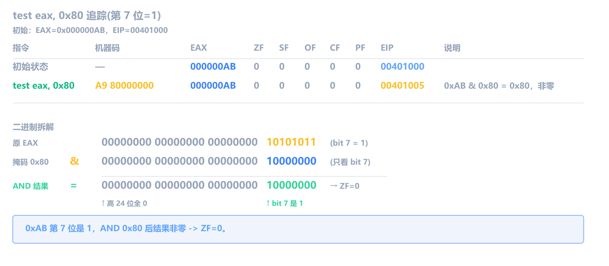

这里 EAX 的 bit 7 是 1，AND 结果 `0x80` 非零。放到 C 里看，就是 `if (eax & 0x80)` 为真。后面如果接 `jne`，程序就会跳到"bit 7 已设置"的那条分支；如果接 `je`，就不会跳。

假设 EAX = `0x0000007F`（二进制 `...0111 1111`，bit 7 是 0），EIP = `00401000`：

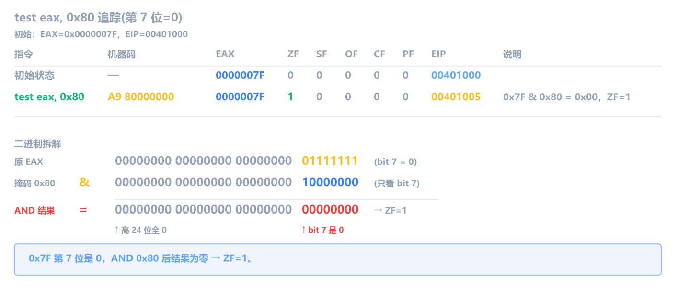

这里 EAX 的 bit 7 是 0，AND 结果为零。放到 C 里看，就是 `if (eax & 0x80)` 为假。后面如果接 `je`，程序就会跳到"bit 7 未设置"的那条分支；如果接 `jne`，就不会跳。这种模式在权限检查中常见，用一个掩码检查某个标志位是否被设置。

## cmp 还是 test？

逆向中看到这两条指令，怎么快速判断它在干嘛？

| 你看到的                          | 大概率在干嘛         | 例子                                     |
| --------------------------------- | -------------------- | ---------------------------------------- |
| `cmp eax, 0x64`                   | 比较两个值的大小     | `if (x == 100)`、`if (x > 100)`          |
| `test eax, eax` + `je/jne`        | 判断返回值是否为零   | `if (strcmp() == 0)`、`if (ptr == NULL)` |
| `test eax, 0x80`                  | 检查某个标志位       | `if (flag & 0x80)`                       |
| `cmp eax, ebx`                    | 比较两个变量         | `if (a == b)`、`if (a > b)`              |
| `cmp dword ptr [ebp-4], 0` + `je` | 判断局部变量是否为零 | `if (x == 0)`                            |

关键区别：`cmp` 后面跟 `je/jne/jg/jl` 等各种条件跳转（比大小、判相等），`test` 后面几乎只跟 `je/jne`（判零）。看到 `test`，就是在问"这个值是不是 0"，字符串比较结果、函数返回值、指针是否为 NULL，都是这个模式。

## jmp：无条件跳转

`jmp` 的操作数是**目标地址**，可以是立即数、寄存器或内存：

```asm
jmp 00402000               ; 立即数（直接跳到地址）
jmp eax                    ; 寄存器（跳到 eax 里存的地址）
jmp dword ptr [ebp-4]      ; 内存（跳到 [ebp-4] 里存的地址）
```

不管操作数是什么，`jmp` 都把目标地址写入 EIP。类似 C 的 `goto`，无条件、不判断，没有条件，不看 EFLAGS。

在 if/else 结构里，`jmp` 经常出现在 if 体的末尾，用来**跳过 else 体**（后面"逆向模式速查"部分会看到）。

`jmp` **不影响任何标志位**。

## 条件跳转：jcc 系列

条件跳转指令读取 EFLAGS 的标志位，**满足条件就跳转，不满足就往下走**（EIP 正常前进到下一条）。它们本身不改任何标志位，也不改任何寄存器，只读，不写。

x86 有几十个条件跳转指令，但**日常逆向只用到 10 个左右**。下面按"使用频率"排列：

| 助记符  | 跳转条件      | 中文含义       | 典型场景                   |
| ------- | ------------- | -------------- | -------------------------- |
| **je**  | ZF=1          | 相等则跳       | `cmp` 后判断相等           |
| **jne** | ZF=0          | 不等则跳       | `cmp` 后判断不等           |
| **jg**  | ZF=0 且 SF=OF | 有符号大于则跳 | `cmp a,b` 后 a>b（有符号） |
| **jge** | SF=OF         | 有符号≥则跳    | `cmp a,b` 后 a≥b（有符号） |
| **jl**  | SF≠OF         | 有符号小于则跳 | `cmp a,b` 后 a<b（有符号） |
| **jle** | ZF=1 或 SF≠OF | 有符号≤则跳    | `cmp a,b` 后 a≤b（有符号） |
| **ja**  | CF=0 且 ZF=0  | 无符号大于则跳 | `cmp a,b` 后 a>b（无符号） |
| **jae** | CF=0          | 无符号≥则跳    | `cmp a,b` 后 a≥b（无符号） |
| **jb**  | CF=1          | 无符号小于则跳 | `cmp a,b` 后 a<b（无符号） |
| **jbe** | CF=1 或 ZF=1  | 无符号≤则跳    | `cmp a,b` 后 a≤b（无符号） |

> [!NOTE]
> 助记符里的 `e` = equal（等于），`n` = not（不），`g` = greater（大于），`l` = less（小于），`a` = above（无符号大于），`b` = below（无符号小于）。
>
> **别名**：`je` 也叫 `jz`（Jump if Zero），`jne` 也叫 `jnz`（Jump if Not Zero）。条件完全一样，都是看 ZF。只是名字不同：`je`/`jne` 强调"相等"，`jz`/`jnz` 强调"结果为零"。x64dbg 里可能显示任意一种，要知道是同一条指令。

**逆向实战中 `je`/`jne` 占 80% 以上的场景**。大多数判断都是"相等/不等"，很少需要区分大于/小于。初学阶段把精力放在 `je`/`jne` 上，遇到其他指令再查表。

### 简易翻译法

面对一条 `jcc` 指令，怎么快速理解它在判断什么？一个简单的方法：

**把助记符翻译成运算符，放在 cmp 的两个操作数之间。**

```asm
cmp  eax, ebx
jcc  <目标>
```

| jcc     | 对应运算符 | 心理翻译                    |
| ------- | ---------- | --------------------------- |
| **je**  | `==`       | `if (eax == ebx) goto 目标` |
| **jne** | `!=`       | `if (eax != ebx) goto 目标` |
| **jg**  | `>`        | `if (eax > ebx) goto 目标`  |
| **jge** | `>=`       | `if (eax >= ebx) goto 目标` |
| **jl**  | `<`        | `if (eax < ebx) goto 目标`  |
| **jle** | `<=`       | `if (eax <= ebx) goto 目标` |

这个方法只适用于 `cmp` 正上方的 `jcc`。`test` 后面几乎只跟 `je`/`jne`，判断的是"是不是 0"，不需要这个翻译法。

举个例子：

```asm
cmp  dword ptr [ebp-8], 0x64
jne  00401050
```

心里翻译：`if ([ebp-8] != 0x64) goto 00401050`。局部变量不等于 0x64 就跳走。

再一个：

```asm
cmp  eax, ecx
jle  00401030
```

心里翻译：`if (eax <= ecx) goto 00401030`。eax 小于等于 ecx 就跳走。

<!-- 🎨 画图：简易翻译法示意图，把 cmp+jcc 翻译成 if 语句 -->

### 完整跟踪：cmp + jne

用三步链条分析一段完整的代码：

```asm
00401000  mov  eax, 0x64
00401005  mov  ebx, 0x64
0040100A  cmp  eax, ebx
0040100C  jne  00401020   ;跳转到  mov  ecx, 0
00401012  mov  ecx, 1
00401017  jmp  00401025
00401020  mov  ecx, 0
00401025  ...
```

这段代码的逻辑：如果 EAX == EBX，ECX = 1；否则 ECX = 0。

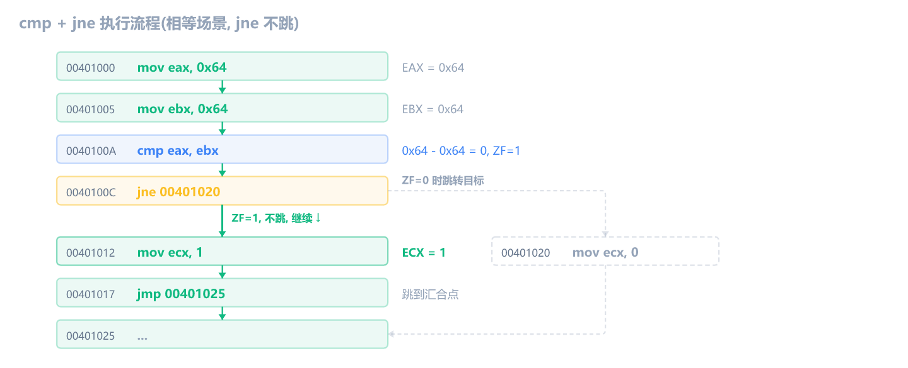

如果把 EBX 改成 `0x32`（EAX != EBX），`cmp` 算出的差值变成 0x32（非零），ZF=0，`jne` 就会跳：

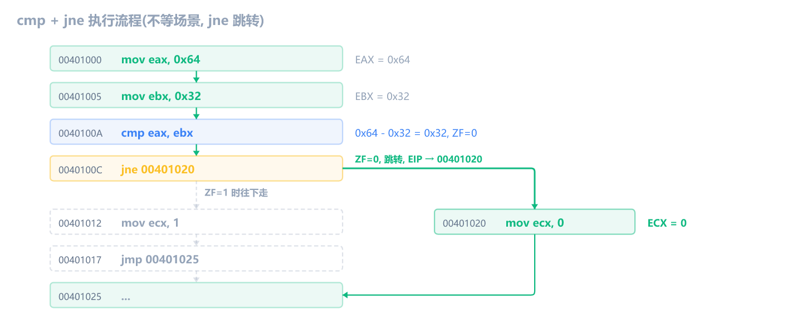

`jne` 跳转后，`mov ecx, 1` 和 `jmp 00401025` 都被跳过，直接执行 `mov ecx, 0`，最终 ECX = 0。

### 完整跟踪：test + jne

回到第一章的代码。`strcmp` 比较两个字符串，相等返回 0，不等返回非零值。返回值在 EAX 里。后面的代码：

```asm
test eax, eax
jne  <Wrong分支>
```

密码正确时，`strcmp` 返回 0，`test eax, eax` 算出 0，ZF=1，`jne` 不跳，走 Correct 分支：

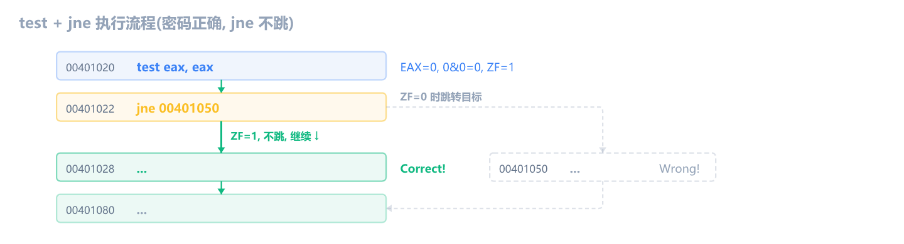

密码错误时，`strcmp` 返回 1，`test eax, eax` 算出 1（非零），ZF=0，`jne` 跳到 Wrong 分支：

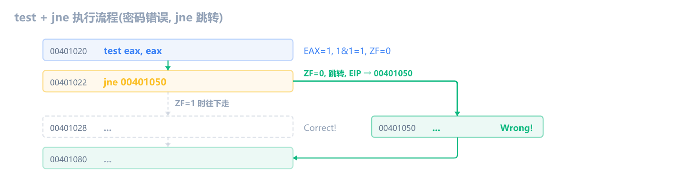

现在你完全理解第一章那个 `test + jne` 了。**NOP 掉 `jne` 后，不管 ZF 是什么值，CPU 都不会跳，永远走 Correct 分支。**

## 逆向模式速查

### if/else

C 代码：

```c
if (eax == 100) {
    ecx = 1;
} else {
    ecx = 0;
}
```

编译后的汇编：

```asm
cmp  eax, 0x64
jne  else_branch
mov  ecx, 1
jmp  end
else_branch:
mov  ecx, 0
end:
```

#### 关键心法

**`jcc` 的跳转方向和 C 的 if 条件相反。**

- C 写的是 `if (eax == 100)`，翻译成"如果等于 100 就执行 if 体"
- 汇编写的是 `jne else_branch`，翻译成"如果不等于 100 就跳到 else"

为什么？因为 CPU 的设计思路是"**不满足条件就跳走**"。满足条件时，不跳，直接往下执行 if 体。不满足时，跳走，去 else 体。

**记忆方法**：看到 `jcc`，把它的条件**取反**，就是 if 的条件。

| 汇编         | jcc 条件 | 取反 -> C 的 if 条件 |
| ------------ | -------- | -------------------- |
| `je` (跳走)  | ==       | **!=**               |
| `jne` (跳走) | !=       | **==**               |
| `jg` (跳走)  | >        | **<=**               |
| `jl` (跳走)  | <        | **>=**               |
| `jge` (跳走) | >=       | **<**                |
| `jle` (跳走) | <=       | **>**                |

也就是说，`jcc` 后面紧跟的代码块就是 if 体（满足条件时执行的部分），`jcc` 跳转目标是 else 体（不满足时执行的部分）。

#### 更多 if/else 变体

**有符号比较：**

```c
if (eax > ebx) { ... } else { ... }
```

```asm
cmp  eax, ebx
jle  else_branch    ; jle = 有符号 ≤，取反得到 >
mov  ecx, 1
jmp  end
else_branch:
mov  ecx, 0
end:
```

**无符号比较：**

```c
if (eax >= ebx) { ... } else { ... }
```

```asm
cmp  eax, ebx
jb   else_branch    ; jb = 无符号 <，取反得到 ≥
mov  ecx, 1
jmp  end
else_branch:
mov  ecx, 0
end:
```

**没有 else 的情况：**

```c
if (eax == 0) {
    eax = 1;
}
```

```asm
cmp  eax, 0
jne  skip
mov  eax, 1
skip:
```

没有 else 时，`jcc` 跳过的就是整个 if 体，末尾不需要 `jmp`。

<!-- 📸 截图：x64dbg 中 if/else 模式的实际代码，标注 cmp/jne/jmp 的位置 -->

### 检查零值

`test eax, eax` + `jne`/`je` 是另一种高频模式。它等价于 C 的 `if (eax == 0)` 或 `if (eax != 0)`。

```c
if (eax == 0) {
    eax = -1;
}
```

```asm
test eax, eax
jne  skip          ; 非零就跳走（取反：if eax == 0 才往下走）
or   eax, 0xFFFFFFFF   ; eax = -1
skip:
```

为什么不用 `cmp eax, 0`？因为 `test eax, eax` 机器码更短（2 字节 vs 5 字节），编译器会优先选 `test`。

| C 代码        | 汇编                | 说明                      |
| ------------- | ------------------- | ------------------------- |
| `if (x == 0)` | `test x, x` + `jne` | 非零跳走 = 等于零才往下走 |
| `if (x != 0)` | `test x, x` + `je`  | 等于零跳走 = 非零才往下走 |
| `if (!x)`     | `test x, x` + `jne` | 同 `x == 0`               |
| `if (x)`      | `test x, x` + `je`  | 同 `x != 0`               |

**逆向时看到 `test reg, reg` + `jne`/`je`，就是在检查那个寄存器是不是 0。**

### 循环

#### 计数循环：条件跳出 + jmp 回跳

```c
for (int i = 3; i > 0; i--) {
    eax += eax;
}
```

编译后：

```asm
00401000  mov  dword ptr [ebp-8], 3
00401007  jmp  00401014
00401009  mov  eax, dword ptr [ebp-8]       ; i--
0040100C  sub  eax, 1
0040100F  mov  dword ptr [ebp-8], eax
00401014  cmp  dword ptr [ebp-8], 0         ; i > 0 ?
00401018  jle  00401028                     ; 不大于 0 就跳出
0040101A  mov  eax, dword ptr [x]           ; eax += eax
0040101D  add  eax, eax
0040101F  mov  dword ptr [x], eax
00401022  jmp  00401009                     ; 跳回 i-- 部分
00401028  ...
```

for 循环的真实编译结构是**三块**：

1. **初始化**（`mov [ebp-8], 3`）-> 跳到条件检查
2. **条件检查**（`cmp` + `jle` 跳出循环）-> 循环体 -> `jmp` 回到递增/递减部分
3. **递增/递减**（`sub eax, 1`）-> 回到条件检查

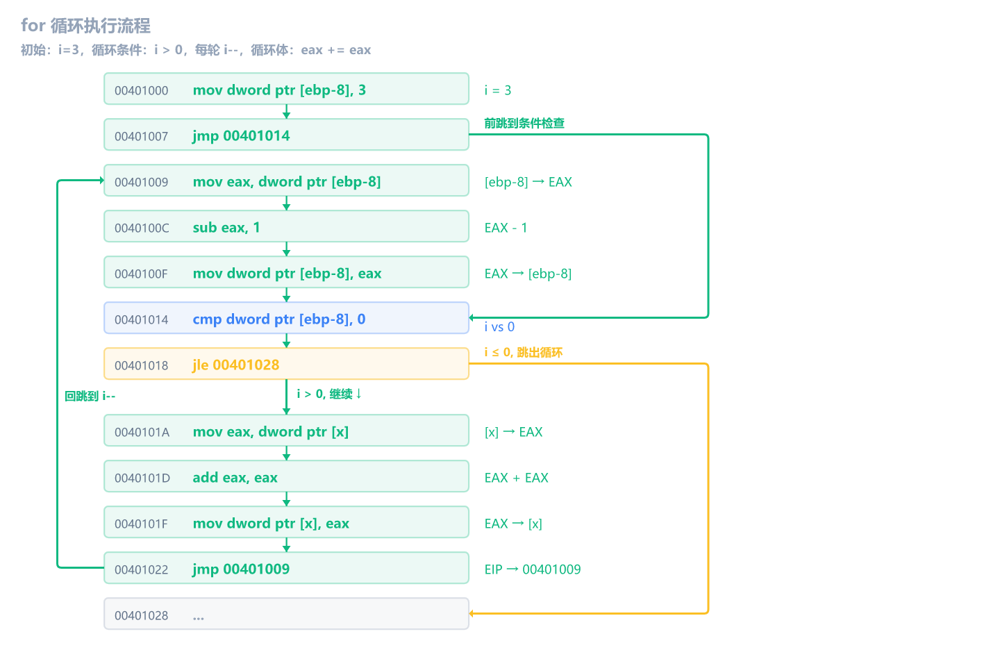

> [!NOTE]
> 逆向中偶尔也会看到简化版的计数循环，编译器把变量优化到寄存器里，直接用 `dec ecx` + `jne` 回跳。但上面这种 `cmp + jle 跳出 + jmp 回跳` 才是 for 循环的标准形态，Debug 模式下一定能看到。

#### 条件循环：jmp 回跳 + 条件跳出

```c
while (eax < 100) {
    eax = eax + 10;
}
```

编译后：

```asm
00401000  cmp  eax, 0x64
00401004  jge  00401014               ; eax >= 100 就跳出
00401006  add  eax, 0xA
0040100C  jmp  00401000               ; 无条件跳回开头
00401014  ...
```

这个结构是：**循环开头检查条件 -> 不满足就跳走（跳出循环）-> 循环体 -> 无条件跳回开头**。

`jge` 的条件是 `SF=OF`（符号标志等于溢出标志）。跟踪时需要同时看 SF 和 OF，两者相等时条件成立，跳走。

**完整跟踪**（假设初始 EAX = `0x50`，即十进制 80）：

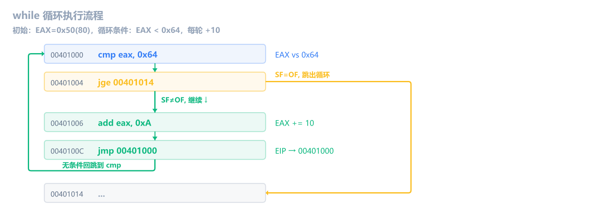

最终 EAX = `0x64`（十进制 100）。循环执行了 2 次（80->90->100），第 3 次检查时 `cmp` 算出差为 0，SF=0、OF=0 -> `SF=OF` 成立，`jge` 跳出循环。

#### 循环模式速查

| C 循环                  | 汇编模式                     | 特征                       |
| ----------------------- | ---------------------------- | -------------------------- |
| `for/while`（向下计数） | `dec ecx` + `jne loop_start` | ECX 递减到 0 停止          |
| `while`（条件循环）     | `jmp 回开头` + `条件跳出`    | 循环末尾 `jmp`，开头 `jcc` |
| `do-while`              | `循环体` + `jcc 回开头`      | 至少执行一次，条件在末尾   |

<!-- 📸 截图：x64dbg 中循环模式的实际代码，标注 jmp 回跳和条件跳出的位置 -->

## 指令对标志位影响总结表

前三章 + 本章的所有指令汇总：

| 指令       | ZF   | SF   | CF       | OF       | 说明                   |
| ---------- | ---- | ---- | -------- | -------- | ---------------------- |
| `mov`      | 不变 | 不变 | 不变     | 不变     | 搬数据，不改任何标志位 |
| `lea`      | 不变 | 不变 | 不变     | 不变     | 算地址，不改任何标志位 |
| `nop`      | 不变 | 不变 | 不变     | 不变     | 空操作                 |
| `add`      | 更新 | 更新 | 更新     | 更新     | 加法                   |
| `sub`      | 更新 | 更新 | 更新     | 更新     | 减法                   |
| `inc`      | 更新 | 更新 | **不变** | 更新     | +1                     |
| `dec`      | 更新 | 更新 | **不变** | 更新     | -1                     |
| `and`      | 更新 | 更新 | **清零** | **清零** | 按位与                 |
| `or`       | 更新 | 更新 | **清零** | **清零** | 按位或                 |
| `xor`      | 更新 | 更新 | **清零** | **清零** | 按位异或               |
| `not`      | 不变 | 不变 | 不变     | 不变     | 按位取反               |
| **`cmp`**  | 更新 | 更新 | 更新     | 更新     | 减法比较，不存结果     |
| **`test`** | 更新 | 更新 | **清零** | **清零** | AND 测试，不存结果     |
| `jmp`      | 不变 | 不变 | 不变     | 不变     | 无条件跳转             |
| `je/jne`   | 不变 | 不变 | 不变     | 不变     | 读 ZF                  |
| `jg/jle`   | 不变 | 不变 | 不变     | 不变     | 读 ZF、SF、OF          |
| `jl/jge`   | 不变 | 不变 | 不变     | 不变     | 读 SF、OF              |
| `ja/jbe`   | 不变 | 不变 | 不变     | 不变     | 读 CF、ZF              |
| `jb/jae`   | 不变 | 不变 | 不变     | 不变     | 读 CF                  |

**记忆规律**：

- **不改标志位**：mov、lea、nop、not、所有跳转指令
- **清零 CF 和 OF**：and、or、xor、test（逻辑指令家族）
- **不改 CF**：inc、dec（保护循环中的进位）
- **全部更新**：add、sub、cmp（算术指令家族）

**所有跳转指令（jmp 和 jcc）都不改标志位。** 它们只读标志位，不写。`cmp`/`test` 只写标志位，不存运算结果。两者通过 EFLAGS 配合工作。

## 练习

1. 初始 EAX = `0x0000000A`（十进制 10），EIP = `00401000`。执行以下指令后，ZF、SF、CF 各是什么？

   ```asm
   cmp eax, 0xA
   ```

   > [!NOTE]- 参考答案
   > ZF=1，SF=0，CF=0。
   >
   > 0xA - 0xA = 0 -> ZF=1（相等）。没有借位，没有负数。

2. 初始 EAX = `0x00000005`（5），EIP = `00401000`。执行以下指令后，ZF、SF、CF 各是什么？

   ```asm
   cmp eax, 0xA
   ```

   > [!NOTE]- 参考答案
   > ZF=0，SF=1，CF=1。
   >
   > 5 - 10：不够减，借位 -> CF=1。结果是 `0xFFFFFFFB`（-5 的补码），最高位 1 -> SF=1。非零 -> ZF=0。

3. 初始 EAX = `0x00000003`，EBX = `0x00000005`。执行 `cmp eax, ebx` 后，ZF、SF、CF、OF 各是什么？

   > [!NOTE]- 参考答案
   > ZF=0，SF=1，CF=1，OF=0。
   >
   > 3 - 5 不够减，借位 -> CF=1。结果 `0xFFFFFFFE`（-2 的补码），最高位 1 -> SF=1。非零 -> ZF=0。两正数相减不会溢出 -> OF=0。

4. 初始 EAX = `0x00000037`。执行 `test eax, 0xF0` 后，ZF 和 SF 各是什么？

   > [!NOTE]- 参考答案
   > ZF=0，SF=0。
   >
   > ```text
   > 0x37 = 0011 0111
   > 0xF0 = 1111 0000
   > AND  = 0011 0000 = 0x30
   > ```
   >
   > 非零 -> ZF=0。结果 0x30 最高位为 0 -> SF=0。

5. 以下每条 jcc 指令，根据当前的标志位判断**跳还是不跳**：

   | 指令         | ZF  | SF  | CF  | OF  | 跳？ |
   | ------------ | --- | --- | --- | --- | ---- |
   | `je target`  | 1   | 0   | 0   | 0   | ?    |
   | `jg target`  | 0   | 0   | 0   | 0   | ?    |
   | `jb target`  | 0   | 0   | 0   | 0   | ?    |
   | `jle target` | 1   | 1   | 0   | 0   | ?    |

   > [!NOTE]- 参考答案
   >
   > | 指令  | 跳？     | 原因                                                        |
   > | ----- | -------- | ----------------------------------------------------------- |
   > | `je`  | **跳**   | je 要求 ZF=1，当前 ZF=1 ✓                                   |
   > | `jg`  | **跳**   | jg 要求 ZF=0 且 SF=OF，当前 ZF=0，SF=OF=0 ✓                 |
   > | `jb`  | **不跳** | jb 要求 CF=1，当前 CF=0 ✗                                   |
   > | `jle` | **跳**   | jle 要求 ZF=1 或 SF≠OF，当前 ZF=1 ✓（只要满足一个条件就跳） |

6. 打开第一章的 CrackMe 程序，找到 `test eax, eax` + `jne` 那个位置。做以下操作：
   1. 在 `jne` 那行设断点（<kbd>F2</kbd>），按 <kbd>F9</kbd> 运行到那里
   2. 在寄存器窗口双击 EAX，手动改成 `0x00000000`
   3. 按 <kbd>F8</kbd> 单步执行 `jne`，它跳了吗？为什么？
   4. 重新运行，这次把 EAX 改成 `0x00000001`
   5. 按 <kbd>F8</kbd> 单步执行 `jne`，它跳了吗？为什么？

   > [!NOTE]- 参考答案
   >
   > 1. EAX = 0 -> `test eax, eax` 使 ZF=1 -> `jne` 要求 ZF=0 -> **不跳**，走 Correct 分支
   > 2. EAX = 1 -> `test eax, eax` 使 ZF=0 -> `jne` 要求 ZF=0 -> **跳**，走 Wrong 分支
   >
   > 这就是手动改标志位来控制程序行为。和 NOP 掉 `jne` 效果类似，但 NOP 是永久修改（改了代码），手动改寄存器是临时修改（下次运行恢复）。

7. 在第一章的 CrackMe 程序里，把 `jne` 改成 `je`（不是 NOP 掉，是改指令）。回答以下问题：
   1. 输入正确密码 "reverse2026"，程序输出什么？
   2. 输入错误密码 "abc"，程序输出什么？
   3. 为什么？

   > [!TIP]
   > `jne` 和 `je` 的机器码只有 1 字节之差，`jne` 是 `75`，`je` 是 `74`。在 x64dbg 里选中 `jne` 那行，按空格键，把 `jne` 改成 `je` 即可。

   > [!NOTE]- 参考答案
   >
   > 1. 输入正确密码 "reverse2026" -> 输出 **Wrong**
   > 2. 输入错误密码 "abc" -> 输出 **Correct**
   > 3. 因为跳转条件被取反了。原来 `jne`（不等就跳到 Wrong），改成 `je` 后变成（相等就跳到 Wrong）。所以密码正确时反而跳到 Wrong，密码错误时不跳，走到 Correct。
