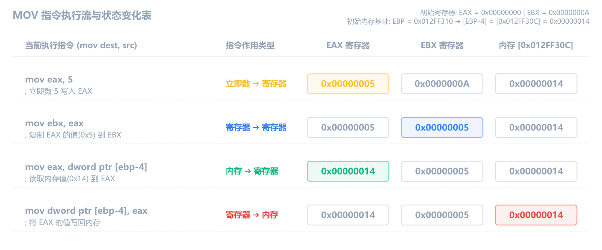
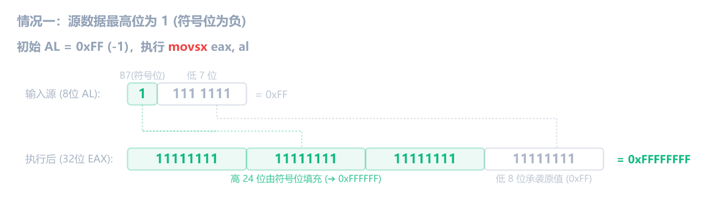
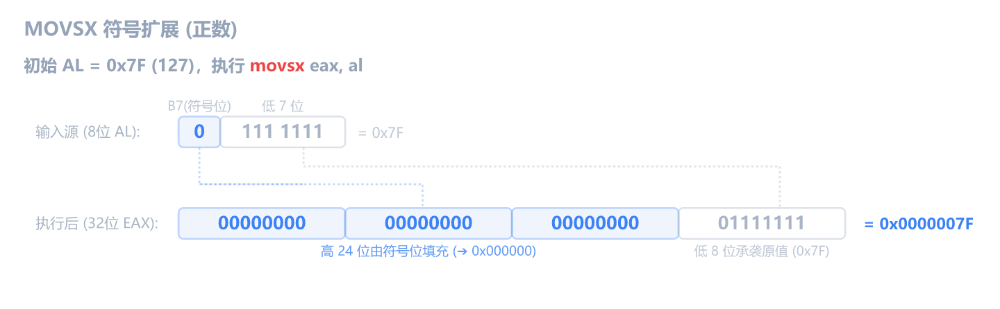
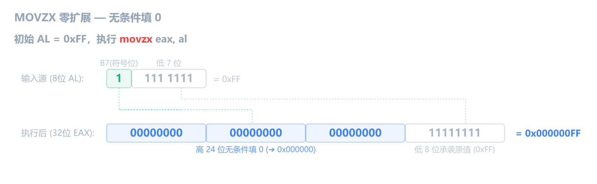
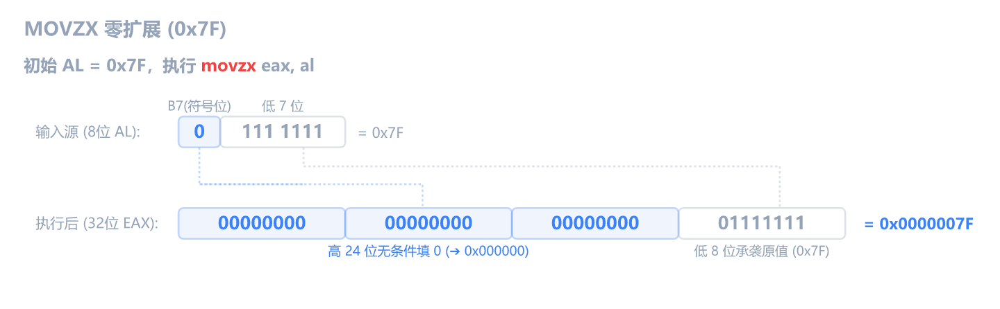
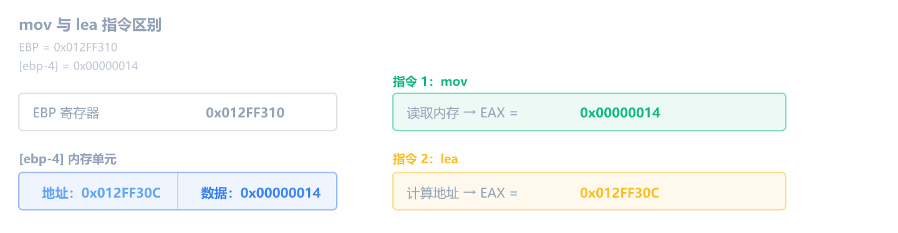
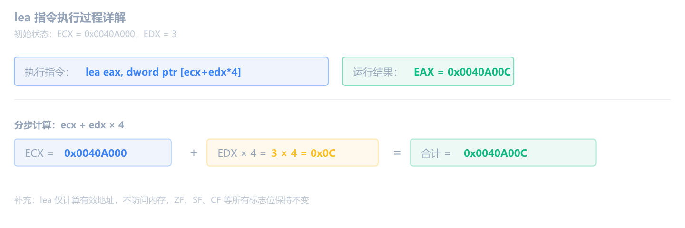

上一章搞懂了内存怎么表示、大小端怎么回事，还生成了一个全 NOP 的练习程序。这章我们学六条和"数据"打交道的指令，全都不改标志位。

## 操作数规则：所有指令共用的规矩

在学具体指令之前，先搞清楚一条基本规则，因为后面**所有双操作数指令**都受它约束。

x86 指令的操作数分三种类型：

| 类型       | 说明                               | 例子                     |
| ---------- | ---------------------------------- | ------------------------ |
| **立即数** | 直接写在指令里的常数值             | `5`、`0xFF`、`0x1234`    |
| **寄存器** | 寄存器里的值                       | `eax`、`ebx`、`cl`       |
| **内存**   | 方括号括起来的地址，指向内存里的值 | `[ebp-4]`、`[ecx+edx*4]` |

两个操作数可以怎么搭配？下面的表格列出了所有允许和禁止的组合：

| ✅ 允许          | ❌ 不允许                             |
| ---------------- | ------------------------------------- |
| 寄存器 <- 立即数 | 内存 <- 内存                          |
| 寄存器 <- 寄存器 | 立即数做目的操作数（如 `mov 5, eax`） |
| 寄存器 <- 内存   |                                       |
| 内存 <- 立即数   |                                       |
| 内存 <- 寄存器   |                                       |

两条禁令的原因：

- **内存 <- 内存**：x86 指令编码只留了一个"内存地址"的位置，装不下两个。这是 CPU 硬件层面的设计限制，所有 x86 指令都遵守，不只是 `mov`。
- **立即数做目的操作数**：`5` 是个常数，你没法往常数里"存"东西，所以立即数只能做源操作数。

> [!WARNING] 内存操作数必须带大小前缀
> 当两个操作数都不是寄存器时（如内存 <- 立即数），汇编器无法推断操作数大小，必须显式写 `byte ptr`、`word ptr` 或 `dword ptr`。写成 `mov [ebp-4], 1` 会报错。如果有一个操作数是寄存器（如 `mov eax, [ebp-4]`），则可以省略，因为寄存器已经隐含了大小。

这些规则适用于本章的 `mov`、`xchg`，以及后续章节的 `add`、`sub`、`cmp`、`test`、`and`、`or`、`xor` 等所有双操作数指令。遇到新指令时不用重新学规则，回来查这张表就行。

## nop：什么都不做

先讲最简单的一条，因为你已经在用了。

```asm
nop                      ; 空操作，CPU 直接跳过
```

NOP 的机器码是 `0x90`。有趣的是，`0x90` 其实是 `XCHG EAX, EAX`（把 EAX 和自己交换）的编码，和自己交换等于什么都没做，所以它天然就是"空操作"。

执行后什么都不变，寄存器不变、内存不变、标志位不变，只有 EIP 前进到下一条。

它的主要用途就是"占位"和"擦除"。第1章你用 `Ctrl+9` 把 `jne` 填充成 NOP，就是用无害的空操作替换掉跳转指令，让那条判断失效。

上一章你用 MASM 生成了一个全 NOP 的 exe，里面 4096 个字节全是 `0x90`，现在你知道这意味着什么了。

## mov：搬数据

`mov` 是最基础也最常用的指令。它把数据从"源"搬到"目的"，**不做计算，不改任何标志位**。

### 五种用法

```asm
mov eax, 5                    ; 立即数 -> 寄存器
mov ebx, eax                  ; 寄存器 -> 寄存器
mov eax, dword ptr [ebp-4]    ; 内存 -> 寄存器
mov dword ptr [ebp-4], 1      ; 立即数 -> 内存
mov dword ptr [ebp-4], eax    ; 寄存器 -> 内存
```

对照上面的操作数规则表，正好覆盖了五种允许的组合。`mov` 不能做的那两种（内存 <- 内存、立即数做目的），也是所有双操作数指令都不能做的。

### 执行后的变化跟踪

假设初始状态：

- EAX = `0`
- EBX = `0x0000000A`
- EBP = `0x012FF310`
- 内存 `[0x012FF30C]` = `0x00000014`



注意几个要点：

- **mov 不改变源操作数**。`mov eax, ebx` 之后 EBX 不变
- **mov 不改变任何标志位**。ZF/SF/CF 全程不变
- **EIP 每次自动前进**到下一条指令的地址

如果需要在两个内存地址之间搬运数据，必须经过寄存器中转：

```asm
mov eax, dword ptr [ebp-8]      ; 先从内存读到寄存器
mov dword ptr [ebp-4], eax      ; 再从寄存器写到内存
```

## MOVSX 和 MOVZX：带扩展的搬数据

普通的 `mov` 只能在**同等大小**的寄存器之间搬数据。但 C 语言经常把 `char`（1 字节）赋给 `int`（4 字节），编译器怎么处理这种"小变大"？答案就是 `movsx` 和 `movzx`。

### MOVSX：符号扩展

`movsx`（Move with Sign-Extension）把小类型提升为大类型，**高位用符号位填充**。

假设 AL = `0xFF`（有符号是 -1）：

```asm
movsx eax, al
```



符号扩展保持数值不变：AL 的最高位是 1，所以 EAX 的高 24 位全填 1。

如果 AL = `0x7F`（有符号是 127）：

```asm
movsx eax, al
```



AL 最高位是 0，高 24 位全填 0。

### MOVZX：零扩展

`movzx`（Move with Zero-Extension）把小类型提升为大类型，**高位全部填 0**。

同样 AL = `0xFF`：

```asm
movzx eax, al
```



不管 AL 的符号位是什么，高位一律填 0，EAX = `0x000000FF`（255）。

如果 AL = `0x7F`：

```asm
movzx eax, al
```



同样高位填 0，EAX = `0x0000007F`（127）。

### 同一个值，两条指令的结果对比

假设 AL = `0xFF`：

| 指令            | EAX 结果     | 十进制 | 怎么来的                |
| --------------- | ------------ | ------ | ----------------------- |
| `movsx eax, al` | `0xFFFFFFFF` | -1     | AL 符号位=1，高位全填 1 |
| `movzx eax, al` | `0x000000FF` | 255    | 高位无条件填 0          |

再假设 AL = `0x7F`（有符号是 127）：

| 指令            | EAX 结果     | 十进制 | 怎么来的                |
| --------------- | ------------ | ------ | ----------------------- |
| `movsx eax, al` | `0x0000007F` | 127    | AL 符号位=0，高位全填 0 |
| `movzx eax, al` | `0x0000007F` | 127    | 高位无条件填 0          |

正数时结果一样，负数时结果不同。

### 什么时候会出现

逆向中最常见的场景是**函数参数传递**。C 的 `char` 或 `short` 做参数时会自动提升为 `int`：

```c
char c = -1;
int x = c;
```

编译器会生成 `movsx eax, al`（signed char）或 `movzx eax, al`（unsigned char）。你在 x64dbg 里看到 `movsx`，就知道源数据是有符号小类型；看到 `movzx`，就是无符号小类型。

## XCHG：交换两个操作数

`xchg` 把两个操作数的值互换：

```asm
xchg eax, ebx                ; 寄存器 ↔ 寄存器
xchg eax, dword ptr [ebp-4]  ; 寄存器 ↔ 内存
```

假设 EAX = `0x00000001`，EBX = `0x00000002`，执行后 EAX = `0x00000002`，EBX = `0x00000001`。

操作数规则和 `mov` 类似，两个操作数不能都是内存。此外 `xchg` 不接受立即数（两边都要能被读和写）。

如果不用 `xchg`，交换两个寄存器需要三条指令（借助第三个寄存器中转，或者用 xor 技巧）。`xchg` 一条搞定。

`xchg` 有个有趣的特殊情况：`xchg eax, eax` 就是把 EAX 和自己交换，等于什么都没做。这条指令的机器码是 `0x90`，正是 NOP。后面讲 NOP 时会提到这一点。

`xchg` 不影响任何标志位（ZF、SF、CF 等全部不变）。

逆向中 `xchg` 不算常见，但偶尔会遇到，知道是交换就行。

## lea：算地址（不读内存）

```asm
lea eax, dword ptr [ebp-4]          ; eax = ebp - 4（算出地址，不读内存）
```

`lea`（Load Effective Address）只计算方括号里的地址值，**不访问内存**。和 `mov` 的区别：

```asm
; 假设 EBP = 0x012FF310，内存 [0x012FF30C] = 0x00000014

mov eax, dword ptr [ebp-4]    ; eax = 0x00000014（读内存内容）
lea eax, dword ptr [ebp-4]    ; eax = 0x012FF30C（算地址本身）
```



`mov` 去内存里取了值，`lea` 只算了地址。相当于 C 里的：

- `mov eax, [ebp-4]` -> `eax = *ptr;`（取值）
- `lea eax, [ebp-4]` -> `eax = &var;`（取地址）

编译器经常用 `lea` 做**快速算术**，因为方括号里可以写乘法和加法：

```asm
lea eax, dword ptr [ecx + edx*4]    ; eax = ecx + edx * 4
```

等价于 C 的 `eax = ecx + edx * 4`，但一条指令搞定，不访问内存，不改标志位。

### 执行后的变化跟踪

假设 ECX = `0x0040A000`，EDX = `3`：



CPU 算了一下 `0x0040A000 + 3*4 = 0x0040A00C`，把结果放进 EAX。没有读内存，没有改标志位。

**看到 `lea` 的窍门**：假装方括号不存在，直接做方括号里面的算术就行了。

## 回到 x64dbg 实操

打开上一章生成的 `nop.exe`，我们来亲手验证每条指令的效果。

### 任务一：观察 mov 改变寄存器

在 NOP 区域第一个 `nop` 上按**空格键**，依次输入：

```asm
mov eax, 0x12345678
mov ebx, eax
mov dword ptr [ebp-4], eax
```

- 回到第一条 `mov eax, 0x12345678` 按 <kbd>F2</kbd> 设断点（行变红）
- 按 <kbd>F9</kbd> 运行到断点
- 看**寄存器窗口**里 EAX 和 EBX 的当前值
- 按 <kbd>F8</kbd> 单步执行 `mov eax, 0x12345678` — EAX 变成 `12345678`（变红）
- 再按 <kbd>F8</kbd> 执行 `mov ebx, eax` — EBX 也变成 `12345678`，EAX 不变
- 再按 <kbd>F8</kbd> 执行 `mov dword ptr [ebp-4], eax` — 切到**内存窗口**，按 <kbd>Ctrl</kbd>+<kbd>G</kbd> 输入 EBP 的值减 4，看那个位置的值有没有变成 `78 56 34 12`（小端序）

### 任务二：验证 mov 不改标志位

重新把 exe 拖进 x32dbg，在 NOP 区域输入：

```asm
mov eax, 0
```

- 按 <kbd>F2</kbd> 设断点，<kbd>F9</kbd> 运行过来
- 先看 **EFLAGS** 区域 ZF 的值（0 还是 1）
- 按 <kbd>F8</kbd> 执行 `mov eax, 0`
- ZF 变了吗？**不应该变**，因为 mov 不影响标志位

### 任务三：对比 movsx 和 movzx

重新拖入 exe，在 NOP 区域输入：

```asm
mov al, 0xFF
movsx eax, al
```

- 按 <kbd>F2</kbd> 设断点，<kbd>F9</kbd> 运行过来
- <kbd>F8</kbd> 执行 `mov al, 0xFF` — AL 变成 `FF`
- <kbd>F8</kbd> 执行 `movsx eax, al` — EAX 变成 `FFFFFFFF`
- 把 `movsx` 改成 `movzx`（按空格编辑），重新拖入 exe，再跑一次
- 这次 EAX 变成 `000000FF` — 区别一目了然

## 练习

1. 以下指令执行后，EAX 和 EBX 的值各是什么？

   ```asm
   mov ebx, 0
   mov eax, 0x2A
   mov ebx, eax
   ```

   > [!NOTE]- 参考答案
   > EAX = `0x2A`（42），EBX = `0x2A`（42）。`mov ebx, eax` 把 EAX 的值复制到 EBX，EAX 不变。

2. 以下指令执行后，ZF 和 SF 的值有变化吗？

   ```asm
   mov eax, 0
   ```

   > [!NOTE]- 参考答案
   > 没有变化。`mov` **不影响任何标志位**。虽然 EAX 变成了 0，但 ZF 不会因此变成 1。只有算术和逻辑指令（add、sub、cmp、test 等）才会改标志位。

3. 假设 EBP = `0x012FF310`，执行以下指令后，EAX 的值是什么？内存地址 `0x012FF30C` 里的值被改变了吗？

   ```asm
   lea eax, dword ptr [ebp-4]
   ```

   > [!NOTE]- 参考答案
   > EAX = `0x012FF30C`（即 `0x012FF310 - 4`）。内存没有被访问，所以 `0x012FF30C` 里的值不变。`lea` 只算地址，不读不写内存。

4. EAX = `0x12345678`，执行 `mov al, 0xFF` 后 EAX 变成什么？EBX 会变吗？

> [!NOTE]- 参考答案
> EAX = `0x123456FF`。`al` 是 EAX 的最低字节，修改它只影响最低字节，高 24 位不变。EBX 完全不受影响，`mov al, 0xFF` 根本没碰 EBX。

5.  `mov eax, [ebp-4]` 和 `lea eax, [ebp-4]` 有什么区别？假设 EBP = `0x012FF300`，内存地址 `0x012FF2FC` 里存着 `0xDEADBEEF`。

> [!NOTE]- 参考答案
>
> - `mov eax, [ebp-4]` — EAX = `0xDEADBEEF`（读内存里的值）
> - `lea eax, [ebp-4]` — EAX = `0x012FF2FC`（算地址本身）
>
> `mov` 去 `0x012FF2FC` 取了值回来，`lea` 只算了 `0x012FF300 - 4 = 0x012FF2FC` 这个地址。
