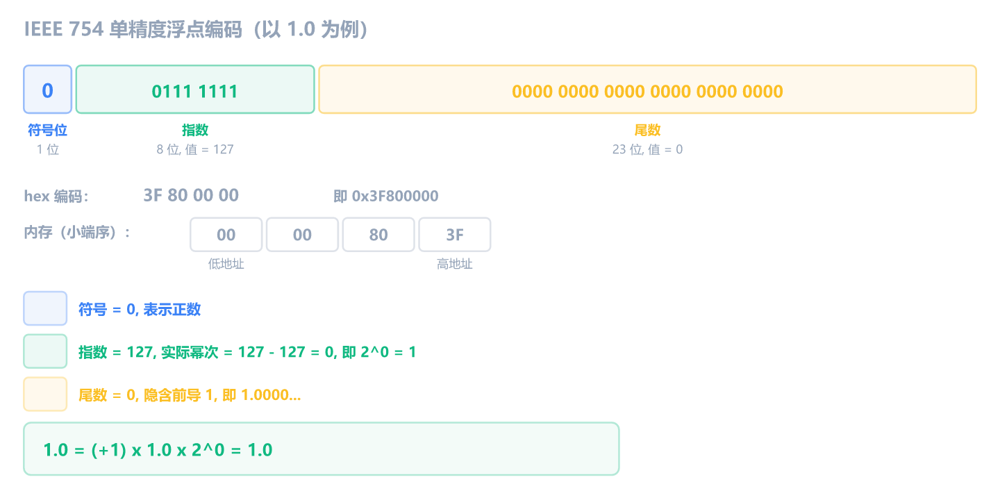
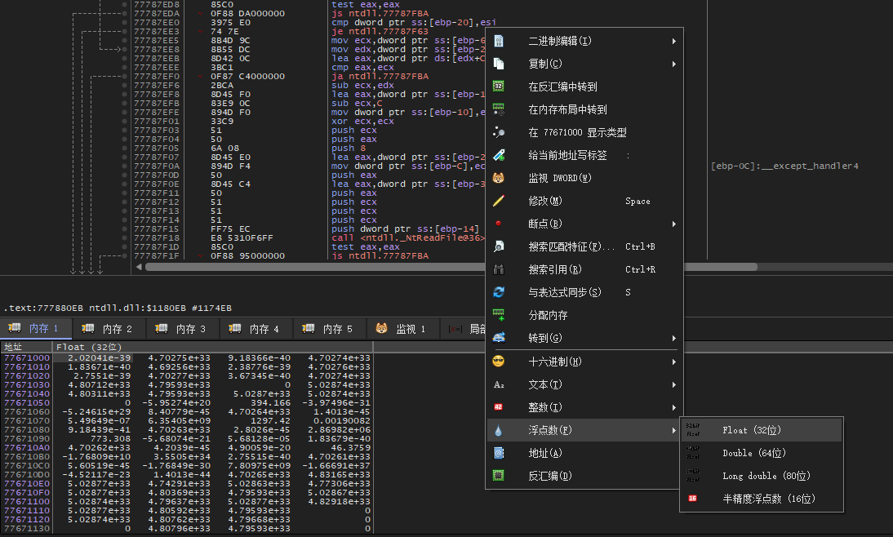
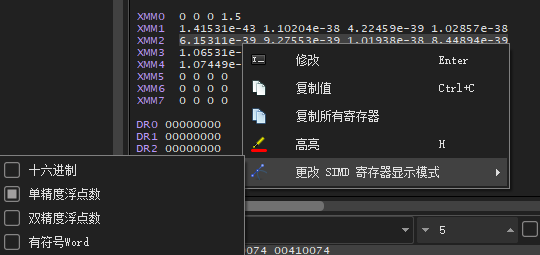
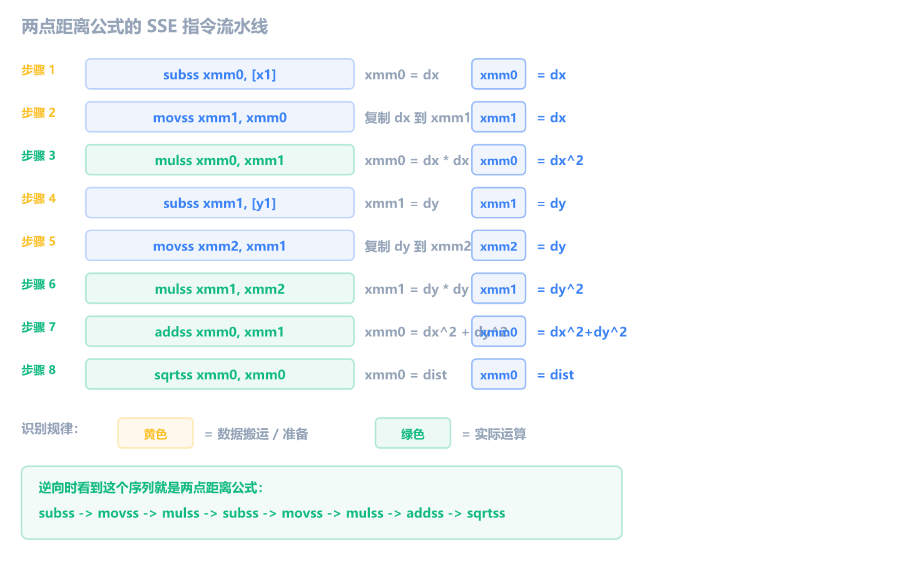

前 11 章我们都在和整数打交道：寄存器里的值是整数，内存里存的是整数，加减乘除比较跳转全都是整数运算。但在真实世界，尤其是游戏逆向中，角色的坐标、血量、暴击率往往是小数。

如果你在 x64dbg 里看到 `0x3F800000` 却把它当成一个巨大的整数，或者被 `movss`、`addss` 这些指令搞晕，那这最后一块拼图就是为你准备的。

## IEEE 754：不必手算的秘密公式

C 语言的 `float` 和 `double` 在内存里用的是 **IEEE 754 浮点编码**。它的编码方式和整数完全不同，把 32 位拆成三段：符号位、指数、尾数，类似科学计数法。

你不需要学会手动把二进制转成小数。你需要的是**一眼看出"这不是整数"**。

同一个数值，整数和浮点的内存编码天差地别：

| 数值 | 整数 hex   | 浮点 hex   |
| ---- | ---------- | ---------- |
| 0    | 0x00000000 | 0x00000000 |
| 1    | 0x00000001 | 0x3F800000 |
| -1   | 0xFFFFFFFF | 0xBF800000 |
| 2    | 0x00000002 | 0x40000000 |
| 0.5  | N/A        | 0x3F000000 |
| 3.14 | N/A        | 0x4048F5C3 |



注意：整数 1 是 `0x00000001`，浮点 1.0 却是 `0x3F800000`。**同一个"1"，编码完全不同**。

几个规律：

- `0.0` 的编码恰好是 `0x00000000`，和整数 0 一样，这是个特殊情况
- 正浮点数的高位字节通常落在 `0x3F`~`0x42` 区间
- 浮点数数组在内存窗口里看起来比较"乱"，不像整数那样有很多 `0x00`

**逆向技巧**：如果你在内存窗口看到一堆 `0x3F`、`0x40`、`0x41` 开头的数字，第一反应应该是浮点数。

> [!NOTE] 精度陷阱
> `0.1 + 0.2` 在浮点里不精确等于 `0.3`，因为 IEEE 754 无法精确表示 0.1。这就是为什么 C 代码里 `if (f == 0.3)` 在逆向中经常看不到直接相等的比较，而是用一个误差范围来判断。你在逆向浮点逻辑时如果看到 `ucomiss` 配合复杂的条件跳转，很可能就是在做浮点近似比较。

## x64dbg 里怎么看浮点数

整数在内存窗口里直接看 hex 就能读，浮点不行。你需要切换显示格式。

**内存窗口**：右键点击内存区域 -> **在格式中选择** -> **Float (单精度)** 或 **Double (双精度)**。切换后，原本看不懂的 `00 00 80 3F` 就会显示成 `1.00000`。



**寄存器窗口**：默认情况下 XMM 寄存器可能折叠着。找到 XMM0 那一行，双击展开，或者右键选择显示格式。XMM 寄存器是 128 位的，x64dbg 会同时显示 hex、float、double 等多种解读。



第 3 章说过"FPU 窗口入门阶段可以关掉"。现在你涉及浮点了，该打开看看 XMM 寄存器了。

## x87 栈式浮点：一句话带过

在 SSE 出现之前，x86 用 **x87 FPU** 处理浮点。它有一组特殊寄存器：`ST(0)` 到 `ST(7)`，以**栈**的方式工作（不是随机访问，后进先出）。

指令长这样：

```asm
fld   dword ptr [ebp+8]    ; 把参数压入浮点栈顶 ST(0)
fmul  st(0), st(1)         ; ST(0) = ST(0) * ST(1)
fstp  dword ptr [ebp-4]    ; 弹出栈顶存到内存
```

现代编译器（VS 2005 以后）默认用 SSE，**90% 以上的浮点代码不会用到 x87**。你只可能在反编译老软件、某些嵌入式固件或恶意软件时遇到。认出 `ST(0)`、`fld`、`fmul` 知道是老式浮点就行，不用深究。

## XMM 寄存器

现代编译器的浮点运算全靠 **XMM 寄存器**。

- 32 位程序：XMM0 ~ XMM7（8 个）
- 64 位程序：XMM0 ~ XMM15（16 个）
- 每个寄存器 **128 位宽**

128 位看起来很大，但做基本浮点运算时只用到其中一部分：

- **float（单精度）**：用低 32 位，后缀 `ss`（Scalar Single）
- **double（双精度）**：用低 64 位，后缀 `sd`（Scalar Double）

后缀命名规则：

| 后缀 | 含义          | 操作大小 | C 类型 |
| ---- | ------------- | -------- | ------ |
| ss   | Scalar Single | 32 位    | float  |
| sd   | Scalar Double | 64 位    | double |

看到 `ss` 就是 float，看到 `sd` 就是 double。就这么简单。

## movss：搬运浮点数

```asm
movss xmm0, dword ptr [ebp-4]    ; 从内存加载 float 到 XMM0
movss dword ptr [ebp-8], xmm0    ; 把 XMM0 存到内存
movss xmm1, xmm0                 ; XMM1 = XMM0
```

`movss` 就是浮点版的 `mov`。它搬的是 32 位 float。如果是 double，用 `movsd`。

C 代码和汇编的对照：

```c
float a = 1.5f;
float b = a;
```

```asm
movss xmm0, dword ptr [ebp-4]    ; xmm0 = a (从内存加载)
movss dword ptr [ebp-8], xmm0    ; [ebp-8] = xmm0 (存到 b 的位置)
```

## movsd 的两个含义

第 11 章提到过：`movsd` 有两个完全不同的含义。现在你学完了 SSE，可以完整理解这个对比了。

**判断口诀**：无操作数 + ESI/EDI 搭配 = 字符串指令；有显式操作数 + XMM 寄存器 = SSE 浮点指令。

| 特征       | 字符串 movsd       | SSE movsd            |
| ---------- | ------------------ | -------------------- |
| 操作数     | 无（隐含 ESI/EDI） | 两个显式操作数       |
| 涉及寄存器 | ESI, EDI           | XMM                  |
| 可配 rep   | 可以               | 不可以               |
| 操作大小   | 4 字节（内存复制） | 64 位（double 搬运） |
| 机器码     | A5                 | F2 0F 10/11          |

两者机器码完全不同，只是恰好共享了同一个助记符。逆向时看上下文就能判断。

## addss / subss / mulss / divss：浮点四则运算

```asm
addss xmm0, dword ptr [ebp-8]    ; xmm0 = xmm0 + [ebp-8] (浮点加)
subss xmm0, dword ptr [ebp-8]    ; xmm0 = xmm0 - [ebp-8] (浮点减)
mulss xmm0, dword ptr [ebp-8]    ; xmm0 = xmm0 * [ebp-8] (浮点乘)
divss xmm0, dword ptr [ebp-8]    ; xmm0 = xmm0 / [ebp-8] (浮点除)
```

和整数指令的对应关系：

| 整数 | 浮点 (float) | 浮点 (double) | C 等价 |
| ---- | ------------ | ------------- | ------ |
| add  | addss        | addsd         | +      |
| sub  | subss        | subsd         | -      |
| imul | mulss        | mulsd         | \*     |
| idiv | divss        | divsd         | /      |

一个完整的 C 代码 → 汇编对照：

```c
float add(float a, float b) {
    return a + b;
}
```

```asm
movss xmm0, dword ptr [ebp+8]    ; xmm0 = a
addss xmm0, dword ptr [ebp+0Ch]  ; xmm0 = a + b
                                   ; 返回值在 xmm0 里
```

整数的返回值走 EAX，浮点的返回值走 **XMM0**（SSE 约定）或 ST(0)（x87 约定）。

## sqrtss：开平方

```asm
sqrtss xmm0, dword ptr [ebp-4]   ; xmm0 = sqrt([ebp-4])
```

`sqrtss` 是单指令开平方。整数指令里没有等价物（整数开方需要软件实现），但 SSE 硬件直接支持。

游戏逆向中最经典的场景：**两点间距离公式**。计算角色到怪物的距离：

```c
float dx = x2 - x1;
float dy = y2 - y1;
float dist = sqrt(dx * dx + dy * dy);
```

```asm
movss xmm0, [x2]
subss xmm0, [x1]        ; xmm0 = dx
movss xmm1, xmm0        ; xmm1 = dx
mulss xmm0, xmm1        ; xmm0 = dx * dx
movss xmm1, [y2]
subss xmm1, [y1]        ; xmm1 = dy
movss xmm2, xmm1        ; xmm2 = dy
mulss xmm1, xmm2        ; xmm1 = dy * dy
addss xmm0, xmm1        ; xmm0 = dx*dx + dy*dy
sqrtss xmm0, xmm0       ; xmm0 = dist
```

逆向时如果看到 `mulss` 连用两次，然后 `addss`，最后 `sqrtss`，那就是在算两点间距离。



## comiss / ucomiss：浮点比较

```asm
comiss xmm0, dword ptr [ebp-4]   ; 比较 xmm0 和 [ebp-4]，设置 EFLAGS
```

`comiss` 类似整数的 `cmp`，比较后设置 EFLAGS 标志位。`ucomiss` 是无序版（遇到 NaN 时行为不同），实际逆向中 `ucomiss` 更常见。

浮点比较后的跳转和整数有一个区别：浮点没有"有符号/无符号"的概念，比较后的跳转通常用 **ja/jb**（above/below）而不是 **jg/jl**（greater/less）。你在逆向浮点逻辑时看到的跳转指令可能和整数代码的习惯不太一样。

## 实战场景速查

| 场景         | 典型指令序列                   | 说明                       |
| ------------ | ------------------------------ | -------------------------- |
| 游戏坐标移动 | addss / subss                  | float 类型的坐标加减       |
| 血条缩放     | divss                          | 当前血量 / 最大血量 = 比例 |
| 两点距离     | mulss + mulss + addss + sqrtss | 勾股定理                   |
| 浮点比较     | ucomiss + ja/jb                | 判断距离/血量条件          |
| 变量赋值     | movss / movsd                  | float/double 搬运          |

> [!NOTE] SIMD 大块搬运
> 你在 UCRT 的 `memcpy` 实现里可能看到 `movdqu`、`movaps` 等指令。它们用的是 XMM 寄存器，一次搬运 16 字节，但做的不是浮点运算，而是**整块内存复制**。这叫 SIMD（单指令多数据）优化。看到 XMM 寄存器不代表一定是浮点运算，要结合指令判断。

## 练习

1. 以下汇编计算的是什么？最终 XMM0 的值是多少？

   ```asm
   movss xmm0, dword ptr [0x0040A000]    ; [0x0040A000] = 0x40000000
   movss xmm1, dword ptr [0x0040A004]    ; [0x0040A004] = 0x40400000
   addss xmm0, xmm1
   ```

   > [!NOTE]- 参考答案
   >
   > `0x40000000` = 2.0，`0x40400000` = 3.0。两条 `movss` 加载后 xmm0=2.0、xmm1=3.0，`addss` 后 xmm0 = 2.0 + 3.0 = **5.0**。
   >
   > 逆向时看到 `movss` + `addss` 的组合，就是在做浮点加法。

2. x64dbg 实操。使用第 4 章创建的 NOP 画布程序，完成以下操作：
   1. 在 NOP 区域手写一条指令：`movss xmm0, dword ptr ds:[某个地址]`（随便选一块可写内存地址）
   2. 在内存窗口跳到那个地址，把字节改成 `00 00 80 3F`（小端序）
   3. 单步执行这条指令，观察寄存器窗口里 XMM0 的值
   4. XMM0 应该显示为多少？把内存里的值改成 `00 00 00 40` 再试一次

   > [!NOTE]- 参考答案
   >
   > `0x3F800000` 在小端序内存中是 `00 00 80 3F`，这是 float **1.0**。执行后 XMM0 应该显示 `1.00000`。
   >
   > 改成 `00 00 00 40`（即 `0x40000000`）后，XMM0 变成 **2.0**。
   >
   > 这个练习让你亲手感受：同一段内存，用整数看和用浮点看是完全不同的值。在 x64dbg 内存窗口右键切换到 Float 视角可以验证。
