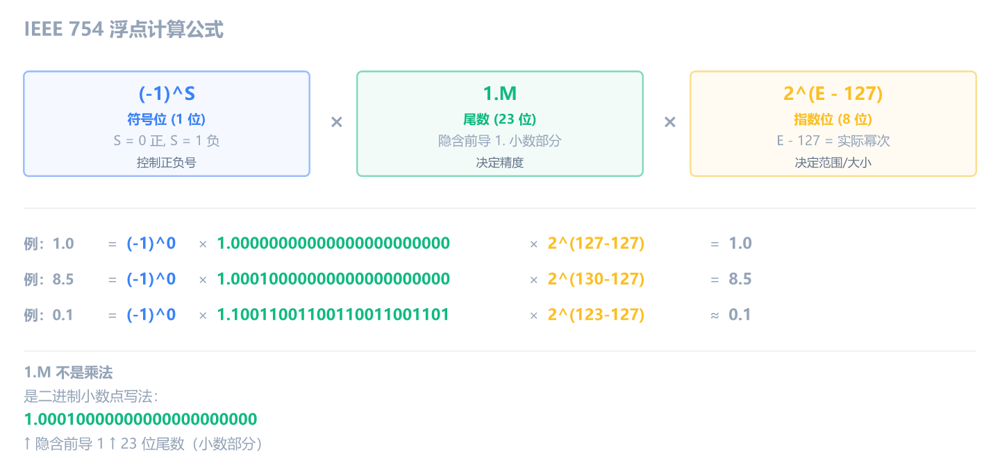
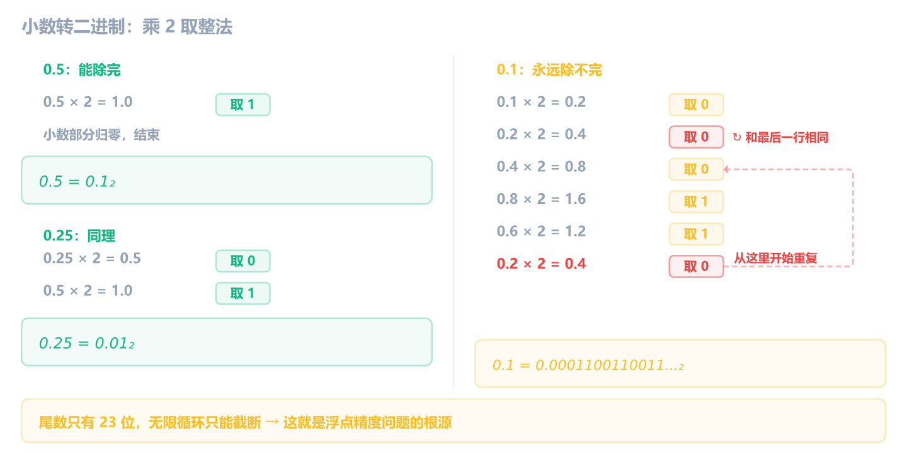

前 11 章我们都在和整数打交道：寄存器里的值是整数，内存里存的是整数，加减乘除比较跳转全都是整数运算。但在真实世界，尤其是游戏逆向中，角色的坐标、血量、暴击率往往是小数。

如果你在 x64dbg 里看到 `0x3F800000` 却把它当成一个巨大的整数，或者被 `movss`、`addss` 这些指令搞晕，那这最后一块拼图就是为你准备的。

## IEEE 754：为什么 1.0 不是 0x00000001

你在 x64dbg 内存窗口里看到 4 个字节 `00 00 80 3F`。按整数看，小端序拼起来是 `0x3F800000`，一个超过十亿的数字。但右键切到 Float 视图后，它突然显示成 `1.00000`。

这不是 x64dbg 在猜。这 4 个字节确实是 float 1.0 的编码，只不过浮点的编码规则和整数完全不同。

同一个数值，整数和浮点的内存编码天差地别：

| 数值 | 整数 hex   | 浮点 hex   |
| ---- | ---------- | ---------- |
| 0    | 0x00000000 | 0x00000000 |
| 1.0  | 0x00000001 | 0x3F800000 |
| -1.0 | 0xFFFFFFFF | 0xBF800000 |
| 2.0  | 0x00000002 | 0x40000000 |
| 0.5  | N/A        | 0x3F000000 |
| 3.14 | N/A        | 0x4048F5C3 |

整数 1 是 `0x00000001`，浮点 1.0 却是 `0x3F800000`。**同一个"1"，编码完全不同**。

### 32 位怎么拆

浮点的这套编码规则叫 **IEEE 754**。它把 32 位拆成三段，原理类似科学计数法：


- **符号位 (S)**：1 位。0 正 1 负
- **指数位 (E)**：8 位。存储值 = 实际幂次 + 127（偏移量）
- **尾数位 (M)**：23 位。小数点后的部分，前面隐含一个 `1.`

三段合起来的公式：

```text
V = (-1)^S × 1.M × 2^(E - 127)
```

`1.M` 不是乘法，是二进制写法：`1` 后面接小数点，再跟 23 位尾数。比如尾数是 `1001...`，那 `1.M` 就是二进制 `1.1001...`，和十进制 `1.234` 一样的意思。



公式看起来抽象？别急，下面用三个例子逐步走一遍：1.0 最简单，8.5 引入规格化，0.1 揭示精度问题。

### 例子：1.0 的 hex 怎么来的

先用最简单的 1.0 走一遍。从 `0x3F800000` 开始拆，展开成二进制：

```text
0    01111111    00000000000000000000000
符号   指数(8)         尾数(23)
```

三段各读各的：

1. **符号位** = `0`，正数
2. **指数** = `01111111` = 十进制 127，减去偏移量 127，实际幂次 = 0，即 `2^0`
3. **尾数** = 全零，但隐含前导 1，所以实际尾数 = `1.0`

三段合起来：`(-1)^0 × 1.0 × 2^0 = 1.0`。

反过来，从 1.0 推出 hex 也只要三步：

1. 1.0 写成二进制科学计数法：`1.0 × 2^0`，符号为正
2. 实际幂次 0 + 偏移量 127 = 127 = `01111111`
3. 丢掉前导 `1.`，尾数全零 = `00000000000000000000000`

三段拼起来：

```text
0  01111111  00000000000000000000000
= 0011 1111 1000 0000 0000 0000 0000 0000
= 0x3F800000
```

这就是为什么你在内存窗口看到 `00 00 80 3F`（小端序）时，它其实是 float 1.0。

### 规格化：移小数点，定指数

1.0 太简单了：尾数全零，不用移小数点。但 8.5 的二进制是 `1000.1`，小数点不在 1 后面。怎么变成 `1.xxxx` 的形式？这就需要**规格化**。

IEEE 754 要求所有非零数都写成 `1.xxxx × 2^n` 的形式。

为什么要这样？因为 `1.` 开头永远不变，IEEE 754 干脆不存它，**隐含默认前导 1**。省出来的 1 位可以多存一位精度：23 位尾数实际上当 24 位用。这就是为什么尾数段叫"尾数"而不是"全部"。

核心规则：

- 二进制小数点**左移** n 位 → 指数为 **+n**
- 二进制小数点**右移** n 位 → 指数为 **-n**

几个例子：

| 原始二进制 | 位移过程             | 规格化后       | 指数 |
| ---------- | -------------------- | -------------- | ---- |
| `1000.1`   | 左移 3 位 → `1.0001` | `1.0001 × 2^3` | +3   |
| `1.0`      | 不用移               | `1.0 × 2^0`    | 0    |
| `0.001`    | 右移 3 位 → `1.0`    | `1.0 × 2^-3`   | -3   |
| `11.01`    | 左移 1 位 → `1.101`  | `1.101 × 2^1`  | +1   |

记住方向：**数越大左移越多，指数越大；数越小（小于 1）右移越多，指数为负**。这就是为什么你会在逆向中看到负指数：它在编码浮点小数。

8 位指数段范围 0~255，偏移量 127 是中间值，这样正负指数各占一半。**E 小于 127 就是负指数，大于 127 就是正指数**。实际幂次 -3 存成 `-3 + 127 = 124`，实际幂次 +3 存成 `3 + 127 = 130`。逆向时读出来的 E 减去 127 就是真实幂次。

### 例子：带小数的 8.5

理解了规格化，用 8.5 完整走一遍编码流程。

**第一步：十进制转二进制**。整数部分和小数部分分开转：

- 整数 8 = `1000`
- 小数 0.5 = `0.1`
- 拼接：`1000.1`

**第二步：规格化**。`1000.1` 左移 3 位 → `1.0001 × 2^3`，指数 = 3。

**第三步：确定三个字段**：

| 字段 | 计算                                   | 二进制                    |
| ---- | -------------------------------------- | ------------------------- |
| S    | 正数                                   | `0`                       |
| E    | 3 + 127 = 130                          | `10000010`                |
| M    | 去掉前导 `1.`，取 `0001`，补零到 23 位 | `00010000000000000000000` |

**第四步：拼接并转 hex**：

```text
0  10000010  00010000000000000000000
= 0100 0001 0000 1000 0000 0000 0000 0000
= 0x41080000
```

你可以在 x64dbg 里验证：把内存改成 `00 00 08 41`（小端序），切换 Float 视图，会显示 `8.50000`。

### 小数怎么转二进制

8.5 的小数部分 0.5 转成二进制是 `0.1`，一步到位。但不是所有小数都这么幸运。

浮点的尾数是二进制，所以十进制小数必须先转成二进制。方法是**乘 2 取整**：小数部分不断乘 2，取整数位，直到小数部分为 0。



0.5 和 0.25 都能干净地除完。但 0.1 不行：乘到第 6 步时回到了 0.2，开始**无限循环**。尾数只有 23 位，循环只能截断，这就是浮点精度问题的根源。

> [!NOTE] 精度陷阱
> `0.1 + 0.2` 在浮点里不精确等于 `0.3`，因为 0.1 的二进制是无限循环，存进 23 位尾数时被截断了。这就是为什么 C 代码里 `if (f == 0.3)` 在逆向中经常看不到直接相等的比较，而是用一个误差范围来判断。你在逆向浮点逻辑时如果看到 `ucomiss` 配合复杂的条件跳转，很可能就是在做浮点近似比较。

### 例子：0.1 的完整编码

那 0.1 存进内存后到底是多少？走一遍完整流程：

1. 二进制 = `0.0001100110011...`（无限循环）
2. 规格化 = `1.1001100110011... × 2^-4`
3. 三段取值：S = `0`，E = -4 + 127 = 123 = `01111011`，M = 截取 23 位 = `10011001100110011001101`（尾数只有 23 位，取前 23 位后看第 24 位：是 1 就进位，23 位从 `C` 进到 `D`）

```text
0  01111011  10011001100110011001101
= 0011 1101 1100 1100 1100 1100 1100 1101
= 0x3DCCCCCD
```

你在 x64dbg 里把内存改成 `CD CC CC 3D`（小端序），切 Float 视图，会显示 `0.10000`。注意末位是 `D` 不是 `C`，这是四舍五入进位的结果，也是为什么 `0.1 + 0.2 != 0.3`。

### 特殊值

三个例子走完了。最后补充几个特殊值，你在逆向中也可能遇到。

> [!NOTE] 为什么 0.0 是全零
> 0.0 没法写成 `1.xxxx × 2^n`，因为怎么移位都出不了前导 1。IEEE 754 规定：**指数位全零时触发特殊规则**，不再隐含前导 1。
>
> - **+0.0**：32 位全是 0 = `0x00000000`，和整数 0 一样
> - **-0.0**：符号位为 1 = `0x80000000`
>
> `+0.0 == -0.0` 在 C 里返回 true，但 hex 编码不同。逆向时看到 `0x80000000`，它可能不是负整数，而是负零浮点。

> [!NOTE] 特殊值：Infinity 和 NaN
> 指数位全 1（即 E = 255）时不再按公式算，而是表示特殊值：
>
> - **正无穷**：`0x7F800000`，例如 `1.0 / 0.0` 的结果
> - **负无穷**：`0xFF800000`
> - **NaN（Not a Number）**：`0x7FC00000` 附近，表示"这不是一个数"
>
> NaN 是什么？有些运算在数学上没有结果，比如 `0.0 / 0.0`、`sqrt(-1.0)`、`infinity - infinity`。CPU 没法返回一个正常的浮点数，但又必须返回*某个值*，所以 IEEE 754 专门留了 NaN 来表示"算不出来"。
>
> NaN 有一个反直觉的特性：**NaN 不等于任何值，包括它自己**。`NaN == NaN` 返回 false。这就是为什么浮点比较用 `ucomiss` 而不是 `comiss`，`u` 代表 unordered，遇到 NaN 时设置一个特殊标志，让跳转指令正确处理。逆向时看到 `ucomiss` 比 `comiss` 更常见，就是这个原因。
>
> 逆向时看到 `0x7F800000` 不是 bug，是合法的浮点值。

### 逆向识别口诀

你不需要每次都手算 IEEE 754。记住这几个特征就够了：

- `00 00 80 3F` 很可能是 float **1.0**，`00 00 00 40` 很可能是 float **2.0**
- 在内存窗口里，常见正浮点数按 dword 看，高位字节落在 `0x3F`~`0x42` 区间
- 浮点数数组看起来比较"乱"，不像整数数组有很多 `0x00`
- **看到一片 `3F`、`40`、`41` 结尾的 dword，第一反应是浮点数数组**

## x64dbg 里怎么看浮点数

整数在内存窗口里直接看 hex 就能读，浮点不行。你需要切换显示格式。

**内存窗口**：右键点击内存区域 -> **在格式中选择** -> **Float (单精度)** 或 **Double (双精度)**。切换后，原本看不懂的 `00 00 80 3F` 就会显示成 `1.00000`。


**寄存器窗口**：默认情况下 XMM 寄存器可能折叠着。找到 XMM0 那一行，双击展开，或者右键选择显示格式。XMM 寄存器是 128 位的，x64dbg 会同时显示 hex、float、double 等多种解读。


第 3 章说过"FPU 窗口入门阶段可以关掉"。现在你涉及浮点了，该打开看看 XMM 寄存器了。

## x87 栈式浮点：一句话带过

在 SSE 出现之前，x86 用 **x87 FPU** 处理浮点。它有一组特殊寄存器：`ST(0)` 到 `ST(7)`，以**栈**的方式工作（不是随机访问，后进先出）。

指令长这样：

```asm
fld   dword ptr [ebp+8]    ; 把参数压入浮点栈顶 ST(0)
fmul  st(0), st(1)         ; ST(0) = ST(0) * ST(1)
fstp  dword ptr [ebp-4]    ; 弹出栈顶存到内存
```

现代编译器（VS 2005 以后）默认用 SSE，**90% 以上的浮点代码不会用到 x87**。你只可能在反编译老软件、某些嵌入式固件或恶意软件时遇到。认出 `ST(0)`、`fld`、`fmul` 知道是老式浮点就行，不用深究。

## XMM 寄存器

现代编译器的浮点运算全靠 **XMM 寄存器**。

- 32 位程序：XMM0 ~ XMM7（8 个）
- 64 位程序：XMM0 ~ XMM15（16 个）
- 每个寄存器 **128 位宽**

128 位看起来很大，但做基本浮点运算时只用到其中一部分：

- **float（单精度）**：用低 32 位，后缀 `ss`（Scalar Single）
- **double（双精度）**：用低 64 位，后缀 `sd`（Scalar Double）

后缀命名规则：

| 后缀 | 含义          | 操作大小 | C 类型 |
| ---- | ------------- | -------- | ------ |
| ss   | Scalar Single | 32 位    | float  |
| sd   | Scalar Double | 64 位    | double |

看到 `ss` 就是 float，看到 `sd` 就是 double。就这么简单。

## movss：搬运浮点数

```asm
movss xmm0, dword ptr [ebp-4]    ; 从内存加载 float 到 XMM0
movss dword ptr [ebp-8], xmm0    ; 把 XMM0 存到内存
movss xmm1, xmm0                 ; XMM1 = XMM0
```

`movss` 就是浮点版的 `mov`，搬的是 32 位 float。和 `mov` 一样，不改 EFLAGS。

C 代码和汇编的对照：

```c
float a = 1.5f;
float b = a;
```

```asm
movss xmm0, dword ptr [ebp-4]    ; xmm0 = a (从内存加载)
movss dword ptr [ebp-8], xmm0    ; [ebp-8] = xmm0 (存到 b 的位置)
```

## movsd 的两个含义

第 11 章讲字符串指令时提到过 `movsd`：配合 ESI/EDI 做内存复制。但这里刚说完 `movss` 搬 float，你可能会问：搬 double 用什么？答案是 `movsd`。同一个助记符，两个完全不同的功能。

```asm
; 用法一：字符串指令（第 11 章）
movsd                       ; [EDI] = [ESI]，ESI/EDI 各 +4

; 用法二：SSE 浮点指令（搬 double）
movsd xmm0, qword ptr [ebp-8]    ; 从内存加载 double 到 XMM0
movsd qword ptr [ebp-16], xmm0   ; 把 XMM0 存到内存
```

**判断口诀**：无操作数 + ESI/EDI 搭配 = 字符串指令；有显式操作数 + XMM 寄存器 = SSE 浮点指令。

| 特征       | 字符串 movsd       | SSE movsd            |
| ---------- | ------------------ | -------------------- |
| 操作数     | 无（隐含 ESI/EDI） | 两个显式操作数       |
| 涉及寄存器 | ESI, EDI           | XMM                  |
| 可配 rep   | 可以               | 不可以               |
| 操作大小   | 4 字节（内存复制） | 64 位（double 搬运） |
| 机器码     | A5                 | F2 0F 10/11          |

两者机器码完全不同，只是恰好共享了同一个助记符。逆向时看上下文就能判断。

## addss / subss / mulss / divss：浮点四则运算

```asm
addss xmm0, dword ptr [ebp-8]    ; xmm0 = xmm0 + [ebp-8] (浮点加)
subss xmm0, dword ptr [ebp-8]    ; xmm0 = xmm0 - [ebp-8] (浮点减)
mulss xmm0, dword ptr [ebp-8]    ; xmm0 = xmm0 * [ebp-8] (浮点乘)
divss xmm0, dword ptr [ebp-8]    ; xmm0 = xmm0 / [ebp-8] (浮点除)
```

和整数指令的关键区别：整数 `add`/`sub` 执行后会设置 EFLAGS，后面可以直接 `jg`/`jl` 跳转。但 `addss`/`subss`/`mulss`/`divss` **完全不碰 EFLAGS**。要看浮点运算结果的大小关系，必须用专门的浮点比较指令 `comiss`/`ucomiss`（后面讲）。

和整数指令的对应关系：

| 整数 | 浮点 (float) | 浮点 (double) | C 等价 |
| ---- | ------------ | ------------- | ------ |
| add  | addss        | addsd         | +      |
| sub  | subss        | subsd         | -      |
| imul | mulss        | mulsd         | \*     |
| idiv | divss        | divsd         | /      |

一个完整的 C 代码 → 汇编对照：

```c
float add(float a, float b) {
    return a + b;
}
```

```asm
movss xmm0, dword ptr [ebp+8]    ; xmm0 = a
addss xmm0, dword ptr [ebp+0Ch]  ; xmm0 = a + b
                                   ; 返回值在 xmm0 里
```

整数的返回值走 EAX，浮点的返回值走 **XMM0**（SSE 约定）或 ST(0)（x87 约定）。

## sqrtss：开平方

```asm
sqrtss xmm0, dword ptr [ebp-4]   ; xmm0 = sqrt([ebp-4])
```

`sqrtss` 是单指令开平方。整数指令里没有等价物（整数开方需要软件实现），但 SSE 硬件直接支持。

游戏逆向中最经典的场景：**两点间距离公式**。计算角色到怪物的距离：

```c
float dx = x2 - x1;
float dy = y2 - y1;
float dist = sqrt(dx * dx + dy * dy);
```

```asm
movss xmm0, [x2]
subss xmm0, [x1]        ; xmm0 = dx
movss xmm1, xmm0        ; xmm1 = dx
mulss xmm0, xmm1        ; xmm0 = dx * dx
movss xmm1, [y2]
subss xmm1, [y1]        ; xmm1 = dy
movss xmm2, xmm1        ; xmm2 = dy
mulss xmm1, xmm2        ; xmm1 = dy * dy
addss xmm0, xmm1        ; xmm0 = dx*dx + dy*dy
sqrtss xmm0, xmm0       ; xmm0 = dist
```

逆向时如果看到 `mulss` 连用两次，然后 `addss`，最后 `sqrtss`，那就是在算两点间距离。

## comiss / ucomiss：浮点比较

```asm
comiss xmm0, dword ptr [ebp-4]   ; 比较 xmm0 和 [ebp-4]，设置 EFLAGS
```

`comiss` 类似整数的 `cmp`，比较后设置 EFLAGS 标志位。`ucomiss` 是无序版（遇到 NaN 时行为不同），实际逆向中 `ucomiss` 更常见。

浮点比较和整数比较有一个关键区别：浮点比较只设置 **CF 和 ZF**，不设 OF 和 SF。所以跳转只能用依赖 CF/ZF 的无符号跳转指令（`ja`/`jb`/`je`/`jae`/`jbe`），不能用 `jg`/`jl`（它们依赖 OF/SF）。你在逆向浮点逻辑时看到 `ja`/`jb` 不要奇怪，这是正常的。

## SSE 指令速查

和整数指令一样，SSE 浮点指令也有固定的后缀规律。看到后缀就知道操作类型和大小：

| 指令后缀  | 类型   | 整数等价 | 作用           |
| --------- | ------ | -------- | -------------- |
| `movss`   | float  | `mov`    | 搬运           |
| `movsd`   | double | -        | 搬运           |
| `addss`   | float  | `add`    | 加法           |
| `subss`   | float  | `sub`    | 减法           |
| `mulss`   | float  | `imul`   | 乘法           |
| `divss`   | float  | `idiv`   | 除法           |
| `sqrtss`  | float  | -        | 开平方         |
| `comiss`  | float  | `cmp`    | 比较           |
| `ucomiss` | float  | `cmp`    | 比较(处理 NaN) |

逆向时最常见的模式：

- `movss` + `addss` → 浮点加法（坐标累加、血量增减）
- `mulss` + `mulss` + `addss` + `sqrtss` → 两点间距离（勾股定理）
- `ucomiss` + `ja`/`jb` → 浮点条件判断（距离/血量比较）

> [!NOTE] SIMD 大块搬运
> 你在 C 运行库的 `memcpy` 实现里可能看到 `movdqu`、`movaps` 等指令。它们用的是 XMM 寄存器，一次搬运 16 字节，但做的不是浮点运算，而是**整块内存复制**。这叫 SIMD（单指令多数据）优化。看到 XMM 寄存器不代表一定是浮点运算，要结合指令判断。

## 练习

1. 以下汇编计算的是什么？最终 XMM0 的值是多少？

   ```asm
   movss xmm0, dword ptr [0x0040A000]    ; [0x0040A000] = 0x40000000
   movss xmm1, dword ptr [0x0040A004]    ; [0x0040A004] = 0x40400000
   addss xmm0, xmm1
   ```

   > [!NOTE]- 参考答案
   >
   > `0x40000000` = 2.0，`0x40400000` = 3.0。两条 `movss` 加载后 xmm0=2.0、xmm1=3.0，`addss` 后 xmm0 = 2.0 + 3.0 = **5.0**。
   >
   > 逆向时看到 `movss` + `addss` 的组合，就是在做浮点加法。

2. x64dbg 实操。使用第 4 章创建的 NOP 画布程序，完成以下操作：
   1. 在 NOP 区域手写一条指令：`movss xmm0, dword ptr ds:[某个地址]`（随便选一块可写内存地址）
   2. 在内存窗口跳到那个地址，把字节改成 `00 00 80 3F`（小端序）
   3. 单步执行这条指令，观察寄存器窗口里 XMM0 的值
   4. XMM0 应该显示为多少？把内存里的值改成 `00 00 00 40` 再试一次

   > [!NOTE]- 参考答案
   >
   > `0x3F800000` 在小端序内存中是 `00 00 80 3F`，这是 float **1.0**。执行后 XMM0 应该显示 `1.00000`。
   >
   > 改成 `00 00 00 40`（即 `0x40000000`）后，XMM0 变成 **2.0**。
   >
   > 这个练习让你亲手感受：同一段内存，用整数看和用浮点看是完全不同的值。在 x64dbg 内存窗口右键切换到 Float 视角可以验证。
