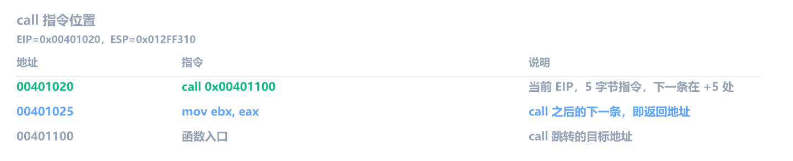
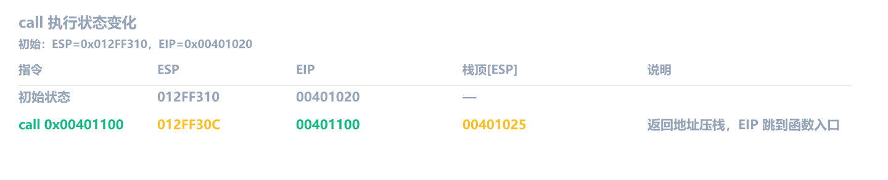
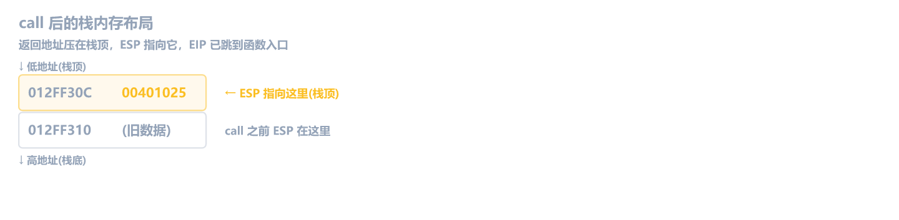
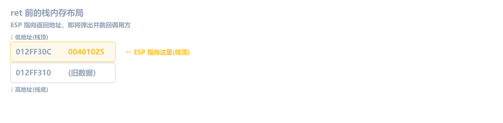
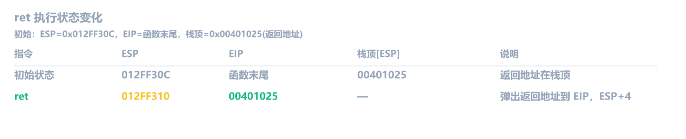
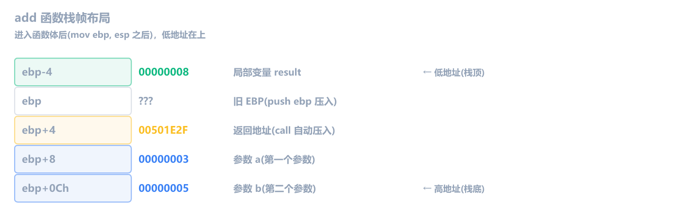
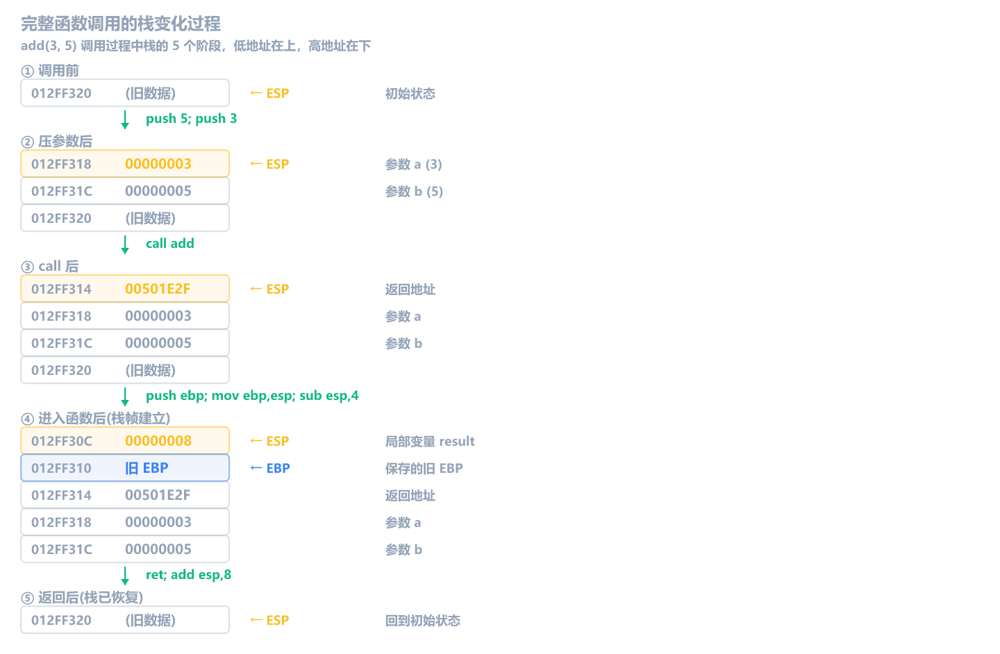

上一章学了栈和 push/pop，知道了数据怎么压进栈、怎么弹出来。但栈真正的大用途是支撑**函数调用**：参数传递、局部变量、返回值，全靠栈来组织。

这一章搞懂 call/ret、栈帧和调用约定，你就具备了追踪任何函数调用的能力。

本章涉及的所有指令（`call`、`ret`）都**不影响任何标志位**，它们只操作 ESP、EIP 和内存。

## call：调用函数

`call` 的操作数是**目标地址**，可以是立即数、寄存器或内存：

```asm
call 0x00401100         ; 立即数（直接调用地址处的函数）
call eax                ; 寄存器（调用 eax 里存的地址，常见于虚函数调用）
call dword ptr [esp+4]  ; 内存（调用 [esp+4] 里存的地址）
```

不管操作数是什么，`call` 都做了**两件事**：

1. 把**下一条指令的地址**（返回地址）压栈
2. EIP 跳到目标地址

等价于：

```asm
push (下一条指令的地址)
jmp 目标地址
```

为什么要压返回地址？因为函数执行完后需要知道"回到哪里继续执行"。

### 跟踪示例

假设当前 EIP = `0x00401020`，ESP = `0x012FF310`：







执行 `call 0x00401100` 后，栈顶现在存着 `0x00401025`，这就是 `call` 之后那条指令的地址。函数结束后会用到它。

## ret：从函数返回

```asm
ret                     ; 从栈顶弹出返回地址，跳回去
```

`ret` 做了**两件事**：

1. 从栈顶弹出返回地址到 EIP
2. ESP 加 4

等价于：

```text
pop eip        （概念上，实际不能直接这么写）
```

### 跟踪示例

函数执行到最后，ESP = `0x012FF30C`，栈顶是 `0x00401025`（之前 call 压入的返回地址）：





现在 EIP 回到了 `0x00401025`（`mov ebx, eax`），函数调用完成。

## 栈帧：函数的"工作台"

每个函数被调用时，都会在栈上开辟一块属于自己的空间，叫做**栈帧（Stack Frame）**。栈帧里存着：

- 函数的参数
- 返回地址
- 旧 EBP（调用者的栈帧底部）
- 局部变量

<!-- 🎨 画图：完整栈帧结构 -->

### 函数序言（Prologue）

几乎每个函数开头都有这两条指令：

```asm
push ebp                ; 保存调用者的 EBP
mov  ebp, esp           ; 设置当前函数的 EBP = 当前 ESP
```

执行后，EBP 指向刚 push 进去的"旧 EBP"的位置。从这一刻起，`[ebp+X]` 用来访问参数，`[ebp-X]` 用来访问局部变量。

### 分配栈帧空间

```asm
sub esp, 0x0C           ; 在栈上分配 12 字节
```

ESP 往低地址移 12 字节，腾出空间。这块空间用途很多：

- **局部变量**（最主要的用途）
- **临时存储**：编译器做中间计算时需要临时空间
- **子函数参数**：调用其他函数前，先把参数放到栈上
- **对齐填充**：编译器可能多分配几个字节来保持栈对齐

所以 `sub esp, N` 分配的字节数经常比局部变量加起来还多，多出来的就是上面这些用途。你不需要精确计算每一字节归谁，只要知道 `[ebp-X]` 访问的是这块空间里的某个位置就行。

### 函数尾声（Epilogue）

函数结束时，恢复栈并返回：

```asm
mov esp, ebp            ; 恢复 ESP（释放局部变量空间）
pop ebp                 ; 恢复调用者的 EBP
ret                     ; 返回到调用点
```

有的编译器用 `leave` 指令代替 `mov esp, ebp` + `pop ebp`，效果一样，下一节详细讲。

### 常见错误：往没分配的栈空间写数据

新手容易写出这样的代码：

```asm
push ebp
mov  ebp, esp
mov  dword ptr [esp-4], 0x123456    ; ← esp-4 在 ESP 之下，没分配过
pop  ebp
ret
```

> [!NOTE]- 错误分析
> `[esp-4]` 是 ESP 之下的内存，没有用 `sub esp, 4` 分配过。在 Windows x86 上，中断或异常一旦触发就会往这片区域写数据，覆盖掉你的值。而且这个值写完就丢了，`pop ebp` 读的是 `[esp]` 不是 `[esp-4]`。
>
> 正确做法是先 `sub esp, 4` 腾出空间，或者建立栈帧后用 `[ebp-4]`：
>
> ```asm
> push ebp
> mov  ebp, esp
> sub  esp, 4                  ; 分配 4 字节局部变量空间
> mov  dword ptr [ebp-4], 0x123456  ; 现在合法了
> add  esp, 4                  ; 释放空间（或用 mov esp, ebp）
> pop  ebp
> ret
> ```

## 完整函数调用过程

让我们跟踪一个完整的函数调用。C 代码：

```c
int add(int a, int b) {
    int result = a + b;
    return result;
}

int main() {
    int sum = add(3, 5);
    return sum;
}
```

MSVC Debug 模式编译后的真实输出：

### 调用方（main）

```asm
00501E26  push        5                    ; 参数 2（从右往左压栈）
00501E28  push        3                    ; 参数 1
00501E2A  call        add (05013C5h)       ; 调用 add，压入返回地址 00501E2F
00501E2F  add         esp,8                ; 清理参数（调用方负责，cdecl 约定）
00501E32  mov         dword ptr [sum],eax  ; sum = 返回值
```

注意 `call` 之后紧跟的地址是 `00501E2F`，这就是被压入栈的返回地址。

### 被调用方（add 函数）

call 实际跳到的是一个**跳板**（incremental linking thunk）：

```asm
005013C5  jmp         add (05017A0h)       ; 跳转到 add 函数真正的入口
```

这是 MSVC 增量链接（Incremental Linking）产生的中转指令，call 不直接跳到函数体，而是先跳到一个 jmp 跳板，再由跳板跳到真实地址。Release 模式关闭增量链接后不会有这个跳板。最终到达的函数体：

```asm
005017A0  push        ebp                  ; 保存旧 EBP
005017A1  mov         ebp,esp              ; 设置新 EBP
005017A3  sub         esp,0CCh             ; 分配栈帧空间（远大于实际需要）
005017A9  push        ebx                  ; 保存 callee-saved 寄存器
005017AA  push        esi
005017AB  push        edi
005017AC  lea         edi,[ebp-0Ch]        ; 用 0xCC 填充 [ebp-0Ch] ~ [ebp-1]
005017AF  mov         ecx,3
005017B4  mov         eax,0CCCCCCCCh
005017B9  rep stos    dword ptr es:[edi]   ; 3 个 dword = 12 字节
005017BB  mov         ecx,offset ...       ; MSVC 调试辅助
005017C0  call        @__CheckForDebuggerJustMyCode@4
005017C5  nop
005017C6  mov         eax,dword ptr [a]    ; eax = 参数 a（值是 3）
005017C9  add         eax,dword ptr [b]    ; eax += 参数 b（值是 5）
005017CC  mov         dword ptr [result],eax  ; result = 8
005017CF  mov         eax,dword ptr [result]  ; 返回值 = 8
005017D2  pop         edi                  ; 恢复 edi
005017D3  pop         esi                  ; 恢复 esi
005017D4  pop         ebx                  ; 恢复 ebx
005017D5  add         esp,0CCh             ; 释放栈帧空间
005017DB  cmp         ebp,esp              ; 检查栈是否平衡
005017DD  call        __RTC_CheckEsp       ; 不平衡就报错
005017E2  mov         esp,ebp              ; 恢复 ESP
005017E4  pop         ebp                  ; 恢复旧 EBP
005017E5  ret                              ; 返回到 00501E2F
```

Debug 模式下编译器塞了很多额外代码。逐个拆解：

**序言（Prologue）**：

1. `push ebp` + `mov ebp, esp` — 标准栈帧建立，所有函数都这样开头
2. `sub esp, 0xCC` — 分配 204 字节栈帧空间。明明只有 1 个 int 局部变量（4 字节），为什么分 204？Debug 模式宁可多分，方便调试时观察内存
3. `push ebx/esi/edi` — 保存这三个寄存器（调用约定要求 callee-saved，后面讲）
4. `lea edi, [ebp-0Ch]` + `rep stos` — 把 `[ebp-0Ch]` 到 `[ebp-1]` 填满 `0xCCCCCCCC`。为什么只填这 12 字节（而不是整块 204 字节）？因为编译器只为紧邻 EBP 的局部变量区做填充，这 12 字节正好覆盖了 `[ebp-4]`（result）、`[ebp-8]`、`[ebp-0Ch]` 这些可能被引用的位置；更低的地址段留给后续 push 的寄存器和临时空间，没必要全填。这是 MSVC Debug 的安全措施，未初始化的局部变量会被读成 `0xCCCCCCCC`（而不是随机值），方便发现问题
5. `__CheckForDebuggerJustMyCode` — MSVC 的"Just My Code"调试辅助，Release 模式不会出现

**函数体**：

6. `[a]` 就是 `[ebp+8]`（第一个参数，值 3），`[b]` 就是 `[ebp+0Ch]`（第二个参数，值 5）
7. `mov [result], eax` — `[result]` 就是 `[ebp-4]`（第一个局部变量）
8. `mov eax, [result]` — 返回值通过 EAX 传回调用方

**尾声（Epilogue）**：

9. `pop edi/esi/ebx` — 恢复之前保存的寄存器
10. `add esp, 0xCC` — 释放栈帧空间（和序言的 `sub esp, 0xCC` 对应）
11. `cmp ebp, esp` + `__RTC_CheckEsp` — 检查栈是否平衡，不平衡说明有 bug
12. `mov esp, ebp` + `pop ebp` — 最终恢复 ESP 和 EBP
13. `ret` — 弹出返回地址，EIP 跳回 main 的 `00501E2F`

> **Debug 和 Release 差异极大**。Release 模式下，上面整个 `add` 函数可能被优化成一条 `lea eax, [ecx+edx]` 甚至直接内联到 main 里。但逆向入门先学 Debug 形态，结构清晰，Release 的优化以后会讲。

### 栈帧布局图

进入 `add` 函数体后（`mov ebp, esp` 之后），栈帧是这样的，低地址在上，高地址在下，和栈的生长方向一致：



<!-- 🎨 画图：栈帧的完整变化过程（5 个阶段：调用前->压参数->call->进入函数->ret） -->



**规律**：

- **`[ebp+8]`** — 第一个参数
- **`[ebp+0Ch]`** — 第二个参数（+8 + 4 = +12 = 0x0C）
- **`[ebp-4]`** — 第一个局部变量
- **`[ebp-8]`** — 第二个局部变量
- **`[ebp]`** — 保存的旧 EBP
- **`[ebp+4]`** — 返回地址

参数在 EBP 上方（高地址），局部变量在 EBP 下方（低地址）。记住这个布局，逆向时看到 `[ebp+X]` 就知道是参数，`[ebp-X]` 就是局部变量。

### 调用方清理参数

函数返回后，main 继续执行：

```asm
00501E2F  add         esp,8                ; ESP += 8，把之前 push 的两个参数"扔掉"
00501E32  mov         dword ptr [sum],eax  ; sum = eax（值是 8）
```

`add esp, 8` 把 ESP 恢复到 push 参数之前的位置。这种"调用方清理参数"的约定叫做 **cdecl**（C declaration），是 C/C++ 程序最常用的调用约定。

## 调用约定

上面的例子中，main 调用 add 后用 `add esp, 8` 清理了参数。这不是唯一的做法。**谁来清理参数**就是"调用约定"要回答的核心问题。

调用约定规定了三件事：

1. 参数怎么传递（压栈顺序、寄存器传参）
2. 谁来清理栈上的参数
3. 返回值放在哪里（EAX）

32 位 x86 最常用的三种约定是 **cdecl**、**stdcall** 和 **fastcall**。

### cdecl：C 语言的默认约定

cdecl 是 C/C++ 程序中最常见的调用约定：

- 参数**从右往左**压栈
- **调用方（caller）负责清理参数**，call 之后用 `add esp, N` 恢复栈
- 支持可变参数（如 `printf`），因为只有调用方知道自己压了几个参数

```asm
; 调用 foo(3, 5) — cdecl
push 5                  ; 参数 2（右边的先压）
push 3                  ; 参数 1（左边的后压）
call foo
add esp, 8              ; ← 调用方清理，ESP 恢复
```

特点：`call` 之后紧跟 `add esp, N`。每次调用同一个函数，清理代码都在调用方出现一次，代码稍大但很灵活。

### stdcall：Windows API 的标准约定

stdcall 是 Win32 API 使用的调用约定：

- 参数同样**从右往左**压栈
- **被调用方（callee）负责清理参数**，函数末尾用 `ret N` 代替 `ret`
- 调用方不需要额外的 `add esp`，代码更紧凑

```asm
; 调用 MessageBoxA(..., "title", "text", 0) — stdcall
push 0                  ; MB_OK
push offset title
push offset text
push 0                  ; hWnd = NULL
call MessageBoxA
                        ; ← 没有 add esp！被调用方已经用 ret 16 清理了
```

MessageBoxA 函数内部，结尾不是普通的 `ret`，而是：

```asm
ret 16                  ; 弹出返回地址后，ESP 再加 16（4 个参数 × 4 字节）
```

`ret N` 做了三件事：弹出返回地址到 EIP、ESP + 4、然后再 ESP += N。一步完成返回和清理。

### fastcall：寄存器传参

fastcall 是三种约定中最快的，前两个参数直接走寄存器，不用压栈：

- **前两个参数**通过 ECX 和 EDX 传递（不用 push，省了内存操作）
- 剩余参数**从右往左**压栈
- **被调用方清理栈上参数**（和 stdcall 一样用 `ret N`，但 N 只算栈上的参数，不算走寄存器的）

```asm
; 调用 foo(3, 5, 10) — fastcall
mov  ecx, 3             ; 第一个参数 -> ECX
mov  edx, 5             ; 第二个参数 -> EDX
push 0xA                ; 第三个参数（压栈）
call foo
                        ; ← 没有 add esp，被调用方用 ret 4 清理
```

注意 `ret 4` 只清理 1 个栈上参数（4 字节），不是 3 个，前两个走寄存器了。

fastcall 在逆向中常见于**编译器内部函数**（编译器自动生成的辅助代码）和**性能敏感的回调**。不过用的比 cdecl 和 stdcall 少。

### 三种约定对比

<!-- 🎨 画图：三种调用约定的栈清理流程对比 -->

```asm
; ===== cdecl：调用方清理 =====
; 调用方代码
push    5
push    3
call    foo_cdecl
add     esp, 8              ; ← 调用方加这句

; foo_cdecl 函数末尾
ret                         ; ← 普通 ret，不管清理

; ===== stdcall：被调用方清理 =====
; 调用方代码
push    5
push    3
call    foo_stdcall
                            ; ← 没有 add esp

; foo_stdcall 函数末尾
ret     8                   ; ← ret N，被调用方清理

; ===== fastcall：寄存器 + 被调用方清理 =====
; 调用方代码
mov     ecx, 3              ; 第一个参数 -> ECX
mov     edx, 5              ; 第二个参数 -> EDX
call    foo_fastcall
                            ; ← 没有 add esp

; foo_fastcall 函数末尾
ret                           ; ← 没有 ret N（两个参数都走寄存器，栈上没参数要清理）
```

### 逆向时如何判断调用约定

看到函数调用后，看两处就能判断：

| 观察位置  | cdecl           | stdcall    | fastcall         |
| --------- | --------------- | ---------- | ---------------- |
| call 之前 | 全部 push       | 全部 push  | 有 `mov ecx/edx` |
| call 之后 | 有 `add esp, N` | 什么都没有 | 什么都没有       |
| 函数末尾  | 普通 `ret`      | `ret N`    | `ret` 或 `ret N` |

<!-- 📸 截图：x64dbg 中分别展示 cdecl 和 stdcall 的典型代码片段 -->

实战中，**Windows API 函数全是 stdcall**（MessageBox、CreateFile、ReadFile、WriteFile……），而你自己写的 C/C++ 函数默认是 cdecl。fastcall 偶尔出现在编译器生成的代码中。如果你在 x64dbg 里看到 `ret N`（N > 0），那几乎一定是 stdcall 的 API 函数。

注意：64 位程序用统一的 x64 调用约定（前几个参数走寄存器 RCX、RDX、R8、R9），不再区分这三种约定。这些只在 32 位程序中出现。

## leave 指令

前面在函数尾声看到过 `mov esp, ebp` + `pop ebp` 这两条指令。有些编译器会把它们合并成一条：

```asm
leave
```

`leave` 等价于：

```asm
mov esp, ebp            ; ESP 指回栈帧底部（释放所有局部变量）
pop ebp                 ; 恢复调用者的 EBP
```

一条指令做了两件事。原理是：EBP 指向栈帧底部（旧 EBP 的位置），`mov esp, ebp` 把 ESP 拉回来，等于一次性释放了所有局部变量空间。然后 `pop ebp` 从栈上恢复旧 EBP。

不过现代 MSVC 很少用 `leave`，你看到的 Debug 和 Release 输出都是分开写的 `mov esp, ebp` + `pop ebp`。`leave` 更多出现在 GCC/MinGW 编译的程序，或者手写汇编里。逆向时如果看到 `leave`，知道它是这两条指令的缩写就行。

**它们完全等价**，只是编译器的优化选择。你两个都要认识。

<!-- 📸 截图：x64dbg 中 leave 指令执行前后 ESP/EBP 的变化 -->

## 全局变量 vs 局部变量

到目前为止，我们看到的局部变量都通过 `[ebp-X]` 访问，它们住在栈上，函数返回后就没了。但程序还有一种变量：**全局变量**，它们住在固定的内存地址，整个程序运行期间一直存在。

### 局部变量

```asm
mov dword ptr [ebp-4], 5         ; 局部变量
```

- 地址形式：`[ebp-X]`（相对于栈帧的偏移）
- 位置：栈（Stack）
- 生命周期：函数执行期间。函数返回后，这块栈空间会被其他函数覆盖
- 每次调用函数，局部变量的地址可能不同

### 全局变量

```asm
mov dword ptr ds:[0x0040A000], 5  ; 全局变量
```

- 地址形式：`ds:[固定地址]`（绝对地址，写死在程序里）
- 位置：`.data` 段（有初始值）或 `.bss` 段（未初始化，默认 0）
- 生命周期：整个程序运行期间
- 每次访问都是同一个地址

### 对比表

|          | 局部变量                   | 全局变量                           |
| -------- | -------------------------- | ---------------------------------- |
| 汇编形式 | `[ebp-X]`                  | `ds:[固定地址]`                    |
| 存储位置 | 栈                         | `.data` / `.bss` 段                |
| 生命周期 | 函数执行期间               | 整个程序                           |
| 地址特征 | 相对地址，每次可能不同     | 绝对地址，永远不变                 |
| 示例     | `mov dword ptr [ebp-4], 5` | `mov dword ptr ds:[0x0040A000], 5` |

<!-- 🎨 画图：内存布局图，展示栈（局部变量）和 .data/.bss 段（全局变量）的位置关系 -->

### 快速识别规则

逆向时看到内存访问，一眼判断：

- **`[ebp-X]`** -> 局部变量（栈上）
- **`[ebp+X]`**（X > 4）-> 参数（栈上，调用者压入的）
- **`ds:[0x00XXXXXX]`** -> 全局变量（固定地址段）
- **`ds:[0x00XXXXXX]`** 地址在 `0x00400000` 附近 -> 程序自身的全局变量
- **`ds:[0x00XXXXXX]`** 地址很大如 `0x7XXXXXXX` -> 系统DLL 里的变量或 API 地址

举个例子：

```asm
; C 代码
int g_count = 0;            ; 全局变量

void foo(int x) {           ; x 是参数
    int sum = x + g_count;  ; sum 是局部变量
    g_count = sum;          ; 写回全局变量
}

; 编译后的汇编
push ebp
mov  ebp, esp
sub  esp, 4                          ; 分配 sum
mov  eax, dword ptr [ebp+8]         ; eax = x（参数）
add  eax, dword ptr ds:[0x0040A000]  ; eax += g_count（全局变量）
mov  dword ptr [ebp-4], eax          ; sum = eax（局部变量）
mov  eax, dword ptr [ebp-4]          ; eax = sum
mov  dword ptr ds:[0x0040A000], eax  ; g_count = eax（写回全局变量）
mov  esp, ebp
pop  ebp
ret
```

同一个函数里，局部变量用 `[ebp-X]` 访问，全局变量用 `ds:[固定地址]` 访问，两种风格共存，非常好认。

## 回到 x64dbg 实操

打开 x64dbg，加载上一章的 CrackMe 程序。这次我们追踪一个完整的函数调用：

### 任务一：追踪一个完整的函数调用

1. 搜索字符串找到 `push <..."reverse2026"...>`
2. 在上面几行找到 `call` 指令（调用 `strcmp`）
3. 在 `call` 那行按 <kbd>F2</kbd> 设断点
4. 按 <kbd>F9</kbd> 运行，程序会在断点停下
5. 按 <kbd>F7</kbd> 步入 call，进入函数内部
6. 观察寄存器窗口：ESP 变了（返回地址压栈），EIP 跳到了函数入口
7. 继续按 <kbd>F7</kbd>，观察 `push ebp` -> `mov ebp, esp` -> 函数体 -> `pop ebp` -> `ret`
8. ret 之后 EIP 回到 call 的下一条指令

<!-- 📸 截图：F7 步入 call 后的寄存器和栈状态 -->

每一步都看清楚 ESP、EBP、EAX 的变化。这就是函数调用的完整流程。

### 任务二：找到 stdcall 的 Windows API 调用

Windows 程序启动时会调用大量 API。我们来找一个 stdcall 调用，观察 `ret N`：

1. 在 x64dbg 的**符号（Symbols）** 标签页，找到程序导入的 DLL 列表
2. 双击某个 DLL（比如 `user32.dll`），找到 `MessageBoxA` 或 `EnableWindow` 之类的函数
3. 双击函数名跳到它的代码
4. 按 <kbd>Ctrl</kbd>+<kbd>G</kbd> 输入函数名，在调用处设断点
5. 运行到断点后，<kbd>F7</kbd> 步入
6. 滚动到函数末尾，找到 `ret N` 指令（N 可能是 4、8、16 等）
7. 对比：你自己的函数末尾是普通 `ret`（cdecl），API 函数末尾是 `ret N`（stdcall）

<!-- 📸 截图：在 x64dbg 中找到 API 函数的 ret N 指令 -->

试着找 2-3 个不同的 API 函数，看看它们的 `ret N` 中 N 分别是多少，算算它们各有几个参数（N ÷ 4 = 参数个数）。

### 任务三：区分局部变量和全局变量

1. 在任意函数内部单步执行（<kbd>F8</kbd>）
2. 观察反汇编窗口中的内存访问指令
3. 看到 `[ebp-X]` 形式的 -> 这是局部变量
4. 看到 `ds:[0x00XXXXXX]` 形式的 -> 这是全局变量
5. 试着在**内存窗口**中跳到全局变量的地址（<kbd>Ctrl</kbd>+<kbd>G</kbd> 输入地址），看看里面存着什么值

<!-- 📸 截图：反汇编中同时出现局部变量和全局变量的代码片段 -->

## 练习

1. 函数 `foo` 的栈帧中，`[ebp+8]` 是第一个参数，`[ebp+0Ch]` 是第二个参数。第三个参数在哪个位置？

   > [!NOTE]- 参考答案
   > `[ebp+10h]`。每个参数 4 字节，第一个 +8，第二个 +8+4=+0xC，第三个 +8+4+4=+0x10。

2. 为什么 `call` 要把返回地址压栈？如果不压会怎样？

   > [!NOTE]- 参考答案
   > 因为函数执行完后必须知道"回到哪里继续执行"。如果不压返回地址，`ret` 就不知道该跳回哪里，程序会崩溃。
   >
   > `call` 相当于 `push (下一条指令地址)` + `jmp 目标`。`ret` 相当于 `pop eip`。两者配合，形成完整的调用-返回机制。

3. 以下汇编中，`[ebp-4]` 和 `[ebp+8]` 分别是什么？

   ```asm
   push ebp
   mov  ebp, esp
   sub  esp, 8
   mov  dword ptr [ebp-4], 0
   mov  eax, dword ptr [ebp+8]
   add  eax, dword ptr [ebp-4]
   mov  dword ptr [ebp-8], eax
   mov  eax, dword ptr [ebp-8]
   mov  esp, ebp
   pop  ebp
   ret
   ```

   > [!NOTE]- 参考答案
   >
   > - `[ebp-4]` — 第一个局部变量（初始化为 0）
   > - `[ebp-8]` — 第二个局部变量（存 `eax + [ebp-4]` 的结果）
   > - `[ebp+8]` — 函数的第一个参数
   >
   > 对应 C 大致是：
   >
   > ```c
   > int foo(int a) {
   >     int temp = 0;
   >     int result = a + temp;
   >     return result;
   > }
   > ```

4. 在反汇编中，如何区分一个函数用的是 cdecl 还是 stdcall 调用约定？

   > [!NOTE]- 参考答案
   > 看两处：
   >
   > 1. **call 之后**：如果有 `add esp, N` -> cdecl（调用方清理）；如果没有 -> 可能是 stdcall
   > 2. **函数末尾**：如果是普通 `ret` -> cdecl；如果是 `ret N`（N > 0）-> stdcall（被调用方清理）
   >
   > 只要看到 `ret N`，就是 stdcall。只要看到 `add esp, N`，就是 cdecl。

5. `leave` 指令做了什么？写出与它等价的两条指令。

   > [!NOTE]- 参考答案
   > `leave` 做了两件事：
   >
   > 1. `mov esp, ebp` — 把 ESP 恢复到栈帧底部，一次性释放所有局部变量空间
   > 2. `pop ebp` — 恢复调用者的 EBP
   >
   > 等价于：
   >
   > ```asm
   > mov esp, ebp
   > pop ebp
   > ```
   >
   > 它用在函数尾声（Epilogue），和 `ret` 配合：`leave` -> `ret`。

6. 以下两个内存访问，哪个是局部变量，哪个是全局变量？

   ```asm
   mov eax, dword ptr [0x0040B000]
   mov ecx, dword ptr [ebp-0Ch]
   ```

   > [!NOTE]- 参考答案
   >
   > - `[0x0040B000]` — **全局变量**。绝对地址，固定不变，位于程序的 `.data` 或 `.bss` 段
   > - `[ebp-0Ch]` — **局部变量**。相对于 EBP 的偏移，位于栈上，函数返回后失效
   >
   > 识别规则：`[ebp-X]` -> 局部；`ds:[固定地址]` 或 `[固定地址]` -> 全局。

7. x64dbg 实操题。加载一个程序，完成以下步骤并记录观察结果：
   1. 找到任意一个 `call` 指令，<kbd>F2</kbd> 设断点
   2. <kbd>F9</kbd> 运行到断点，记录当前 ESP 和 EIP 的值
   3. <kbd>F7</kbd> 步入 call，再次记录 ESP 和 EIP，ESP 变了多少？为什么？栈顶现在存着什么？
   4. 继续按 <kbd>F7</kbd>，找到函数序言（`push ebp` + `mov ebp, esp`），观察 EBP 的变化
   5. 找到函数尾声（`pop ebp` + `ret` 或 `leave` + `ret`），观察 ESP、EBP 恢复的过程
   6. ret 之后，EIP 跳到了哪里？和栈顶之前存的值有关系吗？

   > [!NOTE]- 参考答案
   > 参考答案（具体数值因程序而异）：
   >
   > 1. 找到 call，比如 `call 0x00401200`，在 0x00401050 处。<kbd>F2</kbd> 设断点
   > 2. <kbd>F9</kbd> 停下，假设 ESP = `0x0019F700`，EIP = `0x00401050`
   > 3. <kbd>F7</kbd> 步入后：ESP = `0x0019F6FC`（减了 4，因为返回地址压栈），EIP = `0x00401200`（跳到函数入口）。栈顶 `0x0019F6FC` 存着 `0x00401055`（call 下一条指令的地址）
   > 4. `push ebp`：ESP 再减 4，EBP 的旧值存入栈。`mov ebp, esp`：EBP 现在等于当前 ESP
   > 5. `pop ebp` / `leave`：EBP 恢复为调用者的值，ESP 回到返回地址处。`ret`：弹出返回地址到 EIP
   > 6. ret 之后 EIP = `0x00401055`，就是步骤 3 中栈顶存的那个返回地址。完全吻合
