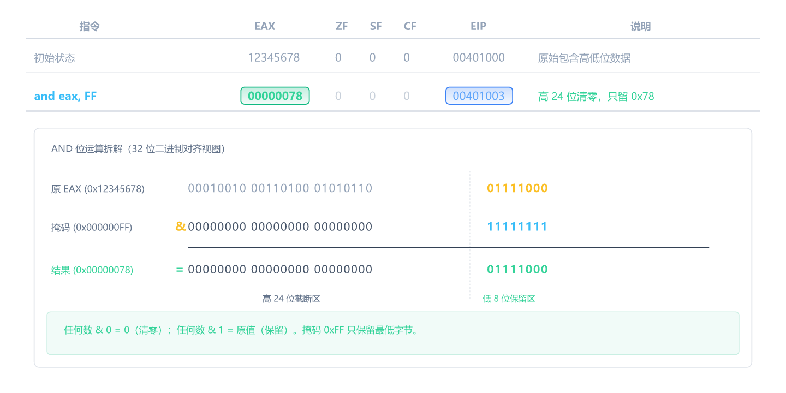
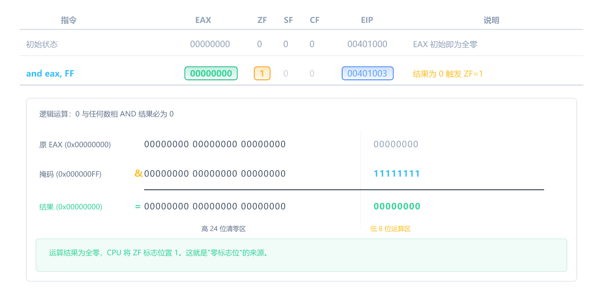
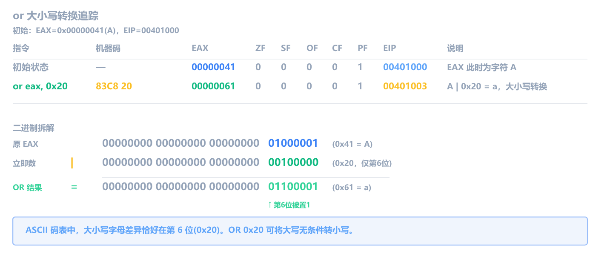
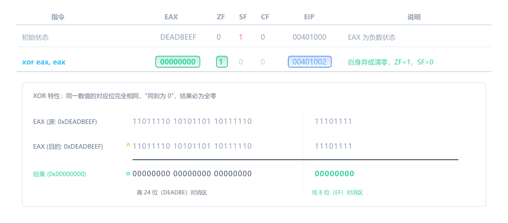
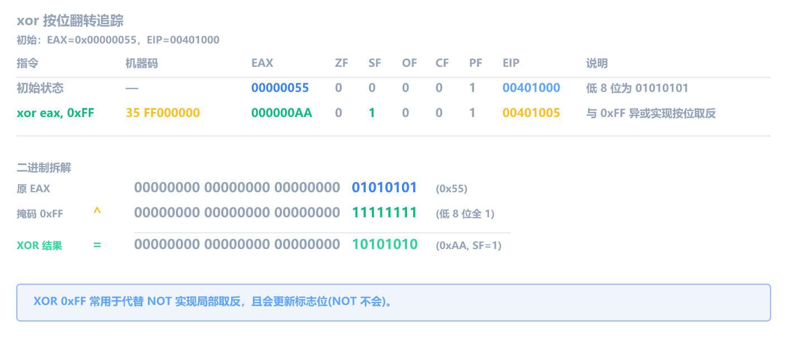
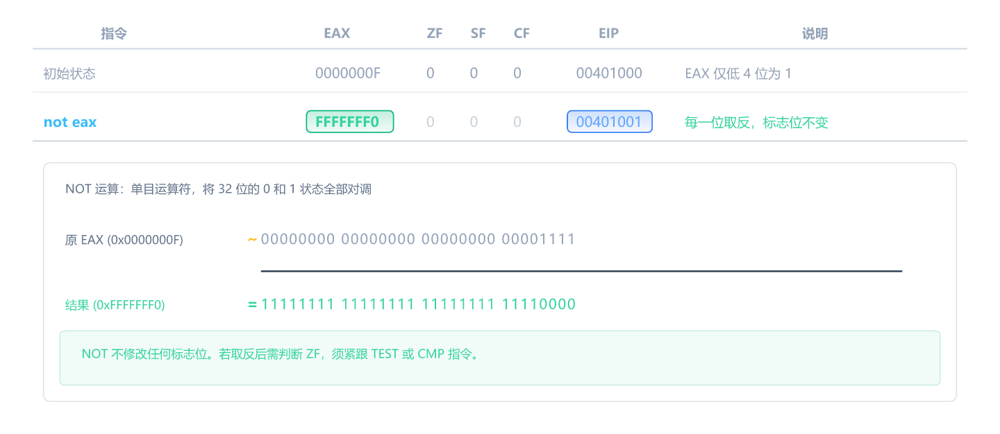
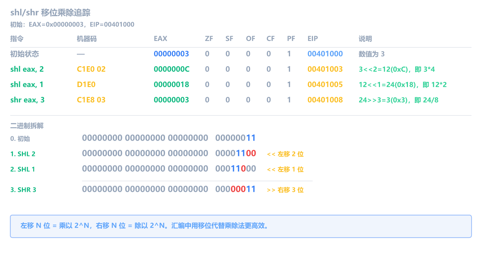
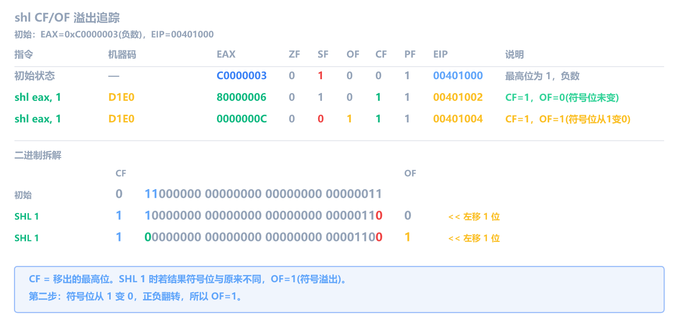
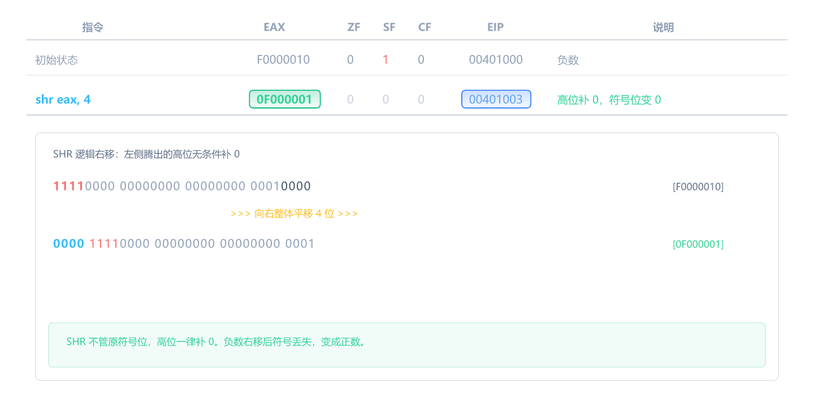
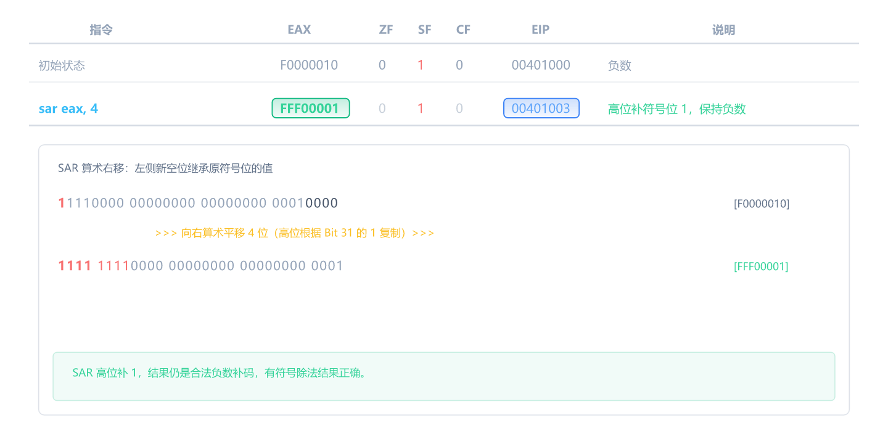

## 本章目标

上一章学了算术指令——它们做"数学运算"。这一章学**逻辑指令**和**移位指令**——它们做"位运算"。

为什么位运算重要？因为编译器最喜欢用位运算来优化代码。你在 x64dbg 里看到的很多"奇怪"的指令，其实都是位运算。

编译器为什么要优化？因为位运算指令通常比等价的算术指令**更短、更快**。比如 `xor eax, eax` 清零只要 2 字节，而 `mov eax, 0` 要 5 字节。更短的指令意味着更小的程序体积、更少的内存访问、更快的执行速度。编译器在生成代码时会自动选择最优的指令组合，所以你看到的汇编代码往往和源代码不是一一对应的。

这一章你将学会：

- 4 条逻辑指令：`and`、`or`、`xor`、`not`
- 4 条移位/旋转指令：`shl`、`shr`、`rol`、`ror`
- 掩码、设位、清零等常见操作
- 编译器用 `shl`/`shr` 优化乘除法的套路

**硬件小知识**：计算机底层其实做不了加减法——CPU 的加法器是由 XOR 门（求和）和 AND 门（进位）组合出来的。所以从硬件角度，逻辑运算才是"基础"，算术是"派生"。但对逆向来说，先学算术更容易上手——因为 `add`/`sub` 的含义比 `and`/`or` 更直观。

## 逻辑指令

逻辑指令对操作数的**每一位**独立做运算，常用于掩码、设位、清零。

所有逻辑指令（`and`/`or`/`xor`）都会**清零 CF 和 OF**。ZF/SF/PF 根据结果正常更新。`not` 不改任何标志位。

### 真值表：and / or / xor 的规则

三种逻辑运算的区别就在这张表里：

| A   | B   | and (A·B) | or (A+B) | xor (A⊕B) |
| --- | --- | --------- | -------- | --------- |
| 0   | 0   | 0         | 0        | 0         |
| 0   | 1   | 0         | 1        | 1         |
| 1   | 0   | 0         | 1        | 1         |
| 1   | 1   | 1         | 1        | 0         |

- **and**：两个都是 1 才是 1 -> 用来**过滤**（保留想要的位，其余清零）
- **or**：有一个是 1 就是 1 -> 用来**设位**（把特定位设为 1）
- **xor**：不同为 1，相同为 0 -> 用来**翻转**（特定位取反）

后面的例子都是这张表的 32 位版本——对每一位独立套用同样的规则。

### and：按位与

```
and eax, 0xFF              ; 寄存器 & 立即数（只保留最低字节）
and eax, ebx               ; 寄存器 & 寄存器
and dword ptr [ebp-4], 0   ; 内存 & 立即数
```

逐位做与运算：两位都是 1，结果才是 1；否则为 0。最常用的场景是**掩码操作**——用 `and` 把不需要的位清零。操作数规则同 add。

假设 EAX = `0x12345678`，EIP = `00401000`：



**影响标志位**：ZF/SF/PF 根据结果更新，**CF=0，OF=0**（逻辑指令永远清零这两个）。

再来一个——假设 EAX = `0x00000000`：



### or：按位或

```
or eax, 0x80               ; 寄存器 | 立即数（把第 7 位设为 1）
or eax, ebx                ; 寄存器 | 寄存器
or dword ptr [ebp-4], 1    ; 内存 | 立即数
```

逐位做或运算：只要有至少一个 1，结果就是 1。常用场景：**设置特定位为 1**。操作数规则同 add。

假设 EAX = `0x00000041`（ASCII 字符 'A'），EIP = `00401000`：



这是一个经典用法：`or` 第 5 位（0x20）可以把大写字母转成小写字母。

**影响标志位**：同 `and`——ZF/SF/PF 更新，**CF=0，OF=0**。

### xor：按位异或

```
xor eax, eax               ; 寄存器 ^ 寄存器（清零）
xor eax, 0x55              ; 寄存器 ^ 立即数（翻转特定位）
```

逐位做异或运算：两位不同为 1，相同为 0。`xor` 最常见的用法是**清零**——一个数和自己异或，结果一定是 0。操作数规则同 add。

假设 EAX = `0xDEADBEEF`，EIP = `00401000`：



**为什么不用 `mov eax, 0`？** 机器码长度不同：

| 指令           | 机器码           | 字节数 |
| -------------- | ---------------- | ------ |
| `xor eax, eax` | `31 C0`          | **2**  |
| `mov eax, 0`   | `B8 00 00 00 00` | 5      |

编译器选 `xor` 是因为短 3 字节，而且现代 CPU 对 `xor reg, reg` 有专门的优化路径（识别为归零操作，消除寄存器依赖）。**逆向时看到 `xor reg, reg` 就是在清零**，这是程序开头最常见的指令之一。

`xor` 另一个用途是**翻转特定位**：

假设 EAX = `0x00000055`，EIP = `00401000`：



`xor` 一个全 1 的掩码，效果相当于 `not`，但 `xor` 会更新标志位而 `not` 不会。

**影响标志位**：同 `and`/`or`——ZF/SF/PF 更新，**CF=0，OF=0**。`xor eax, eax` 之后 ZF 一定为 1。

### not：按位取反

```
not eax                     ; 寄存器取反
not dword ptr [ebp-4]       ; 内存取反
```

`not` 是单操作数指令——每一位取反（0 变 1，1 变 0）。操作数可以是寄存器或内存，不能是立即数。

假设 EAX = `0x0000000F`，EIP = `00401000`：



**not 不影响任何标志位**——ZF、SF、CF、OF 全部保持原值。偶尔在加密算法或求补码时出现（`not` + `add 1` = 取负数）。

## 移位和旋转指令

移位指令是编译器优化乘除法的首选工具。旋转指令在加密和哈希算法中常见。

### shl / shr：逻辑左移 / 右移

```
shl eax, 1                  ; 寄存器左移 1 位 = 乘以 2
shl eax, 2                  ; 寄存器左移 2 位 = 乘以 4
shr eax, 1                  ; 寄存器右移 1 位 = 除以 2
shr dword ptr [ebp-4], 3    ; 内存右移 3 位 = 除以 8
```

移位位数可以是立即数（1~31）或 CL 寄存器。目的操作数可以是寄存器或内存，不能是立即数。操作数规则和单操作数指令类似——只有一个操作数被修改，另一个是移位位数。

> **`shl eax, 1` 和 `add eax, eax` 等价**——都是乘以 2。但 `shl` 只需 2 字节，`add` 需要 2-3 字节，而且 `shl` 语义更明确。逆向中两种都会遇到。

**编译器乘除法优化对照表**：

| C 乘法   | 优化结果     | C 除法（无符号） | 优化结果     |
| -------- | ------------ | ---------------- | ------------ |
| `x * 2`  | `shl eax, 1` | `x / 2`          | `shr eax, 1` |
| `x * 4`  | `shl eax, 2` | `x / 4`          | `shr eax, 2` |
| `x * 8`  | `shl eax, 3` | `x / 8`          | `shr eax, 3` |
| `x * 16` | `shl eax, 4` | `x / 16`         | `shr eax, 4` |
| `x * 32` | `shl eax, 5` | `x / 32`         | `shr eax, 5` |

假设 EAX = `0x00000003`，EIP = `00401000`：



**影响标志位**：ZF/SF/PF 根据结果更新。**CF = 最后移出的那一位**。OF 只在移 1 位时有意义（符号位是否变化）。

来看一个 CF 和 OF 都有变化的例子。假设 EAX = `0xC0000003`（二进制最高两位为 11），EIP = `00401000`：



逐行解释：

- **第一行 `shl eax, 1`**：`0xC0000003` = `1100...0011`，左移 1 位后最高位的 `1` 移进 CF，CF=1。结果 `0x80000006` 最高位仍然是 1，符号没变，**OF=0**。
- **第二行 `shl eax, 1`**：`0x80000006` = `1000...0110`，左移 1 位后最高位的 `1` 移进 CF，CF=1。结果 `0x0000000C` 最高位变成 0，原来是负数现在变成了正数，正负号不一致 -> **OF=1**。

CF 的规则很简单：移出去的那一位就是 CF。OF 的判断也直白：移 1 位时，如果符号位发生了变化，就说明溢出了。

### sal / sar：算术左移 / 右移

```
sal eax, 2                   ; 算术左移 2 位（与 shl 完全相同）
sar eax, 3                   ; 算术右移 3 位（高位补符号位）
```

`sal` 和 `shl` 是同一条机器码，没有任何区别。逆向时看到 `shl` 就行。

`sar` 和 `shr` 的区别在于**高位怎么补**：

- `shr`（逻辑右移）：高位**补 0**
- `sar`（算术右移）：高位**补符号位**（正数补 0，负数补 1）

假设 EAX = `0xF0000010`（负数，最高位为 1），EIP = `00401000`。

先用 `shr` 右移 4 位：



`shr` 不管符号位，高位一律补 0。结果从负数变成了正数（`0x0F000001`），对于有符号数来说除法结果就错了。

再用 `sar` 右移同样的 4 位：



`sar` 发现最高位是 1（负数），所以高位补 1。结果仍然是负数（`0xFFF00001`），这才是正确的 `-268435440 / 16 = -16777216`。

**什么时候看到 `sar`**：编译器对有符号变量做除以 2 的幂次优化时用。更多时候编译器会用乘以倒数的方式（第五章讲过的 `imul` + `sar` 组合）。

### rol / ror：循环左移 / 右移

```
rol eax, 1                  ; 循环左移 1 位
ror eax, 4                  ; 循环右移 4 位
```

和 `shl`/`shr` 的区别：移出去的位不是丢弃，而是**绕回到另一端**。

先看 `rol eax, 1`，假设 EAX = `0x80000001`，EIP = `00401000`：

```
指令          EAX         ZF  SF  CF  EIP       说明
────────────────────────────────────────────────────────────
初始状态      80000001    0   1   0   00401000
rol eax, 1    00000003    0   0   1   00401002  最高位 1 绕回最低位，CF=1
```

```
移位前：1000 0000 0000 0000 0000 0000 0000 0001  (0x80000001)
最左边的 1 移出去 -> 绕回到最右边
结果：  0000 0000 0000 0000 0000 0000 0000 0011  (0x00000003)
CF = 移出的那位 = 1
```

再看 `rol eax, 4`，同样的初始值：

```
指令          EAX         ZF  SF  CF  EIP       说明
────────────────────────────────────────────────────────────
初始状态      80000001    0   1   0   00401000
rol eax, 4    00000018    0   0   0   00401003  高 4 位绕回低位，CF=0
```

```
移位前：1000 0000 0000 0000 0000 0000 0000 0001  (0x80000001)
高 4 位 1000 绕到低 4 位，其余左移 4 位
结果：  0000 0000 0000 0000 0000 0000 0001 1000  (0x00000018)
第 1 次左移移出 1 -> CF=1，第 2 次 0 -> CF=0，第 3 次 0 -> CF=0，第 4 次 0 -> CF=0
最终 CF=0（最后一次移出的是 0）
```

对比：`rol eax, 1` 时 CF=1（移出的是 `1`），`rol eax, 4` 时 CF=0（最后一次移出的是 `0`）。循环移位多次时，CF 等于**最后一次**移出的位，不是第一次。

**影响标志位**：ZF/SF/PF 根据结果更新。CF = 移出的位。OF 只在移 1 位时有意义。

`rol`/`ror` 在普通应用程序中很少出现，但在以下场景中常见：

- **加密算法**（DES、AES 等的密钥调度）
- **哈希函数**（MD5、SHA 系列的轮函数）
- **伪随机数生成器**
- **CRC 校验计算**

如果你在逆向中看到一段大量使用 `rol`/`ror` 的代码，多半是在做某种加密或哈希运算。

**ror 示例**：上面的 `rol eax, 4` 把 `0x80000001` 变成了 `0x00000018`。现在对 `0x00000018` 做 `ror`，看看能不能变回去。EIP = `00401000`：

```
指令          EAX         ZF  SF  CF  EIP       说明
────────────────────────────────────────────────────────────
初始状态      00000018    0   0   0   00401000
ror eax, 4    80000001    0   1   1   00401003  低 4 位 1000 绕到高位，CF=1
```

```
移位前：0000 0000 0000 0000 0000 0000 0001 1000  (0x00000018)
低 4 位 1000 绕到高 4 位，其余右移 4 位
结果：  1000 0000 0000 0000 0000 0000 0000 0001  (0x80000001)
第 4 次右移移出最低位的 1 -> CF=1
```

果然变回了 `0x80000001`。`ror` 是 `rol` 的逆操作——`rol eax, 4` 后再做 `ror eax, 4` 就恢复原值。

## 指令对标志位影响总结表

| 指令       | ZF     | SF     | CF       | OF       | 说明                     |
| ---------- | ------ | ------ | -------- | -------- | ------------------------ |
| `add`      | 更新   | 更新   | 更新     | 更新     | 加法，全更新             |
| `sub`      | 更新   | 更新   | 更新     | 更新     | 减法，全更新             |
| `inc`      | 更新   | 更新   | **不变** | 更新     | +1，保留 CF              |
| `dec`      | 更新   | 更新   | **不变** | 更新     | -1，保留 CF              |
| `imul`     | 未定义 | 未定义 | 更新     | 更新     | 乘法，只有 CF/OF 可靠    |
| `idiv/div` | 未定义 | 未定义 | 未定义   | 未定义   | 除法，标志位不可靠       |
| `and`      | 更新   | 更新   | **清零** | **清零** | 按位与                   |
| `or`       | 更新   | 更新   | **清零** | **清零** | 按位或                   |
| `xor`      | 更新   | 更新   | **清零** | **清零** | 按位异或                 |
| `not`      | 不变   | 不变   | 不变     | 不变     | 按位取反，不改任何标志位 |
| `shl`      | 更新   | 更新   | 移出的位 | 更新     | 逻辑左移                 |
| `shr`      | 更新   | 更新   | 移出的位 | 更新     | 逻辑右移                 |
| `rol`      | 更新   | 更新   | 移出的位 | 更新     | 循环左移                 |
| `ror`      | 更新   | 更新   | 移出的位 | 更新     | 循环右移                 |

**记忆口诀**：

- **`not` 什么都不改**——独一无二的"安静"指令
- **`inc`/`dec` 不改 CF**——保护循环中的进位标志
- **逻辑三兄弟（and/or/xor）清零 CF 和 OF**——每一位独立运算，不需要进位，所以没有进位也没有溢出，CF 和 OF 直接固定为 0
- **移位指令的 CF = 移出的位**——移出去什么 CF 就是什么

## 速查表

| 指令        | 作用     | C 等价        | 改什么  | 改标志位？       |
| ----------- | -------- | ------------- | ------- | ---------------- |
| `add a, b`  | 加法     | `a += b`      | a       | 是（全部）       |
| `sub a, b`  | 减法     | `a -= b`      | a       | 是（全部）       |
| `inc a`     | +1       | `a++`         | a       | 是（不改 CF）    |
| `dec a`     | -1       | `a--`         | a       | 是（不改 CF）    |
| `imul a, b` | 乘法     | `a *= b`      | a       | 是（OF/CF）      |
| `idiv b`    | 有符号除 | EAX=商 EDX=余 | EDX:EAX | 不可靠           |
| `div b`     | 无符号除 | 同上          | EDX:EAX | 不可靠           |
| `and a, b`  | 按位与   | `a &= b`      | a       | 是（CF=0, OF=0） |
| `or a, b`   | 按位或   | `a \|= b`     | a       | 是（CF=0, OF=0） |
| `xor a, a`  | 清零     | `a = 0`       | a       | 是（CF=0, OF=0） |
| `not a`     | 按位取反 | `a = ~a`      | a       | 否               |
| `shl a, n`  | 左移     | `a <<= n`     | a       | 是（CF=移出位）  |
| `shr a, n`  | 右移     | `a >>= n`     | a       | 是（CF=移出位）  |
| `sal a, n`  | 算术左移 | 同 shl        | a       | 是（CF=移出位）  |
| `sar a, n`  | 算术右移 | 有符号 `>>=`  | a       | 是（CF=移出位）  |
| `rol a, n`  | 循环左移 | —             | a       | 是（CF=移出位）  |
| `ror a, n`  | 循环右移 | —             | a       | 是（CF=移出位）  |

## 练习

### 第一题：xor 清零和标志位

初始 EAX = `0xDEADBEEF`，ZF = `0`。执行以下两条指令后，EAX 和 ZF 各是什么？

```
xor eax, eax
mov eax, 0
```

<details>
<summary>答案</summary>

执行 `xor eax, eax` 后 EAX = `0x00000000`，ZF = `1`。
执行 `mov eax, 0` 后 EAX = `0x00000000`（没变），**但 ZF 仍为 `1`**——因为 `mov` 不改标志位。

两条指令最终效果相同（EAX = 0），但 `xor` 会设 ZF=1，`mov` 不碰 ZF。

</details>

### 第二题：掩码操作

初始 EAX = `0xABCD1234`。执行以下指令后，EAX 的值是什么？

```
and eax, 0x0000FFFF
```

<details>
<summary>答案</summary>

EAX = `0x00001234`。

`0x0000FFFF` 是一个掩码，高 16 位全是 0，低 16 位全是 1。AND 之后高 16 位被清零，低 16 位保留。这就是"取低字（低 16 位）"的标准操作。

</details>

### 第三题：移位乘法

初始 EAX = `0x00000007`。执行以下指令后，EAX 的值是什么？等于 `7 * 16` 吗？

```
shl eax, 4
```

<details>
<summary>答案</summary>

EAX = `0x00000070` = `112` = `7 * 16`。正确。

左移 4 位 = 乘以 2^4 = 乘以 16。二进制验证：

```
7     = 0000 0000 0000 0000 0000 0000 0000 0111
<< 4  = 0000 0000 0000 0000 0000 0000 0111 0000  = 112 (0x70)
```

</details>

### 第四题：rol 循环移位

初始 EAX = `0x0000000E`（二进制 `...1110`）。执行以下指令后，EAX 和 CF 各是什么？

```
rol eax, 1
```

<details>
<summary>答案</summary>

EAX = `0x0000001C`，CF = `0`。

```
0x0E = ...0000 1110
ROL 1: 最左边的 0 移出去绕回到最低位
结果 = ...0001 1100 = 0x1C = 28
CF = 移出的位 = 0
```

`0x0E` 的最高有效位（bit 3）是 1，但 32 位视角下 bit 31 是 0，所以移出的是 0，CF=0。效果等于 `0x0E * 2 = 0x1C = 28`。

</details>
