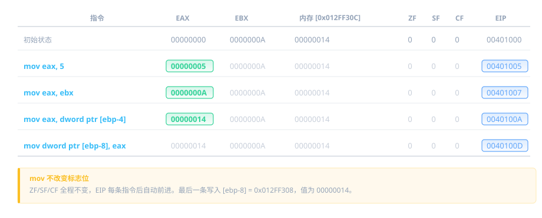

# 内存与数据操作

上一章我们认识了寄存器和 x64dbg 窗口。但寄存器只有 8 个，存不了多少东西。程序的大部分数据存在**内存**里，通过**地址**来访问。这章讲汇编怎么读写内存，以及三条最基础的指令：`mov`、`lea`、`nop`。

## 内存怎么表示

汇编里访问内存用方括号 `[]`，类似 C 的指针解引用 `*ptr`：

```
mov eax, [ebp-4]          ; 从内存地址 (ebp-4) 读 4 字节到 eax
mov [ebp-8], eax          ; 把 eax 的值写到内存地址 (ebp-8)
```

x64dbg 里显示更详细，会带大小前缀：

```
mov eax, dword ptr [ebp-4]
mov dword ptr [ebp-8], eax
```

### 大小前缀

`dword ptr` 意思是"这次读/写 4 个字节"。CPU 需要知道操作多大的数据。怎么知道的？两种方式：

**方式一：从寄存器推断。** 如果一个操作数是寄存器，CPU 根据寄存器大小决定：

```
mov eax, [ebp-4]          ; EAX 是 32 位，所以读 4 字节
mov ax, [ebp-4]           ; AX 是 16 位，所以读 2 字节
mov al, [ebp-4]           ; AL 是 8 位，所以读 1 字节
```

**方式二：显式指定。** 如果没有寄存器可以推断（比如两个操作数都是常数或内存），必须写明：

```
mov dword ptr [ebp-4], 0  ; 明确写 4 字节的 0
mov word ptr [ebp-4], 0   ; 明确写 2 字节的 0
mov byte ptr [ebp-4], 0   ; 明确写 1 字节的 0
```

大小前缀对照表：

| 前缀        | 大小   | 名称 | 对应 C 类型              | 汇编声明 |
| ----------- | ------ | ---- | ------------------------ | -------- |
| `byte ptr`  | 1 字节 | 字节 | char, bool               | `db`     |
| `word ptr`  | 2 字节 | 字   | short                    | `dw`     |
| `dword ptr` | 4 字节 | 双字 | int, unsigned int, float | `dd`     |
| `qword ptr` | 8 字节 | 四字 | long long, double        | `dq`     |

最右边一列是汇编语言里的数据声明伪指令：`db`（define byte）、`dw`（define word）、`dd`（define dword）、`dq`（define qword）。你在 IDA 或 x64dbg 的数据窗口里看到 `dd 12345678h`，就是在说"这里定义了一个 4 字节数据，值是 `0x12345678`"。

**`dword ptr` 最常见**，因为 int 是 4 字节。偶尔看到 `byte ptr`（char）和 `word ptr`（short）。

### 地址是怎么算出来的

方括号里的表达式叫做**有效地址（Effective Address）**，计算公式是：

```
有效地址 = 基址 + 索引 × 比例 + 偏移
```

x64dbg 支持几种格式：

```
[固定地址]              mov eax, dword ptr [0040A000]       ; 直接地址（全局变量）
[寄存器]                mov eax, dword ptr [ecx]            ; 寄存器指向的地址
[寄存器 + 偏移]         mov eax, dword ptr [ebp-4]          ; 局部变量
```

前三种最常见，后面两种是数组访问用的，先混个眼熟，后面遇到再回来查：

```
[寄存器 + 寄存器*比例]   mov eax, dword ptr [ecx + edx*4]    ; 数组访问 array[edx]
[寄存器 + 寄存器*比例 + 偏移]  mov eax, dword ptr [ebp + ecx*4 - 8]  ; 结构体里的数组
```

计算方式就是字面意思——把各部分加起来。假设 EBP = `0x012FF310`：

```
mov eax, dword ptr [ebp-4]
```

有效地址 = `0x012FF310 - 4` = `0x012FF30C`。CPU 去 `0x012FF30C` 这个地址读 4 字节，放进 EAX。

```
mov eax, dword ptr [ecx + edx*4]
```

假设 ECX = `0x0040A000`，EDX = `3`。有效地址 = `0x0040A000 + 3*4` = `0x0040A00C`。这就是数组 `array[3]`（每个元素 4 字节）的地址。

<!-- 🎨 画图：内存寻址示意图，标注地址计算过程 -->

### 大小端

x86 是**小端序（Little-Endian）**——低字节存在低地址。

比如 EAX = `0x12345678`，写到 `[ebp-4]` 时，内存里是这样的：

```
地址         字节
[ebp-4]     78     ← 最低字节在最低地址
[ebp-3]     56
[ebp-2]     34
[ebp-1]     12     ← 最高字节在最高地址
```

所以在 x64dbg 的内存窗口里，你看到 `78 56 34 12`，要反着读，实际值是 `0x12345678`。

**为什么 x86 用小端？** 因为读取不同宽度的数据时起始地址不变。比如地址 0x100 存了 `0x12345678`：读 1 字节（byte）读 `[0x100]` = `0x78`，读 2 字节（word）读 `[0x100]` = `0x5678`，读 4 字节（dword）读 `[0x100]` = `0x12345678`，起始地址都是 0x100。大端序则不同宽度起始地址会偏移。

### 大小端在不同窗口的表现

同样的数据 `0x12345678`，在不同窗口里看起来不一样：

| 窗口       | 显示样子                          | 说明                               |
| ---------- | --------------------------------- | ---------------------------------- |
| CPU 窗口   | `mov dword ptr [ebp-4], 12345678` | 指令里直接写正常数值，不需要反着读 |
| 寄存器窗口 | `EAX : 12345678`                  | 也是正常显示                       |
| 内存窗口   | `78 56 34 12`                     | 按字节顺序显示，**需要反着读**     |
| 堆栈窗口   | `78 56 34 12`                     | 同内存窗口，按字节显示，需要反着读 |

**规律**：CPU 窗口和寄存器窗口已经帮你把小端序转换好了，直接看。只有内存窗口和堆栈窗口是原始字节流，需要你自己反着读。

这其实就是"显示方式"的区别：内存窗口是"这块内存里到底存了什么字节"，是原始的、底层的；CPU 窗口和寄存器窗口是"这些字节代表什么数值"，是经过解读的。

## mov：搬数据

`mov` 是最基础也最常用的指令。它把数据从"源"搬到"目的"，**不做计算，不改任何标志位**。

### 四种用法

```
mov eax, 5                    ; 立即数 → 寄存器
mov ebx, eax                  ; 寄存器 → 寄存器
mov eax, dword ptr [ebp-4]    ; 内存 → 寄存器
mov dword ptr [ebp-4], eax    ; 寄存器 → 内存
```

操作数分三种类型：

| 类型       | 说明                               | 例子                     |
| ---------- | ---------------------------------- | ------------------------ |
| **立即数** | 直接写在指令里的常数值             | `5`、`0xFF`、`0x1234`    |
| **寄存器** | 寄存器里的值                       | `eax`、`ebx`、`cl`       |
| **内存**   | 方括号括起来的地址，指向内存里的值 | `[ebp-4]`、`[ecx+edx*4]` |

`mov` 的源操作数可以是三种中的任何一种，目的操作数只能是寄存器或内存。

### 执行后的变化跟踪

假设初始状态：EAX = `0`，EBX = `0x0000000A`，EBP = `0x012FF310`，内存 `[0x012FF30C]` = `0x00000014`



注意几个要点：

- **mov 不改变源操作数**。`mov eax, ebx` 之后 EBX 不变
- **mov 不改变任何标志位**。ZF/SF/CF 全程不变
- **EIP 每次自动前进**到下一条指令的地址

### mov 不能做的事

`mov` 不能直接在两个内存地址之间搬运数据。下面这样**不行**：

```
mov dword ptr [ebp-4], dword ptr [ebp-8]    ← 错误！不能内存到内存
```

**为什么？** x86 的指令编码格式规定：一条指令最多只能有一个操作数引用内存。这是 CPU 硬件层面的设计限制——指令里只留了一个"内存地址"的位置，装不下两个。所以所有 x86 指令都遵守这个规则，不只是 `mov`。

必须经过寄存器中转：

```
mov eax, dword ptr [ebp-8]      ; 先从内存读到寄存器
mov dword ptr [ebp-4], eax      ; 再从寄存器写到内存
```

## MOVSX 和 MOVZX：带扩展的搬数据

普通的 `mov` 只能在**同等大小**的寄存器之间搬数据。但 C 语言经常把 `char`（1 字节）赋给 `int`（4 字节），编译器怎么处理这种"小变大"？答案就是 `movsx` 和 `movzx`。

### MOVSX：符号扩展

`movsx`（Move with Sign-Extension）把小类型提升为大类型，**高位用符号位填充**。

假设 AL = `0xFF`（有符号是 -1）：

```
movsx eax, al
```

执行后 EAX = `0xFFFFFFFF`（还是 -1）。符号扩展保持数值不变：AL 的最高位是 1，所以 EAX 的高 24 位全填 1。

如果 AL = `0x7F`（有符号是 127）：

```
movsx eax, al
```

执行后 EAX = `0x0000007F`（还是 127）。AL 最高位是 0，高 24 位全填 0。

### MOVZX：零扩展

`movzx`（Move with Zero-Extension）把小类型提升为大类型，**高位全部填 0**。

同样 AL = `0xFF`：

```
movzx eax, al
```

执行后 EAX = `0x000000FF`（255，不是 -1）。不管 AL 的符号位是什么，高位一律填 0。

### 同一个值，两条指令的结果对比

假设 AL = `0xFF`：

| 指令            | EAX 结果     | 十进制 | 怎么来的                |
| --------------- | ------------ | ------ | ----------------------- |
| `movsx eax, al` | `0xFFFFFFFF` | -1     | AL 符号位=1，高位全填 1 |
| `movzx eax, al` | `0x000000FF` | 255    | 高位无条件填 0          |

再假设 AL = `0x7F`：

| 指令            | EAX 结果     | 十进制 | 怎么来的                |
| --------------- | ------------ | ------ | ----------------------- |
| `movsx eax, al` | `0x0000007F` | 127    | AL 符号位=0，高位全填 0 |
| `movzx eax, al` | `0x0000007F` | 127    | 高位无条件填 0          |

正数时结果一样，负数时结果不同。

### 什么时候会出现

逆向中最常见的场景是**函数参数传递**。C 的 `char` 或 `short` 做参数时会自动提升为 `int`：

```c
char c = -1;
int x = c;
```

编译器会生成 `movsx eax, al`（signed char）或 `movzx eax, al`（unsigned char）。你在 x64dbg 里看到 `movsx`，就知道源数据是有符号小类型；看到 `movzx`，就是无符号小类型。

## XCHG：交换两个操作数

`xchg` 把两个操作数的值互换：

```
xchg eax, ebx                ; 寄存器 ↔ 寄存器
xchg eax, dword ptr [ebp-4]  ; 寄存器 ↔ 内存
```

假设 EAX = `0x00000001`，EBX = `0x00000002`，执行后 EAX = `0x00000002`，EBX = `0x00000001`。

操作数规则和 `mov` 类似——两个操作数不能都是内存。此外 `xchg` 不接受立即数（两边都要能被读和写）。

如果不用 `xchg`，交换两个寄存器需要三条指令（借助第三个寄存器中转，或者用 xor 技巧）。`xchg` 一条搞定。

`xchg` 有个有趣的特殊情况：`xchg eax, eax` 就是把 EAX 和自己交换——等于什么都没做。这条指令的机器码是 `0x90`，正是 NOP。后面讲 NOP 时会提到这一点。

`xchg` 不影响任何标志位（ZF、SF、CF 等全部不变）。

逆向中 `xchg` 不算常见，但偶尔会遇到，知道是交换就行。

## lea：算地址（不读内存）

```
lea eax, dword ptr [ebp-4]          ; eax = ebp - 4（算出地址，不读内存）
```

`lea`（Load Effective Address）只计算方括号里的地址值，**不访问内存**。和 `mov` 的区别：

```
; 假设 EBP = 0x012FF310，内存 [0x012FF30C] = 0x00000014

mov eax, dword ptr [ebp-4]    ; eax = 0x00000014（读内存内容）
lea eax, dword ptr [ebp-4]    ; eax = 0x012FF30C（算地址本身）
```

`mov` 去内存里取了值，`lea` 只算了地址。相当于 C 里的：

- `mov eax, [ebp-4]` → `eax = *ptr;`（取值）
- `lea eax, [ebp-4]` → `eax = &var;`（取地址）

编译器经常用 `lea` 做**快速算术**，因为方括号里可以写乘法和加法：

```
lea eax, dword ptr [ecx + edx*4]    ; eax = ecx + edx * 4
```

等价于 C 的 `eax = ecx + edx * 4`，但一条指令搞定，不访问内存，不改标志位。

### 执行后的变化跟踪

假设 ECX = `0x0040A000`，EDX = `3`：

```
指令                               EAX         ZF SF CF
──────────────────────────────────────────────────────
lea eax, dword ptr [ecx+edx*4]    0040A00C    不变 不变 不变
```

CPU 算了一下 `0x0040A000 + 3*4 = 0x0040A00C`，把结果放进 EAX。没有读内存，没有改标志位。

**看到 `lea` 的窍门**：假装方括号不存在，直接做方括号里面的算术就行了。

## nop：什么都不做

```
nop                      ; 空操作，CPU 直接跳过
```

NOP 的机器码是 `0x90`。有趣的是，`0x90` 其实是 `XCHG EAX, EAX`（把 EAX 和自己交换）的编码——和自己交换等于什么都没做，所以它天然就是"空操作"。

执行后什么都不变——寄存器不变、内存不变、标志位不变，只有 EIP 前进到下一条。

它的主要用途就是"占位"和"擦除"。第1章你用 `Ctrl+9` 把 `jne` 填充成 NOP，就是用无害的空操作替换掉跳转指令，让那条判断失效。

## 回到 x64dbg 实操

打开 x64dbg，加载第1章你编译的 CrackMe 程序。按 Alt+F9 跳到用户代码区域。这次我们有具体任务：

### 任务一：观察 mov 改变寄存器

1. 在 CPU 窗口里找到一条 `mov eax, xxx` 或 `mov dword ptr [ebp-xx], xxx` 指令
2. 在那行按 **F2** 设断点（行变红）
3. 按 **F9** 运行到断点
4. 看**寄存器窗口**里 EAX 的当前值
5. 按 **F8** 单步执行一次
6. 看 EAX 是否变红了？新值是什么？

<!-- 📸 截图：x64dbg 单步执行 mov 指令前后的寄存器窗口对比 -->

### 任务二：在内存窗口看数据

1. 在寄存器窗口找到 EBP 的值（比如 `0x012FF310`）
2. 点击**内存窗口**，按 **Ctrl+G**，输入 EBP 的值，回车
3. 你看到了什么？是一堆十六进制字节
4. 单步执行几条 `mov dword ptr [ebp-4], xxx` 指令
5. 再看内存窗口 `[EBP-4]` 对应的位置，值变了没？

<!-- 📸 截图：x64dbg 内存窗口显示 ebp-4 位置的数据变化 -->

### 任务三：观察标志位不变

1. 找到一条 `mov eax, 0` 指令
2. 在它前面按 F2 设断点，F9 跑过来
3. 先看 **EFLAGS** 区域 ZF 的值（0 还是 1）
4. 按 F8 执行 `mov eax, 0`
5. ZF 变了吗？——**不应该变**，因为 mov 不影响标志位

### 任务四：亲手触发 EFLAGS 变化

这个任务我们手动制造一条算术指令，亲眼看看 EFLAGS 怎么变：

> 如果操作过程中程序崩溃或跑飞了，没关系——直接重新把 exe 拖进 x32dbg 就行。

1. 在 CPU 窗口找到一段 NOP 区域（一片 `nop` 的地方）。如果没有，找到一块空间，选中几行按 **Ctrl+9**（Fill with NOPs）清出一块空地
2. 在第一个 NOP 上按**空格键**，输入 `mov eax, 0FFFFFFFF`，回车确认。光标会自动移到下一行
3. 重复上一步，依次输入 `add eax, 1` 和 `sub eax, 0`。现在你有三条自写指令了
4. 回到 `mov eax, 0FFFFFFFF` 这行按 **F2** 设断点（行变红）
5. 按 **F9** 运行到断点
6. 观察寄存器窗口：**EAX 当前值、EFLAGS 整体值、ZF/SF/CF/OF 各个位的值**
7. 按 **F8** 执行 `mov eax, 0FFFFFFFF` — EAX 变成 `FFFFFFFF`，标志位有没有变？（应该不变，mov 不影响标志位）
8. 再按 **F8** 执行 `add eax, 1` — EAX 变成 `00000000`（溢出了！），看看：
   - **ZF** 变成 1（结果是零）
   - **CF** 变成 1（加法最高位产生了进位）
   - **EFLAGS** 整体值也变了
9. 再按 **F8** 执行 `sub eax, 0` — EAX 还是 `00000000`，看看 ZF 还是 1 吗？CF 呢？

<!-- 📸 截图：执行 add eax,1 后 EFLAGS 各标志位变化（变红高亮） -->

## 练习

### 第一题

以下指令执行后，EAX 和 EBX 的值各是什么？

```
mov ebx, 0
mov eax, 0x2A
mov ebx, eax
```

<details>
<summary>答案</summary>

EAX = `0x2A`（42），EBX = `0x2A`（42）。`mov ebx, eax` 把 EAX 的值复制到 EBX，EAX 不变。

</details>

### 第二题

以下指令执行后，ZF 和 SF 的值有变化吗？

```
mov eax, 0
```

<details>
<summary>答案</summary>

没有变化。`mov` **不影响任何标志位**。虽然 EAX 变成了 0，但 ZF 不会因此变成 1。只有算术和逻辑指令（add、sub、cmp、test 等）才会改标志位。

</details>

### 第三题

假设 EBP = `0x012FF310`，执行以下指令后，EAX 的值是什么？内存地址 `0x012FF30C` 里的值被改变了吗？

```
lea eax, dword ptr [ebp-4]
```

<details>
<summary>答案</summary>

EAX = `0x012FF30C`（即 `0x012FF310 - 4`）。内存没有被访问，所以 `0x012FF30C` 里的值不变。`lea` 只算地址，不读不写内存。

</details>

### 第四题

EAX = `0x12345678`，执行 `mov al, 0xFF` 后 EAX 变成什么？EBX 会变吗？

<details>
<summary>答案</summary>

EAX = `0x123456FF`。`al` 是 EAX 的最低字节，修改它只影响最低字节，高 24 位不变。EBX 完全不受影响——`mov al, 0xFF` 根本没碰 EBX。

</details>

### 第五题

以下指令执行后，EAX 的值是什么？

```
mov eax, 0xA
mov ecx, eax
add eax, 5
```

先在纸上预测，然后用 x64dbg 验证（在空白处按空格输入这些指令，F8 单步执行）。

<details>
<summary>答案</summary>

```
指令           EAX   ECX
mov eax, 0xA   0xA   ?
mov ecx, eax   0xA   0xA
add eax, 5     0xF   0xA
```

EAX = `0xF`（15）。ECX = `0xA`（10）（add 只改了 EAX，没碰 ECX）。

</details>

### 第六题

`mov eax, [ebp-4]` 和 `lea eax, [ebp-4]` 有什么区别？假设 EBP = `0x012FF300`，内存地址 `0x012FF2FC` 里存着 `0xDEADBEEF`。

<details>
<summary>答案</summary>

- `mov eax, [ebp-4]` — EAX = `0xDEADBEEF`（读内存里的值）
- `lea eax, [ebp-4]` — EAX = `0x012FF2FC`（算地址本身）

`mov` 去 `0x012FF2FC` 取了值回来，`lea` 只算了 `0x012FF300 - 4 = 0x012FF2FC` 这个地址。

</details>
