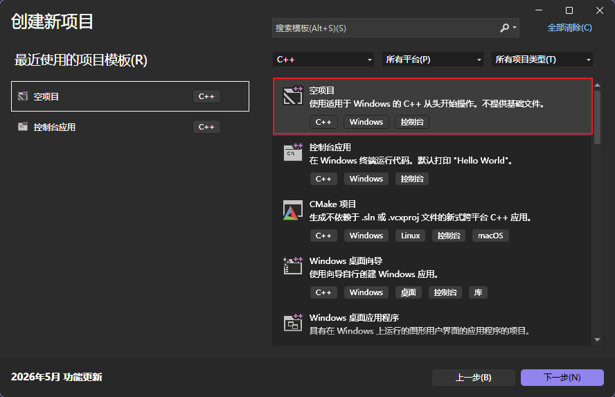
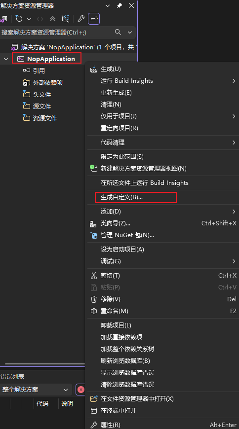
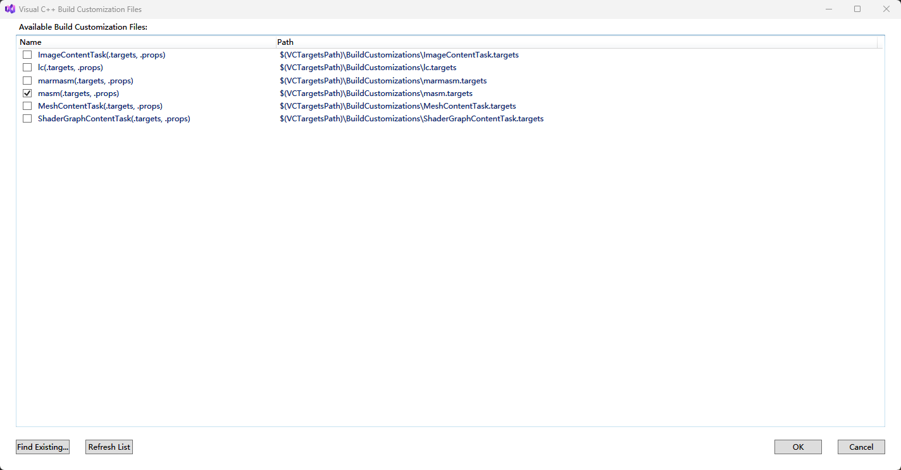
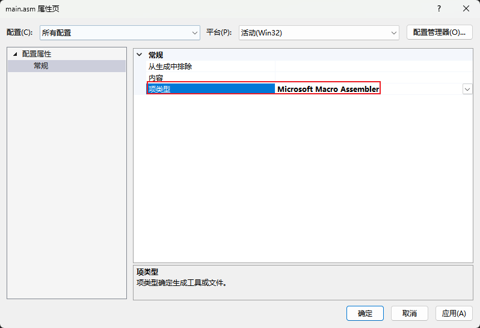
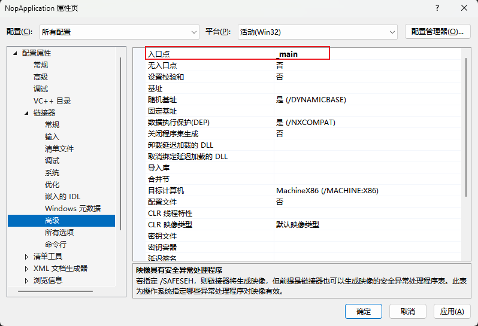
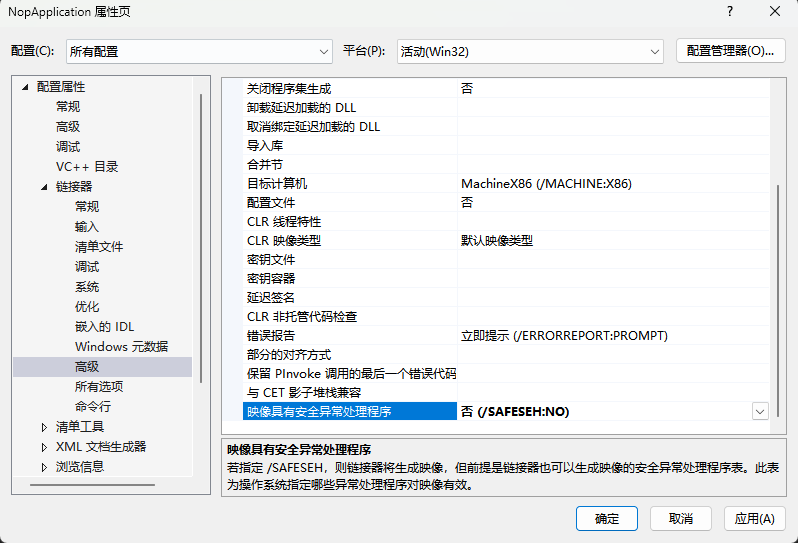

上一章我们认识了寄存器和 x64dbg 窗口。但寄存器只有 8 个，存不了多少东西。程序的大部分数据存在**内存**里，通过**地址**来访问。这章先搞懂汇编怎么表示和访问内存，再生成一个练习用的空白程序。

## 内存怎么表示

汇编里访问内存用方括号 `[]`，类似 C 的指针解引用 `*ptr`：

```asm
mov eax, [ebp-4]          ; 从内存地址 (ebp-4) 读 4 字节到 eax
mov [ebp-8], eax          ; 把 eax 的值写到内存地址 (ebp-8)
```

x64dbg 里显示更详细，会带大小前缀：

```asm
mov eax, dword ptr [ebp-4]
mov dword ptr [ebp-8], eax
```

### 大小前缀

`dword ptr` 意思是"这次读/写 4 个字节"。CPU 需要知道操作多大的数据。怎么知道的？两种方式：

**方式一：从寄存器推断。** 如果一个操作数是寄存器，CPU 根据寄存器大小决定：

```asm
mov eax, [ebp-4]          ; EAX 是 32 位，所以读 4 字节
mov ax, [ebp-4]           ; AX 是 16 位，所以读 2 字节
mov al, [ebp-4]           ; AL 是 8 位，所以读 1 字节
```

**方式二：显式指定。** 如果没有寄存器可以推断（比如两个操作数都是常数或内存），必须写明：

```asm
mov dword ptr [ebp-4], 0  ; 明确写 4 字节的 0
mov word ptr [ebp-4], 0   ; 明确写 2 字节的 0
mov byte ptr [ebp-4], 0   ; 明确写 1 字节的 0
```

大小前缀对照表：

| 前缀        | 大小   | 名称 | 对应 C 类型              | 汇编声明 |
| ----------- | ------ | ---- | ------------------------ | -------- |
| `byte ptr`  | 1 字节 | 字节 | char, bool               | `db`     |
| `word ptr`  | 2 字节 | 字   | short                    | `dw`     |
| `dword ptr` | 4 字节 | 双字 | int, unsigned int, float | `dd`     |
| `qword ptr` | 8 字节 | 四字 | long long, double        | `dq`     |

最右边一列是汇编语言里的数据声明伪指令：`db`（define byte）、`dw`（define word）、`dd`（define dword）、`dq`（define qword）。你在 IDA 或 x64dbg 的数据窗口里看到 `dd 12345678h`，就是在说"这里定义了一个 4 字节数据，值是 `0x12345678`"。

**`dword ptr` 最常见**，因为 int 是 4 字节。偶尔看到 `byte ptr`（char）和 `word ptr`（short）。

### 地址是怎么算出来的

方括号里的表达式叫做**有效地址（Effective Address）**，计算公式是：

```text
有效地址 = 基址 + 索引 × 比例 + 偏移
```

x64dbg 支持几种格式：

```asm
[固定地址]              mov eax, dword ptr [0040A000]       ; 直接地址（全局变量）
[寄存器]                mov eax, dword ptr [ecx]            ; 寄存器指向的地址
[寄存器 + 偏移]         mov eax, dword ptr [ebp-4]          ; 局部变量
```

前三种最常见，后面两种是数组访问用的，先混个眼熟，后面遇到再回来查：

```asm
[寄存器 + 寄存器*比例]   mov eax, dword ptr [ecx + edx*4]    ; 数组访问 array[edx]
[寄存器 + 寄存器*比例 + 偏移]  mov eax, dword ptr [ebp + ecx*4 - 8]  ; 结构体里的数组
```

计算方式就是字面意思，就是把各部分加起来。

假设 EBP = `0x012FF310`：

```asm
mov eax, dword ptr [ebp-4]
```

有效地址 = `0x012FF310 - 4` = `0x012FF30C`。CPU 去 `0x012FF30C` 这个地址读 4 字节，放进 EAX。

```asm
mov eax, dword ptr [ecx + edx*4]
```

假设 ECX = `0x0040A000`，EDX = `3`。有效地址 = `0x0040A000 + 3*4` = `0x0040A00C`。这就是数组 `array[3]`（每个元素 4 字节）的地址。

<!-- 🎨 画图：内存寻址示意图，标注地址计算过程 -->

### 大小端

x86 是**小端序（Little-Endian）**，低字节存在低地址。

比如 EAX = `0x12345678`，写到 `[ebp-4]` 时，内存里是这样的：

```asm
地址         字节
[ebp-4]     78     ← 最低字节在最低地址
[ebp-3]     56
[ebp-2]     34
[ebp-1]     12     ← 最高字节在最高地址
```

所以在 x64dbg 的内存窗口里，你看到 `78 56 34 12`，要反着读，实际值是 `0x12345678`。

**为什么 x86 用小端？** 因为读取不同宽度的数据时起始地址不变。比如地址 0x100 存了 `0x12345678`：读 1 字节（byte）读 `[0x100]` = `0x78`，读 2 字节（word）读 `[0x100]` = `0x5678`，读 4 字节（dword）读 `[0x100]` = `0x12345678`，起始地址都是 0x100。大端序则不同宽度起始地址会偏移。

### 大小端在不同窗口的表现

同样的数据 `0x12345678`，在不同窗口里看起来不一样：

| 窗口       | 显示样子                          | 说明                               |
| ---------- | --------------------------------- | ---------------------------------- |
| CPU 窗口   | `mov dword ptr [ebp-4], 12345678` | 指令里直接写正常数值，不需要反着读 |
| 寄存器窗口 | `EAX : 12345678`                  | 也是正常显示                       |
| 内存窗口   | `78 56 34 12`                     | 按字节顺序显示，**需要反着读**     |
| 堆栈窗口   | `78 56 34 12`                     | 同内存窗口，按字节显示，需要反着读 |

**规律**：CPU 窗口和寄存器窗口已经帮你把小端序转换好了，直接看。只有内存窗口和堆栈窗口是原始字节流，需要你自己反着读。

这其实就是"显示方式"的区别：内存窗口是"这块内存里到底存了什么字节"，是原始的、底层的；CPU 窗口和寄存器窗口是"这些字节代表什么数值"，是经过解读的。

## 生成一个练习用的空白程序

后面的章节会经常让你在 x64dbg 里手写汇编指令来实验。你需要一个代码段全是 NOP 的 exe，相当于一块空白画布，想写什么指令都可以。

用 C 写一个全是 `__nop()` 的函数？不太干净，编译器会偷偷加各种初始化代码。最纯粹的方法是用 **MASM（Microsoft Macro Assembler）**，直接写汇编源码，编译出来的 exe 代码段就是你写的那些指令，不多不少。

### 步骤

1. 打开 VS，创建一个 **C++ 空项目（Empty Project）**

   

2. 在右侧**解决方案资源管理器**中，**右键项目名称** -> **生成依赖项（Build Dependencies）** -> **生成自定义（Build Customizations...）**

   

   在弹出的窗口中勾选 **masm** -> 确定

   

3. 在右侧**解决方案资源管理器**中，**右键"源文件"文件夹** -> **添加** -> **新建项** -> 创建一个名为 `main.asm` 的文件（后缀必须是 `.asm`）

   

4. 把项目顶部的配置改成 **Release | x86**（我们要生成 32 位程序，且 Release 模式不会有额外的调试代码）

5. 右键 `main.asm` -> **属性**，把**项类型（Item Type）** 改为 **Microsoft Macro Assembler**

   

6. 把 `main.asm` 的内容替换成：

```asm
.386                     ; 声明使用 80386 处理器指令集
.model flat, stdcall     ; 32位 Windows 必须的平坦内存模型

.code                    ; 代码段开始

_main PROC               ; 32位下，内部函数名加个下划线 _main
    ; 循环生成 4096 个 NOP
    REPT 4096
        nop
    ENDM

    ret
_main ENDP

END                      ; 结束
```

7. **设置入口点**：右键项目 -> **属性** -> **链接器（Linker）** -> **高级（Advanced）** -> 把**入口点（Entry Point）** 改为 `_main`

   

8. **关闭安全异常处理**：同在链接器 -> 高级页面，把**映像具有安全异常处理程序（Image Has Safe Exception Handlers）** 改为 **否（/SAFESEH:NO）**

   

9. 按 <kbd>Ctrl</kbd>+<kbd>B</kbd> 编译

10. 用 x32dbg 打开生成的 exe，按 <kbd>Alt</kbd>+<kbd>F9</kbd> 跳到用户代码，你会看到一大片 `nop`，就是你的空白画布

> [!TIP]
> 和第一章一样，建议关闭 ASLR 和增量链接（项目属性 -> 链接器），这样每次编译后地址固定。如果 MASM 项目里找不到这些选项也不用担心，MASM 项目默认不开启 ASLR。

### 怎么用这块画布

> [!TIP]
> 在 x64dbg 怎么里找到那片 NOP 区域？程序加载后会停在系统断点，按 <kbd>Alt</kbd>+<kbd>F9</kbd>（执行到用户代码）就能跳到你的 NOP 区域。按**空格键**，输入你想实验的指令（比如 `mov eax, 0x12345678`），回车确认。光标自动移到下一行，你可以继续输入下一条。输入完毕后在第一条按 **F2** 设断点，**F9** 运行到这里，然后 **F8** 单步执行，观察寄存器和标志位的变化。

后面每章的 x64dbg 实操都可以用这个程序来练习。写错了也不用怕，重新把 exe 拖进 x32dbg 就恢复原样了。

> [!WARNING]
> 你手写的指令不能超出 NOP 区域的边界。4096 个 NOP = 4096 字节的空间，对练习来说绑绑有余。如果输入的指令太多超出了，可能会覆盖到后面的 `ret`，程序退出时就会出问题。遇到这种情况重新拖进去就行。

## 练习

1. 假设 EBP = `0x012FF310`，`mov eax, dword ptr [ebp-8]` 读取的内存地址是多少？

   > [!NOTE]- 参考答案
   > `0x012FF308`（即 `0x012FF310 - 8`）。

2. 内存地址 `0x012FF308` 处存着 `EF BE AD DE`（按字节顺序）。作为 32 位整数读取，值是多少？

   > [!NOTE]- 参考答案
   > `0xDEADBEEF`。内存窗口显示的是小端序（低字节在低地址），要反着读：`DE AD BE EF` -> `0xDEADBEEF`。

3. ECX = `0x0040A000`，EDX = `5`，`mov eax, dword ptr [ecx + edx*4]` 读取的地址是多少？

   > [!NOTE]- 参考答案
   > `0x0040A014`（即 `0x0040A000 + 5*4`）。这就是数组 `array[5]`（每个元素 4 字节）的地址。

4. 打开你生成的 `nop.exe`，在第一个 NOP 处按空格，输入 `mov dword ptr [ebp-4], 0x12345678`。这条指令机器码占多少字节？（看机器码列）

   > [!NOTE]- 参考答案
   > 取决于具体编码，通常是 7 字节左右（`C7 45 FC 78 56 34 12`）。你可以观察：机器码最后的 `78 56 34 12` 就是要写入的值 `0x12345678` 的小端序表示。
