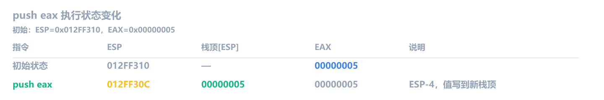
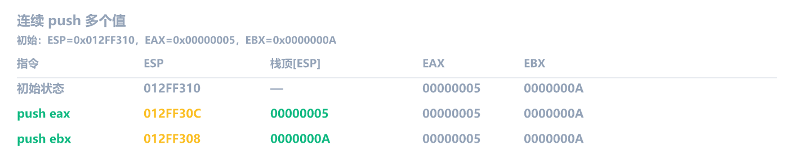
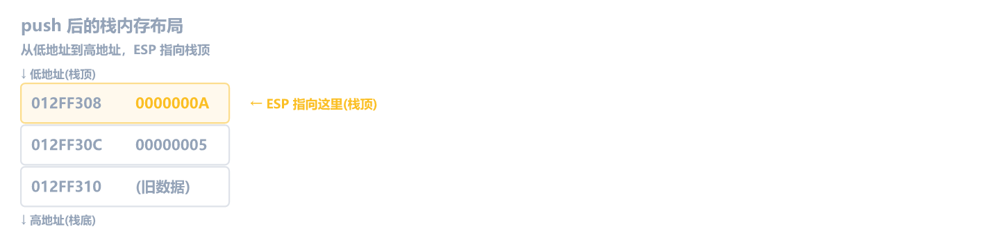
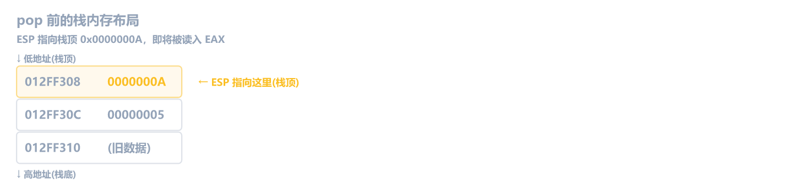
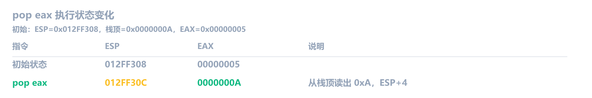
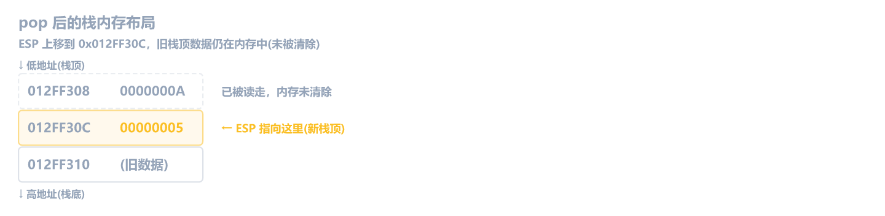
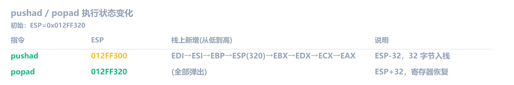

前八章学了数据搬运、算术逻辑、比较跳转，直线代码、if/else、循环你都能看懂了。但程序不只是直线执行，它有函数调用、参数传递、局部变量、返回值。这些全靠**栈**来支撑。

这一章先搞懂栈本身：它是什么、push 和 pop 怎么操作它。下一章再讲 call/ret、栈帧和调用约定。

本章涉及的所有指令（`push`、`pop`、`pushad`/`popad`）都**不影响任何标志位**，它们只操作 ESP 和内存。

## 栈是什么

栈是一块 **后进先出（LIFO）** 的内存区域。你可以把它想象成一摞盘子，最后放上去的盘子最先拿走。

几个关键特点：

- 栈在内存中是**从高地址往低地址增长**的。新数据放在更低的地址
- **`ESP`（栈指针）** 始终指向栈顶（最低地址）
- **`EBP`（基址指针）** 指向当前函数的栈帧底部，用来定位局部变量和参数
- 每次压入 4 字节（32 位程序），ESP 减 4
- 每次弹出 4 字节，ESP 加 4

> [!NOTE] 64 位程序的区别
> 本书以 32 位为主。64 位程序里栈机制完全一样，只是寄存器变成 `RSP`/`RBP`，每次 push/pop 操作 8 字节，指针加减 8。

## push：压栈

`push` 的操作数可以是寄存器、立即数或内存：

```asm
push eax                ; 寄存器
push 0x12345678         ; 立即数
push dword ptr [ebp-4]  ; 内存（内存操作数必须带 dword ptr）
```

不管操作数是什么，`push` 都把它**整个 4 字节**压入栈顶。它做了**两件事**：

1. ESP 先减 4（栈顶往下移一格）
2. 把值写到 ESP 指向的新位置

等价于：

```asm
sub esp, 4
mov dword ptr [esp], eax
```

> [!TIP] `ESP` 和 `[ESP]` 有什么区别？
> `ESP` 是寄存器里的一个值（一个地址，比如 `0x012FF30C`）。`[ESP]` 是这个地址指向的**内存里的内容**。就像 C 语言里 `ptr` 是指针，`*ptr` 是指针指向的值。`mov dword ptr [esp], eax` 的意思是：把 EAX 的值写进 ESP 当前指向的那 4 字节内存。

### 跟踪示例

假设初始 ESP = `0x012FF310`，EAX = `0x00000005`：



内存 `0x012FF30C` 现在存着 `0x00000005`。EAX 不变。

连续 push 多个值：



现在栈长这样（从低地址到高地址）：



**后进先出**，最后 push 进去的 EBX 在栈顶。

## pop：弹栈

`pop` 的操作数可以是寄存器或内存，但不能是立即数（弹出来的值要存到某个地方，常数没法存）：

```asm
pop eax                 ; 寄存器
pop dword ptr [ebp-4]   ; 内存
```

不管操作数是什么，`pop` 都把**栈顶的 4 字节**弹到目标位置。它做了**两件事**：

1. 从 ESP 指向的位置读 4 字节到目标寄存器
2. ESP 加 4（栈顶往上移一格）

等价于：

```asm
mov eax, dword ptr [esp]
add esp, 4
```

### 跟踪示例

接着上面的状态，ESP = `0x012FF308`，栈顶是 `0x0000000A`：



执行 `pop eax` 后：





EAX 变成了 `0x0000000A`（之前栈顶的值）。ESP 回到了 `0x012FF30C`。注意 pop 之后，`0x012FF308` 里的数据 `0x0000000A` 并没有被清除，它还在内存里。只是 ESP 移走了，那块内存会被后续的 push 覆盖。所以"弹出"不是"删除"，而是"移动指针"。

## push 和 pop 的对称性

`push` 和 `pop` 常常成对出现，用来**临时保存和恢复寄存器**：

```asm
push eax                ; 保存 eax 的当前值
push ebx                ; 保存 ebx 的当前值
...                     ; 这里随便用 eax 和 ebx
pop  ebx                ; 恢复 ebx（后 push 的先 pop）
pop  eax                ; 恢复 eax（先 push 的后 pop）
```

注意 pop 的顺序必须和 push **相反**，最后 push 的最先 pop。

> [!NOTE] 什么时候会看到 push/pop？
> 逆向实战中，push/pop 绝大多数出现在**函数调用**场景：保存寄存器、传递参数、建立栈帧。这些在下一章详细讲。偶尔也会看到编译器在复杂表达式里临时借用寄存器：寄存器不够用了，先 push 存一下，算完再 pop 取回来。认出"这里在临时借用寄存器"就行，不用深究。

### 常见错误

下面两段代码都有 bug，你能看出哪里错了吗？

```asm
; 错误 1：push/pop 顺序写反
push eax
push ebx
; ... 用 eax 和 ebx ...
pop  eax                ; ← 先 pop 了 eax
pop  ebx                ; ← 再 pop ebx
```

```asm
; 错误 2：push 了不 pop，栈不平衡
push eax
push ebx
push ecx
; ... 做了一些运算 ...
pop  ebx                ; ← 少 pop 了两次
;                      ← ESP 比原来低 8 字节
```

> [!NOTE]- 错误分析
> **错误 1**：eax 先被 push，但先被 pop，结果 eax 拿到了原来 ebx 的值，ebx 拿到了原来 eax 的值，两个寄存器的值被悄悄交换了。pop 顺序必须和 push 相反：后 push 的先 pop。
>
> **错误 2**：push 了 3 次只 pop 了 1 次，ESP 比原来低 8 字节。栈没恢复平衡，后面如果继续操作栈，所有指针都会错位。

## PUSHA/POPA 和 PUSHAD/POPAD：批量保存寄存器

前面用 `push` / `pop` 逐个保存寄存器。如果一个函数需要保存所有通用寄存器，逐个 push 要写 8 条指令。x86 提供了批量版本：

| 指令               | 操作数大小 | 压入的寄存器                           | 栈上占用 |
| ------------------ | ---------- | -------------------------------------- | -------- |
| `pusha` / `popa`   | 16 位      | AX, CX, DX, BX, SP, BP, SI, DI         | 16 字节  |
| `pushad` / `popad` | 32 位      | EAX, ECX, EDX, EBX, ESP, EBP, ESI, EDI | 32 字节  |

x64dbg 在 32 位程序里反汇编时通常显示 `pushad` / `popad`（因为操作数是 32 位寄存器）。有些反汇编器只显示 `pusha` / `popa`，实际上是同一条机器码 `60`/`61`，区别只是怎么看操作数大小。

`pushad` 按固定顺序压栈：**EAX -> ECX -> EDX -> EBX -> 原始 ESP -> EBP -> ESI -> EDI**。注意它压入的是 `pushad` 执行**前**的 ESP 值，不是执行中变化的值。

等价于手动写 8 条 push：

```asm
push eax
push ecx
push edx
push ebx
push esp                ; 压入的是 pushad 之前的 ESP
push ebp
push esi
push edi
```

`popad` 按相反顺序弹出，恢复所有寄存器。

### 跟踪示例

假设执行前 ESP = `0x012FF320`：



`pushad` 之后 ESP 减了 32（0x20），栈上连续 8 个 4 字节槽位保存了所有寄存器。`popad` 之后一切恢复原状。

> [!NOTE] `pushad` / `popad` 常出现在哪里？
>
> - **函数序言/尾声**：老编译器在函数开头用 `pushad` 一把保存所有寄存器，结尾用 `popad` 恢复
> - **中断处理程序**：中断发生时需要保存完整上下文，`pushad` 一步到位
> - **32 位恶意代码**：shellcode 为了不破坏寄存器状态，经常用 `pushad` / `popad` 包裹核心逻辑
>
> 逆向时，看到 `pushad` 就知道"这里保存了完整现场"，看到 `popad` 就知道"这里恢复了现场"，和 `push` / `pop` 成对出现的逻辑一样，只是批量版本。

> [!WARNING] 64 位已废弃
> x64 **没有**这些指令。64 位程序必须手动逐个 push/pop 需要保存的寄存器。所以在 64 位代码中你不会看到它们。

## 练习

1. 依次执行以下指令后，ESP 变了多少？

   ```asm
   push eax
   push ebx
   push ecx
   pop edx
   pop edx
   ```

   > [!NOTE]- 参考答案
   > ESP 净变化 = -4（减了 4）。
   >
   > 三次 push：ESP - 12。两次 pop：ESP + 8。总共 -12 + 8 = -4。

2. `push` 和 `pop` 为什么必须成对出现？如果 push 了 3 次但只 pop 了 1 次，ESP 会怎样？对后续的 `ret` 指令有什么影响？

   > [!NOTE]- 参考答案
   > push 和 pop 成对才能保持**栈平衡**，ESP 最终回到原位。push 3 次 pop 1 次，ESP 会比原来低 8 字节（净 -8）。
   >
   > 此时如果执行 `ret`，它会从错误的地址弹出"返回地址"（实际是栈上残留的数据），EIP 跳到一个垃圾地址，程序崩溃。这就是为什么函数尾声必须先恢复 ESP 再 ret。
