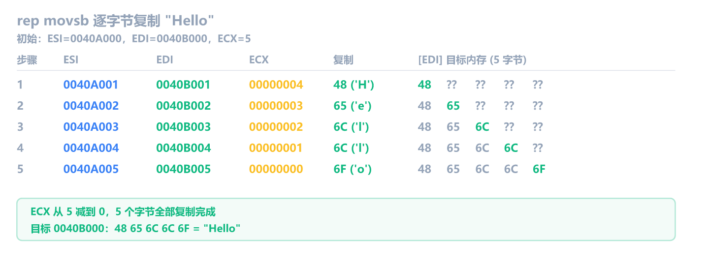
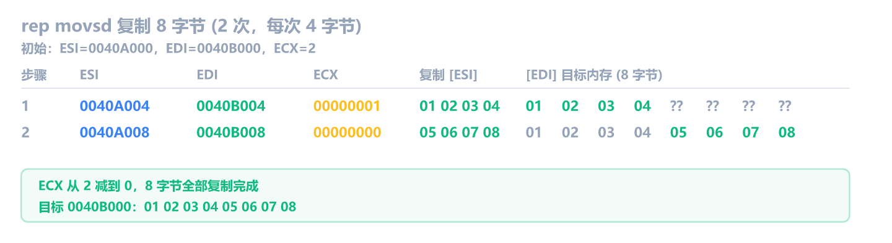
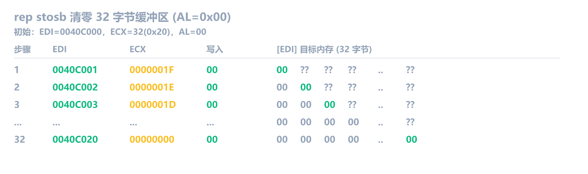
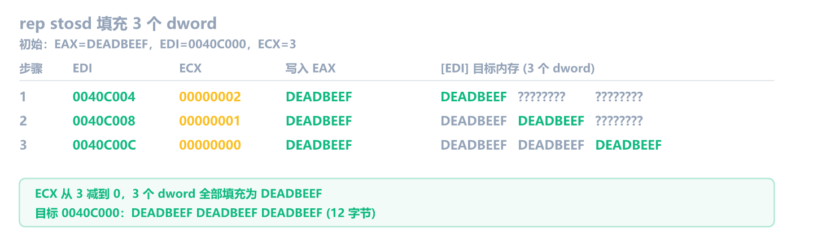
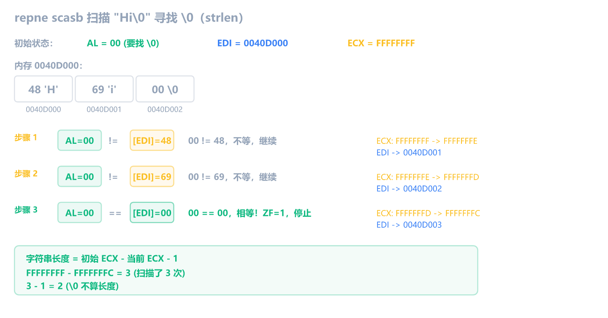
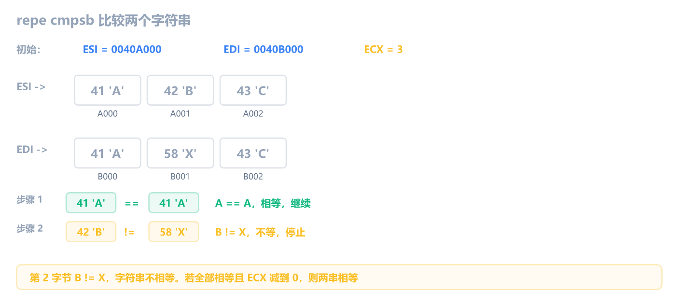

前 10 章学了数据搬运、算术逻辑、比较跳转、栈和函数调用，汇编基础的核心结构你都能看懂了。但还有一类高频指令我们一直没讲：**字符串指令**。

逆向时你会反复看到 `rep movsd` 和 `rep stosd`，它们是 `memcpy` 和 `memset` 的内联形态。另外两条 `repne scasb` 和 `repe cmpsb` 虽然原理上对应 `strlen` 和 `strcmp`，但现代编译器基本不再这样生成代码了。

这一章搞懂它们，你就补上了汇编基础部分的最后一块拼图。

## 字符串指令的特殊约定

字符串指令和普通指令不同：**不显式写操作数**。你看不到 `movs esi, edi` 这样的写法，操作数是**隐含的**，由寄存器固定扮演各自角色：

| 寄存器  | 角色     | 谁会用                      |
| ------- | -------- | --------------------------- |
| **ESI** | 源地址   | MOVS、CMPS                  |
| **EDI** | 目标地址 | 所有四条指令                |
| **ECX** | 计数器   | 所有四条指令(配 `rep` 前缀) |
| **EAX** | 数据值   | STOS(写入)、SCAS(比较)      |

关键：**不是所有指令都用 ESI**。MOVS/CMPS 从 `[ESI]` 读内存；STOS/SCAS 不碰 ESI，数据源是 AL/AX/EAX 寄存器本身。

每次执行一条字符串指令后，ESI(如果用到)和 EDI 会**自动前进**(加或减)，为下一次操作做准备。前进多少由**后缀**决定：

| 后缀  | 大小   | 每次前进量 |
| ----- | ------ | ---------- |
| **B** | 1 字节 | 1          |
| **W** | 2 字节 | 2          |
| **D** | 4 字节 | 4          |

四条指令(movs/stos/scas/cmps)都有 B/W/D 三种后缀，在 64 位下还演进出了 Q 后缀。但实战中你几乎只会遇到 **b**(单字节)和 **d**(4 字节)。w 后缀(如 scasw/cmpsw 等 2 字节操作)极少出现，知道有这回事就行。后面只用最常见的后缀来举例。

![四条字符串指令的寄存器对比：MOVS/CMPS 从 [ESI] 读源数据，STOS/SCAS 不用 ESI；EDI 和 ECX 所有指令共用](asm-string-images/string-registers.png)

### 方向标志 DF

ESI/EDI "前进"是加还是减？由 **方向标志(Direction Flag, DF)** 控制：

- **DF=0**(正向)：ESI/EDI 自动**加**(往高地址走)，这是默认方向
- **DF=1**(反向)：ESI/EDI 自动**减**(往低地址走)

两条专用指令控制 DF：

```asm
cld                     ; Clear Direction Flag，DF=0，正向(最常见)
std                     ; Set Direction Flag，DF=1，反向(少见)
```

正常程序**几乎总是用正向**(DF=0)。你会在 `rep movsd` 前面经常看到一条 `cld`，确保方向正确。`std` 极少出现，偶尔在反向复制时用到。

**默认情况**：函数调用不会改变 DF，大多数编译器生成的代码假设 DF=0。所以你看到 `rep movsd` 时，如果没有前面的 `cld`，也默认是正向。

## REP 前缀：让指令重复执行

字符串指令单独执行一次只处理一个单元(1/2/4 字节)。实际使用时几乎总是搭配 **REP 前缀**，让它重复执行 ECX 次。

三种前缀：

| 前缀      | 全称                   | 停止条件              | 常搭配     |
| --------- | ---------------------- | --------------------- | ---------- |
| **rep**   | Repeat                 | ECX = 0               | MOVS, STOS |
| **repe**  | Repeat while Equal     | ECX = 0 **或** ZF = 0 | CMPS, SCAS |
| **repne** | Repeat while Not Equal | ECX = 0 **或** ZF = 1 | SCAS, CMPS |

每次迭代的顺序：

1. 检查 ECX：如果 ECX = 0，**什么都不做**，直接跳过
2. ECX = ECX - 1
3. 执行后面的字符串指令(MOVS/STOS/SCAS/CMPS)
4. 检查条件：
   - `rep`：回到第 1 步
   - `repe`：如果 ZF = 1 且 ECX > 0，回到第 1 步；否则停止
   - `repne`：如果 ZF = 0 且 ECX > 0，回到第 1 步；否则停止

**rep** 只看 ECX，适合"固定次数"的操作(MOVS 复制、STOS 填充)。**repe/repne** 还看 ZF，适合"扫描直到满足条件"的操作(SCAS 找字符、CMPS 比较字符串)。

> [!NOTE] repe 和 repz
> `repe` 和 `repz` 是同一条指令(助记符不同，机器码相同)。`repne` 和 `repnz` 也是。

## MOVS：内存复制

MOVS 是"字符串复制"指令，实现内存到内存的搬运。`rep movs` 就是 `memcpy`。

### movsb：逐字节复制

```asm
movsb                   ; [EDI] = [ESI]，ESI+1，EDI+1
```

`movsb` 做三件事：

1. 把 ESI 指向的 1 字节复制到 EDI 指向的位置
2. ESI 自动 +1(DF=0 时)
3. EDI 自动 +1(DF=0 时)

### 跟踪示例：逐字节复制 "Hello"

假设源地址 `0x0040A000` 存着字符串 "Hello"(5 个字节: `48 65 6C 6C 6F`)，目标地址 `0x0040B000` 是一块空缓冲区：

初始状态：

```text
ESI = 0040A000    源数据：[48] 65 6C 6C 6F
EDI = 0040B000    目标：  [??] ?? ?? ?? ??
ECX = 00000005    要复制 5 个字节
```

执行 `rep movsb`(rep 会重复 ECX 次，每次 ECX-1，直到 ECX=0)：



ECX 从 5 减到 0，5 个字节全部复制完成。目标地址 `0x0040B000` 现在存着 `48 65 6C 6C 6F`，即 "Hello"。

### movsd：4 字节复制

```asm
movsd                   ; [EDI] = [ESI](4 字节)，ESI+4，EDI+4
```

`movsd` 每次复制 4 字节，ESI/EDI 各前进 4。`rep movsd` 就是一次复制 ECX × 4 个字节，编译器最爱用这个，因为 4 字节对齐效率最高。

逆向中看到的典型形态：

```asm
mov esi, dword ptr [ebp+8]
mov edi, dword ptr [ebp+0Ch]
mov ecx, 0x40
rep movsd
```

这等价于 `memcpy(dest, src, 64 * 4)`，复制 256 字节。

> [!NOTE] movsd 的两个含义
> `movsd` 在 x86 里有两个含义：字符串指令的 `movsd`(上面讲的)和 SSE 浮点指令的 `movsd`(搬运 64 位双精度浮点数)。区分方法很简单：**和 ESI/EDI 搭配的就是字符串指令，和 XMM 寄存器搭配的就是 SSE 指令**。逆向时看上下文就能判断。
>
> 字符串 `movsd` 没有显式操作数，源和目标隐含由 ESI/EDI 指定。SSE `movsd` 有两个显式操作数(至少一个是 XMM 寄存器)：
>
> ```text
> rep movsd                        ; [EDI] = [ESI](内存到内存)，ESI/EDI+4
> movsd xmm0, dword ptr [ebp+8]   ; xmm0 = [ebp+8](内存到 XMM 寄存器)
> movsd xmm1, xmm0                ; xmm1 = xmm0(XMM 到 XMM)
> movsd dword ptr [ebp+8], xmm0   ; [ebp+8] = xmm0(XMM 到内存)
> ```
>
> 两者机器码完全不同，只是恰好共享了同一个助记符。注意：`rep` 前缀只对字符串指令有效，SSE 版本的 `movsd` 不能搭配 `rep`。

假设源地址 `0x0040A000` 存着 `01 02 03 04 05 06 07 08`，目标地址 `0x0040B000` 是空缓冲区，ECX=2：



## STOS：填充内存

STOS 是"存储字符串"指令，把 AL/AX/EAX 的值写入 EDI 指向的位置。`rep stos` 就是 `memset`。

### stosb：逐字节填充

```asm
stosb                   ; [EDI] = AL，EDI+1
```

`stosb` 做两件事：

1. 把 AL(EAX 的低 8 位)写入 EDI 指向的位置
2. EDI 自动 +1(DF=0 时)

注意：和 MOVS 相比，STOS 的数据源不是 `[ESI]` 指向的内存，而是 AL/AX/EAX 寄存器本身。所以它不使用 ESI，只需要 EDI 来定位写入位置。

### 跟踪示例：清零 32 字节缓冲区

最常见的用法：把一块内存全部填 0：

```asm
xor eax, eax
mov edi, 0x0040C000
mov ecx, 0x20
rep stosb
```

初始状态：

```text
EAX = 00000000    AL = 00
EDI = 0040C000    目标缓冲区起始地址
ECX = 00000020    要填充 32(0x20)个字节
```

执行 `rep stosb`：



32 个字节全部变成 0。等价于 `memset(buf, 0, 32)`。

### stosd：4 字节填充

```asm
stosd                   ; [EDI] = EAX(4 字节)，EDI+4
```

`stosd` 每次写入 4 字节的 EAX，EDI 前进 4。如果 `EAX = 0xDEADBEEF`，`ECX = 3`，`rep stosd` 会在目标位置写入 3 个 `DEADBEEF`：



## SCAS：扫描内存

SCAS 是"扫描字符串"指令，把 AL/AX/EAX 和 EDI 指向的值做比较(隐式 `cmp`)，然后 EDI 前进。经典用法是 `repne scasb` 实现 `strlen`。

> [!NOTE] 现代 strlen 不用 repne scasb
> 教科书和老程序里，`strlen` 的经典实现确实是 `repne scasb`。但现代 MSVC 的 CRT 库用了一种更快的技巧：一次读 4 字节，用 magic number (`0x7EFEFEFF`) 检测其中有没有 `\0`，比逐字节快 4 倍。所以你在 x64dbg 里跟踪 `strlen` 时看到的不是 `repne scasb`，而是一串 `mov`、`add`、`xor`、`test` 的组合。
>
> `repne scasb` 你仍然可能在简单程序、嵌入式固件、或反编译老软件时遇到。理解它的原理很重要，但别指望在现代程序里频繁看到。

### scasb：逐字节扫描

```asm
scasb                   ; AL - [EDI](隐式 cmp)，EDI+1，更新 EFLAGS
```

`scasb` 做两件事：

1. 计算 `AL - [EDI]`(不存结果，和 `cmp` 一样只更新标志位)
2. EDI 自动 +1(DF=0 时)

**如果 AL == [EDI]**，差值为 0 -> ZF=1。否则 ZF=0。

单独的 `scasb` 没什么用。搭配 `repne` 前缀后，它会一直扫描，**直到找到和 AL 相等的字节**(或 ECX 减到 0)。这就是 `strlen` 的原理：把 AL 设为 0(字符串结尾的 `\0`)，让 EDI 指向字符串开头，然后 `repne scasb` 扫描到 `\0` 停止。

### 跟踪示例：计算 "Hi" 的长度

字符串 "Hi\0" 在内存中是 `48 69 00`，起始地址 `0x0040D000`。先把 AL 设为 0(要找 `\0`)，ECX 设为最大值(防止越界)：

```asm
xor eax, eax
mov edi, 0x0040D000
mov ecx, 0xFFFFFFFF
repne scasb
```

AL=0 逐字节与内存比较，找到 `\0` 时 ZF=1，`repne` 停止：



第 3 步找到了 `\0`，`repne` 停止。ECX 从 `0xFFFFFFFF` 减到了 `0xFFFFFFFC`，说明扫描了 3 次。减去 1(因为 `\0` 不算字符串长度)，"Hi" 的长度是 2。

## CMPS：比较两块内存

CMPS 是"字符串比较"指令，把 `[ESI]` 和 `[EDI]` 指向的值做比较(隐式 `cmp`)，然后 ESI/EDI 各前进。它是 SCAS 的"双源"版本：SCAS 拿 AL 比一块内存，CMPS 拿两块内存互相对比。和 SCAS 一样，现代编译器很少把 `strcmp` 内联成 `repe cmpsb`，认出它就行。

### cmpsb：逐字节比较

```asm
cmpsb                   ; [EDI] - [ESI](隐式 cmp)，ESI+1，EDI+1，更新 EFLAGS
```

`cmpsb` 做三件事：

1. 计算 `[EDI] - [ESI]`(不存结果，和 `cmp` 一样只更新标志位)
2. ESI 自动 +1(DF=0 时)
3. EDI 自动 +1(DF=0 时)

**如果 `[ESI] == [EDI]`**，差值为 0 -> ZF=1。否则 ZF=0。

搭配 `repe` 前缀后，它会一直比较，**只要相等就继续**，直到遇到不相等的字节或 ECX 减到 0。逆向中如果看到 ESI 和 EDI 分别指向两个字符串，然后 `repe cmpsb`，那就是在比较两个字符串是否相等。

假设 ESI 指向 "ABC"，EDI 指向 "AXC"，`repe cmpsb` 会在第 2 个字节发现不同并停止：



## 内联函数映射速查

MOVS 和 STOS 经常被编译器内联(直接生成汇编，不调用库函数)。逆向时看到这些指令模式，你可以直接脑内翻译：

| C 函数                 | 汇编模式                   |
| ---------------------- | -------------------------- |
| `memcpy(dest, src, n)` | `rep movsb` 或 `rep movsd` |
| `memset(buf, val, n)`  | `rep stosb` 或 `rep stosd` |

### 最常见的三个模式

**模式 1：memcpy**

```asm
mov  esi, dword ptr [ebp+8]
mov  edi, dword ptr [ebp+0Ch]
mov  ecx, dword ptr [ebp+10h]
rep  movsb
```

看到 ESI/EDI/ECX 三件套 + `rep movs` -> "这是一次内存复制"。

**模式 2：memset(清零)**

```asm
xor  eax, eax
mov  edi, dword ptr [ebp+8]
mov  ecx, dword ptr [ebp+0Ch]
rep  stosb
```

看到 `xor eax, eax` + `rep stosb` -> "这是在清零一块内存"。

**模式 3：memset(非零值)**

```asm
mov  eax, 0x41414141
mov  ecx, 0x40
rep  stosd
```

看到 EAX 非零 + `rep stosd` -> "这是在用固定值填充内存"。

## 练习

1. 初始状态：ESI = `0x0040A000`(存着 `01 02 03 04 05 06 07 08`)，EDI = `0x0040B000`，ECX = `2`。执行 `rep movsd` 后：
   1. 目标地址 `0x0040B000` 到 `0x0040B007` 存着什么？
   2. ESI 和 EDI 最终值分别是多少？

   > [!NOTE]- 参考答案
   >
   > 1. 目标地址存着 `01 02 03 04 05 06 07 08`。
   >
   >    `rep movsd`，ECX=2，每次复制 4 字节：
   >    - 第 1 次：复制 `0x0040A000` 的 4 字节 `01 02 03 04` 到 `0x0040B000`。ESI->`0040A004`，EDI->`0040B004`
   >    - 第 2 次：复制 `0x0040A004` 的 4 字节 `05 06 07 08` 到 `0x0040B004`。ESI->`0040A008`，EDI->`0040B008`
   >
   > 2. ESI = `0x0040A008`，EDI = `0x0040B008`。各前进了 8(2 次 × 4 字节)。

2. 以下汇编代码等价的 C 代码是什么？

   ```asm
   mov  edi, dword ptr [ebp+8]
   mov  ecx, dword ptr [ebp+0Ch]
   xor  eax, eax
   rep  stosb
   ```

   > [!NOTE]- 参考答案
   >
   > ```c
   > void* p = 第一个参数;
   > unsigned int count = 第二个参数;
   > memset(p, 0, count);
   > ```
   >
   > `xor eax, eax` 把 EAX 清零，`rep stosb` 把 0 填入 EDI 指向的位置 ECX 次，这就是 `memset(buf, 0, len)`。编译器经常把 `memset(buf, 0, n)` 内联成这段汇编，而不是真的调用 `memset` 函数。

3. x64dbg 实操。加载第一章的 CrackMe 程序(或任意 32 位程序)，完成以下操作：
   1. 在反汇编窗口右键 -> 搜索 -> 当前模块 -> 搜索指令，输入 `rep`，看看能不能找到 `rep movs`、`rep stos` 或 `repne scas`
   2. 如果找到了，在 `rep` 那行设断点(<kbd>F2</kbd>)，<kbd>F9</kbd> 运行到断点
   3. 查看寄存器窗口中 ESI、EDI、ECX 的值
   4. 按 <kbd>F8</kbd> 单步执行，观察：ESI/EDI 怎么变化的？ECX 怎么变化的？内存窗口中目标地址的内容怎么变化的？
   5. 判断这段代码在做什么(memcpy？memset？strlen？)

   > [!NOTE]- 参考答案
   > 参考答案(具体指令因程序而异)：
   >
   > 1. 大多数 32 位程序都能找到 `rep` 指令，尤其是 `rep stosd`(初始化局部变量)和 `rep movsd`(复制结构体/数组)
   > 2. 设断点后运行到断点
   > 3. 观察 ECX 的值，它告诉你操作多少个单元(字节/字/双字)
   > 4. <kbd>F8</kbd> 单步时：
   >    - `rep stosd`：EDI 每次加 4，ECX 每次减 1，EAX 的值被写入 [EDI]
   >    - `rep movsd`：ESI 每次加 4，EDI 每次加 4，ECX 每次减 1，[ESI] 被复制到 [EDI]
   > 5. 如果前面有 `xor eax, eax` -> memset 清零；如果有 ESI/EDI 两个源 -> memcpy；如果是 `repne scasb` + AL=0 -> strlen
