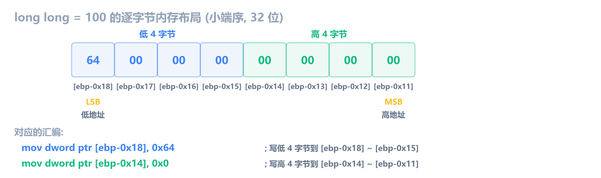

前 12 章学了汇编基础，你已经能看懂 `mov`、`add`、`cmp`、`call` 这些指令了。但逆向时你面对的不是一条条孤立的指令，而是编译器从 C 代码生成的汇编。你需要建立"C 代码 ↔ 汇编"的直觉：看到一段汇编，脑子里能还原出它对应什么 C 代码。

这一章从最简单的开始：**变量与赋值**。你会看到 C 里的 `int a = 10;` 在汇编里到底是什么样，局部变量和全局变量在内存里有什么区别。

## 准备对照环境

第 1 章你装好了 Visual Studio，第 4 章创建了 NOP 画布程序。从这一章开始，你要**自己写有意义的 C 代码、编译、再用 x64dbg 反汇编对照**。只有自己写的代码，你才能 100% 确定对照关系。

创建一个控制台应用项目，把自动生成的代码替换成最简单的版本：

```c
#include <stdio.h>

int main() {
    int a = 10;
    int b = 20;
    int c = a + b;
    printf("%d\n", c);
    return 0;
}
```

### 编译 Debug 版

确保编译模式选的是 **Debug** 和 **x86**（32 位）。32 位的汇编更简洁，和前 12 章学的格式一致。

按 **Ctrl+B** 编译。编译成功后，去项目输出目录（`项目目录/Debug/` 下面）找到生成的 exe 文件。

### 用 x64dbg 加载

把 exe 拖到 x32dbg.exe。加载后程序会停在入口点（通常是 `mainCRTStartup`）。要直接到 `main` 函数，在命令栏输入 `bp main` 回车，然后按 F9 运行，程序会断在 main 的第一条指令。

> [!TIP]
> 也可以在 CPU 窗口右键 → **Search for** → **All referenced text strings** → 找到 `"%d\n"` → 双击跳转，附近就是 `main`。

## 类型和宽度

汇编访问内存时要指定**操作宽度**，也就是读写几个字节。这就是 `dword ptr`、`byte ptr` 这些写法的含义。

| 关键字      | 宽度   | 对应 C 类型                      |
| ----------- | ------ | -------------------------------- |
| `byte ptr`  | 1 字节 | char, bool                       |
| `word ptr`  | 2 字节 | short                            |
| `dword ptr` | 4 字节 | int, unsigned int, float         |
| `qword ptr` | 8 字节 | long long, double（64 位下常见） |

逆向时看到 `byte ptr` 就知道是 char 或 bool，`dword ptr` 是 int。这张表后面会反复用到。

不同类型的 C 代码，对应的汇编宽度不同：

```c
char      ch = 'A';       // 1 字节
short     s  = 1000;      // 2 字节
int       i  = 100000;    // 4 字节
float     f  = 3.14f;     // 4 字节（浮点）
long long ll = 100;       // 8 字节
double    d  = 3.14;      // 8 字节（双精度浮点）
```

```asm
; char ch = 'A'
mov  byte ptr [ebp-0x4], 0x41           ; 0x41 = 'A', byte = 1 字节

; short s = 1000
mov  word ptr [ebp-0x8], 0x3E8          ; 0x3E8 = 1000, word = 2 字节

; int i = 100000
mov  dword ptr [ebp-0xC], 0x186A0       ; 0x186A0 = 100000, dword = 4 字节

; float f = 3.14f
mov  dword ptr [ebp-0x10], 0x4048F5C3   ; 3.14 的 IEEE 754 编码, dword

; long long ll = 100
mov  dword ptr [ebp-0x18], 0x64         ; 低 4 字节 = 100 (小端序, 低地址)
mov  dword ptr [ebp-0x14], 0x0          ; 高 4 字节 = 0

; double d = 3.14
mov  dword ptr [ebp-0x20], 0x51EB851F   ; 低 4 字节 (小端序, 低地址)
mov  dword ptr [ebp-0x1C], 0x40091EB8   ; 高 4 字节 (IEEE 754 双精度编码)
```



> [!NOTE] 8 字节类型在 32 位程序里怎么搬
> `long long` 和 `double` 都是 8 字节，但 32 位寄存器一次最多搬 4 字节，所以编译器拆成两条 `mov dword ptr`。小端序下**低 4 字节在低地址**，高 4 字节在高地址**。64 位程序用 `qword ptr` 一条搞定。逆向 32 位程序时，**看到连续两条 `mov dword ptr` 写相邻地址，很可能是一个 8 字节变量**。

### 有符号和无符号：赋值时看不出区别

`int` 和 `unsigned int` 都是 4 字节，赋值时汇编完全一样：

```asm
; int x = 10;        和  unsigned int x = 10;  生成的汇编一模一样
mov  dword ptr [ebp-4], 0Ah
```

区别只在**运算和比较时**才会体现：有符号用 `jg`/`jl`（greater/less），无符号用 `ja`/`jb`（above/below）。有符号除法用 `idiv`，无符号用 `div`。第 6 章和第 8 章讲过这些指令，这里只需要记住一个结论：**光看赋值和 mov 分辨不出有符号无符号，要看运算和跳转指令**。

### 浮点数的特殊之处

`float` 和 `int` 都是 4 字节，但浮点赋值用 `mov dword ptr` 搬进去的只是编码值。一旦涉及浮点运算（加减乘除），编译器就切换到 SSE 指令（第 12 章讲过）：

```asm
movss  xmm0, dword ptr [ebp-0x10]  ; 把 float 加载到 XMM0
addss  xmm0, dword ptr [ebp-0x14]  ; 浮点加法
movss  dword ptr [ebp-0x18], xmm0  ; 存回内存
```

看到 `movss`、`addss` 这些带 `ss` 后缀的指令，就知道在操作 float。

## 局部变量

### C 代码

就用上面编译好的代码。核心逻辑只有四行：

```c
int a = 10;
int b = 20;
int c = a + b;
return c;
```

### 对应的汇编

在 x64dbg 里断到 `main`，你会看到类似这样的汇编：

```asm
push ebp
mov  ebp, esp
sub  esp, 0E4h                         ; Debug 模式分配大量栈空间
push ebx
push esi
push edi
lea  edi, dword ptr ss:[ebp-24h]
mov  ecx, 9
mov  eax, 0CCCCCCCCh
rep  stosd                             ; 把局部变量区域填满 CC
mov  ecx, offset _9D2AEB17_Clearn@cpp
call @__CheckForDebuggerJustMyCode@4   ; VS Just My Code 调试特性
nop

mov  dword ptr ss:[ebp-8], 0xA         ; a = 10
mov  dword ptr ss:[ebp-14h], 0x14      ; b = 20
mov  eax, dword ptr ss:[ebp-8]         ; eax = a
add  eax, dword ptr ss:[ebp-14h]       ; eax = a + b
mov  dword ptr ss:[ebp-20h], eax       ; c = a + b
mov  eax, dword ptr ss:[ebp-20h]       ; 返回值

pop  edi
pop  esi
pop  ebx
add  esp, 0E4h
cmp  ebp, esp
call __RTC_CheckEsp                    ; 运行时栈检查
mov  esp, ebp
pop  ebp
ret
```

比想象的多很多？这是 VS Debug 模式的正常输出。真实的逆向中你看到的代码很少这么干净，需要学会过滤噪音。

> [!NOTE] VS Debug 模式多出来的东西
> 这些不是你写的代码，是编译器为调试方便自动插入的：
>
> - **`sub esp, 0E4h`**：分配 228 字节而非 12 字节。多出来的空间用于栈溢出检测。
> - **`rep stosd` 填 `0CCCCCCCCh`**：把局部变量区域全填成 CC。如果你忘了初始化变量，调试时会看到 `0xCCCCCCCC`（十进制 -858993460），一眼就知道有问题。
> - **`__CheckForDebuggerJustMyCode`**：VS 的 Just My Code 特性，单步时跳过库代码。可以在项目属性里关掉。
> - **`__RTC_CheckEsp`**：运行时检查栈是否平衡，防止栈损坏。
> - **`push ebx/esi/edi` + `pop`**：Debug 模式无条件保存这三个寄存器，即使函数没用到。

过滤掉这些噪音后，核心就这几行：

```asm
mov  dword ptr [ebp-8], 0Ah        ; a = 10
mov  dword ptr [ebp-14h], 14h      ; b = 20
mov  eax, [ebp-8]                  ; 读 a
add  eax, [ebp-14h]                ; a + b
mov  [ebp-20h], eax               ; c = 结果
mov  eax, [ebp-20h]               ; 返回值放 eax
```

**规律：局部变量 = `[ebp - X]`**。编译器把 `a`、`b`、`c` 这些名字翻译成了 `[ebp-8]`、`[ebp-14h]`、`[ebp-20h]` 这些栈偏移地址。

注意偏移不一定是 `[ebp-4]`、`[ebp-8]` 这样整齐排列。Debug 模式会在变量之间插入间隔，具体偏移取决于编译器和优化设置。**逆向时不要猜偏移，要看实际汇编。**

> [!NOTE] 为什么第一个变量不在 [ebp-4]
> 你可能会发现第一个局部变量在 `[ebp-8]` 而不是 `[ebp-4]`。一个常见原因是 MSVC 默认开启 `/GS`（缓冲区安全检查），在栈帧里插入了一个 **Security Cookie**（4 字节随机值），占用 `[ebp-4]` 的位置，函数返回前检查它是否被篡改。Release 模式还可能因为寄存器优化、对齐等因素进一步偏移。遇到偏移"不整齐"是正常的，不用纠结为什么。

为什么是减法？因为栈从高地址往低地址生长（第 9 章讲过），新变量放在更低地址。

> [!TIP]
> 在 x64dbg 里单步执行 `mov dword ptr [ebp-8], 0Ah` 后，切到堆栈窗口，按 `Ctrl+G` 跳到 `EBP-8` 的地址，你会看到值变成了 `0000000A`。这就是变量赋值的真相：**把一个数值写到栈上某个固定偏移**。

## 全局变量

局部变量在栈上，函数返回就没了。全局变量呢？它在 `.data` 段，程序运行期间一直存在。

### C 代码

```c
#include <stdio.h>

int g_count = 100;

int main() {
    int local = g_count + 1;
    printf("%d\n", local);
    return 0;
}
```

### 对应的汇编

```asm
mov  eax, dword ptr ds:[0x0040A000]  ; 读取全局变量 g_count
add  eax, 1                           ; g_count + 1
mov  dword ptr [ebp-4], eax          ; local = 结果
```

关键区别是全局变量用**绝对地址**访问（`ds:[0x0040A000]`），局部变量用**栈相对地址**（`[ebp-4]`）。

|          | 局部变量           | 全局变量             |
| -------- | ------------------ | -------------------- |
| 位置     | 栈（ebp - 偏移）   | .data 段（绝对地址） |
| 汇编形式 | `[ebp-4]`          | `ds:[0x0040A000]`    |
| 生命周期 | 函数执行期间       | 程序运行期间         |
| 初始化   | 每次进入函数都赋值 | 程序加载时已初始化   |

**逆向经验**：看到 `[ebp-X]` 就是局部变量，看到 `ds:[固定地址]` 多半是全局变量。

> [!NOTE] ss: 和 ds: 有什么区别
> 你在 x64dbg 里会注意到，局部变量显示 `ss:[ebp-8]`，全局变量显示 `ds:[0x0040A000]`。`ss` 是栈段 (Stack Segment)，`ds` 是数据段 (Data Segment)。
>
> 在 32 位保护模式 (flat memory model) 下，`ss` 和 `ds` 的基址完全相同，都指向同一段 4GB 地址空间，所以 `ss:[ebp-8]` 和 `ds:[ebp-8]` 访问的是同一个地址。x64dbg 显示不同的前缀只是**惯例提示**：用 EBP/ESP 做基址时显示 `ss:`，用绝对地址时显示 `ds:`。逆向时可以忽略段前缀，只看地址部分。

未初始化的全局变量（如 `int g_array[100];`）访问方式和 `.data` 段一样，都是绝对地址。区别只是不占 exe 文件空间，程序加载时由操作系统清零。

> [!NOTE] Windows 和 Linux 不一样
> Windows 的 MSVC 编译器通常不单独建 `.bss` 段，而是把未初始化变量放到 `.data` 段末尾。Linux 的 GCC/MinGW 则会单独建 `.bss` 段。所以你在 x64dbg (Windows) 的 Memory Map 里可能看不到 `.bss`，但在 Linux 工具 (readelf/objdump) 里能看到。逆向 32 位 Windows 程序以 MSVC 行为为准。PE 段的详细机制后面在程序破解章节讲。

想验证这一点，写一段实际访问未初始化全局变量的代码：

```c
int g_array[100];  // 未初始化全局变量

int main() {
    g_array[0] = 42;
    g_array[1] = g_array[0] + 1;
    return 0;
}
```

编译后在 x64dbg 里能看到 `ds:[绝对地址]` 访问 `g_array[0]` 和 `g_array[1]`，和 `.data` 段全局变量的访问方式完全一样。打开 x64dbg 的 **Memory Map** 窗口 (View → Memory Map)，用 `g_array` 的地址去对照段范围，你会发现它落在 `.data` 段里 (MSVC) 或 `.bss` 段里 (GCC)。

> [!NOTE] 找不到 g_array？
> 如果只声明 `int g_array[100];` 但代码里没用它，Release 编译器会直接删掉，你什么都看不到。必须读写它（如 `g_array[0] = 42;`），编译器才会生成访问指令。

## 练习

1. 以下汇编中，哪个是局部变量，哪个是全局变量？

   ```asm
   mov  dword ptr [ebp-4], 0x5
   mov  eax, dword ptr ds:[0x0040B000]
   mov  dword ptr [ebp-8], eax
   ```

   > [!NOTE]- 参考答案
   > `[ebp-4]` 和 `[ebp-8]` 是局部变量（栈上），`ds:[0x0040B000]` 是全局变量（绝对地址，.data 段）。对应的 C 代码大致是：
   >
   > ```c
   > int local_a = 5;
   > int local_b = g_global;
   > ```

2. 以下汇编操作的是什么类型的变量？

   ```asm
   mov  byte ptr [ebp-4], 0x1
   mov  word ptr [ebp-8], 0x0064
   ```

   > [!NOTE]- 参考答案
   > `byte ptr [ebp-4]` 是 1 字节，通常是 `char` 或 `bool`。值为 1，可能是 `bool flag = true` 或 `char ch = 1`。
   >
   > `word ptr [ebp-8]` 是 2 字节，`short`。值为 0x64（100），即 `short s = 100`。

3. 编译以下代码，用 x64dbg 找到 `main` 函数，回答：编译器给 `a`、`b`、`c` 分配的栈偏移分别是多少？为什么是这个顺序？

   ```c
   int main() {
       char  a = 'X';
       int   b = 42;
       short c = 7;
       return b;
   }
   ```

   > [!NOTE]- 参考答案
   > 编译器可能按声明顺序分配，也可能因为**内存对齐**在 `a` 后面填充 3 字节空隙，让 `b` 对齐到 4 字节边界。你可能会看到类似：
   >
   > ```asm
   > mov  byte ptr [ebp-4], 0x58    ; a = 'X'
   > mov  dword ptr [ebp-8], 0x2A   ; b = 42
   > mov  word ptr [ebp-0xC], 0x7   ; c = 7
   > ```
   >
   > Debug 模式通常按声明顺序分配，Release 模式可能重新排列。**关键是你自己用 x64dbg 看，实际编译结果才是真相。**
