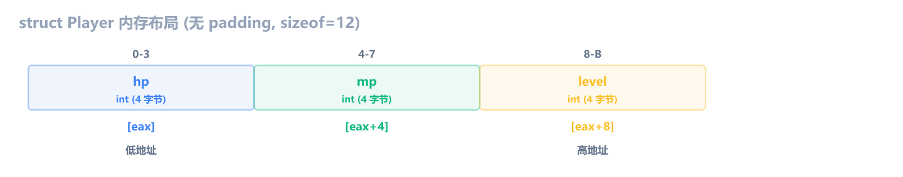
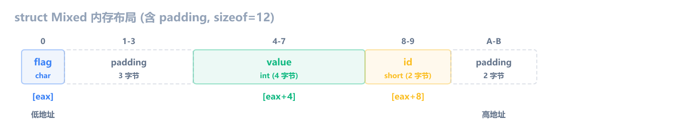
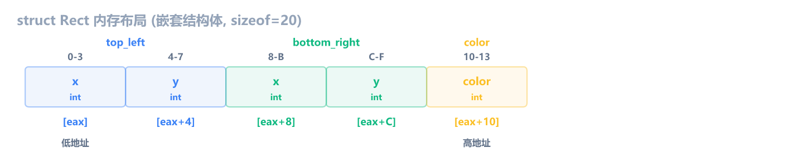

上一章学了函数调用的汇编形态。这一章学**结构体**：C 里写 `struct Player { int hp; int mp; int level; };`、`p.hp = 100;`、`p->mp` 用指针访问字段，编译器翻译成什么。

和前几章一样，编译 Debug x86，用 x64dbg 断到函数对照。汇编只保留结构体访问相关的核心指令，过滤掉 Debug 噪音。

## 结构体是一段连续内存

先写一个最简单的结构体：

```c
struct Player {
    int hp;
    int mp;
    int level;
};

void fill_player(struct Player *p) {
    p->hp = 100;
    p->mp = 50;
    p->level = 1;
}
```

`struct Player { ... };` 只是定义类型模板，告诉编译器"Player 由三个 int 组成"，不分配内存。只有声明变量时才分配。结构体变量和结构体指针是两种常见用法：

```c
// 结构体变量: 在栈上分 12 字节, 用 . 访问字段
struct Player p;
p.hp = 100;           // 直接写值

// 结构体指针: 不分配结构体, 只存一个地址, 用 -> 访问字段
struct Player *ptr = &p;
ptr->hp = 200;        // 通过地址写值, 等价于 (*ptr).hp = 200

// 也可以在堆上分配, 用完要 free
struct Player *heap = (struct Player *)malloc(sizeof(struct Player));
heap->hp = 300;
free(heap);
```

`p.hp`（点号）和 `ptr->hp`（箭头）在 C 里是两种不同的写法，但汇编层面都是 `[基地址 + 偏移]`，区别只在基地址怎么来：

```c
// 结构体变量，p 在栈上，基地址是 lea 计算出的栈地址
struct Player p;
p.hp = 100;        // mov dword ptr [ebp-X], 0x64

// 结构体指针，p 是参数，基地址从参数读出来
void fill(struct Player *p) {
    p->hp = 100;   // mov eax, [ebp+8]; mov dword ptr [eax], 0x64
}
```

逆向中更常见的是指针形式，因为结构体通常通过指针传递给函数。汇编里不会出现类型名 `Player`，编译器只关心变量的大小和偏移。

> [!NOTE] `*` 写在哪里
> `struct Player *ptr` 和 `struct Player* ptr` 完全等价，C 不区分 `*` 靠左还是靠右。本书统一用 `struct Player *ptr`（`*` 靠变量名），和大部分 C 代码风格一致。

```asm
; fill_player 函数，p 在 [ebp+8]
mov  eax, dword ptr [ebp+8]      ; eax = p（结构体指针）
mov  dword ptr [eax], 0x64       ; p->hp = 100（偏移 0）
mov  eax, dword ptr [ebp+8]      ; 重新读 p（Debug 模式）
mov  dword ptr [eax+4], 0x32     ; p->mp = 50（偏移 4）
mov  eax, dword ptr [ebp+8]      ; 重新读 p
mov  dword ptr [eax+8], 1        ; p->level = 1（偏移 8）
```

关键看 `[eax]`、`[eax+4]`、`[eax+8]` 这三个偏移。`eax` 存的是结构体指针 `p`，也就是结构体的起始地址。`hp` 是第一个字段，偏移 0；`mp` 是第二个字段，偏移 4（一个 int 占 4 字节）；`level` 是第三个字段，偏移 8。

结构体在内存里就是一段**连续的字节序列**，字段按声明顺序依次排列：



编译器把 `p->hp` 翻译成 `[eax+0]`，`p->mp` 翻译成 `[eax+4]`，`p->level` 翻译成 `[eax+8]`。字段名在汇编层面消失了，只剩下偏移。

> [!NOTE] Debug 模式反复读 [ebp+8]
> 上面每条赋值前都有一条 `mov eax, dword ptr [ebp+8]`，看起来多余。Release 模式会只读一次 `eax = p`，后续直接用 eax。Debug 模式不做优化，所以每步都重新从栈上读参数。

## 内存对齐

上面那个例子所有字段都是 int，大小一致，没有浪费。但换个结构体：

```c
struct Mixed {
    char  flag;    // 1 字节
    int   value;   // 4 字节
    short id;      // 2 字节
};

void fill_mixed(struct Mixed *m) {
    m->flag = 'A';
    m->value = 42;
    m->id = 7;
}
```

```asm
; fill_mixed 函数，m 在 [ebp+8]
mov  eax, dword ptr [ebp+8]      ; eax = m
mov  byte ptr [eax], 0x41        ; m->flag = 'A'（偏移 0，byte ptr）
mov  eax, dword ptr [ebp+8]      ; 重新读 m
mov  dword ptr [eax+4], 0x2A     ; m->value = 42（偏移 4，dword ptr）
mov  eax, 7                      ; eax = 7
mov  ecx, dword ptr [ebp+8]      ; ecx = m
mov  word ptr [ecx+8], ax        ; m->id = 7（偏移 8，word ptr）
```

注意三个字段的访问大小不同：`byte ptr`、`dword ptr`、`word ptr`。这是结构体的标志性特征，数组不会这样（数组所有元素同类型，访问大小一致）。

`flag` 在偏移 0 只占 1 字节，但 `value` 从偏移 4 开始，中间 3 字节是 **padding**。`id` 在偏移 8，占 2 字节，到偏移 9 结束。但 `sizeof(struct Mixed)` 是 12，不是 10。为什么尾部还多 2 字节？看下面的对齐规则。



**对齐规则**（x86/x64，MSVC 默认）：

1. 每个字段的起始偏移必须是自身大小的整数倍。int 是 4 字节，必须从 4 的倍数开始（0, 4, 8...）。char 是 1 字节，任意位置都行。short 是 2 字节，必须从偶数偏移开始。
2. 整个结构体的大小必须是最大字段大小的整数倍。Mixed 最大字段是 int（4 字节），所以总大小必须是 4 的倍数。

`flag`（char）放在偏移 0。`value`（int）想放偏移 1，但 1 不是 4 的倍数，插入 3 字节 padding，`value` 放偏移 4。`id`（short）放偏移 8（8 是 2 的倍数），占 2 字节到偏移 9。总大小 10，但 10 不是 4 的倍数，再补 2 字节到 12。

### 换个字段顺序

```c
struct Reordered {
    char  a;     // 偏移 0
    char  c;     // 偏移 1
    int   b;     // 偏移 4
};
```

只换了字段顺序，`sizeof` 从 12 变成 8。`a` 和 `c` 都是 char，紧挨着放（偏移 0 和 1），只需 2 字节 padding 就能对齐到 4。逆向时还原结构体定义要注意对齐的影响，否则偏移算不对。

> [!NOTE] 非标准对齐 `#pragma pack(n)`
> 以上说的都是 MSVC 默认对齐规则。C 代码可以用 `#pragma pack(1)` 强制按 1 字节对齐，消除所有 padding。这在网络协议解析、文件格式解析里很常见，需要结构体紧凑排列，一个字节都不能浪费。逆向时如果发现字段偏移完全连续、没有 padding，很可能是 `#pragma pack(1)`。Windows SDK 的 `#include <pshpack1.h>` 和 `#include <poppack.h>` 就是干这个的。

## 结构体指针访问

逆向工程中，结构体几乎都是通过指针传递的。函数参数里传一个指针，用 `[reg+offset]` 访问字段，这是最常见的模式。

```c
void take_damage(struct Player *p, int damage) {
    p->hp -= damage;
}
```

```asm
; take_damage 函数，p 在 [ebp+8]，damage 在 [ebp+C]
mov  eax, dword ptr [ebp+8]      ; eax = p
mov  ecx, dword ptr [eax]        ; ecx = p->hp
sub  ecx, dword ptr [ebp+C]      ; ecx -= damage
mov  edx, dword ptr [ebp+8]      ; edx = p（Debug 重新读）
mov  dword ptr [edx], ecx        ; p->hp = ecx
```

`mov ecx, [eax]` 读取 `p->hp`（偏移 0），`sub ecx, [ebp+C]` 减去 damage，`mov [edx], ecx` 写回 `p->hp`。Debug 模式每次操作都重新读 `[ebp+8]`，Release 会省掉。

**识别模式**：当你在一个函数里反复看到 `[reg+0]`、`[reg+4]`、`[reg+8]`、`[reg+C]` 这种固定偏移访问，而 reg 本身是从参数来的，这就是在访问结构体字段。reg 是结构体的基地址，后面的常数就是字段偏移。

### 结构体还是数组

`[eax+8]` 也可能是数组下标访问 `arr[2]`。怎么区分？

- **数组**：所有元素类型相同，偏移间隔一致，访问大小统一（int 数组全是 `dword ptr`）
- **结构体**：字段类型可以不同，访问大小可能混用（`byte ptr`、`word ptr`、`dword ptr` 混合出现）

如果看到 `[ecx+0]` 用 `byte ptr`、`[ecx+4]` 用 `dword ptr`、`[ecx+8]` 用 `word ptr`，几乎肯定是结构体，不是数组。

## 嵌套结构体

结构体里包含另一个结构体，偏移继续累加，没有魔法。

```c
struct Point {
    int x;
    int y;
};

struct Rect {
    struct Point top_left;
    struct Point bottom_right;
    int color;
};

int area(struct Rect *r) {
    int w = r->bottom_right.x - r->top_left.x;
    int h = r->bottom_right.y - r->top_left.y;
    return w * h;
}
```

Rect 的内存布局：



`top_left` 占偏移 0-7（x 在 0，y 在 4），`bottom_right` 紧接着占偏移 8-15（x 在 8，y 在 C），`color` 在偏移 16（0x10）。

```asm
; area 函数，r 在 [ebp+8]
mov  eax, dword ptr [ebp+8]      ; eax = r
mov  ecx, dword ptr [ebp+8]      ; ecx = r（Debug 重新读）
mov  edx, dword ptr [eax+8]      ; edx = r->bottom_right.x（偏移 8）
sub  edx, dword ptr [ecx]        ; edx -= r->top_left.x（偏移 0）
mov  dword ptr [ebp-8], edx      ; w = edx（存到局部变量）
mov  eax, dword ptr [ebp+8]      ; eax = r
mov  ecx, dword ptr [ebp+8]      ; ecx = r
mov  edx, dword ptr [eax+C]      ; edx = r->bottom_right.y（偏移 C）
sub  edx, dword ptr [ecx+4]      ; edx -= r->top_left.y（偏移 4）
mov  dword ptr [ebp-14], edx     ; h = edx
mov  eax, dword ptr [ebp-8]      ; eax = w
imul eax, dword ptr [ebp-14]     ; eax = w * h
```

嵌套结构体的字段偏移就是把内层结构体展开后逐个排列。`r->bottom_right.x` 不是 `[r+某个嵌套偏移+0]`，而是直接 `[r+8]`，因为编译器在编译期就把所有偏移算好了。

逆向时如果看到连续的偏移访问，比如 `[reg+0]`、`[reg+4]` 是一组，`[reg+8]`、`[reg+C]` 是另一组，可能存在嵌套结构体。

## 结构体变量的局部存储

前面都是通过指针访问结构体。如果结构体变量直接声明在函数里，编译器会在栈上分配一块连续空间：

```c
int main() {
    struct Player p;
    fill_player(&p);
    take_damage(&p, 30);
    // ...
}
```

```asm
; main 函数（只看结构体相关）
lea  eax, [ebp-14]               ; eax = &p（Player 在栈上偏移 -14）
push eax                         ; 参数 &p
call fill_player
add  esp, 4
push 0x1E                        ; 参数 30
lea  eax, [ebp-14]               ; eax = &p
push eax                         ; 参数 &p
call take_damage
add  esp, 8
```

`lea eax, [ebp-14]` 把栈上局部变量的地址算出来，这就是 `&p`。Player 从 `[ebp-14]` 开始放 12 字节：hp 在 `[ebp-14]`，mp 在 `[ebp-10]`，level 在 `[ebp-C]`。

`lea`（Load Effective Address）在这里的作用是"取地址"，不访问内存，只算地址。第 6 章讲指针时讲过 `lea` 的这个用法。

## 从汇编反推结构体

实际逆向时，你只有汇编，需要还原出结构体定义。方法是：收集所有对同一指针的访问，记录偏移和访问大小，按偏移排列。

假设你看到这样一个函数：

```asm
push ebp
mov  ebp, esp
mov  eax, dword ptr [ebp+8]      ; 参数：结构体指针
mov  byte ptr [eax], 0x1         ; 偏移 0，byte ptr
mov  dword ptr [eax+4], 0x64     ; 偏移 4，dword ptr
mov  word ptr [eax+8], 0x5       ; 偏移 8，word ptr
mov  dword ptr [eax+C], 0x0      ; 偏移 C，dword ptr
pop  ebp
ret
```

收集信息：

| 偏移 | 访问大小  | 推断类型 |
| ---- | --------- | -------- |
| 0    | byte ptr  | char     |
| 4    | dword ptr | int      |
| 8    | word ptr  | short    |
| C    | dword ptr | int      |

偏移 1-3 是 padding（char 到 int 的对齐），偏移 9-A 是 padding（short 到 int 的对齐）。还原出：

```c
struct Entity {
    char  active;    // 偏移 0
    // 3 字节 padding
    int   hp;        // 偏移 4
    short level;     // 偏移 8
    // 2 字节 padding
    int   score;     // 偏移 C
};
```

### 推断步骤

1. 找到函数参数里的指针（通常在 `[ebp+8]` 或 `ecx`）
2. 收集所有通过该指针的 `[reg+offset]` 访问
3. 记录每个偏移的访问大小（`byte`/`word`/`dword`/`qword`）
4. 按偏移从小到大排列，补上 padding
5. 给字段起个有意义的名字（如果从上下文能猜出含义）

> [!NOTE] 匈牙利命名法
> Windows SDK 和很多老代码用匈牙利命名法：变量名前缀暗示类型。`dwSize`（DWORD，4 字节）、`wYear`（WORD，2 字节）、`bFlags`（BYTE，1 字节）、`szName`（以 \0 结尾的字符串）、`pBuffer`（指针）。逆向 Windows 程序时，这些前缀可以帮助快速判断字段的访问大小。比如看到 `st->wYear`，就知道是 `word ptr`，偏移按 2 字节算。

> [!TIP] IDA 的结构体功能
> IDA Pro 支持 Shift+F1 打开结构体窗口，创建自定义结构体定义，然后把指针变量 Retype 为 `struct_name *`，Hex-Rays 伪代码里的 `*(DWORD*)(a1+8)` 会立刻变成 `a1->field_name`。详见后面的破解篇。

## 柔性数组

C99 允许结构体最后一个字段写成 `char data[]`，不指定大小。这叫**柔性数组**（Flexible Array Member）。它不占 `sizeof`，栈上声明时 `data` 没有空间，必须用 `malloc` 多分一段挂在尾部：

```c
struct Packet {
    int  length;    // 偏移 0, 4 字节
    char data[];    // 柔性数组, sizeof 不算它
};

// sizeof(struct Packet) == 4

// 柔性数组必须用堆: malloc 多分 N 字节给 data
struct Packet *pkt = (struct Packet *)malloc(sizeof(struct Packet) + 5);
// pkt->length 在偏移 0, pkt->data[0] 到 data[4] 在偏移 4-8
```

栈上只分 `sizeof`（4 字节，不含 `data`），堆上可以 `malloc(sizeof + N)` 多分。柔性数组必须用堆。

看一个完整的例子：

```c
#include <stdio.h>
#include <stdlib.h>

void fill_packet(struct Packet *pkt, const char *payload, int len) {
    pkt->length = len;
    for (int i = 0; i < len; i++) {
        pkt->data[i] = payload[i];
    }
}

int main() {
    struct Packet *pkt = (struct Packet *)malloc(sizeof(struct Packet) + 5);
    fill_packet(pkt, "Hello", 5);
    printf("length=%d data=%c%c%c%c%c\n",
           pkt->length, pkt->data[0], pkt->data[1],
           pkt->data[2], pkt->data[3], pkt->data[4]);
    free(pkt);
    return 0;
}
```

`fill_packet` 往 `data` 里逐字节拷贝：

```asm
; fill_packet 函数, pkt 在 [ebp+8], payload 在 [ebp+C], len 在 [ebp+10]
mov  eax, dword ptr [ebp+8]       ; eax = pkt
mov  ecx, dword ptr [ebp+10]      ; ecx = len
mov  dword ptr [eax], ecx         ; pkt->length = len (偏移 0)
; ... 循环 ...
mov  eax, dword ptr [ebp+8]       ; eax = pkt
add  eax, dword ptr [ebp-8]       ; eax = pkt + i
mov  ecx, dword ptr [ebp+C]       ; ecx = payload
add  ecx, dword ptr [ebp-8]       ; ecx = payload + i
mov  dl, byte ptr [ecx]           ; dl = payload[i]
mov  byte ptr [eax+4], dl         ; pkt->data[i] = dl (偏移 4+i)
```

关键看 `mov byte ptr [eax+4], dl`。`eax` 是 `pkt + i`，加 4 是因为 `data` 从偏移 4 开始（`length` 占了前 4 字节）。`i=0` 时写 `[pkt+4]`，`i=4` 时写 `[pkt+8]`。`sizeof(struct Packet)` 只有 4，但访问到了偏移 8。这就是柔性数组的特征：**访问偏移超出 `sizeof`**。逆向时看到这种现象，说明结构体尾部挂了变长数据。

柔性数组在协议头、游戏封包、C2 通信里非常常见：前面是固定头部（长度、类型、标志位等），后面跟着变长 payload。

## 逆向识别清单

| 特征                               | 含义                                   |
| ---------------------------------- | -------------------------------------- |
| `[reg+0]`、`[reg+4]`、`[reg+8]`... | 结构体字段访问，reg 是结构体指针       |
| `byte`/`word`/`dword` ptr 混用     | 结构体（数组不会混用访问大小）         |
| 全是 `dword ptr` + 等间距偏移      | 可能是 int 数组，也可能是全 int 结构体 |
| `lea reg, [ebp-X]` + push reg      | 取局部结构体变量的地址传参             |
| `[reg+offset]` 偏移不连续          | 对齐 padding（字段间有空洞）           |
| 偏移 0、4 一组 + 8、C 一组         | 可能是嵌套结构体（两个内层结构体）     |
| `mov byte ptr [reg], val`          | 偏移 0 是 char 字段                    |
| 密集 `and`/`or`/`shr` 访问同一字段 | 可能是位域（详见 c-asm-12）            |
| 访问偏移远超 `sizeof`              | 柔性数组（尾部挂变长数据）             |

**结构体逆向的核心**：收集所有 `[reg+offset]` 访问，按偏移排列，用访问大小推断字段类型，补上对齐 padding，还原出完整结构体定义。

## 练习

1. 下面这段汇编访问了几个结构体字段？每个字段的偏移和类型是什么？还原出结构体定义。

   ```asm
   push ebp
   mov  ebp, esp
   mov  eax, dword ptr [ebp+8]
   mov  dword ptr [eax], 0xA
   mov  dword ptr [eax+4], 0x14
   mov  dword ptr [eax+8], 0x1E
   mov  dword ptr [eax+C], 0x28
   mov  dword ptr [eax+10], 0xFF
   pop  ebp
   ret
   ```

   > [!NOTE]- 参考答案
   >
   > 5 个字段，全是 `dword ptr`（int），偏移 0、4、8、C、10，间距一致，没有 padding。
   >
   > ```c
   > struct Data {
   >     int a;     // 偏移 0
   >     int b;     // 偏移 4
   >     int c;     // 偏移 8
   >     int d;     // 偏移 C
   >     int e;     // 偏移 10
   > };
   > ```
   >
   > 注意：全是 int 且等间距，也可能是 `int arr[5]`。单凭这段汇编无法区分数组和结构体，需要看其他函数有没有用不同大小的访问。

2. 下面这段汇编用了不同大小的访问，还原出结构体定义。注意对齐。

   ```asm
   push ebp
   mov  ebp, esp
   mov  eax, dword ptr [ebp+8]
   mov  byte ptr [eax], 0x1
   mov  dword ptr [eax+4], 0x64
   mov  word ptr [eax+8], 0x5
   mov  dword ptr [eax+C], 0x0
   pop  ebp
   ret
   ```

   > [!NOTE]- 参考答案
   >
   > 4 个字段，访问大小不同：偏移 0 是 `byte ptr`（char），偏移 4 是 `dword ptr`（int），偏移 8 是 `word ptr`（short），偏移 C 是 `dword ptr`（int）。偏移 1-3 是 padding（char 到 int 对齐），偏移 9-A 是 padding（short 到 int 对齐）。访问大小混合出现，确认是结构体不是数组。
   >
   > ```c
   > struct Entity {
   >     char  active;    // 偏移 0
   >     // 3 字节 padding
   >     int   hp;        // 偏移 4
   >     short level;     // 偏移 8
   >     // 2 字节 padding
   >     int   score;     // 偏移 C
   > };
   > ```

3. 下面这段汇编和练习 1 完全相同，但换一个角度：偏移分为两组，每组两个 dword，像是两个坐标点。还原出嵌套结构体定义。

   ```asm
   push ebp
   mov  ebp, esp
   mov  eax, dword ptr [ebp+8]
   mov  dword ptr [eax], 0xA
   mov  dword ptr [eax+4], 0x14
   mov  dword ptr [eax+8], 0x1E
   mov  dword ptr [eax+C], 0x28
   mov  dword ptr [eax+10], 0xFF
   pop  ebp
   ret
   ```

   > [!NOTE]- 参考答案
   >
   > 偏移 0-3 和 4-7 是一组（start.x=10, start.y=20），偏移 8-B 和 C-F 是另一组（end.x=30, end.y=40），偏移 10 是独立的 int（color=255）。两组各占 8 字节，像两个 Point 结构体。
   >
   > ```c
   > struct Point {
   >     int x;
   >     int y;
   > };
   >
   > struct Line {
   >     struct Point start;     // 偏移 0-7
   >     struct Point end;       // 偏移 8-F
   >     int color;              // 偏移 10
   > };
   > ```
   >
   > 注意：练习 1 和练习 3 的汇编完全相同。单凭一个函数无法区分"5 个 int 的结构体"和"2 个 Point + 1 个 int 的嵌套结构体"，需要看其他函数怎么用这些字段。这是结构体逆向的固有不确定性。

4. 下面是一个游戏函数的汇编，分析功能并还原结构体。

   ```asm
   push ebp
   mov  ebp, esp
   push esi
   mov  esi, dword ptr [ebp+8]     ; 结构体指针
   mov  eax, dword ptr [esi+4]     ; 读偏移 4
   cmp  eax, dword ptr [esi+8]     ; 和偏移 8 比较
   jge  short skip
   mov  ecx, dword ptr [esi+C]     ; 读偏移 C
   add  dword ptr [esi+4], ecx     ; 偏移 4 += 偏移 C
   mov  edx, dword ptr [esi+4]
   cmp  edx, dword ptr [esi+8]
   jle  short done
   mov  eax, dword ptr [esi+8]
   mov  dword ptr [esi+4], eax     ; 偏移 4 = 偏移 8（钳制）
   skip:
   cmp  dword ptr [esi], 0         ; 检查偏移 0
   je   short done
   push 1
   mov  ecx, esi
   call sub_401400                 ; 调用另一个函数
   done:
   pop  esi
   pop  ebp
   ret
   ```

   > [!NOTE]- 参考答案
   >
   > 偏移 4 是某个不断增长的值（经验值），偏移 8 是上限（升级所需经验），偏移 C 是增量（每次获得的经验），偏移 0 是 bool 开关（是否激活）。当 current < maximum 时加上 increment，超过则钳制到 maximum。最后如果 active 为真，调用另一个函数。
   >
   > ```c
   > struct Progress {
   >     int active;      // 偏移 0
   >     int current;     // 偏移 4
   >     int maximum;     // 偏移 8
   >     int increment;   // 偏移 C
   > };
   >
   > void update_progress(struct Progress *p) {
   >     if (p->current < p->maximum) {
   >         p->current += p->increment;
   >         if (p->current > p->maximum) {
   >             p->current = p->maximum;
   >         }
   >     }
   >     if (p->active) {
   >         sub_401400(p, 1);
   >     }
   > }
   > ```

5. 下面这段汇编的结构体包含一个数组字段，还原出结构体定义并计算 `sizeof`。

   ```asm
   push ebp
   mov  ebp, esp
   mov  eax, dword ptr [ebp+8]
   mov  byte ptr [eax], 0x01          ; 偏移 0
   mov  word ptr [eax+2], 0x08        ; 偏移 2
   mov  byte ptr [eax+4], 0x48        ; 偏移 4 = 'H'
   mov  byte ptr [eax+5], 0x69        ; 偏移 5 = 'i'
   mov  dword ptr [eax+C], 0xDEAD     ; 偏移 C
   pop  ebp
   ret
   ```

   > [!NOTE]- 参考答案
   >
   > 偏移 0 是 `byte ptr`（char），偏移 2 是 `word ptr`（short），偏移 4 和 5 是连续两个 `byte ptr`（char 数组的元素），偏移 C 是 `dword ptr`（int）。偏移 1 是 padding（char 到 short 对齐）。偏移 4 到 B 是 8 个 char（数组字段），但这段汇编只写了前 2 个元素。连续的 `byte ptr` 访问偏移 4、5，是 char 数组字段的特征。
   >
   > ```c
   > struct Packet {
   >     char  type;        // 偏移 0
   >     // 1 字节 padding
   >     short length;      // 偏移 2
   >     char  data[8];     // 偏移 4（偏移 4-B，8 字节）
   >     int   checksum;    // 偏移 C
   > };
   > // sizeof = 16
   > ```
   >
   > 注意 `data[8]` 占 8 字节（偏移 4 到 B），`checksum` 紧跟在偏移 C。没有尾部 padding，因为 16 已经是 4 的倍数。
