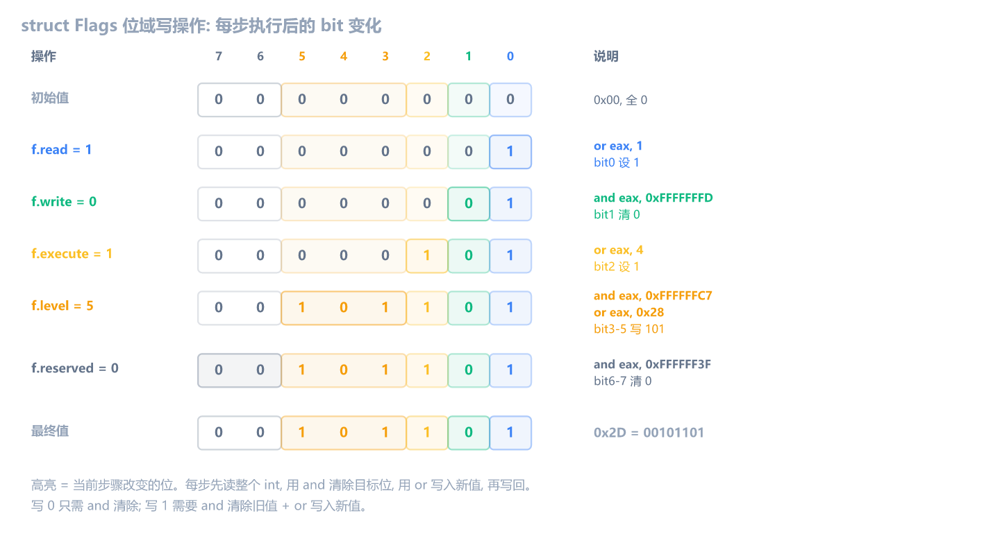

上一章学了枚举与类型转换。这一章学**位域与联合体**：C 里写 `struct Flags { unsigned read : 1; unsigned level : 3; }`、`union Data { int i; float f; }`，编译器翻译成什么。

位域和联合体都是"在更小的空间里塞更多信息"的手法。位域把多个小字段压进一个整数，编译器翻译成 `and`/`or`/`shr` 的位操作；联合体让多个成员共享同一块内存，编译器翻译成同一地址的不同 `ptr` 大小。学会识别这些模式，你才能在逆向中看出"这不是普通的位运算，这是位域"和"这不是指针强转，这是联合体"。

和前几章一样，编译 Debug x86，用 x64dbg 断到函数对照。汇编只保留位域和联合体相关的核心指令，过滤掉 Debug 噪音。

## 位域：整数里的子字段

位域（bit field）是结构体的一种特殊用法，用冒号指定每个字段占多少位：

```c
struct Flags {
    unsigned int read    : 1;   // 1 位，bit 0
    unsigned int write   : 1;   // 1 位，bit 1
    unsigned int execute : 1;   // 1 位，bit 2
    unsigned int level   : 3;   // 3 位，bit 3-5
    unsigned int reserved: 2;   // 2 位，bit 6-7
};
```

这个结构体总共 8 位（1+1+1+3+2），只占 1 个字节。但 MSVC 会把 `unsigned int` 位域分配到一个完整的 `int`（4 字节）里，所以 `sizeof(struct Flags)` 是 4。字段按声明顺序从低位到高位排列：`read` 在 bit 0，`write` 在 bit 1，`level` 在 bit 3-5。


### 写位域：读-改-写

给位域赋值时，编译器不能直接写整个 `int`（会覆盖其他字段），必须先读出整个 `int`，用 `and` 清掉目标位，用 `or` 写入新值，再存回去：

```c
void test_bitfield(void) {
    struct Flags f;
    f.read = 1;
    f.write = 0;
    f.execute = 1;
    f.level = 5;
    f.reserved = 0;
}
```

下面这张图展示每步操作后整个 `int` 的 bit 变化。高亮的是当前步骤改变的位。



每步都是"读整个 int → `and` 清除目标位 → `or` 写入新值 → 写回"。写 0 只需 `and` 清除，写非零值需要 `and` + `or` 两步。

```asm
; f.read = 1（bit 0，1 位）
mov  eax, dword ptr [ebp-0C]          ; 读整个 int
or   eax, 1                           ; 设置 bit 0
mov  dword ptr [ebp-0C], eax          ; 写回

; f.write = 0（bit 1，1 位）
mov  eax, dword ptr [ebp-0C]          ; 读整个 int
and  eax, 0xFFFFFFFD                  ; 清除 bit 1
mov  dword ptr [ebp-0C], eax          ; 写回

; f.execute = 1（bit 2，1 位）
mov  eax, dword ptr [ebp-0C]          ; 读整个 int
or   eax, 4                           ; 设置 bit 2
mov  dword ptr [ebp-0C], eax          ; 写回

; f.level = 5（bit 3-5，3 位）
mov  eax, dword ptr [ebp-0C]          ; 读整个 int
and  eax, 0xFFFFFFC7                  ; 清除 bit 3-5
or   eax, 0x28                        ; 写入 5 << 3 = 0x28
mov  dword ptr [ebp-0C], eax          ; 写回

; f.reserved = 0（bit 6-7，2 位）
mov  eax, dword ptr [ebp-0C]          ; 读整个 int
and  eax, 0xFFFFFF3F                  ; 清除 bit 6-7
mov  dword ptr [ebp-0C], eax          ; 写回
```

每个位域写操作都是**读-改-写**三步：

1. `mov eax, dword ptr [ebp-0C]` — 读出整个 `int`
2. `and eax, <掩码>` — 清除目标位（写 0 时这步就够了）
3. `or eax, <值>` — 写入新值（写非零值时需要）
4. `mov dword ptr [ebp-0C], eax` — 写回

写 1 位的字段（如 `f.read = 1`）很简单：`or eax, 1` 设置 bit 0。写 0 位的字段（如 `f.write = 0`）用 `and eax, 0xFFFFFFFD` 清除 bit 1。

写多位的字段（如 `f.level = 5`）多一步移位：`5` 的二进制是 `101`，它要放在 bit 3-5，所以先左移 3 位得到 `0x28`（`101000`），再用 `or` 合入。

> [!IMPORTANT] 位域写的识别模式
> 位域写操作的标志是**密集的 `and` + `or` 序列，反复读写同一个 `dword ptr [地址]`**。`and` 的掩码是清除特定位的模式（如 `0xFFFFFFFD` 清 bit 1），`or` 的值是左移过的数据。看到这种"读-改-写"循环，就是在写位域。
>
> 游戏里的状态标记几乎都是位域：是否无敌、是否隐身、是否在攻击中、是否被眩晕，十几个 bool 塞在一个 int 里。你在 CE 里搜到的"是否无敌"很多时候就是一个位域的某一位，设 1 就是无敌，设 0 就取消。

### 通过指针写位域

通过指针访问位域时，模式相同，只是基址从栈偏移变成指针解引用：

```c
void set_flags(struct Flags *f) {
    f->read = 1;       // 设置 bit 0
    f->level = 7;      // 设置 bit 3-5
}
```

```asm
; f->read = 1（bit 0）
mov  eax, dword ptr [ebp+8]           ; eax = f（指针）
mov  ecx, dword ptr [eax]             ; 读整个 int
or   ecx, 1                           ; 设置 bit 0
mov  edx, dword ptr [ebp+8]
mov  dword ptr [edx], ecx             ; 写回

; f->level = 7（bit 3-5，7 = 111b）
mov  eax, dword ptr [ebp+8]           ; eax = f
mov  ecx, dword ptr [eax]             ; 读整个 int
or   ecx, 0x38                        ; 7 << 3 = 0x38（设置 bit 3-5 全为 1）
mov  edx, dword ptr [ebp+8]
mov  dword ptr [edx], ecx             ; 写回
```

这里 `f->level = 7` 比较特殊：7 的二进制是 `111`，刚好把 bit 3-5 全设为 1。`or` 的规则是"有一个 1 就是 1"，所以无论目标位原来是什么，`or 0x38` 都会把 bit 3-5 全设为 1，`and` 清除旧值是多余的，编译器省了它。对比前面 `f.level = 5`（`101`），5 不是全 1，必须先 `and` 清掉旧值再 `or` 写入，否则旧值的 1 会残留。

> [!NOTE] 编译器优化：省略 and
> 当写入值把目标字段的所有位都设为 1（即值等于 `2^宽度 - 1`，如 3 位字段写 7、4 位字段写 15），`or` 一步就够了，不需要先 `and` 清除。逆向时看到只有 `or` 没有 `and`，可能是写入了全 1 值。

### 读位域：shr + and

读位域比写简单：读出整个 `int`，右移到最低位，再用 `and` 截取需要的位数：

```c
int get_level(struct Flags *f) {
    return f->level;      // bit 3-5，3 位
}
```

```asm
mov  eax, dword ptr [ebp+8]           ; eax = f（指针）
mov  eax, dword ptr [eax]             ; 读整个 int
shr  eax, 3                           ; 右移 3 位，把 level 移到 bit 0-2
and  eax, 7                           ; 截取 3 位（0b111 = 7）
```

`level` 在 bit 3-5，先 `shr eax, 3` 把它移到 bit 0-2，再 `and eax, 7`（二进制 `111`）截取 3 位。`and` 的掩码 `7` 就是 2^3 - 1 = 7（3 位全 1）。

1 位的字段更简单，不需要移位：

```asm
; f->read（bit 0，1 位）
mov  eax, dword ptr [ebp-0C]
and  eax, 1                           ; 只取 bit 0

; f->write（bit 1，1 位）
mov  eax, dword ptr [ebp-0C]
shr  eax, 1                           ; 移到 bit 0
and  eax, 1                           ; 截取 1 位

; f->execute（bit 2，1 位）
mov  eax, dword ptr [ebp-0C]
shr  eax, 2
and  eax, 1
```

> [!IMPORTANT] 位域读的识别模式
> 位域读操作的标志是**`shr` + `and`**。`shr` 的移位数 = 字段的起始位，`and` 的掩码 = 2^位数 - 1。比如 `shr eax, 3` + `and eax, 7`（3 位字段，起始 bit 3），`shr eax, 4` + `and eax, 0xF`（4 位字段，起始 bit 4）。

### 位域布局示例：32 位填满一个 int

下面是一个填满整个 `int` 的例子：

```c
struct Mixed {
    unsigned int a : 4;    // bit 0-3
    unsigned int b : 4;    // bit 4-7
    unsigned int c : 8;    // bit 8-15
    unsigned int d : 16;   // bit 16-31
};

void test_mixed_bitfield(void) {
    struct Mixed m;
    m.a = 0xF;
    m.b = 0xA;
    m.c = 0x42;
    m.d = 0x1234;
    printf("a=%X b=%X c=%X d=%X\n", m.a, m.b, m.c, m.d);
}
```

`struct Mixed` 总共 32 位，刚好一个 `int`（4 字节）。写操作的模式和前面一样：

```asm
; m.a = 0xF（bit 0-3，4 位）
mov  eax, dword ptr [ebp-0C]
or   eax, 0xF                         ; 0xF = 1111b
mov  dword ptr [ebp-0C], eax

; m.b = 0xA（bit 4-7，4 位）
mov  eax, dword ptr [ebp-0C]
and  eax, 0xFFFFFF0F                  ; 清 bit 4-7
or   eax, 0xA0                        ; 0xA << 4 = 0xA0
mov  dword ptr [ebp-0C], eax

; m.c = 0x42（bit 8-15，8 位）
mov  eax, dword ptr [ebp-0C]
and  eax, 0xFFFF00FF                  ; 清 bit 8-15
or   eax, 0x4200                      ; 0x42 << 8 = 0x4200
mov  dword ptr [ebp-0C], eax

; m.d = 0x1234（bit 16-31，16 位）
mov  eax, dword ptr [ebp-0C]
and  eax, 0xFFFF                      ; 清 bit 16-31
or   eax, 0x12340000                  ; 0x1234 << 16 = 0x12340000
mov  dword ptr [ebp-0C], eax
```

读操作用 `shr` + `and`：

```asm
; m.a（bit 0-3，4 位）
and  eax, 0xF                         ; 掩码 = 2^4 - 1 = 0xF

; m.b（bit 4-7，4 位）
shr  eax, 4
and  eax, 0xF

; m.c（bit 8-15，8 位）
shr  eax, 8
and  eax, 0xFF                        ; 掩码 = 2^8 - 1 = 0xFF

; m.d（bit 16-31，16 位）
shr  eax, 0x10                        ; 右移 16 位，把 d 移到 bit 0-15
and  eax, 0xFFFF                      ; 掩码 = 2^16 - 1 = 0xFFFF
```

> [!TIP] 从掩码反推位域宽度
> 读位域时 `and` 的掩码直接暴露了字段宽度：`and eax, 0xF` 是 4 位字段，`and eax, 0xFF` 是 8 位字段，`and eax, 0xFFFF` 是 16 位字段。掩码 `2^N - 1` 对应 N 位字段。结合 `shr` 的移位数，就能确定字段在 `int` 里的位置和宽度。

> [!NOTE] 位域跨 int 边界
> 如果一个字段放不下当前 `int` 的剩余位，MSVC 会把它整个移到下一个 `int`。比如 `struct { unsigned int a : 30; unsigned int b : 3; }`，`b` 需要跨 int 边界，但 MSVC 不会拆分，而是把 `b` 整个放到偏移 4 的第二个 `int` 里。逆向时表现为：位域操作的基址突然从 `[ebp-8]` 跳到 `[ebp-4]`，两个 `int` 各自独立做 `and`/`or`。

### 位域 vs 手写位运算

位域和手写位运算生成的汇编**完全一样**。下面两段代码生成的汇编没有区别：

```c
// 位域写
f->level = 5;

// 手写位运算
unsigned int *raw = (unsigned int *)f;
*raw = (*raw & ~0x38) | ((5 << 3) & 0x38);
```

逆向时无法区分"源代码用了位域"还是"手写了 `and`/`or` 位运算"。但位域有一个特征：字段访问通常密集出现在同一个地址上，连续多次读-改-写。手写位运算通常更分散，不会连续操作同一个 `int` 的多个子字段。

> [!NOTE] 位域与 c-asm-2 位运算的关系
> c-asm-2 讲了 `and`/`or`/`shl`/`shr` 指令本身的作用（清除位、设置位、移位）。本章讲的是这些指令组合起来形成的**位域模式**：反复读写同一个 `dword ptr`，每个字段对应一组 `shr` + `and`（读）或 `and` + `or`（写）。看到这种密集的重复模式，就是位域。

位域是把一个 `int` 拆成多个小字段，用 `and`/`or`/`shr` 精确操作每个字段。接下来看联合体，它正好相反，让多个字段共享同一块内存，用不同的 `ptr` 大小解读同一份数据。

## 联合体：同一块内存多种解读

联合体（union）让多个成员共享同一块内存。联合体的大小等于最大成员的大小：

```c
union Data {
    int    i;        // 4 字节
    float  f;        // 4 字节
    char   bytes[4]; // 4 字节
};
// sizeof(union Data) = 4
```

三个成员共享同一块 4 字节内存。写 `i` 就是写这块内存，写 `f` 也是写同一块内存。读 `bytes` 就是按字节读这块内存。

### 同一地址，不同类型

```c
void test_union(void) {
    union Data d;
    d.i = 0x41424344;
    printf("bytes=%c%c%c%c\n", d.bytes[0], d.bytes[1], d.bytes[2], d.bytes[3]);

    d.f = 1.0f;
    printf("i=0x%X\n", d.i);
}
```

```asm
; d.i = 0x41424344
mov  dword ptr [ebp-8], 0x41424344    ; 写 4 字节

; d.bytes[0] — 按 char 读同一块内存
movsx eax, byte ptr [ebp-8]           ; 第 0 字节（'D' = 0x44）
; d.bytes[1]
movsx ecx, byte ptr [ebp+1-8]         ; 第 1 字节（'C' = 0x43）
; d.bytes[2]
movsx edx, byte ptr [ebp+2-8]         ; 第 2 字节（'B' = 0x42）
; d.bytes[3]
movsx eax, byte ptr [ebp+3-8]         ; 第 3 字节（'A' = 0x41）

; d.f = 1.0f — 用 movss 写同一块内存
movss xmm0, dword ptr [__real@3f800000]
movss dword ptr [ebp-8], xmm0         ; 覆盖了原来 d.i 的值

; d.i — 按 int 读同一块内存（现在是 0x3F800000）
mov  eax, dword ptr [ebp-8]           ; 读 4 字节（1.0f 的位模式）
```

关键观察：

1. `d.i`、`d.f`、`d.bytes` 都用 `[ebp-8]` 这同一个地址
2. 写 `d.i` 用 `mov dword ptr`，写 `d.f` 用 `movss`，读 `d.bytes[n]` 用 `byte ptr`，都是同一块 4 字节内存
3. 写了 `d.f` 之后，`d.i` 的值变了，因为它们共享内存

> [!IMPORTANT] 联合体的识别特征
> 联合体的标志是**同一地址配合不同的 `ptr` 大小和不同的指令**。`dword ptr`（int）、`movss`（float）、`byte ptr`（char 数组）交替出现在同一个 `[ebp-X]` 上。这和位域不同：位域是同一个 `dword ptr` 反复 `and`/`or`，联合体是同一个地址混用不同的访问大小。

### 用联合体查看 float 的位

联合体最经典的用途是查看 `float` 的二进制表示，不需要指针强转：

```c
union FloatBits {
    float f;
    unsigned int bits;
};

void test_float_bits(void) {
    union FloatBits fb;
    fb.f = 1.0f;
    printf("bits=0x%X\n", fb.bits);
}
```

```asm
movss xmm0, dword ptr [__real@3f800000]   ; xmm0 = 1.0f
movss dword ptr [ebp-8], xmm0            ; fb.f = 1.0f（写 4 字节）
mov  eax, dword ptr [ebp-8]              ; fb.bits（按 int 读同一块内存）
push eax
push offset "bits=0x%X\n"
call printf
```

写 `fb.f` 用 `movss`，读 `fb.bits` 用 `mov dword ptr`，都是 `[ebp-8]`。这和 c-asm-11 的「float 和 int 的位模式转换」小节里 `(int *)&f` 生成的汇编几乎一样，区别只在源代码的写法。

> [!TIP] 联合体 vs 指针强转
> 联合体和指针强转都能实现"同一块内存多种解读"，生成的汇编也几乎一样。区别是：联合体通过不同成员名访问（`fb.f` vs `fb.bits`），指针强转通过强转指针类型访问（`(int *)&f`）。逆向时无法区分两者，因为汇编层面都是"同一地址混用不同的 `ptr` 大小"。

### 联合体做类型拆分

联合体可以把一个 `int` 拆成两个 `short`：

```c
union Converter {
    int   i;
    short s[2];
};

void test_converter(void) {
    union Converter c;
    c.i = 0x12345678;
    printf("low=%X high=%X\n", c.s[0], c.s[1]);
}
```

```asm
; c.i = 0x12345678
mov  dword ptr [ebp-8], 0x12345678

; c.s[0] — 按 short 读低 2 字节
movsx ecx, word ptr [ebp-8]            ; 0x5678（低 16 位）

; c.s[1] — 按 short 读高 2 字节
movsx ecx, word ptr [ebp+2-8]         ; 0x1234（高 16 位）
```

`c.i` 是 `dword ptr`（4 字节），`c.s[0]` 是 `word ptr [ebp-8]`（低 2 字节），`c.s[1]` 是 `word ptr [ebp+2-8]`（高 2 字节）。小端序下 `0x12345678` 的内存是 `78 56 34 12`，所以 `c.s[0]` = `0x5678`，`c.s[1]` = `0x1234`。

## 结构体里的联合体

实际开发中，联合体经常嵌在结构体里，配合一个 `type` 字段标识当前存的是哪种数据：

```c
struct Packet {
    int type;
    union {
        int   int_val;
        float float_val;
        char  str[4];
    } data;
};
// sizeof(struct Packet) = 8（int type + union data，各 4 字节）
```

`type` 在偏移 0，`data` 在偏移 4。联合体的所有成员共享偏移 4 开始的 4 字节：

```c
void test_packet(void) {
    struct Packet p;
    p.type = 1;
    p.data.int_val = 0xDEADBEEF;
    printf("type=%d val=0x%X\n", p.type, p.data.int_val);

    p.type = 2;
    p.data.float_val = 2.0f;
    printf("type=%d val=0x%X\n", p.type, p.data.int_val);
}
```

```asm
; p.type = 1（偏移 0）
mov  dword ptr [ebp-10], 1

; p.data.int_val = 0xDEADBEEF（偏移 4，按 int 写）
mov  dword ptr [ebp-0C], 0xDEADBEEF

; 读取 p.data.int_val（偏移 4，按 int 读）
mov  eax, dword ptr [ebp-0C]

; p.type = 2
mov  dword ptr [ebp-10], 2

; p.data.float_val = 2.0f（偏移 4，用 movss 写）
movss xmm0, dword ptr [__real@40000000]
movss dword ptr [ebp-0C], xmm0         ; 覆盖了原来的 0xDEADBEEF

; 再读 p.data.int_val（偏移 4，按 int 读，现在是 2.0f 的位模式 0x40000000）
mov  eax, dword ptr [ebp-0C]
```

`p.data.int_val` 和 `p.data.float_val` 都在偏移 4（`[ebp-0C]`）。第一次用 `mov dword ptr` 写 `0xDEADBEEF`，第二次用 `movss` 写 `2.0f`（位模式 `0x40000000`），覆盖了原来的值。再读 `int_val` 得到的是 `0x40000000`。

> [!IMPORTANT] 结构体里联合体的识别
> 看到一个结构体字段（固定偏移）先用 `dword ptr` 写、后用 `movss` 写（或反过来），就是联合体成员交替使用。`type` 字段配合 `cmp`/`je` 分支判断当前是哪种类型，是 tagged union 的典型模式。
>
> 游戏网络包经常用 tagged union：包头有 `type` 字段标识包类型，`data` 字段是联合体，type=1 时按 int 读（伤害值），type=2 时按 float 读（坐标），type=3 时按 struct 读（物品信息）。逆向时看到同一个偏移在不同分支里用不同 `ptr` 大小访问，就是联合体。
>
> 上面的 `struct Packet` 用的是**具名联合体**，联合体有个变量名 `data`，访问时必须写 `p.data.int_val`。
>
> C 和 C++ 还支持**匿名联合体**，省略变量名，联合体成员直接提升到外层结构体：

```c
struct Packet2 {
    int type;
    union {                // 没有 data
        int   int_val;
        float float_val;
        char  str[4];
    };
};

// 匿名联合体：直接 p.int_val，不用 p.data.int_val
p2.int_val = 0xDEADBEEF;
p2.float_val = 2.0f;
```

具名和匿名在汇编上完全一样，`int_val` 和 `float_val` 都在偏移 4。区别只在 C 代码写法：具名多一层 `.data`，匿名直接访问。逆向时无法区分两者。

## 从汇编反推位域与联合体

### 位域反推

逆向时遇到一段函数，里面密集出现 `and`/`or`/`shr` 操作同一个地址，怎么判断是位域并还原出定义？看一个完整示例：

```asm
; 函数内部，反复读写 [ebp-0C]
mov  eax, dword ptr [ebp-0C]          ; 读整个 int
or   eax, 1                           ; 设置 bit 0
mov  dword ptr [ebp-0C], eax

mov  eax, dword ptr [ebp-0C]          ; 读整个 int
and  eax, 0xFFFFFFC7                  ; 清除 bit 3-5（0xC7 = ~0x38）
or   eax, 0x28                        ; 0x28 = 0b00101000 = 5 << 3
mov  dword ptr [ebp-0C], eax

mov  eax, dword ptr [ebp-0C]          ; 读整个 int
shr  eax, 3                           ; 右移 3 位
and  eax, 7                           ; 截取 3 位
```

逐步推断：

1. 三段操作都读写 `[ebp-0C]`，是同一个 `int` 变量
2. `or eax, 1` 设置 bit 0 → 有一个 1 位字段在 bit 0
3. `and eax, 0xFFFFFFC7` 清除 bit 3-5，`or eax, 0x28` 写入 `5 << 3` → 有一个 3 位字段在 bit 3-5，写入值 5
4. `shr eax, 3` + `and eax, 7` 读取 bit 3-5 → 3 位字段，掩码 `0b111 = 7` 确认宽度 3 位

从 `shr` 的移位数得到字段起始位（3），从 `and` 的掩码得到字段宽度（3 位，`2^3-1=7`）。从 `and` 的清除掩码 `0xFFFFFFC7 = ~0x38` 也能验证：`0x38 = 0b111000`，清除的是 bit 3-5。

对应的 C 代码：

```c
struct Flags {
    unsigned int flag0  : 1;    // bit 0，or 1 设置
    unsigned int unused : 2;    // bit 1-2，没被访问
    unsigned int level  : 3;    // bit 3-5，and 0xFFFFFFC7 清除 + or 0x28 写 5
    // ... 后面可能还有字段
};

f.flag0 = 1;       // or eax, 1
f.level = 5;       // and + or
x = f.level;       // shr 3 + and 7
```

> [!TIP] 位域反推三步
>
> 1. **找 `shr` 移位数** — 字段的起始位号
> 2. **找 `and` 掩码** — `2^N - 1` 对应 N 位宽度
> 3. **找 `and` 清除掩码** — `~(2^N - 1) << 起始位` 确认位置和宽度

### 联合体反推

逆向时遇到同一个地址被不同 `ptr` 大小和不同指令访问，怎么判断是联合体？看一个完整示例：

```asm
; 函数内部，同一个 [ebp-8] 被多种方式访问
mov  dword ptr [ebp-8], 0x41424344    ; 用 dword ptr 写 int
movsx eax, byte ptr [ebp-8]          ; 用 byte ptr 读 char（第 0 字节）
movsx ecx, byte ptr [ebp+1-8]        ; 用 byte ptr 读 char（第 1 字节）
movss xmm0, dword ptr [__real@3f800000]
movss dword ptr [ebp-8], xmm0        ; 用 movss 写 float（覆盖了 int 的值）
mov  eax, dword ptr [ebp-8]          ; 用 dword ptr 读 int（现在是 float 的位模式）
```

逐步推断：

1. `[ebp-8]` 被三种方式访问：`mov dword ptr`（int）、`movsx byte ptr`（char）、`movss`（float）
2. 三种访问指向同一个 4 字节区域，说明它们共享同一块内存
3. `movsx byte ptr [ebp-8]` 读第 0 字节、`movsx byte ptr [ebp+1-8]` 读第 1 字节 → 有 `char` 数组成员
4. `movss` 写入后 `mov dword ptr` 读出的值变了 → 写 `float` 覆盖了 `int` 的值，确认共享内存

对应的 C 代码：

```c
union Data {
    int  i;           // dword ptr
    float f;          // movss
    char bytes[4];    // movsx byte ptr
};

d.i = 0x41424344;              // mov dword ptr [ebp-8]
x = d.bytes[0];                // movsx byte ptr [ebp-8]
y = d.bytes[1];                // movsx byte ptr [ebp+1-8]
d.f = 1.0f;                    // movss dword ptr [ebp-8]
z = d.i;                       // mov dword ptr [ebp-8]（读到 0x3F800000）
```

> [!TIP] 联合体反推三步
>
> 1. **找同一个地址** — 多种访问都指向同一个 `[ebp-X]` 或 `[reg+Y]`
> 2. **列出所有访问方式** — `dword ptr`（int）、`movss`（float）、`byte ptr`（char）、`word ptr`（short）
> 3. **推断成员类型** — 每种访问方式对应一个联合体成员

## 逆向识别清单

| 特征                                             | 含义                                 |
| ------------------------------------------------ | ------------------------------------ |
| 密集 `and`/`or` 序列，反复读写同一个 `dword ptr` | 位域写操作（读-改-写）               |
| `and eax, ~掩码` + `or eax, (值 << 起始位)`      | 位域写：清除旧值再写入新值           |
| 只有 `or eax, (值 << 起始位)`，没有 `and`        | 位域写：写入全 1 值，`or` 一步到位   |
| `shr eax, N` + `and eax, M`                      | 位域读：字段起始位 N，宽度 log2(M+1) |
| `and eax, 0xF` / `0xFF` / `0xFFFF`               | 4 位 / 8 位 / 16 位字段              |
| 同一地址 + `dword ptr` 和 `movss` 交替           | 联合体（int + float 共享内存）       |
| 同一地址 + `dword ptr` 和 `word ptr` 交替        | 联合体（int + short 数组共享内存）   |
| 结构体固定偏移先用 `mov` 写后用 `movss` 写       | 结构体里的联合体成员交替使用         |
| `type` 字段 + `cmp`/`je` + 不同类型访问同一偏移  | tagged union（带类型标签的联合体）   |

**位域与联合体逆向的核心**：位域看 `and`/`or`/`shr` 的密集组合，`shr` 给位置、`and` 掩码给宽度；联合体看同一地址混用 `ptr` 大小和指令类型。两者都表现为"在很小的空间里做很多操作"。

## 练习

1. 下面这段汇编在读还是写位域？字段在哪个 bit，宽度多少？

   ```asm
   mov  eax, dword ptr [ebp-8]
   shr  eax, 4
   and  eax, 0xF
   ```

   > [!NOTE]- 参考答案
   > 这是位域**读**操作。`shr eax, 4` 把字段移到 bit 0，说明字段起始位是 4。`and eax, 0xF`（`0b1111`）截取 4 位，说明字段宽度是 4。字段在 bit 4-7，宽度 4 位。
   >
   > ```c
   > struct S {
   >     // ... bit 0-3 的字段
   >     unsigned int field : 4;    // bit 4-7
   > };
   > // 读: x = s.field;
   > ```

2. 下面这段汇编在做什么？写出对应的 C 代码。

   ```asm
   mov  eax, dword ptr [ebp-8]
   and  eax, 0xFFFFFF3F
   or   eax, 0xC0
   mov  dword ptr [ebp-8], eax
   ```

   > [!NOTE]- 参考答案
   > 这是位域**写**操作（读-改-写）。`and eax, 0xFFFFFF3F` 清除 bit 6-7，`or eax, 0xC0` 写入 `3 << 6 = 0xC0`（`11` 左移 6 位）。字段在 bit 6-7，宽度 2 位，写入值 3。
   >
   > ```c
   > struct S {
   >     // ... bit 0-5 的字段
   >     unsigned int field : 2;    // bit 6-7
   > };
   > s.field = 3;
   > ```

3. 下面这段汇编体现了什么数据结构？`[ebp-8]` 的 4 字节怎么解读？

   ```asm
   mov  dword ptr [ebp-8], 0x41424344
   movsx eax, byte ptr [ebp-8]
   movss xmm0, dword ptr [__real@3f800000]
   movss dword ptr [ebp-8], xmm0
   mov  ecx, dword ptr [ebp-8]
   ```

   > [!NOTE]- 参考答案
   > 这是**联合体**。同一个地址 `[ebp-8]` 先用 `mov dword ptr` 写 `int`（0x41424344），然后用 `movsx byte ptr` 按 `char` 读（联合体的 `char` 成员），再用 `movss` 写 `float`（1.0f，覆盖了原来的值），最后用 `mov dword ptr` 按 `int` 读（现在读到的是 1.0f 的位模式 0x3F800000）。
   >
   > ```c
   > union Data {
   >     int  i;
   >     float f;
   >     char bytes[4];
   > };
   > ```
   >
   > `[ebp-8]` 的 4 字节先用 int 解读（0x41424344），被 float 覆盖后变成 1.0f 的位模式（0x3F800000）。`byte ptr` 读取的是联合体的 char 成员。

4. 下面这段汇编对应什么 C 代码？偏移 0 和偏移 4 分别是什么？

   ```asm
   mov  dword ptr [ebp-10], 1
   mov  dword ptr [ebp-0C], 0xDEADBEEF
   mov  dword ptr [ebp-10], 2
   movss xmm0, dword ptr [__real@40000000]
   movss dword ptr [ebp-0C], xmm0
   mov  eax, dword ptr [ebp-0C]
   ```

   > [!NOTE]- 参考答案
   > 这是**结构体里的联合体**。偏移 0（`[ebp-10]`）是 `type` 字段，先设为 1 后改为 2。偏移 4（`[ebp-0C]`）是联合体，先用 `mov dword ptr` 写 int（0xDEADBEEF），后用 `movss` 写 float（2.0f，覆盖了 int 值），最后按 int 读出 2.0f 的位模式 0x40000000。
   >
   > ```c
   > struct Packet {
   >     int type;              // 偏移 0
   >     union {
   >         int   int_val;    // 偏移 4
   >         float float_val;  // 偏移 4
   >     } data;
   > };
   > p.type = 1;
   > p.data.int_val = 0xDEADBEEF;
   > p.type = 2;
   > p.data.float_val = 2.0f;
   > x = p.data.int_val;       // 读到 0x40000000
   > ```

5. 综合题：下面这段汇编同时涉及位域和联合体，还原出完整的数据结构。

   ```asm
   mov  eax, dword ptr [ebp-8]
   and  eax, 0xFFFFFFFE
   mov  dword ptr [ebp-8], eax
   mov  eax, dword ptr [ebp-8]
   or   eax, 0x1C
   mov  dword ptr [ebp-8], eax
   movss xmm0, dword ptr [__real@3f800000]
   movss dword ptr [ebp-4], xmm0
   mov  eax, dword ptr [ebp-4]
   ```

   > [!NOTE]- 参考答案
   > `[ebp-8]` 是位域：先 `and eax, 0xFFFFFFFE` 清除 bit 0，再 `or eax, 0x1C` 设置 bit 2-4（`0x1C` = `11100b` = `7 << 2`）。字段 1 在 bit 0，1 位，写入 0；字段 2 在 bit 2-4，3 位，写入 7。
   >
   > `[ebp-4]` 是联合体：用 `movss` 写 1.0f，再用 `dword ptr` 按 int 读出 0x3F800000。这是 float 和 int 共享内存。
   >
   > ```c
   > struct Flags {
   >     unsigned int flag1 : 1;    // bit 0
   >     unsigned int flag2 : 3;    // bit 2-4
   > };
   >
   > union FloatInt {
   >     float f;
   >     int   i;
   > };
   >
   > // [ebp-8] 是 struct Flags
   > // [ebp-4] 是 union FloatInt
   > f.flag1 = 0;
   > f.flag2 = 7;
   > u.f = 1.0f;
   > x = u.i;          // 0x3F800000
   > ```
