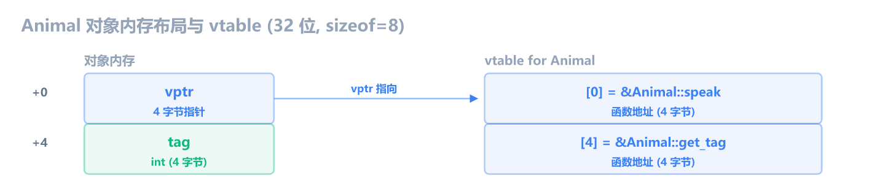
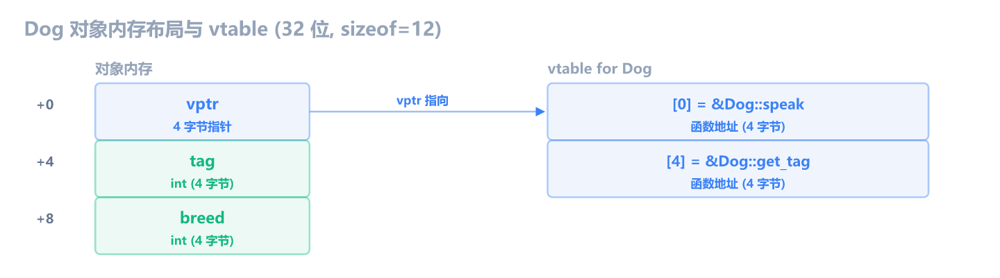
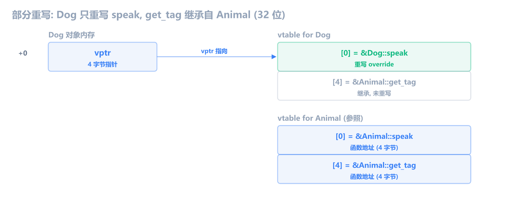
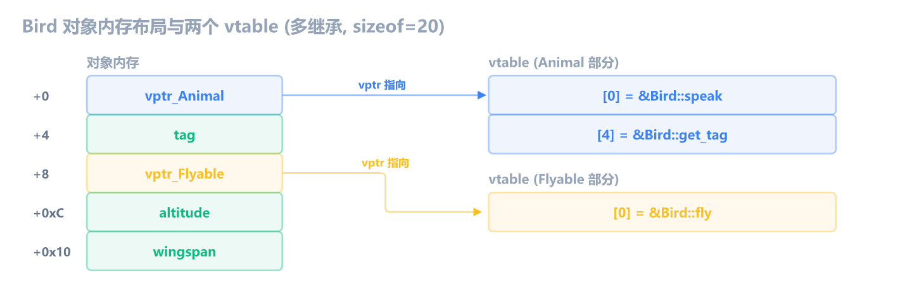

上一章学了 C++ this 指针。这一章学**虚函数表与多态**：C++ 的 `virtual` 函数在汇编里是什么样，编译器怎么实现运行时多态。

上一章的 `obj.method()` 是直接调用：`lea ecx, [obj]; call method`，编译器在编译期就知道调哪个函数。但 C++ 的多态需要运行时决定：`Animal* p = &dog; p->speak()` 调的是 `Dog::speak` 还是 `Animal::speak`，取决于 `p` 实际指向什么对象。编译器无法在编译期决定，只能在运行时查表。这张表就是**虚函数表**（vtable）。

学会识别 vtable，你就掌握了 C++ 多态在汇编层面的全部秘密。游戏引擎的 Entity、Actor、Component 全靠虚函数实现多态，逆向游戏时 vtable 是还原类继承关系的核心线索。

和前几章一样，编译 Debug x86，用 dumpbin 对照。汇编只保留 vtable 相关的核心指令，过滤掉 Debug 噪音。

## 什么时候需要虚函数

先看一个场景：游戏里有 `Player`、`Zombie`、`NPC` 三种实体，都需要 `update()` 更新逻辑。不用虚函数，你得写 switch：

```c
enum Kind { KIND_PLAYER, KIND_ZOMBIE, KIND_NPC };

void update_all(Entity* entities, int count) {
    for (int i = 0; i < count; i++) {
        switch (entities[i].kind) {
            case KIND_PLAYER:  update_player(&entities[i]);  break;
            case KIND_ZOMBIE:  update_zombie(&entities[i]);  break;
            case KIND_NPC:     update_npc(&entities[i]);    break;
        }
    }
}
```

问题：每加一种实体（比如 `Boss`），得回来改这个 switch。调用方必须知道所有类型。

虚函数解法：把 `update()` 声明为 `virtual`，每个子类重写自己的版本，调用方只管调 `p->update()`，运行时自动找到正确的函数：

```c
class Entity {
public:
    virtual void update() {}        // 基类提供默认实现
};

class Player : public Entity {
public:
    void update() override {        // 重写
        // 移动、输入处理...
    }
};

class Zombie : public Entity {
public:
    void update() override {        // 重写
        // AI 寻路...
    }
};
```

```c
void update_all(Entity** entities, int count) {
    for (int i = 0; i < count; i++) {
        entities[i]->update();      // 自动调 Player::update 或 Zombie::update
    }
}
```

`update_all` 不知道也不关心数组里是 Player 还是 Zombie。传入 `Player*` 就调 `Player::update`，传入 `Zombie*` 就调 `Zombie::update`。**加新类型不需要改调用方**，只需新建子类。

这就是多态：同一段代码（`p->update()`），根据实际对象类型，执行不同的函数。

那编译器怎么实现"运行时自动找到正确的函数"？答案就是 **虚函数表**（vtable）。下面从汇编看它具体怎么工作。

> [!IMPORTANT] 没有预编译地址，运行时怎么找到函数？
> 每个有虚函数的类，编译器生成一张 **vtable**（虚函数表），按声明顺序存了每个虚函数的地址。每个对象首 4 字节存一个 **vptr**，指向自己所属类的 vtable。
>
> 调用 `p->update()` 时，编译器生成"从对象取 vptr，再从 vtable 取函数地址，间接 call"的代码：
>
> - Player 对象 → vptr 指向 Player 的 vtable → 取出 `Player::update` 地址
> - Zombie 对象 → vptr 指向 Zombie 的 vtable → 取出 `Zombie::update` 地址
>
> 编译器在编译期不需要知道函数地址，只需要知道 vtable 里的 **offset**（第几项）。函数地址在运行时从对象自身的 vptr 取。

## 虚函数 vs 非虚函数

虚函数和非虚函数在调用方的区别：

```c
class Cat {
public:
    int tag;
    void speak() { printf("Meow\n"); }   // 非虚：调用方必须知道是 Cat
};

class Animal {
public:
    int tag;
    virtual void speak() { printf("Animal\n"); }  // 虚：可通过 Animal* 多态调用
    virtual int get_tag() { return tag; }
};
```

```c
Cat cat;
Animal animal;
Animal* p = &animal;

cat.speak();      // 非虚调用
p->speak();       // 虚调用
```

```asm
; 非虚调用：编译期确定，直接 call 函数地址
lea  ecx, [ebp-30]          ; this = &cat
call ?speak@Cat@@QAEXXZ     ; 直接调用 Cat::speak

; 虚调用：运行时查表，间接 call
mov  eax, [ebp-58]          ; eax = p（Animal 指针）
mov  edx, [eax]             ; edx = vptr（对象首 4 字节）
mov  ecx, [ebp-58]          ; ecx = this
mov  eax, [edx]            ; eax = vtable[0]（speak 的地址）
call eax                    ; 间接调用
```

区别一目了然：非虚是 `call 地址`，虚是 `call eax`（间接）。虚调用多了一次内存查找：从对象取 vptr，再从 vtable 取函数地址。

> [!IMPORTANT] 虚调用 vs 非虚调用
>
> - **非虚调用**：`lea ecx, [obj]; call func_addr` — 直接调用，编译期确定
> - **虚调用**：`mov edx, [obj]; mov eax, [edx]; call eax` — 间接调用，运行时查 vtable
>
> 识别虚调用的关键：调用前从对象首 4 字节取指针（`mov edx, [eax]`），再从这个指针取函数地址（`mov eax, [edx]`），最后 `call eax`。

### 非虚方法没有多态

前面的例子对比了虚调用和非虚调用。还有一个容易搞混的点：子类和父类有同名非虚方法时，调哪个？

```c
class Animal {
public:
    void speak() { printf("animal\n"); }   // 非虚
};

class Dog : public Animal {
public:
    void speak() { printf("dog\n"); }      // 隐藏（hide）父类的 speak, 不是 override
};

Dog d;
d.speak();          // Dog::speak

Animal* a = &d;
a->speak();         // Animal::speak, 不是 Dog::speak!
```

`a->speak()` 调的是 `Animal::speak`，不是 `Dog::speak`。因为 `speak` 不是 virtual，没有多态：**调哪个完全由指针的声明类型在编译期决定**。`a` 声明成 `Animal*`，编译器就调 `Animal::speak`，不管 `a` 实际指向什么对象。

三行调用的汇编都是直接 `call`，不查表：

```asm
lea  ecx, [d]                     ; this = &d
call ?speak@Dog@@QAEXXZ           ; d.speak() -> Dog::speak

lea  ecx, [d]                     ; this = &d（同一个对象）
call ?speak@Animal@@QAEXXZ        ; a->speak() -> Animal::speak

lea  ecx, [d]                     ; this = &d
call ?speak@Animal@@QAEXXZ        ; d.Animal::speak() -> 显式调父类
```

同一个 `Dog` 对象，`d.speak()` 和 `a->speak()` 调的是**不同的函数**，全靠编译期看声明类型。这就是非虚和虚的核心区别：非虚是编译期定死，虚是运行时查表。如果 `speak` 声明为 `virtual`，`a->speak()` 就会查 vtable 调到 `Dog::speak`。

> [!NOTE] 隐藏（hide）vs 重写（override）
> 子类定义了和父类同名的非虚方法，叫**隐藏**（hide），不是重写（override）。隐藏只是子类的方法挡住了父类的同名方法，不涉及 vtable。override 只对 `virtual` 函数有效：子类重写虚函数，vtable 里对应的槽位换成子类的函数地址。逆向时看到 `call ?speak@Dog` 和 `call ?speak@Animal` 是两个不同的直接调用，就知道是非虚的隐藏；看到查 vtable 的间接调用，才是虚函数的重写。

## 对象里到底有什么

虚函数的出现改变了对象内存布局。看下面 4 种类的对比：

```c
class Empty {                      // 只有非虚方法, 无属性
    void speak() { printf("Hi"); }
};

class Cat {                        // 非虚方法 + 1 个属性
public:
    int tag;
    void speak() { printf("Meow"); }
};

class OnlyVirtual {                // 只有虚方法, 无属性
    virtual void speak() { printf("Hi"); }
};

class Animal {                     // 虚方法 + 1 个属性
public:
    int tag;
    virtual void speak() { printf("Animal"); }
};
```

| 类          | 虚函数 | 属性 | sizeof | +0       | +4  |
| ----------- | ------ | ---- | ------ | -------- | --- |
| Empty       | 0      | 0    | 1      | (空占位) | -   |
| Cat         | 0      | 1    | 4      | tag      | -   |
| OnlyVirtual | 1+     | 0    | 4      | vptr     | -   |
| Animal      | 1+     | 1    | 8      | vptr     | tag |

关键结论：

- **方法不占对象空间**。无论非虚方法还是虚方法，函数体都在代码段，对象里不存函数。非虚方法调用是 `call 地址`，地址编译期确定；虚方法的地址存在 vtable 里，不在对象里。
- **有虚函数时，对象首 4 字节被 vptr 占据**。不管有多少虚方法（1 个还是 100 个），对象里只有 1 个 vptr。虚方法越多，vtable 越长，对象大小不变。
- **没有虚函数时，+0 就是第一个属性**。没有 vptr 挡在前面，属性从头开始排列。
- **Empty 的 sizeof=1**。C++ 规定空对象至少占 1 字节，保证不同实例的地址不同。里面没有任何有效数据。

一句话总结：对象内存里只放两样东西，**vptr（如果有虚函数）和属性**，方法不在其中。

## vtable 内存布局

有虚函数的类，每个对象的首 4 字节存一个指针，叫 **vptr**（virtual pointer），指向这个类的 **vtable**（虚函数表）。vtable 是一个函数指针数组，按虚函数声明顺序排列：



`Animal` 有两个虚函数 `speak` 和 `get_tag`，vtable 有 2 项。vtable[0] 是 `speak` 的地址，vtable[4] 是 `get_tag` 的地址（每项 4 字节，因为 32 位指针）。

> [!NOTE] vptr 在偏移 +0
> MSVC 把 vptr 放在对象的最前面（偏移 +0）。无论类有多少成员，vptr 永远是第一个字段。这意味着有虚函数的类，`sizeof` 至少多 4 字节（vptr 本身）。`sizeof(Animal)` 是 8（vptr + tag），不是 4。

### 构造函数设置 vptr

vptr 是在构造函数里设置的。构造函数开头第一件事就是把 vptr 指向本类的 vtable：

```asm
Animal::Animal:
    ...
    mov  eax, [ebp-8]           ; eax = this
    mov  dword ptr [eax], offset ??_7Animal@@6B@  ; this->vptr = &vtable_Animal
    mov  eax, [ebp-8]
    mov  dword ptr [eax+4], 0   ; this->tag = 0
    ...
    ret
```

`??_7Animal@@6B@` 是 MSVC 给 vtable 的名称修饰，`??_7` 前缀表示 vtable。`mov dword ptr [eax], offset vtable` 就是设置 vptr：把对象首 4 字节写成 vtable 的地址。

> [!NOTE] vtable 的名称修饰
> MSVC 的 vtable 符号以 `??_7` 开头，后跟类名。例如 `??_7Animal@@6B@` 是 `Animal` 的 vtable，`??_7Dog@@6B@` 是 `Dog` 的 vtable。逆向时在符号表或数据段看到 `??_7` 开头的符号，就是 vtable。它指向的内容是连续的函数指针，每个 4 字节。

### 虚函数内部：和普通方法一样

虚函数的函数体本身和普通方法没有区别，仍然是 thiscall，ECX 传 this，内部用 `[ecx+offset]` 或 `[ebp-8]+offset` 访问成员：

```asm
Animal::get_tag:
    ...
    mov  eax, [ebp-8]          ; eax = this
    mov  eax, [eax+4]          ; eax = this->tag（偏移 +4）
    ...
    ret                        ; 0 个栈参数
```

虚函数和非虚函数的区别只在**调用方**：调用方查 vtable 间接调用。函数体本身完全一样。

## 单继承：覆盖 vptr

`Dog` 继承 `Animal`，重写 `speak` 和 `get_tag`：

```c
class Dog : public Animal {
public:
    int breed;
    Dog() : breed(1) { tag = 1; }
    void speak() override { printf("Woof\n"); }
    int get_tag() override { return tag + 100; }
};
```

`Dog` 的构造函数：

```asm
Dog::Dog:
    ...
    mov  ecx, [ebp-8]          ; ecx = this
    call ??0Animal@@QAE@XZ     ; 先调父类构造（设置 Animal 的 vptr）
    ...
    mov  eax, [ebp-8]          ; eax = this
    mov  dword ptr [eax], offset ??_7Dog@@6B@  ; 覆盖 vptr 为 Dog 的 vtable
    mov  eax, [ebp-8]
    mov  dword ptr [eax+8], 1  ; this->breed = 1（偏移 +8）
    mov  eax, [ebp-8]
    mov  dword ptr [eax+4], 1  ; this->tag = 1（偏移 +4）
    ...
    ret
```

关键步骤：先 `call Animal::Animal`（父类构造把 vptr 设成 `??_7Animal`），然后**覆盖** vptr 为 `??_7Dog`。子类构造函数总是先调父类构造，再覆盖 vptr，最后初始化自己的成员。



`Dog` 的 vtable 和 `Animal` 的 vtable 结构一样（2 项），但每项指向的函数不同：`Dog::speak` 和 `Dog::get_tag`。多态的本质就是：不同子类的对象有不同的 vptr，vptr 指向不同的 vtable，调用 `p->speak()` 时查到不同的函数地址。

### 部分重写：槽位替换

上面的 `Dog` 把两个虚函数都重写了。如果子类只重写一部分虚函数，没重写的那些槽位怎么办？答案：**vtable 项数不变，只有被 override 的槽位换地址，没 override 的槽位直接复用父类的函数地址**。

```c
class Dog : public Animal {
public:
    int breed;
    void speak() override { printf("Woof\n"); }   // 只重写 speak
    // get_tag 没重写, 继承 Animal::get_tag
};
```

`Dog` 的 vtable 结构：



关键点：

- **vtable 项数 = 虚函数个数**。Animal 有 2 个虚函数，Dog 的 vtable 也是 2 项，不会因为没重写而少一项。
- **override 的槽位换地址**：vtable[0] 从 `&Animal::speak` 换成 `&Dog::speak`。
- **没 override 的槽位保持父类地址**：vtable[4] 仍然是 `&Animal::get_tag`。

逆向时这一点很有用：对比子类和父类的 vtable，相同的槽位 = 没被重写，不同的槽位 = 被重写了。用 IDA 的 xref 顺着 vtable 一项项看，很快就能还原出"子类重写了哪几个虚函数"。

### 多态调用

```c
Animal* p1 = &a;    // a 是 Animal
Animal* p2 = &d;    // d 是 Dog
p1->speak();        // 调 Animal::speak
p2->speak();        // 调 Dog::speak
p2->get_tag();      // 调 Dog::get_tag
```

三行虚调用的汇编：

```asm
; p1->speak()  —— p1 在 [ebp-58]
mov  eax, [ebp-58]          ; eax = p1（对象地址）
mov  edx, [eax]             ; edx = vptr
mov  esi, esp               ; Debug: 记录栈指针（用于 RTC_CheckEsp）
mov  ecx, [ebp-58]          ; ecx = this
mov  eax, [edx]             ; eax = vtable[0] = &speak
call eax                    ; 调用

; p2->speak()  —— p2 在 [ebp-64]
mov  eax, [ebp-64]          ; eax = p2
mov  edx, [eax]             ; edx = vptr
mov  esi, esp               ; Debug: 记录栈指针（用于 RTC_CheckEsp）
mov  ecx, [ebp-64]          ; ecx = this
mov  eax, [edx]             ; eax = vtable[0] = &speak
call eax                    ; 调用

; p2->get_tag()  —— 同一个 p2
mov  eax, [ebp-64]          ; eax = p2
mov  edx, [eax]             ; edx = vptr
mov  esi, esp               ; Debug: 记录栈指针
mov  ecx, [ebp-64]          ; ecx = this
mov  eax, [edx+4]           ; eax = vtable[4] = &get_tag
call eax                    ; 调用
```

三段汇编的指令序列完全一样，只有对象地址不同。`p1->speak()` 查的是 Animal 的 vtable，`p2->speak()` 查的是 Dog 的 vtable。同样的代码，不同的 vptr，不同的结果。这就是多态。

> [!IMPORTANT] 虚调用的三步模板
>
> 1. `mov edx, [obj]` — 从对象首 4 字节取 vptr
> 2. `mov eax, [edx+offset]` — 从 vtable 取函数地址（offset = 虚函数在表中的位置）
> 3. `mov ecx, obj; call eax` — 设 this，间接调用
>
> 虚函数在 vtable 中的位置由声明顺序决定：第一个 virtual 函数在 vtable[0]，第二个在 vtable[4]，第三个在 vtable[8]，以此类推。

### 通过函数参数多态调用

上一章的 `make_speak` 接受 `Animal*` 参数，内部调 `speak()`：

```c
void make_speak(Animal* a) {
    a->speak();
}
```

```asm
make_speak:
    ...
    mov  eax, [ebp+8]          ; eax = a（参数，Animal*）
    mov  edx, [eax]            ; edx = vptr
    mov  esi, esp              ; Debug: 记录栈指针
    mov  ecx, [ebp+8]          ; ecx = this
    mov  eax, [edx]            ; eax = vtable[0] = &speak
    call eax
    ...
    ret                         ; cdecl，调用方清栈
```

`make_speak` 不知道也不关心 `a` 指向的是 Animal 还是 Dog。它只管从对象取 vptr，从 vtable 取函数地址，间接调用。传入 `&a` 就调 `Animal::speak`，传入 `&d` 就调 `Dog::speak`。

> [!NOTE] 为什么虚调用比直接调用慢
> 非虚调用是 `call addr`，一条指令直接跳转。虚调用是 `mov edx,[eax]; mov eax,[edx]; call eax`，多了两次内存读取（取 vptr、取函数地址）。在现代 CPU 上，如果 vtable 不在缓存里，虚调用的开销可能比直接调用多几纳秒。但对大多数应用，这点开销可以忽略。游戏引擎的热路径（每帧调用数万次的虚函数）才会考虑用其他方式替代虚函数。

## 多继承：多个 vptr

一个类继承多个带虚函数的基类时，对象里有多个 vptr。每个虚基类对应一个 vtable 子表：

```c
class Animal {                  // 前面定义过的基类
public:
    int tag;
    virtual void speak() { printf("Animal\n"); }
    virtual int get_tag() { return tag; }
};

class Flyable {
public:
    int altitude;
    virtual void fly() { printf("fly\n"); }
};

class Bird : public Animal, public Flyable {
public:
    int wingspan;
    Bird() : wingspan(2) { tag = 3; }
    void speak() override { printf("Chirp\n"); }
};
```

`Bird` 继承 `Animal`（有 vptr）和 `Flyable`（有 vptr），所以 `Bird` 对象有**两个** vptr：



`Bird` 的构造函数设置两个 vptr：

```asm
Bird::Bird:
    ...
    mov  ecx, [ebp-8]          ; this
    call ??0Animal@@QAE@XZ     ; 构造 Animal 子对象
    mov  ecx, [ebp-8]
    add  ecx, 8                ; this + 8 = Flyable 子对象地址
    call ??0Flyable@@QAE@XZ   ; 构造 Flyable 子对象
    mov  eax, [ebp-8]
    mov  dword ptr [eax], offset ??_7Bird@@6BAnimal@@@  ; vptr_Animal = Bird's vtable (Animal)
    mov  eax, [ebp-8]
    mov  dword ptr [eax+8], offset ??_7Bird@@6BFlyable@@@  ; vptr_Flyable = Bird's vtable (Flyable)
    mov  eax, [ebp-8]
    mov  dword ptr [eax+10], 2  ; this->wingspan = 2（偏移 +0x10）
    mov  eax, [ebp-8]
    mov  dword ptr [eax+4], 3  ; this->tag = 3（偏移 +4）
    ...
    ret
```

两个 vptr 分别在偏移 +0 和 +8。MSVC 的多继承 vtable 名称修饰是 `??_7Bird@@6BAnimal@@@`（Animal 部分）和 `??_7Bird@@6BFlyable@@@`（Flyable 部分），`6B` 后跟基类名。

### this 指针调整

把 `Bird` 对象赋给 `Flyable*` 指针时，编译器要调整指针：

```c
Bird b;
Flyable* pf = &b;    // 不能直接用 &b, 要 +8 跳到 Flyable 子对象
pf->fly();           // 这里 this 是 Flyable 子对象地址, 不是 &b
```

`Flyable* pf = &b` 不能直接用 `&b`，因为 `Bird` 里的 `Flyable` 子对象不在对象开头，而在偏移 +8。编译器需要调整指针：


```asm
; Flyable* pf = &b;
lea  eax, [ebp-4C]           ; eax = &b（Bird 对象地址）
test eax, eax
je   skip                    ; 如果 b 是 nullptr，pf = nullptr
lea  ecx, [ebp-4C]
add  ecx, 8                  ; ecx = &b + 8（Flyable 子对象地址）
mov  [ebp-144], ecx
jmp  done
skip:
mov  [ebp-144], 0            ; nullptr
done:
mov  edx, [ebp-144]
mov  [ebp-7C], edx           ; pf = &b + 8

; pf->fly()
mov  eax, [ebp-7C]           ; eax = pf（已调整过的 Flyable*）
mov  edx, [eax]             ; edx = vptr_Flyable
mov  ecx, [ebp-7C]          ; ecx = this（Flyable 子对象地址）
mov  eax, [edx]             ; eax = vtable[0] = &fly
call eax
```

`add ecx, 8` 把 this 从 `Bird*` 调整为 `Flyable*`。多继承的 this 调整是编译器在调用方插入的，被调方（`fly`）内部仍然用 `[ecx+offset]` 访问 Flyable 的成员，只是这里的 ecx 是 Flyable 子对象的地址，不是整个 Bird 对象的地址。

> [!NOTE] 多继承的 this 调整
> 单继承不需要 this 调整，因为父类子对象总在偏移 +0，父类指针和子类指针指向同一个地址。多继承时，第二个及之后的基类子对象不在偏移 0，需要 `add ecx, N` 调整。逆向时看到虚调用前有 `add ecx/edx, N`，很可能是多继承的指针调整。

> [!NOTE] 多继承 vtable 的名称修饰
> 单继承 vtable 名是 `??_7类名@@6B@`（如 `??_7Animal@@6B@`）。多继承 vtable 名是 `??_7类名@@6B基类名@@@`（如 `??_7Bird@@6BAnimal@@@`、`??_7Bird@@6BFlyable@@@`）。`6B` 后的基类名标识这个 vtable 对应哪个基类子对象。

## 虚析构函数

如果基类的析构函数声明为 `virtual`，它就占 vtable 的一个槽位，和普通虚函数一样。

```c
class Base {
public:
    virtual ~Base() { printf("base dtor\n"); }    // 虚析构, 占 vtable[0]
    virtual void work() { printf("base work\n"); } // 占 vtable[4]
};

class Derived : public Base {
public:
    ~Derived() override { printf("derived dtor\n"); }
    void work() override { printf("derived work\n"); }
};
```

`delete p`（`p` 是 `Base*`）的汇编：

```asm
; delete p  —— p 在 [ebp-8]
mov  eax, [ebp-8]           ; eax = p
mov  edx, [eax]             ; edx = vptr
mov  eax, [edx]             ; eax = vtable[0] = 虚析构（??_GDerived）
push 1                      ; 标量 delete 标志
call eax                    ; 调 ??_GDerived
```

虚析构和普通虚函数的调用方式完全一样：查 vtable 间接调用。区别在于 `delete p` 调的是 vtable[0]（析构），而 `p->work()` 调的是 vtable[4]。

`??_GDerived`（scalar deleting destructor）内部按顺序执行三步：

```asm
??_GDerived:
    ...
    call ??1Derived@@UAE@XZ   ; 1. Derived 析构（清理子类资源）
    and  eax, 1               ; 2. 检查标志位（1 = delete 后要释放内存）
    je   skip_free
    push 4                    ; 3. sizeof(Derived) = 4
    push [ebp-8]              ; this
    call ??3@YAXPAXI@Z        ; operator delete（释放堆内存）
skip_free:
    ret 4
```

`??1Derived` 内部还会调 `??1Base`（父类析构），形成完整的析构链：`??_GDerived` → `??1Derived` → `??1Base` → `??3`（operator delete）。

> [!IMPORTANT] 为什么基类析构要声明 virtual
> 如果 `Base` 的析构不是 virtual，`delete p`（`p` 是 `Base*`，实际指向 `Derived`）只会调 `Base::~Base`，不会调 `Derived::~Derived`，子类资源泄漏。声明 virtual 后，`delete p` 通过 vtable 查到 `??_GDerived`，先析构子类再析构父类。C++ 游戏引擎的基类（Entity/Actor/Component）几乎都有虚析构，逆向时 vtable[0] 往往就是虚析构。

## 从汇编反推类结构

综合来看，从汇编反推 C++ 多态类结构的方法：

1. **找 vptr**：构造函数里 `mov dword ptr [eax], offset ??_7Xxx@@6B@`，说明有虚函数
2. **数 vptr 个数**：一个 vptr = 单继承，多个 vptr = 多继承
3. **数 vtable 项数**：vtable 有几项就有几个虚函数（dumpbin 符号表里看 vtable 的连续函数指针）
4. **找虚调用偏移**：`mov eax, [edx+offset]` 的 offset 告诉你调的是第几个虚函数（0 = 第一个，4 = 第二个）
5. **找 this 调整**：虚调用前 `add ecx, N` 说明是多继承，N 是第二基类的偏移
6. **找覆盖**：子类构造函数里先 `call 父类构造`，再覆盖 vptr，说明重写了虚函数

例如：

```asm
    mov  eax, [ebp+8]          ; 参数：对象指针
    mov  edx, [eax]            ; 取 vptr
    mov  ecx, [ebp+8]          ; this
    mov  eax, [edx+4]          ; vtable[4] = 第二个虚函数
    call eax
```

反推：参数是一个带虚函数的对象指针，调用的是第 2 个虚函数（偏移 +4）。如果 vtable[0] 是 `speak`，vtable[4] 可能是 `get_tag`，那这段代码是 `obj->get_tag()`。

## 逆向识别清单

| 特征                                         | 含义                                  |
| -------------------------------------------- | ------------------------------------- |
| `mov dword ptr [eax], offset ??_7Xxx@@6B@`   | 构造函数设置 vptr                     |
| `mov edx, [eax]; mov eax, [edx]; call eax`   | 虚调用（第一个虚函数）                |
| `mov edx, [eax]; mov eax, [edx+4]; call eax` | 虚调用（第二个虚函数）                |
| `mov edx, [eax]; mov eax, [edx+N]; call eax` | 虚调用（第 N/4+1 个虚函数）           |
| `??_7` 开头的符号                            | vtable                                |
| `??_7Xxx@@6BYyy@@@`                          | 多继承 vtable（Xxx 类，Yyy 基类部分） |
| 构造函数先 `call 父类构造`，再覆盖 vptr      | 单继承重写虚函数                      |
| 虚调用前 `add ecx, N`                        | 多继承 this 调整                      |
| `lea ecx, [obj]; call addr`（无查表）        | 非虚调用（直接调用）                  |

**C++ 多态的汇编本质**：虚调用是 `mov edx,[obj]; call [edx+offset]` 的间接跳转，vptr 在对象首 4 字节，vtable 是函数指针数组。不同子类的 vptr 指向不同的 vtable，同样的调用代码执行不同的函数。

> [!NOTE] x64 下的虚函数调用
> 64 位下 vptr 仍是对象首字段（8 字节），vtable 每项 8 字节。虚调用模板变成 `mov rdx, [rcx]; call qword ptr [rdx]`（this 走 RCX）。多继承时 this 调整用 `add rcx, N`。整体结构和 32 位一致，只是寄存器和指针大小翻倍。

> [!NOTE] 游戏逆向中的 vtable
> 游戏引擎的 Entity/Actor/Component 几乎都有虚函数。你在 x64dbg 或 IDA 里看到 `mov edx, [ecx]; call [edx+0C]`，就是在调虚函数表第 4 项（偏移 0xC = 第 4 个虚函数）。用 IDA 的 xref 功能找到 vtable，再顺着 vtable 的每一项找到函数地址，就能还原这个类的所有虚函数。ReClass.NET 能直接显示对象的 vptr，帮你快速定位 vtable。

> [!NOTE] RTTI 与 dynamic_cast
> MSVC 在 vtable 前面（偏移 -4）放一个指向 `RTTI Complete Object Locator` 的指针，里面包含类名和继承关系。`dynamic_cast` 就是查这个信息做运行时类型判断。逆向时如果 IDA 显示 `??_R0` 开头的符号，那是 RTTI 类型描述符，能直接读到类名。但很多游戏会关闭 RTTI（编译选项 `/GR-`）来减小体积和防逆向，这时 vtable 前面没有 RTTI 信息，只能靠 vtable 结构和函数行为反推。

## 练习

1. 下面这段调用方汇编是虚调用还是非虚调用？调的是哪个虚函数（第几个）？

   ```asm
   mov  eax, [ebp-58]
   mov  edx, [eax]
   mov  ecx, [ebp-58]
   mov  eax, [edx+4]
   call eax
   ```

   > [!NOTE]- 参考答案
   > 是虚调用。从对象首 4 字节取 vptr（`mov edx, [eax]`），再从 vtable 取函数地址（`mov eax, [edx+4]`），最后 `call eax` 间接调用。`[edx+4]` 是 vtable 第二项，调的是第 2 个虚函数。如果 vtable[0] 是 `speak`、vtable[4] 是 `get_tag`，那这段代码是 `obj->get_tag()`。

2. 下面这段构造函数汇编，对象有几个 vptr？是单继承还是多继承？

   ```asm
   mov  ecx, [ebp-8]
   call ??0Animal@@QAE@XZ
   mov  ecx, [ebp-8]
   add  ecx, 8
   call ??0Flyable@@QAE@XZ
   mov  eax, [ebp-8]
   mov  dword ptr [eax], offset ??_7Bird@@6BAnimal@@@
   mov  eax, [ebp-8]
   mov  dword ptr [eax+8], offset ??_7Bird@@6BFlyable@@@
   ```

   > [!NOTE]- 参考答案
   > 对象有**两个** vptr（偏移 +0 和 +8），是**多继承**。构造函数先调 `Animal` 父类构造，再 `add ecx, 8` 调整指针调 `Flyable` 父类构造，然后设置两个 vptr：`??_7Bird@@6BAnimal@@@`（Animal 部分）和 `??_7Bird@@6BFlyable@@@`（Flyable 部分）。名称修饰 `6BAnimal` 和 `6BFlyable` 也证实了多继承。

3. 下面这段 main 里的汇编在做什么？和非虚调用有什么区别？

   ```asm
   lea  ecx, [ebp-24]
   call ?speak@Dog@@UAEXXZ
   ```

   > [!NOTE]- 参考答案
   > 这是**非虚调用**（直接调用）。`lea ecx, [ebp-24]` 设置 this，`call ?speak@Dog@@UAEXXZ` 直接调用 `Dog::speak` 的函数地址。虽然 `speak` 是虚函数，但这里 `d` 是 `Dog` 类型（不是 `Animal*` 指针），编译器在编译期就知道确切类型，直接调用即可，不需要查 vtable。只有通过指针或引用调用时（`Animal* p = &d; p->speak()`），编译器无法确定实际类型，才会走 vtable 间接调用。

4. 根据下面的 vtable 和调用方汇编，还原类结构。

   vtable 内容（从符号表读到）：

   ```
   ??_7Weapon@@6B@:
       [0] = ?attack@Weapon@@UAEXXZ
       [4] = ?get_damage@Weapon@@UAEHXZ
   ```

   调用方：

   ```asm
   mov  eax, [ebp-8C]
   mov  edx, [eax]
   mov  ecx, [ebp-8C]
   mov  eax, [edx+4]
   call eax
   ```

   > [!NOTE]- 参考答案
   > vtable 有 2 项：`attack`（vtable[0]）和 `get_damage`（vtable[4]）。调用方 `mov eax, [edx+4]` 取的是 vtable[4]，即调用 `get_damage`。
   >
   > 类结构（部分）：
   >
   > ```c
   > class Weapon {
   >     int vptr;  // 偏移 +0（编译器自动加的）
   >     // ... 成员变量 ...
   >     virtual void attack() = 0;     // vtable[0]
   >     virtual int get_damage() = 0;  // vtable[4]
   > };
   > ```
   >
   > 调用方等价于 `weapon->get_damage()`。

5. 下面这段汇编涉及多继承的虚调用。`add ecx, 8` 的作用是什么？为什么需要它？

   ```asm
   lea  eax, [ebp-4C]
   test eax, eax
   je   skip
   lea  ecx, [ebp-4C]
   add  ecx, 8
   mov  [ebp-144], ecx
   jmp  done
   skip:
   mov  [ebp-144], 0
   done:
   mov  eax, [ebp-144]
   mov  edx, [eax]
   mov  ecx, [ebp-144]
   mov  eax, [edx]
   call eax
   ```

   > [!NOTE]- 参考答案
   > `add ecx, 8` 是把 this 指针从 Bird 对象的开头调整到 Flyable 子对象的开头。`Bird` 多继承 `Animal` 和 `Flyable`，Animal 子对象在偏移 +0，Flyable 子对象在偏移 +8。当用 `Flyable* pf = &b` 时，指针必须指向 Flyable 子对象，所以编译器自动加 8。后续的虚调用 `mov edx, [eax]; mov eax, [edx]; call eax` 用的是调整后的地址（Flyable 子对象的 vptr），调的是 Flyable 的 vtable[0]，即 `fly()`。`test eax, eax; je skip` 是处理 `b` 为 nullptr 的情况，保证 `pf` 也是 nullptr 而不是 8。
