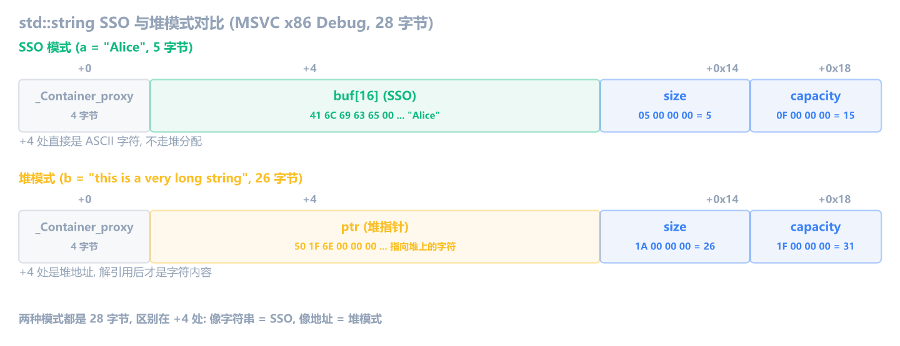
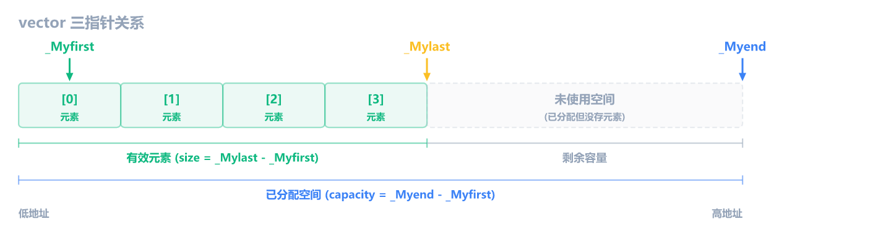
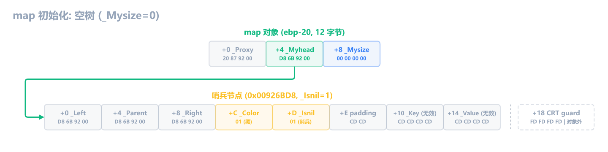
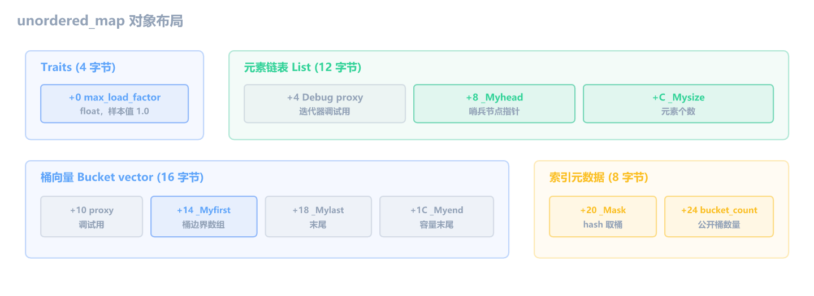
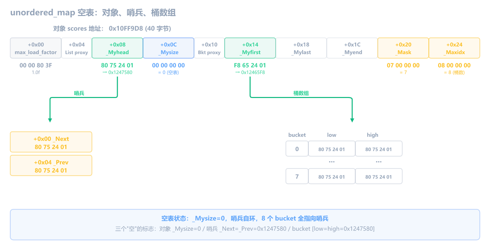

上一章讨论了编译器优化。这一章回到 **MSVC x86 Debug**，看 **STL 容器在汇编和内存里是什么样**：`std::string`、`std::vector`、`std::map` 和 `std::unordered_map` 是逆向 C++ 程序时最常见的四类容器。

游戏里的玩家名常放在 `std::string`，角色列表常放在 `std::vector`，ID 到数值的有序映射常放在 `std::map`，缓存和快速查找常用 `std::unordered_map`。如果不知道这些容器的内存形态，你看到 `[eax+1C]`、`[ecx+4]`、`[ecx+8]`、`[ecx+0C]` 时，只会觉得偏移很怪。

这一章不讲 STL 源码细节，只讲逆向时最有用的三件事：**对象占多大、关键字段在哪、缺少符号信息时怎么识别**。四类容器都围绕同一段示例代码展开。

> [!IMPORTANT] 本章的范围
> 下面的大小和偏移基于 **MSVC x86 Debug** 验证。不同编译器、不同 STL 实现、x64、Release 模式下布局可能不同。逆向时不要死背数字，要把数字和访问模式一起看。
>
> Debug 模式下，本章的 `std::string`、`std::vector`、`std::map` 对象开头都有一个 `_Container_proxy` 指针（4 字节），Release 模式下这个字段消失。所以同一个 `vector<Player>`，Debug 下是 16 字节，Release 下是 12 字节。`std::unordered_map` 的布局更复杂，它的代理指针不在对象开头，后面单独讲。逆向时如果看到的容器大小和本章对不上，先确认是不是 Release。

## 示例代码

这一章用一段完整的 C++ 代码做例子，后面所有 STL 容器都围绕它展开：

```cpp
#include <map>
#include <stdio.h>
#include <string>
#include <unordered_map>
#include <vector>

class Player {
public:
    std::string name;
    int hp;
    int mp;

    Player(const char* n, int h, int m) : name(n), hp(h), mp(m) {}
};

int get_hp(Player* p) {
    return p->hp;
}

int get_mp(Player* p) {
    return p->mp;
}

int team_size(std::vector<Player>* team) {
    return (int)team->size();
}

int first_hp(std::vector<Player>* team) {
    return (*team)[0].hp;
}

int score_at(std::map<int, int>* scores, int key) {
    return (*scores)[key];
}

int main() {
    std::string a = "Alice";
    std::string b = "this is a very long string";

    Player p("Alice", 100, 50);
    printf("hp=%d mp=%d\n", get_hp(&p), get_mp(&p));

    std::vector<Player> team;
    team.push_back(p);
    printf("size=%d first_hp=%d\n", team_size(&team), first_hp(&team));

    for (auto it = team.begin(); it != team.end(); ++it) {
        printf("%s\n", it->name.c_str());
    }

    std::map<int, int> scores;
    scores[7] = 900;
    scores[3] = 300;
    scores[12] = 1200;
    scores[1] = 100;
    printf("score=%d\n", score_at(&scores, 7));

    std::unordered_map<int, int> hash_scores;
    hash_scores.max_load_factor(0.1f);
    hash_scores[7] = 900;
    hash_scores[3] = 300;
    hash_scores[71] = 7100;
    printf("hash_score=%d\n", hash_scores[71]);
    return 0;
}
```

## std::string：SSO 布局

`std::string` 对象本身固定 **28 字节**，不管字符串多长。这 28 字节里有一段 16 字节的 buffer（`+4` 到 `+0x13`），它有两种用法：字符串 ≤15 字节时，字符直接存进这个 buffer，不需要堆分配；字符串 >15 字节时，这个 buffer 存一个堆指针，真正的字符在堆上。前一种叫 **SSO**（Small String Optimization，短字符串优化）。

布局如下：

```text
sizeof(std::string) = 28

偏移     内容
+0       _Container_proxy（Debug 调试代理）
+4       union {
             char buf[16];     短字符串直接存在这里（SSO）
             char* ptr;        长字符串指向堆内存
         }
+0x14    size（当前长度，不含 \0）
+0x18    capacity（容量，不含 \0）
```

`+4` 到 `+0x13` 这 16 字节是 SSO 的核心。短字符串时这里放字符，长字符串时这里放指针。不管哪种模式，string 对象都是 28 字节，变化的只是这 16 字节的内容。

> [!NOTE] 实战遇到的是 Release，布局不同
> 本章用 Debug 模式教学，因为汇编和 C 代码逐行对应，容易理解。但逆向实战面对的多数是 Release 二进制。在本章同一 MSVC 版本下，Release 去掉 `_Container_proxy` 后 string 从 28 变成 24 字节，union、size、capacity 相应前移：`+0` 直接是 buf/ptr，`+0x10` 是 size，`+0x14` 是 capacity。这只是同一版本的 Debug 与 Release 对照，不能当作跨版本通用规则；其他编译器或 STL 实现的 Release 布局仍需重新验证。

### 构造过程：从只读字符串到可写副本

示例代码里 `a` 是 SSO（5 字节，≤15），`b` 是堆分配（26 字节，>15）：

```cpp
std::string a = "Alice";                    // SSO，字符存在对象内部
std::string b = "this is a very long string"; // 堆分配，字符存在堆上
```

用 x64dbg 跟踪 `a` 的构造，能看到三条指令：

```asm
    push offset "Alice"               ; 参数：源字符串地址（在 .rdata 段，只读）
    lea  ecx, [ebp-30]                ; this：string 对象在栈上的地址
    call basic_string::basic_string   ; 构造函数：把 "Alice" 拷贝到对象内部
```

三步各干什么：

1. **`push offset "Alice"`**：`"Alice"` 是字符串字面量，编译时写死在 exe 的 `.rdata` 段里，只读。`push` 的是它的地址，作为参数传给构造函数。这个地址压到 `esp` 当前位置，和 `a` 对象在栈上的位置无关。
2. **`lea ecx, [ebp-30]`**：`a` 是栈上的局部变量，`ebp-30` 是它的地址。这个偏移是编译器在编译期算好的——函数开头 `sub esp, 1DC` 一次性预留所有局部变量的栈空间，`a` 占其中 28 字节，编译器分配在 `ebp-30` 处并写死在指令里。`lea` 只是算地址，不读内存也不改变 `esp`。这是 thiscall 约定，ecx 传 this 指针，告诉构造函数"往这个地址构造对象"。
3. **`call basic_string::basic_string`**：构造函数把字符从只读的 `.rdata` 段拷贝到 string 对象内部。call 之前 `ebp-30` 那 28 字节是 `CC CC CC...`（Debug 填充），是空的；call 之后字符才进去。

为什么要拷贝？因为 `.rdata` 段是只读的，而 string 需要可写的副本（`a[0] = 'B'` 要能改）。string 要的是"自己拥有一份可写副本"，不是"指向别人不可改的字符串"。

构造函数内部根据字符串长度走不同路径，但逆向时不需要跟进去看：

- **SSO（≤15 字节）**：直接把字符从 `.rdata` 拷到对象 `+4` 的 buffer 里
- **堆模式（>15 字节）**：先分配堆内存，把字符从 `.rdata` 拷到堆上，再把堆地址写进对象 `+4` 处

`b` 的构造调用的是同一个函数，汇编完全一样：

```asm
    push offset "this is a very long string"
    lea  ecx, [ebp-54]                ; b 在栈上的地址
    call basic_string::basic_string   ; 同一个构造函数
```

从调用方看不出来 `a` 是 SSO、`b` 是堆模式。区别在构造函数内部根据字符串长度决定走哪条路，但逆向时不需要跟进去看。构造完成后，查看两个对象的内存就能看出区别。

### 构造后的内存

`a` 构造完后的内存（`ebp-30` 处，28 字节）：

```text
+0:    D8 6B 55 00    _Container_proxy
+4:    41 6C 69 63 65 00 00 00 00 00 00 00 00 00 00 00    "Alice" + 填充0
+0x14: 05 00 00 00    size = 5
+0x18: 0F 00 00 00    capacity = 15
```

`+4` 处直接是 `41 6C 69 63 65`（`"Alice"` 的 ASCII），字符在对象内部，这是 SSO。capacity = 15，是 SSO 的固定值（16 字节 buffer 减 1 给 `\0`）。

`b` 构造完后的内存（`ebp-54` 处，28 字节）：

```text
+0:    20 6C 55 00    _Container_proxy
+4:    48 68 55 00    堆指针 → 0x00556848
+8:    00 00 00 00 00 00 00 00 00 00 00 00    填充0
+0x14: 1A 00 00 00    size = 26
+0x18: 1F 00 00 00    capacity = 31
```

`+4` 处是 `48 68 55 00`，这是一个堆地址（0x00556848），不是 ASCII。去这个堆地址看才能找到字符：

```text
0x00556848: 74 68 69 73 20 69 73 20 61 20 76 65 72 79 20 6C    "this is a very l"
0x00556858: 6F 6E 67 20 73 74 72 69 6E 67 00                   "ong string\0"
```

字符在堆上，不在 string 对象内部，这是堆模式。capacity = 31，不是 15，也说明不是 SSO。

实际运行后的内存布局（Debug x86，28 字节）：



两种模式下对象都是 28 字节，但 `+4` 处的内容完全不同。

### 怎么判断 SSO 还是堆模式

逆向时不需要跟进 `c_str` 或构造函数内部。判断方法很简单：查看对象内存，看 buffer 处（Debug 是 `+4`，Release 是 `+0`）的内容。

- **SSO**：buffer 处是可读 ASCII 字符。比如 `41 6C 69 63 65` 就是 `"Alice"`，字符直接在对象内部。
- **堆模式**：buffer 处是一个堆地址（通常是 `0x00xxxx00` 到 `0x7Fxxxx00` 范围的指针），解引用后才是字符内容。

辅助确认：SSO 模式下 capacity 固定是 15（`0x0F`），因为 SSO buffer 就是 16 字节（减 1 给 `\0`）。如果 capacity 是 15，基本可以确认是 SSO。

### string 对成员偏移的影响

示例代码里 `Player` 的第一个成员是 `std::string name`。`name` 占 28 字节，所以后面的 `hp` 和 `mp` 不在 `+0x4`，而在 `+0x1C` 和 `+0x20`：

```text
sizeof(Player) = 36

偏移     内容
+0       name (std::string, 28 字节)
+0x1C    hp (int)
+0x20    mp (int)
```

编译后，`get_hp` 和 `get_mp` 的偏移直接反映了这个布局：

```asm
get_hp:
    mov  eax, [ebp+8]          ; eax = p
    mov  eax, [eax+1C]         ; eax = p->hp（跳过 28 字节的 name）

get_mp:
    mov  eax, [ebp+8]          ; eax = p
    mov  eax, [eax+20]         ; eax = p->mp
```

逆向时如果看到一个 int 成员的偏移不是 `+0x4` 而是 `+0x1C`，往前 28 字节查看内存，发现开头有可读 ASCII 加上长度/容量字段，就能确认前面是 `std::string`。

### 缺少符号信息时怎么识别 std::string

- 对象内部出现一段可读 ASCII，附近还有长度和容量字段
- 后续成员偏移跳过一大段，比如第一个 int 在 `+0x1C`
- 保留符号信息时能看到 `basic_string`、`c_str`、`_Myptr`、`assign`、`append` 等名字

> [!NOTE] 不要把 28 字节当成 C++ 标准
> `std::string` 的布局不是 C++ 标准规定的，而是 STL 实现细节。本章的 28 字节只用于 MSVC x86 Debug 的逆向训练。真实项目里要结合编译器、位数、运行时内存一起判断。

## std::vector：三个指针

`std::vector` 容易误解。vector 对象只保存三个指针，真正的元素在另一块连续堆内存里。示例代码里这段对应：

```cpp
std::vector<Player> team;
team.push_back(p);
```

构造 `vector<Player>` 时，Debug x86 可以看到：

```asm
    push 0x10                         ; 16 = sizeof(vector<Player>)
    lea  ecx, [ebp-50]                ; ecx = &team
    call vector<Player>::__autoclassinit2
    lea  ecx, [ebp-50]                ; ecx = &team
    call vector<Player>::vector
```

`push 0x10` 说明这个 `vector<Player>` 对象本身占 16 字节：

```text
sizeof(std::vector<Player>) = 16

偏移     内容
+0       _Container_proxy（Debug 调试代理）
+4       _Myfirst（第一个元素地址）
+8       _Mylast（最后一个有效元素的下一个地址）
+0xC     _Myend（已分配空间的末尾地址）
```

三指针的关系：



所以：

- `size` = `(_Mylast - _Myfirst) / sizeof(元素)`
- `capacity` = `(_Myend - _Myfirst) / sizeof(元素)`

对 `vector<Player>` 来说，`sizeof(Player)` 是 `0x24`（36 字节），所以 `size()` 的核心逻辑是：

```asm
vector<Player>::size:
    mov  eax, [ecx+8]                 ; eax = _Mylast
    sub  eax, [ecx+4]                 ; eax = _Mylast - _Myfirst
    cdq                               ; 为有符号除法扩展 edx:eax
    mov  ecx, 0x24                    ; 0x24 = sizeof(Player)
    idiv eax, ecx                     ; eax = 元素个数
```

dumpbin 显示为 `idiv eax,ecx`，但 x86 语义是 `edx:eax / ecx`：被除数固定是 `edx:eax`，操作数 `ecx` 是除数，商回到 `eax`。

`operator[]` 在 Debug 下也常是一个函数调用。`first_hp` 调用它取第一个元素的地址，然后读 `hp`：

```asm
first_hp:
    push 0                            ; 下标 0
    mov  ecx, [ebp+8]                 ; ecx = team
    call vector<Player>::operator[]   ; eax = &team[0]
    mov  eax, [eax+1C]                ; eax = team[0].hp
```

这里的重点是最后一行：`operator[]` 返回的是元素地址，元素类型还是 `Player`，所以 `hp` 仍然在 `+0x1C`。

### 迭代器与指针的关系

示例代码里这段对应迭代器遍历：

```cpp
for (auto it = team.begin(); it != team.end(); ++it) {
    printf("%s\n", it->name.c_str());
}
```

对 vector 来说，迭代器在概念上就是指向元素的指针。Release 模式下编译器常把迭代器操作优化成裸指针算术；但本章限定在 Debug `/Od`，迭代器实际是一个包含校验信息的包装对象，`++it` 和 `*it` 会通过函数调用完成，并非直接 `add esi, 0x24`。下面是一段说明 Release 形态的示意汇编，只用来展示"步长"这个识别线索，偏移和步长需要用 Release 构建单独验证：

```asm
    ; Release 示意：迭代器被优化成裸指针
    mov  esi, [eax+4]                 ; esi = begin（Release 布局无 proxy，从 +0 开始）
    mov  edi, [eax+8]                 ; edi = end
loop:
    cmp  esi, edi                     ; it != end?
    jge  done
    mov  ecx, esi                     ; ecx = &(*it)
    call string::c_str                ; it->name.c_str()
    add  esi, 0x20                    ; ++it，步长为 Release 的 sizeof(Player)
    jmp  loop
done:
```

> [!WARNING] 上面的 Release 示意不能照搬偏移
> Release 下 `std::string` 去掉 Debug 代理后是 24 字节，`Player` 随之变成 32 字节（`0x20`），vector 三指针也从 `+4/+8/+0xC` 前移到 `+0/+4/+8`。具体数值要以 Release 构建的实际 dumpbin 输出为准，不要把 Debug 偏移直接套到 Release。

看到固定步长的连续地址移动，不要只把它当普通指针运算，也要想到它可能是 `vector<Player>` 的迭代器。步长就是 `sizeof(元素)`。

### 缺少符号信息时怎么识别 std::vector

- 一个对象里有三个连续指针字段，常见偏移是 `+4`、`+8`、`+0xC`
- `size()` 形态是两个指针相减，再除以一个常数
- 那个除数就是元素大小，比如 `0x24` 说明每个元素 36 字节
- 访问元素时出现 `_Myfirst + index * sizeof(元素)` 或 Debug 下的 `operator[]` 调用

> [!NOTE] vector 扩容
> `push_back` 时如果 `_Mylast == _Myend`，vector 会重新分配更大的堆内存，搬移旧元素，再更新三个指针。逆向时如果你保存了元素地址，扩容后这个地址可能失效。

## std::map：红黑树节点

`std::map<int, int>` 和 vector 完全不同。vector 是连续内存，map 是按 key 排序的红黑树。示例代码里这段对应：

```cpp
std::map<int, int> scores;
scores[7] = 900;
scores[3] = 300;
```

### 构造 map 对象

和 vector 一样的套路：`push` 大小，`lea ecx` 传对象地址，先清零再调构造函数：

```asm
    push 0xC                          ; 12 = sizeof(map<int,int>)
    lea  ecx, [ebp-20]                ; ecx = &scores
    call map<int,int>::__autoclassinit2
    lea  ecx, [ebp-20]                ; ecx = &scores
    call map<int,int>::map
```

map 对象本身占 12 字节，只有三个字段：

```text
sizeof(std::map<int,int>) = 12

偏移     内容
+0       _Container_proxy（Debug 调试代理）
+4       _Myhead（哨兵节点指针）
+8       _Mysize（元素个数）
```

构造完后还没插入任何元素，`_Mysize=0`，哨兵节点的三个指针都指向自己（空树）：



### 插入第一个元素：scores[7] = 900

插入后查看 `ebp-20` 的内存（12 字节）：

```text
+0:    20 87 92 00    _Container_proxy
+4:    D8 6B 92 00    _Myhead → 0x00926BD8（哨兵节点地址）
+8:    01 00 00 00    _Mysize = 1
```

`_Mysize` 是 1，说明已经插入了 1 个元素。`_Myhead` 指向一个地址 `0x00926BD8`，这就是哨兵节点。

### 从哨兵到根节点

顺着 `_Myhead` 的地址查看 Debug CRT 分配块的前 28 字节：前 24 字节是哨兵节点对象，最后 4 字节是分配块尾部保护区：

```text
+0:    48 68 92 00    _Left   → 0x00926848
+4:    48 68 92 00    _Parent → 0x00926848  ← 根节点地址
+8:    48 68 92 00    _Right  → 0x00926848
+0xC:  01             _Color  = 1 (黑)
+0xD:  01             _Isnil  = 1 (哨兵)
+0xE:  CD CD          padding
+0x10: CD CD CD CD    无有效数据（哨兵不存 key/value）
+0x14: CD CD CD CD    无有效数据
+0x18: FD FD FD FD    CRT 堆尾保护区（不属于节点对象）
```

哨兵节点的 `_Left`、`_Parent`、`_Right` 都指向 `0x00926848`。因为只有一个元素，最左、最右、根都是同一个节点。`_Isnil = 1` 标记它是哨兵，`+0x10` 到 `+0x14` 全是 CDCD（未初始化），没有真实数据。

### 节点结构

`_Tree_node<pair<const int, int>>` 对象本身占 24 字节：最后一个成员 `_Value` 在 `+0x14`，对象在 `+0x18` 结束。Debug CRT 在分配块末尾追加 4 字节 `FDFDFDFD` 保护区，因此查看整块内存时会看到 28 字节；这 4 字节不是节点成员。

```text
sizeof(_Tree_node<pair<const int, int>>) = 24

偏移     内容
+0       _Left（左子节点指针）
+4       _Parent（父节点指针）
+8       _Right（右子节点指针）
+0xC     _Color（1 字节，1=黑，0=红）
+0xD     _Isnil（1 字节，1=哨兵，0=真实节点）
+0xE     padding（2 字节，Debug 填 CDCD）
+0x10    _Key（int，4 字节）
+0x14    _Value（int，4 字节）
```

顺着哨兵的 `_Parent` 查看根节点 `0x00926848` 所在分配块：

```text
+0:    D8 6B 92 00    _Left   → 0x00926BD8（指向哨兵，没有左子节点）
+4:    D8 6B 92 00    _Parent → 0x00926BD8（指向哨兵）
+8:    D8 6B 92 00    _Right  → 0x00926BD8（指向哨兵，没有右子节点）
+0xC:  01             _Color  = 1 (黑)
+0xD:  00             _Isnil  = 0 (真实节点)
+0xE:  CD CD          padding
+0x10: 07 00 00 00    _Key   = 7
+0x14: 84 03 00 00    _Value = 900 (0x384)
+0x18: FD FD FD FD    CRT 堆尾保护区（不属于节点对象）
```

`_Isnil = 0` 标记它是真实节点，`_Key = 7`、`_Value = 900`，就是你插入的 `scores[7] = 900`。`_Left`、`_Right` 都指向哨兵，说明这个节点没有子节点（叶子节点）。

插入后的状态：

![插入 scores[7]=900 后：哨兵 _Parent 指向根节点，根节点三指针指向哨兵](c-asm-17-images/map-state-2-insert-7.png)

### 插入第二个元素后树怎么变

插入 `scores[3] = 300` 后，3 < 7，新节点挂在根节点左边。根节点的 `_Left` 从指向哨兵变成指向新节点：

```text
根节点 (key=7):
+0:    E8 69 92 00    _Left → 0x009269E8（新节点，key=3）
+8:    D8 6B 92 00    _Right → 0x00926BD8（还是指向哨兵，没有右子节点）
```

新节点（key=3）：

```text
+0:    D8 6B 92 00    _Left   → 哨兵（没有左子节点）
+4:    48 68 92 00    _Parent → 0x00926848（指回根节点）
+8:    D8 6B 92 00    _Right  → 哨兵（没有右子节点）
+0xC:  00             _Color  = 0 (红)
+0x10: 03 00 00 00    _Key   = 3
+0x14: 2C 01 00 00    _Value = 300 (0x12C)
```

树的结构变成了：

```text
          7(黑, value=900)
         /
      3(红, value=300)
```

新节点是红色（`_Color = 0`），`_Parent` 指回根节点，`_Left` 和 `_Right` 指向哨兵（叶子节点）。`_Mysize` 变成了 2。

插入后的状态：

![插入 scores[3]=300 后：根节点 _Left 指向新节点 key=3，新节点 _Parent 指回根节点](c-asm-17-images/map-state-3-insert-3.png)

对比三张图的变化：

1. **初始化**：空树，哨兵三指针指向自己
2. **插入 key=7**：哨兵 `_Parent` 变了，指向根节点；根节点三指针指向哨兵
3. **插入 key=3**：根节点 `_Left` 变了，指向新节点；新节点 `_Parent` 指回根节点

### 逆向时需要掌握到什么程度

到这里先不用背红黑树的旋转和变色规则。查看内存、看调用参数或恢复一张 `map` 的内容时，真正必须掌握的是下面这条指针链：

```text
map 对象 +4 _Myhead
    -> 哨兵节点（+D _Isnil = 1）
    -> +4 _Parent
    -> 根节点（+D _Isnil = 0）
```

从根节点开始，读真实节点的 `+10 _Key` 和 `+14 _Value`，再沿 `+0 _Left`、`+8 _Right` 继续走，就能恢复整张 map。遍历时把 `_Isnil = 1` 的哨兵当成终点，不要把它误当成一条真实数据。

对初学逆向，优先级可以这样分：

1. **必须会**：`_Myhead`、哨兵、根节点、`_Left/_Parent/_Right`、`_Isnil`、`_Key/_Value` 的偏移和含义。
2. **知道即可**：`_Color` 是红黑树维持平衡的内部状态；它不是识别哨兵的依据，识别哨兵看 `_Isnil`。
3. **分析插入/删除时再学**：新节点通常先标红；出现红父红子时，STL 才会根据叔叔节点颜色做重新着色或旋转。
4. **分析查找路径时再学**：key 的类型只影响比较规则。`int` 按数值比较，`std::string` 按字典序比较，指针 key 默认按地址比较；红黑树的指针、颜色和旋转规则不变。

> [!IMPORTANT]
> 逆向的第一目标不是手算平衡过程，而是从 `_Myhead` 走到根节点，正确区分哨兵和真实节点，并读出 key/value。只有反编译正在分析 `operator[]`、插入、删除或 `find` 的内部流程时，才需要继续追颜色和比较器。

### operator[]：树查找后取 value

`scores[7] = 900` 对应的汇编：

```asm
    mov  [ebp-EC], 7                 ; key 的副本放到栈上
    lea  eax, [ebp-EC]               ; eax = &key
    push eax                         ; 参数：&key
    lea  ecx, [ebp-20]               ; this：map 对象
    call map<int,int>::operator[]    ; eax = &node->_Value
    mov  [eax], 0x384                ; *value = 900
```

`operator[]` 内部调 `_Try_emplace` 做树查找或插入，返回节点指针后加 `0x14` 跳到 value：

```asm
map<int,int>::operator[]:
    call _Try_emplace                 ; 树查找，返回 pair<node*, bool>
    mov  eax, [eax]                   ; eax = node*
    add  eax, 0x14                    ; eax = &node->_Value（+0x14）
    ret
```

`add eax, 0x14` 就是节点布局里 value 的偏移。逆向时看到"查找到一个节点后加固定偏移取数据"，就能联想到树容器的访问模式。

### 树查找汇编

`_Try_emplace` 内部调 `_Find_lower_bound` 做树查找。Debug 模式下 key 比较通过 `less<int>::operator()` 函数调用完成，但核心逻辑就是 `cmp; jge`。下面是精简后的核心循环：

```asm
; _Find_lower_bound 树查找核心循环（精简教学版，省略 Debug 噪音和函数调用）
; 入口：eax = root = head->_Parent，esi = head（找不到时返回 end）
loop:
    movsx ecx, byte ptr [eax+0D]      ; _Isnil？
    test ecx, ecx
    jne  done                         ; 哨兵节点，退出
    mov  edx, [eax+10]               ; edx = node->_Key
    cmp  edx, [ebp+8]                 ; cmp node_key, search_key
    jge  go_left                     ; node_key >= search_key → 候选，走左
    mov  eax, [eax+8]                ; node_key < search_key → 走 _Right
    jmp  loop
go_left:
    mov  esi, eax                    ; 记住候选节点
    mov  eax, [eax]                  ; 走 _Left，找更小的
    jmp  loop
done:
    ; esi 是最小的 key >= search_key 的节点；若所有 key 都更小，esi 仍是 head/end()
```

这段循环做的是标准二叉搜索树的 lower_bound 查找：如果当前节点的 key 小于搜索 key，往右走找更大的；如果大于等于搜索 key，记住这个候选，往左走试试能不能找到更小的。走不动了（碰到哨兵）就返回最后记住的候选。入口把 `esi` 初始化为 `head`，保证搜索 key 比所有节点都大时返回 `end()`。

识别特征：看到沿着 `_Left`（`[eax]`）和 `_Right`（`[eax+8]`）跳转，配合 key 比较，就是树查找。

### 缺少符号信息时怎么识别 std::map

- 容器对象里有 head 指针和 size 字段，size 常直接存着，不像 vector 要做指针相减
- 查找时会沿着节点的左/右子指针走，并不断比较 key
- 访问不是 `_Myfirst + index * size`，而是一串树节点跳转
- 保留符号信息时常见 `_Tree`、`_Tree_node`、`_Tmap_traits`、`operator[]`

> [!NOTE] map 和 vector 的区别
> vector 是连续内存，元素地址能用加法算出来。map 是树结构，元素地址靠查找节点得到。逆向时看到连续指针加法，优先怀疑 vector；看到左右子节点和 key 比较，优先怀疑 map。

## std::unordered_map：哈希表布局

逆向时经常会遇到 `std::unordered_map`：游戏配置表、ID 到数据的映射和缓存都常用它。它和 `map` 的接口相似，但内部不是红黑树，而是"全局双向链表 + 桶边界数组"。示例代码里这段对应：

```cpp
std::unordered_map<int, int> hash_scores;
hash_scores.max_load_factor(0.1f);
hash_scores[7] = 900;
hash_scores[3] = 300;
hash_scores[71] = 7100;
```

这里故意把 `max_load_factor` 设为 `0.1f`，让第一次插入就触发 rehash，方便观察桶从 8 涨到 64 的过程。

下面的偏移只适用于 **MSVC 14.51、Debug x86、`std::unordered_map<int, int>`**。换编译器版本、架构、构建模式或 key/value 类型，都必须重新验证。

`unordered_map` 在这个样本中占 **40 字节**（`0x28`）。先看四个内部组：traits 保存负载因子，list 保存元素和哨兵，桶向量保存每个桶的范围，最后两个字段负责把 hash 映射到桶。



逆向时优先找 `_Myhead`、桶向量首指针 `_Myfirst`、`_Mask` 和 `bucket_count`；其余指针帮助确认这个对象确实是同一版本的布局。

```text
sizeof(std::unordered_map<int, int>) = 0x28

偏移     内容
+0x00    Traits：max_load_factor（float）
+0x04    _List 的 Debug proxy
+0x08    _List._Myhead（哨兵节点指针）
+0x0C    _List._Mysize（元素个数）
+0x10    桶向量的 Debug proxy
+0x14    桶向量 _Myfirst
+0x18    桶向量 _Mylast
+0x1C    桶向量 _Myend
+0x20    _Mask
+0x24    _Maxidx（`bucket_count()`）
```

### 构造 unordered_map 对象

和 vector、map 一样的套路：`push` 大小，`lea ecx` 传对象地址，先清零再调构造函数：

```asm
    push 0x28                         ; 40 = sizeof(unordered_map<int, int>)
    lea  ecx, [ebp-3C]                ; ecx = &hash_scores
    call unordered_map<int,int>::__autoclassinit2
    lea  ecx, [ebp-3C]                ; ecx = &hash_scores
    call unordered_map<int,int>::unordered_map
```

空表时查看对象内存（40 字节，地址 0x10FF9D8）：

```text
+0x00: CD CC CC 3D    max_load_factor = 0.1f
+0x04: 38 76 24 01    _List 的 Debug proxy
+0x08: 80 75 24 01    _List._Myhead → 哨兵 0x1247580
+0x0C: 00 00 00 00    _List._Mysize = 0
+0x10: 88 69 24 01    桶向量的 Debug proxy
+0x14: F8 65 24 01    桶向量 _Myfirst → 0x12465F8
+0x18: F8 66 24 01    桶向量 _Mylast
+0x1C: F8 66 24 01    桶向量 _Myend
+0x20: 07 00 00 00    _Mask = 7
+0x24: 08 00 00 00    _Maxidx = 8，即 bucket_count() = 8
```

`_Mysize=0`，`_Mask=7`，8 个桶——这是空表。此时哨兵 0x1247580 自环，所有桶的 low 和 high 都指向哨兵：



### 插入第一个元素：hash_scores[7] = 900

插入前 `size+1 = 1 > 8 × 0.1 = 0.8`，触发 rehash，桶从 8 涨到 64。MSVC 的 `std::hash<int>` 用 FNV-1a，`hash(7) = 0x5B1137E2`，rehash 后 `hash(7) & 63 = 34`，所以 key=7 落进 `bucket[34]`。

rehash 后查看对象内存：

```text
+0x00: CD CC CC 3D    max_load_factor = 0.1f（没变）
+0x0C: 01 00 00 00    _List._Mysize = 1
+0x14: C8 CE 24 01    桶向量 _Myfirst → 0x124CEC8（变了，重新分配）
+0x20: 3F 00 00 00    _Mask = 63
+0x24: 40 00 00 00    _Maxidx = 64
```

`_Myfirst` 从 0x12465F8 变成 0x124CEC8，说明桶向量重新分配了内存；`_Mask` 从 7 变成 63，确认桶数从 8 涨到 64。容器对象本身位置（0x10FF9D8）不变。

新节点 0x12469D0 插入哨兵管理的双向链表。只有一个节点时，`bucket[34]` 的 low 和 high 都指向它：

![插入 hash_scores[7]=900 后：rehash 到 64 桶，key=7 节点 0x12469D0 进入双向链表，bucket[34] 的 low 和 high 都指向它](c-asm-17-images/unordered-map-insert-2-after-7.png)

### 插入第二个元素：hash_scores[3] = 300

`hash(3) = 0x9BC23426`，`& 63 = 38`，落到 `bucket[38]`，不与 key=7 碰撞。这次没有 rehash（`2 ≤ 64 × 0.1 = 6.4`）。

新节点 0x12465F8 插在全局链表的尾端（哨兵之前）。沿 `_Next` 的顺序是 `哨兵 → key=7 → key=3 → 哨兵`。`bucket[38]` 的 low 和 high 都指向新节点：

![插入 hash_scores[3]=300 后：key=3 节点 0x12465F8 插入链表尾端，bucket[38] 的 low 和 high 都指向它](c-asm-17-images/unordered-map-insert-3-after-3.png)

key=3 不是"链表头部"，它只是 `bucket[38]` 的唯一节点。`bucket[34]` 仍指向 key=7，两个桶互不干扰。

### 插入第三个元素：hash_scores[71] = 7100（碰撞）

`hash(71) = 0x500173A2`，`& 63 = 34`，和 key=7 落进同一个 `bucket[34]`——这就是碰撞。新节点 0x1246648 插在该桶的 low 端，也就是 key=7 之前。最终链表为 `哨兵 → key=71 → key=7 → key=3 → 哨兵`。

`bucket[34]` 的 low 和 high 分开了：low 指向新节点 key=71，high 仍指向最早的 key=7：

![插入 hash_scores[71]=7100 后碰撞：bucket[34] 的 low 指向 key=71、high 指向 key=7，查找 71 从 high 沿 _Prev 回退到 low](c-asm-17-images/unordered-map-insert-4-collision.png)

key=3 在物理链表上紧跟 key=7，却属于 `bucket[38]`，所以不在 `bucket[34]` 的范围内。`[low, high]` 是全局链表中的一段连续范围，不是桶容量上限。

> [!IMPORTANT] bucket 的 low/high 是范围标记，不限制元素数量
> 桶的 `[low, high]` 只是全局链表中的一段连续范围。碰撞时新节点插在 low 端，high 端是最早插入的节点。一个桶里可以有任意多个元素，`max_load_factor` 只控制何时 rehash，不限制桶内元素数。

### 节点结构

`unordered_map` 的真实节点是 `_List_node`，比 `map` 的 `_Tree_node` 小：

```text
_List_node 布局（16 字节）：
+0    _Next（指向下一个节点）
+4    _Prev（指向上一个节点）
+8    pair._Key（const int）
+0xC  pair._Value（int）
```

### 哈希查找：先选桶，再比较 key

`map` 的查找靠 key 比较沿二叉树走。`unordered_map` 先用 `hash & _Mask` 选出一个 bucket，但 bucket 内仍要比较 key。

这个版本的桶向量为每个 bucket 保存一对指针：`[low, high]`。查找从 `high` 开始，比较失败就沿 `_Prev` 向 `low` 回退；到达 `low` 仍不匹配，才说明该 bucket 没有这个 key。以查找 key=71 为例：先比较 high 指向的 key 7（`7 != 71`），沿 `_Prev` 回退到 low 指向的 key 71（`71 == 71`），命中，从 `+0xC` 读取 value=7100。

下列关键指令来自这个样本中 `_Find_last` 的 `dumpbin /disasm` 输出，省略了调试栈初始化和结果结构的写回。它先取 high，检查是否空桶（high 等于 `_Myhead` 说明桶为空），再取 low；比较失败且当前节点不是 low 时，才用 `+4` 的 `_Prev` 回退：

```asm
; bucket = hash & _Mask
mov  eax, [ebp-8]                   ; eax = container
mov  ecx, [ebp+10]                  ; ecx = hash
and  ecx, [eax+20]
mov  [ebp-14], ecx
mov  eax, [ebp-14]
shl  eax, 1

; high = buckets[(bucket << 1) + 1]
mov  ecx, [ebp-8]
mov  edx, [ecx+14]
mov  eax, [edx+eax*4+4]
mov  [ebp-20], eax

; 空桶检查：high == _Myhead 说明该桶没有元素
cmp  eax, [ecx+8]
je   not_found

; low = buckets[bucket << 1]
mov  eax, [ebp-14]
shl  eax, 1
mov  ecx, [ebp-8]
mov  edx, [ecx+14]
mov  eax, [edx+eax*4]
mov  [ebp-38], eax

loop:
; 比较当前节点的 key；_Uhash_compare 返回 1 表示不相等
mov  ecx, [ebp-20]
add  ecx, 8                         ; &where->_Key
push ecx
call _Umap_traits::_Kfn
push eax
mov  edx, [ebp+C]                   ; 搜索 key
push edx
call _Uhash_compare::operator()
test al, al
jne  try_prev                        ; 不相等，检查是否还能回退

; 相等：返回当前节点

try_prev:
mov  eax, [ebp-20]
cmp  eax, [ebp-38]                  ; where == low?
je   not_found
mov  ecx, [eax+4]                  ; where = where->_Prev
mov  [ebp-20], ecx
jmp  loop

not_found:
; 返回未命中结果（结果结构写回已省略）
```

`operator[]` 不只是查询操作：它先走类似的查找路径；未命中时会默认构造 value、插入新节点，并且可能 rehash。逆向一个纯查询函数时，优先对照 `find` 或 `_Find_last`。

> [!IMPORTANT] 不要只靠一个偏移判断容器
> 在本节的 MSVC 14.51 Debug x86 样本中，`and reg, [container+20]`、两倍 bucket 下标、bucket 的 `[low, high]` 边界和双向链表节点同时出现时，才是 `unordered_map` 的强佐证。`+0xC` 取 value、40 字节对象和 2 的幂 bucket 数量都只是该样本的实现特征，不是 C++ 标准保证。

对比 `map` 的 `_Tree_node`：

| 对比项     | `map` (`_Tree_node`)             | `unordered_map` (`_List_node`) |
| ---------- | -------------------------------- | ------------------------------ |
| 节点对象   | 24 字节                          | 16 字节                        |
| 指针       | `_Left`, `_Parent`, `_Right`     | `_Next`, `_Prev`               |
| key 偏移   | `+0x10`                          | `+0x8`                         |
| value 偏移 | `+0x14`                          | `+0xC`                         |
| 额外字段   | `_Color`, `_Isnil`（红黑树维护） | 无                             |

`unordered_map` 的节点没有 `_Color`、`_Isnil` 这些红黑树字段。它只有前后指针和 key/value；bucket 向量负责指出全局链表中属于某个 bucket 的连续范围。

### 缺少符号信息时怎么识别 unordered_map

在本节限定的样本中，按下面的组合判断：

1. **对象大小 40 字节**：同时看到 float 值的 `max_load_factor`、list 结构、桶向量三指针、`_Mask` 和 bucket 数量。
2. **`and reg, [reg+20]` 后左移一位**：hash 被映射到 bucket，再转成一对边界迭代器的下标。
3. **桶向量的成对访问**：`bucket << 1` 和 `(bucket << 1) + 1` 分别对应 low 与 high。
4. **双向回退**：从 high 读 `+4` 的 `_Prev`，直到 low；这和 `map` 的左右子节点搜索不同。
5. **rehash 时桶向量地址变化**：元素增多后 `_Myfirst` 改变，但容器对象本身位置不变。
6. **保留符号信息时**常见 `_Hash`、`_List_node`、`_Uhash_compare`、`_Umap_traits`。

> [!NOTE] 什么时候用 map，什么时候用 unordered_map
> 需要按 key 有序遍历时用 `map`；只需要快速查找、不关心顺序时用 `unordered_map`。游戏代码里缓存和 ID 映射多用 `unordered_map`，配置表如果需要排序导出则用 `map`。逆向时两种都可能遇到，区分方法是看树比较，还是 hash、桶范围和链表回退的组合。

## 模板实例化：保留符号信息时的辅助线索

C++ 模板是编译期代码生成。`vector<int>` 和 `vector<Player>` 是两个不同类型，编译器会为它们生成不同的函数实例。

MSVC 的修饰名里能看到模板线索：

| C++ 类型         | 修饰名片段         | 说明                     |
| ---------------- | ------------------ | ------------------------ |
| `vector<int>`    | `?$vector@H...`    | `H` = int                |
| `vector<Player>` | `?$vector@VPlayer` | `VPlayer` = class Player |
| `std::string`    | `?$basic_string@D` | `D` = char               |
| `map<int,int>`   | `?$map@HH...`      | 两个 `H` = int,int       |

常见类型修饰符：`H` = int，`M` = float，`D` = char，`N` = double，`_N` = bool，`X` = void，`V` = class，`U` = struct。

但不要把修饰名当主线。IDA Pro 通常会把符号 demangle 成可读名字，x64dbg 里很多时候只看到地址。dumpbin 的原始修饰名适合用来验证，不适合让新手逐段背。

## 综合实战：从偏移还原结构

### 实战 1：还原一个 Player 对象

在前面的章节里，你在 `main` 里看到 `lea ecx, [ebp-80]; call get_hp`——那是调用方在构造对象、传 this 指针。实战里换一个视角：你断到了**被调用的函数内部**，对象已经作为参数传进来了，你要从这个函数怎么用它来反推对象结构。

假设你在 x64dbg 里断到一个函数，它以 thiscall 调用，`ecx` 指向一个未知对象：

```asm
    mov  ecx, [ebp+8]          ; ecx = 参数传进来的对象指针
    mov  eax, [ecx+1C]        ; 读 +0x1C
    ret
```

先确定这个对象有多大。`+0x1C` 是被读取的偏移，说明对象至少有 28 字节。在内存窗口里查看 `ecx` 指向的地址，往后看 36 字节左右：

```text
+0:    D8 6B 55 00    某个指针
+4:    41 6C 69 63 65 00 00 00 00 00 00 00 00 00 00 00
+0x14: 05 00 00 00
+0x18: 0F 00 00 00
+0x1C: 64 00 00 00    ← 汇编读的就是这里
+0x20: 32 00 00 00
+0x24: 00 00 00 00    后面是空的
```

`+0x24` 之后没有有效数据，说明对象大概到 `+0x24` 为止，约 36 字节。现在逐个字段分析。

**第一个字段（+0 到 +3）**：是一个指针值 `D8 6B 55 00`。Debug 模式下很多 STL 对象开头有 `_Container_proxy`，这可能是它。先不急下结论，继续看后面的内容。

**中间这一段（+4 到 +0x13）**：开头是 `41 6C 69 63 65`，就是 "Alice" 的 ASCII。后面跟着一堆 `00`。这段有 16 字节，像是存了字符串。

**+0x14 和 +0x18**：`05 00 00 00` 和 `0F 00 00 00`，分别是 5 和 15。如果中间那段是字符串，5 是长度（"Alice" 是 5 个字符），15 是容量——正好是 SSO buffer 的 16 字节减 1。

三条证据（ASCII、size=5、capacity=15）组合，`+0` 到 `+0x1B` 是 `std::string`，28 字节。开头那个 `D8 6B 55 00` 就是 `_Container_proxy`。

**+0x1C 和 +0x20**：汇编只读了 `+0x1C`（值是 `64 00 00 00` = 100）。`+0x20` 是 `32 00 00 00` = 50。两个都是小整数，像是 `hp` 和 `mp`。

还原出的结构：

```cpp
class Player {
public:
    std::string name;  // +0, 28 字节
    int hp;            // +0x1C = 100
    int mp;            // +0x20 = 50
};
```

在 ReClass.NET 里标注时，先把 `+0` 标成 `std::string`（28 字节），`+0x1C` 标 `int hp`，`+0x20` 标 `int mp`。

### 实战 2：还原一个 map 查找函数

假设你在 IDA 里看到一个函数，`ecx` 指向一个 12 字节对象，内部反复沿三个偏移跳转。先看开头：

```asm
    mov  ecx, [ebp+8]          ; ecx = 某个对象
    mov  eax, [ecx+4]          ; +4 = 指针
    mov  eax, [eax+4]          ; 上面那个指针的 +4 = 又一个指针
```

先确定对象大小。在内存窗口里查看 `ecx`：

```text
+0:    XX XX XX XX    指针（Debug proxy）
+4:    D8 6B 92 00    指针 → 0x00926BD8
+8:  01 00 00 00    = 1
+0xC: 00 00 00 00    后面是空的
```

`+0xC` 之后没有有效数据，对象是 12 字节。`+8` 是 1，像个计数器。`+4` 是一个指针，指向 `0x00926BD8`。

先跟 `+4` 这个指针，看它指向什么：

```text
0x00926BD8:
+0:    48 68 92 00    → 0x00926848
+4:    48 68 92 00    → 0x00926848  ← 汇编读的就是这里
+8:    48 68 92 00    → 0x00926848
+0xC:  01             = 1
+0xD:  01             = 1
+0x10: CD CD CD CD    未初始化
+0x14: CD CD CD CD    未初始化
```

三个指针都指向同一个地址 `0x00926848`，`+0xD` 是 1。`+0x10` 和 `+0x14` 全是 `CD`（未初始化），说明这个节点不存有效数据——它是哨兵。

汇编下一步是 `mov eax, [eax+4]`，即读哨兵的 `+4`，得到 `0x00926848`。跟过去看：

```text
0x00926848:
+0:    D8 6B 92 00    → 0x00926BD8（指回哨兵）
+4:    D8 6B 92 00    → 0x00926BD8（指回哨兵）
+8:    D8 6B 92 00    → 0x00926BD8（指回哨兵）
+0xD:  00             = 0（真实节点）
+0x10: 07 00 00 00    = 7
+0x14: 84 03 00 00    = 900
```

`+0xD` 是 0（不是哨兵），`+0x10` 和 `+0x14` 有真实数据：key=7、value=900。三个子指针都指回哨兵，说明它是叶子节点。

再看这个函数后续的查找循环：

```asm
loop:
    movsx ecx, byte ptr [eax+0D]   ; 检查 _Isnil
    test ecx, ecx
    jne  done                      ; 哨兵，退出
    mov  edx, [eax+10]            ; node key
    cmp  edx, [ebp+8]             ; 和搜索 key 比较
    jl   go_right                  ; 小于 → 走右
    mov  esi, eax                 ; 记住候选
    mov  eax, [eax]               ; 走左
    jmp  loop
go_right:
    mov  eax, [eax+8]             ; 走右
    jmp  loop
```

沿 `[eax]`（左）和 `[eax+8]`（右）跳转，配合 `+0x10` 的 key 比较——这是树查找，不是连续下标，也不是 hash。

到这里，可以还原出这是一个 `std::map<int, int>`：

- 12 字节对象：`+0 proxy`、`+4 _Myhead`（哨兵）、`+8 _Mysize`
- 哨兵：`+0xD _Isnil = 1`，不存 key/value
- 真实节点：`+0xD _Isnil = 0`，`+0x10 key`、`+0x14 value`
- 查找：沿 `_Left` 和 `_Right` 配合 key 比较

只看到 12 字节对象不够——它也可能是其他结构。对象布局、哨兵 `_Isnil`、左右子树查找三条证据组合后才能确认。

### 实战 3：还原一个 unordered_map 查找函数

假设你在 IDA 里看到另一个函数，`ecx` 指向一个 40 字节对象。先看开头几行：

```asm
    mov  ecx, [ebp+8]          ; ecx = 某个对象
    mov  eax, [ebp+C]          ; eax = hash 值
    and  eax, [ecx+20]         ; hash & 对象的 +0x20
    mov  edx, [ecx+14]         ; edx = 对象的 +0x14
```

先确定对象大小。在内存窗口里查看 `ecx`：

```text
+0x00: CD CC CC 3D    float 0.1
+0x04: 38 76 24 01    指针
+0x08: 80 75 24 01    指针 → 0x1247580
+0x0C: 03 00 00 00    = 3
+0x10: 88 69 24 01    指针
+0x14: C8 CE 24 01    指针 → 0x124CEC8
+0x18: C8 D0 24 01    指针
+0x1C: C8 D0 24 01    指针
+0x20: 3F 00 00 00    = 63
+0x24: 40 00 00 00    = 64
+0x28: 00 00 00 00    后面是空的
```

`+0x28` 之后没有有效数据，对象是 40 字节（`0x28`）。现在逐个字段分析。

**+0x00**：`CD CC CC 3D` 是 float `0.1`，像是一个负载因子（`max_load_factor`）。

**+0x08**：指向 `0x1247580`，像个 head 指针。`+0x0C` = 3，像元素个数。`+0x04` 是 Debug proxy。

**+0x14**：指向 `0x124CEC8`，是个数组首地址。`+0x18` 和 `+0x1C` 也都是指针，像三个范围指针。`+0x10` 是 Debug proxy。

**+0x20** = 63（`0x3F`），**+0x24** = 64。63 是 `2^6 - 1`，像 mask；64 是桶数。

汇编里 `and eax, [ecx+20]` 就是把 hash 和这个 mask 做位与，得到桶下标。接着看后续代码：

```asm
    shl  eax, 1                ; bucket × 2
    mov  edx, [ecx+14]         ; 桶数组首地址
    mov  eax, [edx+eax*4+4]    ; high = buckets[bucket*2 + 1]
    cmp  eax, [ecx+8]          ; high == head？
    je   not_found              ; 空桶
```

左移一位（乘 2），然后从桶数组取 `bucket*2 + 1` 的位置——说明每个桶占两个槽位。`+0x08` 是 head/哨兵，如果 high 等于 head 说明桶是空的。

再看比较失败后的回退：

```asm
    cmp  eax, [ebp-38]         ; 到 low 了？
    je   not_found              ; 到 low 还不匹配
    mov  eax, [eax+4]          ; 沿 _Prev 回退
    jmp  loop
```

从 high 沿 `+4`（`_Prev`）向 low 回退，这是双向链表。最后看命中后的读取：

```asm
    mov  eax, [eax+8]          ; key
    mov  eax, [eax+0C]         ; value
```

`+0x8` 是 key、`+0xC` 是 value——16 字节节点的布局。

到这里，可以还原出这是一个 `std::unordered_map<int, int>`：

- 40 字节对象：`+0x00 max_load_factor`、`+0x08 _Myhead`、`+0x0C _Mysize`、`+0x14 _Myfirst`、`+0x20 _Mask`、`+0x24 _Maxidx`
- 查找：hash & mask → 桶下标 → 成对 low/high → `_Prev` 回退
- 节点：`+0 _Next`、`+4 _Prev`、`+8 key`、`+0xC value`

只看到 `and` 指令不够——它也可能是普通位运算。hash & mask、成对桶边界、`_Prev` 回退、16 字节节点布局四条证据组合后才能确认。

> [!NOTE] 为什么本章不展开异常处理
> Debug 模式下，`push_back` 附近经常能看到 `[ebp-4]` 这类状态变量，它是 MSVC 为异常时正确析构对象生成的栈展开状态。完整的 `try/catch`、SEH、`__CxxThrowException` 在下一章单独讲，本章只需要知道它是编译器为 C++ 对象生命周期生成的辅助代码。

## 练习

1. 下面这个对象最可能是什么 STL 容器？

   ```text
   +0:   00 00 00 00       调试代理或空指针
   +4:   08 10 40 00       指针 0x00401008
   +8:   10 10 40 00       指针 0x00401010
   +0xC: 18 10 40 00       指针 0x00401018
   ```

   > [!NOTE]- 参考答案
   > 是 **`std::vector`**。`+4`、`+8`、`+0xC` 是三个连续指针，分别对应 `_Myfirst`、`_Mylast`、`_Myend`。
   >
   > `size` 的字节差是 `0x00401010 - 0x00401008 = 8`。如果元素是 int，那么当前有 2 个元素，容量是 4 个元素。

2. 某个对象的第一个 int 成员出现在 `+0x1C`，对象开头附近还能看到 `Alice` 这样的 ASCII 字符串。它前面最可能是什么成员？

   > [!NOTE]- 参考答案
   > 最可能是 **`std::string`**。MSVC x86 Debug 下 `std::string` 占 28 字节，也就是 `0x1C`。如果 string 是短字符串，字符内容会直接出现在对象内部。

3. 下面这个函数最像哪个容器的 `size()`？元素大小是多少？

   ```asm
   mov  eax, [ecx+8]
   sub  eax, [ecx+4]
   cdq
   mov  ecx, 0x24
   idiv eax, ecx
   ```

   > [!NOTE]- 参考答案
   > 最像 **`std::vector` 的 `size()`**。`[ecx+8] - [ecx+4]` 是 `_Mylast - _Myfirst`，也就是有效元素占用的字节数。除数 `0x24` 是元素大小，所以每个元素是 36 字节。

4. 下面是从一个节点地址开始读取的分配块内存转储（28 字节：节点对象 24 字节 + CRT 尾部保护区 4 字节），这是什么数据结构？key 和 value 分别是多少？

   ```text
   D0 E6 DC 00  98 E2 DC 00  D0 E6 DC 00  00 00 CD CD  03 00 00 00  2C 01 00 00  FD FD FD FD
   ```

   > [!NOTE]- 参考答案
   > 前 24 字节是 **`std::map` 的红黑树节点**，最后 4 字节是 CRT 堆尾保护区。
   >
   > 按节点布局逐字段解读：
   >
   > ```text
   > +0x00  _Left   = 0x00DCE6D0
   > +0x04  _Parent = 0x00DCE298
   > +0x08  _Right  = 0x00DCE6D0
   > +0x0C  _Color  = 0x00（红）
   > +0x0D  _Isnil  = 0x00（真实节点）
   > +0x10  _Key    = 3
   > +0x14  _Value  = 300（0x12C）
   > ```
   >
   > `_Left` 和 `_Right` 指向同一个地址，说明这个节点是叶子节点，两个子指针都指向哨兵。

5. 下面这段汇编最像哪个容器的查找？依据是什么？

   ```asm
   mov  ecx, [esi+20]
   and  ecx, eax
   shl  ecx, 1
   mov  edx, [esi+14]
   mov  eax, [edx+ecx*4+4]
   ```

   > [!NOTE]- 参考答案
   > 最像 **`std::unordered_map`** 的哈希查找。依据：
   >
   > - `mov ecx, [esi+20]` 后 `and ecx, eax`：先取 `_Mask`，再与 hash 做位与得到桶下标；这是本节样本的哈希表特征
   > - `shl ecx, 1` 后 `[edx+ecx*4+4]`：从 `[esi+14]` 的桶向量取该 bucket 的 high 边界；同一个 bucket 的 low 边界在不带 `+4` 的相邻槽位
   > - 这段只展示到 high 边界；要确认 `unordered_map`，还应在后续代码里看到对 low 边界的比较和通过 `_Prev` 的回退
