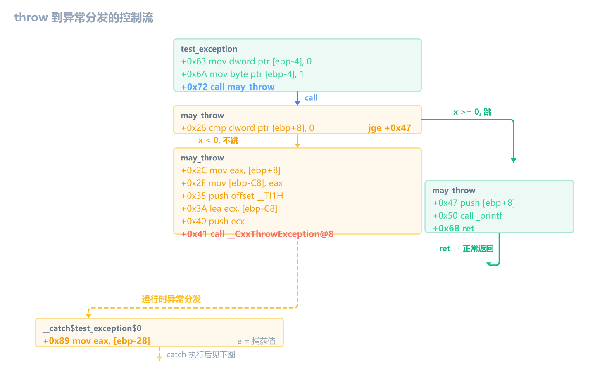
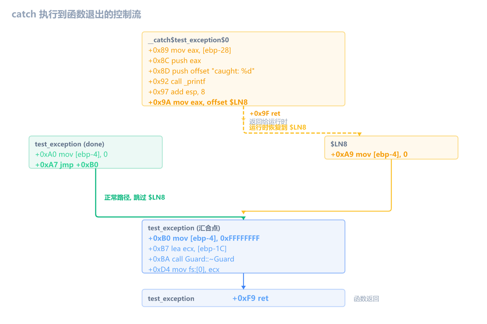
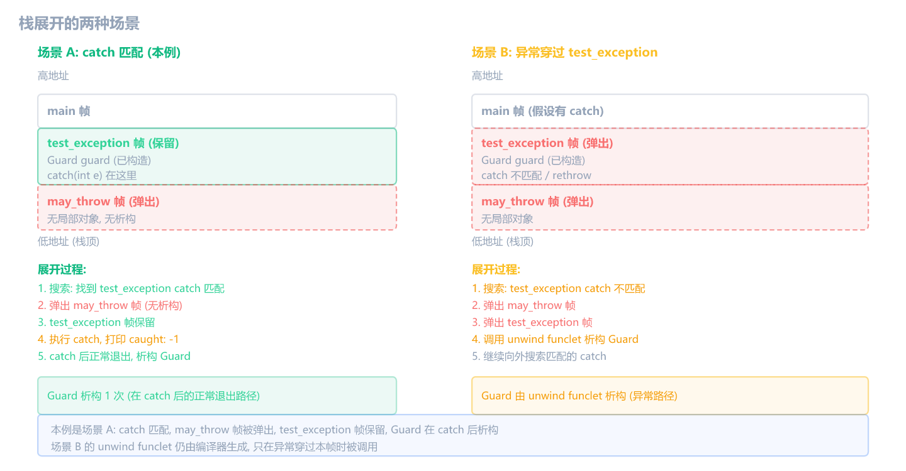
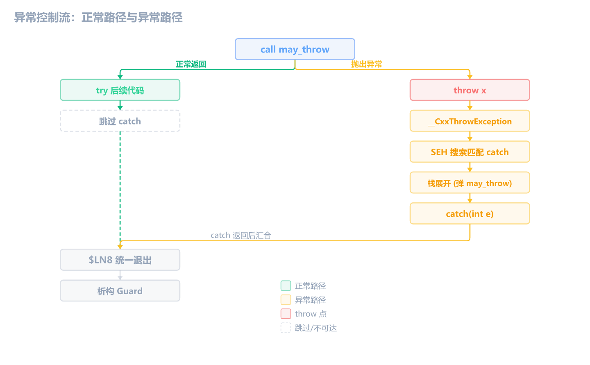

上一章末尾提到，`push_back` 附近有 `[ebp-4]` 状态变量，是编译器为异常时正确析构对象生成的辅助代码。这一章把异常处理讲清楚：`try/catch/throw` 在汇编里是什么样。

> [!IMPORTANT] 本章的范围
> 下面的结构和偏移基于 **MSVC 14.51、Debug x86、`/Od`、`/EHsc`** 验证。所有汇编来自同一份编译结果，偏移是本次构建的值，不是固定 ABI。Release 模式下 SEH 注册被简化，x64 使用表驱动异常（没有 `fs:0` 链），结构和本章不同。x64 和 Release 的边界在本章末尾单独讲。

## 最小例子：throw 和 catch 在汇编里长什么样

先看一个最小的 try/catch：

```cpp
void f() {
    try {
        throw 1;          // 抛一个 int
    } catch (int e) {     // 捕获 int
        printf("%d\n", e);
    }
}
```

编译后的汇编（过滤掉 Debug 噪音后）：

```asm
f:
    push ebp
    mov  ebp, esp
    push 0xFFFFFFFF                ; ① 状态值 = -1（还没进 try）
    push offset __ehhandler$f      ; ② handler 地址
    mov  eax, dword ptr fs:[0]     ; ③ 取上一个 SEH 帧
    push eax                        ; 保存到栈上
    push ecx                        ; 预留 4 字节
    sub  esp, 0xD8                 ; 本地变量区
    ...
    lea  eax, [ebp-0C]             ; 当前异常帧地址
    mov  dword ptr fs:[0], eax     ; ④ 注册到 SEH 链表头部

    ; try {
    mov  dword ptr [ebp-4], 0      ; ⑤ 状态值 = 0（进 try 了）

    ; throw 1;
    mov  dword ptr [ebp-0E4], 1    ; 要抛的值 1 放到临时变量
    push offset __TI1H             ; 类型信息（标识这是 int）
    lea  eax, [ebp-0E4]            ; 临时变量地址
    push eax
    call __CxxThrowException@8     ; ⑥ 抛异常（不会返回）

    ; catch (int e):
    mov  eax, [ebp-18]             ; ⑦ e = 捕获的异常值
    push eax
    push offset "%d\n"
    call _printf
    add  esp, 8
    mov  eax, offset $LN7          ; ⑧ 返回地址给运行时
    ret

    ; 函数结尾：注销 SEH 帧
    mov  ecx, [ebp-0C]             ; ⑨ 取保存的上一个帧
    mov  fs:[0], ecx               ; 恢复 fs:[0]
    ...
    ret
```

这段汇编看起来很长，但实际只有四件事：

### 第一件：函数开头注册 SEH 帧（①②③④）

普通函数开头是 `push ebp; mov ebp, esp`，这个函数多了四行 `push` 和两行 `fs:[0]` 操作。为什么？因为运行时需要知道"这个函数有异常处理，throw 发生时回来找我"。

`fs:[0]` 是线程信息块（TIB）里的 SEH 链表头指针。每个含异常处理的函数进来时把自己的异常帧挂到链表头部，返回时取下来。异常发生时运行时从 `fs:[0]` 开始沿链表找匹配的处理函数。

```asm
mov  eax, dword ptr fs:[0]     ; 取上一个函数的帧地址
push eax                        ; 存到栈上（[ebp-0C]）
...
lea  eax, [ebp-0C]             ; 当前函数的异常帧地址
mov  dword ptr fs:[0], eax     ; 把链表头改成当前帧
```

函数返回前要恢复 `fs:[0]`，把自己从链表里摘下来：

```asm
mov  ecx, [ebp-0C]             ; 取回保存的上一个帧地址
mov  fs:[0], ecx               ; 恢复
```

### 第二件：状态变量记录"在 try 的哪一步"（①⑤）

`[ebp-4]` 是异常状态变量。函数开头设成 -1（①），进 try 时设成 0（⑤）。异常发生时运行时读这个值，知道当前执行到 try 的哪个位置。

本例很简单，try 里只有一行 `throw 1`，所以状态值只有两种：-1（没进 try）和 0（在 try 里）。

### 第三件：throw 变成运行时函数调用（⑥）

`throw 1` 不是一条汇编指令，而是调用 `__CxxThrowException@8`。`@8` 是 stdcall 调用约定的名字修饰，表示参数占 8 字节（两个指针）：

- 第一个参数：临时变量 `[ebp-0E4]` 的地址（被抛的值 1 放在这里）
- 第二个参数：`__TI1H`，类型信息结构（告诉运行时这是 `int`，用来匹配 `catch(int)`）

`call __CxxThrowException@8` 不会正常返回，控制权直接转到运行时异常分发。

### 第四件：catch 是独立代码块（⑦⑧）

catch 块**不在 try 的正常执行路径里**。从 `call __CxxThrowException@8` 到 catch 入口之间没有任何 `jmp` 或 `call` 指令——控制权由异常运行时分发，不是普通跳转。

catch 末尾的 `mov eax, offset $LN7; ret` 也不是普通函数返回。`ret` 把控制权交回运行时，运行时恢复到 `$LN7` 继续执行。

### 最小例子的小结

| 特征           | 在汇编里是什么                                |
| -------------- | --------------------------------------------- |
| 函数有异常处理 | 开头读写 `fs:[0]`，结尾恢复                   |
| try 块         | `[ebp-4]` 状态值从 -1 变成 0                  |
| throw          | `call __CxxThrowException@8`                  |
| catch          | 独立代码块，读捕获值后 `mov eax, offset; ret` |

这就是异常处理的基本骨架。但这个最小例子缺了一个关键东西——如果 try 里有局部对象（比如 `std::string`、`Player`），异常发生时这些对象必须被析构。这就是**栈展开**，下面用完整例子讲。

## 完整例子：带析构对象的异常

```cpp
#include <stdio.h>

class Guard {
public:
    const char* name;
    Guard(const char* n) : name(n) {
        printf("Guard(%s)\n", n);
    }
    ~Guard() {
        printf("~Guard(%s)\n", name);
    }
};

void may_throw(int x) {
    if (x < 0) throw x;
    printf("ok: %d\n", x);
}

void test_exception(int value) {
    Guard guard("test");

    try {
        may_throw(value);
        printf("after call\n");
    } catch (int e) {
        printf("caught: %d\n", e);
    }
}

int main() {
    test_exception(1);    // 正常路径
    test_exception(-1);   // 异常路径
    return 0;
}
```

运行结果：

```text
Guard(test)
ok: 1
after call
~Guard(test)
Guard(test)
caught: -1
~Guard(test)
```

`test_exception(1)` 正常走完：构造 Guard → 调用 `may_throw` → 打印 `after call` → 析构 Guard。

`test_exception(-1)` 走异常路径：构造 Guard → `may_throw` 抛异常 → 栈展开弹出 `may_throw` 帧（无局部对象）→ catch 匹配 → 打印 `caught: -1` → catch 返回后到汇合点 → 析构 Guard。注意 `after call` 没打印，因为 `may_throw(-1)` 没正常返回。

和最小例子比，完整例子多了两个新问题：

1. Guard 是局部对象，异常发生时怎么保证它被析构？
2. `may_throw` 是另一个函数，异常从 `may_throw` 里抛出来，怎么跳回 `test_exception` 的 catch？

## 函数入口：注册 SEH 帧

完整例子的 SEH 帧注册和最小例子一样，只是栈帧更大（因为多了 Guard 对象）：

```asm
test_exception:
    push ebp
    mov  ebp, esp
    push 0xFFFFFFFF                ; 状态值 = -1
    push offset __ehhandler$test_exception
    mov  eax, dword ptr fs:[0]     ; 取上一个 SEH 帧
    push eax                        ; 保存
    push ecx                        ; 预留 4 字节（保存 ESP 用）
    sub  esp, 0xDC                 ; 本地变量区
    ...
    mov  eax, dword ptr [___security_cookie]
    xor  eax, ebp                  ; cookie 异或 ebp
    mov  [ebp-14], eax             ; 保存 cookie
    push eax
    lea  eax, [ebp-0C]             ; 当前异常帧地址
    mov  dword ptr fs:[0], eax     ; 注册到 SEH 链表头部
    mov  [ebp-10], esp             ; 保存 ESP（异常展开时恢复用）
```

`fs:[0]` 指向的 SEH 注册记录本身只有两个字段——上一个帧指针和 handler 地址。状态值（`[ebp-4]`）和保存的 ESP（`[ebp-10]`）是 MSVC 在周围增加的编译器扩展字段，不属于 Windows SEH 注册记录。

下面这张图展示了 SEH 链的结构和异常帧在栈上的布局：

![SEH 链与异常帧布局：fs:[0] 指向当前函数异常帧，帧内含上一个 SEH 帧指针、handler 地址，周围有编译器扩展的状态值和保存的 ESP](c-asm-18-images/seh-chain-and-frame.png)

## try 状态变量：多了一个值

完整例子和最小例子的状态变量用法一样，只是 try 里多了 `may_throw` 调用，所以多了一个状态值：

```asm
    ; Guard guard("test")
    lea  ecx, [ebp-1C]              ; this = &guard
    call Guard::Guard               ; 构造

    mov  dword ptr [ebp-4], 0       ; 进入 try，状态 = 0
    mov  byte ptr [ebp-4], 1        ; 即将调用 may_throw，状态 = 1
    mov  eax, [ebp+8]               ; value
    push eax
    call may_throw                  ; may_throw(value)
```

状态值从 -1 变 0 变 1——编译器为 try 块内每个可能抛异常的位置分配不同的值，异常发生时运行时读这个值，知道异常发生在哪一步。

| 时刻              | `[ebp-4]` 值 | 含义                     |
| ----------------- | ------------ | ------------------------ |
| 函数开头          | `0xFFFFFFFF` | 还没进 try               |
| 进入 try          | `0`          | 在 try 第一行之前        |
| 调用 may_throw 前 | `1`          | 即将进入可能抛异常的调用 |
| try 正常结束      | `0`          | try 走完                 |
| 离开 try          | `0xFFFFFFFF` | 离开 try                 |

> [!IMPORTANT] 状态值是编译器内部编号，不要死背数字
> 状态值是编译器用来索引异常元数据的内部编号，具体数字随函数结构、对象数量、编译器版本变化。逆向时看它**何时变化**，不死背"0 = 在 try"。
>
> 但有一条规律在本例中成立：try/catch 的状态变量会从 -1 出发，经过若干非负值，最后回到 -1。如果状态值从头到尾都是 -1（或只在对象构造点变化），说明这个函数没有 try/catch，只有析构对象需要栈展开。

## throw：从 may_throw 内部抛出

`throw x` 的汇编和最小例子一样——准备临时变量，调用 `__CxxThrowException@8`：

```asm
may_throw:
    cmp  dword ptr [ebp+8], 0      ; x < 0?
    jge  ok                         ; x >= 0 跳到 ok
    mov  eax, [ebp+8]              ; eax = x
    mov  [ebp-C8], eax             ; 复制到临时变量
    push offset __TI1H             ; 类型信息（标识这是 int）
    lea  ecx, [ebp-C8]             ; 临时变量地址
    push ecx
    call __CxxThrowException@8     ; 抛异常（不会返回）
ok:
    push dword ptr [ebp+8]
    push offset "ok: %d\n"
    call _printf
```

`__CxxThrowException@8` 的两个参数：

1. **临时变量地址**（`[ebp-C8]`）：编译器把要抛的值复制到栈上的临时变量，再把它的地址传给运行时。最终异常对象如何保存和管理属于运行时实现，不从这几条指令过度推断。
2. **`_ThrowInfo` 指针**（`__TI1H`）：编译器为 `int` 类型生成的类型信息结构，让运行时能匹配 `catch(int)`。

## catch：独立代码块和路径汇合

catch 块和最小例子一样是独立代码段，由运行时分发跳过来。下面把正常路径末尾和 catch 放一起看：

```asm
; 正常路径末尾
    jmp  done                        ; +0x87: 正常走完 try，跳过 catch
__catch$test_exception$0:            ; +0x89: catch 块入口（异常分发跳到这里）
    mov  eax, [ebp-28]               ; e = 捕获的异常值
    push eax
    push offset "caught: %d\n"
    call _printf
    add  esp, 8
    mov  eax, offset $LN8            ; continuation 地址
    ret                              ; 返回给异常运行时，由运行时恢复到 $LN8
done:                                ; +0xA0: 正常路径
    mov  dword ptr [ebp-4], 0        ; 状态 = 0
    jmp  +0xB0                        ; +0xA7: 直接跳到汇合点
$LN8:                                ; +0xA9: catch 返回后到这里
    mov  dword ptr [ebp-4], 0        ; 状态 = 0
    mov  dword ptr [ebp-4], 0xFFFFFFFF  ; +0xB0: 状态 = -1，离开 try（汇合点）
    lea  ecx, [ebp-1C]               ; &guard
    call Guard::~Guard               ; 析构
```

正常路径和异常路径最终汇合在 `+0xB0`：正常路径从 `done` 经 `jmp +0xB0` 直接到达，异常路径从 catch `ret` 后由运行时恢复到 `$LN8(+0xA9)` 再到 `+0xB0`。注意正常路径跳过了 `$LN8`。之后统一析构 Guard、注销 SEH 帧、返回。

把前面的 throw 和 catch 串起来，完整的汇编控制流分两段看。

第一段：`call may_throw` 进入 `may_throw`，`jge` 分叉——`x >= 0` 走正常返回，`x < 0` 准备异常对象并调用 `__CxxThrowException`，由运行时分发到 `__catch$`：



第二段：catch 执行完后，正常路径和异常路径汇合到 `+0xB0`：



两张图里的黄色虚线边都不是普通跳转——从 `__CxxThrowException` 到 `__catch$` 是异常运行时分发，从 catch 的 `ret` 到 `$LN8` 也是运行时恢复。没有 `jmp` 或 `call` 指令直接连接它们。

## 栈展开：析构已构造对象

先说清楚 try/catch 和析构函数的关系——这正是栈展开要解决的问题：

- **有 try/catch + 有析构对象**：异常发生时先搜索匹配的 catch，找到后栈展开弹出中间帧（调析构函数），最后执行 catch。本例 `test_exception` 就是这种。
- **没有 try/catch，但有析构对象**：函数仍会注册 SEH 帧。如果异常穿过这个函数（下游抛异常、本函数没有 catch 匹配），运行时调 unwind funclet 析构局部对象，然后继续向外搜索。上一章 `push_back` 附近的状态变量就是这种。
- **析构函数里抛异常**：如果栈展开过程中析构函数又抛了新异常，运行时直接调 `std::terminate` 终止程序。所以析构函数不应该抛异常。

核心关系是：**栈展开就是调用析构函数的过程**。try/catch 决定异常在哪里被捕获，析构函数决定异常穿过时哪些对象要被清理。两者共用同一套 SEH 机制（`fs:[0]` + 状态变量 + `__ehfuncinfo$`）。

回到完整例子。`test_exception(-1)` 走异常路径时，运行时的处理顺序是：

1. **搜索阶段**：沿 SEH 链从 `may_throw` 帧往回找，`test_exception` 的 catch 能匹配 `int`。
2. **展开阶段**：从 `may_throw` 帧向 `test_exception` 帧回退。`may_throw` 帧被弹出，但它没有局部对象。`test_exception` 帧不弹出——catch 在这里。
3. **执行 catch**：跳到 catch 代码块，打印 `caught: -1`。catch 返回后由运行时恢复到 `$LN8`，在正常退出路径上析构 Guard。

所以本例中 Guard 只析构一次，在 catch 之后的正常退出路径。栈展开只弹了 `may_throw` 的帧——`test_exception` 的 unwind funclet 没被调用。

但编译器仍然为 `test_exception` 生成了 unwind funclet——既然没被调用，为什么要生成？因为编译器不知道运行时 catch 会不会匹配，它必须为所有可能的情况生成清理代码。如果异常**穿过** `test_exception`（catch 不匹配，或 catch 内 rethrow），运行时要继续向外层搜索，这时 `test_exception` 帧也要被弹出，unwind funclet 被调用来析构 Guard：

```asm
__unwindfunclet$test_exception$2:
    lea  ecx, [ebp-1C]              ; &guard
    jmp  Guard::~Guard              ; 析构 Guard
```

这个 funclet 不在正常执行路径里，只在异常展开穿过本帧时被运行时调用。

下面这张图展示了栈展开的两种场景：



如果调用链更深，每一层有析构对象的帧都会被逐帧展开并调用对应的 unwind funclet。

> [!NOTE] 栈展开和 try/catch 是同一套机制
> `[ebp-4]` 状态变量在两种场景都出现：try/catch 记录"在 try 的哪一步"，栈展开记录"哪些对象已构造"。底层都是 SEH 链 + 状态变量 + 异常元数据表。上一章 `push_back` 附近的状态变量值是 1、2，说明它是栈展开而非 try/catch——有析构对象的函数即使没有 try/catch，也会注册 SEH 帧。

> [!NOTE] 没有匹配的 catch 会怎样
> 如果异常沿调用链一直搜索不到匹配的 catch，运行时调用 `std::terminate` 终止程序。所以即使函数没有 `try/catch`，只要调用链下游可能抛异常，函数也需要注册 SEH 帧来正确析构局部对象。

## 异常控制流总览

现在把前面讲的所有片段串成一张图：



正常路径（绿色）：调用 `may_throw` → 正常返回 → 执行 try 后续代码 → 跳过 catch。

异常路径（黄色）：`may_throw` 内部 `throw` → 运行时分发 → 栈展开 → 跳到 catch 执行 → catch 返回后汇合到 try 后续代码。

## 缺少符号信息时的逆向流程

有符号时，`__ehhandler$`、`__catch$`、`__unwindfunclet$` 这些标签名直接暴露了异常处理结构。无符号时看不到这些名字，但汇编特征仍在。

逆向时遇到一个函数，按以下步骤判断它有没有异常处理：

1. **找 `__CxxThrowException` 的调用或导入引用**。找到就定位了 throw 点，附近的函数一定参与 C++ 异常。
2. **检查函数序言是否读写 `fs:[0]`**。函数开头读 `fs:[0]`（取上一个帧）并写 `fs:[0]`（注册当前帧），函数结尾读回来恢复，这个模式说明函数注册了 x86 SEH 帧。
3. **区分正常代码块、catch funclet 和 unwind funclet**。无符号时这些是函数内不连续的代码段：catch funclet 读取捕获对象后返回某个地址；unwind funclet 调用析构函数后返回。
4. **跟踪异常状态变量在哪里变化**。找到状态变量（通常是 `[ebp-4]`），看它在函数开头是不是 -1，在哪些点变化，对应了哪些 catch 或 unwind 区域。
5. **根据 throw 前两个参数判断异常对象和类型**。第一个参数指向被抛出的对象，第二个参数是 `_ThrowInfo` 类型信息。
6. **根据 catch 怎样读取对象，推测 `catch(T)` 的类型**。catch funclet 从某个偏移读取捕获值，这个偏移是编译器为 `catch(T)` 生成的局部变量位置。
7. **把异常边补回控制流图**。throw 后的代码不按普通可达路径理解，catch 和 unwind funclet 是异常路径的组成部分。用 x32dbg 在 `__CxxThrowException`、析构函数和 catch 入口下断点动态验证。

下面这张特征表帮助快速识别：

| 看到的特征                                | 可以得出的结论                           |
| ----------------------------------------- | ---------------------------------------- |
| `call __CxxThrowException@8`              | 明确的 C++ throw 点                      |
| 函数序言读写 `fs:[0]`                     | 函数注册了 x86 SEH 帧                    |
| 独立代码块读取捕获对象后返回目标地址      | 可能是 catch funclet                     |
| 独立代码块调用析构函数后返回              | 可能是 unwind funclet                    |
| 只有 `fs:[0]`，没有 `__CxxThrowException` | 不能直接断定有 try/catch，可能只是栈展开 |
| `[ebp-4]` 从 -1 出发经非负值回 -1         | 可能含 try/catch                         |
| `[ebp-4]` 不出现 -1→0→-1 的模式           | 可能只是栈展开，没有 try/catch           |

> [!IMPORTANT] C++ 异常、Windows SEH、`fs:[0]` 三者的关系
> C++ 的 `try/catch/throw` 是语言特性，Windows 的 `__try/__except` 是操作系统级异常。MSVC 用 Windows 的 SEH 分发基础设施来实现 C++ 异常，但两者不是同一个东西。`fs:[0]` 的读写是 x86 SEH 的硬特征，无符号时也能认出来。但有 `fs:[0]` 操作不一定意味着 C++ `try/catch`——MSVC Debug 模式下，任何有析构对象的函数都会注册 SEH 帧用于栈展开。区分方法是看状态变量变化和有没有 `__CxxThrowException` 调用。

## x64、Release 和编译选项边界

> [!NOTE] x64 的表驱动异常
> x64 不使用 x86 的 `fs:[0]` 链式注册。PE 文件的 `.pdata` 节存 `RUNTIME_FUNCTION` 记录每个函数的地址范围，`.xdata` 节存 unwind info 和异常处理相关数据。运行时通过查表找到处理函数。逆向 x64 程序时，`fs:[0]` 的读写不会出现，改用 IDA 或 dumpbin 查看 `.pdata` 和 `.xdata` 节。

> [!NOTE] Release 模式下的异常处理
> Release 模式下 SEH 帧注册的代码被简化，catch 块的位置可能不在原函数附近（靠异常表查找）。但核心机制不变：`__CxxThrowException` 抛异常，SEH 分发，查 catch 表，栈展开析构。很多游戏和 CrackMe 用 `/EH-` 或 `/EHa` 改变异常处理行为，或用错误码代替异常，这时你看不到这些 SEH 结构。

> [!IMPORTANT] `/EH` 选项的含义
> 本章用 `/EHsc`（默认值）编译。`/EHs` 表示 C++ 异常处理不捕获 SEH 异常；`/EHsc` 在 `/EHs` 基础上额外假设 `extern "C"` 函数不抛 C++ 异常（`c` = no C++ exceptions from C functions）。`/EHa` 允许 `catch(...)` 捕获 SEH 异常（包括除零、访问违例等）。`/EH-` 才是不生成异常处理代码。不要看到 `/EHs` 就以为异常处理被关了。

## `__ehhandler` 与异常分发

有符号时，`__ehhandler$` 和 `__ehfuncinfo$` 成对出现，就是异常处理的分发机制。`__ehhandler$` 是入口包装，做安全 cookie 校验后把 `__ehfuncinfo$` 表地址传给 `___CxxFrameHandler3`：

```asm
__ehhandler$test_exception:
    nop
    nop
    mov  edx, [esp+8]              ; 异常上下文指针
    lea  eax, [edx+0C]             ; 异常帧地址
    mov  ecx, [edx-0F0]            ; 从异常上下文取 security cookie
    xor  ecx, eax
    call @__security_check_cookie@4
    mov  ecx, [edx-8]              ; 第二个 cookie 校验
    xor  ecx, eax
    call @__security_check_cookie@4
    mov  eax, offset __ehfuncinfo$test_exception
    jmp  ___CxxFrameHandler3
```

`edx` 指向异常上下文，`[edx-0F0]` 和 `[edx-8]` 是 MSVC 内部布局里的 cookie 位置，逆向时不需要深究这些偏移，只要认出"cookie 校验后跳到 `___CxxFrameHandler3`"这个模式。

逆向时不需要展开 `__ehfuncinfo$` 的内部结构，只需要知道它记录了"哪些状态值对应哪个 catch 块、每个 catch 捕获什么类型、展开时调用哪些析构代码"。`___CxxFrameHandler3` 拿到这张表后负责搜索匹配的 catch、协调栈展开、把控制权交给 catch funclet。

无符号时看不到这些标签，但 `fs:[0]` 注册记录里的 handler 指针指向的代码块就是这个入口——它的特征是做 cookie 校验后跳到 `___CxxFrameHandler3`。

> [!NOTE] 本篇总结
> C 与汇编篇（c-asm-1 到 c-asm-18）到此结束。你已经学完从变量赋值到 this 指针、从虚函数表到 STL 布局、从编译器优化到异常处理的完整 C/C++ 汇编映射。接下来进入**破解篇**（IDA 静态分析 + x64dbg 动态调试）和**游戏篇**（Cheat Engine + 外部修改器 + DLL 注入），把这些汇编阅读能力用到实战中。

## 练习

1. 下面是某个函数开头的汇编，这个函数有什么特殊结构？

   ```asm
   push ebp
   mov  ebp, esp
   push 0xFFFFFFFF
   push offset __ehhandler$?do_something@@YAXH@Z
   mov  eax, fs:[0]
   push eax
   lea  eax, [ebp-0C]
   mov  fs:[0], eax
   ```

   > [!NOTE]- 参考答案
   > 这个函数注册了 **x86 SEH 帧**。标志：
   >
   > - `push 0xFFFFFFFF`：异常状态标记（-1 = 还没进 try）
   > - `push offset __ehhandler$...`：注册异常处理函数
   > - `mov eax, fs:[0]; push eax`：保存上一个 SEH 帧
   > - `lea eax, [ebp-0C]; mov fs:[0], eax`：把当前异常帧注册到 SEH 链表头部
   >
   > 但单凭 `fs:[0]` 操作不能确定源码里有 `try/catch`——有析构对象的函数也会注册 SEH 帧。需要看函数体内有没有状态变量从 -1 经非负值回 -1 的变化，以及有没有 `__CxxThrowException` 调用。

2. 下面这段汇编对应什么 C++ 操作？

   ```asm
   mov  eax, [ebp+8]
   mov  [ebp-C8], eax
   push offset __TI1H
   lea  ecx, [ebp-C8]
   push ecx
   call __CxxThrowException@8
   ```

   > [!NOTE]- 参考答案
   > 对应 **`throw` 抛出异常**。标志：
   >
   > - 先把要抛的值（`[ebp+8]`）复制到栈上的临时变量 `[ebp-C8]`
   > - `push offset __TI1H`：压入 `_ThrowInfo` 类型信息（标识这是 int 类型）
   > - `lea ecx, [ebp-C8]`：取临时变量地址
   > - `call __CxxThrowException@8`：抛异常，不会返回

3. 下面两个代码块都是某个含异常处理的函数里的独立代码段。哪个是 catch funclet，哪个是 unwind funclet？

   ```asm
   ; 代码块 A
   __catch$?foo@@YAXH@Z$0:
       mov  eax, [ebp-28]
       push eax
       push offset "caught: %d\n"
       call _printf
       mov  eax, offset $LN5
       ret

   ; 代码块 B
   __unwindfunclet$?foo@@YAXH@Z$2:
       lea  ecx, [ebp-1C]
       jmp  ??1Guard@@QAE@XZ
   ```

   > [!NOTE]- 参考答案
   > **代码块 A 是 catch funclet**，**代码块 B 是 unwind funclet**。
   >
   > - A 的入口标签是 `__catch$` 前缀，读取 `[ebp-28]`（捕获的异常值），打印后 `mov eax, offset $LN5; ret` 返回到 try 后续代码——这是 catch 块的特征。
   > - B 的入口标签是 `__unwindfunclet$` 前缀，把 `[ebp-1C]`（Guard 对象地址）放进 `ecx`（this 指针），跳到 `~Guard`——这是栈展开时析构局部对象的代码。

4. 某函数有 SEH 帧注册，`[ebp-4]` 的值在函数开头是 `-1`，进入某段代码后变成 `0`，调用一个函数前变成 `1`，离开时变成 `0` 再变回 `-1`。函数体里还能找到 `__CxxThrowException` 的调用和 `__catch$` 代码块。这个函数最可能包含什么结构？状态值 1 在这里说明什么？

   > [!NOTE]- 参考答案
   > 最可能含 **try/catch**，且 try 块内有需要析构的局部对象。状态值从 -1 出发经 0 和 1 再回 -1，加上 `__CxxThrowException` 和 `__catch$`，是 try/catch 的完整标志。
   >
   > 状态值 1 表示"执行到了 try 块内某个特定位置"——在本例中是即将调用一个可能抛异常的函数。编译器为 try 块内每个可能抛异常的位置分配不同的状态值，异常发生时运行时读这个值，知道异常发生在哪一步，决定做哪段栈展开。
   >
   > 如果 `[ebp-4]` 从头到尾都是 -1（或只在对象构造点变化但不出现 -1 → 0 → ... → -1 的模式），说明这个函数没有 try/catch，只有析构对象需要栈展开。
