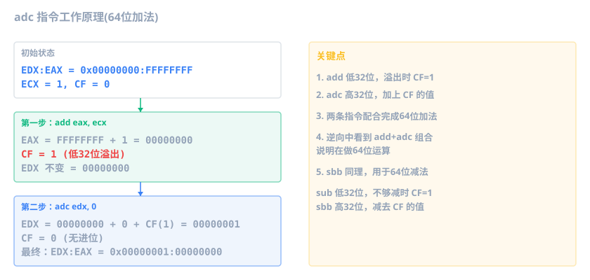

上一章建立了"C 变量 ↔ 汇编"的直觉。这一章更进一步：**运算**。C 里写 `a + b`、`x * 3`、`flags &= ~READ_ONLY`，编译器会翻译成什么？为什么逆向时到处看到 `xor`、`shl`、`lea`？

和上一章一样，编译 Debug x86，用 x64dbg 断到 `main` 对照。Debug 模式关闭优化（`/Od`），编译器不会做常量折叠，所以即使写 `a + 100`，你也能看到 `add` 指令，而不是直接算成常量。

## 加减法

最简单的运算：

```c
#include <stdio.h>

int calc(int a) {
    int b = a + 100;
    int c = b - 50;
    return c;
}

int main() {
    printf("%d\n", calc(10));
    return 0;
}
```

过滤掉 Debug 噪音（`rep stosd`、`__RTC_CheckEsp` 等，上一章讲过），`calc` 函数的核心汇编如下：

```asm
mov  eax, dword ptr [ebp+8]       ; eax = a (参数)
add  eax, 0x64                    ; eax = a + 100
mov  dword ptr [ebp-8], eax       ; 存到 b
mov  eax, dword ptr [ebp-8]       ; 重新读 b（Debug 不优化）
sub  eax, 0x32                    ; eax = b - 50
mov  dword ptr [ebp-0x14], eax    ; 存到 c
```

注意第 4、5 行：Debug 模式把 `b` 存到 `[ebp-8]` 后，紧接着又从 `[ebp-8]` 读回来做减法。看起来多此一举，但 Debug 模式（`/Od`）不做任何优化，每行 C 语句独立翻译，该存就存、该读就读。Release 模式会合并成 `add eax, 0x64` + `sub eax, 0x32` 两行，去掉中间的存取。

加减法的规律很直接：

| C 代码      | 汇编指令                                     |
| ----------- | -------------------------------------------- |
| `c = a + b` | `mov eax, a` -> `add eax, b` -> `mov c, eax` |
| `d = c - 5` | `mov eax, c` -> `sub eax, 5` -> `mov d, eax` |
| `a += 5`    | `add dword ptr [ebp-4], 5`                   |
| `b -= 3`    | `sub dword ptr [ebp-8], 3`                   |

加减法会设置 CPU 标志位，其中最常用的两个是 **CF (进位标志)** 和 **OF (溢出标志)**。无符号运算超出 32 位范围时 CF=1，有符号运算结果超出 `int` 表示范围时 OF=1。CF 是下一节 64 位运算的关键。

### 64 位加减法：add + adc

`long long` 是 8 字节，但 32 位寄存器一次只处理 4 字节。编译器怎么算 64 位加减？答案是拆成两条指令，用进位标志传递信息。

最常见的场景是 32 位 `int` 加到 64 位 `long long` 上：

```c
long long ll = 0xFFFFFFFF11111111LL;
ll = ll + a;    // a 是 int 参数
```

对应的汇编：

```asm
; 先把 0xFFFFFFFF11111111 放到局部变量
or   eax, 0xFFFFFFFF                  ; eax = 0xFFFFFFFF
mov  dword ptr [ebp-0x24], 0x11111111 ; 低 4 字节
mov  dword ptr [ebp-0x20], eax        ; 高 4 字节

; 64 位加法: ll + a
mov  eax, dword ptr [ebp+8]           ; eax = a (32 位 int)
cdq                                    ; 符号扩展: EDX:EAX = a (64 位)
add  eax, dword ptr [ebp-0x24]        ; 低 4 字节相加，CF 记录进位
adc  edx, dword ptr [ebp-0x20]        ; 高 4 字节相加 + CF
mov  dword ptr [ebp-0x24], eax        ; 写回低 4 字节
mov  dword ptr [ebp-0x20], edx        ; 写回高 4 字节
```

这段代码分三步：

1. `cdq` 把 32 位 `a` 符号扩展到 EDX:EAX。如果 `a` 是正数，EDX=0；负数则 EDX=`0xFFFFFFFF`。
2. `add` 算低 4 字节，可能产生进位（CF=1）。
3. `adc` (Add with Carry) 算高 4 字节时，把 CF 的值也加上去。

低 4 字节 `0x11111111 + a`，如果 `a=1`，结果是 `0x11111112`，没进位，CF=0，高 4 字节不变。

> [!NOTE] 什么时候会进位
> 如果低 4 字节是 `0xFFFFFFFF`，加 1 后超出 32 位范围，低 4 字节回绕到 `0`，CF=1。这时 `adc` 把高 4 字节额外加 1，正确地完成了 64 位进位。

这个模式在 32 位程序里到处都是：**看到 `add` 紧跟 `adc`，说明在做 64 位运算**。



减法同理，对应的是 `sub` + `sbb` (Subtract with Borrow)。低 4 字节用 `sub`，如果不够减产生借位，CF=1；高 4 字节用 `sbb`，额外减掉 CF。识别方式完全对称：**`sub` + `sbb` = 64 位减法**。


## 乘除法

乘除法比加减复杂，因为 x86 有专门的乘除指令，编译器还会做各种优化。

### 乘法：编译器怎么选指令

C 里的 `a * N`，Debug 模式下编译器不优化，无论 N 是多少都用 `imul`。但逆向分析的目标几乎都是 Release 编译的，编译器会根据 N 的大小选择不同的指令：

**N 无法拆成少量 lea/shl 组合（如 37）→ `imul`**

```c
int calc(int a) {
    int b = a * 37;
    return b;
}
```

```asm
mov  eax, dword ptr [ebp+8]       ; eax = a
imul eax, eax, 0x25               ; eax = a * 37
```

`0x25` 就是十进制 37。`imul` 有三种形式，逆向中最常见的是三操作数 `imul dest, src, imm`。

为什么 37 用 `imul` 而不是 `lea`+`shl` 组合？因为 37 是质数，拆成 2 的幂次组合需要 `(a*32) + (a*4) + a`——多条 `shl` + `add` 才能搞定，编译器权衡后一条 `imul` 更划算。但 `a * 64` 虽然数字更大，编译器会用 `shl eax, 6` 一条搞定。

**N 能拆成 lea/shl 组合（如 3、5、9）→ `lea`**

```c
int b = a * 3;
```

```asm
mov  eax, dword ptr [ebp+8]       ; eax = a
lea  eax, dword ptr [eax+eax*2]   ; eax = eax + eax*2 = eax*3
```

`lea` 设计初衷是算内存地址，但编译器拿它做乘法——地址计算格式 `[base + index*scale + displacement]` 刚好能表达 `base + index*scale`，一条指令搞定小乘数，比 `imul` 更短更快。

**N 是 2 的幂（如 2、4、8）→ `shl`**

```c
int b = a * 8;
```

```asm
mov  eax, dword ptr [ebp+8]       ; eax = a
shl  eax, 3                       ; 左移 3 位 = 乘以 8
```

| C 代码   | 编译器选用 | 汇编                   |
| -------- | ---------- | ---------------------- |
| `a * 37` | `imul`     | `imul eax, eax, 37`    |
| `a * 3`  | `lea`      | `lea eax, [eax+eax*2]` |
| `a * 5`  | `lea`      | `lea eax, [eax+eax*4]` |
| `a * 8`  | `shl`      | `shl eax, 3`           |

更复杂的乘法会组合使用：

```c
int b = a * 5 + 10;
```

```asm
mov  eax, dword ptr [ebp+8]       ; eax = a
lea  eax, dword ptr [eax+eax*4]   ; eax = a * 5
add  eax, 0xA                     ; eax = a * 5 + 10
```

```c
int b = a * 12;
```

```asm
mov  eax, dword ptr [ebp+8]       ; eax = a
lea  eax, dword ptr [eax+eax*2]   ; eax = a * 3
shl  eax, 2                       ; eax = a * 3 * 4 = a * 12
```

> [!NOTE] 无符号乘法
> `imul` 是**有符号**乘法。C 的 `unsigned int` 乘法理论上应该用 `mul` 指令，但实际上编译器几乎总是用 `imul`，因为结果在低位时两者完全一样。只有单操作数 `mul`/`imul` 产生 64 位结果（高位在 EDX）时才有区别。
>
> 64 位程序中，乘法指令不变（`imul rax, rbx`），只是寄存器从 32 位换成 64 位。

> [!NOTE] 32 位程序的 64 位乘法
> `long long` 乘法在 32 位模式下没有对应指令。编译器会静态链接一段 helper 代码 `__allmul` 到 EXE 里（不是外部 DLL，而是编译器自动嵌入的），看汇编就能认出来：
>
> ```asm
> ; ll = ll * a;  (ll 是 long long，a 是 int)
> mov  eax, dword ptr [ebp+8]     ; eax = a
> cdq                              ; 符号扩展 a 到 EDX:EAX
> push edx                         ; push a 高 32 位
> push eax                         ; push a 低 32 位
> push dword ptr [ebp-8]           ; push ll 高 32 位
> push dword ptr [ebp-0xC]         ; push ll 低 32 位
> call __allmul                    ; 结果在 EDX:EAX
> mov  dword ptr [ebp-0xC], eax    ; 写回 ll 低 32 位
> mov  dword ptr [ebp-8], edx      ; 写回 ll 高 32 位
> ```
>
> `__allmul` 内部用多条 `mul` 指令实现 64 位乘法。Debug 版有符号能看到 `call __allmul`，Release 或脱壳后可能只剩 `call 0x005D1FE0`，这时需要跟进去看——函数体很短，特征明显：多条 `mul` + `add` 累加 + `ret 0x10`（清理 16 字节参数 = 两个 64 位操作数）。类似的还有 `__allshl`（64 位左移）、`__allshr`（64 位右移）、`__aullrem`（64 位取模）等编译器 helper。

### 除法：Debug 老实，Release 投机

除法是 x86 里最慢的算术指令之一。`idiv` 只有一种形式，固定用 EDX:EAX 作为被除数，商放 EAX，余数放 EDX。

```c
int calc(int a) {
    int b = a / 7;
    return b;
}
```

Debug 模式（`/Od`）关闭优化，编译器老老实实生成 `idiv`：

```asm
mov  eax, dword ptr [ebp+8]       ; eax = a
cdq                                ; 符号扩展到 EDX:EAX
mov  ecx, 7                       ; 除数
idiv ecx                          ; EAX = a / 7, EDX = a % 7
```

但切到 Release 模式，编译器就"不老实"了。`idiv` 太慢（几十个时钟周期），编译器用**乘法 + 算术右移**来替代，把除法变成十几条周期就能完成的乘法。

> [!NOTE] 怎么在 Release 里验证魔术数？
> 如果用 `calc(10)` 调用，Release 编译器会在编译期直接算出 `10 / 7 = 1`，把整个函数内联消除。要让编译器保留除法逻辑，输入值必须是编译期未知的。最简单的办法是用 `rand()`：
>
> ```c
> #include <stdio.h>
> #include <stdlib.h>
>
> int main() {
>     int a = rand();
>     printf("%d\n", a / 7);
>     return 0;
> }
> ```
>
> 编译 Release x86，`rand()` 的返回值编译器无法预测，除法逻辑就会保留下来，你会看到 `imul` + `sar` 的魔术数模式。

### 除法优化：魔术数

下面是你用上面的 `rand()` 代码编译 Release x86 后的真实输出：

```asm
call rand                       ; eax = rand() 的返回值
mov  ecx, eax                   ; ecx = a
mov  eax, 0x92492493            ; 魔术数
imul ecx                        ; EDX:EAX = a * 魔术数 (64 位结果)
add  edx, ecx                   ; 修正: 如果 a 是负数, 补偿符号位
sar  edx, 2                     ; 算术右移 2
mov  eax, edx                   ; 结果在 eax
shr  eax, 0x1F                  ; 取符号位 (负数=1, 正数=0)
add  eax, edx                   ; 向零取整修正
push eax                        ; 传给 printf
```

看起来很多，但核心只有三步：

1. **`imul ecx`** (单操作数): `a * 0x92492493`，64 位结果在 EDX:EAX，编译器只取高 32 位 EDX
2. **`sar edx, 2`**: 右移修正
3. **`shr` + `add`**: 负数向零取整修正（C 标准要求 `-7 / 7 = -1` 而非 `-2`）

其余的 `add edx, ecx` 是单操作数 `imul` 的符号位补偿。你不需要搞懂每一步的推导，只需要记住识别模式：

**看到 `imul` 乘一个大常数，后面跟着 `sar`/`shr`/`add` 的组合，那就是在做除法。**

常见除法魔术数速查：

| 除以 | 魔术数       | 后续操作             |
| ---- | ------------ | -------------------- |
| 3    | `0x55555556` | SAR + 符号修正       |
| 5    | `0x66666667` | SAR + 符号修正       |
| 7    | `0x92492493` | ADD + SAR + 符号修正 |
| 10   | `0x66666667` | SAR + SAR + 符号修正 |

### 取模：除法的副产品

取模 `%` 在 Debug 和 Release 下也完全不同。

```c
int main() {
    int a = rand();
    printf("%d\n", a % 7);
    return 0;
}
```

Debug 模式直接用 `idiv`，余数天然在 EDX 里：

```asm
mov  eax, dword ptr [a]           ; eax = a
cdq                                ; 符号扩展到 EDX:EAX
mov  ecx, 7
idiv ecx                          ; EAX = a / 7, EDX = a % 7
push edx                          ; 余数直接传给 printf
```

Release 模式没有 `idiv`，编译器先用魔术数算出商，再用 LEA 乘回除数减掉：

```asm
mov  eax, 0x92492493              ; 魔术数
imul esi                          ; EDX:EAX = a * 魔术数
add  edx, esi                     ; 符号修正
sar  edx, 2                       ; 右移
mov  ecx, edx
shr  ecx, 0x1F                    ; 符号位
add  ecx, edx                     ; ecx = 商 (向零取整)
lea  eax, [ecx*8]                 ; eax = 商 * 8
sub  eax, ecx                     ; eax = 商 * 8 - 商 = 商 * 7
sub  esi, eax                     ; esi = a - 商*7 = a % 7
push esi                          ; 传给 printf
```

注意 `lea eax, [ecx*8]` + `sub eax, ecx` 这步：编译器用 LEA 算 `商 * 8`，再 `sub` 减掉一个商，得到 `商 * 7`。这比 `imul ecx, ecx, 7` 编码更短。

识别技巧：**看到除法魔术数模式算出商，紧接着把商乘回除数（`imul` 或 `lea+sub`）再 `sub`，那就是取模**。

> [!NOTE] 无符号除法
> 无符号 `unsigned` 除法用 `div` 而非 `idiv`，负数修正步骤（`add edx, ecx` / `shr` / `add`）不会出现。但魔术数优化思路一样。
>
> 64 位程序中，除法优化模式完全一样，只是寄存器从 EAX/EDX 换成 RAX/RDX。

## 自增自减

自增自减对应 `add ..., 1` / `sub ..., 1`：

```c
int i = 0;
++i;
i++;
--i;
i--;
```

Debug 模式下，每行语句独立翻译成"读-改-写"三步：

```asm
mov  dword ptr [ebp-4], 0          ; i = 0
mov  eax, dword ptr [ebp-4]        ; 读 i
add  eax, 1                        ; +1
mov  dword ptr [ebp-4], eax        ; 写回 i (++i)
mov  eax, dword ptr [ebp-4]        ; 读 i
add  eax, 1                        ; +1
mov  dword ptr [ebp-4], eax        ; 写回 i (i++)
mov  eax, dword ptr [ebp-4]        ; 读 i
sub  eax, 1                        ; -1
mov  dword ptr [ebp-4], eax        ; 写回 i (--i)
mov  eax, dword ptr [ebp-4]        ; 读 i
sub  eax, 1                        ; -1
mov  dword ptr [ebp-4], eax        ; 写回 i (i--)
```

`++i`、`i++`、`--i`、`i--` 生成的代码两两一样？没错。当它们作为**独立语句**使用时，返回值被丢弃，编译器不需要区分先后。

> [!NOTE] i++ 和 ++i 什么时候才有区别
> 区别在于**返回值**。`++i` 先加再返回新值，`i++` 先返回旧值再加。当你把结果赋值给另一个变量时，区别就出来了：
>
> ```c
> int i = 0;
> int a = i++;   // a = 旧值(0), 然后 i 加 1
> int b = ++i;   // i 先加 1, b = 新值(2)
> ```
>
> Debug 汇编（注意 Debug 模式不做任何优化，多出很多存取）：
>
> ```asm
> ; int a = i++
> mov  eax, dword ptr [i]           ; 读 i
> mov  dword ptr [ebp-0xE8], eax    ; 存旧值到临时变量 (先存!)
> mov  ecx, dword ptr [i]           ; 再读 i
> add  ecx, 1                       ; i + 1
> mov  dword ptr [i], ecx           ; 写回 i
> mov  edx, dword ptr [ebp-0xE8]    ; 取旧值
> mov  dword ptr [a], edx           ; a = 旧值
>
> ; int b = ++i
> mov  eax, dword ptr [i]           ; 读 i
> add  eax, 1                       ; i + 1
> mov  dword ptr [i], eax           ; 写回 i (先加)
> mov  ecx, dword ptr [i]           ; 再读 i (新值)
> mov  dword ptr [b], ecx           ; b = 新值
> ```
>
> 核心区别：`i++` 先存旧值再改 i，`++i` 先改 i 再读新值。逆向时看到"先存到一个临时变量再改"的模式，就是后置 `++`。不过 Release 模式下，如果旧值没被真正使用，编译器会优化掉这层区别。

`inc`/`dec` 指令比 `add ..., 1` 编码更短（少一个立即数字节），Release 模式下编译器优先使用：

```asm
inc  dword ptr [ebp-4]             ; i++ (Release 优化)
```

## 位运算 (重点)

位运算是逆向分析的核心技能。加密算法、游戏反作弊、恶意代码混淆，到处都是位运算。

### AND — 按位与

规则：两个都是 1，结果才是 1。

**取低位**：

```c
unsigned int flags = 0xABCD;
unsigned int low_byte = flags & 0xFF;   // 0xCD
```

```asm
and  eax, 0xFF                    ; 取最低字节
```

**清除标志位**：

```c
#define READ_ONLY  0x01   // 0001
#define WRITE      0x02   // 0010
#define EXECUTE    0x04   // 0100

unsigned int permissions = 0x05;    // 0101，第 0 位和第 2 位是 1
permissions &= ~READ_ONLY;          // 清除第 0 位，结果 0x04
```

这行新手看着懵，一步一步来：

**第一步**：`READ_ONLY` 的值是 `0x01`

**第二步**：`~READ_ONLY` 就是 `~0x01`，按位取反，0 变 1、1 变 0：

```
0x00000001  →  0xFFFFFFFE
0000...0001  →  1111...1110
```

**第三步**：`&=` 是复合赋值，`a &= b` 等价于 `a = a & b`，所以：

```
permissions &= ~READ_ONLY
↓ 把 ~READ_ONLY 替换成 0xFFFFFFFE
permissions &= 0xFFFFFFFE
↓ 把 &= 展开成 =
permissions = permissions & 0xFFFFFFFE
```

**第四步**：`permissions` 当前是 `0x05`（二进制 `0101`），和 `0xFFFFFFFE`（最低位是 0）做 AND：

```
  0101  (permissions)
& 1110  (~READ_ONLY)
------
  0100  (结果 = 0x04)
```

最低位被清零，其他位不变——这就是"清除标志位"。

```asm
and  dword ptr [ebp-4], 0xFFFFFFFE   ; 清除最低位
```

记住这个套路：**`&= ~X` 清除位**。

### OR — 按位或

规则：有一个是 1，结果就是 1。

**设置标志位**：

```c
// EXECUTE = 0x04
unsigned int permissions = 0x01;   // 0001，只有读权限
permissions |= EXECUTE;            // 设置第 2 位，结果 0x05 (0101)
```

`|=` 和 `&=` 一样是复合赋值，展开就是 `permissions = permissions | 0x04`。OR 的规则是"有一个是 1 就是 1"，所以第 2 位被设为 1，其他位不变：

```
  0001  (permissions)
| 0100  (EXECUTE)
------
  0101  (结果 = 0x05)
```

```asm
or   dword ptr [ebp-4], 4         ; 设置第 2 位
```

和清除位对称：**`&= ~X` 清除位，`|= X` 设置位**。

### XOR — 按位异或

规则：相同为 0，不同为 1。

XOR 在逆向中出现频率极高，三个用途必须记住：

**用途一：简单加密/解密**

```c
char data[] = "Hello";
char key = 0x55;
for (int i = 0; i < 5; i++) {
    data[i] ^= key;  // 等价于 data[i] = data[i] ^ key
}
// 现在 data 是密文

for (int i = 0; i < 5; i++) {
    data[i] ^= key;  // 再异或一次，恢复原文
}
// 现在 data 又是 "Hello"
```

XOR 加密的特点：加密和解密用同一个操作。`A XOR B = C`，`C XOR B = A`。逆向中看到一大片 `xor` 循环，多半是在做简单的字符串加密或解密。

**用途二：校验**

很多校验算法用 XOR 来检测数据变化。比如 `checksum = A ^ B ^ C`，只要其中一个变了，checksum 就变。

### NOT — 按位取反

```c
unsigned int a = 0x0F0F0F0F;
unsigned int b = ~a;  // 0xF0F0F0F0
```

```asm
not  eax                           ; eax = ~eax
```

NOT 很少单独出现，通常配合 AND 使用来清除某些位：`AND NOT bit`。

### SHL / SHR / SAR — 移位

左移一位 = 乘以 2，右移一位 = 除以 2。

```c
int s = a >> 1;              // a 是 int → sar（高位补符号位）
unsigned u = ua >> 1;        // ua 是 unsigned → shr（高位补 0）
int result = a << 3;         // 左移 → shl
```

```asm
; int s = a >> 1;
mov  eax, dword ptr [a]
sar  eax, 1                       ; int 右移：高位补符号位
mov  dword ptr [s], eax

; unsigned u = ua >> 1;
mov  eax, dword ptr [ua]
shr  eax, 1                       ; unsigned 右移：高位补 0
mov  dword ptr [u], eax

; int result = a << 3;
mov  eax, dword ptr [a]
shl  eax, 3                       ; 左移 3 位 = 乘以 8
mov  dword ptr [result], eax
```

`SHL` (Shift Left) 左移，空位补 0。右移有两种：`SHR` (Shift Right) 逻辑右移，高位补 0；`SAR` (Shift Arithmetic Right) 算术右移，高位补符号位。

选 `shr` 还是 `sar` 取决于**被移位的变量类型**——不是赋值目标类型。`a >> 1` 中如果 `a` 是 `int`，无论赋给 `int` 还是 `unsigned`，都用 `sar`；要让编译器生成 `shr`，`a` 本身必须是 `unsigned`。Debug 和 Release 都一样，因为这是类型语义决定的，不是优化。

为什么必须区分？看 `0x80000000`（最高位是 1）：

```c
unsigned int u = 0x80000000;
unsigned int d = u >> 1;   // u 是 unsigned → shr：高位补 0 → 0x40000000 (正确)

int s = -8;
int c = s >> 1;            // s 是 int → sar：高位补 1 → 0xFFFFFFFC = -4 (保持符号)
```

如果 `unsigned` 错用了 `sar`，`0x80000000 >> 1` 会变成 `0xC0000000`，结果就错了。

编译器用移位替代乘除 2 的幂：

| C 代码  | 汇编                                           |
| ------- | ---------------------------------------------- |
| `x * 2` | `shl eax, 1`                                   |
| `x * 4` | `shl eax, 2`                                   |
| `x * 8` | `shl eax, 3`                                   |
| `x / 4` | `shr eax, 2` (无符号) 或 `sar eax, 2` (有符号) |

### 位运算综合示例

C 代码里经常把位运算组合起来用，比如把一个字节的高 4 位转成 ASCII 字符：

```c
unsigned char byte = 0x7B;        // 0111 1011
unsigned char high = (byte & 0xF0) >> 4;  // 取高 4 位 → 7
unsigned char ascii = high | 0x30;        // 7 | 0x30 = 0x37 = '7'
```

```asm
mov  eax, dword ptr [ebp-4]       ; eax = byte (0x7B)
and  eax, 0xF0                    ; eax = 0x70 (保留高 4 位)
shr  eax, 4                       ; eax = 0x07 (右移到低位)
or   eax, 0x30                    ; eax = 0x37 = '7'
```

这种模式在十六进制转字符串的代码里很常见。

## 练习

以下是 5 段汇编代码，试着还原出等价的 C 代码。

1. 以下汇编做了什么运算？

   ```asm
   mov  eax, dword ptr [ebp+8]
   add  eax, dword ptr [ebp+0xC]
   sub  eax, 0xA
   mov  dword ptr [ebp-4], eax
   ```

   > [!NOTE]- 参考答案
   >
   > ```c
   > int result = a + b - 10;
   > ```
   >
   > `[ebp+8]` 是第一个参数，`[ebp+0xC]` 是第二个参数。

2. 以下汇编做了什么运算？

   ```asm
   mov  eax, dword ptr [ebp+8]
   shl  eax, 3
   ```

   > [!NOTE]- 参考答案
   >
   > ```c
   > int result = a * 8;
   > ```
   >
   > `shl eax, 3` = 左移 3 位 = 乘以 8。

3. 以下汇编做了什么运算？

   ```asm
   mov  eax, dword ptr [ebp+8]
   lea  eax, dword ptr [eax+eax*4]
   add  eax, 1
   ```

   > [!NOTE]- 参考答案
   >
   > ```c
   > int result = a * 5 + 1;
   > ```
   >
   > `lea [eax+eax*4]` = `eax * 5`，然后 `+1`。

4. 以下汇编做了什么运算？

   ```asm
   mov  eax, dword ptr [ebp+8]
   cdq
   and  edx, 7
   add  eax, edx
   sar  eax, 3
   ```

   > [!NOTE]- 参考答案
   >
   > ```c
   > int result = a / 8;
   > ```
   >
   > `cdq` 把 EAX 符号扩展到 EDX:EAX。如果 EAX 是负数，EDX = `0xFFFFFFFF`；正数则 EDX = 0。`and edx, 7` 得到修正值（负数为 7，正数为 0）。加上修正值再算术右移 3 位，实现正确的**向零取整**除法。

5. 以下汇编做了什么运算？

   ```asm
   mov  eax, dword ptr [ebp+8]
   shr  eax, 4
   and  eax, 0xF
   shl  eax, 8
   or   eax, dword ptr [ebp+0xC]
   mov  dword ptr [ebp-4], eax
   ```

   > [!NOTE]- 参考答案
   >
   > ```c
   > int result = ((a >> 4) & 0xF) << 8 | b;
   > ```
   >
   > 取 `a` 的第 4-7 位（右移 4 再 AND 0xF），放到结果的高字节（左移 8），再和 `b` 组合。这是一个典型的**位域拼接**操作，在协议解析和数据打包中常见。
