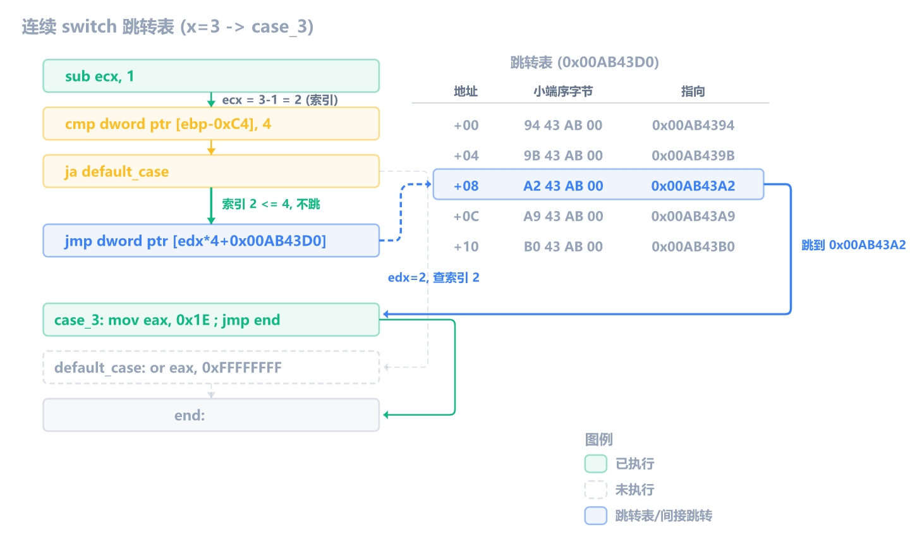
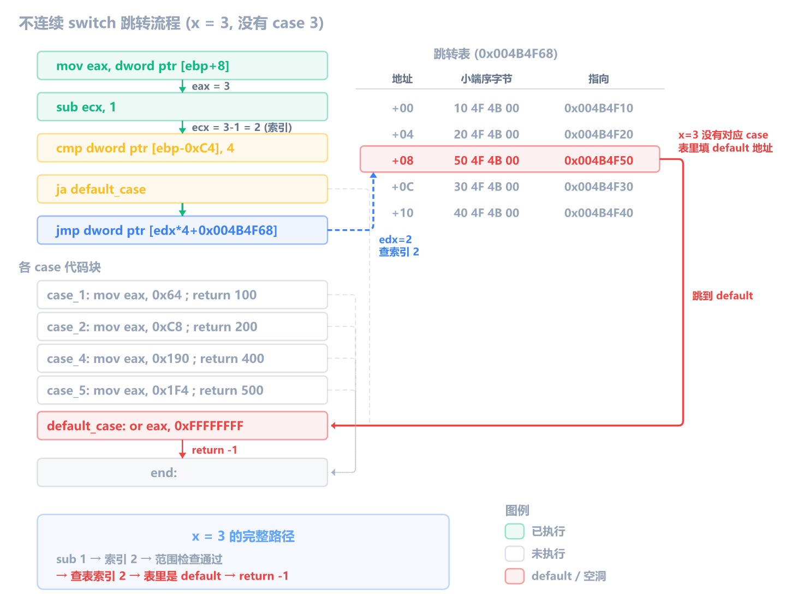
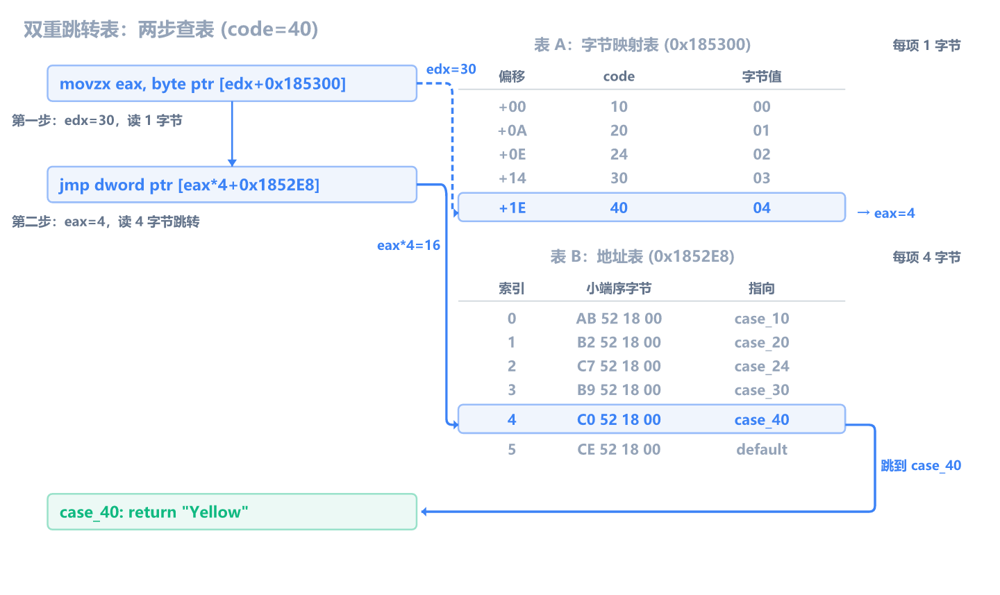

上一章学了 if/else 分支的汇编形态。这一章学 `switch`，即多路分支。

switch 和 if/else if 在 C 语言层面做的事情很像：根据一个变量的不同值，走不同的分支。但编译器对 switch 有专门的优化手段：**跳转表**（jump table）。逆向时认出跳转表，就能快速还原出完整的 switch 结构。

和前几章一样，编译 Debug x86，用 x64dbg 断到函数对照。

## 小型 switch：cmp + je 链

case 少的时候，编译器把 switch 当 if/else if 处理：

```c
int classify(int x) {
    int result = 0;
    switch (x) {
        case 1:
            result = 10;
            break;
        case 2:
            result = 20;
            break;
        default:
            result = -1;
            break;
    }
    return result;
}
```

过滤掉 Debug 噪音，核心汇编如下：

```asm
mov  dword ptr [ebp-4], 0           ; result = 0
mov  eax, dword ptr [ebp+8]         ; eax = x
mov  dword ptr [ebp-0xD0], eax      ; 复制到临时变量（Debug 特性）
cmp  dword ptr [ebp-0xD0], 1        ; x == 1?
je   case_1
cmp  dword ptr [ebp-0xD0], 2        ; x == 2?
je   case_2
jmp  default_case                   ; 都不匹配 -> default
case_1:
mov  dword ptr [ebp-4], 0xA         ; result = 10
jmp  end
case_2:
mov  dword ptr [ebp-4], 0x14        ; result = 20
jmp  end
default_case:
mov  dword ptr [ebp-4], 0xFFFFFFFF  ; result = -1
end:
mov  eax, dword ptr [ebp-4]
```

每个 case 对应一次 `cmp` + `je`，线性排列。和 if/else if 几乎一模一样，无法区分。唯一的线索是：所有比较都针对**同一个变量的不同常量值**，这是 switch 的语义特征。

> [!NOTE] Debug 模式的临时变量
> 你可能注意到编译器把 `x` 先复制到 `[ebp-0xD0]` 再反复比较，而不是直接 `cmp [ebp+8], 1`。这是 Debug 模式（`/Od`）的特性：它把 `switch(x)` 的 `x` 计算一次存到临时变量，之后所有 case 比较都用这个临时变量。Release 模式不会这样。

## 中型 switch：跳转表

case 数量多且值连续时，编译器生成**跳转表**：一个地址数组，一次查表就跳到对应 case：

```c
int day_name_small(int n) {
    switch (n) {
        case 1: return 10;
        case 2: return 20;
        case 3: return 30;
        case 4: return 40;
        case 5: return 50;
        default: return -1;
    }
}
```

核心汇编：

```asm
; ── 第一步：取 n 的值，复制到临时变量 ──
mov  eax, dword ptr [ebp+8]         ; eax = n（参数）
mov  dword ptr [ebp-0xC4], eax      ; 存到临时变量（Debug 特性）

; ── 第二步：把 case 值转成 0 起始的索引 ──
mov  ecx, dword ptr [ebp-0xC4]
sub  ecx, 1                         ; ecx = n - 1
                                    ;   n=1 → 索引 0
                                    ;   n=2 → 索引 1
                                    ;   n=3 → 索引 2
                                    ;   n=4 → 索引 3
                                    ;   n=5 → 索引 4
mov  dword ptr [ebp-0xC4], ecx

; ── 第三步：范围检查 ──
cmp  dword ptr [ebp-0xC4], 4        ; 索引 > 4？（即 n < 1 或 n > 5）
ja   default_case                   ; 超出范围 → default

; ── 第四步：查表跳转 ──
mov  edx, dword ptr [ebp-0xC4]      ; edx = 索引
jmp  dword ptr [edx*4+0x00AB43D0]   ; 跳转到 表基址 + 索引×4 处存的地址

; ── 各 case 的代码块 ──
case_1:                             ; n == 1
mov  eax, 0xA                       ; return 10
jmp  end
case_2:                             ; n == 2
mov  eax, 0x14                      ; return 20
jmp  end
case_3:                             ; n == 3
mov  eax, 0x1E                      ; return 30
jmp  end
case_4:                             ; n == 4
mov  eax, 0x28                      ; return 40
jmp  end
case_5:                             ; n == 5
mov  eax, 0x32                      ; return 50
jmp  end
default_case:                       ; n 不在 1~5 之间
or   eax, 0xFFFFFFFF                ; return -1
end:
```

关键在第二步和第四步。`sub ecx, 1` 把 case 值转成 0 起始的索引：case 1 变成索引 0，case 5 变成索引 4。然后 `jmp dword ptr [edx*4+0x00AB43D0]` 拿这个索引去查表，`edx*4` 是因为每个表项占 4 字节（32 位地址），`0x00AB43D0` 是表基址。

跳转表在内存中长这样（基址 `0x00AB43D0`）：

```
地址              内存字节 (小端序)      指向的地址
0x00AB43D0       94 43 AB 00           0x00AB4394 (case_1)    索引 0 (n=1)
0x00AB43D4       9B 43 AB 00           0x00AB439B (case_2)    索引 1 (n=2)
0x00AB43D8       A2 43 AB 00           0x00AB43A2 (case_3)    索引 2 (n=3)
0x00AB43DC       A9 43 AB 00           0x00AB43A9 (case_4)    索引 3 (n=4)
0x00AB43E0       B0 43 AB 00           0x00AB43B0 (case_5)    索引 4 (n=5)
```

> [!NOTE] 小端序怎么看跳转表
> 内存里存的是 `94 43 AB 00`，但实际地址要**倒着读**：`0x00AB4394`。这就是第 9 章讲过的小端序——低字节在低地址。x64dbg 的内存窗口默认按字节显示，你看到 `94 43 AB 00` 要在脑子里翻转成 `00AB4394`。如果觉得麻烦，x64dbg 的数据窗口可以切换显示模式，按 DWORD 查看，就能直接看到 `00AB4394`。

假如 `n = 3`：`sub ecx, 1` 得到索引 2，范围检查通过，`jmp dword ptr [2*4+0x00AB43D0]` 即 `jmp dword ptr [0x00AB43D8]`，从表的第 3 项取出 `0x00AB43A2`（case_3 的地址），跳过去执行 `return 30`。



> [!NOTE] `or eax, 0xFFFFFFFF` 为什么不是 `mov eax, 0xFFFFFFFF`
> 两条指令效果一样（`eax` 都变成 `-1`），但 `or eax, 0xFFFFFFFF` 只需 5 字节，`mov eax, 0xFFFFFFFF` 需要 3 字节。等等，`mov` 不是更短吗？没错，但 MSVC Debug（`/Od`）不优化指令长度，编译器在 `return -1` 时恰好生成了 `or`。逆向时看到 `or eax, 0xFFFFFFFF` 就知道在返回 `-1`。

编译器为什么用跳转表？5 个 case 用 `cmp+je` 链，最坏情况要比较 5 次。用跳转表，不管匹配哪个 case，都是一次减法 + 一次范围检查 + 一次查表跳转，O(1) 时间复杂度。

> [!NOTE] 为什么是 ja 而不是 jg
> 范围检查用 `ja`（无符号大于），不是 `jg`（有符号大于）。因为 `sub ecx, 1` 后如果 `n` 是 0 或负数，`ecx` 会变成很大的正数（如 `0 - 1 = 0xFFFFFFFF`），用无符号比较就能正确识别为"超出范围"，直接走 default。

> [!NOTE] x64 下的跳转表：相对偏移
> 本文以 32 位为例，跳转表里存的是 4 字节绝对地址。在 64 位程序中，为了支持 ASLR（地址空间随机化），编译器通常存**相对偏移量**（RIP-relative offset）而非绝对地址。x64 跳转表的标志性汇编变成了：
>
> ```asm
> movsxd rax, dword ptr [rax*4 + table]   ; 取出 4 字节相对偏移
> add    rax, table                        ; 加上表基址算出绝对地址
> jmp    rax                               ; 跳转
> ```
>
> 逆向 x64 程序时，看到 `movsxd` + `add` + `jmp` 的组合，就是位置无关的跳转表。

## 不连续的 switch

case 值不连续时（如 1, 2, 4, 5，缺了 3），编译器仍然用跳转表，但空洞位置填 default 的地址：

```c
int sparse(int x) {
    switch (x) {
        case 1: return 100;
        case 2: return 200;
        case 4: return 400;
        case 5: return 500;
        default: return -1;
    }
}
```

核心汇编：

```asm
mov  eax, dword ptr [ebp+8]         ; eax = x
mov  dword ptr [ebp-0xC4], eax
mov  ecx, dword ptr [ebp-0xC4]
sub  ecx, 1                         ; x - 1（索引）
mov  dword ptr [ebp-0xC4], ecx
cmp  dword ptr [ebp-0xC4], 4        ; 索引 > 4?
ja   default_case                   ; 超出范围 -> default
mov  edx, dword ptr [ebp-0xC4]
jmp  dword ptr [edx*4+0x004B4F68]   ; 跳转表
case_1:
mov  eax, 0x64                      ; return 100
jmp  end
case_2:
mov  eax, 0xC8                      ; return 200
jmp  end
case_4:
mov  eax, 0x190                     ; return 400
jmp  end
case_5:
mov  eax, 0x1F4                     ; return 500
jmp  end
default_case:
or   eax, 0xFFFFFFFF                ; return -1
end:
```

和连续 case 的代码**完全一样的结构**：`sub ecx, 1` → `cmp ..., 4` → `ja default` → `jmp [edx*4+表]`。区别只在跳转表内部：索引 2（对应 case 3）的表项填的是 `default_case` 的地址。



逆向时如果看到一张跳转表里有多个条目指向同一个地址，那个地址大概率就是 default 分支。

## break 和 fall-through

switch 和 if/else 有一个关键区别：**case 穿透**（fall-through）。C 的 switch 如果 case 末尾不写 `break`，EIP 会顺序往下走到下一个 case 的代码，不重新判断条件。

### 有 break：每个 case 末尾都有 jmp end

```c
switch (x) {
    case 1: result = 10; break;
    case 2: result = 20; break;
}
```

```asm
case_1:
mov  dword ptr [ebp-4], 0xA
jmp  end                          ; break -> 跳到 switch 结尾
case_2:
mov  dword ptr [ebp-4], 0x14
jmp  end                          ; break -> 跳到 switch 结尾
end:
```

每个 case 末尾的 `jmp end` 就是 `break`。逆向时看到 case 代码块末尾有 `jmp` 跳到同一个汇合点，说明每个 case 都有 `break`。

### 合法用途 1：case 合并

C 语法不支持 `case 'a','e','i','o','u'` 这种写法，case 后面只能跟一个常量。所以多个值共享同一段代码时，只能靠不写 break 让它们穿透：

```c
switch (ch) {
    case 'a':
    case 'e':
    case 'i':
    case 'o':
    case 'u':
        printf("元音\n");
        break;
}
```

编译器的处理方式很简单：跳转表里 5 个条目全部指向 `printf` 那行的地址。运行时查一次表、跳过去、执行一次 printf、break 跳出。**没有"穿透 5 次"这回事**——合并是编译期的事，5 个表项指向同一地址而已。

```asm
00184985  jmp    dword ptr [eax*4+0x1849B0]   ; 查表跳转
0018498C  push   offset string "元音\n"       ; 5 个 case 都指向这里
00184991  call   _printf
00184996  add    esp, 4
00184999  jmp    end                           ; break
```

逆向时看到跳转表里多个表项指向同一地址，就是 case 合并。

### 合法用途 2：累积执行

每个 case 在前一个 case 的基础上追加操作，高级别"顺便"获得低级别的功能：

```c
switch (level) {
    case 3: features |= FEATURE_C;    // 管理员：A + B + C
    case 2: features |= FEATURE_B;    // 普通用户：A + B
    case 1: features |= FEATURE_A;    // 访客：A
        break;
}
```

case 3 没有 break，执行完 `|= FEATURE_C` 后 EIP 顺序往下走到 case 2 的 `|= FEATURE_B`，再走到 case 1 的 `|= FEATURE_A`。最终 C + B + A 三个特征位都开了。case 2 穿透到 case 1，开 B + A。case 1 只开 A。这是有意为之的 fall-through——每个 case 有自己的代码，靠不写 break 实现累积。

### bug 示例：漏写 break

```c
switch (x) {
    case 10: result = 10;    // 忘了 break
    case 20: result = 20;    // 忘了 break
    case 30: result = 30;    // 忘了 break
    case 40: result = 30; break;
}
```

```asm
0101498B  mov  dword ptr [result], 0Ah    ; case 10
01014992  mov  dword ptr [result], 14h    ; case 20，覆盖了 10
01014999  mov  dword ptr [result], 1Eh    ; case 30，覆盖了 20
010149A0  mov  dword ptr [result], 1Eh    ; case 40
010149A7  jmp  end                        ; break
```

跳转表把你送到 `0x0101498B`（case 10），执行完 `result = 10` 后没有 `jmp end`，EIP 顺序往下走到 case 20、case 30、case 40，result 被反复覆盖，最终值是 30。你以为 x=10 返回 10，实际返回 30。C 标准不强制 break，编译器也不警告，所以这是经典 bug。

**逆向时判断有没有 break，就看 case 代码块末尾有没有 `jmp`。** 有 `jmp` 是 break，没有就是 fall-through。case 合并的表项指向同一地址（没有穿透动作）；fall-through 的表项指向不同地址，只是代码块之间没有 `jmp` 隔开，EIP 顺序往下走。

## 稀疏 switch：双重跳转表

上一节的连续 switch，case 值是 1、2、3、4、5，减 1 后得到 0、1、2、3、4，可以直接当跳转表索引用。但如果 case 值是 10、20、30、40、24 呢？

```c
const char* color_name(int code) {
    switch (code) {
        case 10: return "Red";
        case 20: return "Green";
        case 24: return "Purple";
        case 30: return "Blue";
        case 40: return "Yellow";
        default: return "Invalid";
    }
}
```

减去最小值 10 后，code=40 变成 30。如果直接用这个值当地址表索引，地址表需要 31 个 DWORD（索引 0~30），其中 26 个填 default。MSVC 的解决办法是查**两张表**：先用一张字节表把稀疏偏移压缩成连续小索引，再用小索引查地址表跳转。

```asm
mov  eax, dword ptr [code]            ; eax = code
mov  dword ptr [ebp-0xC4], eax        ; 存到临时变量
mov  ecx, dword ptr [ebp-0xC4]
sub  ecx, 0Ah                         ; ecx = code - 10（最小 case 值）
mov  dword ptr [ebp-0xC4], ecx
cmp  dword ptr [ebp-0xC4], 1Eh        ; 索引 > 0x1E (30)?
ja   default_case                     ; 超出 10~40 范围 → default
mov  edx, dword ptr [ebp-0xC4]        ; edx = code - 10
movzx eax, byte ptr [edx+0x185300h]  ; 第一步：查字节表，读出 1 字节
jmp  dword ptr [eax*4+0x1852E8h]      ; 第二步：查地址表，读出 4 字节跳转

case_10:                              ; code == 10
mov  eax, offset "Red"
jmp  end
case_20:                              ; code == 20
mov  eax, offset "Green"
jmp  end
case_24:                              ; code == 24
mov  eax, offset "Purple"
jmp  end
case_30:                              ; code == 30
mov  eax, offset "Blue"
jmp  end
case_40:                              ; code == 40
mov  eax, offset "Yellow"
jmp  end
default_case:                         ; 不匹配任何 case
mov  eax, offset "Invalid"
end:
```

`sub` → `cmp` + `ja` 这段和普通跳转表完全一样。区别在最后两行——查了两张表。

### 第一步：查字节表

`movzx eax, byte ptr [edx+0x185300]` 用 `edx`（code 减 10 后的偏移）当索引，从 `0x185300` 处的字节表里读 **1 个字节**。这张表每个条目只有 1 字节，作用是把稀疏的偏移值映射成连续的小索引：

```
表 A：字节映射表 (0x185300)

偏移   字节值    含义
+00    00       → 索引 0 (case_10)
+0A    01       → 索引 1 (case_20)
+0E    02       → 索引 2 (case_24)
+14    03       → 索引 3 (case_30)
+1E    04       → 索引 4 (case_40)
其余   05       → 索引 5 (default)
```

偏移怎么算？`code - 最小 case 值`（这里最小是 10）：

1. code=40 → 偏移 = 40 - 10 = 30 = `0x1E` → 读到字节 `04`
2. code=24 → 偏移 = 24 - 10 = 14 = `0x0E` → 读到字节 `02`
3. code=11 → 偏移 = 11 - 10 = 1 → 读到字节 `05`（default）

`movzx` 把读出的字节补零扩展到 32 位——`04` 变成 `0x00000004`，存入 eax 给下一步用。

没有对应 case 的偏移（如 `+01` 对应 code=11）字节值全是 `05`——因为地址表索引 5 存的是 default 的地址，查到 `05` 就直接跳到 default，不用额外判断。

### 第二步：查地址表

`jmp dword ptr [eax*4+0x1852E8]` 用刚才读出的 `eax` 乘 4 当索引，从 `0x1852E8` 处的地址表里读 **4 个字节**（一个 DWORD）。这步和普通跳转表完全一样：

```
表 B：地址表 (0x1852E8)

索引   小端序字节       指向
0      AB 52 18 00    0x001852AB (case_10)
1      B2 52 18 00    0x001852B2 (case_20)
2      C7 52 18 00    0x001852C7 (case_24)
3      B9 52 18 00    0x001852B9 (case_30)
4      C0 52 18 00    0x001852C0 (case_40)  ← code=40 走这里
5      CE 52 18 00    0x001852CE (default)
```

eax=4，`4*4=16`，读地址 `0x1852E8 + 16 = 0x1852F8` 处的 DWORD：`C0 52 18 00`，小端序读成 `0x001852C0`，这就是 case_40 的地址，`jmp` 跳过去。



两张表的关系：表 A 把稀疏的偏移（0、10、14、20、30）压缩成连续的索引（0、1、2、3、4），表 B 用这个连续索引找到真正的 case 地址。如果没有表 A，表 B 就需要 31 个条目（索引 0~30），大部分填 default。有了表 A 压缩，表 B 只需要 6 个条目。

> [!NOTE] movzx 就是补零
> `movzx` = move with zero-extend。读 `04` 这个字节后高位补零，变成 `0x00000004`。为什么不直接用 `mov`？因为 `mov al, byte ptr [...]` 只改 al，eax 的高 3 字节残留旧值。`movzx` 保证 eax 就是你读到的那个字节值。逆向时看到 `movzx ..., byte ptr [...]`，意思是"读一个字节当索引用"。

### 逆向识别特征

看到 **`movzx ..., byte ptr [...]`** 紧接着 **`jmp dword ptr [...*4+...]`**，就是双重跳转表。两个基址是两张不同的表：`movzx` 行查字节表（每项 1 字节），`jmp` 行查地址表（每项 4 字节）。范围检查（`sub` + `cmp` + `ja`）的用法和普通跳转表完全一样。

## 怎么读跳转表

看到 `jmp dword ptr [edx*4+XXX]` 后，逆向还原 switch 的步骤：

**第一步：确定 case 范围。** 往前找 `sub` 和 `cmp`：

```asm
sub  ecx, 1          ; 基准值 = 1
cmp  ..., 4          ; 最大索引 = 4
```

→ case 值从 1 到 5（基准值 + 0 到 基准值 + 最大索引）。

**第二步：读跳转表。** 跳到表基址 `XXX`，按 DWORD 读 `最大索引 + 1` 个条目。每个条目是一个代码地址。

**第三步：对照代码块。** 每个地址指向一个 case 的代码块，读那条赋值/操作就能还原出 case 内容。

**第四步：标 default。** 范围检查的 `ja` 目标是 default。跳转表里指向同一地址的多个条目，那个地址也是 default。

## 逆向识别清单

| 特征     | if/else if         | switch（cmp 链）   | switch（跳转表）      | switch（双重跳转表）            |
| -------- | ------------------ | ------------------ | --------------------- | ------------------------------- |
| 比较模式 | 不同变量/不同值    | 同一变量反复比较   | 减偏移 + 范围检查     | 减偏移 + 范围检查               |
| 跳转方式 | jcc 各自跳不同地址 | je 各自跳不同地址  | jmp [table + index*4] | movzx byte表 → jmp [紧凑索引*4] |
| default  | 最后的 else        | 最后的 jmp default | ja default（范围外）  | ja default（范围外）            |
| 表地址   | 无                 | 无                 | 有，在 .rdata 段      | 两张表：字节表 + 地址表         |

**最可靠的特征是 `jmp dword ptr [reg*4+XXX]`**：有这条指令一定是跳转表 switch。如果前面还有 `movzx ..., byte ptr [...]`，就是双重跳转表。没有 `jmp [reg*4+...]` 则需要靠"同一变量反复比较不同常量"来猜是 switch 还是 if/else if。

## 练习

1. 下面这段汇编对应的 switch 有几个 case？case 值分别是什么？

   ```asm
   mov  eax, dword ptr [ebp+8]
   sub  eax, 5
   cmp  eax, 3
   ja   default_lbl
   jmp  dword ptr [eax*4+0x00403000]
   ```

   > [!NOTE]- 参考答案
   >
   > 4 个 case，值是 5、6、7、8。`sub eax, 5` 把参数减 5 得到索引，`cmp eax, 3` 检查索引是否 <= 3。跳转表在 `0x00403000`，有 4 个条目。

2. 下面这段汇编，判断它是 if/else 还是 switch？还原出 C 代码。

   ```asm
   cmp  dword ptr [ebp+8], 0x2A
   je   loc_A
   cmp  dword ptr [ebp+8], 0x63
   je   loc_B
   cmp  dword ptr [ebp+8], 0x89
   je   loc_C
   jmp  default
   loc_A:
   mov  eax, 1
   ret
   loc_B:
   mov  eax, 2
   ret
   loc_C:
   mov  eax, 3
   ret
   default:
   xor  eax, eax
   ret
   ```

   > [!NOTE]- 参考答案
   >
   > ```c
   > int func(int x) {
   >     switch (x) {
   >         case 42:  return 1;
   >         case 99:  return 2;
   >         case 137: return 3;
   >         default:  return 0;
   >     }
   > }
   > ```
   >
   > 三个比较都针对**同一个变量** `[ebp+8]` 的不同常量值（`0x2A`=42, `0x63`=99, `0x89`=137），这是 switch 的 cmp 链模式。case 值跨度太大（42~137），编译器放弃跳转表，退回 cmp+je。和 if/else if 的区别只在于语义：所有分支都比较同一个变量。

3. 你在 x64dbg 里看到下面这段代码。跳转表在地址 `0x00402000`，你读了表里的 6 个 DWORD，分别是：`0x00401020`、`0x00401050`、`0x00401080`、`0x00401080`、`0x00401020`、`0x004010B0`。还原出 switch 结构。

   ```asm
   mov  eax, dword ptr [ebp+8]
   sub  eax, 10
   cmp  eax, 5
   ja   default_case
   jmp  dword ptr [eax*4+0x00402000]
   ```

   > [!NOTE]- 参考答案
   >
   > `sub eax, 10` + `cmp eax, 5` → case 值 10 到 15（6 个值）。对照跳转表：
   >
   > - case 10（索引 0）→ `0x00401020`
   > - case 11（索引 1）→ `0x00401050`
   > - case 12（索引 2）→ `0x00401080`
   > - case 13（索引 3）→ `0x00401080`（和 case 12 相同）
   > - case 14（索引 4）→ `0x00401020`（和 case 10 相同）
   > - case 15（索引 5）→ `0x004010B0`
   >
   > case 12 和 13 指向同一地址，case 10 和 14 也指向同一地址，说明这些 case 是**合并**的（共享代码块，而非 fall-through）。还原代码：
   >
   > ```c
   > // 0x00401020 是 case 10/14 的代码块
   > // 0x00401050 是 case 11 的代码块
   > // 0x00401080 是 case 12/13 的代码块
   > // 0x004010B0 是 case 15 的代码块
   > switch (x) {
   >     case 10:
   >     case 14: /* 代码块 A */ break;
   >     case 11: /* 代码块 B */ break;
   >     case 12:
   >     case 13: /* 代码块 C */ break;
   >     case 15: /* 代码块 D */ break;
   >     default:  /* default */ break;
   > }
   > ```
   >
   > 要知道每个 case 具体做什么，需要分别跟到对应的代码地址读汇编。
