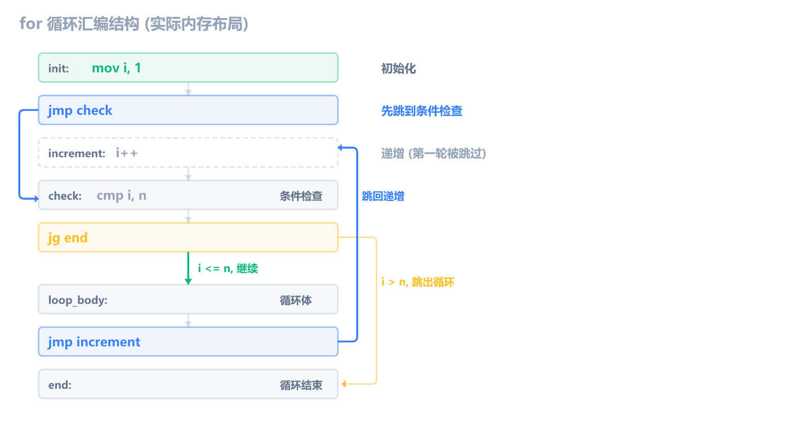
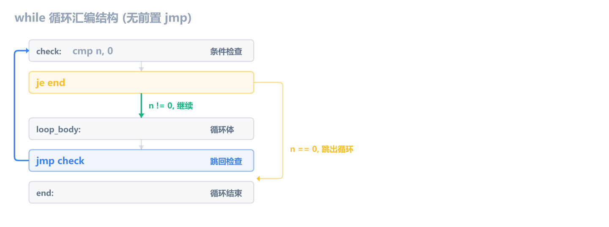
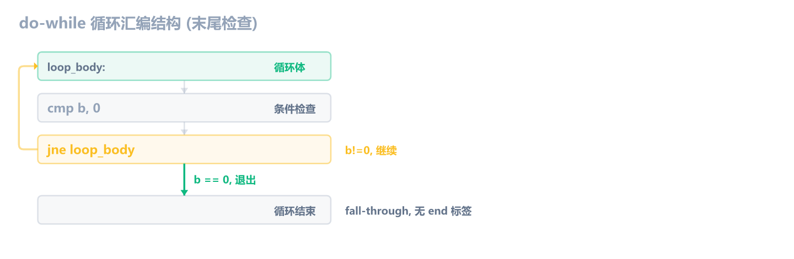
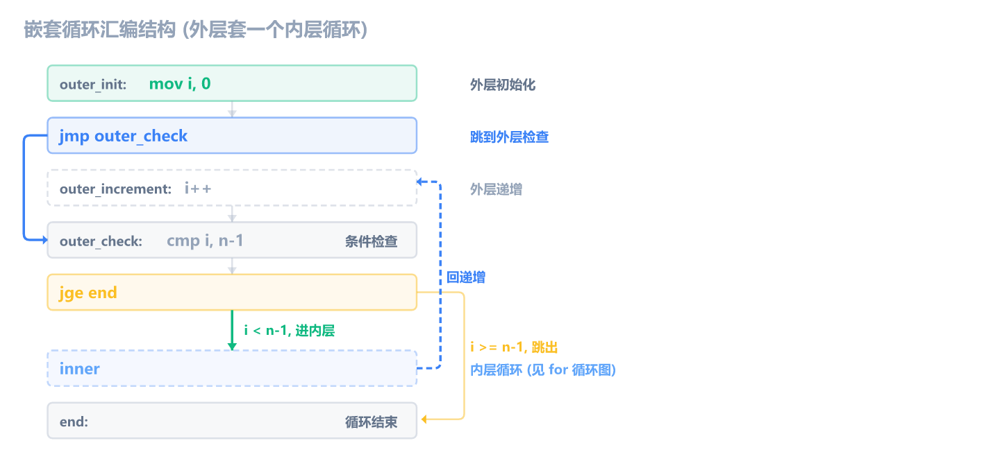

上一章学了 `switch` 多路分支的汇编形态。这一章学**循环**：C 里写 `for`、`while`、`do-while`，编译器翻译成什么。

和前几章一样，编译 Debug x86，用 x64dbg 断到函数对照。汇编只保留循环结构相关的核心指令，过滤掉 Debug 噪音（每步读写栈、临时变量复制等，前面讲过）。

## for 循环

for 是结构最完整的循环——有独立的初始化、条件检查、循环体、递增四个部分。先看 C 代码：

```c
int sum_to(int n) {
    int total = 0;
    for (int i = 1; i <= n; i++) {
        total += i;
    }
    return total;
}
```

核心汇编：

```asm
mov  dword ptr [ebp-4], 0       ; total = 0
mov  dword ptr [ebp-14h], 1     ; i = 1（初始化）
jmp  check                      ; ← 关键：先跳到条件检查
increment:
mov  eax, dword ptr [ebp-14h]   ; i++
add  eax, 1
mov  dword ptr [ebp-14h], eax
check:
mov  eax, dword ptr [ebp-14h]   ; eax = i
cmp  eax, dword ptr [ebp+8]     ; i <= n ?
jg   end                        ; i > n → 跳出循环
mov  eax, dword ptr [ebp-4]     ; eax = total（循环体）
add  eax, dword ptr [ebp-14h]   ; eax += i
mov  dword ptr [ebp-4], eax     ; total = eax
jmp  increment                  ; 循环体末尾跳回递增
end:
mov  eax, dword ptr [ebp-4]     ; 返回 total
```

for 循环在汇编里的固定结构：



注意实际布局中 `increment` 在 `check` 之前，`loop_body` 在 `check` 之后。条件检查通过后 fall-through 进入循环体，循环体末尾 `jmp increment` 跳回递增，递增后 fall-through 到 check，形成环。**初始化之后的那条 `jmp check` 是 for 循环最明显的标志**——因为 for 的语义是"先检查条件，再决定是否执行循环体"，第一轮要先跳到 check，不能直接进循环体。

> [!NOTE] 为什么先 jmp 到 check
> for 的语义是"条件满足才执行循环体"。如果初始化后直接进循环体，那条件不满足时第一轮也会执行——这就变成 do-while 了。所以编译器在初始化后插一条 `jmp check`，先做条件检查，通过才 fall-through 进入循环体。

## while 循环

while 和 for 都是"先检查后执行"，但 MSVC 生成的结构不同——while 没有独立的递增部分，所以不需要 `jmp check` 前置跳转：

```c
int count_bits(int n) {
    int count = 0;
    while (n != 0) {
        count += n & 1;
        n >>= 1;
    }
    return count;
}
```

核心汇编：

```asm
mov  dword ptr [ebp-4], 0       ; count = 0
check:
cmp  dword ptr [ebp+8], 0       ; n != 0 ?
je   end                        ; n == 0 → 跳出循环
mov  eax, dword ptr [ebp+8]     ; eax = n
and  eax, 1                     ; n & 1
add  eax, dword ptr [ebp-4]     ; eax += count
mov  dword ptr [ebp-4], eax     ; count = eax
mov  eax, dword ptr [ebp+8]     ; eax = n
sar  eax, 1                     ; n >>= 1（算术右移）
mov  dword ptr [ebp+8], eax     ; n = eax
jmp  check                      ; 跳回检查
end:
mov  eax, dword ptr [ebp-4]     ; 返回 count
```

结构：



while 的结构和 for 不同——**没有初始化后的 `jmp check` 前置跳转**。因为 while 没有独立的递增部分，编译器直接把条件检查放在循环入口，`je end` 跳出，循环体末尾 `jmp check` 跳回。相比之下 for 有独立的递增部分（`i++`），递增在 check 之前，所以需要先 `jmp check` 跳过递增直达检查。

> [!NOTE] while 和 for 的结构差异
> 虽然都是"先检查后执行"，但 MSVC 生成的结构不同：
>
> - **for**：初始化 → `jmp check` → increment → check → loop_body → `jmp increment`
> - **while**：check → loop_body → `jmp check`
>
> 原因是 for 有独立的递增（`i++`），必须放在 check 之前但又不能第一轮就执行，所以需要 `jmp check` 跳过它。while 没有递增部分，直接 cmp + je 就行。

逆向时靠循环体末尾的跳转目标和递增操作来区分 for 和 while：**循环末尾有"取出变量→加 1→存回"这种纯计数操作、且跳到 check 之前的多半是 for；循环体只有业务逻辑、末尾直接跳回 check 的多半是 while。** 但这只是经验，不是绝对——编译器不关心你写的是哪种，只关心逻辑。

## do-while 循环

do-while 是唯一一个**先执行后检查**的循环。循环体至少执行一次：

```c
int gcd(int a, int b) {
    int temp;
    do {
        temp = a % b;
        a = b;
        b = temp;
    } while (b != 0);
    return a;
}
```

核心汇编：

```asm
loop_body:                      ; ← 直接进入循环体，没有 jmp check
mov  eax, dword ptr [ebp+8]     ; eax = a
cdq                             ; 扩展符号位到 edx（为 idiv 准备）
idiv eax, dword ptr [ebp+0Ch]   ; eax / b，余数在 edx
mov  dword ptr [ebp-4], edx     ; temp = a % b
mov  eax, dword ptr [ebp+0Ch]   ; eax = b
mov  dword ptr [ebp+8], eax     ; a = b
mov  eax, dword ptr [ebp-4]     ; eax = temp
mov  dword ptr [ebp+0Ch], eax   ; b = temp
cmp  dword ptr [ebp+0Ch], 0     ; b != 0 ?
jne  loop_body                  ; 不等于 0 → 继续
mov  eax, dword ptr [ebp+8]     ; 返回 a
```

结构：



**do-while 最显著的特征：没有条件检查的前置跳转。** 循环代码从 `loop_body` 标签开始直接执行，条件检查在末尾。这是和 for/while 的关键区别——for/while 是"先检查后执行"，条件检查在循环体之前；do-while 是"先执行后检查"，直接进循环体，末尾 `jne` 跳回。

这也解释了为什么 for/while 的条件跳转需要一个 `end` 标签，而 do-while 不需要。for/while 在循环体**之前**检查，检查失败时要跳到循环体之后——必须有 `end` 标记目标。do-while 在循环体**之后**检查，检查失败时不跳，fall-through 自然到了循环体后面，不需要专门的退出标签。

三种循环的对比如下：

| 特征         | for                          | while                  | do-while                 |
| ------------ | ---------------------------- | ---------------------- | ------------------------ |
| 进入方式     | `jmp check` 跳过递增直达检查 | 直接 `cmp` + `je end`  | 直接进入循环体           |
| 条件检查位置 | 循环体之前                   | 循环体之前             | 循环体之后               |
| 最少执行次数 | 0 次                         | 0 次                   | 1 次                     |
| 递增部分     | 有独立 `i++` 段              | 无                     | 无                       |
| 汇编标志     | 初始化后有 `jmp check`       | 没有 `jmp`，直接 `cmp` | 没有 `jmp`，直接进循环体 |

> [!WARNING] Release 下 do-while 特征不一定可靠
> Release 模式下，编译器如果**能证明循环至少执行一次**，会把 for 和 while 也优化成 do-while 的形式（条件检查移到循环末尾，省掉一次 `jmp`）。所以逆向 Release 版本时，"没有前置 jmp"不能作为判定 do-while 的依据——你只能确定"这是一个循环"，具体是哪种语法要看循环体逻辑。

## 三种循环的 Release 形态

Release（`/O2`）下编译器会做循环展开、指令调度等优化，Debug 的结构差异被抹平。看两个函数的对比：

```c
int sum_for(int n) {
    int s = 0;
    for (int i = 1; i <= n; i++) { s += i; }
    return s;
}

int sum_dowhile(int n) {
    int s = 0, i = 1;
    if (n >= 1) {
        do { s += i; i++; } while (i <= n);
    }
    return s;
}
```

MSVC 32 位 Release 编译（`/O2`），两个函数的汇编**不一样**：

```asm
; sum_for — 编译器做了循环展开（每次加 2）
00441040  xor   edx, edx              ; s = 0
00441042  push  esi
00441043  xor   esi, esi
00441045  push  edi
00441046  lea   eax, [edx+1]          ; i = 1
00441049  cmp   ecx, 2                ; n < 2 ?
0044104C  jl    sum_while+1Dh
0044104E  lea   edi, [ecx-1]          ; n - 1
00441051  inc   esi
00441052  add   edx, eax              ; s += i
00441054  add   esi, eax
00441056  add   eax, 2                ; i += 2（循环展开）
00441059  cmp   eax, edi
0044105B  jle   sum_while+11h
0044105D  xor   edi, edi
0044105F  cmp   eax, ecx
00441061  cmovg eax, edi
00441064  add   eax, esi
00441066  pop   edi
00441067  add   eax, edx
00441069  pop   esi
0044106A  ret

; sum_dowhile — 没有循环展开，结构简单
00441070  xor   eax, eax              ; s = 0
00441072  lea   edx, [eax+1]          ; i = 1
00441075  cmp   ecx, edx              ; n >= 1 ?
00441077  jl    sum_dowhile+17h
00441079  nop   dword ptr [eax]
00441080  add   eax, edx              ; s += i
00441082  inc   edx                   ; i++
00441083  cmp   edx, ecx              ; i <= n ?
00441085  jle   sum_dowhile+10h
00441087  ret
```

`sum_for` 被循环展开（每次加 2），用了 `lea` 替代 `mov`、`cmov` 替代分支；`sum_dowhile` 没有展开，保持简单的 `add`+`inc`+`cmp`+`jle`。**不同循环写法在 Release 下生成不同代码**，不要假设它们会统一。

> [!IMPORTANT] 逆向结论
> 在 Release 版本中，编译器会做循环展开、指令调度、寄存器分配等优化，Debug 下的结构差异（`jmp check`、递增段位置等）会被抹平。你无法区分原始代码用的是 for、while 还是 do-while，只能还原出"这是一个循环，循环条件是什么，循环体做了什么"。不要试图在 Release 里用 Debug 的结构特征去区分循环类型。

## 死循环

死循环是条件恒为真的循环：`while(1)`、`for(;;)`、`do {...} while(1)`。三种都能写，但 MSVC Debug（`/Od`）对它们的处理不同：

```c
while (1) { printf("%d", n); }
for (;;)  { printf("%d", n); }
do        { printf("%d", n); } while (1);
```

核心汇编：

```asm
; while (1) — 开头保留 mov + test + je
check:
mov   eax, 1                     ; 加载常量 1
test  eax, eax                   ; 测试是否为零
je    end                        ; 为零则跳出（永远不跳）
mov   eax, dword ptr [n]         ; printf 参数
push  eax
push  offset "%d"
call  printf
add   esp, 8
jmp   check                      ; 跳回检查

; for (;;) — 完全没有条件检查
loop_body:
mov   eax, dword ptr [n]         ; printf 参数
push  eax
push  offset "%d"
call  printf
add   esp, 8
jmp   loop_body                  ; 直接无条件跳回

; do {} while (1) — 末尾保留 mov + test + jne
loop_body:
mov   eax, dword ptr [n]         ; printf 参数
push  eax
push  offset "%d"
call  printf
add   esp, 8
mov   eax, 1
test  eax, eax
jne   loop_body                  ; 非零则继续（永远跳）
```

三种写法的区别：

- **`while(1)`**：开头 `mov eax,1` + `test` + `je`（永远不跳），循环体末尾 `jmp` 跳回开头
- **`for(;;)`**：完全省略条件检查，只有循环体 + 末尾 `jmp` 跳回
- **`do {} while(1)`**：末尾 `mov eax,1` + `test` + `jne`（永远跳），没有开头的检查

`while(1)` 的 `je` 和 `do {} while(1)` 的 `jne` 测试的都是常量 1，一个永远不跳、一个永远跳，但 Debug 模式不优化，照常生成。`for(;;)` 语法上没有条件表达式，编译器直接省掉。

> [!NOTE] Release 下三种写法完全一样
> Release（`/O2`）下编译器识别出常量条件，三种写法都省掉 `test`，变成纯粹的无条件 `jmp` 跳回，完全无法区分：
>
> ```asm
> loop_body:
> mov   eax, dword ptr [n]        ; printf 参数
> push  eax
> push  offset "%d"
> call  printf
> add   esp, 8
> jmp   loop_body                 ; 三种写法都是这一条
> ```

**识别死循环的特征**：循环末尾是无条件 `jmp` 跳回（没有 `cmp`/`test`），或者有 `test` 但测试的是非零常量（`je`/`jne` 永远不跳/永远跳）。跳出只能靠 `break`（循环体内的条件 `jmp` 到循环之后）。

## break 和 continue

break 和 continue 在汇编里都是 `jmp`，区别在于跳转目标不同：

```c
int first_negative(int* arr, int len) {
    for (int i = 0; i < len; i++) {
        if (arr[i] < 0) {
            break;    // 跳出整个循环
        }
    }
    return 0;
}

int sum_positive(int* arr, int len) {
    int total = 0;
    for (int i = 0; i < len; i++) {
        if (arr[i] < 0) {
            continue; // 跳过本轮，继续下一轮
        }
        total += arr[i];
    }
    return total;
}
```

`first_negative`（带 break）的核心汇编：

```asm
mov  dword ptr [ebp-8], 0       ; i = 0
jmp  check
increment:
mov  eax, dword ptr [ebp-8]     ; i++
add  eax, 1
mov  dword ptr [ebp-8], eax
check:
mov  eax, dword ptr [ebp-8]     ; eax = i
cmp  eax, dword ptr [ebp+0Ch]   ; i < len ?
jge  after_loop                 ; i >= len → 循环结束
mov  eax, dword ptr [ebp-8]     ; eax = i
mov  ecx, dword ptr [ebp+8]     ; ecx = arr
cmp  dword ptr [ecx+eax*4], 0   ; arr[i] < 0 ?（直接在内存比较）
jge  increment                  ; 大于等于 0 → 不 break，跳到递增
jmp  after_loop                 ; break！跳到循环之后
after_loop:                     ; ← break 跳到这里
xor  eax, eax                   ; return 0
```

> [!NOTE] `arr[i]` 的寻址公式
> `cmp dword ptr [ecx+eax*4], 0` 就是拿 `arr[i]` 直接和 0 比较。`ecx` 是数组首地址（base），`eax` 是下标 i（index），`*4` 是因为 `int` 占 4 字节。通用公式是 `[base + index * scale]`，scale 由元素大小决定。寻址模式的细节留到 c-asm-6 数组章节展开。

`sum_positive`（带 continue）的核心汇编：

```asm
mov  dword ptr [ebp-4], 0       ; total = 0
mov  dword ptr [ebp-14h], 0     ; i = 0
jmp  check
increment:
mov  eax, dword ptr [ebp-14h]   ; i++
add  eax, 1
mov  dword ptr [ebp-14h], eax
check:
mov  eax, dword ptr [ebp-14h]   ; eax = i
cmp  eax, dword ptr [ebp+0Ch]   ; i < len ?
jge  end                        ; i >= len → 循环结束
mov  eax, dword ptr [ebp-14h]   ; eax = i
mov  ecx, dword ptr [ebp+8]     ; ecx = arr
cmp  dword ptr [ecx+eax*4], 0   ; arr[i] < 0 ?（直接在内存比较）
jge  skip_continue              ; 大于等于 0 → 不 continue
jmp  increment                  ; continue！跳到递增部分
skip_continue:
mov  eax, dword ptr [ebp-14h]   ; eax = i
mov  ecx, dword ptr [ebp+8]     ; ecx = arr
mov  edx, dword ptr [ebp-4]     ; edx = total
add  edx, dword ptr [ecx+eax*4] ; edx += arr[i]
mov  dword ptr [ebp-4], edx     ; total = edx
jmp  increment                  ; 执行完跳到递增
end:
mov  eax, dword ptr [ebp-4]     ; return total
```

关键区别在 `jmp` 的目标：

- **break**：`jmp after_loop` — 跳过整个循环，到循环之后的代码
- **continue**：`jmp increment` — 跳过循环体剩余部分，但到递增部分，继续下一轮

逆向时看 `jmp` 的目标地址就能区分：跳到循环结构之后的是 break，跳到循环体内的递增标签的是 continue。

## 嵌套循环

两层循环就是两套 `cmp` + `jxx` + `jmp` 结构嵌套在一起。看冒泡排序：

```c
void bubble_sort(int* arr, int n) {
    for (int i = 0; i < n - 1; i++) {
        for (int j = 0; j < n - 1 - i; j++) {
            if (arr[j] > arr[j + 1]) {
                int temp = arr[j];
                arr[j] = arr[j + 1];
                arr[j + 1] = temp;
            }
        }
    }
}
```

核心汇编：

```asm
mov  dword ptr [ebp-8], 0        ; i = 0（外层初始化）
jmp  outer_check
outer_increment:
mov  eax, dword ptr [ebp-8]      ; i++
add  eax, 1
mov  dword ptr [ebp-8], eax
outer_check:
mov  eax, dword ptr [ebp+0Ch]    ; eax = n
sub  eax, 1                      ; n - 1
cmp  dword ptr [ebp-8], eax      ; i < n - 1 ?
jge  end                         ; i >= n-1 → 跳出外层
mov  dword ptr [ebp-14h], 0      ; j = 0（内层初始化）
jmp  inner_check
inner_increment:
mov  eax, dword ptr [ebp-14h]    ; j++
add  eax, 1
mov  dword ptr [ebp-14h], eax
inner_check:
mov  eax, dword ptr [ebp+0Ch]    ; eax = n
sub  eax, 1                      ; n - 1
sub  eax, dword ptr [ebp-8]      ; n - 1 - i
cmp  dword ptr [ebp-14h], eax    ; j < n - 1 - i ?
jge  outer_increment             ; j >= limit → 跳回外层递增
; ── if (arr[j] > arr[j+1]) 则 swap ──
mov  eax, dword ptr [ebp-14h]    ; eax = j
mov  ecx, dword ptr [ebp+8]      ; ecx = arr
mov  edx, dword ptr [ebp-14h]    ; edx = j
mov  esi, dword ptr [ebp+8]      ; esi = arr
mov  eax, dword ptr [ecx+eax*4]  ; eax = arr[j]
cmp  eax, dword ptr [esi+edx*4+4]; arr[j] > arr[j+1] ?
jle  inner_increment             ; 不大于 → 跳过 swap
; swap: temp = arr[j]
mov  eax, dword ptr [ebp-14h]    ; eax = j
mov  ecx, dword ptr [ebp+8]      ; ecx = arr
mov  edx, dword ptr [ecx+eax*4]  ; edx = arr[j]
mov  dword ptr [ebp-20h], edx    ; temp = arr[j]
; arr[j] = arr[j+1]
mov  eax, dword ptr [ebp-14h]    ; eax = j
mov  ecx, dword ptr [ebp+8]      ; ecx = arr
mov  edx, dword ptr [ebp-14h]    ; edx = j
mov  esi, dword ptr [ebp+8]      ; esi = arr
mov  edx, dword ptr [esi+edx*4+4]; edx = arr[j+1]
mov  dword ptr [ecx+eax*4], edx  ; arr[j] = arr[j+1]
; arr[j+1] = temp
mov  eax, dword ptr [ebp-14h]    ; eax = j
mov  ecx, dword ptr [ebp+8]      ; ecx = arr
mov  edx, dword ptr [ebp-20h]    ; edx = temp
mov  dword ptr [ecx+eax*4+4], edx; arr[j+1] = temp
jmp  inner_increment             ; 跳回内层递增
end:
```

> [!NOTE] Debug 重复加载同一个变量
> swap 部分每次用 `arr` 或 `j` 都重新从栈上 `mov` 出来（`mov ecx, dword ptr [ebp+8]` 出现了 5 次）。这是 Debug（`/Od`）的机械行为——每步都从栈读写，寄存器只做临时打工。Release 会把 `arr` 和 `j` 固定在寄存器里，这些重复加载全部消失。

嵌套循环的结构：



识别嵌套循环的关键：找**两对** `jmp check` + `cmp` + `jge` 结构。内层循环的跳转目标都在内层范围内（`inner_increment` → `inner_check` → 循环体 → `inner_increment`），外层循环的跳转目标跨越整个内层结构（`outer_check` 包含完整的内层循环，`inner_check` 失败时跳到 `outer_increment`）。

> [!NOTE] Release 下寄存器分配让结构更清晰
> Debug 版所有变量都在栈上（`[ebp-8]`、`[ebp-14h]`），两套循环结构混在密集的栈读写里不好认。逆向嵌套循环时优先看 Release 版，寄存器分配后结构一目了然：`esi` = 外层 i，`ebx` = 内层 j，两套 `inc` + `cmp` + `jge` 结构清晰可见。

## 逆向识别清单

| 特征                             | 含义                          |
| -------------------------------- | ----------------------------- |
| 初始化后 `jmp check` + 有递增段  | for（先检查后执行，有递增）   |
| 直接 `cmp` + `je end`，无递增    | while（先检查后执行，无递增） |
| 没有 `jmp`，直接进循环体         | do-while（先执行后检查）      |
| `jmp` 到循环之后                 | break                         |
| `jmp` 到递增/检查标签            | continue                      |
| 两对 `jmp check` + `cmp` + `jxx` | 嵌套循环（两层）              |

**for 的特征是初始化后的 `jmp check` + 独立递增段**，**while 的特征是直接 `cmp` + `je end` 无递增段**，**do-while 的特征是直接进循环体、末尾 `jne` 跳回**。但 Release 模式下编译器可能把 for/while 优化成 do-while 形式（省掉前置跳转），所以 Release 版本的"没有 jmp"不能作为 do-while 的判定依据。

## 练习

1. 下面这段汇编实现了一个什么循环？还原出 C 代码。

   ```asm
   mov  dword ptr [ebp-4], 0       ; total = 0
   mov  dword ptr [ebp-8], 1       ; i = 1
   jmp  check
   increment:
   mov  eax, dword ptr [ebp-8]     ; i++
   add  eax, 1
   mov  dword ptr [ebp-8], eax
   check:
   cmp  dword ptr [ebp-8], 10      ; i <= 10 ?
   jg   end                        ; i > 10 → 跳出
   mov  eax, dword ptr [ebp-8]     ; eax = i
   imul eax, eax                   ; eax = i * i
   add  dword ptr [ebp-4], eax     ; total += i * i
   jmp  increment                  ; 跳回递增
   end:
   mov  eax, dword ptr [ebp-4]
   ```

   > [!NOTE]- 参考答案
   >
   > ```c
   > int sum_squares(void) {
   >     int total = 0;
   >     for (int i = 1; i <= 10; i++) {
   >         total += i * i;
   >     }
   >     return total;
   > }
   > ```
   >
   > 初始化后有 `jmp check` + 独立递增段 → for 结构。`imul eax, eax` 是 `i * i`，`cmp ..., 10` + `jg end` 取反得到 `i <= 10`。

2. 判断下面这段汇编是 for/while 还是 do-while？还原出 C 代码。

   ```asm
   mov  eax, dword ptr [ebp+8]     ; eax = n
   xor  ecx, ecx                   ; count = 0
   test eax, eax
   jle  done
   loop_body:
   test eax, 1
   jz   skip
   inc  ecx
   skip:
   sar  eax, 1
   test eax, eax
   jnz  loop_body
   done:
   mov  eax, ecx
   ```

   > [!NOTE]- 参考答案
   >
   > 这是 do-while 结构（Release 优化后）。特征：进入前有一次 `test eax, eax` + `jle done` 做保护检查，之后直接进 `loop_body`，末尾 `test eax, eax` + `jnz loop_body` 跳回。没有前置的 `jmp check`。
   >
   > ```c
   > int count_bits(int n) {
   >     int count = 0;
   >     if (n <= 0) return 0;
   >     do {
   >         if (n & 1) count++;
   >         n >>= 1;
   >     } while (n != 0);
   >     return count;
   > }
   > ```
   >
   > 不过正如本章说的，Release 模式下编译器可能把 for/while 优化成 do-while 形式。原始代码也可能是 `while (n != 0)` 或 `for (; n != 0; n >>= 1)`，生成的 Release 汇编可能完全一样。

3. 下面这段汇编包含嵌套循环。找出外层和内层循环的边界，说明循环变量和终止条件。

   ```asm
   mov  dword ptr [ebp-0Ch], 0      ; sum = 0
   mov  dword ptr [ebp-4], 0       ; i = 0
   jmp  outer_check
   outer_increment:
   mov  eax, dword ptr [ebp-4]     ; i++
   add  eax, 1
   mov  dword ptr [ebp-4], eax
   outer_check:
   mov  ecx, dword ptr [ebp+8]     ; ecx = n
   cmp  dword ptr [ebp-4], ecx     ; i < n ?
   jge  end                        ; i >= n → 跳出外层
   mov  dword ptr [ebp-8], 0       ; j = 0（内层初始化）
   jmp  inner_check
   inner_increment:
   mov  eax, dword ptr [ebp-8]     ; j++
   add  eax, 1
   mov  dword ptr [ebp-8], eax
   inner_check:
   mov  eax, dword ptr [ebp+8]     ; eax = n
   cmp  dword ptr [ebp-8], eax     ; j < n ?
   jge  outer_increment            ; j >= n → 跳回外层递增
   mov  eax, dword ptr [ebp-4]     ; eax = i
   add  eax, dword ptr [ebp-8]     ; eax += j
   add  dword ptr [ebp-0Ch], eax   ; sum += i + j
   jmp  inner_increment            ; 跳回内层递增
   end:
   mov  eax, dword ptr [ebp-0Ch]   ; return sum
   ```

   > [!NOTE]- 参考答案
   >
   > 两层嵌套循环：
   >
   > - **外层循环**：变量 `i`（`[ebp-4]`），从 0 开始，终止条件 `i < n`，递增 `i++`
   > - **内层循环**：变量 `j`（`[ebp-8]`），从 0 开始，终止条件 `j < n`，递增 `j++`
   > - 循环体：`sum += i + j`
   >
   > ```c
   > int func(int n) {
   >     int sum = 0;
   >     for (int i = 0; i < n; i++) {
   >         for (int j = 0; j < n; j++) {
   >             sum += i + j;
   >         }
   >     }
   >     return sum;
   > }
   > ```
   >
   > 识别线索：两对 `jmp check` + `cmp` + `jge end` 结构，内层的 check 在外层的递增之前。

4. 下面这段汇编里有 break 还是 continue？还原出 C 代码。

   ```asm
   mov  dword ptr [ebp-4], 0       ; i = 0
   jmp  check
   increment:
   mov  eax, dword ptr [ebp-4]     ; i++
   add  eax, 1
   mov  dword ptr [ebp-4], eax
   check:
   mov  ecx, dword ptr [ebp-4]
   cmp  ecx, dword ptr [ebp+0Ch]   ; i < len ?
   jge  after_loop                 ; i >= len → 循环结束
   mov  eax, dword ptr [ebp+8]     ; eax = arr
   mov  ecx, dword ptr [ebp-4]     ; ecx = i
   mov  edx, dword ptr [eax+ecx*4] ; edx = arr[i]
   cmp  edx, 0                     ; arr[i] == 0 ?
   jne  increment                  ; 不等于 0 → 不 break，跳到递增
   after_loop:                     ; ← break 跳到这里
   mov  eax, dword ptr [ebp-4]     ; return i
   ```

   > [!NOTE]- 参考答案
   >
   > 是 **break**。`jne increment` 不满足条件时跳到递增（继续循环），满足条件时 fall-through 到 `after_loop`（循环之后）。等价于 `jmp after_loop`——跳过整个循环。
   >
   > ```c
   > int first_zero(int* arr, int len) {
   >     int i;
   >     for (i = 0; i < len; i++) {
   >         if (arr[i] == 0) {
   >             break;
   >         }
   >     }
   >     return i;
   > }
   > ```
   >
   > `jne increment` 取反得到 `arr[i] == 0`。满足时 fall-through 到循环之后 → break。返回值是 `i`，所以函数找的是第一个 0 的下标。
