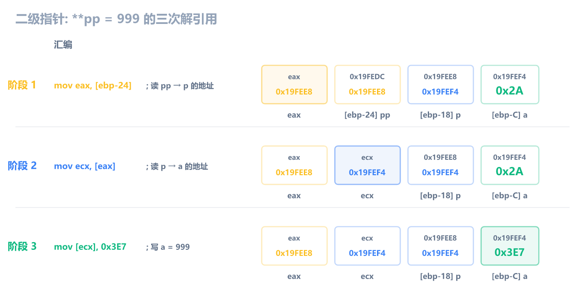
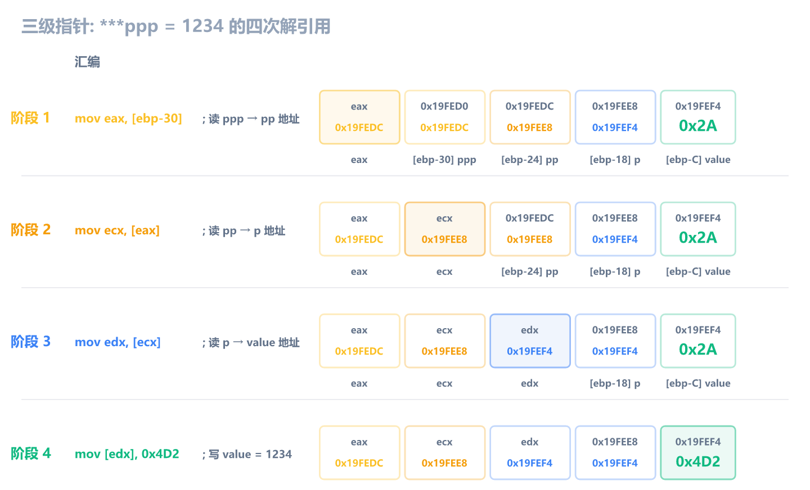
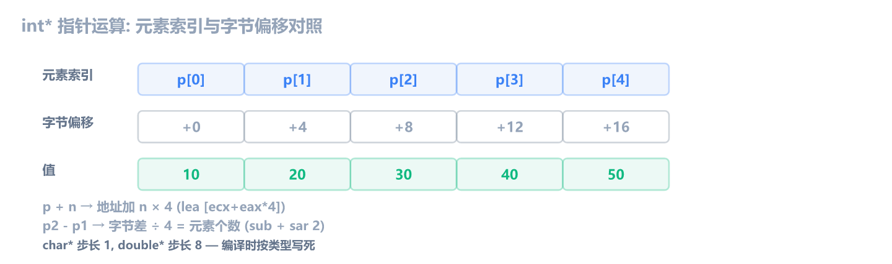

上一章学了循环的汇编形态。这一章学**指针**：C 里写 `*p`、`&a`、`p++`、`**pp`，编译器翻译成什么。

和前几章一样，编译 Debug x86，用 x64dbg 断到函数对照。汇编只保留指针相关的核心指令，过滤掉 Debug 噪音（每步读写栈、临时变量复制等，前面讲过）。

核心认识：**指针 = 地址 = 一个整数**。`int *p` 里的 `p` 存的不是整数 42，而是某个内存地址。多级指针就是指针的指针，地址指向地址指向值。

## 指针基础：取地址和解引用

```c
void ptr_basic(void) {
    int a = 42;
    int *p = &a;
    *p = 100;
}
```

三行 C 代码对应三个动作：

1. `int a = 42` — 在栈上开 4 字节，写入 42
2. `int *p = &a` — 在栈上再开 4 字节给 `p`，把 `a` 的地址存进去
3. `*p = 100` — 通过 `p` 里存的地址，间接修改 `a`

注意 `int *p = &a` 里的 `*` 是**类型声明**（声明 p 是 `int*` 类型），不是解引用。这行拆开读就是：声明一个 `int*` 类型的变量 p，用 `&a` 初始化它。`&a` 存到的是 `p` 本身，不是 `*p`。`*p`（解引用）是第三行才做的事。

核心汇编：

```asm
mov  dword ptr [ebp-C], 0x2A     ; a = 42，直接把立即数写到栈上
lea  eax, [ebp-C]               ; 取 a 的地址到 eax
mov  dword ptr [ebp-18], eax     ; p = &a，把地址值存到 p 的栈位置
mov  eax, dword ptr [ebp-18]     ; 读取 p 的值（即 a 的地址）
mov  dword ptr [eax], 0x64         ; 往那个地址写入 100 → a 被修改
```

![指针基础: lea 取地址 + mov [reg] 解引用](c-asm-6-images/ptr-basic.png)

两条关键指令：

- **`lea eax, [ebp-C]`** — Load Effective Address，取 `[ebp-C]` 这个地址本身，不是取那个地址里的值。等同于 `eax = ebp - 0xC`，即 `&a`
- **`mov dword ptr [eax], 0x64`** — `eax` 里存的是地址，`[eax]` 就是解引用，往那个地址写值。等同于 `*p = 100`

> [!NOTE] lea 和 mov 的区别
> `lea eax, [ebp-C]` 取的是**地址**（`ebp - 0xC` 这个值），`mov eax, [ebp-C]` 取的是**那个地址里的值**（42）。前者是 `&a`，后者是 `a`。一个字母之差，语义完全不同。

### 指针变量本身也是变量

`p` 是个指针，但 `p` 自己也占内存。上面 `p` 在 `[ebp-18]`，`a` 在 `[ebp-C]`，两个不同的栈位置。`&p` 是指针的指针，`int **` 类型，多级指针的根基就在这里。

## 多级指针

### 二级指针

```c
void ptr_address(void) {
    int a = 42;
    int *p = &a;
    int **pp = &p;
    **pp = 999;
}
```

核心汇编：

```asm
mov  dword ptr [ebp-C], 0x2A     ; a = 42
lea  eax, [ebp-C]               ; &a
mov  dword ptr [ebp-18], eax     ; p = &a
lea  eax, [ebp-18]               ; &p
mov  dword ptr [ebp-24], eax     ; pp = &p
mov  eax, dword ptr [ebp-24]     ; 第一次解引用：读 pp → 得到 p 的地址
mov  ecx, dword ptr [eax]         ; 第二次解引用：读 p → 得到 a 的地址
mov  dword ptr [ecx], 0x3E7        ; 往 a 的地址写 999
```

`**pp = 999` 拆成三步：

1. `mov eax, [ebp-24]` — 从 pp 的位置读出 p 的地址
2. `mov ecx, [eax]` — 从 p 的位置读出 a 的地址
3. `mov [ecx], 999` — 往 a 的位置写入 999

三次内存访问，两次读地址，最后一次写值。这就是**指针链**。



### 三级指针

```c
void multi_ptr(void) {
    int value = 42;
    int *p = &value;
    int **pp = &p;
    int ***ppp = &pp;
    ***ppp = 1234;
}
```

核心汇编：

```asm
mov  eax, dword ptr [ebp-30]     ; 读 ppp → pp 的地址
mov  ecx, dword ptr [eax]         ; 读 pp → p 的地址
mov  edx, dword ptr [ecx]         ; 读 p → value 的地址
mov  dword ptr [edx], 0x4D2        ; 写 value = 1234
```



四级指针就是五次访问，依此类推。每多一级指针，就多一次 `mov reg, [reg]` 的间接读取。

> [!IMPORTANT] 指针链是逆向的核心模式
> 逆向工程里到处都是指针链：游戏基址 → 一级偏移 → 二级偏移 → 目标值。你在逆向里看到连续好几行 `mov reg, [reg + offset]`，就是在追踪指针链：
>
> ```asm
> mov  eax, [base + 0x12345]    ; 第一级
> mov  ecx, [eax + 0x10]        ; 第二级
> mov  edx, [ecx + 0x28]        ; 第三级
> mov  eax, [edx + 4]          ; 目标值
> ```
>
> 每一级都是先读出一个地址，加上偏移，再读下一个地址。

> [!TIP] 一个寄存器就能走完整条链
> 上面为了教学清晰，用了 eax → ecx → edx → eax 不同寄存器。但实际编译器（尤其开了优化）大概率全用同一个寄存器，因为中间值用完即弃，没必要保留：
>
> ```asm
> mov eax, [base + 0x12345]   ; eax = 第一级地址
> mov eax, [eax + 0x10]       ; eax = 第二级（覆盖第一级，无所谓）
> mov eax, [eax + 0x28]       ; eax = 第三级
> mov eax, [eax + 4]          ; eax = 目标值
> ```
>
> `mov eax, [eax + offset]` 完全合法，CPU 先算地址、再读内存、再写回 eax，没有冲突。所以指针链再长也不怕，一个寄存器能从头走到尾。
>
> 真的需要同时保留多个中间值（罕见，比如链还没走完就要拿中间地址做别的事）时，编译器会先挤占 esi/edi/ebx，6 个还不够就 **spill 到栈**，把中间值 `mov [ebp-XX], eax` 存到栈上，需要时再读回来。

指针链真正限制长度的不是寄存器数量，而是指针本身是否有效，任何一级偏移错了，后续全是垃圾地址，一碰就崩。

## 指针运算

### 按类型大小递增

```c
int ptr_arith(int *p, int n) {
    int *end = p + n;
    int total = 0;
    while (p < end) {
        total += *p;
        p++;
    }
    return total;
}
```

核心汇编：

```asm
mov  eax, dword ptr [ebp+C]     ; eax = n
mov  ecx, dword ptr [ebp+8]       ; ecx = p
lea  edx, [ecx+eax*4]             ; end = p + n（×4 因为 int 是 4 字节）
mov  dword ptr [ebp-8], edx       ; 存 end
mov  dword ptr [ebp-14], 0       ; total = 0
check:
mov  eax, dword ptr [ebp+8]       ; eax = p
cmp  eax, dword ptr [ebp-8]       ; p < end ?
jae  end
mov  eax, dword ptr [ebp+8]       ; eax = p
mov  ecx, dword ptr [ebp-14]     ; ecx = total
add  ecx, dword ptr [eax]         ; total += *p
mov  dword ptr [ebp-14], ecx
mov  eax, dword ptr [ebp+8]       ; eax = p
add  eax, 4                       ; p++（加 sizeof(int) = 4）
mov  dword ptr [ebp+8], eax       ; 写回 p
jmp  check
end:
mov  eax, dword ptr [ebp-14]     ; 返回 total
```

`p++` 不是让地址加 1。`int` 是 4 字节，所以 `add eax, 4`。`p + n` 用 `lea edx, [ecx+eax*4]`，n 乘以 4 再加到基址上。

如果类型是 `char *`，`p++` 只加 1。如果是 `double *`，`p++` 加 8。编译器在编译时根据类型决定步长，不是运行时。

### 指针减法

两个同类型指针相减，结果是元素个数，不是字节数：

```c
int ptr_diff(int *p1, int *p2) {
    return p2 - p1;
}
```

核心汇编：

```asm
mov  eax, dword ptr [ebp+C]     ; eax = p2（地址）
sub  eax, dword ptr [ebp+8]       ; eax = p2 - p1（字节数）
sar  eax, 2                       ; eax /= 4（除以 sizeof(int)）
```

`sub` 算出字节差，`sar eax, 2` 除以 4 转换成元素个数。这就是 `p2 - p1` 返回 2 而不是 8 的原因。



> [!NOTE] 指针运算和 SIB 寻址用的是同一套硬件
> `p + n` 编译成 `[base + index*4]`，`p++` 编译成 `add reg, 4`，`p2 - p1` 编译成 `sub` + `sar`。指针运算的本质就是"地址 ± 字节数"，编译器根据类型大小把逻辑上的"元素数"转换成物理上的"字节数"。

## 指针间接访问

指针变量存在栈上，但它指向的数据可能在别处（堆、静态区、调用者的栈帧）。访问时先从栈上读出指针值，再用它做地址访问数据：

```asm
mov  ecx, dword ptr [ebp-8]       ; 先读指针值
mov  eax, dword ptr [ecx+8]       ; 再用指针做 base 间接访问
```

这和直接用栈偏移访问局部变量不同，`[ebp-8]` 取的是指针本身的值，`[ecx+8]` 才是真正访问数据。多了一层间接。

> [!WARNING] 数组参数退化为指针
> 当数组作为函数参数传递时，C 语言自动把它退化为指针。函数内部只能用指针访问，下一章讲数组时会展开。

## 动态内存

```c
void heap_demo(void) {
    int *p = (int *)malloc(4 * sizeof(int));
    if (!p) return;
    p[0] = 100;
    p[1] = 200;
    p[2] = 300;
    p[3] = 400;
    free(p);
}
```

核心汇编：

```asm
push 0x10                           ; 参数：16 字节 = 4 × 4
call dword ptr [__imp__malloc]     ; 调用 malloc
add  esp, 4                        ; 清理参数
mov  dword ptr [ebp-8], eax        ; p = 返回的堆地址
cmp  dword ptr [ebp-8], 0          ; 检查是否分配成功
je   fail
; p[0] = 100
mov  eax, 4
imul ecx, eax, 0                   ; 偏移 = 0 × 4
mov  edx, dword ptr [ebp-8]        ; 读 p
mov  dword ptr [edx+ecx], 0x64      ; p[0] = 100
; p[1] = 200
mov  eax, 4
shl  eax, 0                        ; 偏移 = 1 × 4 = 4
mov  ecx, dword ptr [ebp-8]
mov  dword ptr [ecx+eax], 0x0C8     ; p[1] = 200
; free(p)
mov  eax, dword ptr [ebp-8]        ; 读 p
push eax                           ; 传给 free
call dword ptr [__imp__free]
add  esp, 4
```

关键点：

1. `malloc` 返回值在 `eax`，是堆上的地址。栈上的 `p` 存着这个地址
2. `p[i]` 编译成 `[edx + i*4]`，本质就是指针加偏移再解引用
3. `free` 传的是同一个地址值，告诉系统这块堆内存可以回收了
4. `free` 之后 `p` 的值不变（还是那个地址），但那块内存已经不归你了。访问它就是未定义行为

![动态内存: malloc 申请, p[i] 偏移访问, free 释放](c-asm-6-images/heap-demo.png)

> [!WARNING] 释放后使用 (UAF)
> `free(p)` 之后 `p` 的值还在栈上，没有自动清零。如果继续 `mov eax, [p]` 去读，就是 Use After Free，可能读到旧值，可能读到垃圾，可能直接崩溃。逆向时看到 crash 在 `free` 之后的内存访问，检查是不是 UAF。

## 逆向识别清单

| 特征                               | 含义                          |
| ---------------------------------- | ----------------------------- |
| `lea reg, [ebp-N]`                 | 取局部变量地址（`&var`）      |
| `mov reg, [reg]` / `mov [reg], N`  | 解引用（`*p` 读 / `*p =` 写） |
| 连续 `mov reg, [reg+offset]`       | 指针链追踪                    |
| `add reg, 4` / `add reg, 2`        | 指针递增（按类型大小加）      |
| `sub` + `sar`                      | 指针减法（算元素个数）        |
| `mov reg, [ebp-N]` + `[reg+...]`   | 指针间接访问（先读指针值）    |
| `call malloc` + `mov [ebp-N], eax` | 堆分配，地址存到局部变量      |
| `call free` + 之后还访问同一地址   | 释放后使用 (UAF)              |

**指针就是地址，`lea` 取地址，`mov [reg]` 解引用**。多级指针就是多次 `mov reg, [reg]` 的链式解引用。指针运算按类型大小递增（`int*` 加 4，`char*` 加 1）。

## 练习

1. 下面这段汇编做了什么？`[ebp-4]` 最终的值是什么？

   ```asm
   mov  dword ptr [ebp-4], 0x2A       ; [ebp-4] = 42
   lea  eax, [ebp-4]
   mov  dword ptr [ebp-8], eax       ; [ebp-8] = ?
   mov  eax, dword ptr [ebp-8]
   mov  dword ptr [eax], 0x63         ; [ebp-4] = ?
   ```

   > [!NOTE]- 参考答案
   >
   > `[ebp-4]` 初始为 42（0x2A），最后变成 99（0x63）。`[ebp-8]` 存的是 `[ebp-4]` 的地址（即 `ebp-4`）。第三步通过 `[ebp-8]` 里的地址间接修改了 `[ebp-4]` 的值。
   >
   > ```c
   > int a = 42;
   > int *p = &a;
   > *p = 99;
   > ```

2. 下面这段汇编通过几级指针修改了 `value`？写出对应的 C 代码。

   ```asm
   mov  dword ptr [ebp-4], 0x64       ; value = 100
   lea  eax, [ebp-4]
   mov  dword ptr [ebp-8], eax       ; B
   lea  eax, [ebp-8]
   mov  dword ptr [ebp-C], eax     ; C
   mov  eax, dword ptr [ebp-C]     ; 读 C
   mov  ecx, dword ptr [eax]         ; 读 *C
   mov  edx, dword ptr [ecx]         ; 读 **C
   mov  dword ptr [edx], 0x309        ; ***C = 777
   ```

   > [!NOTE]- 参考答案
   >
   > 三级指针。链路：C (`[ebp-C]`) → B (`[ebp-8]`) → A/value (`[ebp-4]`)。三次 `mov reg, [reg]` 读取，最后 `mov [edx], 777` 写值。
   >
   > ```c
   > int value = 100;       // [ebp-4]
   > int *b = &value;       // [ebp-8]
   > int **c = &b;          // [ebp-C]
   > ***c = 777;
   > ```
   >
   > `[ebp-4]` 最终值为 777（0x309）。

3. 下面这段汇编中 `add eax, 0x0C` 是什么操作？假设 `arr` 是 `int` 数组 `{10, 20, 30, 40, 50}`，`*p` 读出什么？

   ```asm
   lea  eax, [ebp-20]               ; arr 首地址
   mov  dword ptr [ebp-28], eax     ; p = arr
   mov  eax, dword ptr [ebp-28]     ; 读 p
   add  eax, 0x0C                     ; p += ?
   mov  dword ptr [ebp-28], eax     ; 写回 p
   mov  ecx, dword ptr [ebp-28]     ; 读 p
   mov  eax, dword ptr [ecx]         ; *p = ?
   ```

   > [!NOTE]- 参考答案
   >
   > `*p` 读出 40。`add eax, 0x0C` 即 `p += 12`，但因为 `int` 是 4 字节，这等于 `p += 3`（偏移 3 个元素）。`arr[3] = 40`。
   >
   > 这是指针运算，`p + 3` 编译成地址加 `3 × sizeof(int) = 12`。逆向时看到 `add reg, N` 且 N 是 4 的倍数（或 2、8），要联想到指针递增。

4. 下面这段汇编有什么问题？

   ```asm
   push 8
   call _malloc
   add  esp, 4
   mov  dword ptr [ebp-4], eax       ; p = malloc(8)
   mov  ecx, dword ptr [ebp-4]       ; 读 p
   mov  dword ptr [ecx], 0x6F         ; p[0] = 111
   mov  edx, dword ptr [ebp-4]
   mov  dword ptr [edx+4], 0x0DE      ; p[1] = 222
   mov  eax, dword ptr [ebp-4]
   push eax
   call _free
   add  esp, 4
   mov  ecx, dword ptr [ebp-4]       ; p 还在吗？
   mov  eax, dword ptr [ecx]         ; 这行能执行吗？
   ```

   > [!NOTE]- 参考答案
   >
   > 这是**释放后使用**（Use After Free）。`free(p)` 之后，`p` 的值（栈上 `[ebp-4]`）没变，还是那个堆地址。但那块堆内存已经被释放，不再属于这个程序。最后两行去读已释放的内存，是未定义行为，可能读到旧值，可能读到垃圾，可能直接崩溃。
   >
   > ```c
   > int *p = malloc(8);
   > p[0] = 111;
   > p[1] = 222;
   > free(p);
   > int x = p[0];  // 危险！释放后使用
   > ```
   >
   > 逆向分析时，如果看到程序 crash 在 `free` 之后的内存访问，检查是不是 UAF。
