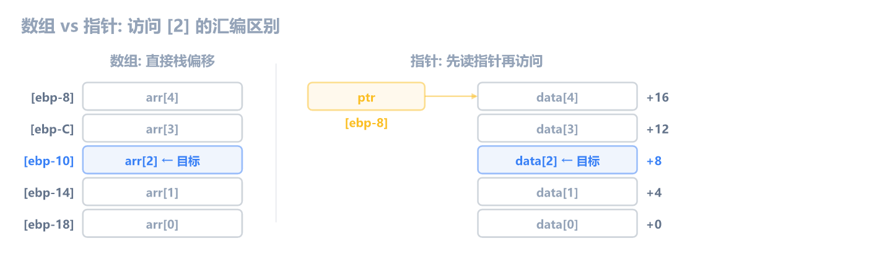
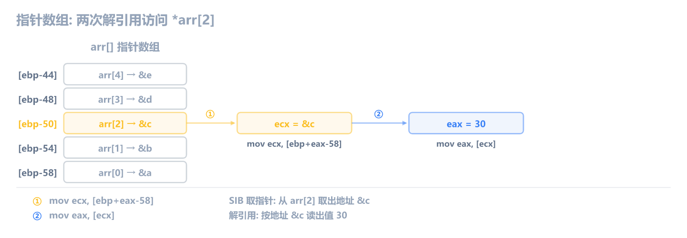

上一章学了指针的汇编形态。这一章学**数组**：C 里写 `arr[i]`、`matrix[i][j]`，编译器翻译成什么。

和前几章一样，编译 Debug x86，用 x64dbg 断到函数对照。汇编只保留数组访问相关的核心指令，过滤掉 Debug 噪音（每步读写栈、临时变量复制等，前面讲过）。

## 一维数组

数组的核心就一句话：**连续内存，基址 + 偏移**。`int arr[5]` 在内存中是 5 个连续的 4 字节：

```
地址        值
arr+0x00    arr[0]
arr+0x04    arr[1]
arr+0x08    arr[2]
arr+0x0C    arr[3]
arr+0x10    arr[4]
```

访问 `arr[i]` 的公式：`地址 = arr + i × sizeof(int) = arr + i × 4`。编译器怎么算这个偏移？看一个简单的数组求和：

```c
int sum_array(int arr[], int n) {
    int total = 0;
    for (int i = 0; i < n; i++) {
        total += arr[i];
    }
    return total;
}
```

核心汇编：

```asm
mov  dword ptr [ebp-8], 0        ; total = 0
mov  dword ptr [ebp-14], 0      ; i = 0
jmp  check
increment:
mov  eax, dword ptr [ebp-14]    ; i++
add  eax, 1
mov  dword ptr [ebp-14], eax
check:
mov  eax, dword ptr [ebp-14]    ; eax = i
cmp  eax, dword ptr [ebp+C]    ; i < n ?
jge  end
mov  eax, dword ptr [ebp-14]    ; eax = i
mov  ecx, dword ptr [ebp+8]      ; ecx = arr（基址）
mov  edx, dword ptr [ebp-8]      ; edx = total
add  edx, dword ptr [ecx+eax*4]  ; total += arr[i] ← SIB 寻址
mov  dword ptr [ebp-8], edx
jmp  increment
end:
mov  eax, dword ptr [ebp-8]      ; 返回 total
```

关键指令是 `add edx, dword ptr [ecx+eax*4]`，这就是数组访问。`ecx` 是数组基址（`arr`），`eax` 是下标 `i`，`*4` 是因为 `int` 占 4 字节。这条指令一步完成了"基址 + 索引 × 元素大小"的计算和取值。

> [!NOTE] `[ecx+eax*4]` 是 SIB 寻址
> SIB = Scale-Index-Base，格式是 `[base + index × scale + disp]`。CPU 硬件直接支持这种寻址，不需要先算偏移再取值。`ecx` 是 base（数组基址），`eax` 是 index（下标），`4` 是 scale（元素大小）。

逆向时看到 `[reg1 + reg2*4]` 或 `[reg1 + reg2*2]`，这就是数组访问。reg1 是基址，reg2 是索引，乘数是元素大小。

## SIB 寻址与元素大小

SIB 中的 scale 只能是 1、2、4、8，对应常见类型：

| scale | 对应类型          | SIB 形式           |
| ----- | ----------------- | ------------------ |
| 1     | char、byte        | `[base + index]`   |
| 2     | short、word       | `[base + index*2]` |
| 4     | int、float、dword | `[base + index*4]` |
| 8     | double、指针(x64) | `[base + index*8]` |

scale=1 时省略乘法（因为 ×1 不写）。看三种类型的访问对比：

```c
char  get_char(char  arr[], int i) { return arr[i]; }
short get_short(short arr[], int i) { return arr[i]; }
int   get_int(int    arr[], int i) { return arr[i]; }
```

核心汇编：

```asm
; get_char — scale=1，不加乘数
mov  eax, dword ptr [ebp+8]       ; eax = arr（基址）
add  eax, dword ptr [ebp+C]     ; eax += i（直接加，因为 char 占 1 字节）
movzx eax, byte ptr [eax]         ; 取 1 字节，零扩展

; get_short — scale=2
mov  eax, dword ptr [ebp+C]     ; eax = i
mov  ecx, dword ptr [ebp+8]       ; ecx = arr
movzx eax, word ptr [ecx+eax*2]   ; 取 2 字节，零扩展

; get_int — scale=4
mov  eax, dword ptr [ebp+C]     ; eax = i
mov  ecx, dword ptr [ebp+8]       ; ecx = arr
mov  eax, dword ptr [ecx+eax*4]   ; 取 4 字节
```

三个函数结构一样，区别只在 scale 和取值宽度：

- **char**：`add` 把下标直接加到基址（scale=1 省略），`byte ptr` + `movzx`
- **short**：`[ecx+eax*2]`，`word ptr` + `movzx`
- **int**：`[ecx+eax*4]`，`dword ptr`

> [!NOTE] movzx vs movsx
> `movzx` 是零扩展（无符号），`movsx` 是符号扩展（有符号）。`char` 和 `short` 作为函数返回值时，编译器用 `movzx` 把小类型扩展到 `eax`（32 位）。如果数组元素是 `signed char` 或 `signed short`，可能用 `movsx`。

逆向时通过 scale 判断元素大小：看到 `*2` 是 short 数组，`*4` 是 int 数组，没有乘数是 char 数组。

### 数组写入

上面的例子是读数组。写数组同理，只是方向反过来。看 `arr[i] *= 2`：

```c
void scale_array(int arr[], int n) {
    for (int i = 0; i < n; i++) {
        arr[i] *= 2;
    }
}
```

核心汇编：

```asm
mov  eax, dword ptr [ebp-8]       ; eax = i
mov  ecx, dword ptr [ebp+8]       ; ecx = arr
mov  edx, dword ptr [ecx+eax*4]   ; edx = arr[i]（读）
shl  edx, 1                       ; edx *= 2（左移 1 位）
mov  eax, dword ptr [ebp-8]       ; eax = i
mov  ecx, dword ptr [ebp+8]       ; ecx = arr
mov  dword ptr [ecx+eax*4], edx   ; arr[i] = edx（写）
```

`[ecx+eax*4]` 出现了两次：先从这里读出 `arr[i]`，左移 1 位（乘以 2），再写回同一个地址。Debug 模式每次访问 `arr` 和 `i` 都从栈上重新加载，Release 会把它们固定在寄存器里。

## 二维数组

一维数组是连续内存，二维数组呢？还是连续内存，CPU 的内存本来就是一维的，没有"行"和"列"的概念。`int arr[3][4]` 在内存里就是 12 个 int 连在一起，共 48 字节。

所谓的"行"和"列"是 C 语言帮你组织的逻辑结构。C 按**行优先**（row-major）排列：先放完第 0 行的 4 个元素，再放第 1 行，再放第 2 行。从内存角度看，就是把二维表格一行一行接起来铺平：

![二维数组: 逻辑视图与内存布局 (int arr[3][4])](c-asm-7-images/2d-array-layout.png)

图里高亮的 `[1][2]` 是我们要访问的元素。要算出它在内存里的位置，需要两步：

- **行偏移**：先跳过 `i` 整行。`arr[3][4]` 每行有 4 个 int，每个 int 4 字节，所以每行 `4 × 4 = 16` 字节。跳过 `i=1` 行就是 `1 × 16 = 16` 字节，对应内存里 `+16` 的位置（第 1 行第 0 个元素 `[1][0]`）。
- **列偏移**：再在第 1 行里跳过 `j` 个元素。`j=2`，每个 int 4 字节，`2 × 4 = 8` 字节。从 `+16` 再走 8 字节，到达 `+24`，这就是 `[1][2]`。

合起来：

```
地址 = arr + i × (cols × sizeof(int)) + j × sizeof(int)
     = arr + i × (4 × 4) + j × 4
     = arr + 1 × 16 + 2 × 4
     = arr + 24
```

`cols` 是列数（第二维大小），编译时确定。看代码：

```c
int get_element(int arr[][4], int i, int j) {
    return arr[i][j];
}
```

函数参数 `int arr[][4]` 的意思是"传一个二维数组进来，不知道有多少行，但每行有 4 列"。关于多维数组参数哪些维度能省、哪些不能，见下一节的详细说明。

核心汇编：

```asm
mov  eax, dword ptr [ebp+C]     ; eax = i
shl  eax, 4                       ; eax = i × 16（一行 4 个 int × 4 字节 = 16）
add  eax, dword ptr [ebp+8]       ; eax += arr（行基址）
mov  ecx, dword ptr [ebp+10]     ; ecx = j
mov  eax, dword ptr [eax+ecx*4]   ; eax = arr[i][j] ← SIB 寻址
```

这里有两个计算步骤：

1. `shl eax, 4` — 算行偏移：`i × 16`（一行 4 个 int，每行 16 字节）
2. `[eax+ecx*4]` — 算列偏移并取值：`eax` 是行起始地址，`ecx*4` 是 `j × sizeof(int)`

**为什么行偏移用 `shl` 而不是 SIB？** 因为行偏移涉及 `cols`（列数），这是一个编译时常量。`i × cols × 4` 在编译时折叠成一个常数乘法（`cols × 4 = 16`，所以 `shl 4`）。SIB 的 scale 只能是 1/2/4/8，没法表达 `×16`，所以编译器先用 `shl` 算出行起始地址，再用 SIB 算列偏移。

> [!NOTE] 行偏移不一定是 shl
> 上面 `shl 4` 是因为每行 16 字节，16 是 2 的幂。如果列数不是 2 的幂，比如 `int arr[][5]`，每行 `5 × 4 = 20` 字节，20 不是 2 的幂，编译器改用 `imul eax, [ebp+C], 0x14`（0x14 = 20）。规律：**乘数是 2 的幂用 `shl`，否则用 `imul`**。

> [!NOTE] 从 shl 或 imul 反推列数
> 行偏移的乘数 = 每行字节数 = `cols × sizeof(element)`。看到 `shl eax, N`，每行 `2^N` 字节，列数 = `2^N / sizeof(element)`。看到 `imul eax, ..., K`，每行 `K` 字节，列数 = `K / sizeof(element)`。上面 `shl 4` → 16 字节/行 → 4 列。如果是 `short arr[][4]`，每行 8 字节，编译器用 `shl 3`。

## 三维及更多维

三维数组 `int arr[2][3][4]` 有 2 层，每层是一个 3×4 的二维数组。和二维一样，内存里没有"层"的概念，先放完第 0 层的 12 个元素，再放第 1 层的 12 个，共 24 个 int，96 字节。

访问 `arr[i][j][k]`，要从外到内逐层算偏移：

```c
int get_3d(int arr[][3][4], int i, int j, int k) {
    return arr[i][j][k];
}
```

核心汇编（过滤 Debug 噪音）：

```asm
imul eax, dword ptr [ebp+C], 0x30   ; eax = i × 48  (层偏移: 3×4×4=48)
add  eax, dword ptr [ebp+8]        ; eax += arr 基址
mov  ecx, dword ptr [ebp+10]       ; ecx = j
shl  ecx, 4                        ; ecx = j × 16  (行偏移: 4×4=16)
add  eax, ecx                      ; eax = 层起始 + 行起始
mov  edx, dword ptr [ebp+14]       ; edx = k
mov  eax, dword ptr [eax+edx*4]    ; arr[i][j][k] (SIB 列偏移)
```

三步：`imul` 算层偏移、`shl` 算行偏移、SIB 算列偏移。和二维的模式一样，只是多了一层乘法。

**为什么层偏移用 `imul` 而行偏移用 `shl`？** 不是因为"层偏移只能用 `imul`"，而是因为乘数是否为 2 的幂。一层的大小是 `3 × 4 × 4 = 48`，48 不是 2 的幂，编译器用 `imul`。行大小是 `4 × 4 = 16 = 2^4`，是 2 的幂，编译器用 `shl 4`。如果某一层的大小恰好是 2 的幂，那一层也会用 `shl`，比如 `int arr[][4][4]`，层大小 `4×4×4=64=2^6`，编译器用 `shl 6` 算层偏移。规律是：**每一层各自判断，乘数是 2 的幂用 `shl`，否则用 `imul`**。

四维、五维同理，只是又多几层 `imul`/`shl` + `add`。验证一下四维 `int arr[2][2][3][4]`，访问 `arr[i][j][k][l]`：

```asm
imul eax, dword ptr [ebp+C], 0x60   ; i × 96   (2×3×4×4=96)
add  eax, dword ptr [ebp+8]        ; + arr
imul ecx, dword ptr [ebp+10], 0x30 ; j × 48   (3×4×4=48)
add  eax, ecx
shl  edx, 4                        ; k × 16   (4×4=16)
add  eax, edx
mov  eax, dword ptr [eax+ecx*4]    ; l × 4    (SIB)
```

规律：**从外到内，每一维的偏移 = 该维索引 × (后面所有维度大小的乘积 × sizeof(int))**。每一层各自判断：乘数是 2 的幂用 `shl`，否则用 `imul`。最内层（最后一个下标）始终用 SIB。

> [!NOTE] 逆向中极少见
> 三维及以上在游戏和应用程序代码里非常少见，真遇到了按同样方法逐层拆解即可。关键是找到每一层的乘数常量（`imul` 的立即数或 `shl` 的移位数），反推出各维大小。

## 多维数组传参: 哪一维能省？

前面看到了 `int arr[][4]` 和 `int arr[][3][4]` 的写法。规则很简单：**只有第一维可以省略，后面的每一维都必须写明**。

```c
// 二维
int func2d(int arr[][4], ...);       // OK，列数必须写
int func2d(int arr[3][4], ...);      // OK，3 会被编译器忽略
int func2d(int arr[][], ...);        // 编译报错！第二维不能省

// 三维
int func3d(int arr[][3][4], ...);    // OK，只有第一维省略
int func3d(int arr[2][3][4], ...);   // OK，2 会被编译器忽略
int func3d(int arr[][][4], ...);     // 编译报错！第二维不能省
int func3d(int arr[][3][], ...);     // 编译报错！第三维不能省
```

原因看地址公式就明白了。三维 `arr[i][j][k]` 的偏移：

```
offset = i × (3 × 4 × 4) + j × (4 × 4) + k × 4
                     ↑          ↑           ↑
                  第二维       第二维       第二维
```

从第二维开始，每一维的大小都参与地址计算，缺了任何一个，编译器就算不出偏移。而第一维（总共多少层）不参与，所以可以省。

这条规则对任意维度都成立：四维 `int arr[][2][3][4]`，五维 `int arr[][2][3][4][5]`……第一维永远是可省的，其余必须写明。

## 指针与数组

C 语言的指针和数组关系密切，容易混淆的有三种形式：

- **指针指向数组**：`int *ptr = data`，一个指针，指向数组首元素
- **数组指针**：`int (*ptr)[5]`，一个指针，指向含 N 个元素的数组
- **指针数组**：`int *arr[5]`，一个数组，每个元素都是指针

三种形式在汇编层面各有特征，逆向时需要区分。

### 指针指向数组

`int *ptr = data` 让指针指向数组首元素，是最常见的写法。和直接用数组名访问相比，多了一步先读指针：

```c
int arr_direct(void) {
    int arr[] = {1, 2, 3, 4, 5};
    return arr[2];
}

int ptr_indirect(void) {
    static int data[] = {1, 2, 3, 4, 5};
    int *ptr = data;
    return ptr[2];
}
```

核心汇编：

```asm
; arr_direct — 数组在栈上，直接用 ebp 偏移
mov  dword ptr [ebp-18], 1       ; 初始化 arr[0]
mov  dword ptr [ebp-14], 2       ; arr[1]
mov  dword ptr [ebp-10], 3       ; arr[2]
mov  dword ptr [ebp-C], 4       ; arr[3]
mov  dword ptr [ebp-8], 5         ; arr[4]
mov  eax, 4                       ; sizeof(int)
shl  eax, 1                       ; eax = 2 × 4 = 8（下标 2 偏移）
mov  eax, dword ptr [ebp+eax-18] ; eax = arr[2] ← 直接栈偏移

; ptr_indirect — 指针在栈上，数据在静态区
mov  dword ptr [ebp-8], offset data ; ptr = data（先存指针）
mov  eax, 4                       ; sizeof(int)
shl  eax, 1                       ; eax = 2 × 4 = 8
mov  ecx, dword ptr [ebp-8]       ; ecx = ptr（先读指针）
mov  eax, dword ptr [ecx+eax]     ; eax = ptr[2] ← 间接访问
```

区别：

- **数组**：数据就在栈上，地址编译时确定（`[ebp+eax-18]`），不需要先加载指针
- **指针**：数据在别处（静态区），先从栈上读出指针值（`mov ecx, [ebp-8]`），再通过指针间接访问（`[ecx+eax]`）



> [!WARNING] 数组参数退化为指针
> 当数组作为函数参数传递时（如 `int sum_array(int arr[], int n)`），C 语言自动把 `arr` 退化为 `int *arr`。函数内部看不到数组大小，只能用指针访问。所以 `sum_array` 里 `arr` 是从 `[ebp+8]` 读出的指针，不是栈上偏移。

### 数组指针

`int (*ptr)[5]` 是一个指针，指向"含 5 个 int 的数组"。这个数组可能是一维数组 `int data[5]`，也可能是二维数组 `int matrix[3][5]` 的某一行，甚至是更高维数组的最内层一维。关键不在"整个数组"这个说法，而在于 `+1` 的步长由这个"含 5 个 int 的数组"决定。先看元素访问：

```c
int arr_ptr(void) {
    int data[5] = {1, 2, 3, 4, 5};
    int (*ptr)[5] = &data;   // ptr 指向整个一维数组（&data 取的是数组地址）
    return (*ptr)[2];
}
```

核心汇编：

```asm
lea  eax, [ebp-1C]           ; eax = &data（数组首地址）
mov  [ebp-28], eax           ; ptr = &data
mov  eax, 4                   ; sizeof(int)
shl  eax, 1                   ; eax = 2 × 4 = 8
mov  ecx, [ebp-28]           ; ecx = ptr（先读指针）
mov  eax, [ecx+eax]           ; eax = (*ptr)[2] ← 间接访问
```

和 `int *ptr = data; ptr[2]` **生成完全一样的代码**。不管类型怎么标注，运行时存的都是同一个地址，访问元素时都是"先读指针值，再加偏移取值"。类型检查是编译时的事，CPU 看不到。

真正的区别在 `ptr+1` 的步长。看一个能体现区别的例子：

```c
int row_ptr(void) {
    int matrix[3][4] = {{1,2,3,4},{5,6,7,8},{9,10,11,12}};
    int (*row)[4] = matrix;   // row 指向第 0 行（含 4 个 int 的数组）
    row++;                    // row+1 应该跳到第 1 行
    return (*row)[2];         // matrix[1][2] = 7
}
```

核心汇编：

```asm
lea  eax, [ebp-38]          ; eax = matrix 首地址
mov  [ebp-44], eax          ; row = matrix（指向第 0 行）
mov  eax, [ebp-44]
add  eax, 0x10                ; row++ → 加 16！跳一整行
mov  [ebp-44], eax          ; row 现在指向第 1 行
mov  eax, 4
shl  eax, 1                  ; eax = 2 × 4 = 8（列偏移）
mov  ecx, [ebp-44]          ; ecx = row（第 1 行起始地址）
mov  eax, [ecx+eax]          ; eax = (*row)[2] = matrix[1][2]
```

关键在 `add eax, 0x10`，`row++` 加的是 **16**（0x10），不是 4。因为 `row` 的类型是 `int(*)[4]`，指向"含 4 个 int 的数组"，`+1` 跳过整个数组（4 × 4 = 16 字节），正好到下一行。

如果是普通 `int *p`，同样写 `p++`，汇编只会 `add eax, 4`，跳一个元素。**指针的类型决定了 `+1` 的步长**，这是数组指针和普通指针在汇编层面唯一的真实区别。

![数组指针步长: int* p+1 vs int(*)[4] row+1](c-asm-7-images/arrptr-step-size.png)

### 指针数组

`int *arr[5]` 和上面两种完全不同，这次是**数组**，里面存的每个元素都是一个指针：

```c
int ptr_arr(void) {
    int a = 10, b = 20, c = 30, d = 40, e = 50;
    int *arr[5] = {&a, &b, &c, &d, &e};   // 数组里存的全是指针
    return *arr[2];
}
```

内存里有两组数据：5 个 `int` 变量（`a,b,c,d,e`）分散在栈上，另有 5 个 `int*` 连续存在 `arr` 数组里，每个指向一个变量。

核心汇编：

```asm
lea  eax, [ebp-0C]           ; eax = &a
mov  [ebp-58], eax           ; arr[0] = &a
lea  eax, [ebp-18]           ; eax = &b
mov  [ebp-54], eax           ; arr[1] = &b
lea  eax, [ebp-24]           ; eax = &c
mov  [ebp-50], eax           ; arr[2] = &c
; ...arr[3], arr[4] 同理

mov  eax, 4                   ; sizeof(int*)
shl  eax, 1                   ; eax = 2 × 4 = 8
mov  ecx, [ebp+eax-58]       ; ecx = arr[2]（先取指针，地址 = ebp-58 + 8 = ebp-50）
mov  eax, [ecx]               ; eax = *arr[2] ← 第二次解引用
```

特征是**两次内存访问**：

1. `[ebp+eax-58]` — 先用 SIB 从指针数组里取出第 2 个槽位，里面存的是 `&c`（指向 `c` 的指针）
2. `[ecx]` — 再解引用这个指针，读出 `c` 的值

和 c-asm-6 的二级指针 `int **pp` 是同一回事，都要先取一个指针，再取指针指向的值。逆向时看到 **SIB 取出的值又送进 `[reg]` 再取一次**，说明数据结构是指针数组或二级指针。



## 全局数组 vs 局部数组

```c
int global_arr[5] = {1, 2, 3, 4, 5};

int global_vs_local(void) {
    int local_arr[5] = {1, 2, 3, 4, 5};
    return global_arr[0] + local_arr[0];
}
```

核心汇编：

```asm
; global_arr[0] — 用固定地址
mov  ecx, dword ptr ?global_arr@@3PAHA[ecx]  ; 直接从全局地址读

; local_arr[0] — 用栈偏移
add  ecx, dword ptr [ebp+eax-18]            ; 从栈偏移读
```

| 特征     | 全局数组             | 局部数组              |
| -------- | -------------------- | --------------------- |
| 地址     | 固定地址（.data 段） | 栈偏移（ebp/esp + N） |
| 初始化   | 程序加载时自动完成   | 函数入口处逐个写入    |
| 生命周期 | 整个程序运行期间     | 函数执行期间          |

逆向时，看到访问一个固定地址（如 `?global_arr@@3PAHA`），大概率是全局变量或全局数组。如果看到 `[ebp-N]`，是局部数组。

## 逆向识别清单

| 特征                             | 含义                              |
| -------------------------------- | --------------------------------- |
| `[base + index*4]`               | int 数组访问（scale=4）           |
| `[base + index*2]`               | short 数组访问（scale=2）         |
| `[base + index]`（无乘数）       | char 数组访问（scale=1）          |
| `shl`/`imul` + SIB               | 多维数组（shl/imul 算行偏移）     |
| `mov ecx, [ebp-N]` + `[ecx+...]` | 指针间接访问（先读指针）          |
| SIB 取值 + `[reg]` 再取一次      | 指针数组 / 二级指针（双重解引用） |
| 固定地址（如 `?xxx@@3PAHA`）     | 全局数组                          |
| `[ebp-N]` 直接访问               | 局部数组                          |

**一维数组看 SIB 的 scale**（`*4` 是 int，`*2` 是 short，无乘数是 char），**多维数组看 `shl`/`imul` 算行偏移再接 SIB 算列偏移**（乘数是 2 的幂用 `shl`，否则 `imul`），**指针访问多一步先读指针值**，**指针数组 / 二级指针会看到 SIB 取出的值再被 `[reg]` 解引用一次**。

## 练习

1. 下面这段汇编访问的是什么类型的数组？元素大小是多少？

   ```asm
   mov  eax, dword ptr [ebp+C]     ; eax = i
   mov  ecx, dword ptr [ebp+8]       ; ecx = arr
   movsx eax, word ptr [ecx+eax*2]   ; eax = arr[i]
   ```

   > [!NOTE]- 参考答案
   >
   > `short`（或 `signed short`）数组。`word ptr` 表示 2 字节元素，`*2` 是 scale，`movsx` 做符号扩展说明是有符号类型。

2. 下面这段汇编对应的 C 代码是什么？还原出完整的函数。

   ```asm
   mov  eax, dword ptr [ebp+C]     ; eax = i
   shl  eax, 3                       ; eax = i × 8
   add  eax, dword ptr [ebp+8]       ; eax += arr
   mov  ecx, dword ptr [ebp+10]     ; ecx = j
   mov  eax, dword ptr [eax+ecx*2]   ; eax = arr[i][j]
   ```

   > [!NOTE]- 参考答案
   >
   > 二维数组访问。`shl eax, 3` → 每行 8 字节，`*2` → 元素 2 字节，列数 = 8 / 2 = 4。
   >
   > ```c
   > short get(short arr[][4], int i, int j) {
   >     return arr[i][j];
   > }
   > ```
   >
   > `shl 3` 算行偏移（一行 4 个 short × 2 字节 = 8 字节），`[eax+ecx*2]` 算列偏移并取值（scale=2 是 short）。

3. 下面这段汇编是数组访问还是指针访问？说明理由。

   ```asm
   mov  eax, dword ptr [ebp+C]     ; eax = i
   mov  ecx, dword ptr [ebp-4]       ; ecx = ?
   mov  eax, dword ptr [ecx+eax*4]   ; eax = ?[i]
   ```

   > [!NOTE]- 参考答案
   >
   > **指针访问**。`mov ecx, [ebp-4]` 先从栈上读出一个值放进 `ecx`，再用 `ecx` 作为基址访问内存。如果是数组访问，基址直接从参数（`[ebp+8]`）或栈偏移（`[ebp-N]`）取，不会多一步间接读取。这里 `[ebp-4]` 存的是一个指针变量，先读指针再用它访问数据。
   >
   > ```c
   > int get_via_ptr(int *ptr, int i) {
   >     return ptr[i];
   > }
   > ```

4. 下面这段汇编在做什么？还原出 C 代码。

   ```asm
   mov  eax, dword ptr [ebp+C]       ; eax = i
   mov  ecx, dword ptr [ebp+8]       ; ecx = arr
   mov  edx, dword ptr [ecx+eax*4]   ; edx = arr[i]
   shl  edx, 1                       ; edx *= 2
   mov  eax, dword ptr [ebp+C]       ; eax = i
   mov  ecx, dword ptr [ebp+8]       ; ecx = arr
   mov  dword ptr [ecx+eax*4], edx   ; arr[i] = edx
   ```

   > [!NOTE]- 参考答案
   >
   > 数组元素乘以 2。`[ecx+eax*4]` 出现两次：第一次读出 `arr[i]`，`shl 1` 左移 1 位（乘以 2），第二次写回同一地址。
   >
   > ```c
   > void double_element(int arr[], int i) {
   >     arr[i] *= 2;
   > }
   > ```
   >
   > `shl edx, 1` 是 `*= 2` 的优化写法（左移 1 位 = 乘以 2）。如果 C 代码写 `arr[i] += arr[i]`，编译器也会生成同样的 `shl`。
