## 从"看懂汇编"到"分析陌生程序"

前面 18 章你一直在做同一件事：自己写 C 代码，编译，用 x64dbg 对照汇编。你知道源码长什么样，只是验证编译器怎么翻译每条语句。

从这一章开始，情况变了。你拿到的是一个编译好的 exe，没有源码，没有符号表，没有注释。你不知道它用什么编译器，不知道函数叫什么名字，甚至不知道 `main` 在哪里。你需要回答的第一个问题不是"这段汇编对应什么 C 代码"，而是"关键代码在哪里"。

这是一个跳跃。前面 18 章给你的是"读代码"的能力，这一章教你"找代码"的方法。找到关键代码之后，前面学过的汇编知识才有用武之地。

## 本章目标

用 PhoX CrackMe 5.1 这个小程序，完成一次完整的分析流程。具体要做成四件事：

1. 找到用户点击 `Ok` 按钮后，程序执行了什么代码。
2. 找到真正检查序列号的函数。
3. 解释输入的序列号经过了哪些运算。
4. 用 x64dbg 动态验证静态分析得出的结论。

## 准备 CrackMe 样本

本章的分析对象是 **PhoX CrackMe 5.1**，来自"适合破解新手的 160 个 crackme 下载合集"。

这个程序很小：PE32 格式，32 位 Windows GUI 程序，文件只有 4 KiB，代码段不到 1 KiB。它只依赖 `KERNEL32.dll` 和 `USER32.dll` 两个系统 DLL，没有壳，没有反调试，没有自修改代码。非常适合作为第一个真实分析对象。

> [!WARNING]
> 这个 CrackMe 来自第三方合集。虽然静态分析没有发现恶意行为，但运行来源不明的程序时，建议在虚拟机或隔离环境中进行。本章的分析过程不需要管理员权限。

原始样本不随教程仓库分发。如果你想跟着操作原版 CrackMe，可以从合集 CHM 中提取编号 129 的 `phox.2`；没有样本时，也可以先按本章的截图和地址关系理解完整分析过程。

## 先运行程序

不要急着打开反汇编。先运行程序，看它做什么。

打开 `phox.2.EXE`，你会看到一个简单的窗口：标题是 `PhoX CrackMe 5.1`，中间有一个输入框和一个按钮。

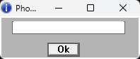

在输入框里随便输入一些内容，点击按钮，你会看到一个弹窗告诉你序列号错误。

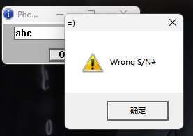

记录几组观察结果：

| 输入       | 结果              |
| ---------- | ----------------- |
| 空         | 弹窗 `Wrong S/N#` |
| `test`     | 弹窗 `Wrong S/N#` |
| `12345678` | 弹窗 `Wrong S/N#` |

现在只能确定一件事：程序会根据输入给出成功或失败提示。输入如何被处理、谁决定提示内容，都还不知道；下一步应从已经看见的失败文本开始找代码。

## 静态分析与动态分析

在开始之前，先区分两种分析方式：

- **静态分析**：不运行程序，直接看 exe 里的代码和数据。工具是 IDA Pro。回答的问题是"程序**可能**怎样工作"。
- **动态分析**：运行程序，在运行中观察它做什么。工具是 x64dbg。回答的问题是"程序这一次**实际**怎样执行"。

两种方式不是二选一。实际分析是一个循环：

> 运行观察现象 → 静态寻找线索 → 阅读伪代码和汇编 → 提出推断 → 动态验证 → 回到静态整理

本章会走完这个循环。先在 IDA 里找到关键代码，读懂算法，再去 x64dbg 里验证。如果 x64dbg 里观察到的数据和静态分析推断的不一样，就回去重新看代码。

## 用 IDA 打开程序

打开 IDA Pro，选 File → Open（或直接把 `phox.2.EXE` 拖进 IDA 窗口）。IDA 会弹出一个加载对话框，问你用什么格式解析这个文件。

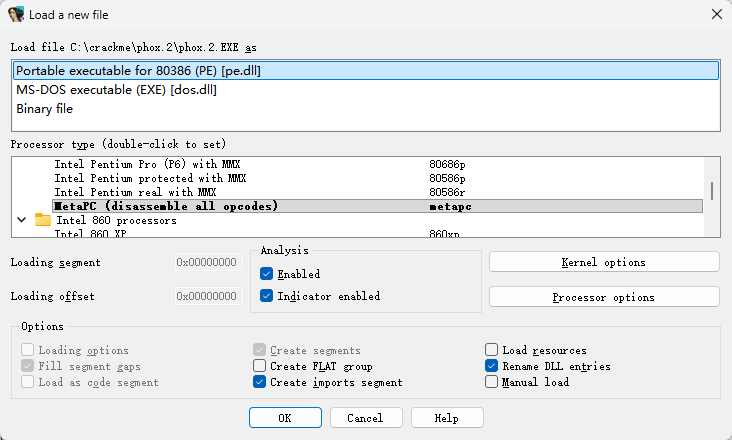

这个对话框的几个关键项：

- **Processor type** 显示 `metapc`，表示 IDA 识别出这是 Intel x86/x64 架构。PE 格式的程序会自动识别，你不需要手动选。
- **Create imports segment** — 创建一个专门的段存放导入表信息，这样后面才能在 Imports 窗口看到程序调用了哪些系统函数。
- **Rename DLL entries** — 给 DLL 导入函数自动起名，比如把 `USER32.dll` 里第 532 号序号对应的函数标记成 `MessageBoxA`。
- **Load resources** — 加载程序的资源段（对话框、图标、字符串表等）。
- **Analysis** 勾选后，IDA 在加载完成后自动开始反汇编和识别函数。

保持默认选项，点 OK。IDA 会自动做一轮分析——底部状态栏会显示"Analyzing..."，等它变成"Idle"就完成了。这个程序很小，几秒钟就分析完。

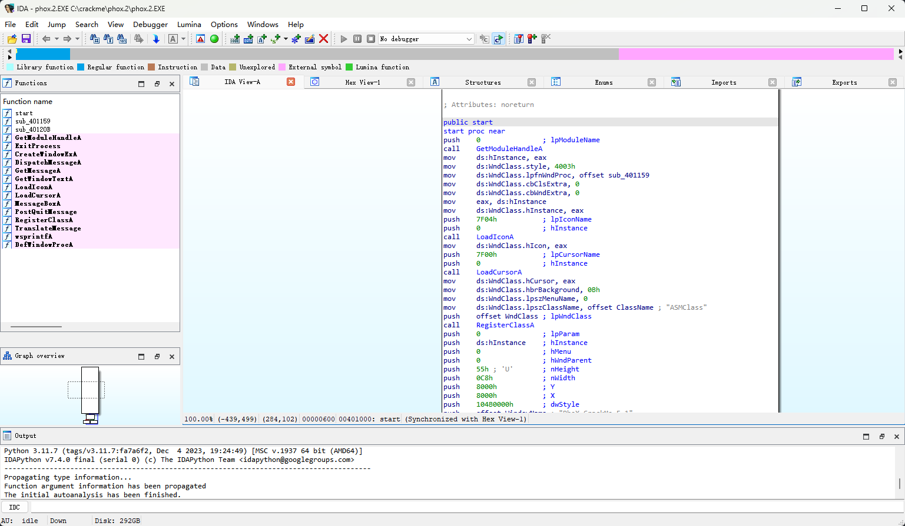

分析完成后，IDA 把程序的机器码翻译成了汇编，你可以像读文本一样浏览。这里只介绍本章需要用到的功能，不罗列所有菜单。

**反汇编视图**（`IDA View-A`）是 IDA 的主界面，每行一条汇编指令。你现在不需要看懂每一行，只需要知道：地址在左边，指令在右边。

**Strings 窗口**（快捷键 `Shift+F12`）列出程序中所有可识别的字符串。这是找线索的第一个入口。

**Imports 窗口**（在 View → Open subviews → Imports）列出程序调用的系统函数。这是第二个入口。

**交叉引用**（Xref）：在某个地址上按 `X` 键，IDA 会列出所有引用了这个位置的地方。这是追调用关系的核心功能。

**函数图**（快捷键 `空格` 在文本视图和图形视图之间切换）把一个函数的控制流画成块状图，分支和跳转一目了然。

**F5 伪代码**（快捷键 `F5`）把汇编反编译成接近 C 的伪代码。这是 IDA 最强的功能，但记住：伪代码不是源码，变量名是 `v1`、`v2`，有些结构会被还原错。

下面从最直接的线索开始：搜索字符串。

## 从失败字符串开始

按 `Shift+F12` 打开 Strings 窗口。这个程序只有 7 个字符串，一眼就能看完：

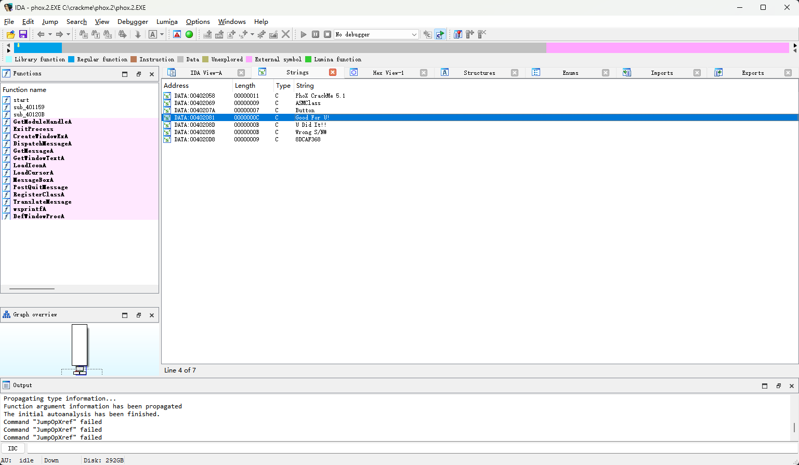

| 地址       | 内容               |
| ---------- | ------------------ |
| `0x402058` | `PhoX CrackMe 5.1` |
| `0x402069` | `ASMClass`         |
| `0x40207a` | `Button`           |
| `0x402081` | `Good For U!`      |
| `0x40208d` | `U Did It!!`       |
| `0x40209b` | `Wrong S/N#`       |
| `0x4020d8` | `8DCAF368`         |

这份 Strings 输出没有列出 `Ok`，但这不等于文件中不存在这段短文本。Strings 窗口的显示结果受当前识别和筛选条件影响；后面查看 `CreateWindowExA` 的参数时，会直接确认 `offset aOk ; "Ok"` 的实际用途。

先不要急着给这些字符串下定义。仅从 Strings 窗口能确定它们存在于文件中，不能确定它们是窗口类名、控件标题还是计算常量。先把和刚才运行现象有关的文本作为线索：

- `Wrong S/N#` — 失败时弹窗显示的文字
- `U Did It!!` — 成功时弹窗显示的文字
- `Good For U!` — 成功弹窗的标题
- `8DCAF368` — 一个尚不清楚用途的 8 字符十六进制文本

现在才有理由测试最后这条字符串：在程序输入框中原样输入 `8DCAF368`，结果仍是 `Wrong S/N#`。这说明“文件中出现的字符串”和“可以直接输入的序列号”不是同一个概念。它可能是比较目标、格式化结果或根本未被使用；在跟踪引用前，不能再下结论。

双击 `Wrong S/N#`，IDA 跳到这个字符串在数据段中的位置（`0x40209b`）。现在要找的是"谁引用了这个字符串"——也就是哪段代码把这个地址 push 进去准备显示弹窗。

在字符串地址上按 `X` 键，IDA 弹出交叉引用列表：

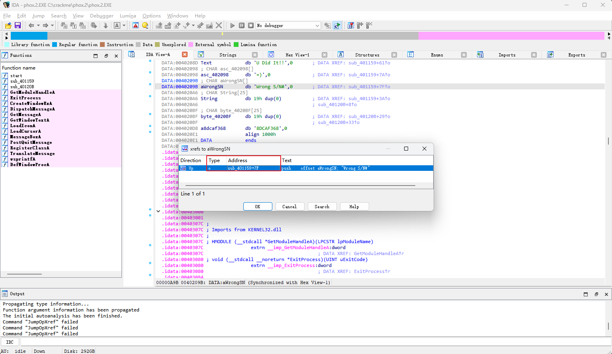

弹窗标题 `Xrefs to aWrongSN` 的意思是“有哪些位置引用了当前的数据项 `aWrongSN`”。表格的每一行就是一条引用；这里仅有一行，来自 `0x4011D8`。IDA 将它显示为 `sub_401159+7F`，即函数 `sub_401159` 开头加上 `0x7F` 的偏移。

| 字段        | 当前行的值             | 含义                                                         |
| ----------- | ---------------------- | ------------------------------------------------------------ |
| `Direction` | `Up`                   | 引用指令位于当前字符串地址之前，也就是地址更小的位置。       |
| `Type`      | `o`                    | `offset` 数据引用：指令操作数直接包含这个数据项的地址。      |
| `Address`   | `sub_401159+7F`        | 引用发生的位置；换算后就是 `0x4011D8`。                      |
| `Text`      | `push offset aWrongSN` | IDA 对该位置指令的简短显示，说明它把 `aWrongSN` 的地址压栈。 |

这里的 `o` 不是函数调用或跳转。`push offset aWrongSN` 压入的是字符串 `Wrong S/N#` 的地址 `0x40209B`，不是字符串字符本身；谁接收这个地址、如何使用它，要继续看这条指令后面的代码。

双击这一行，IDA 跳到 `0x4011D1`。你会看到这样的代码（注释是加的）：

```asm
CODE:004011D1 ; ---------------------------------------------------------------------------
CODE:004011D1
CODE:004011D1 loc_4011D1:                             ; CODE XREF: sub_401159+58↑j
CODE:004011D1                 push    30h ; '0'       ; uType
CODE:004011D3                 push    offset asc_402098 ; "=)"
CODE:004011D8                 push    offset aWrongSN ; "Wrong S/N#"
CODE:004011DD                 push    ds:hWndParent   ; hWnd
CODE:004011E3                 call    MessageBoxA
CODE:004011E8                 pop     esi
CODE:004011E9                 pop     edi
CODE:004011EA                 pop     ebx
CODE:004011EB                 leave
CODE:004011EC                 retn    10h
CODE:004011EF ; ---------------------------------------------------------------------------
```

上下看到单独的 `;` 后跟一串 `-` 时，这是 IDA 的显示分隔线，不是指令或机器码；这里分别标出跳转目标块的开始和 `retn` 后的路径结束。

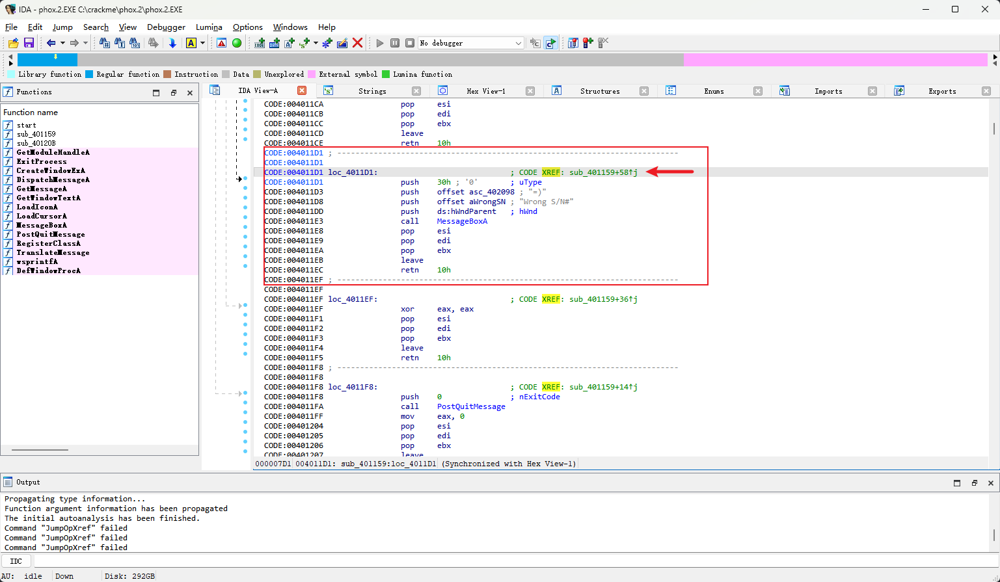

这就是失败弹窗的代码。注意第一行的 `CODE XREF: sub_401159+58↑j`——IDA 告诉你有一条跳转指令指向这里，来源是 `sub_401159` 内偏移 `0x58` 处。**双击 `sub_401159+58↑j` 这个链接**，IDA 会跳转到那条跳转指令所在的位置，你就能看到失败分支是在什么条件下被触发的。

## 从失败分支提出消息分派假设

双击 `sub_401159+58↑j` 后，IDA 跳到 `0x4011B1` 的 `jnz loc_4011D1`。现在能确定的是：某次比较失败时会跳到刚才的失败弹窗；比较成功则继续执行另一条路径。

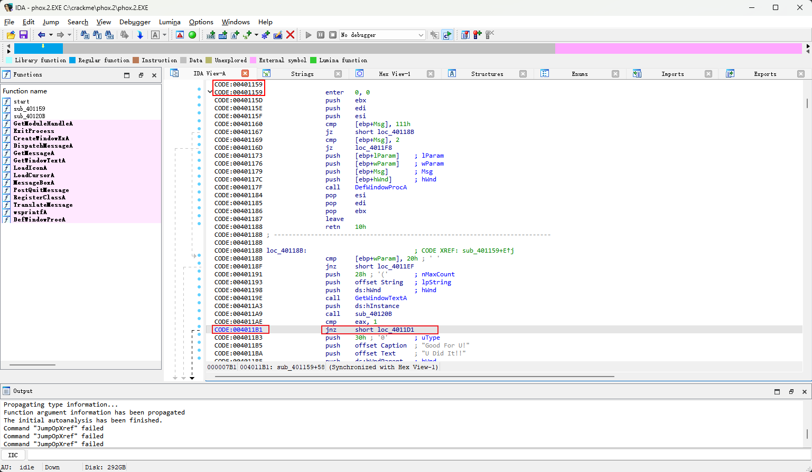

要知道什么条件会进入这段代码，先暂停追踪成功路径，跳到 `sub_401159` 的函数开头。在函数名上双击，或按 `G` 输入 `0x401159`。函数开头先比较几个参数，再决定是否跳到 `loc_40118B`；这比直接猜测 `0x4011B1` 的业务含义更可靠。

这里先看 `sub_401159` 如何使用自己的四个栈参数，并把它们原样转交给 `DefWindowProcA`：

```asm
CODE:00401152 ; ---------------------------------------------------------------------------
CODE:00401152
CODE:00401152 loc_401152:                             ; CODE XREF: start+13A↑j
CODE:00401152                 push    0               ; uExitCode
CODE:00401154                 call    ExitProcess
CODE:00401154 start           endp
CODE:00401154
CODE:00401159
CODE:00401159 ; =============== S U B R O U T I N E =======================================
CODE:00401159
CODE:00401159 ; Attributes: bp-based frame
CODE:00401159
CODE:00401159 ; int __stdcall sub_401159(HWND hWnd, UINT Msg, WPARAM wParam, LPARAM lParam)
CODE:00401159 sub_401159      proc near               ; DATA XREF: start+16↑o
CODE:00401159
CODE:00401159 hWnd            = dword ptr  8
CODE:00401159 Msg             = dword ptr  0Ch
CODE:00401159 wParam          = dword ptr  10h
CODE:00401159 lParam          = dword ptr  14h
CODE:00401159
CODE:00401159                 enter   0, 0
CODE:0040115D                 push    ebx
CODE:0040115E                 push    edi
CODE:0040115F                 push    esi
CODE:00401160                 cmp     [ebp+Msg], 111h
CODE:00401167                 jz      short loc_40118B
CODE:00401169                 cmp     [ebp+Msg], 2
CODE:0040116D                 jz      loc_4011F8
CODE:00401173                 push    [ebp+lParam]    ; lParam
CODE:00401176                 push    [ebp+wParam]    ; wParam
CODE:00401179                 push    [ebp+Msg]       ; Msg
CODE:0040117C                 push    [ebp+hWnd]      ; hWnd
CODE:0040117F                 call    DefWindowProcA
CODE:00401184                 pop     esi
CODE:00401185                 pop     edi
CODE:00401186                 pop     ebx
CODE:00401187                 leave
CODE:00401188                 retn    10h
CODE:0040118B ; ---------------------------------------------------------------------------
```

不要因为 IDA 显示了 `Msg` 就把它当作已经证明的事实：机器码里没有变量名，`Msg` 是 IDA 为栈偏移加上的显示标签。如果你的数据库还没有这个标签，它会显示为 `[ebp+0C]`，两者是同一个位置。

这里的推导来自 `DefWindowProcA` 的参数转发。Windows 文档给出的原型是 `DefWindowProcA(HWND, UINT, WPARAM, LPARAM)`。

x86 `stdcall` 按反序压栈。因此，`call` 前的四条 `push` 对应为：`[ebp+8]` -> `hWnd`、`[ebp+0C]` -> `Msg`、`[ebp+10]` -> `wParam`、`[ebp+14]` -> `lParam`。

`retn 10h` 进一步说明调用者为 4 个 32 位参数清栈。综合这些证据，我们先把 `sub_401159` 作为**疑似窗口过程**，再检查其中的值和控件创建代码。

Windows 文档或 `WinUser.h` 给出常量名：`0x111` 是 `WM_COMMAND`，`0x2` 是 `WM_DESTROY`。这些名称来自系统 API，不是 IDA 自动猜出的；下面的跳转目标才说明样本如何处理它们：

| 消息值  | 含义                                   | 程序做什么                                      |
| ------- | -------------------------------------- | ----------------------------------------------- |
| `0x111` | `WM_COMMAND`（菜单、加速键或控件通知） | 比较第三个参数，读取窗口文本并调用 `sub_40120B` |
| `0x2`   | `WM_DESTROY`（窗口关闭）               | 调用 `PostQuitMessage` 退出                     |

其他所有消息都交给 `DefWindowProcA`——这是 Windows 提供的默认处理函数，你不用管。

Windows 文档规定：`WM_COMMAND` 的 `wParam` 由两个字段组合成一个 32 位值，低 16 位保存菜单、加速键或控件的 ID；高 16 位在菜单命令时为 `0`、加速键命令时为 `1`、控件通知时才保存通知码。这是消息协议，不是从当前样本的某个运行时值推出来的。

### 追踪控件创建代码

接下来从 `Button` 的交叉引用出发，检查控件是怎样创建的：

1. 在 Strings 窗口双击 `Button`，再按 `X` 查看引用它的代码。这样先从已知数据出发，比在大量 `CreateWindowExA` 调用中盲找更快。
2. 双击每条 xref，寻找其后的 `call CreateWindowExA`。如果没有直接到达该调用，继续沿当前函数的调用关系查看；控件也可能通过包装函数或对话框资源创建，不能强行套用这一条路径。
3. 找到调用后，从 `call CreateWindowExA` 向上看参数。x86 的 `stdcall` 按反序压栈：离 `call` 最近的第 1 个 `push` 是 `dwExStyle`，第 2 个是 `lpClassName`，第 3 个是 `lpWindowName`，第 10 个才是 `hMenu`。
4. `lpClassName` 为 `Button` 时，可以确认这是标准按钮控件；第 10 个参数为 `0x20` 时，可以确认它是该子控件的 ID。只有当第 3 个参数明确指向 `Ok` 时，才能静态证明 `Ok` 是这个控件的标题。

本样本的调用中，第 3 个参数显示为 `offset aOk ; "Ok"`，第 10 个参数为 `20h`。因此可以静态确认：这里创建的是标题为 `Ok`、控件 ID 为 `0x20` 的 `Button`。

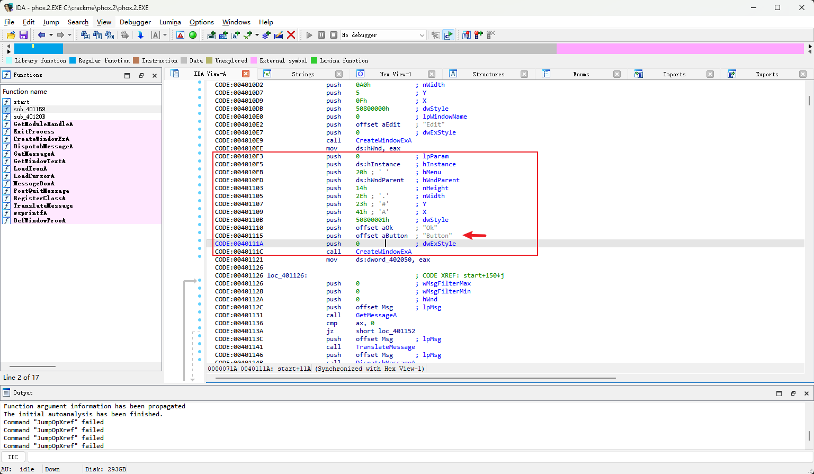

### 在 x32dbg 中验证消息

静态代码只能告诉我们程序检查什么条件。现在让程序实际运行一次，确认点击窗口中的 `Ok` 后传入的消息和参数。

1. 在 IDA 回到 `sub_401159`，跟随 `Msg == 0x111` 的跳转到 `loc_40118B`，记下首条指令地址 `0x40118B`。
2. 用 x32dbg 打开样本，按 `Ctrl+G` 跳到 `0x40118B`，按 `F2` 设置断点。
3. 在 Breakpoints 窗口右键这个断点，选择 Edit breakpoint。在 Condition 中输入 `dword:[ebp+10] == 0x20`，保存。这个条件读取运行时的第三个参数；不等于 `0x20` 的消息会自动继续运行，不会暂停窗口。

![x32dbg 编辑 0x40118B 断点：条件为 dword:[ebp+10] == 0x20](cracking-1-images/x32dbg-wm-command-breakpoint-condition.png)

4. 按 `F9` 运行样本，在输入框键入 `test`，再点击 `Ok`。此时才会在 `0x40118B` 断下。
5. 确认当前指令显示为 `cmp dword ptr ss:[ebp+0x10], 0x20`，尚未执行。记下寄存器窗口中的 `EBP`。
6. 在 Dump 窗口的地址栏分别输入 `ebp+C` 和 `ebp+10`，按 DWORD 查看这两个位置的值。前者是 `Msg`，后者是 `wParam`；Dump 中的字节按小端序显示，不要从左到右直接把四个字节当作十六进制数读取。

> [!NOTE]
> 如果 `Ctrl+G` 无法跳到 `0x40118B`，程序可能因 ASLR 在运行时换了装载基址。IDA 的 `0x40118B` 减去默认映像基址 `0x400000`，得到相对偏移 `0x118B`。在 x32dbg 中输入 `phox.2.exe+0x118B`，调试器会用当前 `phox.2.exe` 的实际装载基址加上这个偏移，定位到同一条指令。

这次运行若显示 `Msg = 0x00000111`、`wParam = 0x00000020`，就把它与前面的控件创建证据对应起来：当前点击产生了 `WM_COMMAND`，其低 16 位 ID 为 `0x20`，高 16 位通知码为 `0`。

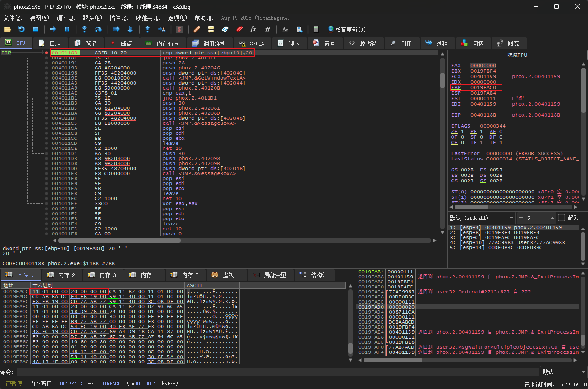

完成这两项检查后，才可以确认：`sub_401159` 是这个窗口的窗口过程，点击 `Ok` 会以 `WM_COMMAND` 进入 `loc_40118B`，并让 `sub_40120B` 的返回值决定成功或失败。

在 x32dbg 中记录这两个值后，切回 IDA 的文本视图。从这里开始重新查看静态代码：现在将 `sub_401159` 重命名为 `window_proc`；`sub_40120B` 仍先保留原名。

接着查看 `window_proc` 开头的消息分派。在前面的 IDA 文本视图中，`0x401160` 的 `cmp [ebp+Msg], 111h` 将 `Msg` 与 `0x111` 比较；紧随其后的 `0x401167` 指令 `jz short loc_40118B` 会在两者相等时跳转。因此，`jz short loc_40118B` 跳入的路径就是 `WM_COMMAND` 分支。

在 IDA 中双击这行的 `loc_40118B`，跳到该分支的第一条指令。`loc_40118B` 只是 `window_proc` 内一个基本块的标签，不是另一个函数。

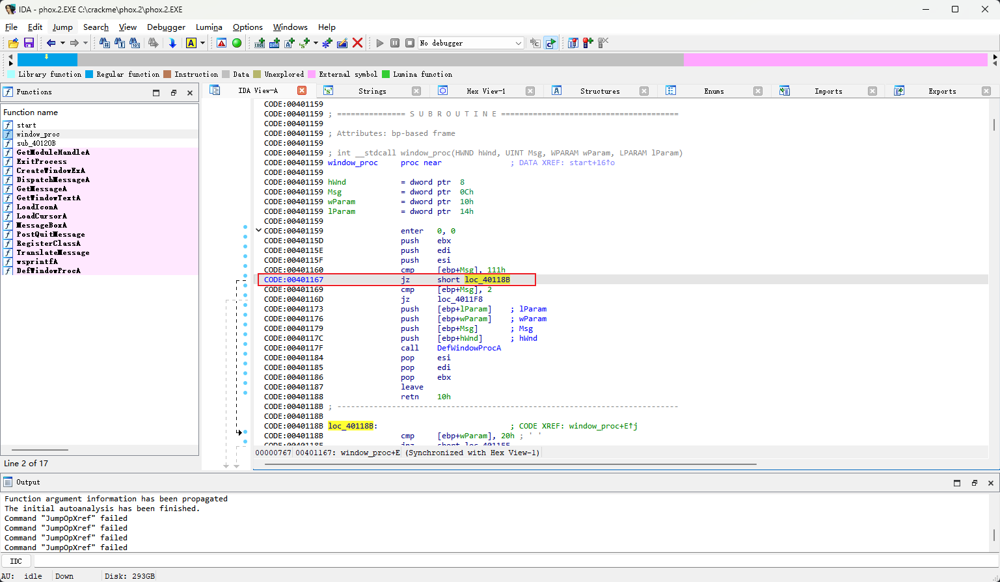

这里的 `cmp [ebp+wParam], 20h` 比较的是完整的 32 位第三参数。函数开头把 `wParam` 定义为 `dword ptr 10h`，因此这条指令等价于比较 `[ebp+10h]` 是否为 `0x00000020`；静态分析在这里能证明的是分支条件，而不是某次点击实际传入了这个值。

按 `WM_COMMAND` 的规则，`0x00000020` 表示低 16 位为 `0x20`、高 16 位为 `0`。它可能来自 ID 为 `0x20` 且通知码为 `0` 的按钮点击，也可能来自 ID 为 `0x20` 的菜单命令。上面的控件创建检查和运行时断点，正是为了确认本程序中的实际来源。

这个分支的逻辑已经很清楚了：

1. 检查 `WM_COMMAND` 的完整 `wParam` 是否为 `0x20`。
2. 用 `GetWindowTextA` 把控件文本写入全局缓冲区 `String`。
3. 调用 `sub_40120B`，其返回值决定后续提示。
4. 返回值是 1 → 弹出成功对话框；否则 → 弹出失败对话框。

关键点在 `sub_40120B`。目前只知道它是候选判定函数：成功或失败由它的返回值分流；是否真的检查序列号，仍要分析函数内部。

下面这张图概括了从用户点击按钮到弹出结果的全过程：

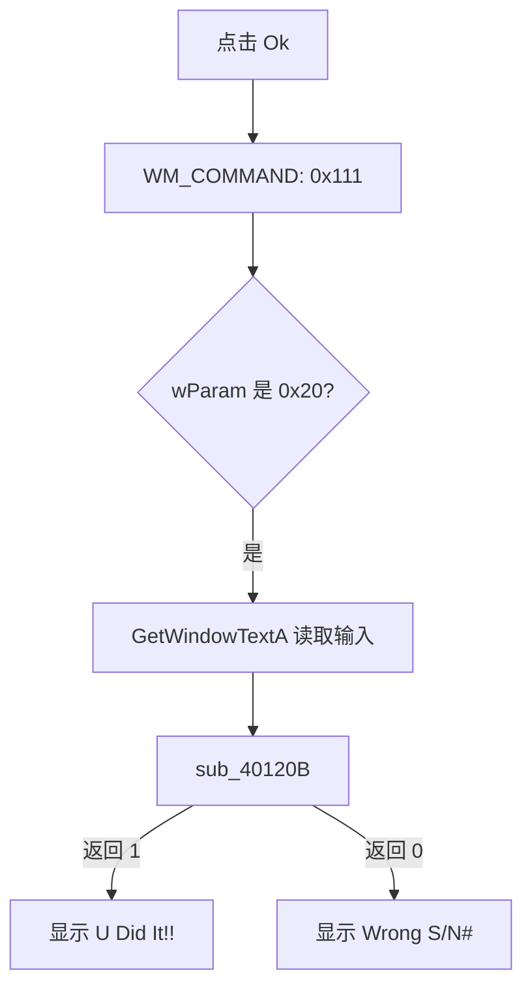
```mermaid
flowchart TD
  A[点击 Ok] --> B[WM_COMMAND: 0x111]
  B --> C{"wParam 是 0x20?"}
  C -->|是| D[GetWindowTextA 读取输入]
  D --> E[sub_40120B]
  E -->|返回 1| F[显示 U Did It!!]
  E -->|返回 0| G[显示 Wrong S/N#]
```

这张图的重点是已经确认的消息到函数映射：`WM_COMMAND` 不是验证本身，但它把“点击 Ok”连接到了读取文本、调用候选判定函数和显示结果的三步。

## 沿调用关系找到候选判定函数

在 IDA 中双击 `sub_40120B` 或在地址 `0x40120B` 上按 `G` 键输入地址跳过去。这是下一步要判断用途的候选函数。

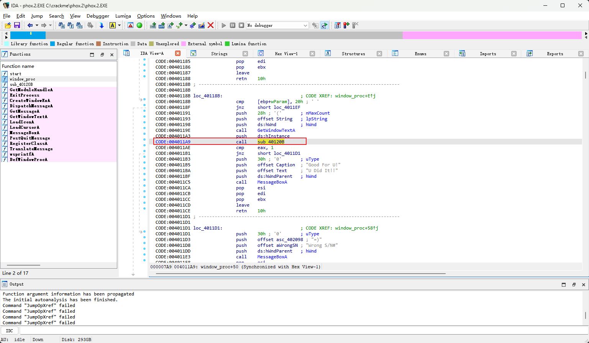

你也可以按 `空格` 切到图形视图。图形视图把函数分成基本块，箭头表示跳转方向；这个小函数中，最显眼的回边就是后面要分析的字符循环。不过这里先保持文本视图，完整的循环指令和后续的逐字节比较会更容易对照。

目前的调用关系只能证明：`sub_40120B` 的返回值决定后续显示成功还是失败。它究竟读取了什么数据、进行了什么计算，下一节再从函数内部逐步确认。

## 从导入函数交叉验证

刚才从字符串路线找到了候选判定路径。现在换一条路：从导入函数出发，检查这些 API 是否指向同一处。

在 View → Open subviews → Imports 打开导入表窗口：

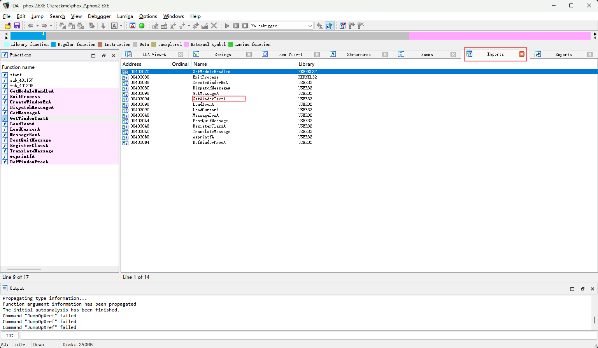

这个程序只导入了 14 个函数，来自 `KERNEL32.dll` 和 `USER32.dll`。前面失败分支中的 `MessageBoxA` 调用把 `Wrong S/N#` 作为弹窗正文显示；成功分支也通过同一个 API 显示成功文字。也就是说，可见的成功或失败提示由 `MessageBoxA` 发出，`sub_40120B` 只负责返回判定结果。现在从另外两个 API 出发，交叉验证输入读取和候选判定函数的调用关系：

| 导入函数         | 本次追踪目的               |
| ---------------- | -------------------------- |
| `GetWindowTextA` | 找到读取用户输入的调用点   |
| `wsprintfA`      | 找到格式化计算结果的调用点 |

先双击 `GetWindowTextA`。IDA 会先跳到 `.idata:00403094`：

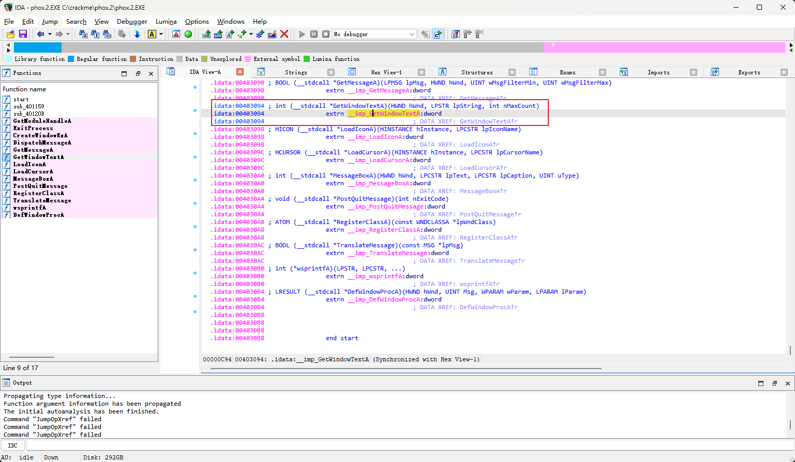

```asm
.idata:00403094 extrn __imp_GetWindowTextA:dword
                         ; DATA XREF: GetWindowTextA↑r
```

这是 IAT（Import Address Table，导入地址表）中为 `GetWindowTextA` 预留的 4 字节槽位。程序装载时，Windows 会把 `USER32.dll` 内真实函数的地址写入这里。

可以把 IAT 看成程序调用外部 API 时使用的地址表。样本代码不直接写死 `USER32.dll` 中 `GetWindowTextA` 的实际地址，而是先跳到自己的导入跳板；跳板再从 IAT 槽位读出真实地址并跳过去。

因此，`.idata:00403094` 不是 `GetWindowTextA` 的函数代码，也不是字符串地址；它只是一个 4 字节位置。程序尚未装载时，这里是待填写的位置；Windows 装载器加载 `USER32.dll` 后，会把真实函数地址填入这里。

最后一行的 `GetWindowTextA↑r` 已经是 IDA 显示出来的数据 xref：它表示 `CODE` 段中的 `GetWindowTextA` 导入跳板读取了这个 IAT 槽位。**直接双击 `DATA XREF: GetWindowTextA↑r` 中的 `GetWindowTextA↑r` 链接**，IDA 会跳到 `CODE:004012A3` 的导入跳板：

```asm
CODE:004012A3 ; =============== S U B R O U T I N E =======================================
CODE:004012A3
CODE:004012A3 ; Attributes: thunk
CODE:004012A3
CODE:004012A3 ; int __stdcall GetWindowTextA(HWND hWnd, LPSTR lpString, int nMaxCount)
CODE:004012A3 GetWindowTextA  proc near               ; CODE XREF: window_proc+45↑p
CODE:004012A3
CODE:004012A3 hWnd            = dword ptr  4
CODE:004012A3 lpString        = dword ptr  8
CODE:004012A3 nMaxCount       = dword ptr  0Ch
CODE:004012A3
CODE:004012A3                 jmp     ds:__imp_GetWindowTextA
CODE:004012A3 GetWindowTextA  endp
CODE:004012A3
```

这条 `jmp` 本身不做输入读取；它只是跳到 Windows 装载器填好的 IAT 地址，最终进入 `USER32.dll` 的真实 `GetWindowTextA`。函数入口处会显示 `CODE XREF: window_proc+45↑p`；这里的偏移是十六进制，所以 `0x401159 + 0x45 = 0x40119E`。**双击 `window_proc+45↑p`**，IDA 会跳到这个真实调用点：

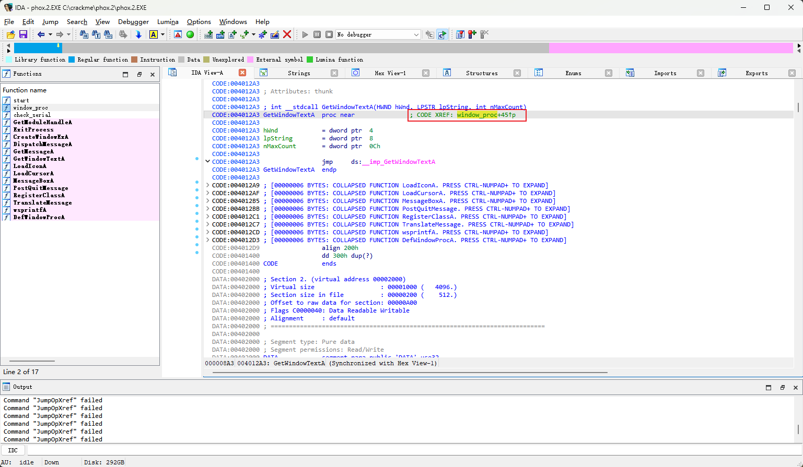

IDA 文本视图在导入跳板的 `GetWindowTextA proc near` 这一行直接显示 `CODE XREF: window_proc+45↑p`。双击上面的链接后，会到达 `window_proc+45`，即 `0x40119E`；它位于已经确认的 `window_proc` 中，并把窗口文本写入 `String`。从 API 出发，你到达了同一个消息分派函数。

这里的入口注释用于快速回到当前显示的调用点。若要确认样本中是否还有其他调用 `GetWindowTextA` 的位置，先跳到 `0x4012A3` 的导入跳板入口，再将光标放在 `GetWindowTextA proc near` 上按 `X`，查看完整的交叉引用列表。

> [!NOTE]
> 本样本通过 `0x4012A3` 的导入跳板调用 `GetWindowTextA`。在 `GetWindowTextA proc near` 上按 `X`，可以查看所有直接调用这个跳板的代码位置。
>
> IAT 槽位 `.idata:00403094` 是另一个地址项；在它上面按 `X`，看到的是读取该槽位的引用。若程序绕过跳板直接调用 IAT，或在运行时经 `GetProcAddress` 获取函数地址，跳板的 xref 列表不一定包含这些调用。

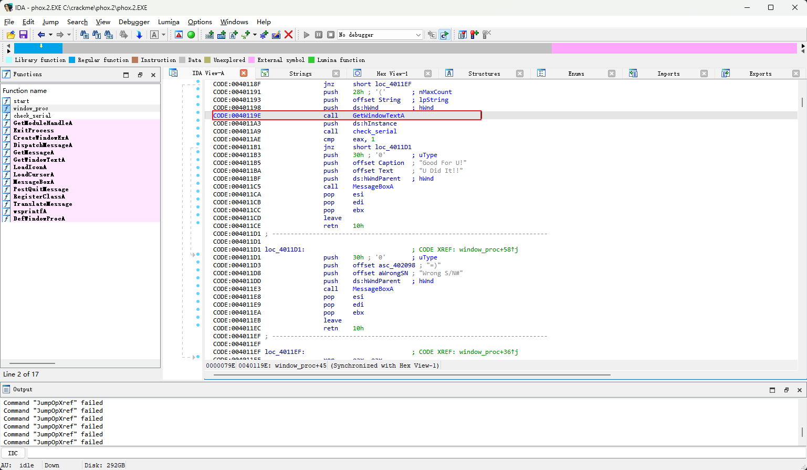

`wsprintfA` 也一样：先在 Imports 窗口双击它，进入它的 `.idata` 槽位；双击其 `DATA XREF` 链接，跳到 `CODE:004012CD` 的导入跳板；再双击入口处的 `CODE XREF`，就会到达真正的调用点。此时若尚未重命名函数，xref 显示为 `sub_40120B+2E↑p`。

> [!NOTE]
> 下面的 `wsprintfA` 跳板和 F5 截图取自后面已经把 `0x40120B` 重命名为 `check_serial` 的 IDA 数据库，所以其中显示 `check_serial`。在本节当前的分析步骤中，它仍是同一地址的 `sub_40120B`。

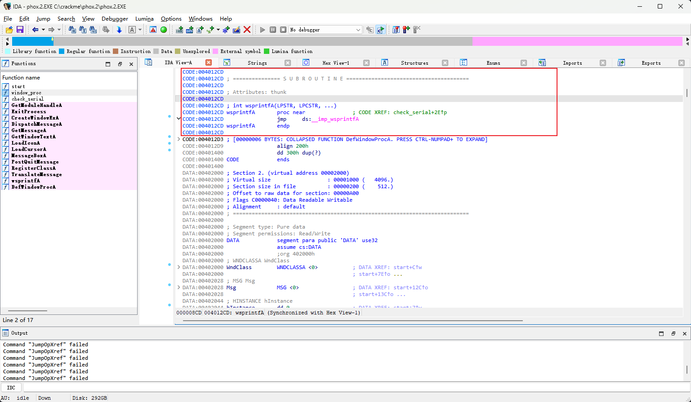

双击后到达的 `0x401239` 位于 `sub_40120B` 内。此时只知道它会格式化某个值；函数是否处理序列号，仍要看内部代码。

这说明一个重要方法：**多条线索指向同一个函数时，应优先分析这个函数。** 字符串路线和 API 路线都把我们带到 `sub_40120B`，所以它是最强的候选。

> [!NOTE]
> 实际逆向时，字符串路线和 API 路线不一定总是都有效。有些程序会加密字符串，有些程序不调用标准 API 而是自己实现比较。所以两条路都要会走，哪条能用用哪条。

## 用 F5 整理验证逻辑

现在定位到 `sub_40120B` 了。把光标放在函数内，按 `F5` 打开 Hex-Rays 伪代码：

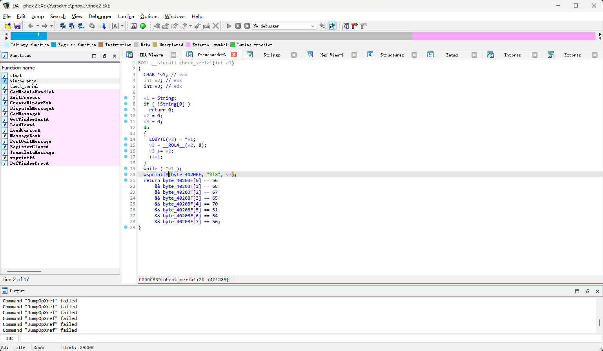

IDA 给出的伪代码大致如下：

```c
BOOL __stdcall sub_40120B(int a1)
{
    CHAR *v1;
    int v2;
    int v3;

    v1 = String;
    if (!String[0])
        return 0;

    v2 = 0;
    v3 = 0;
    do {
        LOBYTE(v2) = *v1;
        v2 = __ROL4__(v2, 8);
        v3 += v2;
        ++v1;
    } while (*v1);

    wsprintfA(byte_4020BF, "%lX", v3);
    return byte_4020BF[0] == 56
        && byte_4020BF[1] == 68
        && byte_4020BF[2] == 67
        && byte_4020BF[3] == 65
        && byte_4020BF[4] == 70
        && byte_4020BF[5] == 51
        && byte_4020BF[6] == 54
        && byte_4020BF[7] == 56;
}
```

把这些十进制数换成十六进制，再按 ASCII 解读：

| F5 显示 | 十六进制 | ASCII |
| ------- | -------- | ----- |
| `56`    | `0x38`   | `8`   |
| `68`    | `0x44`   | `D`   |
| `67`    | `0x43`   | `C`   |
| `65`    | `0x41`   | `A`   |
| `70`    | `0x46`   | `F`   |
| `51`    | `0x33`   | `3`   |
| `54`    | `0x36`   | `6`   |
| `56`    | `0x38`   | `8`   |

所以这 8 次比较要验证的目标文本正是 `8DCAF368`。这不是 IDA 自动拼出的字符串，而是我们依据数值和 ASCII 自己还原出的结论。

先不要急着逐行读汇编。F5 已经给出了这个函数的整体形状：

1. 空输入直接失败。
2. 逐个读取输入字符，循环更新两个整数。
3. 把最终整数按十六进制格式化成文本。
4. 把格式化文本逐个字节与 8 个常量比较。

这正是 F5 的价值：先把几十条汇编压缩成四步高层逻辑。接下来再回到汇编，确认每一步到底做了什么。

> [!IMPORTANT]
> 不要把 F5 当源码。`a1` 在这个函数中根本没有被使用；`v1`、`v2`、`v3` 也只是 IDA 自动起的临时名字。最后 8 个比较在 F5 中显示为 `56`、`68` 等整数，原因是原始代码逐字节比较了立即数，并没有引用一个完整字符串。F5 能正确恢复控制流，但变量名、类型和业务语义仍要靠你自己核对汇编后补上。

### 确认判定函数

到这里，证据已经闭合：`window_proc` 先用 `GetWindowTextA` 把用户输入写入 `String`，再调用 `sub_40120B`；`sub_40120B` 逐字符计算输入、将结果格式化为十六进制文本，并用比较结果决定返回值。因此可以确认它承担序列号判定职责。

在 IDA 中将光标放在函数名 `sub_40120B` 上，按 `N`，输入 `check_serial` 后确认。IDA 会把该函数的所有引用同步更新；从这里开始，正文用 `check_serial` 指代它。

## 分析序列号算法

先看函数开头和循环。下面的指令都在 `check_serial` 内：

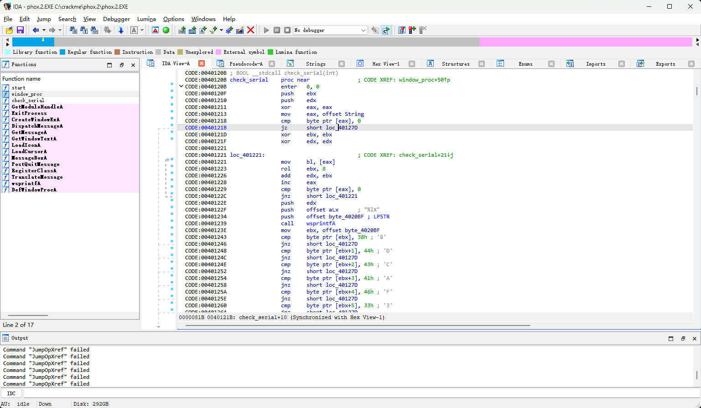

```asm
CODE:00401211                 xor     eax, eax
CODE:00401213                 mov     eax, offset String
CODE:00401218                 cmp     byte ptr [eax], 0
CODE:0040121B                 jz      short loc_40127D
CODE:0040121D                 xor     ebx, ebx
CODE:0040121F                 xor     edx, edx
CODE:00401221
CODE:00401221 loc_401221:                             ; CODE XREF: check_serial+21↓j
CODE:00401221                 mov     bl, [eax]
CODE:00401223                 rol     ebx, 8
CODE:00401226                 add     edx, ebx
CODE:00401228                 inc     eax
CODE:00401229                 cmp     byte ptr [eax], 0
CODE:0040122C                 jnz     short loc_401221
```

这段循环最容易看错的地方是 `mov bl, [eax]`。它只改 `ebx` 的最低 8 位 `bl`，高 24 位会保留上一次循环留下的内容。紧接着的 `rol ebx, 8` 对整个 32 位值执行**循环左移** 8 位。因此它不是简单的"把字符左移 8 位后相加"，而是一个带状态的滚动计算。

把每轮循环抽象成伪代码，就是：

```c
ebx = (ebx & 0xFFFFFF00) | (unsigned char)*p;
ebx = (ebx << 8) | (ebx >> 24);  // ROL ebx, 8
edx += ebx;
p++;
```

例如把第一个字符记作 `c1` 时，初始 `ebx = 0`：

```asm
mov bl, c1        EBX = 0x000000c1
rol ebx, 8        EBX = 0x0000c100
add edx, ebx      EDX += 0x0000c100
```

最后一行的 `EDX` 只表示这轮将 `0x0000c100` 加入原有累计值；具体数值要等拿到实际字符后再计算。下一轮读取 `c2` 时，之前的 `ebx` 不会清零：

```asm
mov bl, c2        EBX = 0x0000c1c2
rol ebx, 8        EBX = 0x00c1c200
add edx, ebx      EDX += 0x00c1c200
```

这就是后面动态调试时重点观察 `ebx` 和 `edx` 的原因。

循环结束后，程序没有直接把 `edx` 和某个整数比较，而是调用 `wsprintfA`：

```asm
CODE:0040122E                 push    edx
CODE:0040122F                 push    offset aLx      ; "%lX"
CODE:00401234                 push    offset byte_4020BF ; LPSTR
CODE:00401239                 call    wsprintfA
CODE:0040123E                 mov     ebx, offset byte_4020BF
```

`%lX` 表示把 32 位无符号整数格式化为大写十六进制文本。例如 `edx = 0x8DCAF368` 时，缓冲区会写入 ASCII 字符串 `"8DCAF368"`。

接下来是八组几乎相同的比较：

```asm
CODE:0040123E                 mov     ebx, offset byte_4020BF
CODE:00401243                 cmp     byte ptr [ebx], 38h ; '8'
CODE:00401246                 jnz     short loc_40127D
CODE:00401248                 cmp     byte ptr [ebx+1], 44h ; 'D'
CODE:0040124C                 jnz     short loc_40127D
CODE:0040124E                 cmp     byte ptr [ebx+2], 43h ; 'C'
CODE:00401252                 jnz     short loc_40127D
CODE:00401254                 cmp     byte ptr [ebx+3], 41h ; 'A'
CODE:00401258                 jnz     short loc_40127D
CODE:0040125A                 cmp     byte ptr [ebx+4], 46h ; 'F'
CODE:0040125E                 jnz     short loc_40127D
CODE:00401260                 cmp     byte ptr [ebx+5], 33h ; '3'
CODE:00401264                 jnz     short loc_40127D
CODE:00401266                 cmp     byte ptr [ebx+6], 36h ; '6'
CODE:0040126A                 jnz     short loc_40127D
CODE:0040126C                 cmp     byte ptr [ebx+7], 38h ; '8'
CODE:00401270                 jnz     short loc_40127D
CODE:00401272                 mov     eax, 1
CODE:00401277                 pop     edx
CODE:00401278                 pop     ebx
CODE:00401279                 leave
CODE:0040127A                 retn    4
CODE:0040127D ; ---------------------------------------------------------------------------
```

每个字符都相等才会执行 `mov eax, 1`，随后走到函数尾部返回；任意一处不相等都会跳到 `loc_40127D` 的失败路径。

现在回到最开始打开的 Strings 窗口。找到独立的 `"8DCAF368"` 字符串（地址 `0x4020D8`）后按 `X`；它没有交叉引用。刚才的八条 `cmp` 也没有引用这个地址，而是把 `8`、`D`、`C`、`A`、`F`、`3`、`6`、`8` 的 ASCII 值分别写进立即数。

这解释了最初直接输入 `8DCAF368` 为什么失败：它是程序想要得到的**比较目标文本**，不是应当直接输入的序列号。程序先对用户输入进行计算，再把计算结果格式化为文本，最后才比较这个文本。Strings 窗口中的同名字符串只是线索，并没有参与这段验证代码。

下面的图把函数中的数据变化串起来。它解释的是数据从输入到比较的去向，而不是函数调用顺序。

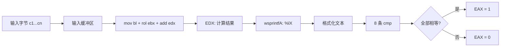
```mermaid
flowchart LR
  A["输入字节 c1...cn"] --> B["输入缓冲区"]
  B --> C["mov bl + rol ebx + add edx"]
  C --> D["EDX: 计算结果"]
  D --> E["wsprintfA: %lX"]
  E --> F["格式化文本"]
  F --> G["8 条 cmp"]
  G --> H{"全部相等?"}
  H -->|是| I["EAX = 1"]
  H -->|否| J["EAX = 0"]
```

## 从目标反推四个输入字符

前面的循环以 NUL 字节 `0` 作为结束条件，没有检查输入长度；因此函数本身允许任意数量的非 NUL 字符。为了构造一个可以手算验证的输入，这里人为限定输入恰好为四个字符。

这样做的原因是：目标结果 `0x8DCAF368` 恰好有四个字节，我们也恰好有四个未知输入字节 `c1`、`c2`、`c3`、`c4`。这一小节的目标是构造一个有效的四字符输入，不证明其他长度不存在可通过的输入。

把四个字符依次记作 `c1`、`c2`、`c3`、`c4`。按前面的 `mov bl` 和 `rol ebx, 8` 规则，四轮参与 `EDX` 累加的 `EBX` 值依次是：

```text
0x0000c100
0x00c1c200
0xc1c2c300
0xc2c3c4c1
```

先确认为什么要反推 `EDX`。循环中的 `add edx, ebx` 每轮都把计算结果累加到 `EDX`；循环结束后，程序又执行 `push edx`，将它作为 `%lX` 要格式化的数值传给 `wsprintfA`。后面的八条 `cmp` 要求格式化后的文本为 `8DCAF368`，因此循环结束时需要满足 `EDX = 0x8DCAF368`。

不能一看到目标中的 `0x8D` 就直接写 `0x8D - 0x68`。先要弄清楚：四次 `add` 之后，`EDX` 的每个字节分别装着哪些字符的累加和。

先暂时按“各字节之间没有进位”列出四轮 `add` 后的字节内容；后面会用真实数值验证这个前提。字节按照从高到低的顺序排列：

| `add` 后 | 字节 3    | 字节 2         | 字节 1              | 字节 0 |
| -------- | --------- | -------------- | ------------------- | ------ |
| 第 1 轮  | `00`      | `00`           | `c1`                | `00`   |
| 第 2 轮  | `00`      | `c1`           | `c1 + c2`           | `00`   |
| 第 3 轮  | `c1`      | `c1 + c2`      | `c1 + c2 + c3`      | `00`   |
| 第 4 轮  | `c1 + c2` | `c1 + c2 + c3` | `c1 + c2 + c3 + c4` | `c1`   |

`rol ebx, 8` 让已读入的字符每轮向高位移动一个字节。因此最终目标的四个字节不能按从高到低的顺序直接阅读，而应按“累计了几个字符”的顺序阅读：最低字节 `68` 是 `c1`，最高字节 `8D` 是 `c1 + c2`，次高字节 `CA` 是 `c1 + c2 + c3`，次低字节 `F3` 是 `c1 + c2 + c3 + c4`。

现在减法的含义就明确了：新的累计和减去上一次累计和，差值就是新加入的字符。

| 要找的输入字节 | 已知累计和                 | 计算          | 结果   |
| -------------- | -------------------------- | ------------- | ------ |
| `c1`           | `c1 = 0x68`                | `0x68`        | `0x68` |
| `c2`           | `c1 + c2 = 0x8D`           | `0x8D - 0x68` | `0x25` |
| `c3`           | `c1 + c2 + c3 = 0xCA`      | `0xCA - 0x8D` | `0x3D` |
| `c4`           | `c1 + c2 + c3 + c4 = 0xF3` | `0xF3 - 0xCA` | `0x29` |

这里的减法只是为了反过来求 `add edx, ebx` 每次新加进来的一个字符；程序运行时仍然只执行加法。

还必须检查刚才暂定的“没有进位”是否成立。四个累计和依次是 `0x68`、`0x8D`、`0xCA`、`0xF3`，全部小于 `0x100`。因此每个字节内的加法都没有溢出到相邻高位，表中的字节关系对这个输入确实成立。如果某个累计和达到 `0x100`，就会产生进位，不能再用这种逐字节的减法倒推。

现在四个真实输入字节已经得到：`68 25 3D 29`。把它们代回四轮循环，`EBX` 和 `EDX` 的实际变化如下：

| 轮次 | 本轮 `rol` 后的 `EBX` | 执行 `add edx, ebx` 后的 `EDX` |
| ---- | --------------------- | ------------------------------ |
| 1    | `0x00006800`          | `0x00006800`                   |
| 2    | `0x00682500`          | `0x00688D00`                   |
| 3    | `0x68253D00`          | `0x688DCA00`                   |
| 4    | `0x253D2968`          | `0x8DCAF368`                   |

最终 `EDX` 正好等于目标值 `0x8DCAF368`。四个输入字节 `68 25 3D 29` 按 ASCII 解读就是 `h%=)`，因此它是一个静态推导出的候选输入。

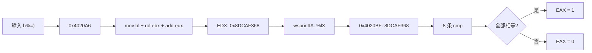
```mermaid
flowchart LR
  A["输入 h%=)"] --> B["0x4020A6"]
  B --> C["mov bl + rol ebx + add edx"]
  C --> D["EDX: 0x8DCAF368"]
  D --> E["wsprintfA: %lX"]
  E --> F["0x4020BF: 8DCAF368"]
  F --> G["8 条 cmp"]
  G --> H{"全部相等?"}
  H -->|是| I["EAX = 1"]
  H -->|否| J["EAX = 0"]
```

下一节用动态调试确认程序运行时确实按这个过程计算。

## 用 x32dbg 验证推导

静态分析已经推导出候选输入 `h%=)` 和预期结果 `8DCAF368`。但逆向时，静态结论还应接受一次运行时验证：确认程序实际读到了哪些字节、循环结束时寄存器里是什么值，以及格式化缓冲区里最终写入了什么。

1. 用 x64dbg 调试器套件中的 `x32dbg` 打开 `phox.2.EXE`。按 <kbd>Ctrl</kbd> + <kbd>G</kbd> 跳到 `0x40120B`，按 <kbd>F2</kbd> 设置断点。这个地址对应 IDA 中已命名的 `check_serial` 入口。
2. 按 <kbd>F9</kbd> 运行程序，在输入框填入 `h%=)` 后点击 `Ok`。断点命中说明窗口过程确实沿着已确认的调用关系进入了验证函数。
3. 断下后，分别跳到 `0x401221` 和 `0x40122E`，各按一次 <kbd>F2</kbd> 设置断点；再按 <kbd>F9</kbd> 继续。`0x401221` 是 `mov bl, [eax]` 所在的循环开头，`0x40122E` 是循环结束后的 `push edx`。
4. 程序在 `0x401221` 断下时，`EAX` 指向输入缓冲区 `0x4020A6`，`EBX` 和 `EDX` 都刚被清零。

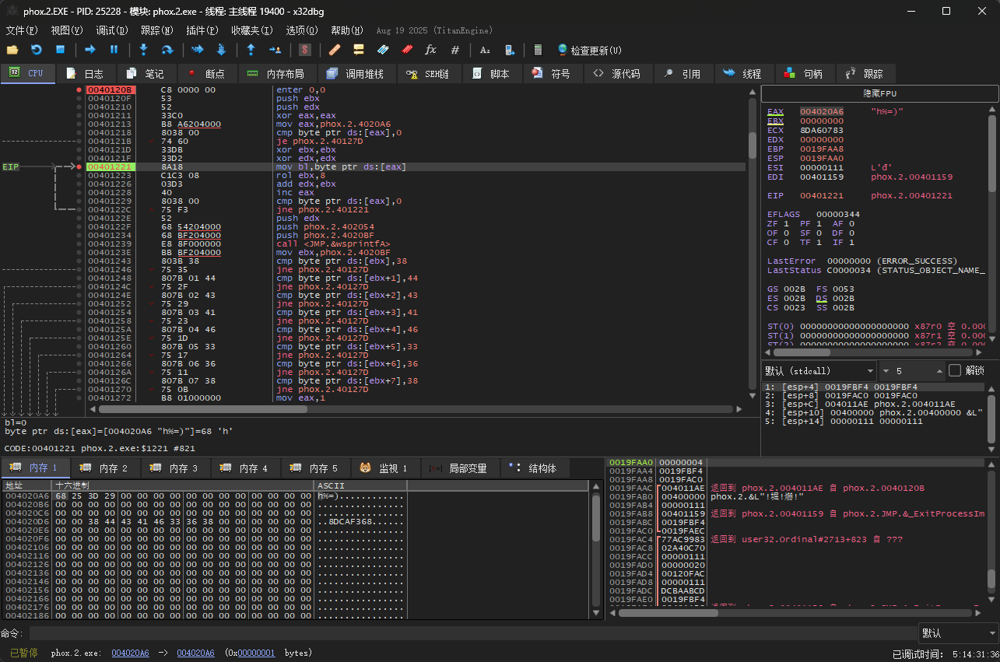

Dump 中的字节为 `68 25 3D 29 00`，依次对应 `h`、`%`、`=`、`)` 和字符串结尾的 NUL。

5. 每次在 `0x401221` 断下后，连续按三次 <kbd>F8</kbd>，依次执行 `mov bl, [eax]`、`rol ebx, 8`、`add edx, ebx`；记录此时的 `EBX` 和 `EDX`。然后按 <kbd>F9</kbd>，程序会在下一轮的 `0x401221` 再次断下。重复直到第四个字符处理完毕。

每轮执行这三条指令后的寄存器值如下：

| 轮次 | 当前字符 | `rol` 后的 `EBX` | 累加后的 `EDX` |
| ---- | -------- | ---------------- | -------------- |
| 1    | `h`      | `0x00006800`     | `0x00006800`   |
| 2    | `%`      | `0x00682500`     | `0x00688D00`   |
| 3    | `=`      | `0x68253D00`     | `0x688DCA00`   |
| 4    | `)`      | `0x253D2968`     | `0x8DCAF368`   |

6. 第四轮记录完成后按 <kbd>F9</kbd>。由于下一个字节是 NUL，程序不再跳回 `0x401221`，而是在 `0x40122E` 的 `push edx` 前断下。此时 `EDX` 已经是 `0x8DCAF368`，与静态推导完全一致。

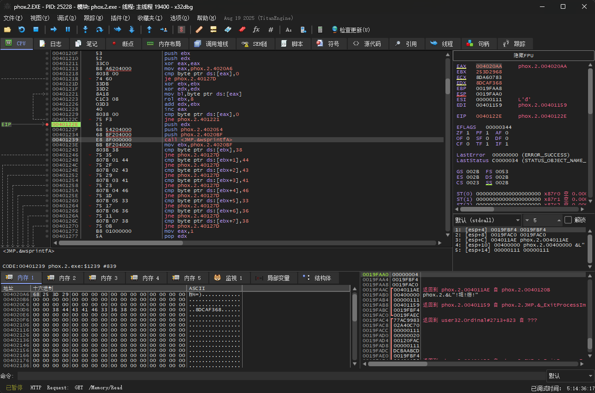

7. 在 `0x40122E` 断下后，跳到 `0x40123E` 并按 <kbd>F2</kbd> 设置断点，再按 <kbd>F9</kbd>。这里是 `wsprintfA` 返回后的下一条指令：`EAX = 8` 表示函数写入了 8 个可见字符；Dump 中的 `0x4020BF` 已变成 `38 44 43 41 46 33 36 38 00`，也就是 `8DCAF368\0`。下一条 `mov ebx, 0x4020BF` 把这个缓冲区地址交给后续比较，紧接着的 8 条 `cmp` 正在验证同一串文本。

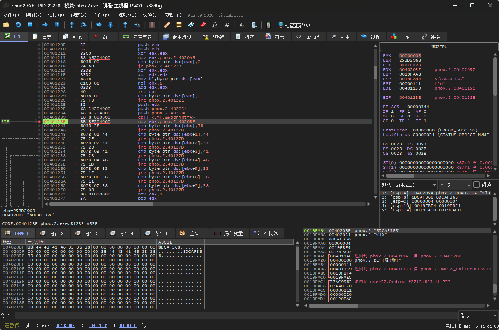

8. 跳到 `0x401277` 并按 <kbd>F2</kbd> 设置断点，按 <kbd>F9</kbd> 继续运行。断下后可以看到 `EAX = 1`。这说明 8 条比较都没有跳往 `0x40127D` 的失败分支，`h%=)` 就是这个样本接受的有效序列号。

> [!IMPORTANT]
> 动态验证不是为了替代静态分析，而是为了排除推导中的误解。这里三个运行时状态连成了完整证据链：输入缓冲区是 `h%=)`，循环把它算成 `0x8DCAF368`，`wsprintfA` 再把该整数转换成待比较的 `8DCAF368`。

## 不要急着绕过判断

在 `0x401243` 之后能看到 8 组 `cmp`/`jnz`。直接修改跳转当然可能让程序走向成功分支，但这不是本章要解决的问题：它只能说明你发现了一个控制流节点，不能说明你理解了输入如何变成比较目标。

更重要的是，改掉第一条 `jnz` 也不够。程序还会继续检查后面的 7 个字符；要稳定地绕过验证，还得分析全部分支和最终返回值。相比之下，推导并验证有效输入 `h%=)` 给出了更完整的答案：你不仅知道在哪里判定成功，也知道为什么它会成功。

对练习样本可以研究控制流修改，但面对未经授权的软件，正确边界是分析、理解和加固，而不是绕过许可证、账号或访问控制。

## 本章小结

这次分析没有靠猜测序列号，也没有从某个字符串直接得出答案。完整路径是：

1. 先运行程序，只记录可见的失败提示和普通输入结果。
2. 在 Strings 窗口发现 `Wrong S/N#` 与 `8DCAF368`，再用 xref 区分失败分支和未被直接引用的字符串。
3. 从 `DefWindowProcA`、Windows 文档、控件创建调用和动态断点共同确认消息分派、`Ok` 与 `wParam = 0x20` 的关系。
4. 从 `GetWindowTextA`、`wsprintfA` 的导入引用交叉定位 `sub_40120B`，再用 F5 和汇编证明它是 `check_serial`。
5. 用抽象字节还原循环，先确认目标字节对应的累计和与无进位前提，再反推 `h%=)`，最后用 x32dbg 验证每个运行时状态。

以后面对陌生的 GUI CrackMe，也可以先按这条路径缩小范围：可见结果是线索，字符串和导入函数帮助定位，xref 连接调用关系，伪代码给出整体结构，汇编和动态调试负责最终验证。

## 练习

1. 输入只有一个字符 `A` 时，执行一轮 `mov bl, [eax]`、`rol ebx, 8`、`add edx, ebx` 后，`EBX` 和 `EDX` 分别是什么？`wsprintfA` 会生成什么文本？

   > [!NOTE]- 参考答案
   > `A` 的 ASCII 值是 `0x41`。初始 `EBX = 0`，执行后 `EBX = 0x00004100`，`EDX = 0x00004100`；`%lX` 会生成 `4100`。第一条 `cmp` 期待字符 `8`（`0x38`），而 `4100` 的首字符是 `4`（`0x34`），所以立即失败。它只有 4 个字符也意味着即使首字符碰巧相同，后续比较仍不会满足。

2. 为什么第二轮处理 `%` 时，`rol ebx, 8` 的结果是 `0x00682500`，而不是 `0x00002500`？

   > [!NOTE]- 参考答案
   > 第一轮结束后 `EBX` 已是 `0x00006800`。第二轮的 `mov bl, 0x25` 只写最低 8 位，因此先得到 `0x00006825`，高位的 `0x68` 被保留。再对整个 32 位 `EBX` 循环左移 8 位，结果才是 `0x00682500`。

3. 不看 `check_serial` 的代码，只从 `Wrong S/N#` 的 xref 出发，如何找到 `GetWindowTextA` 的真实调用位置？写出需要经过的两个窗口或跳板。

   > [!NOTE]- 参考答案
   > 先从 `Wrong S/N#` 的唯一 xref 到 `window_proc`，确认失败分支和按钮处理在同一函数。然后在 Imports 窗口双击 `GetWindowTextA`，从 IAT 槽位 `0x403094` 的 `DATA XREF` 进入导入跳板 `0x4012A3`，再沿 `CODE XREF` 回到 `window_proc` 中的真实调用点 `0x40119E`。
