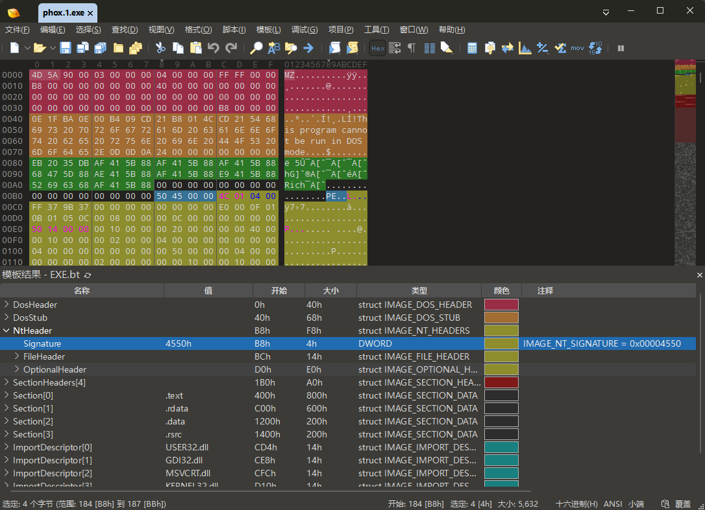
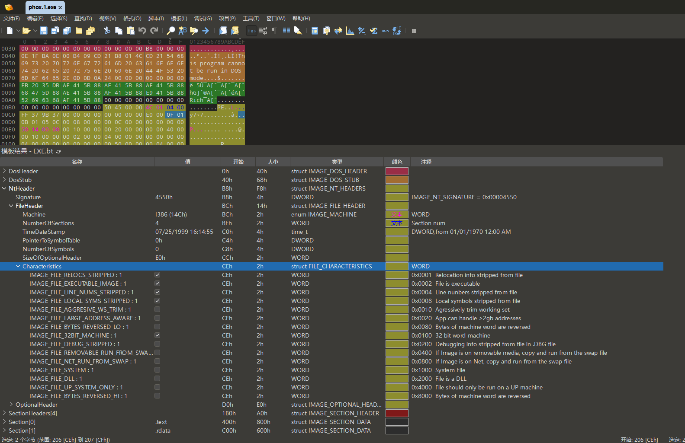
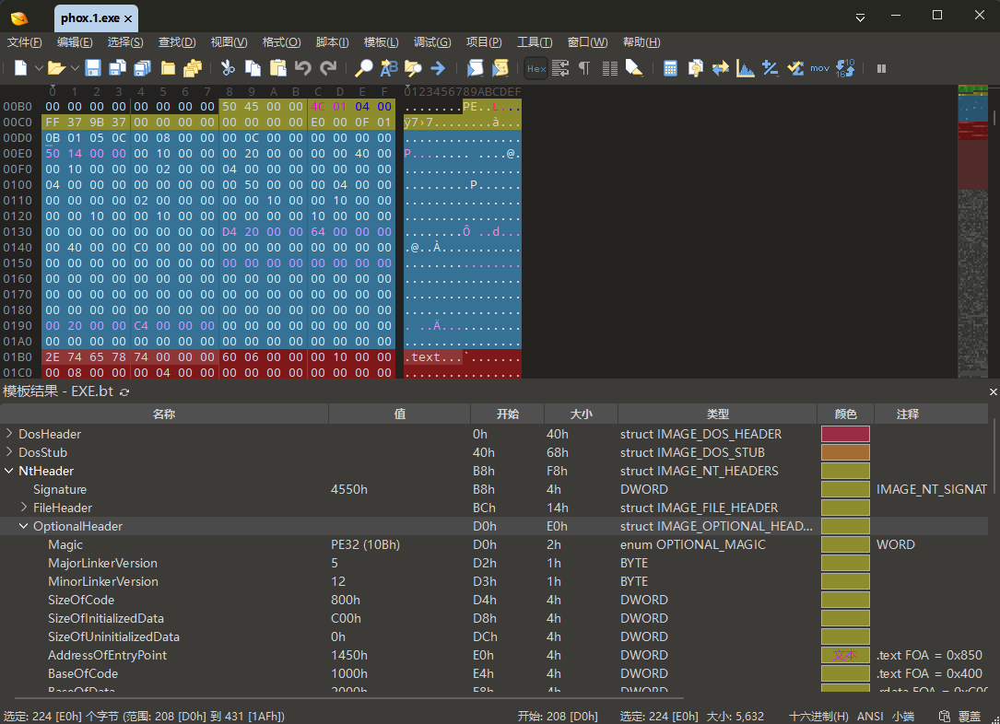
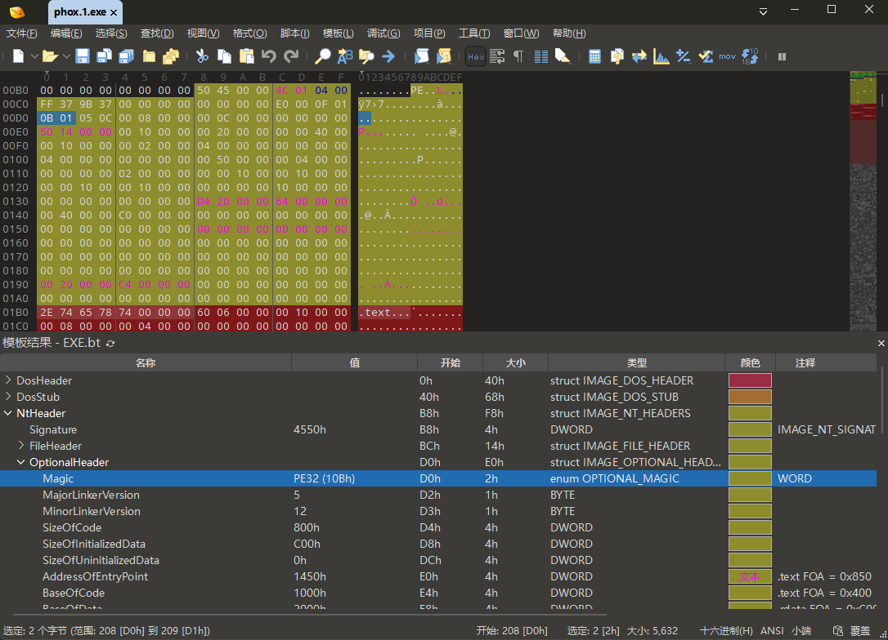
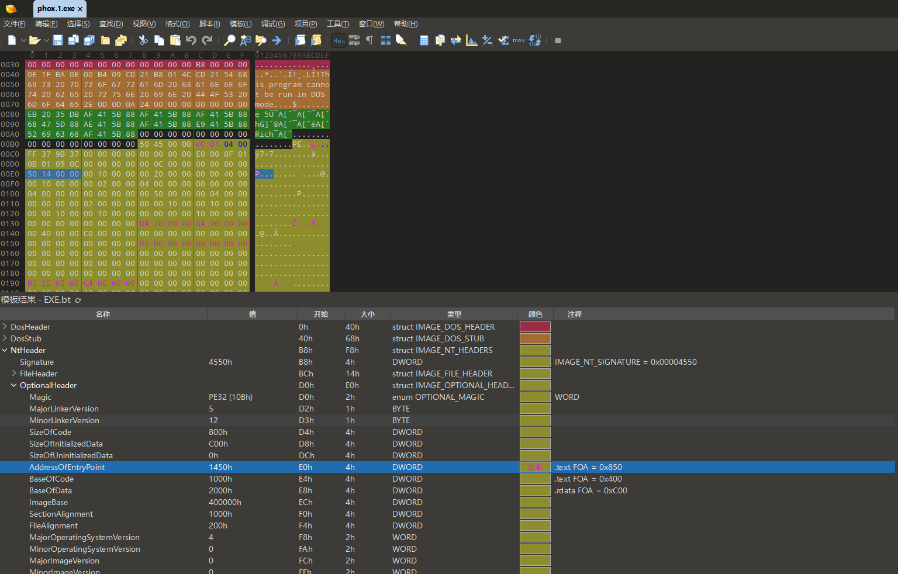
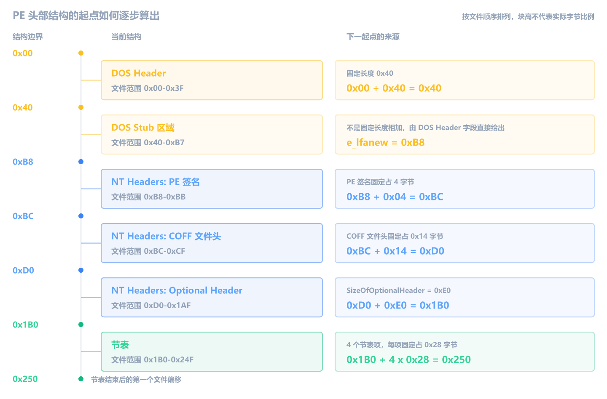
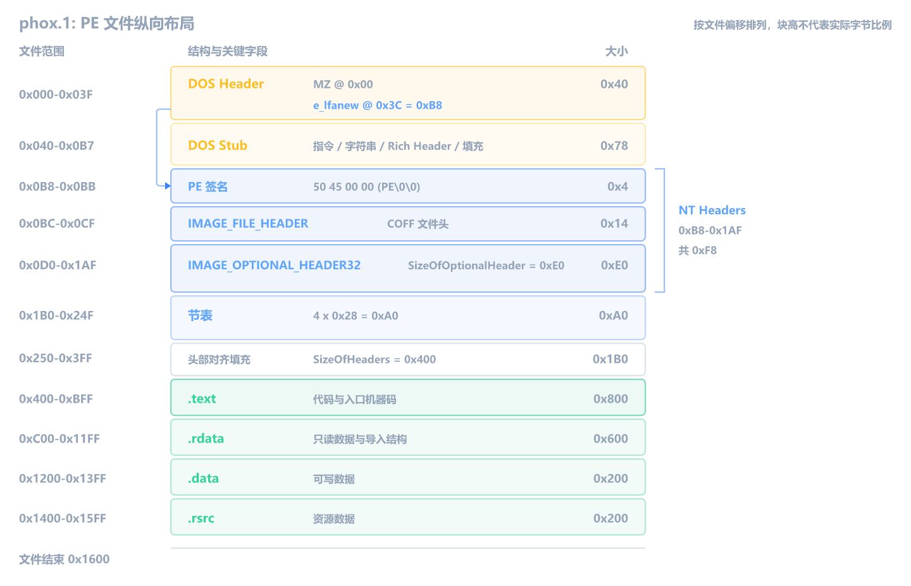
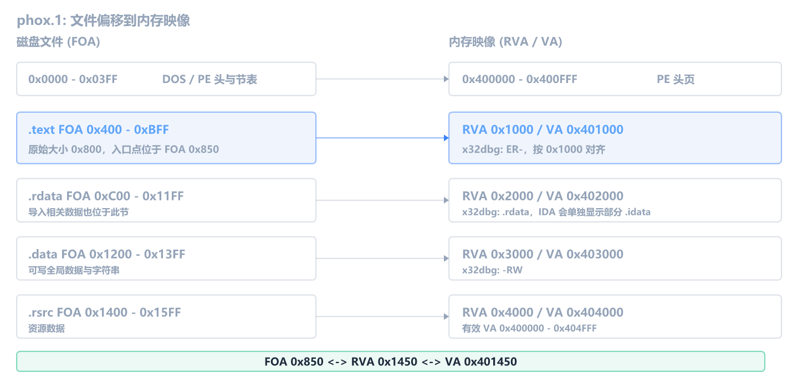

## 追踪同一个程序入口

上一章从窗口提示和字符串出发，找到了 `phox.2` 的验证逻辑。这一章换一个问题：IDA 左侧显示的代码地址，怎样对应到 exe 文件中的字节位置？

本章使用 PhoX CrackMe 合集中的 `phox.1.zip`（CHM 编号 `128`）。它只有 `5.5 KiB`，适合把“文件里的字节”到“调试器里的地址”这条链走完；文件中到底有哪些结构，将在后面的读取过程中逐项确认。

整章始终追踪同一个位置：**程序入口**。先在 IDA 中确认入口的内存地址和所属区域，再到 010 Editor 中寻找这个地址在 PE 文件里的来源与对应字节，最后用 x32dbg 验证它在运行时真正装载到了哪里。三个工具看到的是同一个入口，只是观察角度不同。

本章完成后，你应该能够：

1. 区分 IDA 的当前浏览位置和 PE 的程序入口点。
2. 说清一个 exe 由哪些结构按固定顺序拼成，并在文件中找到 DOS Header、NT Headers 和节表。
3. 区分文件偏移、RVA 与 VA，知道它们分别回答什么问题。
4. 从程序入口点逐步换算出对应的文件偏移。
5. 用 x32dbg 验证模块的实际装载地址和内存页权限。

> [!WARNING]
> CrackMe 来自第三方合集。静态检查没有发现壳或反调试逻辑，但运行未知程序仍应使用虚拟机或隔离环境。本章只读取文件和观察已运行进程的内存，不需要管理员权限。

先从 CHM 合集中提取编号 `128` 的 `phox.1.zip`。这一章不会要求你一开始同时打开所有工具：先用 IDA 产生问题，需要读取原始文件结构时再打开 010 Editor，最后才用 x32dbg 验证运行时结果。

## 先用 IDA 确认入口的内存位置

这一阶段只完成一个任务：从 IDA 当前显示的函数出发，确认程序入口的地址，并判断这个地址位于哪一段内存区域。暂时不分析入口代码做了什么，也不计算它在磁盘文件中的位置。

按照上一章的方式用 IDA 打开 `phox.1.exe`，保持默认加载选项并等待自动分析完成。在本章的环境中，初始反汇编视图停在 `_WinMain@16`，地址是 `0x401000`；如果你的 IDA 版本或数据库状态不同，初始位置可能不一样，这不影响后面用入口点定位。


<!-- TODO: 截图 1（IDA 默认反汇编视图）。建议文件名：cracking-2-images/ida-default-winmain.png。画面定位在 0x401000，必须同时包含左侧地址、_WinMain@16 函数头和 Attributes: bp-based frame。 -->

左侧函数列表里的 `sub_4010FB` 一类名字，是 IDA 尚未得到更有语义的名称时，按“函数地址”自动生成的临时名。`_WinMain@16` 则是 IDA 分析后显示的可读名称，不一定来自程序保留的原始符号。其中 `@16` 是 x86 `stdcall` 的名字修饰，表示参数共占 `16` 字节。

这些名称能帮助我们区分 IDA 已命名和暂未命名的函数，却不能回答程序从哪里开始执行。

### 程序入口点是什么

双击一个 exe 后，Windows 并不是直接让 CPU 去读取磁盘上的字节。它先创建进程，再读取 exe 中的格式信息，把代码和数据安排到这个进程自己的虚拟地址空间里。负责完成这些准备工作的系统代码，通常称为 **Windows 装载器**；exe 在内存中铺开后的整体，则称为**内存映像**。

文件准备好了，还要回答一个问题：CPU 应该从映像中的哪条指令开始执行？对本章的 32 位程序，可以先把它理解成“接下来要把哪个地址交给 `EIP`”。exe 中专门记录了这个起始位置，它就是**程序入口点**。

这里的“开始”为什么通常不是源码中的 `main` 或 `WinMain`？因为 Windows 装载器只读取 PE 文件记录的入口位置，并不知道 C/C++ 规定了哪些主函数。`main` 和 `WinMain` 是 C/C++ 运行库与开发者之间的约定，不是 Windows 装载 PE 时直接寻找的函数。

开发者写下的主函数也不能立即运行。在调用它之前，程序还要初始化 C/C++ 运行库、处理命令行参数、调用全局对象的构造函数等。链接程序时，运行库会提供一段负责这些工作的启动代码，并由链接器把它设为 PE 入口。准备完成后，这段启动代码才调用开发者编写的 `main` 或 `WinMain`。

所以 IDA 默认停在 `_WinMain@16`，并不代表程序从这里开始执行。要查看 IDA 记录的入口，选择 **Jump -> Jump to Entry Point**，或在反汇编窗口按 <kbd>Ctrl</kbd> + <kbd>E</kbd>。这两种操作执行的是同一个命令，随后会弹出 **Choose an entry point** 对话框。

![IDA Choose an entry point 对话框，显示 start、地址 0x401450 和 [main entry]](image-1.png)

<!-- TODO: 截图 2a（IDA 入口点对话框）。建议文件名：cracking-2-images/ida-choose-entrypoint.png。按 Ctrl+E 后截对话框，必须看清 Name 列的 start、Address 列的 0x401450、Ordinal 列的 [main entry]。 -->

| 列        | 含义                                                    |
| --------- | ------------------------------------------------------- |
| `Name`    | IDA 为入口项显示的符号名                                |
| `Address` | IDA 显示的地址                                          |
| `Ordinal` | 入口项标识；本例的 `[main entry]` 是 IDA 对主入口的标记 |

这个样本只列出一行：`start`、`0x401450` 和 `[main entry]`。选中这一行后，IDA 跳到地址 `0x401450` 处的 `start`。

现在才得到这个样本的实际结果：IDA 将地址 `0x401450` 处的 `start` 标为主入口。前面初始显示的 `_WinMain@16` 是它随后调用的主函数，不是 PE 入口。两者的顺序可以整理为：

```text
Windows 按 PE 文件记录找到入口 0x401450
                    ↓
执行运行库启动函数 start
                    ↓
start 完成初始化并调用 _WinMain@16
```

这个调用关系可以从 `start` 后面的代码确认，但本章暂时不展开运行库初始化细节。现在只记录第一条结果：程序入口是 `0x401450` 处的 `start`。这个标记来自文件中的什么位置，留到 IDA 阶段结束后再追查。


<!-- TODO: 截图 2b（IDA 程序入口）。建议文件名：cracking-2-images/ida-entrypoint-start.png。在对话框选中后跳转截图，画面定位在 0x401450，必须同时包含左侧地址和 start 函数标签。 -->

现在已经知道入口地址是 `0x401450`，但还不知道它位于程序的哪一块区域。IDA 不会把整个程序当成一段没有边界的地址，而是把连续的地址划分成若干 **Segment（段）**。有的段主要放可执行代码，有的段主要放只读数据或可写数据。这样看到一个地址时，就能先判断它大致属于哪类内容。

IDA 的 Segment 可以先理解为“IDA 数据库中的一段连续地址范围”。每个段都有名称、起止地址和访问属性。例如 `R` 表示可读，`W` 表示可写，`X` 表示可执行。这里的“段”不是 x86 段寄存器中的代码段、数据段，也不保证和 PE 文件中的节一一对应。它只是 IDA 分析并组织当前程序的一种方式。

要查看这些地址范围，选择 **View -> Open subviews -> Segments**。无论反汇编窗口当前停在哪里，Segments 窗口都会列出 IDA 为整个程序建立的所有段。


<!-- TODO: 截图 3（IDA Segments）。建议文件名：cracking-2-images/ida-segments-view.png。画面需要完整显示 .text、.idata、.rdata、.data 及其起止地址，尤其要保留 .idata 从 0x402000 开始的范围。 -->

这个窗口的列比较多，但实际逆向时通常先看下面几项：

| 重点列         | 看什么                   | 本例怎么看                                         |
| -------------- | ------------------------ | -------------------------------------------------- |
| `Name`         | 这段地址大致保存什么     | `.text` 通常放代码，`.data` 通常放可写数据         |
| `Start`、`End` | 某个地址是否落在该段中   | `.text` 从 `0x401000` 开始，到 `0x402000` 之前结束 |
| `R/W/X`        | 这段内存能否读、写、执行 | `.text` 是 `R-X`，`.data` 是 `RW-`                 |
| `Class`        | IDA 把它归为代码还是数据 | `.text` 为 `CODE`，其余为 `DATA`                   |
| `AD`           | IDA 使用的默认地址宽度   | 本例为 `32`，不是段大小                            |

> [!NOTE]- 其余列什么时候看
> `D` 和 `L` 表示段由调试器还是文件加载器创建；`Align` 是 IDA 记录的对齐类型；`Base` 是 IDA 分配的内部段编号（selector），不是 `ImageBase`；`Type` 是历史上的段组合属性。
>
> `es`、`ss`、`ds`、`fs`、`gs` 是 IDA 静态分析时采用的段寄存器假设，不是 CPU 当前的实时值。普通 32 位 Windows 程序分析中通常不需要关注；处理线程环境块等系统结构时，`FS` 才会变得重要。

其中最重要的是**地址范围和权限**。`R-X` 表示这段内存被声明为可读、可执行，通常用于存放代码；`RW-` 表示被声明为可读、可写，通常用于存放全局变量等运行时数据。这里的 `R/W/X` 适合判断区域的预期用途，但它不是对 CPU 实际行为的完整实验结论：例如，从 `RW-` 页面取指是否会被阻止，还取决于当前进程是否启用了 DEP（Data Execution Prevention，数据执行保护）。段名和权限都是线索，最终仍要结合运行环境、引用和实际内容判断。

这个样本列出了 `.text`、`.idata`、`.rdata` 和 `.data` 四个段。`.text` 从 `0x401000` 开始，到 `0x402000` 之前结束，因此最后一个有效地址是 `0x401FFF`。入口地址 `0x401450` 落在这个范围内，而且 `.text` 具有 `X` 权限，所以可以确认：入口位于 IDA 识别出的可执行代码区域。

`.text` 之所以显示为可执行，不是因为这个名字有特殊作用，而是 exe 文件记录了该区域需要执行权限，IDA 加载文件时读取并显示了这项信息。后面查看 PE 节表时，会找到权限对应的原始字段。

### IDA 阶段得到了什么

现在可以把这一阶段的结果收拢起来：

1. IDA 初始显示的是 `_WinMain@16`，但当前浏览位置不等于程序入口。
2. IDA 记录的主入口是地址 `0x401450` 处的 `start`。
3. `0x401450` 位于 `.text` 的地址范围内，这个区域具有读取和执行权限。

到这里，IDA 阶段的任务已经完成：我们已经知道入口在**内存视角**中位于哪里。IDA 可以回答“入口显示为什么地址、属于哪类内存区域”，却还不能回答下面两个问题：

1. IDA 根据 exe 文件里的哪个字段找到入口？
2. 内存地址 `0x401450` 对应磁盘文件中的哪些字节？

接下来打开 010 Editor，不是开始一个无关的新任务，而是继续追踪同一个入口。只是观察角度从 IDA 的内存地址，切换到了 exe 文件中的原始字节。

## 用 010 Editor 追踪入口字段和文件字节

这一阶段要解决 IDA 留下的两个问题：入口地址来自文件中的哪个字段，以及入口代码位于磁盘中的什么位置。为此，要先找到 NT Headers 中的入口字段，再用节表把入口 RVA 换算成文件偏移。

现在打开 010 Editor，加载同一份 `phox.1.exe`。首次打开 exe 时，010 Editor 可能提示安装并运行 `EXE.bt`。这是用于解析 Windows 可执行文件结构的 Binary Template，点击**安装**即可。


<!-- TODO: 截图 4a（010 Editor 模板安装提示）。建议文件名：cracking-2-images/010-install-exe-template.png。画面需要完整显示 EXE.bt 的名称、用途说明以及“安装”按钮。 -->

模板运行后，窗口下方会出现 **模板结果（Template Results）**，按结构列出字段，并显示 `名称`、`值`、`开始`和`大小`等列；上方仍是文件的十六进制视图。单击模板结果中的字段，上方会立即高亮这个字段占用的原始字节。这样可以同时回答两个问题：下方告诉我们“这个字段叫什么、位于哪里”，上方证明“文件中实际保存了哪些字节”。


本章就沿着这组联动关系寻找入口：先在模板结果中选择字段，再到上方核对高亮字节，最后才使用字段值参与跳转或计算。模板负责导航，不代替原始字节证据。

### 一个 exe 不是任意字节，而是按规范排列的结构

在动手找字节之前，先把**物理排列顺序**和**结构包含关系**放在同一棵树里。**PE（Portable Executable）** 是 Windows 用于 exe、DLL 等程序的文件格式；对本章使用的 PE32 文件，可以先按下面的层级理解：

```text
PE 文件
├─ DOS Header
├─ DOS Stub 区域
├─ NT Headers
│  ├─ PE Signature
│  ├─ File Header（COFF 文件头）
│  └─ Optional Header
├─ Section Headers（节表）
├─ 头部对齐填充
└─ Section Data（各节数据）
```

这里最容易混淆的是 `NT Headers`：它不是和 File Header、Optional Header 并列的第四种 Header，而是包住 PE 签名、File Header 和 Optional Header 的上层结构。Section Headers 紧跟在 NT Headers 后面，但不属于 NT Headers；它是另一组连续的节表项。头部对齐填充只用于把后续节数据推到规定边界，不是一个带字段的 PE 结构。

这些头部结构按规定的顺序出现，但不能据此认为文件中的所有内容都无缝首尾相接。节数据从哪里开始由节表中的 `PointerToRawData` 指定，头部与第一节之间可以存在对齐填充。

还要区分“文件物理布局”和“模板结果树”。`EXE.bt` 不仅列出上面的头部，还会顺着 Optional Header 中的数据目录继续解析导入表、资源表等节内结构。因此，模板结果中出现的 `ImportDescriptor[0]` 或 `ResourceDirectoryTable` 不是排在 Section Data 后面的新物理区域，而是某段节数据内部的解释结果。它们的具体位置等读完数据目录和节表后再判断。

几个名称先作最小说明：

- **COFF** 是 Common Object File Format 的缩写，PE 的 File Header 沿用了它的布局。
- **Optional Header** 名字里虽有 “Optional”，但对需要由 Windows 装载执行的 exe 并非可有可无；这个名称只是沿袭 COFF 的历史。
- **Section Headers** 只是映射目录，不是代码或资源本身；它描述各节在文件和内存中的位置、大小和属性。
- **Section Data** 才保存程序的代码、全局数据、导入信息和资源。

程序运行时，Windows 会根据这些头和节表，把文件中的内容放到进程虚拟内存的相应位置。装载后形成的整体称为**内存映像**。下面严格按照模板树和文件顺序，从 DOS Header 开始逐层读取，不提前使用后面结构中的字段。

### 从 DOS Header 找到 NT Headers

Windows PE 文件开头保留了一段兼容早期 DOS 可执行文件的结构，称为 **DOS Header**。先在模板结果中展开 `DosHeader`，单击 `MZSignature`。下方显示它从文件偏移 `0x00` 开始、大小为 2 字节；上方同时高亮文件开头的 `4D 5A`，文本区显示为字符 `MZ`。


Windows SDK 的 `winnt.h` 把这个字段称为 `e_magic`，它的数值是 `0x5A4D`。模板按小端序把 `4D 5A` 解析成数值 `0x5A4D`，而十六进制视图保留字节在文件中的实际排列。看到这组对应关系，就可以确认当前文件以有效的 DOS Header 开头。

本章不需要逐个研究 DOS 时代遗留的所有字段，只需要其中一个仍被 Windows 使用的字段：`e_lfanew`。在 `EXE.bt` 的模板结果中，它显示为 `AddressOfNewExeHeader`，位于 `DosHeader` 的最后一行。当前模板面板只显示了前半部分字段，需要这样找到它：

1. 保持下方模板结果中的 `DosHeader` 展开。
2. 在下方模板面板内部向下滚动，直到 `DosHeader` 的最后一行。
3. 单击 `AddressOfNewExeHeader`。

选中后，这一行的 `值`、`开始`和`大小`分别显示 `B8h`、`3Ch` 和 `4h`；上方十六进制区同步高亮文件中的 `B8 00 00 00`。换成正文统一使用的写法，就是字段值 `0xB8`、起点 `0x3C`、大小 4 字节。

这里出现两套名称，是因为 `EXE.bt` 是独立编写的解析模板，字段名不必与 Windows SDK 的 C 结构成员完全相同。判断它们是不是同一个字段，要对照所在结构、文件偏移、大小和用途，而不是只比较名称：

| 010 Editor `EXE.bt`     | Windows SDK `IMAGE_DOS_HEADER` | 文件偏移 | 大小   | 本章用途                       |
| ----------------------- | ------------------------------ | -------- | ------ | ------------------------------ |
| `MZSignature`           | `e_magic`                      | `0x00`   | 2 字节 | 用 `4D 5A` 标识 DOS Header     |
| `AddressOfNewExeHeader` | `e_lfanew`                     | `0x3C`   | 4 字节 | 指出 NT Headers 在文件中的位置 |

> [!NOTE]- 去哪里查 PE 字段名称
> 想确认 Windows 结构成员的正式名称，可以在 Windows SDK 的 `winnt.h` 中搜索 `_IMAGE_DOS_HEADER`；常见安装位置是 `C:\Program Files (x86)\Windows Kits\10\Include\<版本>\um\winnt.h`。这里能看到 `e_magic` 和 `e_lfanew` 的原始 C 定义。
>
> 想确认字段的文件位置和格式含义，应查阅 Microsoft Learn 的 [PE Format](https://learn.microsoft.com/en-us/windows/win32/debug/pe-format)。想确认 010 Editor 为什么显示另一套名称，则查看 SweetScape 模板仓库中的 [`EXE.bt` 源码](https://www.sweetscape.com/010editor/repository/templates/file_info.php?file=EXE.bt&type=0&sort=)：模板里直接定义了 `MZSignature` 和 `AddressOfNewExeHeader`。

下方模板面板已经通过 `开始 = 3Ch` 告诉我们字段起点。上方高亮不是用来重新寻找字段，而是把模板结果和文件中的实际字节对应起来。010 Editor 十六进制视图左侧显示每一行第一个字节的偏移，上方列号从 `0` 排到 `F`；高亮范围位于 `0x30` 行的 `C-F` 列，所以第一个字节的位置确实是：

```text
0x30 + 0x0C = 0x3C
```

这与模板结果中的 `开始 = 3Ch`、`大小 = 4h` 相符。从上方选中的范围读取原始字节：

```text
文件偏移 0x03C: B8 00 00 00
```


<!-- TODO: 截图 4b（010 Editor）。建议文件名：cracking-2-images/010-dos-header-e-lfanew.png。下方模板结果选中 AddressOfNewExeHeader，保留“值”“开始”“大小”三列；上方必须同步高亮 0x30 行 C-F 列的 B8 00 00 00。 -->

PE 结构中的整数按小端序保存，低位字节排在前面，因此 `B8 00 00 00` 表示 `0x000000B8`。也就是说，NT Headers 从文件偏移 `0xB8` 开始。DOS Header 在 `0x40` 处结束，中间的 `0x40-0xB7` 就是 DOS Stub 区域。

这个区域并没有全部用来保存 DOS 指令。按照当前样本的实际字节，可以进一步拆成：

| 文件范围    | 内容                        |
| ----------- | --------------------------- |
| `0x40-0x4D` | DOS 下执行的 16 位指令      |
| `0x4E-0x78` | 提示字符串，以字符 `$` 结束 |
| `0x79-0x7F` | 全零的填充字节              |
| `0x80-0xA7` | Rich Header 数据            |
| `0xA8-0xB7` | NT Headers 前的全零填充     |

前两行合起来才是这个样本真正会在 DOS 环境中执行和使用的 Stub 程序。010 Editor 的文本区显示了它要打印的 “This program cannot be run in DOS mode”。现代 Windows 正常装载 PE 映像时，不会执行这段 DOS 程序。

中间和末尾出现的 `00` 没有对应的 DOS 指令或 PE 字段，只是工具链留下的填充空间。文件格式允许 NT Headers 之前存在这样的空白；真正的 NT Headers 起点仍以 `e_lfanew = 0xB8` 为准。


`0x80-0xA7` 中还能看到单词 `Rich`。它属于 **Rich Header**：微软编译工具链经常写入的一小段构建信息。它不是 PE 规范要求的结构，Windows 装载程序时也不依赖它。

> [!NOTE]- Rich Header 里记录了什么
> Rich Header 通常记录参与构建的微软工具组件编号、版本编号和使用次数，可以为判断编译工具链提供线索。它不会直接保存源代码，也不等于程序的调试符号。
>
> 这些记录经过简单的 XOR 编码，末尾用 `Rich` 和一个 4 字节密钥标记。它属于微软工具链留下的非标准信息，不是所有 PE 文件都有。

现在用刚读出的字段值验证它指向哪里。继续使用下方模板结果导航，不需要手工跳转：

1. 找到与 `DosHeader` 同级的 `NtHeader`，单击左侧箭头将它展开。
2. 选择 `NtHeader` 中的第一个字段 `Signature`。
3. 确认这一行的 `开始` 为 `B8h`、`大小` 为 `4h`，同时观察上方高亮的四个字节。

`EXE.bt` 使用名称 `NtHeader`，它对应前文所说的 NT Headers。选中 `Signature` 后，上方十六进制视图显示：

```text
文件偏移 0x0B8: 50 45 00 00
```

`50 45` 对应字符 `PE`，后面的两个字节为零，所以这四个字节写作 `PE\0\0`。它正是 PE 签名。`Signature` 的起点 `B8h` 与 `AddressOfNewExeHeader` 的值 `B8h` 相同，因此可以确认：`e_lfanew` 确实指向 NT Headers 的起点。

从 `0xB8` 开始的整体叫 **NT Headers**。对这个 32 位样本，对应 Windows SDK 中的 `IMAGE_NT_HEADERS32`，内部依次包含三部分：

```text
IMAGE_NT_HEADERS32
├─ Signature                 PE 签名，固定 4 字节
├─ IMAGE_FILE_HEADER         COFF 文件头，固定 20 字节
└─ IMAGE_OPTIONAL_HEADER32   PE32 Optional Header，长度由 File Header 中的字段给出
```

节表紧跟在 NT Headers 后面，但不属于 `IMAGE_NT_HEADERS32`。因此，后面计算出 NT Headers 的结束位置后，就能同时得到节表的起点。



<!-- TODO: 截图 5（010 Editor）。建议文件名：cracking-2-images/010-pe-signature-coff-header.png。下方模板结果选中 NT Headers 的 PE 签名字段；上方同步高亮 0xB8 的 50 45 00 00，并保留 0xB0、0xC0、0xD0 行偏移。 -->

`Machine`、`NumberOfSections`、`SizeOfOptionalHeader` 和 `Characteristics` 都属于 COFF 文件头，在 `EXE.bt` 中位于 `NtHeader -> FileHeader` 下。保持 `NtHeader` 展开，再展开其中的 `FileHeader`，然后依次选择这四个字段。每选一项，都先看下方的 `开始` 与 `大小` 列，再核对上方高亮的原始字节。连同前面的 PE 签名，五项证据汇总如下：

| 字段                   | `开始`列 | `大小`列 | 上方高亮的原始字节 | 读取结果 |
| ---------------------- | -------- | -------- | ------------------ | -------- |
| PE 签名                | `0xB8`   | 4 字节   | `50 45 00 00`      | `PE\0\0` |
| `Machine`              | `0xBC`   | 2 字节   | `4C 01`            | `0x014C` |
| `NumberOfSections`     | `0xBE`   | 2 字节   | `04 00`            | `4`      |
| `SizeOfOptionalHeader` | `0xCC`   | 2 字节   | `E0 00`            | `0x00E0` |
| `Characteristics`      | `0xCE`   | 2 字节   | `0F 01`            | `0x010F` |

读取 `Characteristics` 时还要多做一步：单击左侧箭头将它展开。`EXE.bt` 会把这个字段显示为 `FILE_CHARACTERISTICS` 结构，下面每一行代表其中一个位标志；复选框被勾选表示该位为 1，未勾选表示该位为 0。



父行的 `值` 列不一定显示合并后的数值，因此仍要以上方高亮的原始字节为准：`0F 01` 按小端序读成 `0x010F`。展开后的所有子项都显示 `开始 = CEh`、`大小 = 2h`，因为它们只是同一个 2 字节字段中的不同位，并不是每个标志各占 2 字节。

`Characteristics` 不是一个只能表示单一含义的编号，而是一组可以同时开启的位标志。要理解为什么勾选的是这五项，先把 `0x010F` 的每个十六进制数字换成 4 个二进制位：

```text
十六进制：   0    1    0    F
二进制：   0000 0001 0000 1111
```

从右往左看：

- 最后一位 `F` 对应二进制 `1111`，所以最低的四个位都是 1，对应 `0x0008`、`0x0004`、`0x0002` 和 `0x0001`。
- 中间的 `0` 对应 `0000`，所以 `0x0010`、`0x0020`、`0x0040` 和 `0x0080` 都没有开启。
- 再往左的 `1` 对应 `0001`，它处在从右数第三个十六进制位置，因此代表 `0x0100`。

把所有为 1 的位按位或起来，就会回到原值：

```text
0x0100 | 0x0008 | 0x0004 | 0x0002 | 0x0001 = 0x010F
```

符号 `|` 表示**按位或**：同一位置只要有一个 1，结果中的该位就是 1。这五个位正好对应截图中被勾选的五个标志：

但是，二进制只能告诉我们“哪些位是 1”，不能自行推导出“这些位分别代表什么”。每一位的名称和含义由 Microsoft 的 PE/COFF 格式规范规定，并以 `IMAGE_FILE_*` 常量定义在 Windows SDK 的 `winnt.h` 中。例如：

```c
#define IMAGE_FILE_RELOCS_STRIPPED         0x0001
#define IMAGE_FILE_EXECUTABLE_IMAGE        0x0002
#define IMAGE_FILE_LINE_NUMS_STRIPPED      0x0004
#define IMAGE_FILE_LOCAL_SYMS_STRIPPED     0x0008
#define IMAGE_FILE_32BIT_MACHINE           0x0100
```

`EXE.bt` 又按照这些定义，把同一个 2 字节字段拆成可勾选的位标志，并显示名称和英文注释。也就是说，截图中的 `IMAGE_FILE_RELOCS_STRIPPED` 等文字来自模板和格式规范，不是保存在 `phox.1.exe` 里的字符串。完整定义可以在 Microsoft Learn 的 [PE Format - Characteristics](https://learn.microsoft.com/en-us/windows/win32/debug/pe-format#characteristics) 中核对，也可以在 Windows SDK 的 `winnt.h` 中搜索 `IMAGE_FILE_RELOCS_STRIPPED`。

因此，读取过程应分成三层：

```text
phox.1.exe 原始字节 0F 01
          ↓ 按小端序读取
字段数值 0x010F，确定哪些位为 1
          ↓ 查 PE/COFF 规范或 winnt.h
确定每个位的名称和含义
```

| 标志     | 含义                    | 本章怎样使用                        |
| -------- | ----------------------- | ----------------------------------- |
| `0x0001` | 基址重定位信息已剥离    | 后面判断样本能否正常更换装载基址    |
| `0x0002` | 文件是可执行映像        | 确认它是可以运行的映像文件          |
| `0x0004` | COFF 行号信息已剥离     | 本章不使用                          |
| `0x0008` | COFF 本地符号信息已剥离 | 本章不使用                          |
| `0x0100` | 目标是 32 位机器        | 与 `Machine = 0x14C` 的结果相互验证 |

这里的 `FileHeader.Characteristics` 描述整个文件，不要和后面每个节表项中的同名 `Characteristics` 混淆；后者描述单个节是否包含代码、能否读写执行。

> [!NOTE]- FileHeader 中其余三个字段为什么不进入主线
> `TimeDateStamp` 是链接器写入的时间戳，模板会把它解析成日期和时间。它可能被构建工具设为零、覆盖或修改，不能直接当作文件的可靠创建时间；本章也不需要用它定位入口。
>
> `PointerToSymbolTable` 和 `NumberOfSymbols` 描述旧式 COFF 符号表。本例两项都是零，表示文件没有这张表；它们和后面要看的导入表不是同一结构。

`Machine = 0x14C` 表示目标处理器是 32 位 x86，和 `Characteristics` 中的 32 位机器标志一致。`SizeOfOptionalHeader = 0xE0` 和 `NumberOfSections = 4` 先保留下来；等读完紧随其后的 Optional Header，再用它们计算 NT Headers 和节表的边界。

在 `NtHeader` 内，`FileHeader` 的下一个同级结构就是 `OptionalHeader`。IDA 为什么显示入口地址 `0x401450`，答案就在它的 `AddressOfEntryPoint` 和 `ImageBase` 字段中。解释这两个值之前，先分清文件偏移、RVA 和 VA 三种“位置”。

## 从 Optional Header 找到入口位置

### 先分清文件偏移、RVA 与 VA

Optional Header 里的入口字段保存的是一个 **RVA**，而不是 IDA 显示的那种完整地址。在读它之前，先把本章要用的三种位置区分开。FOA 是 File Offset Address 的缩写，这里就是文件偏移：

| 名称                | 当前例子                | 它回答的问题                       |
| ------------------- | ----------------------- | ---------------------------------- |
| 文件偏移（FOA）     | 已读到的 `0x3C`、`0xB8` | 这个字节距离 exe 文件开头多远？    |
| 相对虚拟地址（RVA） | 入口字段中待读取的值    | 这个位置距离内存映像开头多远？     |
| 虚拟地址（VA）      | IDA 显示的 `0x401450`   | 这个位置在虚拟内存中的地址是什么？ |

**映像基址**是内存映像的起始地址，**RVA（Relative Virtual Address）** 是目标位置到映像开头的距离。二者相加，才得到 **VA（Virtual Address）**：

```text
VA = 映像基址 + RVA
```

FOA 属于磁盘文件的坐标系，RVA 和 VA 属于内存映像的坐标系。装载器要做的事，本质上就是在这两个坐标系之间搬运字节。带着这三个概念，再去读 Optional Header 的字段就不会混淆。

### 读取本章需要的字段

回到模板结果，保持 `NtHeader` 展开，然后单击 `OptionalHeader` 左侧的箭头。它和 `FileHeader` 是同级节点，不在 `FileHeader.Characteristics` 里面。接下来会用到的层级如下，省略号代表本章不读取的其他字段：

```text
NtHeader
├─ Signature
├─ FileHeader
│  └─ Characteristics
└─ OptionalHeader
   ├─ Magic
   ├─ AddressOfEntryPoint
   ├─ ImageBase
   ├─ SectionAlignment
   ├─ FileAlignment
   ├─ SizeOfImage
   ├─ SizeOfHeaders
   ├─ DllCharacteristics
   ├─ ...
   ├─ NumberOfRvaAndSizes
   └─ DataDirArray
      └─ BaseRelocationTable
         ├─ VirtualAddress
         └─ Size
```



先选择 `OptionalHeader -> Magic`。这一行显示 `值 = PE32 (10Bh)`、`开始 = D0h`、`大小 = 2h`，上方同步高亮 `0B 01`。这说明 `phox.1` 使用 PE32 Optional Header；前面从 File Header 读到的 `SizeOfOptionalHeader = 0xE0` 则说明整个 Optional Header 占 224 字节。



PE32 Optional Header 内部依次包含标准字段、Windows 专用字段和数据目录。当前先读取入口映射和对齐所需的字段；每选择一项，都查看下方的 `值`、`开始`和`大小`，再核对上方高亮的原始字节：

| 字段                  | 文件偏移 | 原始字节      | 读取结果   | 作用                                    |
| --------------------- | -------- | ------------- | ---------- | --------------------------------------- |
| `Magic`               | `0xD0`   | `0B 01`       | `0x10B`    | 表示 Optional Header 使用 PE32 格式     |
| `AddressOfEntryPoint` | `0xE0`   | `50 14 00 00` | `0x1450`   | 入口代码在映像中的相对位置              |
| `ImageBase`           | `0xEC`   | `00 00 40 00` | `0x400000` | 文件请求的首选装载起始地址              |
| `SectionAlignment`    | `0xF0`   | `00 10 00 00` | `0x1000`   | 内存中每节按 4096 字节（4 KiB）边界对齐 |
| `FileAlignment`       | `0xF4`   | `00 02 00 00` | `0x200`    | 文件中每节按 512 字节边界对齐           |
| `SizeOfImage`         | `0x108`  | `00 50 00 00` | `0x5000`   | 整个映像装载到内存后的对齐后大小        |
| `SizeOfHeaders`       | `0x10C`  | `00 04 00 00` | `0x400`    | 文件头和节表在文件中占用的对齐后大小    |



<!-- TODO: 截图 6（010 Editor）。建议文件名：cracking-2-images/010-optional-header-entrypoint.png。下方模板结果选中 AddressOfEntryPoint，并保留“值”“开始”“大小”三列；上方同步高亮文件偏移 0xE0 的 50 14 00 00。其他字段值由正文表格列出，不要求在一张截图中全部出现。 -->

这里要同时看清“字段的位置”和“字段保存的值”：`AddressOfEntryPoint` 这一行的 `开始 = E0h` 表示字段本身位于文件偏移 `0xE0`；该处的四个原始字节 `50 14 00 00` 按小端序读成 `0x1450`，这个字段值才是入口 RVA。两者不是同一种位置。

`AddressOfEntryPoint = 0x1450` 表示入口代码距离内存映像开头 `0x1450` 字节。字段保存 RVA 而不是固定 VA，因此映像换一个装载地址时，入口在映像内部的相对位置仍然不变。

Optional Header 中的 `ImageBase = 0x400000` 是文件请求的**首选**装载基址。IDA 静态分析时按这个值建立映像，所以它显示的入口地址为：

```text
0x400000 + 0x1450 = 0x401450
```

这解释了 IDA 为什么将 `0x401450` 标为入口。

`ImageBase` 是首选值，不代表所有 PE 每次运行都一定装载到这里。现代 Windows 可以通过 **ASLR（地址空间布局随机化）** 改变支持重定位的映像基址；如果实际基址发生变化，入口地址仍按同一公式计算：

```text
运行时 VA = ActualLoadBase + RVA
```

是否支持更换映像基址，不能只根据 `ImageBase` 判断。这里需要沿着当前已经展开的 `OptionalHeader`，继续读取两个不同层级的对象。

先在 `OptionalHeader` 内向下滚动到 `DllCharacteristics`。注意它与前面读过的 `FileHeader.Characteristics` 不是同一个字段：

```text
NtHeader -> OptionalHeader -> DllCharacteristics
```

选择并展开 `DllCharacteristics`。它的 `开始 = 116h`、`大小 = 2h`，上方原始字节为 `00 00`；展开后的 `IMAGE_DLLCHARACTERISTICS_DYNAMIC_BASE` 没有勾选，说明这份映像没有请求动态基址。虽然字段名中带有 `Dll`，但它属于 PE Optional Header，exe 同样使用。

然后继续滚动到 `NumberOfRvaAndSizes`。这一行位于文件偏移 `0x12C`，原始字节为 `10 00 00 00`，所以本例声明了 `0x10`（16）个数据目录项。它的下一个节点就是 `DataDirArray`。展开后，模板为每一项使用了有含义的名称，而不是只显示数组下标：

```text
NtHeader
└─ OptionalHeader
   └─ DataDirArray
      ├─ Export
      ├─ Import
      ├─ Resource
      ├─ Exception
      ├─ Security
      ├─ BaseRelocationTable
      └─ ...（其余 10 项）
```

本章后面还要判断导入表、资源表和重定位表的位置，因此现在记录 `Import`、`Resource` 和第六项 `BaseRelocationTable`。分别展开这三个节点，再选择其中的 `VirtualAddress` 和 `Size`：

| 模板路径                                | 文件偏移 | 原始字节      | 读取结果 | 含义                       |
| --------------------------------------- | -------- | ------------- | -------- | -------------------------- |
| `Import -> VirtualAddress`              | `0x138`  | `D4 20 00 00` | `0x20D4` | 导入表起始 RVA             |
| `Import -> Size`                        | `0x13C`  | `64 00 00 00` | `0x64`   | 导入表目录声明的大小       |
| `Resource -> VirtualAddress`            | `0x140`  | `00 40 00 00` | `0x4000` | 资源表起始 RVA             |
| `Resource -> Size`                      | `0x144`  | `C0 00 00 00` | `0xC0`   | 资源数据目录声明的大小     |
| `BaseRelocationTable -> VirtualAddress` | `0x158`  | `00 00 00 00` | `0`      | 没有声明重定位表的起始 RVA |
| `BaseRelocationTable -> Size`           | `0x15C`  | `00 00 00 00` | `0`      | 没有声明重定位表数据       |

`EXE.bt` 只有在这两个值非零时，才会根据它们指向的位置继续生成顶层 `RelocTable` 节点。本例没有这个节点，不是模板没有展开，而是文件没有声明可供解析的基址重定位表。

现在可以把三处证据按结构层级放回正确位置：

| 证据           | 模板路径                                                                                    | 本例结果                 |
| -------------- | ------------------------------------------------------------------------------------------- | ------------------------ |
| COFF 文件标志  | `NtHeader -> FileHeader -> Characteristics -> IMAGE_FILE_RELOCS_STRIPPED`                   | 已勾选，重定位信息已剥离 |
| 映像装载标志   | `NtHeader -> OptionalHeader -> DllCharacteristics -> IMAGE_DLLCHARACTERISTICS_DYNAMIC_BASE` | 未勾选，没有请求动态基址 |
| 重定位数据目录 | `NtHeader -> OptionalHeader -> DataDirArray -> BaseRelocationTable`                         | RVA 和大小都为零         |

第一项和第三项说明这份文件没有可供装载器使用的基址重定位信息；第二项说明它也没有请求 ASLR 动态基址。三者不是同一个字段，只是结论互相印证。因此，本例正常情况下会使用首选基址 `0x400000`；本次运行是否真的如此，后面再用 x32dbg 验证。

重定位表的作用，是在映像无法装到首选基址时，让装载器修正那些需要随基址变化的地址。它通常位于名为 `.reloc` 的节中，但可靠判断依据是数据目录，而不是节名。如果首选地址无法使用，而文件又没有重定位表，装载可能失败。

### 用已经读取的长度确定节表位置

到这里，`NtHeader` 中的 File Header 和 Optional Header 都已经按顺序读完，可以开始计算头部边界。各个长度的来源是：

- DOS Header 固定占 `0x40` 字节，DOS Stub 一直延伸到 `e_lfanew = 0xB8` 指向的位置。
- PE 签名固定占 4 字节，COFF File Header 固定占 `0x14`（20）字节。
- `SizeOfOptionalHeader = 0xE0` 来自 File Header。
- `NumberOfSections = 4` 来自 File Header；PE/COFF 规范规定每个节表项固定占 `0x28`（40）字节。

按照文件顺序逐项相加：

| 当前结构                     | 起点    | 长度从哪里来                    | 下一部分从哪里开始     |
| ---------------------------- | ------- | ------------------------------- | ---------------------- |
| DOS Header                   | `0x00`  | 固定 `0x40` 字节                | `0x00 + 0x40 = 0x40`   |
| DOS Stub 区域                | `0x40`  | 一直到 `e_lfanew` 指向的 `0xB8` | `0xB8`                 |
| NT Headers：PE 签名          | `0xB8`  | 固定 4 字节                     | `0xB8 + 4 = 0xBC`      |
| NT Headers：COFF File Header | `0xBC`  | 固定 `0x14` 字节                | `0xBC + 0x14 = 0xD0`   |
| NT Headers：Optional Header  | `0xD0`  | 字段给出 `0xE0` 字节            | `0xD0 + 0xE0 = 0x1B0`  |
| Section Headers（节表）      | `0x1B0` | `4 × 0x28 = 0xA0` 字节          | `0x1B0 + 0xA0 = 0x250` |

每一步的结果都会成为下一结构的起点；唯一不同的是 DOS Stub，它的终点不是用固定长度算出，而是由 `e_lfanew` 直接给出：



三部分 NT Headers 加起来占 `4 + 0x14 + 0xE0 = 0xF8` 字节，所以它从 `0xB8` 延伸到 `0x1AF`；结束后的第一个位置 `0x1B0` 就是 Section Headers 的起点。

节表总长度 `0xA0` 不是从另一个字段直接读出的，而是这样计算：

```text
节表总长度 = NumberOfSections × 每个节表项的固定长度
           = 4 × 0x28
           = 0xA0
```

因此，节表占用 `0x1B0-0x24F`，结束后的第一个位置是 `0x250`。Optional Header 中已经读到 `SizeOfHeaders = 0x400`，它表示 DOS 区域、NT Headers 和节表合在一起并按 `FileAlignment` 对齐后的总大小。因此：

```text
头部结构最后一个字节       = 0x24F
对齐填充范围               = 0x250-0x3FF
SizeOfHeaders / 结束边界    = 0x400
```

现在还剩一个问题：入口 RVA `0x1450` 对应 exe 文件中的哪个位置？这需要继续读取紧跟在 NT Headers 后面的 Section Headers。

## 节表把 RVA 换成文件偏移

`RVA 0x1450` 能解释 IDA 中的地址，但它还不能告诉我们磁盘文件中的位置。回到 010 Editor，在模板结果中展开节表。它列出四个连续的节表项；单击某个字段时，上方会高亮这个字段在 `0x1B0` 起始区域中的原始字节。

每个节表项固定占 `0x28`（40）字节。本章只需要下面几个字段，它们描述“这段数据在文件哪里、该放进内存哪里、多大、什么权限”。表中的“相对偏移”从当前节表项的第一个字节开始计算：

| 相对偏移 | 大小   | 字段               | 作用                         |
| -------- | ------ | ------------------ | ---------------------------- |
| `+0x00`  | 8 字节 | `Name`             | 节名，不足 8 字节时用零补齐  |
| `+0x08`  | 4 字节 | `VirtualSize`      | 节装入内存后的未对齐大小     |
| `+0x0C`  | 4 字节 | `VirtualAddress`   | 节装入映像后的起始 RVA       |
| `+0x10`  | 4 字节 | `SizeOfRawData`    | 节在文件中对齐后的大小       |
| `+0x14`  | 4 字节 | `PointerToRawData` | 节数据在文件中的起始偏移     |
| `+0x24`  | 4 字节 | `Characteristics`  | 节的代码、数据及读写执行属性 |

`+0x18` 到 `+0x23` 之间还有 `PointerToRelocations`、`PointerToLinenumbers` 等几个字段，它们服务于 COFF 目标文件的重定位和调试行号，在链接完成的 exe 里通常为零，本章不使用。

`EXE.bt` 的实际树中，四个节表项位于顶层 `SectionHeaders[4]` 数组。规范中的 `VirtualSize` 因为与 `PhysicalAddress` 共用一个 union，模板会在中间显示一层 `Misc`。以第一个 `.text` 节表项为例，点击路径是：

```text
SectionHeaders[4]
└─ [0] (.text)
   ├─ Name
   ├─ Misc
   │  └─ VirtualSize
   ├─ VirtualAddress
   ├─ SizeOfRawData
   ├─ PointerToRawData
   └─ Characteristics
```

四个表项连续排列，因此它们在本文件中的范围是：

| 节表项  | 文件范围      |
| ------- | ------------- |
| 第 1 项 | `0x1B0-0x1D7` |
| 第 2 项 | `0x1D8-0x1FF` |
| 第 3 项 | `0x200-0x227` |
| 第 4 项 | `0x228-0x24F` |

展开 `SectionHeaders[4]` 后，先在四个表项中逐项选择 `Name`，上方会分别高亮 `.text`、`.rdata`、`.data` 和 `.rsrc` 的 8 字节名称字段。确认四个节名后，在每一项中选择 `Misc -> VirtualSize`，再选择同级的 `VirtualAddress`、`PointerToRawData` 和 `SizeOfRawData`：

| 节名     | RVA      | VirtualSize | 文件偏移 | SizeOfRawData |
| -------- | -------- | ----------- | -------- | ------------- |
| `.text`  | `0x1000` | `0x660`     | `0x400`  | `0x800`       |
| `.rdata` | `0x2000` | `0x4D8`     | `0xC00`  | `0x600`       |
| `.data`  | `0x3000` | `0x228`     | `0x1200` | `0x200`       |
| `.rsrc`  | `0x4000` | `0xC0`      | `0x1400` | `0x200`       |

<!-- TODO: 截图 7（010 Editor）。建议文件名：cracking-2-images/010-section-table-text.png。下方模板结果展开 .text 节表项并选中 VirtualAddress 或 PointerToRawData，保留 Name、VirtualSize、VirtualAddress、SizeOfRawData、PointerToRawData 和 Characteristics；上方同步高亮所选字段的原始字节。 -->

前面在 IDA 中看到的 `R/W/X` 权限，来自每个节表项末尾的 `Characteristics`。它与前面的 `FileHeader.Characteristics`、`OptionalHeader.DllCharacteristics` 都不是同一个字段。依次选择并展开四个节表项中的 `Characteristics`，原始字节和读取结果如下：

| PE 节    | 文件偏移 | 原始字节      | `Characteristics` | 关键含义                 |
| -------- | -------- | ------------- | ----------------- | ------------------------ |
| `.text`  | `0x1D4`  | `20 00 00 60` | `0x60000020`      | 代码、可读、可执行       |
| `.rdata` | `0x1FC`  | `40 00 00 40` | `0x40000040`      | 已初始化数据、可读       |
| `.data`  | `0x224`  | `40 00 00 C0` | `0xC0000040`      | 已初始化数据、可读、可写 |
| `.rsrc`  | `0x24C`  | `40 00 00 40` | `0x40000040`      | 已初始化数据、可读       |

因此，`.text` 在 IDA 中显示为 `R-X` 并不是根据节名猜出来的，而是由 `0x60000020` 中的读取和执行标志决定的。后面 x32dbg 显示的运行时页权限，也应与这些标志相符。

用 `PointerToRawData` 作为起点、`SizeOfRawData` 作为长度，还可以得到四段节数据在文件中的完整范围：

```text
.text   0x0400-0x0BFF   0x800 字节
.rdata  0x0C00-0x11FF   0x600 字节
.data   0x1200-0x13FF   0x200 字节
.rsrc   0x1400-0x15FF   0x200 字节
```

到这里，文件头、节表和四段节数据的范围都已经从实际字段中读出。把这些结果汇总起来，才得到 `phox.1` 的完整纵向文件布局：



现在也可以判断模板结果中两个看似独立的结构位于哪里。前面从 `DataDirArray -> Import -> VirtualAddress` 读到导入表 RVA `0x20D4`；它落在 RVA 从 `0x2000` 开始的 `.rdata` 中，因此：

```text
导入表 FOA = .rdata 的文件偏移 + (导入表 RVA - .rdata 的起始 RVA)
             = 0xC00 + (0x20D4 - 0x2000)
             = 0xCD4
```

所以模板解析出的 `ImportDescriptor[0]` 从文件偏移 `0xCD4` 开始，确实位于 `.rdata` 的 `0x0C00-0x11FF` 内。

资源表同理。`DataDirArray -> Resource -> VirtualAddress` 给出 RVA `0x4000`，正好等于 `.rsrc` 的起始 RVA：

```text
资源表 FOA = 0x1400 + (0x4000 - 0x4000)
             = 0x1400
```

因此，`ResourceDirectoryTable` 从 `.rsrc` 节数据的起点 `0x1400` 开始。它们都是节数据内部的结构，不是 PE 顶层布局中新增的部分。

最后一个节的原始数据结束于 `0x15FF`。010 Editor 状态栏显示文件总长度恰好是 `0x1600` 字节，也就是十进制 `5632` 字节，因此这个样本在节数据之后没有附加数据。其他 PE 可能在最后一个节后保留节后附加数据（overlay），不能只根据节表推断整个文件的长度。

### 对齐把两套坐标都变整齐

前面读到 `FileAlignment = 0x200`、`SectionAlignment = 0x1000`，节表的数值正好体现了这两条规则。

文件里，每个节的 `PointerToRawData` 都是 `FileAlignment` 的整数倍：

```text
0x400、0xC00、0x1200、0x1400 都能被 0x200 整除
```

内存里，每个节的 `VirtualAddress` 都落在 `SectionAlignment` 边界上：

```text
RVA 0x1000、0x2000、0x3000、0x4000 都能被 0x1000 整除
```

由于内存对齐粒度更大，四个节分别从相邻的 `0x1000` 对齐边界开始。由此还能反推 `SizeOfImage`：最后一个节 `.rsrc` 从 RVA `0x4000` 开始，实际大小 `0xC0`，向 `0x1000` 边界对齐后正好占满一页：

```text
.rsrc 结束 RVA = 0x4000 + 0xC0 = 0x40C0
向 0x1000 对齐后 = 0x5000
```

这与前面读到的 `SizeOfImage = 0x5000` 一致。它就是映像按页对齐后的总大小。

每个节表项同时给出一段文件数据和它应映射到的 RVA。以 `.text` 为例：原始字节从文件偏移 `0x400` 开始，长度是 `0x800`；装载后，它从 RVA `0x1000` 开始。`0x1450` 位于这段范围中：

```text
0x1000 <= 0x1450 < 0x1000 + 0x660
```

它在 `.text` 内的偏移是 `0x450`。同样的节内偏移加到文件起点，就得到文件偏移：

```text
FOA = PointerToRawData + (RVA - VirtualAddress)
    = 0x400 + (0x1450 - 0x1000)
    = 0x850
```

这就是本章最重要的一次换算：

```text
FOA 0x850 <-> RVA 0x1450 <-> 静态 VA 0x401450
```

文件偏移 `0x850` 位于 `.text` 的节数据内部，不是 PE 头中的命名字段，因此这一步不再通过模板树导航。按 <kbd>Ctrl</kbd> + <kbd>G</kbd> 跳到 `0x850`，这里的原始字节应当对应 IDA 中 `0x401450` 的开头指令。

<!-- TODO: 截图 8（010 Editor）。建议文件名：cracking-2-images/010-entrypoint-foa-850.png。画面必须同时显示当前偏移为 0x850 和入口开头的机器码；建议让字节 55 8B EC 对应 IDA 中的 push ebp / mov ebp, esp。 -->

`VirtualSize` 与 `SizeOfRawData` 不相等，不表示文件损坏，而是两套对齐规则的自然结果。这个样本正好有两个方向相反的例子：

- `.text`：`VirtualSize = 0x660`，`SizeOfRawData = 0x800`。磁盘上多出的 `0x1A0` 字节是 `FileAlignment` 造成的**填充**，不属于 `.text` 声明的有效虚拟内容。由于内存按页映射，调试器中仍可能读到该页内的零字节。
- `.data`：`VirtualSize = 0x228`，`SizeOfRawData = 0x200`。内存里多出的 `0x28` 字节没有对应的文件字节，由装载器**补零**。稍后会用 x32dbg 直接查看这段零。

> [!IMPORTANT]
> 把 RVA 换算成文件偏移前，要先确认目标落在原始数据范围（`SizeOfRawData`）内。只在内存中补零的区域没有对应的文件字节，套用 `FOA = PointerToRawData + (RVA - VirtualAddress)` 会得到并不存在的偏移。

### 010 Editor 阶段得到了什么

现在可以把文件视角中的证据收拢起来：

1. DOS Header 的 `e_lfanew` 指向文件偏移 `0xB8`，这里是 NT Headers 的起点。
2. Optional Header 的 `AddressOfEntryPoint = 0x1450`，说明入口位于映像内的 RVA `0x1450`。
3. `ImageBase = 0x400000`，所以 IDA 按首选基址显示的入口地址是 `0x401450`。
4. 节表表明 RVA `0x1450` 位于 `.text`，换算后对应文件偏移 `0x850`。

这一步已经解释了 IDA 的入口地址从哪里来，也找到了磁盘中的入口字节。剩下的是运行时问题：Windows 本次实际把模块（装入进程的 exe 或 DLL）放到了哪里，内存权限是否与节表一致，文件偏移 `0x850` 的字节是否真的出现在运行地址 `0x401450`。这些问题交给 x32dbg 验证。

## 最后用 x32dbg 验证运行时映像

IDA 和 010 Editor 读取的都是文件及其静态分析结果。x32dbg 会真正启动进程，因此这一阶段属于**动态验证**：确认本次运行中实际出现的地址、内存区域和机器码。

用 x32dbg 加载 `phox.1.exe`。程序最初停在系统断点，此时 Windows 已经映射好 exe，但还没有执行 `start`。打开 **Memory Map**，只查看 `phox.1.exe` 对应的行。

Memory Map 列出当前进程已经映射的内存区域。每一行都有起始地址、大小、访问权限以及所属模块或节名，所以它既能确认模块基址，也能验证各区域在运行时具有什么权限。

<!-- TODO: 截图 9（x32dbg Memory Map）。建议文件名：cracking-2-images/x32dbg-phox1-memory-map.png。画面只保留 phox.1.exe 的 PE 头页、.text、.rdata、.data、.rsrc 五行；必须看清基址 0x400000、各页范围和 ER- / -R- / -RW 权限。 -->

这次运行中，模块从 `0x400000` 开始，大小为 `0x5000`，因此最后一个有效地址是 `0x404FFF`；紧接着的 `0x405000` 已经不属于这份映像。基址恰好等于 PE 头中声明的 `ImageBase`，因此：

```text
ActualLoadBase = 0x400000
VA = 0x400000 + 0x1450 = 0x401450
```

这个结果与 PE 头中的信息一致：`phox.1` 本次实际装载在首选基址 `0x400000`。

Memory Map 还验证了节表描述的内存属性：`.text` 位于 `0x401000`，权限为 `ER-`；`.rdata` 位于 `0x402000`，只读；`.data` 位于 `0x403000`，可读写；`.rsrc` 位于 `0x404000`，只读。

x32dbg 按 `E/R/W` 的顺序显示权限，其中 `E` 表示 Execute。IDA 前面按 `R/W/X` 显示，因此 x32dbg 的 `ER-` 与 IDA 的 `R-X` 表达的是同一件事：可执行、可读、不可写。

前面说过 `.data` 的 `VirtualSize`（`0x228`）比 `SizeOfRawData`（`0x200`）多出 `0x28` 字节。停在系统断点、尚未执行 `start` 时，在 Memory Map 里双击 `.data`，或在 Dump 窗口跳到 `0x403200`，可以看到 `0x403200-0x403227` 全部为零。这些字节由装载器补出，磁盘文件中没有对应内容。继续执行 `start` 后，运行库会写入其中一部分地址，因此要在入口代码执行前观察。

最后在 CPU 窗口使用 **Go to Expression**，输入 `0x401450`，会看到和 IDA 对应的入口代码。

<!-- TODO: 截图 10（x32dbg CPU）。建议文件名：cracking-2-images/x32dbg-entrypoint-va-401450.png。画面定位在 0x401450，必须显示 push ebp、mov ebp, esp；地址栏或反汇编首列必须清晰可见。 -->

把三个工具的结果并排看，证据就闭合了：

| 观察位置   | 坐标                   | 看到的内容                        |
| ---------- | ---------------------- | --------------------------------- |
| 010 Editor | FOA `0x850`            | 机器码 `55 8B EC`                 |
| IDA        | 静态 VA `0x401450`     | `push ebp`、`mov ebp, esp`        |
| x32dbg     | 本次运行 VA `0x401450` | 同样的 `push ebp`、`mov ebp, esp` |

`55` 对应 `push ebp`，`8B EC` 对应 `mov ebp, esp`。这说明文件偏移 `0x850` 的机器码被装载为 RVA `0x1450`，在本次进程中位于 VA `0x401450`；三个工具看到的确实是同一段字节。

下面这张图只用于回顾刚才亲手验证的映射关系。



## 为什么 IDA 有 `.idata`，却没有 `.rsrc`

回到开始时的 IDA Segments 截图，它列出的是 `.text`、`.idata`、`.rdata` 和 `.data`。而 010 Editor 中的节表列出的是 `.text`、`.rdata`、`.data` 和 `.rsrc`。两边的名称并不一一对应。

`.idata` 是 IDA 为了分析导入数据，从 `.rdata` 开头逻辑划分出来的段，不是 PE 节表中的新节。`.rsrc` 没有出现在 Segments 窗口，则是因为这次使用默认加载选项时，IDA 没有加载资源数据；这不表示文件中不存在 `.rsrc`。如果分析目标涉及图标、对话框或字符串资源，可以在加载文件时启用 **Load resources**。

因此，验证“文件里有哪些节”要看 PE 节表；Segments 窗口反映的是 IDA 实际载入并组织到数据库中的段。

> [!TIP]
> 遇到段名时，先问它来自 PE 节表、IDA 的逻辑分段，还是 x32dbg 的内存页。名称相似，不代表它们描述的是同一层对象。

## 常见误区

### 把 RVA 当成文件偏移

`RVA 0x1450` 不是文件的第 `0x1450` 个字节。这个样本的入口点文件偏移是 `0x850`，因为 `.text` 的文件起点是 `0x400`，虚拟起点则是 `0x1000`。

### 把 ImageBase 当成实际装载基址

`ImageBase` 是静态文件字段，实际装载基址必须从运行中的模块确认。本章样本缺少基址重定位表，本次运行落在 `0x400000`，与 `ImageBase` 相同。对设置了 `DYNAMIC_BASE` 且带有有效重定位表的程序，实际基址可能不同，此时应使用 `ActualLoadBase + RVA`。

### 把 IDA 的 `.idata` 当作原始 PE 节

IDA 的 `.idata` 是导入数据的逻辑显示。节表中的 `.rdata` 才是文件原始节名，x32dbg 的 Memory Map 可以帮助交叉验证这一点。

## 小结

本章始终追踪 `phox.1` 的程序入口：先在 IDA 中找到地址 `0x401450` 处的 `start`，再用 010 Editor 从 NT Headers 和节表追到文件偏移 `0x850`，最后用 x32dbg 验证实际装载地址、内存权限和入口机器码。

```text
FOA 0x850 <-> RVA 0x1450 <-> VA 0x401450
```

关键不是记住这三个数字，而是知道每次换算都要先确认坐标系和节表。下一章将继续分析 `.rdata` 中的导入数据，解释 Windows 如何让程序调用 `CreateWindowExA`、`GetWindowTextA` 等 API。

## 练习

1. 文件偏移 `0x3C` 处的 4 字节是 `B8 00 00 00`。它是哪个字段，值是多少，指向文件里的什么位置？

   > [!NOTE]- 参考答案
   > 这是 DOS Header 末尾的 `e_lfanew`。按小端序读出的值是 `0x000000B8`，指向文件偏移 `0xB8` 处的 NT Headers；它的前 4 字节是 PE 签名 `PE\0\0`。

2. NT Headers 从文件偏移 `0xB8` 开始，其中 PE 签名占 4 字节、COFF 文件头占 `0x14` 字节、Optional Header 占 `0xE0` 字节。计算节表的起始文件偏移。

   > [!NOTE]- 参考答案
   > NT Headers 总长为：
   >
   > ```text
   > 4 + 0x14 + 0xE0 = 0xF8
   > ```
   >
   > 所以节表起点为 `0xB8 + 0xF8 = 0x1B0`。

3. `.data` 节的 `VirtualAddress = 0x3000`，`PointerToRawData = 0x1200`。某个全局变量位于 VA `0x403040`（映像按 `ImageBase = 0x400000` 装载）。求它的 RVA 和文件偏移。

   > [!NOTE]- 参考答案
   > `RVA = 0x403040 - 0x400000 = 0x3040`。
   >
   > `.data` 内偏移 `= 0x3040 - 0x3000 = 0x40`，落在 `SizeOfRawData = 0x200` 范围内，所以：
   >
   > ```text
   > FOA = 0x1200 + (0x3040 - 0x3000) = 0x1240
   > ```

4. `.text` 的 `VirtualSize = 0x660`，`SizeOfRawData = 0x800`。为什么会有这个差值？如果换成某个节 `VirtualSize` 大于 `SizeOfRawData`，多出来的部分在文件里能找到吗？

   > [!NOTE]- 参考答案
   > `.text` 磁盘数据按 `FileAlignment = 0x200` 补齐，`0x660` 向上对齐到 `0x800`，多出的 `0x1A0` 字节是文件填充。
   >
   > 反过来当 `VirtualSize > SizeOfRawData` 时（如本章的 `.data`），多出的部分只在内存中由装载器补零，文件里没有对应字节，不能用 `FOA = PointerToRawData + (RVA - VirtualAddress)` 去换算。

5. IDA 把 `.text` 权限显示为 `R-X`，x32dbg 却显示为 `ER-`。两者是否矛盾？

   > [!NOTE]- 参考答案
   > 不矛盾。IDA 按 `R/W/X` 排列，x32dbg 按 `E/R/W` 排列；两者都表示 `.text` 可读、可执行、不可写。

6. 为什么 IDA 的 `.idata` 不能直接当作 PE 节表中的第五个节？

   > [!NOTE]- 参考答案
   > 节表只定义了 `.text`、`.rdata`、`.data`、`.rsrc`。IDA 为了分析导入数据，把 `.rdata` 的一部分逻辑显示为 `.idata`；这是工具的组织方式，不会改变磁盘文件的节表。
