## 程序怎样调用 Windows 提供的函数

上一章一直追踪 `phox.1.exe` 的程序入口，最终把磁盘中的机器码与运行时执行的指令对应起来。但一个 Windows 程序不只执行 exe 自己的代码。双击运行这个样本后，程序会先弹出标题为 `CrackMe` 的提示框；点击“确定”后，才会显示标题为 `PhoX' CrackMe` 的主窗口。

<!-- TODO: 程序运行截图：显示标题为 CrackMe、正文以 "Ok...ur first task" 开头的启动提示框。 -->


<!-- TODO: 程序运行截图：关闭提示框后显示的 PhoX' CrackMe 主窗口，用于提出“窗口由谁创建”的问题。 -->


这个过程至少包含两种界面操作：显示提示框，以及创建并显示主窗口。它们都需要程序请求 Windows 提供的服务。本章选择主窗口作为追踪对象，寻找负责创建它的系统函数。

Windows 将这些可供程序调用的功能组织成 **API（Application Programming Interface，应用程序编程接口）**。例如，程序可以调用某个 API 创建窗口，却不需要把 Windows 的窗口管理代码复制进自己的 exe。

这就留下了一个新问题：`phox.1.exe` 中没有 Windows 系统 DLL 的函数代码，它怎样找到并调用创建主窗口所需的 API？

现在还不知道这个 API 叫什么，也不知道调用位于哪里。本章先在 IDA 的导入函数列表中寻找与“创建窗口”有关的线索，再沿交叉引用找到实际调用；随后用 010 Editor 检查 exe 为这次调用保存了哪些 DLL 名称、函数名称和地址槽位；最后用 x32dbg 观察 Windows 装载程序后填入的真实函数地址。

整章会逐步回答三个问题：

1. 从哪些导入函数和交叉引用可以找到创建主窗口的代码？
2. exe 用什么结构记录它需要的 DLL 和 API 名称？
3. Windows 找到目标函数后，把地址写到哪里，CPU 又怎样使用这个地址？

找到具体 API 后，本章只完整追踪这一条调用。其他 DLL 和 API 用于确认整体结构，不重复相同计算。

本章完成后，你应该能够：

1. 利用 Imports、API 名称和交叉引用找到外部函数的调用位置。
2. 说明导入目录和导入地址表分别解决什么问题。
3. 区分导入描述符、导入查找表、地址槽位和按名称导入结构。
4. 从一个 API 名称算出它对应的导入查找表项与地址槽位。
5. 解释磁盘中的初始表项为什么会在装载后变成函数地址。

> [!WARNING]
> CrackMe 来自第三方合集。运行未知程序时仍应使用虚拟机或隔离环境。本章只读取文件、观察进程内存并在一次 API 调用前设置断点，不修改样本。

## 先用 IDA 找到创建窗口的调用

这一阶段先不展开 PE 字段，只确认代码如何发起外部调用，以及逆向时为什么要关注导入函数。

选择 **View -> Open subviews -> Imports**，可以看到 IDA 从 PE 导入信息中恢复出的 DLL 和函数名称。现在要寻找创建窗口的候选函数，因此先查看名称中包含 `Window` 的项目，再从中找到 `CreateWindowExA`。

<!-- TODO: IDA 截图：Imports 窗口定位 CreateWindowExA，显示模块 USER32 和地址 0x402080。 -->

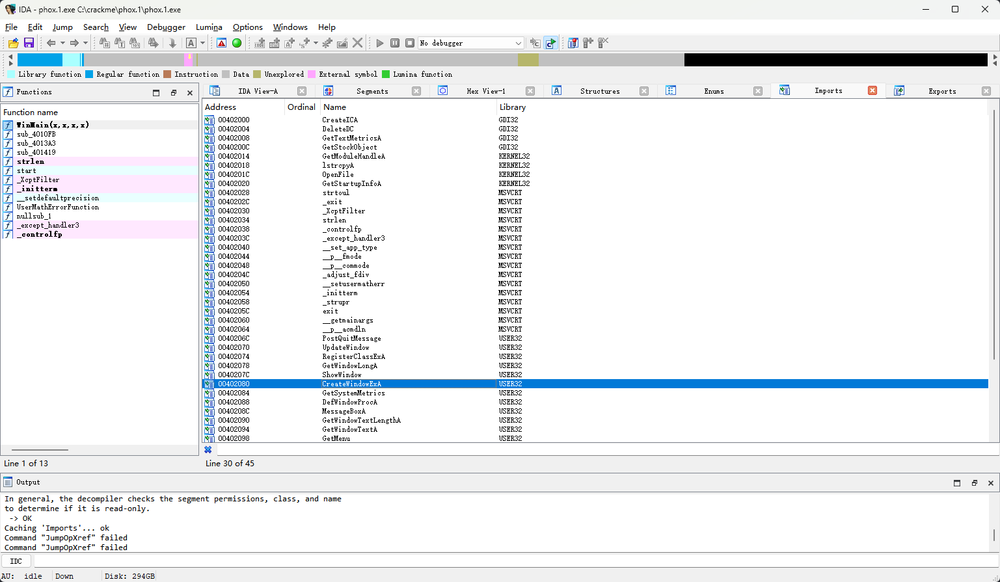

这一行显示三项直接观察结果：函数名是 `CreateWindowExA`，来自 `USER32`，地址为 `0x402080`。函数名说明它可能负责创建窗口，但名称本身还不能证明它创建的就是刚才看到的主窗口；还要检查调用位置和参数。

双击 `CreateWindowExA` 进入这个地址项，再按 <kbd>X</kbd> 查看哪些代码引用了它。

<!-- TODO: IDA 截图：在 CreateWindowExA 导入项查看 xref，显示 WinMain(...)+A8 的 p/r、sub_4010FB+1F4 的 r，以及 sub_4010FB+1FA、+231、+26A 的 p；选中 WinMain(...)+A8 的 p 引用。 -->

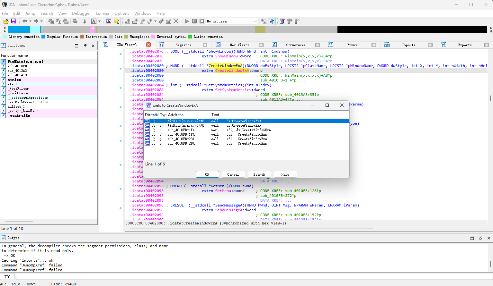

交叉引用窗口的 `Address` 列不一定直接显示绝对地址。IDA 常用“函数名 + 函数内偏移”表示来源位置；本例第一行显示为 `WinMain(...)+A8`，它的完整地址是：

```text
_WinMain@16 起点 + 函数内偏移
= 0x401000 + 0xA8
= 0x4010A8
```

`Type` 列中的字母表示引用方式：

- `p` 表示这里形成了一次过程调用（procedure call）。
- `r` 表示这里读取了 IDA 命名为 `CreateWindowExA` 的 4 字节地址项。

这里的 `p` 和 `r` 描述的是引用方式，不是两个不同的目标。交叉引用窗口列出的是“哪些位置引用了 `CreateWindowExA`”；如果两行的来源地址相同，双击它们自然会跳到同一条指令。

本例的 `WinMain(...)+A8` 就同时出现了一条 `p` 和一条 `r`。它们不是两次不同调用：同一条 `call ds:CreateWindowExA` 既要读取一个 4 字节目标地址，又会形成到外部函数的调用关系，IDA 分别记录了这两种引用。判断二者的区别，要看来源指令如何使用该地址项，而不是看双击后是否跳到同一个位置。

列表中还有 `sub_4010FB+1F4` 的 `r` 引用，以及 `sub_4010FB+1FA`、`sub_4010FB+231`、`sub_4010FB+26A` 的 `p` 引用。前者先把这个地址项读入 `edi`，后三处再通过 `call edi` 调用同一个 API；它们具体创建什么，需要分别检查调用参数，本章不展开。

本章先双击 `WinMain(...)+A8` 的 `p` 引用，追踪这次直接调用。

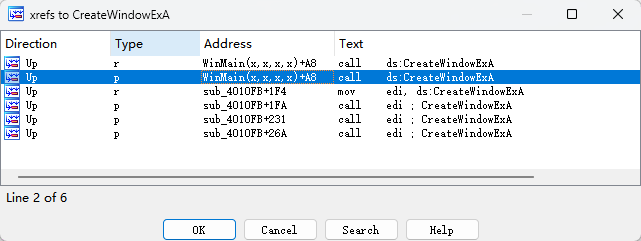

跳转到 `0x4010A8` 后，可以看到这个位置位于 `_WinMain@16`。前面的指令正在按 x86 `stdcall` 的约定，从最后一个参数开始反向压栈：

```asm
0x40108A  push esi
0x40108B  push [ebp+hInstance]
0x40108E  push esi
0x40108F  push esi
0x401090  push [ebp+nHeight]
0x401093  push [ebp+nWidth]
0x401096  push [ebp+Y]
0x401099  push [ebp+X]
0x40109C  push 0xCF0000
0x4010A1  push offset WindowName
0x4010A6  push edi
0x4010A7  push esi
0x4010A8  call ds:CreateWindowExA
```

<!-- TODO: IDA 截图：跳到 0x4010A8，显示 call ds:CreateWindowExA、上方 12 个参数压栈，并让 WindowName 注释中的 "PhoX' CrackMe" 可见；若当前界面已开启指令字节显示，再让 FF 15 80 20 40 00 出现在同一行。 -->

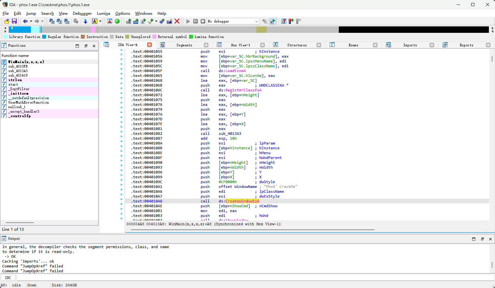

结合 IDA 添加的函数原型和参数注释，可以看出这次调用负责创建标题为 `PhoX' CrackMe` 的主窗口。这里先关注最后一条指令，而不是分析各个窗口参数。

IDA 解析导入信息后，会用 `CreateWindowExA` 代替操作数中的数值地址，所以反汇编窗口通常显示 `call ds:CreateWindowExA`，不会同时写出后面的 `0x402080`。去掉 IDA 添加的符号名，这条指令等价于：

```asm
call dword ptr ds:[0x402080]
```

这个数值形式可以由指令的 6 字节机器码验证：

```text
FF 15 80 20 40 00
```

IDA 是否直接显示这 6 个字节取决于界面设置；如果当前反汇编窗口没有机器码列，可以在 Hex View 中跳到指令地址 `0x4010A8` 查看原始字节。前两个字节 `FF 15` 编码的是一次通过内存地址进行的间接 `call`，后面的 4 字节按小端序读取为 `0x00402080`，这正是被符号名遮住的操作数地址。

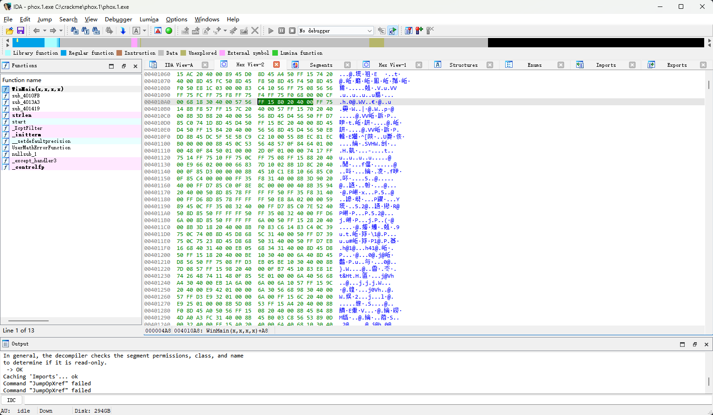

反汇编中的方括号表示内存访问，因此 CPU 不是跳到 `0x402080` 执行，而是先读取这个地址处保存的 4 字节，再把读到的值作为调用目标：

这条 `call` 从 `0x4010A8` 开始，共占 6 字节，因此调用返回后继续执行的位置是：

```text
0x4010A8 + 6 = 0x4010AE
```

```text
读取 [0x402080]
       ↓
得到一个 32 位函数地址
       ↓
压入返回地址 0x4010AE
       ↓
跳到该函数地址
```

在 `call ds:CreateWindowExA` 中双击函数名 `CreateWindowExA`，可以跳到对应的地址项。IDA 显示：

```asm
.idata:00402080  extrn CreateWindowExA:dword
```

`extrn` 表示 IDA 将它识别为当前 exe 外部的符号，`dword` 表示这里是一个 4 字节位置。IDA 在加载 PE 时解析了文件的导入信息，因此能把该位置与 `CreateWindowExA` 名称关联起来。这里先记录 IDA 给出的分析结果；这个地址项在 PE 文件中属于什么结构，还要回到原始字段中验证。

第一章已经使用过“Imports -> xref -> 调用点”这条路线。这里暂不继续分析窗口参数，而是追问 IDA 名称背后的依据：`0x402080` 究竟属于哪张 PE 表，磁盘中又保存了什么？这些问题要用 010 Editor 检查原始文件结构后才能回答。

### 先区分三个地址

继续之前，先把本章反复出现的三个地址分开：

| 地址         | 对象                                   |
| ------------ | -------------------------------------- |
| `0x4010A8`   | 执行间接 `call` 的代码地址             |
| `0x402080`   | IDA 显示的 4 字节外部函数地址项        |
| 运行时解析值 | USER32.dll 中 `CreateWindowExA` 的地址 |

`0x4010A8` 是指令本身，`0x402080` 是指令读取的地址项，地址项里的值才是最终调用目标。IDA 为什么把这个地址项命名为 `CreateWindowExA`，接下来从 PE 的导入结构逐步验证。

## 用 010 Editor 找到导入描述符

IDA 已经给出了 `USER32`、`CreateWindowExA` 和地址项 `0x402080`，但这些仍是 IDA 的解析结果。现在用 010 Editor 打开同一份 `phox.1.exe`，从 `Import` 数据目录找到导入描述符数组，再检查原始 PE 文件怎样记录 DLL 名称、API 名称和地址槽位。

### 读取 Import 数据目录项

在 010 Editor 的模板结果中展开：

```text
NtHeader
   └─ OptionalHeader
      └─ DataDirArray
         └─ Import
```

展开后读到：

| 数据目录项 | RVA      | 大小   | 本章作用           |
| ---------- | -------- | ------ | ------------------ |
| `Import`   | `0x20D4` | `0x64` | 定位导入描述符数组 |

<!-- TODO: 010 Editor 截图：展开 NtHeader -> OptionalHeader -> DataDirArray，突出显示 Import 的 RVA 0x20D4 和大小 0x64；本节不讲 ImportAddressTable 数据目录，截图尽量不要让它成为视觉重点。 -->

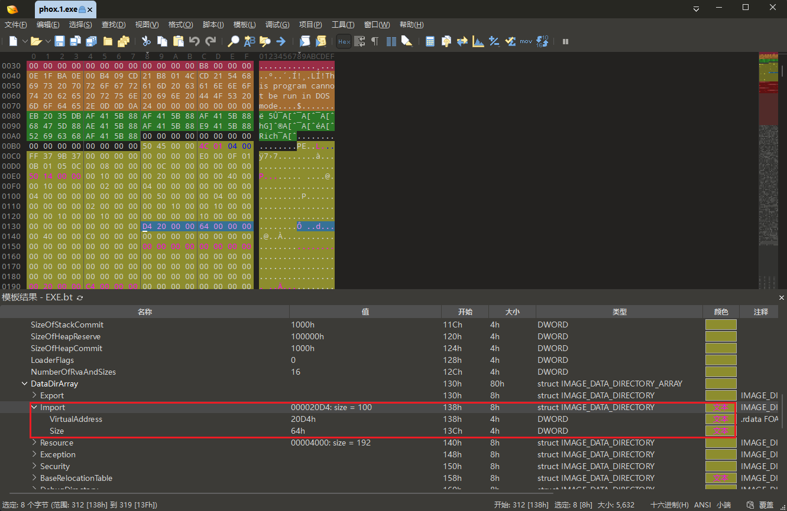

`Import` 数据目录指向一个导入描述符数组。数组中的每个有效描述符对应一个 DLL，并通过字段继续指向该 DLL 的名称和导入项。这里的 `0x20D4` 是 RVA，不能直接当作文件偏移使用，因此先利用 `.rdata` 的节信息将它换算成 FOA。上一章读到 `.rdata` 的字段为：

```text
.rdata.VirtualAddress   = RVA 0x2000
.rdata.VirtualSize      = 0x4D8
.rdata.SizeOfRawData    = 0x600
.rdata.PointerToRawData = FOA 0x0C00
```

`0x20D4` 落在 `.rdata` 的有效虚拟内容中，对应的节内偏移 `0xD4` 也位于该节的原始文件数据内，因此可以使用上一章的公式换算：

```text
导入目录 FOA = 0xC00 + (0x20D4 - 0x2000)
             = 0xCD4
```

计算结果 `0xCD4` 与 010 Editor 顶层 `ImportDescriptor[0]` 的“开始”列一致。接下来就从这里读取第一个导入描述符；IAT 的文件位置等读到该描述符中的 `FirstThunk` 后再计算。

PE 规范规定一个 `IMAGE_IMPORT_DESCRIPTOR` 固定占 `0x14`（20）字节。数据目录字段给出的 `0x64` 字节因此可以容纳 5 项：

```text
0x64 / 0x14 = 5
```

模板实际解析出 4 个非零描述符。“值”列还直接显示了每个描述符对应的 DLL 名称：

| 描述符                | FOA      | 模板显示的值   |
| --------------------- | -------- | -------------- |
| `ImportDescriptor[0]` | `0x0CD4` | `USER32.dll`   |
| `ImportDescriptor[1]` | `0x0CE8` | `GDI32.dll`    |
| `ImportDescriptor[2]` | `0x0CFC` | `MSVCRT.dll`   |
| `ImportDescriptor[3]` | `0x0D10` | `KERNEL32.dll` |

紧随其后的第 5 项从 FOA `0x0D24` 开始，到 `0x0D37` 结束，20 字节全部为零。它不对应第 5 个 DLL，也不是为了地址对齐而添加的填充；这是一个有明确含义的**全零终止描述符**，Windows 读取到它就知道描述符数组已经结束。

一般来说，程序依赖 `N` 个 DLL，就会有 `N` 个非零的 `IMAGE_IMPORT_DESCRIPTOR`，后面再跟一个 20 字节全零的结束项。本例依赖 4 个 DLL，因此共有 4 个有效描述符和 1 个全零结束项，正好占用数据目录给出的 `0x64` 字节：

```text
(4 + 1) * 0x14 = 0x64
```

因此，一个有效的 `IMAGE_IMPORT_DESCRIPTOR` 描述的是**一个 DLL 依赖**，不是一个 API；同一 DLL 导入的多个函数由该描述符指向的后续表项列出。

这里的 DLL 名称是模板根据描述符中的 `Name` 字段继续解析后给出的摘要，不是直接存放在这 20 字节描述符里的文本。接下来先检查每个描述符的 `Name`，找到真正属于 USER32 的那一项。

### 沿 Name 确认 USER32 描述符

PE 规范规定 `IMAGE_IMPORT_DESCRIPTOR` 的五个字段按下面的顺序排列，每个字段占 4 字节：

| 描述符内偏移 | 字段                 |
| ------------ | -------------------- |
| `+0x00`      | `OriginalFirstThunk` |
| `+0x04`      | `TimeDateStamp`      |
| `+0x08`      | `ForwarderChain`     |
| `+0x0C`      | `Name`               |
| `+0x10`      | `FirstThunk`         |

当前只读取 `Name`。第一个描述符从 FOA `0xCD4` 开始，因此它的 `Name` 字段位于：

```text
Name 字段 FOA = 0xCD4 + 0x0C
              = 0xCE0
```

FOA `0xCE0` 的 4 字节是：

```text
52 23 00 00 -> RVA 0x2352
```

`Name = 0x2352` 指向 DLL 名称字符串。把它换算成 FOA：

```text
DLL 名称 FOA = 0xC00 + (0x2352 - 0x2000)
             = 0xF52
```

从 FOA `0xF52` 开始的字节是：

```text
55 53 45 52 33 32 2E 64 6C 6C 00
 U  S  E  R  3  2  .  d  l  l \0
```

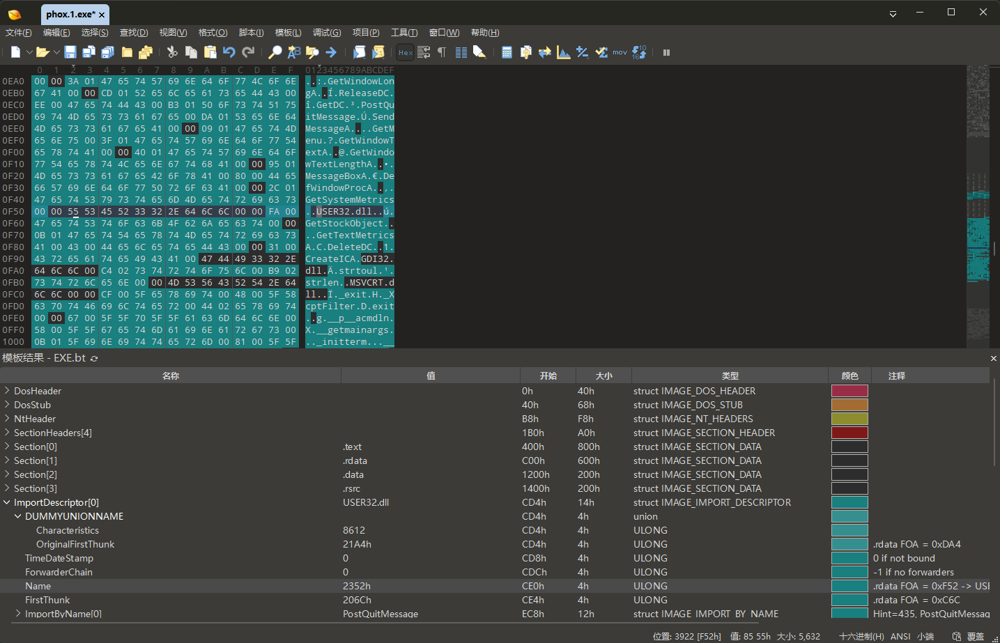

所以第一个描述符属于 `USER32.dll`，模板将它编号为 `ImportDescriptor[0]`。这里的 `[0]` 只表示它是数组第一项；如果 USER32 出现在第二个描述符中，编号就会是 `[1]`。

### 读取 USER32 描述符的两个表起点

现在已经确认 FOA `0xCD4` 是 USER32 描述符，再读取它的第一个和最后一个字段：

| 字段                 | 字段 FOA | 原始字节      | 小端序值     | 下一步用途    |
| -------------------- | -------- | ------------- | ------------ | ------------- |
| `OriginalFirstThunk` | `0xCD4`  | `A4 21 00 00` | RVA `0x21A4` | 查找 API 名称 |
| `FirstThunk`         | `0xCE4`  | `6C 20 00 00` | RVA `0x206C` | 定位 IAT 槽位 |

<!-- TODO: 010 Editor 截图：展开 ImportDescriptor[0] 和 DUMMYUNIONNAME，同屏显示 OriginalFirstThunk=0x21A4、Name=0x2352、FirstThunk=0x206C；让 Characteristics 与 OriginalFirstThunk 显示相同起点 0xCD4，并高亮原始字节 A4 21 00 00。说明两者是 union 中同一个 DWORD 的两个名称，模板分别用十进制 8612 和十六进制 21A4h 显示。 -->

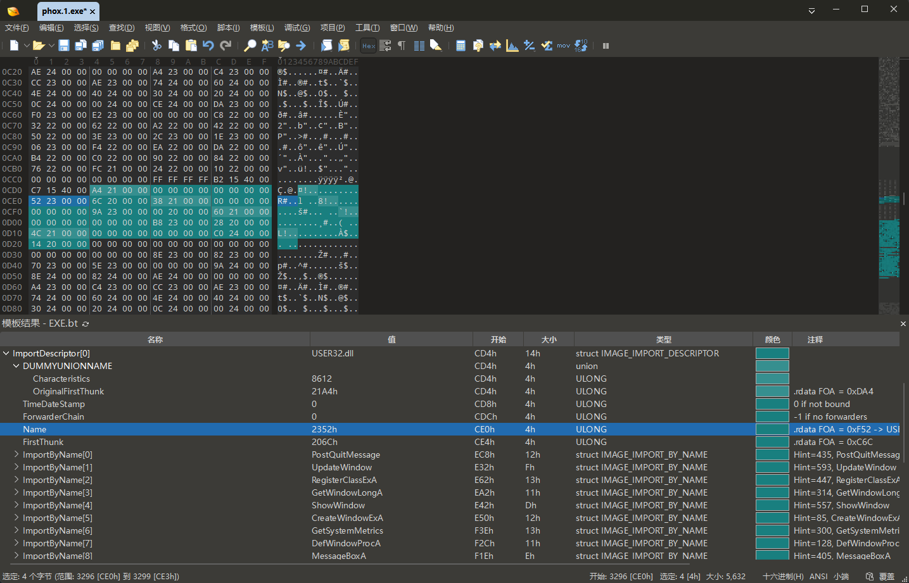

模板把第一个 DWORD 显示成名为 `DUMMYUNIONNAME` 的 union，其中有 `Characteristics` 和 `OriginalFirstThunk` 两种解释。两行都从 FOA `0xCD4` 开始，共用原始字节 `A4 21 00 00`，不是两个连续字段：

```text
Characteristics    = 8612（十进制）
OriginalFirstThunk = 0x21A4（十六进制）
```

本章分析普通导入，因此按 `OriginalFirstThunk = RVA 0x21A4` 解释。中间的 `TimeDateStamp` 和 `ForwarderChain` 与绑定导入有关，本例都为 `0`，不参与当前主线。

## 从 USER32 描述符找到 CreateWindowExA

现在已经确认第一个描述符属于 `USER32.dll`。接下来只追踪一个目标：先找到 `CreateWindowExA` 的名称记录，再找到程序调用它时使用的 IAT 槽位。

描述符中的两个字段分别提供起点：

```text
OriginalFirstThunk = RVA 0x21A4  -> 从这里查找 API 名称
FirstThunk         = RVA 0x206C  -> 从这里定位 IAT 槽位
```

先沿 `OriginalFirstThunk` 查名称。确认名称和索引后，再使用同一个索引计算 IAT 槽位；这样不需要同时在两张表之间来回切换。

### 先沿 OriginalFirstThunk 查名称

Microsoft PE 规范把 `OriginalFirstThunk` 指向的表称为 **Import Lookup Table（ILT，导入查找表）**。很多逆向资料也称它为 **Import Name Table（INT，导入名称表）**；这两个名称指的是同一张表，本章简写为 `INT`。

INT 可以看成一个连续数组。当前样本是 PE32，每个表项固定占 4 字节，保存下一步查找 API 所需的信息；最后再用一个全零表项标记结束。这里的“4 字节”只指 INT 表项本身，不是它稍后指向的 API 名称结构大小。

`OriginalFirstThunk = 0x21A4` 是 RVA。将它换算成 FOA：

```text
INT 起点 FOA = 0xC00 + (0x21A4 - 0x2000)
             = 0xDA4
```

没有模板时，从 FOA `0xDA4` 开始逐项查找：每次读取 4 字节；如果表项全零，说明 INT 已经结束；如果表项最高位为 0，就把读出的值当作名称结构 RVA，换算成 FOA 后跳过 2 字节 `Hint`，再读取 API 名称。

先读取第 1 项：

```text
INT 表项 FOA 0xDA4
→ 原始字节 C8 22 00 00
→ 名称结构 RVA 0x22C8
→ 名称结构 FOA 0xEC8
→ API 名称 PostQuitMessage
```

它不是目标，所以下一项从 FOA `0xDA8` 开始。按相同方法继续，前 6 项的查找结果是：

```text
FOA 0xDA4 → RVA 0x22C8 → PostQuitMessage
FOA 0xDA8 → RVA 0x2232 → UpdateWindow
FOA 0xDAC → RVA 0x2262 → RegisterClassExA
FOA 0xDB0 → RVA 0x22A2 → GetWindowLongA
FOA 0xDB4 → RVA 0x2242 → ShowWindow
FOA 0xDB8 → RVA 0x2250 → CreateWindowExA
```

到第 6 项才找到 `CreateWindowExA`。索引从 `0` 开始，因此第 6 项的索引是 `5`。它在 INT 中的位置也可以直接计算：

```text
第 6 个 INT 表项 FOA = 0xDA4 + 5 * 4
                     = 0xDB8
```

FOA `0xDB8` 到 `0xDBB` 的 4 字节为：

```text
50 22 00 00
```

按小端序读取，表项中保存的值是：

```text
RVA 0x2250
```

这里必须区分“表项的位置”和“表项保存的值”：

| 对象                 | 坐标与数值   | 含义                        |
| -------------------- | ------------ | --------------------------- |
| 第 6 个 INT 表项位置 | FOA `0xDB8`  | 去文件中的哪里读取这 4 字节 |
| INT 表项保存的值     | RVA `0x2250` | 这 4 字节指向下一步哪个结构 |

010 Editor 模板自动执行了上述逐项解析，所以在 `ImportDescriptor[0]` 下把这一项显示为 `ImportByName[5] = CreateWindowExA`。方括号中的 `[5]` 就是刚才手工得到的索引；该节点“开始”列中的 FOA `0xE50` 是名称结构的位置，不是 INT 表项自身的 FOA `0xDB8`。

<!-- TODO: 010 Editor 截图：在 ImportDescriptor[0] 下定位 ImportByName[5]，显示值 CreateWindowExA、开始 FOA 0xE50，并保留 OriginalFirstThunk=0x21A4。 -->

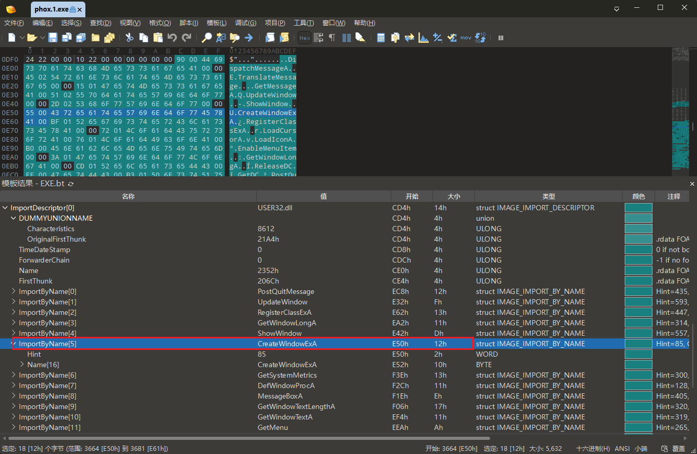

### 沿 RVA 0x2250 读取 API 名称

PE32 的 INT 表项有两种解释：最高位为 1 时表示按序号导入；最高位为 0 时，其余位是一个 `IMAGE_IMPORT_BY_NAME` 结构的 RVA。本例的 `0x2250` 最高位为 0，所以它指向名称结构。

把 RVA `0x2250` 换算成 FOA：

```text
名称结构 FOA = 0xC00 + (0x2250 - 0x2000)
             = 0xE50
```

按 <kbd>Ctrl</kbd> + <kbd>G</kbd> 跳到 FOA `0xE50`，可以看到：

```text
55 00 43 72 65 61 74 65 57 69 6E 64 6F 77 45 78 41 00
----- ------------------------------------------------
Hint  ASCII 名称与结尾 NUL
```

`IMAGE_IMPORT_BY_NAME` 由一个固定的 2 字节 `Hint` 和一个不定长的 NUL 结尾字符串组成：

| 字段   | FOA      | 大小    | 本例内容                       |
| ------ | -------- | ------- | ------------------------------ |
| `Hint` | `0x0E50` | 2 字节  | `85`，即十六进制 `0x0055`      |
| `Name` | `0x0E52` | 15 字节 | ASCII 字符串 `CreateWindowExA` |
| 结尾   | `0x0E61` | 1 字节  | NUL `0x00`                     |

<!-- TODO: 010 Editor 截图：展开 ImportByName[5]，显示 Hint=85、Name[16]=CreateWindowExA，并让上方高亮 FOA 0xE50 开始的原始字节；Name[16] 的长度包含结尾 NUL。 -->

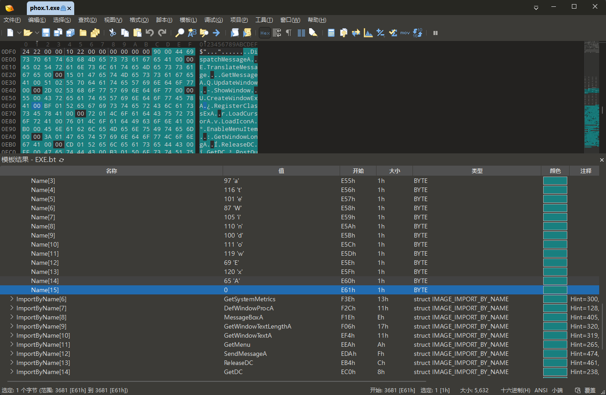

开头的 `55 00` 按小端序读成 `0x0055`，即十进制 `85`；后面的字节组成 `CreateWindowExA`。因此，INT 的第 6 项确实记录了这个 API 名称。

表项和它指向的结构大小不同：INT 表项始终只有 4 字节，而 `IMAGE_IMPORT_BY_NAME` 的总大小会随 API 名称长度变化。010 Editor 中 `ImportByName[5]` 的“开始”列显示 `0xE50`，表示名称结构的 FOA，不是第 6 个 INT 表项所在的 FOA `0xDB8`。

> [!NOTE]- Hint 和按序号导入
> `Hint` 只是帮助装载器查找导出名称的提示值，真正指定本次导入对象的是 `CreateWindowExA` 字符串。如果 INT 表项最高位为 1，则该项表示按序号导入，不再指向 `IMAGE_IMPORT_BY_NAME`；本例不走这条路径。

### 用同一个索引定位 IAT 槽位

现在已经通过 INT 的第 6 项确认 API 名称。描述符中的 `FirstThunk = 0x206C` 指向 USER32 对应的 **IAT（Import Address Table，导入地址表）** 起点。

INT 和 IAT 按相同索引对应同一个 API：INT 的第 6 项记录 `CreateWindowExA` 的查找信息，IAT 的第 6 项则是 Windows 将要填写、程序运行时将要读取的地址槽位。因此仍使用索引 `5`：

```text
IAT 槽位 RVA = 0x206C + 5 * 4
             = 0x2080

IAT 槽位 FOA = 0xC00 + (0x2080 - 0x2000)
             = 0xC80

IAT 槽位 VA  = 0x400000 + 0x2080
             = 0x402080
```

这三个地址表示同一个 IAT 槽位在不同坐标系中的位置：

| 坐标 | 地址       | 用途                               |
| ---- | ---------- | ---------------------------------- |
| RVA  | `0x2080`   | 描述槽位相对映像基址的位置         |
| FOA  | `0xC80`    | 在磁盘文件中查看槽位的初始 4 字节  |
| VA   | `0x402080` | 程序运行时由 `call` 读取的内存地址 |

FOA `0xC80` 中的初始 4 字节也是：

```text
50 22 00 00 -> RVA 0x2250
```

这不表示 INT 和 IAT 是同一张表。第 6 个 INT 表项位于 FOA `0xDB8`，第 6 个 IAT 表项位于 FOA `0xC80`；它们只是磁盘初值相同。在普通未绑定导入中，Windows 会保留 INT 中的名称查找信息，并把解析出的函数地址写入 IAT。

到这里不需要再检查 USER32 的其他表项。只追踪索引 `5`，就建立了本章需要的对应关系：

```text
OriginalFirstThunk = RVA 0x21A4
└─ INT 第 6 项位于 FOA 0xDB8
   └─ 保存 RVA 0x2250
      └─ FOA 0xE50: "CreateWindowExA"

FirstThunk = RVA 0x206C
└─ IAT 第 6 个槽位
   ├─ RVA 0x2080
   ├─ FOA 0xC80
   └─ VA  0x402080
```

这也解释了 IDA 为什么把 `0x402080` 命名为 `CreateWindowExA`：它沿导入描述符和 INT 找到名称，再把同一索引对应到 IAT 槽位。

## Windows 如何填写 IAT

010 Editor 已经证明磁盘中的 IAT 槽位初值为 `0x2250`，它仍然指向名称结构，不是 USER32 中的函数地址。接下来要解释 Windows 如何把这个初值变成程序可以调用的地址。

Windows 创建进程并映射 PE 时，会在执行程序入口之前处理普通导入。对本章追踪的这一项，可以把过程理解为：

1. 从导入描述符的 `Name` 找到 `USER32.dll`。
2. 确保 USER32.dll 已装入当前进程。
3. 从 INT 的第 6 项找到名称 `CreateWindowExA`。
4. 在 USER32.dll 的导出信息中解析该函数本次运行的地址。
5. 把结果写入同一索引对应的 IAT 槽位。

本例的目标槽位是 RVA `0x2080`。如果 `phox.1.exe` 仍装载在基址 `0x400000`，它在进程中的地址就是：

```text
IAT 槽位 VA = 模块基址 + 槽位 RVA
            = 0x400000 + 0x2080
            = 0x402080
```

`FirstThunk = 0x206C` 指向 USER32 的 IAT 起点，索引 `5` 对应的第 6 个槽位位于 RVA `0x2080`。因此，程序运行时要查看的就是 VA `0x402080`。

静态文件只能告诉我们该槽位的初值是 `0x2250`。Windows 实际写入了哪个函数地址，还要到运行中的进程里观察。

## 用 x32dbg 验证运行时调用

这一阶段只回答两个问题：运行时的 `[0x402080]` 保存什么，以及 CPU 执行 `call [0x402080]` 后是否真的进入 `CreateWindowExA`。

### 查看装载器填写后的槽位

用 x32dbg 打开 `phox.1.exe`，停在程序入口 `0x401450` 时，Windows 已经完成普通导入解析。在 Dump 窗口按 <kbd>Ctrl</kbd> + <kbd>G</kbd>，输入 `0x402080`，按 DWORD 查看该位置。

<!-- TODO: x32dbg 截图：程序停在入口时，Dump 跳到当前模块基址 + 0x2080，显示槽位的实际 4 字节和小端 DWORD；同时用符号或注释证明同一实际地址解析为 USER32.CreateWindowExA。若地址与正文不同，统一更新本节所有实测值。 -->

本次运行读到：

```text
地址        原始字节       小端序 DWORD
0x402080    B0 E6 BB 75  -> 0x75BBE6B0
```

这 4 字节表示地址，不是字符串，所以 Dump 右侧的 ASCII 列出现不可读字符是正常现象。把它按小端序读成 DWORD，才能得到函数地址 `0x75BBE6B0`。

在 x32dbg 的表达式框中查询 `user32:CreateWindowExA`，结果同样是 `0x75BBE6B0`。现在可以比较同一个 IAT 槽位装载前后的内容：

| 阶段     | 槽位位置      | 4 字节        | 解释                  |
| -------- | ------------- | ------------- | --------------------- |
| 磁盘文件 | FOA `0xC80`   | `50 22 00 00` | 名称结构 RVA `0x2250` |
| 当前进程 | VA `0x402080` | `B0 E6 BB 75` | 函数地址 `0x75BBE6B0` |

磁盘中的 `0x2250` 用于查找名称；运行内存中的 `0x75BBE6B0` 是 Windows 解析后写入的函数地址。表达式查询又将该地址识别为 `USER32.CreateWindowExA`，因此三项证据能够互相对应。

这里的 `0x75BBE6B0` 只属于本次调试，不能把它当作 PE 文件中的固定值。ASLR 也不表示每次重新启动 `phox.1.exe` 都必须换一个地址；系统 DLL 在同一次 Windows 启动期间通常会保持相同的装载基址，因此反复关闭并打开样本时可能看到相同结果。重启 Windows、更新系统 DLL 或换到另一台机器后，这个地址都可能变化。

### 在调用点观察间接跳转

在 CPU 反汇编窗口按 <kbd>Ctrl</kbd> + <kbd>G</kbd> 跳到 `0x4010A8`，按 <kbd>F2</kbd> 设置断点，再按 <kbd>F9</kbd> 运行。程序会在创建主窗口前停下，当前指令为：

```asm
call dword ptr ds:[0x00402080]
```

<!-- TODO: x32dbg 截图：在 0x4010A8 断下，CPU 窗口显示 call dword ptr ds:[0x00402080]，同时让右侧或底部可见目标解析为 USER32.CreateWindowExA。 -->

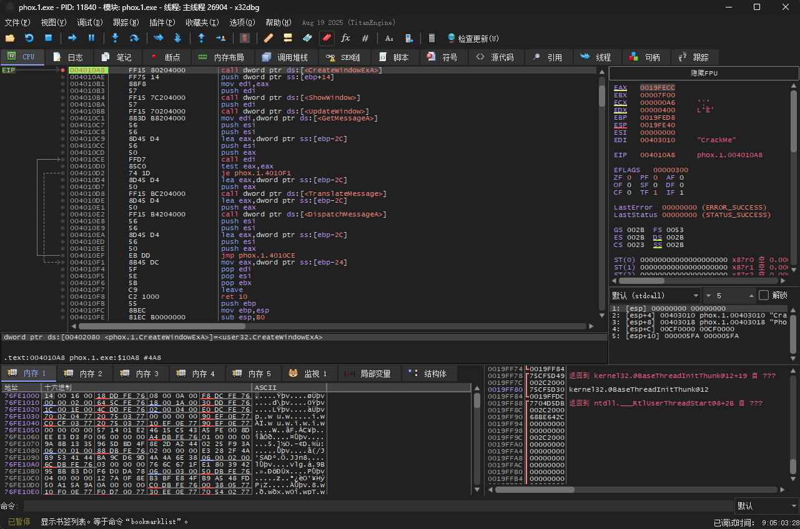

方括号表示 CPU 要先读取地址 `0x402080` 中的内容。按下面的顺序验证：

1. 在 Dump 中确认 `[0x402080] = 0x75BBE6B0`。
2. 按一次 <kbd>F7</kbd> 单步进入当前调用。
3. 确认 `EIP` 到达 `0x75BBE6B0`，并由 x32dbg 将其识别为 `USER32.CreateWindowExA`。
4. 查看栈顶，确认返回地址为下一条指令 `0x4010AE`。

<!-- TODO: x32dbg 截图：F7 进入后显示 EIP 位于 USER32.CreateWindowExA，栈顶返回地址为 0x4010AE。实际 USER32 地址以截图环境为准。 -->

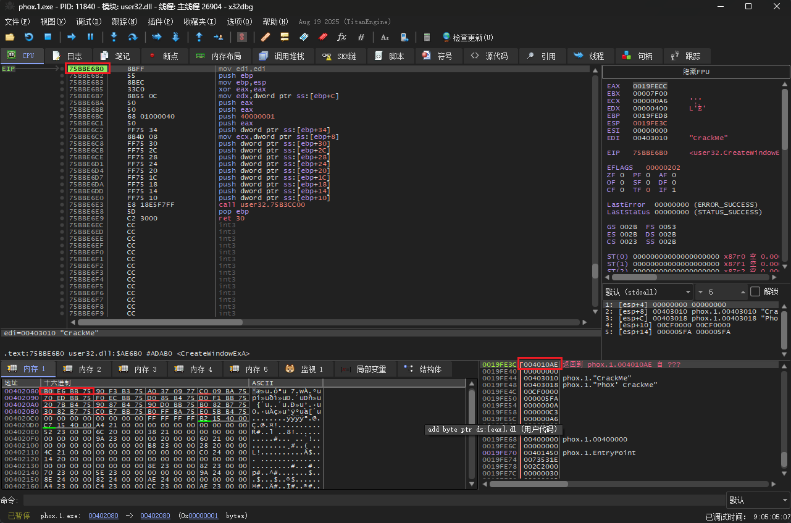

这次单步验证了整条运行时路径：

```text
0x4010A8 执行 call [0x402080]
              ↓
读取 IAT 槽位中的 0x75BBE6B0
              ↓
压入返回地址 0x4010AE
              ↓
EIP 跳到 USER32.CreateWindowExA
```

至此，三个工具分别完成了自己的任务：IDA 找到调用点，010 Editor 从磁盘结构证明名称和槽位的对应关系，x32dbg 则证明 Windows 已填入函数地址，而且 CPU 确实通过该槽位完成调用。

## 回到 IDA：IAT 对逆向有什么用

理解结构之后，实际分析仍会频繁回到 IDA。多数时候不需要为每个 API 都手工计算 INT、IAT 和文件偏移；IDA 已经替我们解析导入信息并建立名称与交叉引用。理解底层结构的价值，是知道这些名字从哪里来、它们何时可信，以及遇到异常导入时应检查哪里。

### 用 API 名称判断行为

本例中的 API 名称可以提供以下候选线索：`CreateWindowExA` 值得用于寻找窗口或控件的创建代码，`GetWindowTextA` 值得用于寻找文本读取，`MessageBoxA` 值得用于寻找提示信息，`OpenFile` 值得用于寻找文件访问。只有继续检查参数、字符串和后续分支，才能确认每个调用在当前程序中的具体用途。

常见分析流程是：

```text
Imports 中选择感兴趣的 API
               ↓
查看该导入项或跳板的交叉引用
               ↓
回到一个或多个真实调用点
               ↓
结合参数、周围字符串和控制流判断用途
```

例如，同一个 `CreateWindowExA` 既能创建顶层窗口，也能创建按钮、编辑框等子控件；仍要检查 `lpClassName`、`lpWindowName`、样式和父窗口等参数。本章正是通过 `WindowName = "PhoX' CrackMe"` 和其他参数，确认 `0x4010A8` 创建的是主窗口。

### 间接调用不一定直接显示 API 名称

本章的 `0x4010A8` 直接读取固定 IAT 槽位，IDA 很容易将其标成 `CreateWindowExA`。但代码也可能先把槽位中的地址读入寄存器，再通过寄存器调用。例如本样本会先执行：

```asm
mov esi, ds:GetWindowTextA
```

后面再多次执行：

```asm
call esi
```

这时只在 `call esi` 上查找固定地址，可能看不到完整关系。要向上追踪寄存器从哪里赋值，并结合 IDA 的数据流、注释和交叉引用判断目标。

### IAT 也可能成为动态观察点

因为多个调用点可能共用同一个 IAT 槽位，调试时可以直接查看槽位当前保存的地址，或者跟随该地址进入系统 DLL。现阶段需要记住的是：代码使用的是进程内存中 IAT 槽位的当前值，不是磁盘文件中最初的名称 RVA。

## 常见误区

### 把导入目录当成 IAT

导入目录从 RVA `0x20D4` 开始，内容是多个 `IMAGE_IMPORT_DESCRIPTOR`；USER32 描述符中的 `FirstThunk = 0x206C` 则指向该 DLL 的 IAT 起点。描述符负责提供导入信息，IAT 槽位负责在运行时保存函数地址，两者不是同一种结构。

### 把 0x402080 当成函数入口

`0x402080` 是 4 字节槽位，不是 `CreateWindowExA` 的机器码地址。`call [0x402080]` 要先读取槽位，真正函数入口是读出的值。

### 把 0x2250 当成运行时函数地址

磁盘 IAT 和 INT 中的 `0x2250` 是 `IMAGE_IMPORT_BY_NAME` 的 RVA，指向 Hint 和字符串。装载器解析名称后，才把运行时函数地址写入 IAT。

### 把 OriginalFirstThunk 和 FirstThunk 当成同一个字段

两者指向的表在本样本中具有相同的磁盘初始表项，但表的起点和职责不同。`OriginalFirstThunk` 指向供装载器查找名称的 INT/ILT，`FirstThunk` 指向将被填写并供程序调用的 IAT。

### 把 Hint 当成固定函数序号

`Hint = 85` 只是查找提示。装载器仍需核对 `CreateWindowExA` 名称；它不是函数地址，也不是跨 Windows 版本保持不变的调用依据。

### 认为 USER32 的实际地址永远相同

本次运行中 IAT 槽位为 `0x75BBE6B0`，只代表当前系统和当前进程。分析其他环境时，应重新从 IAT、模块列表或符号解析中读取，不能照抄该地址。

### 把 IDA 的 .idata 当成原始节名

本样本的 PE 节表只有 `.text`、`.rdata`、`.data` 和 `.rsrc`。导入结构实际位于 `.rdata`；IDA 为分析方便划出的 `.idata` 是数据库中的逻辑 Segment，不会在磁盘节表中增加第五个节。

## 小结

本章始终追踪 `_WinMain@16` 中的一次 `CreateWindowExA` 调用。IDA 先把间接调用显示成可识别的 API 名称；010 Editor 随后证明 DLL 名称、函数名称、INT 和 IAT 槽位都来自 PE 的导入结构；x32dbg 最后证明 Windows 已将同一个 IAT 槽位改写为 USER32.dll 中的实际函数地址。

整条关系可以收拢为：

```text
ImportDescriptor[0]
├─ Name = RVA 0x2352
│  └─ "USER32.dll"
│
├─ OriginalFirstThunk = RVA 0x21A4
│  └─ INT 第 6 项位于 FOA 0xDB8
│     └─ 保存 RVA 0x2250
│        └─ FOA 0xE50: Hint 85, "CreateWindowExA"
│
└─ FirstThunk = RVA 0x206C
   └─ IAT 第 6 个槽位
      ├─ RVA 0x2080 / FOA 0xC80 / VA 0x402080
      ├─ 磁盘初值：RVA 0x2250
      └─ 装载后：[0x402080] = USER32.CreateWindowExA 的地址
                               ↑
0x4010A8: call dword ptr [0x402080]
```

IAT 对逆向最直接的价值，是把难以理解的间接地址调用恢复成有行为含义的 API 名称，并让我们能从 API 交叉引用快速定位代码。理解磁盘结构和装载过程，则让这项分析结果不再是“IDA 自动显示出来的答案”：你已经知道名称来自哪里、地址何时被填写，以及 CPU 最终怎样使用它。

## 练习

1. `GetWindowTextA` 是 USER32 导入列表中索引为 `10` 的项目。已知 `OriginalFirstThunk = 0x21A4`，计算它的 INT 表项 RVA 和 FOA。

   > [!NOTE]- 参考答案
   > PE32 每个 thunk 表项占 4 字节：
   >
   > ```text
   > INT RVA = 0x21A4 + 10 * 4 = 0x21CC
   > INT FOA = 0xC00 + (0x21CC - 0x2000) = 0xDCC
   > ```

2. `GetWindowTextA` 对应的 INT 表项保存 `0x22F4`。计算 `IMAGE_IMPORT_BY_NAME` 的 FOA，并说明该位置应包含什么。

   > [!NOTE]- 参考答案
   >
   > ```text
   > 名称结构 FOA = 0xC00 + (0x22F4 - 0x2000) = 0xEF4
   > ```
   >
   > 从 FOA `0xEF4` 开始先有 2 字节 `Hint`，随后是以 NUL 结尾的 ASCII 字符串 `GetWindowTextA`。

3. 已知 `FirstThunk = 0x206C`，使用同一个索引 `10`，计算 `GetWindowTextA` 的 IAT 槽位 RVA、FOA 和静态 VA。

   > [!NOTE]- 参考答案
   >
   > ```text
   > IAT RVA = 0x206C + 10 * 4 = 0x2094
   > IAT FOA = 0xC00 + (0x2094 - 0x2000) = 0xC94
   > IAT VA  = 0x400000 + 0x2094 = 0x402094
   > ```
   >
   > IDA 和 x32dbg 中的 `0x402094` 就是 `GetWindowTextA` 的 IAT 槽位。

4. 为什么磁盘文件 FOA `0xC80` 中的 `0x2250` 与运行时 VA `0x402080` 中的函数地址不同？

   > [!NOTE]- 参考答案
   > 磁盘中的普通未绑定 IAT 初值仍是名称结构 RVA，供装载器解析导入。Windows 根据 `USER32.dll` 和 `CreateWindowExA` 的名称找到本次运行的实际函数地址，再覆盖 IAT 槽位。代码执行时使用的是覆盖后的内存值。

5. `ImportDescriptor[0]` 表示 USER32.dll。为什么不能把它理解成 `CreateWindowExA` 的描述符？

   > [!NOTE]- 参考答案
   > 一个导入描述符对应一个 DLL，并通过 `OriginalFirstThunk` 和 `FirstThunk` 指向该 DLL 的整组导入项。`CreateWindowExA` 只是 USER32 导入列表中索引为 `5` 的一项，不是一个独立的 DLL 描述符。

6. x32dbg 在 `0x4010A8` 执行 `call dword ptr [0x402080]` 前断下。已知当前 `[0x402080] = 0x75BBE6B0`，这次调用应怎样改变 `EIP` 和栈？还应检查什么，才能确认目标确实是 `CreateWindowExA`？

   > [!NOTE]- 参考答案
   > CPU 先读取 IAT 槽位中的 `0x75BBE6B0`，把下一条指令地址 `0x4010AE` 压入栈，再把 `EIP` 改为 `0x75BBE6B0`。还应使用 x32dbg 的符号解析或模块信息确认 `0x75BBE6B0` 位于 USER32.dll，并对应 `CreateWindowExA`；不能只因它看起来像 DLL 地址就直接下结论。
