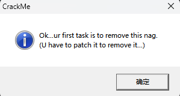
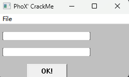
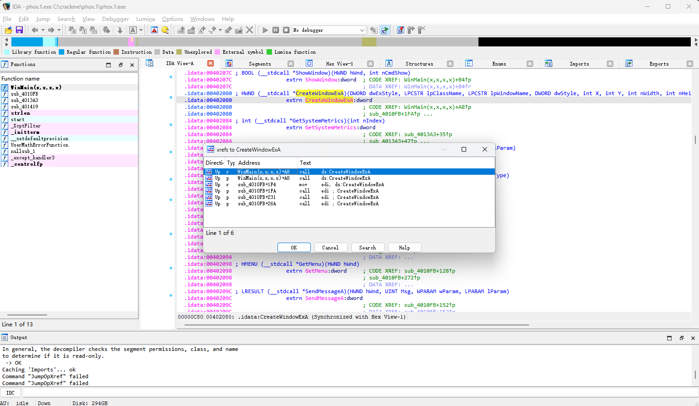
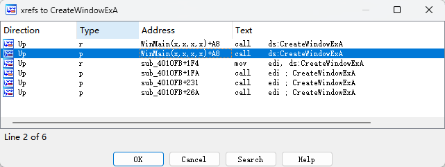
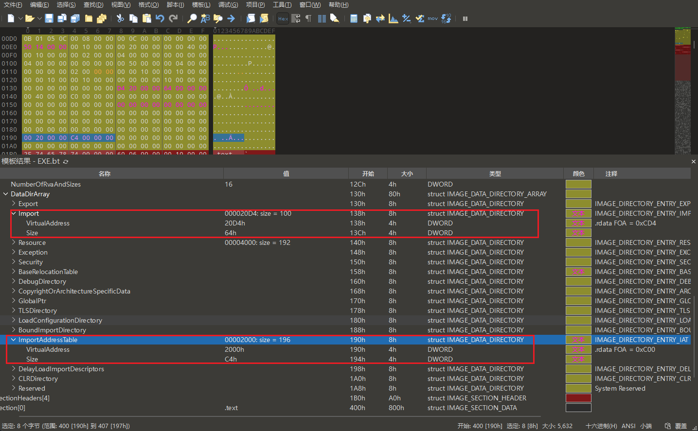

## 程序怎样调用 Windows 提供的函数

上一章一直追踪 `phox.1.exe` 的程序入口，最终把磁盘中的机器码与运行时执行的指令对应起来。但一个 Windows 程序不只执行 exe 自己的代码。双击运行这个样本后，程序会先弹出标题为 `CrackMe` 的提示框；点击“确定”后，才会显示标题为 `PhoX' CrackMe` 的主窗口。

<!-- TODO: 程序运行截图：显示标题为 CrackMe、正文以 "Ok...ur first task" 开头的启动提示框。 -->



<!-- TODO: 程序运行截图：关闭提示框后显示的 PhoX' CrackMe 主窗口，用于提出“窗口由谁创建”的问题。 -->



这个过程至少包含两种界面操作：显示提示框，以及创建并显示主窗口。它们都需要程序请求 Windows 提供的服务。本章选择主窗口作为追踪对象，寻找负责创建它的系统函数。

Windows 将这些可供程序调用的功能组织成 **API（Application Programming Interface，应用程序编程接口）**。例如，程序可以调用某个 API 创建窗口，却不需要把 Windows 的窗口管理代码复制进自己的 exe。

这就留下了一个新问题：`phox.1.exe` 中没有 Windows 系统 DLL 的函数代码，它怎样找到并调用创建主窗口所需的 API？

现在还不知道这个 API 叫什么，也不知道调用位于哪里。本章先在 IDA 的导入函数列表中寻找与“创建窗口”有关的线索，再沿交叉引用找到实际调用；随后用 010 Editor 检查 exe 为这次调用保存了哪些 DLL 名称、函数名称和地址槽位；最后用 x32dbg 观察 Windows 装载程序后填入的真实函数地址。

整章会逐步回答三个问题：

1. 从哪些导入函数和交叉引用可以找到创建主窗口的代码？
2. exe 用什么结构记录它需要的 DLL 和 API 名称？
3. Windows 找到目标函数后，把地址写到哪里，CPU 又怎样使用这个地址？

找到具体 API 后，本章只完整追踪这一条调用。其他 DLL 和 API 用于确认整体结构，不重复相同计算。

本章完成后，你应该能够：

1. 利用 Imports、API 名称和交叉引用找到外部函数的调用位置。
2. 说明导入目录和导入地址表分别解决什么问题。
3. 区分导入描述符、导入查找表、地址槽位和按名称导入结构。
4. 从一个 API 名称算出它对应的导入查找表项与地址槽位。
5. 解释磁盘中的初始表项为什么会在装载后变成函数地址。

> [!WARNING]
> CrackMe 来自第三方合集。运行未知程序时仍应使用虚拟机或隔离环境。本章只读取文件、观察进程内存并在一次 API 调用前设置断点，不修改样本。

## 先用 IDA 找到创建窗口的调用

这一阶段先不展开 PE 字段，只确认代码如何发起外部调用，以及逆向时为什么要关注导入函数。

选择 **View -> Open subviews -> Imports**，可以看到 IDA 从 PE 导入信息中恢复出的 DLL 和函数名称。现在要寻找创建窗口的候选函数，因此先查看名称中包含 `Window` 的项目，再从中找到 `CreateWindowExA`。

<!-- TODO: IDA 截图：Imports 窗口定位 CreateWindowExA，显示模块 USER32 和地址 0x402080。 -->


这一行显示三项直接观察结果：函数名是 `CreateWindowExA`，来自 `USER32`，地址为 `0x402080`。函数名说明它可能负责创建窗口，但名称本身还不能证明它创建的就是刚才看到的主窗口；还要检查调用位置和参数。

双击 `CreateWindowExA` 进入这个地址项，再按 <kbd>X</kbd> 查看哪些代码引用了它。

<!-- TODO: IDA 截图：在 CreateWindowExA 导入项查看 xref，显示 WinMain(...)+A8 的 p/r、sub_4010FB+1F4 的 r，以及 sub_4010FB+1FA、+231、+26A 的 p；选中 WinMain(...)+A8 的 p 引用。 -->



交叉引用窗口的 `Address` 列不一定直接显示绝对地址。IDA 常用“函数名 + 函数内偏移”表示来源位置；本例第一行显示为 `WinMain(...)+A8`，它的完整地址是：

```text
_WinMain@16 起点 + 函数内偏移
= 0x401000 + 0xA8
= 0x4010A8
```

`Type` 列中的字母表示引用方式：

- `p` 表示这里形成了一次过程调用（procedure call）。
- `r` 表示这里读取了 IDA 命名为 `CreateWindowExA` 的 4 字节地址项。

这里的 `p` 和 `r` 描述的是引用方式，不是两个不同的目标。交叉引用窗口列出的是“哪些位置引用了 `CreateWindowExA`”；如果两行的来源地址相同，双击它们自然会跳到同一条指令。

本例的 `WinMain(...)+A8` 就同时出现了一条 `p` 和一条 `r`。它们不是两次不同调用：同一条 `call ds:CreateWindowExA` 既要读取一个 4 字节目标地址，又会形成到外部函数的调用关系，IDA 分别记录了这两种引用。判断二者的区别，要看来源指令如何使用该地址项，而不是看双击后是否跳到同一个位置。

列表中还有 `sub_4010FB+1F4` 的 `r` 引用，以及 `sub_4010FB+1FA`、`sub_4010FB+231`、`sub_4010FB+26A` 的 `p` 引用。前者先把这个地址项读入 `edi`，后三处再通过 `call edi` 调用同一个 API；它们具体创建什么，需要分别检查调用参数，本章不展开。

本章先双击 `WinMain(...)+A8` 的 `p` 引用，追踪这次直接调用。



跳转到 `0x4010A8` 后，可以看到这个位置位于 `_WinMain@16`。前面的指令正在按 x86 `stdcall` 的约定，从最后一个参数开始反向压栈：

```asm
0x40108A  push esi
0x40108B  push [ebp+hInstance]
0x40108E  push esi
0x40108F  push esi
0x401090  push [ebp+nHeight]
0x401093  push [ebp+nWidth]
0x401096  push [ebp+Y]
0x401099  push [ebp+X]
0x40109C  push 0xCF0000
0x4010A1  push offset WindowName
0x4010A6  push edi
0x4010A7  push esi
0x4010A8  call ds:CreateWindowExA
```

<!-- TODO: IDA 截图：跳到 0x4010A8，显示 call ds:CreateWindowExA、上方 12 个参数压栈，并让 WindowName 注释中的 "PhoX' CrackMe" 可见；若当前界面已开启指令字节显示，再让 FF 15 80 20 40 00 出现在同一行。 -->


结合 IDA 添加的函数原型和参数注释，可以看出这次调用负责创建标题为 `PhoX' CrackMe` 的主窗口。这里先关注最后一条指令，而不是分析各个窗口参数。

IDA 解析导入信息后，会用 `CreateWindowExA` 代替操作数中的数值地址，所以反汇编窗口通常显示 `call ds:CreateWindowExA`，不会同时写出后面的 `0x402080`。去掉 IDA 添加的符号名，这条指令等价于：

```asm
call dword ptr ds:[0x402080]
```

这个数值形式可以由指令的 6 字节机器码验证：

```text
FF 15 80 20 40 00
```

IDA 是否直接显示这 6 个字节取决于界面设置；如果当前反汇编窗口没有机器码列，可以在 Hex View 中跳到指令地址 `0x4010A8` 查看原始字节。前两个字节 `FF 15` 编码的是一次通过内存地址进行的间接 `call`，后面的 4 字节按小端序读取为 `0x00402080`，这正是被符号名遮住的操作数地址。


反汇编中的方括号表示内存访问，因此 CPU 不是跳到 `0x402080` 执行，而是先读取这个地址处保存的 4 字节，再把读到的值作为调用目标：

这条 `call` 从 `0x4010A8` 开始，共占 6 字节，因此调用返回后继续执行的位置是：

```text
0x4010A8 + 6 = 0x4010AE
```

```text
读取 [0x402080]
       ↓
得到一个 32 位函数地址
       ↓
压入返回地址 0x4010AE
       ↓
跳到该函数地址
```

在 `call ds:CreateWindowExA` 中双击函数名 `CreateWindowExA`，可以跳到对应的地址项。IDA 显示：

```asm
.idata:00402080  extrn CreateWindowExA:dword
```

`extrn` 表示 IDA 将它识别为当前 exe 外部的符号，`dword` 表示这里是一个 4 字节位置。IDA 在加载 PE 时解析了文件的导入信息，因此能把该位置与 `CreateWindowExA` 名称关联起来。这里先记录 IDA 给出的分析结果；这个地址项在 PE 文件中属于什么结构，还要回到原始字段中验证。

第一章已经使用过“Imports -> xref -> 调用点”这条路线。这里暂不继续分析窗口参数，而是追问 IDA 名称背后的依据：`0x402080` 究竟属于哪张 PE 表，磁盘中又保存了什么？这些问题要用 010 Editor 检查原始文件结构后才能回答。

### 先区分三个地址

继续之前，先把本章反复出现的三个地址分开：

| 地址         | 对象                                   |
| ------------ | -------------------------------------- |
| `0x4010A8`   | 执行间接 `call` 的代码地址             |
| `0x402080`   | IDA 显示的 4 字节外部函数地址项        |
| 运行时解析值 | USER32.dll 中 `CreateWindowExA` 的地址 |

`0x4010A8` 是指令本身，`0x402080` 是指令读取的地址项，地址项里的值才是最终调用目标。它是否属于 IAT，留到读取 PE 数据目录后再确认。

## 用 010 Editor 找到导入描述符

IDA 已经给出了外部函数地址项 `0x402080`，却没有展示它属于哪张 PE 表。现在用 010 Editor 打开同一份 `phox.1.exe`，先从数据目录读取导入目录和 IAT 的 RVA，再判断 `0x402080` 是否落在 IAT 范围内。上一章读过的 `.rdata` 字段稍后会用于换算文件偏移，这里先不代入公式。

### 读取两个导入数据目录项

在 010 Editor 的模板结果中展开：

```text
NtHeader
└─ OptionalHeader
   └─ DataDirArray
      ├─ Import
      └─ ImportAddressTable
```

展开后可以读到两组 RVA 和大小：

| 数据目录项           | RVA      | 大小   | 本章作用                    |
| -------------------- | -------- | ------ | --------------------------- |
| `Import`             | `0x20D4` | `0x64` | 定位导入描述符数组          |
| `ImportAddressTable` | `0x2000` | `0xC4` | 定位整个映像的 IAT 地址范围 |

<!-- TODO: 010 Editor 截图：展开 NtHeader -> OptionalHeader -> DataDirArray，同时显示 Import 和 ImportAddressTable 的 Value、Start、Size 列及对应原始字节；前者为 RVA 0x20D4/大小 0x64，后者为 RVA 0x2000/大小 0xC4。 -->



这两个数据目录项都与外部函数调用有关，但它们指向的不是同一种结构：

- **导入目录（Import Directory）**：从一个导入描述符数组开始，主要回答“依赖哪些 DLL、每个 DLL 的名称表和 IAT 在哪里”。
- **IAT（Import Address Table）**：一组地址槽位，主要回答“运行时调用外部函数时，要从哪里取得函数地址”。

现在可以验证 IDA 中的 `0x402080` 是否属于 IAT。IDA 显示的是静态 VA，上一章读到 `ImageBase = 0x400000`，所以先减去映像基址：

```text
地址项 RVA = 0x402080 - 0x400000
           = 0x2080
```

IAT 数据目录从 RVA `0x2000` 开始，大小为 `0xC4`，其半开范围是：

```text
0x2000 <= IAT RVA < 0x2000 + 0xC4
0x2000 <= IAT RVA < 0x20C4
```

`0x2080` 落在这个范围内。到这里才有原始 PE 字段作为依据，可以确认：IDA 显示的 `0x402080` 确实是 IAT 中的一个 4 字节槽位。它具体为什么对应 `CreateWindowExA`，还要继续读取导入描述符和名称表。

IDA 给出的线索是：`0x402080` 对应来自 USER32 的 `CreateWindowExA`。目前在 010 Editor 中只确认了它位于 IAT 范围，还没有用原始 PE 字段验证模块名和函数名。要完成验证，先从 `Import` 数据目录给出的 RVA `0x20D4` 找到导入描述符数组，再沿描述符读取 DLL 名称和两张 thunk 表。要在原始文件中定位描述符数组，先把这个 RVA 换算为文件偏移。上一章读到 `.rdata` 的字段为：

```text
.rdata.VirtualAddress   = RVA 0x2000
.rdata.VirtualSize      = 0x4D8
.rdata.SizeOfRawData    = 0x600
.rdata.PointerToRawData = FOA 0x0C00
```

`0x20D4` 落在 `.rdata` 的有效虚拟内容中，对应的节内偏移 `0xD4` 也位于该节的原始文件数据内，因此可以使用上一章的公式换算：

```text
导入目录 FOA = 0xC00 + (0x20D4 - 0x2000)
             = 0xCD4
```

计算结果 `0xCD4` 与 010 Editor 顶层 `ImportDescriptor[0]` 的“开始”列一致。接下来就从这里读取第一个导入描述符；IAT 的文件位置等读到该描述符中的 `FirstThunk` 后再计算。

PE 规范规定一个 `IMAGE_IMPORT_DESCRIPTOR` 固定占 `0x14`（20）字节。数据目录字段给出的 `0x64` 字节因此可以容纳 5 项：

```text
0x64 / 0x14 = 5
```

模板实际解析出 4 个非零描述符。“值”列还直接显示了每个描述符对应的 DLL 名称：

| 描述符                | FOA      | 模板显示的值   |
| --------------------- | -------- | -------------- |
| `ImportDescriptor[0]` | `0x0CD4` | `USER32.dll`   |
| `ImportDescriptor[1]` | `0x0CE8` | `GDI32.dll`    |
| `ImportDescriptor[2]` | `0x0CFC` | `MSVCRT.dll`   |
| `ImportDescriptor[3]` | `0x0D10` | `KERNEL32.dll` |

紧随其后的第 5 项从 FOA `0x0D24` 开始，20 字节全为零，用来标记描述符数组结束。因此，一个 `IMAGE_IMPORT_DESCRIPTOR` 描述的是**一个 DLL 依赖**，不是一个 API；同一 DLL 导入的多个函数由该描述符指向的后续表项列出。

这里的 DLL 名称是模板根据描述符中的 `Name` 字段继续解析后给出的摘要，不是直接存放在这 20 字节描述符里的文本。接下来展开第一个描述符，检查 `Name` 的原始字段值以及它指向的字符串，验证模板为什么显示 `USER32.dll`。

### 读取第一个描述符的五个字段

展开 `ImportDescriptor[0]`，依次选择 `DUMMYUNIONNAME -> OriginalFirstThunk`、`TimeDateStamp`、`ForwarderChain`、`Name` 和 `FirstThunk`。每选择一项，上方都会高亮对应的 4 字节；将界面中的观察结果按结构顺序整理如下：

| 项内偏移 | 010 Editor 字段      | 本例值   | 作用                         |
| -------- | -------------------- | -------- | ---------------------------- |
| `+0x00`  | `OriginalFirstThunk` | `0x21A4` | 指向导入查找表               |
| `+0x04`  | `TimeDateStamp`      | `0`      | 本例未使用绑定导入           |
| `+0x08`  | `ForwarderChain`     | `0`      | 旧式绑定导入使用的转发链索引 |
| `+0x0C`  | `Name`               | `0x2352` | 指向 DLL 名称字符串          |
| `+0x10`  | `FirstThunk`         | `0x206C` | 指向该 DLL 的 IAT 起点       |

<!-- TODO: 010 Editor 截图：展开 ImportDescriptor[0] 和 DUMMYUNIONNAME，同屏显示 OriginalFirstThunk=0x21A4、Name=0x2352、FirstThunk=0x206C；让 Characteristics 与 OriginalFirstThunk 显示相同起点 0xCD4，并高亮原始字节 A4 21 00 00。提醒 Characteristics=8612 是 0x21A4 的十进制显示。 -->

模板把第一项显示成名为 `DUMMYUNIONNAME` 的 union，其中有 `Characteristics` 和 `OriginalFirstThunk` 两种解释。截图中的 `Characteristics = 8612` 是十进制：

```text
8612（十进制）= 0x21A4（十六进制）
```

两行从同一个 FOA `0xCD4` 开始，共用同一组 4 字节 `A4 21 00 00`，不是两个连续字段。分析普通 PE 映像的导入时，本章按 `OriginalFirstThunk` 解释。

> [!NOTE]- 为什么本章不使用中间两个字段
> `TimeDateStamp` 和 `ForwarderChain` 与绑定导入有关。绑定导入会预先记录某个 DLL 版本下解析出的地址，以减少装载时的查找工作。本例 `TimeDateStamp = 0`，绑定导入数据目录也为空，因此没有使用这种机制。本章只追踪普通按名称导入，不再展开这两个字段。

### Name 找到的是 DLL 名称

`Name = 0x2352` 是 RVA，不是文件偏移。它仍落在 `.rdata` 范围内，因此：

```text
DLL 名称 FOA = 0xC00 + (0x2352 - 0x2000)
             = 0xF52
```

从 FOA `0xF52` 开始的字节是：

```text
55 53 45 52 33 32 2E 64 6C 6C 00
 U  S  E  R  3  2  .  d  l  l \0
```

所以第一个描述符属于 `USER32.dll`。`Name` 指向的这里只是 DLL 名称字符串，不包含 USER32.dll 的文件本体或函数代码；该 DLL 的导入查找表与 IAT 位置分别由描述符中的另外两个 RVA 给出。

## 两张 thunk 表如何找到 API 名称

现在已经知道第一个描述符属于 USER32.dll，但还没有说明 `CreateWindowExA` 从哪里来。答案位于 `OriginalFirstThunk` 和 `FirstThunk` 指向的两张表中。

### 什么是 thunk 表项

在本章语境中，可以先把 **thunk** 理解为“保存下一步查找信息或调用地址的表项”。当前样本是 PE32，所以每个 thunk 表项占 4 字节；表项连续排列，以一个全零项结束。

Microsoft PE 规范把 `OriginalFirstThunk` 指向的表称为 **Import Lookup Table（ILT，导入查找表）**。很多逆向资料也把它称为 **Import Name Table（INT，导入名称表）**；`INT` 是常见别称，不是 Windows SDK 中另一个独立字段。本章使用 `INT/ILT` 表示同一个对象。

两张表的起点是：

```text
INT/ILT 起点 = OriginalFirstThunk = RVA 0x21A4
IAT 起点     = FirstThunk         = RVA 0x206C
```

转换成文件偏移：

```text
INT/ILT FOA = 0xC00 + (0x21A4 - 0x2000) = 0xDA4
IAT FOA     = 0xC00 + (0x206C - 0x2000) = 0xC6C
```

在 010 Editor 中分别按 <kbd>Ctrl</kbd> + <kbd>G</kbd> 跳到 FOA `0xDA4` 和 `0xC6C`，按每 4 字节一项读取。模板结果同时列出 `ImportByName[0]` 到 `ImportByName[20]`，说明 USER32 有 21 个名称项；两张表在第 22 个 DWORD 处都出现全零结束项。

逐项比较全部 21 个非零 DWORD，结果都相同。下表只摘录本章马上要用到的前 6 项：

<!-- TODO: 010 Editor 截图：USER32 导入总览，显示 ImportByName[0] 到 ImportByName[20]、后续其他三个 ImportDescriptor，并尽量保留上方 INT 或 IAT 末尾的全零 DWORD。 -->

| 索引 | INT/ILT 表项 | 磁盘 IAT 表项 | 名称               |
| ---- | ------------ | ------------- | ------------------ |
| `0`  | `0x22C8`     | `0x22C8`      | `PostQuitMessage`  |
| `1`  | `0x2232`     | `0x2232`      | `UpdateWindow`     |
| `2`  | `0x2262`     | `0x2262`      | `RegisterClassExA` |
| `3`  | `0x22A2`     | `0x22A2`      | `GetWindowLongA`   |
| `4`  | `0x2242`     | `0x2242`      | `ShowWindow`       |
| `5`  | `0x2250`     | `0x2250`      | `CreateWindowExA`  |

完整比较证明本例磁盘中的 INT 和 IAT 初始内容一致。这些数值是装载器使用的初始 thunk 值，还不是运行时函数地址；每一项究竟表示名称结构 RVA 还是导入序号，要检查其最高位后才能确定。两张表在装载时承担的职责也不同：

- 装载器通过 INT/ILT 读取每个导入项的查找信息。
- 装载器把解析得到的函数地址写入 IAT。
- 程序代码在运行时读取 IAT，不需要反复按名称查找函数。

> [!NOTE]- 为什么需要两张初始内容相同的表
> 装载器填写 IAT 后，其中的初始 thunk 值会被函数地址覆盖。保留独立的 INT/ILT，可以继续保存导入查找信息，并支持绑定等 PE 机制。某些 PE 的 `OriginalFirstThunk` 可以为零，此时装载器会改用 `FirstThunk` 中的初始查找信息；这属于兼容情况，不是本样本的布局。

### 用索引定位 CreateWindowExA

010 Editor 把 USER32 的名称项显示为 `ImportByName[0]` 到 `ImportByName[20]`。`CreateWindowExA` 是第 6 项，因此从零开始的索引是 `5`。

PE32 每个 thunk 占 4 字节，所以它在 INT 中的位置为：

```text
INT 表项 RVA = 0x21A4 + 5 * 4
             = 0x21B8

INT 表项 FOA = 0xDA4 + 5 * 4
             = 0xDB8
```

FOA `0xDB8` 的 4 字节为：

```text
50 22 00 00 -> 0x2250
```

同一个索引在 IAT 中的位置为：

```text
IAT 表项 RVA = 0x206C + 5 * 4
             = 0x2080

IAT 表项 FOA = 0xC6C + 5 * 4
             = 0xC80

IAT 表项 VA  = ImageBase + RVA
             = 0x400000 + 0x2080
             = 0x402080
```

FOA `0xC80` 在磁盘中同样保存：

```text
50 22 00 00 -> 0x2250
```

这就解释了 IDA 中出现的 IAT 地址 `0x402080`。它不是模板直接给出的神秘常量，而是 `FirstThunk` 起点加上第 6 个 PE32 表项的偏移。

### 解析 thunk 表项 0x2250

PE32 thunk 表项的最高位用于区分两种导入方式。`0x2250` 的最高位没有设置，因此它表示**按名称导入**，其余位保存名称结构的 RVA。把它换算成文件偏移：

```text
IMAGE_IMPORT_BY_NAME FOA
    = 0xC00 + (0x2250 - 0x2000)
    = 0xE50
```

按 <kbd>Ctrl</kbd> + <kbd>G</kbd> 跳到 FOA `0xE50`，可以看到以下原始字节：

```text
55 00 43 72 65 61 74 65 57 69 6E 64 6F 77 45 78 41 00
----- ------------------------------------------------
Hint  ASCII 名称与结尾 NUL
```

开头的 `55 00` 按小端序读成 `0x0055`，换成十进制是 `85`。后续字节按 ASCII 读取为 `CreateWindowExA`，最后的 `00` 是字符串结束符。由此可以确认，RVA `0x2250` 指向一个 `IMAGE_IMPORT_BY_NAME` 结构：

| 字段   | FOA      | 大小    | 本例内容                       |
| ------ | -------- | ------- | ------------------------------ |
| `Hint` | `0x0E50` | 2 字节  | `85`，即十六进制 `0x0055`      |
| `Name` | `0x0E52` | 15 字节 | ASCII 字符串 `CreateWindowExA` |
| 结尾   | `0x0E61` | 1 字节  | NUL `0x00`                     |

<!-- TODO: 010 Editor 截图：展开 ImportByName[5]，显示 Hint=85、Name[16]=CreateWindowExA，并让上方高亮 FOA 0xE50 开始的原始字节；Name[16] 的长度包含结尾 NUL。 -->

模板将 15 个可见字符和结尾 NUL 合并显示为 `Name[16]`；上表为了让字符串边界更清楚，将 NUL 单独列出。

`Hint` 可以帮助装载器优先尝试 DLL 导出名称表中的某个位置，但它不是函数地址，也不能在不核对名称的情况下当作可靠序号。真正指定导入对象的是后面的 `CreateWindowExA` 字符串。

> [!NOTE]- 按序号导入是什么
> PE32 thunk 的最高位为 1 时，该项表示按序号导入，低 16 位保存 ordinal，而不是指向 `IMAGE_IMPORT_BY_NAME`。本章追踪的 `0x2250` 最高位为 0，因此只需按名称导入这条路径。两种方式不应同时套用到同一个表项。

### 模板树顺序不等于文件排列顺序

010 Editor 将 `ImportByName[0]` 到 `ImportByName[20]` 作为 `ImportDescriptor[0]` 的子节点列出，方便查看 USER32 的所有名称。但这些结构在文件中并不按子节点编号连续排列。例如：

```text
ImportByName[0]  PostQuitMessage   FOA 0xEC8
ImportByName[1]  UpdateWindow      FOA 0xE32
ImportByName[5]  CreateWindowExA   FOA 0xE50
```

模板是沿 INT 中保存的 RVA 逐项跳转后生成这些节点，树形层级表达的是“谁引用谁”，不是磁盘中的连续物理布局。要确认文件位置，应查看模板的“开始”列或亲自进行 RVA 到 FOA 的换算。

## Windows 如何填写 IAT

到这里，磁盘文件已经提供了装载器需要的全部线索：

```text
ImportDescriptor[0]
├─ Name -> "USER32.dll"
├─ OriginalFirstThunk -> USER32 的 INT/ILT
│  └─ 第 6 项 -> IMAGE_IMPORT_BY_NAME "CreateWindowExA"
└─ FirstThunk -> USER32 的 IAT
   └─ 第 6 个槽位 -> RVA 0x2080 / VA 0x402080
```

Windows 创建进程并映射 PE 时，会在执行程序入口之前处理普通导入。对本章追踪的这一项，可以把过程理解为：

1. 从导入描述符的 `Name` 找到字符串 `USER32.dll`。
2. 确保 USER32.dll 已装入当前进程。
3. 遍历 `OriginalFirstThunk` 指向的 INT/ILT。
4. 从第 6 项找到 `IMAGE_IMPORT_BY_NAME` 中的 `CreateWindowExA`。
5. 根据 USER32.dll 的导出信息解析该函数在本次进程中的地址。
6. 将解析结果写入 `FirstThunk` 对应的第 6 个 IAT 槽位 `0x402080`。

这个过程发生在 `phox.1.exe` 的入口 `0x401450` 开始执行之前。因此，即使 x32dbg 还停在系统断点或程序入口，普通 IAT 通常已经填写完成。

磁盘证据只能证明 IAT 槽位的初值是名称结构 RVA `0x2250`。根据普通导入的装载过程，可以预期 Windows 会在执行入口前覆盖这个值，但实际写入了哪个地址、该地址是否确实属于 USER32.dll，还需要从运行中的进程读取。

无论函数地址怎样变化，IAT 槽位本身与当前模块的关系是：

```text
IAT 槽位 VA = 本模块实际基址 + IAT 槽位 RVA
```

本次 `phox.1.exe` 若仍装载在 `0x400000`，槽位地址就是 `0x400000 + 0x2080 = 0x402080`；槽位里由装载器填写的 USER32 函数地址则必须以调试器实测为准。

> [!NOTE]- 整个 IAT 如何容纳四个 DLL
> 数据目录中的 IAT 范围是 RVA `0x2000-0x20C3`，大小为 `0xC4`。四个 DLL 各自通过 `FirstThunk` 指向其中一段：
>
> | DLL            | `FirstThunk` | 非零槽位数 | 结束零项 |
> | -------------- | ------------ | ---------- | -------- |
> | `GDI32.dll`    | `0x2000`     | 4          | `0x2010` |
> | `KERNEL32.dll` | `0x2014`     | 4          | `0x2024` |
> | `MSVCRT.dll`   | `0x2028`     | 16         | `0x2068` |
> | `USER32.dll`   | `0x206C`     | 21         | `0x20C0` |
>
> 每段以零槽位结束，连续拼在一起后覆盖整个 IAT 数据目录。导入描述符与各段 IAT 的排列顺序并不相同，因此定位时应跟随每个描述符的 `FirstThunk`，不能依赖列表顺序。

<!-- TODO: 010 Editor 截图：跳到 IAT 的 FOA 0xC00，显示四段初始 thunk 值及位于 FOA 0xC10、0xC24、0xC68、0xCC0 的结束零项；无需在一张图中展示全部 API 名称。 -->

到这里，010 Editor 阶段已经回答了“IDA 的名称从哪里来”：`USER32.dll`、`CreateWindowExA` 和 IAT 槽位 RVA `0x2080` 都能从磁盘结构逐步推出。剩下的问题是装载后的槽位内容，以及 CPU 是否真的沿这个槽位进入 USER32.dll。

## 用 x32dbg 验证运行时调用

010 Editor 解释了磁盘结构，接下来用 x32dbg 回答两个运行时问题：`0x402080` 当前保存什么，以及 CPU 是否真的通过它进入 USER32.dll。

### 查看装载器填写后的槽位

用 x32dbg 打开 `phox.1.exe`，停在程序入口 `0x401450` 时，Windows 已经完成普通导入解析。在 Dump 窗口按 <kbd>Ctrl</kbd> + <kbd>G</kbd>，输入 `0x402080`，按 DWORD（4 字节、32 位整数）查看该位置。

<!-- TODO: x32dbg 截图：程序停在入口时，Dump 跳到当前模块基址 + 0x2080，显示槽位的实际 4 字节和小端 DWORD；同时用符号或注释证明同一实际地址解析为 USER32.CreateWindowExA。若地址与正文不同，统一更新本节所有实测值。 -->

本次运行读到：

```text
地址        原始字节       小端序 DWORD
0x402080    B0 E6 B3 74  -> 0x74B3E6B0
```

在 x32dbg 的表达式框中查询 `user32.CreateWindowExA`，结果同样是 `0x74B3E6B0`。现在把磁盘初值、运行时槽位和符号查询结果放在一起比较。

现在才能把磁盘与运行内存中的同一个逻辑槽位并排比较：

| 阶段     | 位置          | 4 字节        | 解释                  |
| -------- | ------------- | ------------- | --------------------- |
| 磁盘文件 | FOA `0xC80`   | `50 22 00 00` | 名称结构 RVA `0x2250` |
| 当前进程 | VA `0x402080` | `B0 E6 B3 74` | 函数地址 `0x74B3E6B0` |

磁盘中的 `0x2250` 用于按名称查找；运行内存中的槽位已经变成 `0x74B3E6B0`，表达式查询又将同一地址解析为 `USER32.CreateWindowExA`。三项证据共同证明 Windows 已经用本次运行的函数地址覆盖 IAT 槽位。

这里的 `0x74B3E6B0` 不是 PE 文件中的固定值。DLL 版本、Windows 版本和 ASLR 都可能使它在另一台机器或另一次运行中发生变化；正文记录的只是本次调试结果。

### 在调用点观察间接跳转

在 CPU 反汇编窗口按 <kbd>Ctrl</kbd> + <kbd>G</kbd> 跳到 `0x4010A8`，按 <kbd>F2</kbd> 设置断点，再按 <kbd>F9</kbd> 运行。程序会在创建主窗口前停下，当前指令为：

```asm
call dword ptr ds:[0x00402080]
```

<!-- TODO: x32dbg 截图：在 0x4010A8 断下，CPU 窗口显示 call dword ptr ds:[0x00402080]，同时让右侧或底部可见目标解析为 USER32.CreateWindowExA。 -->

此时尚未执行 `call`。可以按下面的顺序验证 CPU 使用了哪个地址：

1. 在 Dump 中确认 `[0x402080] = 0x74B3E6B0`。
2. 按一次 <kbd>F7</kbd> 单步进入当前调用。
3. 确认 `EIP` 到达 `0x74B3E6B0`，x32dbg 将其标为 `USER32.CreateWindowExA`。
4. 查看栈顶，返回地址应为调用后的下一条指令 `0x4010AE`。

<!-- TODO: x32dbg 截图：F7 进入后显示 EIP 位于 USER32.CreateWindowExA，栈顶返回地址为 0x4010AE。实际 USER32 地址以截图环境为准。 -->

这次单步把机器指令的语义完整验证出来了：

```text
0x4010A8 执行 call [0x402080]
              ↓
读取 IAT 槽位中的 0x74B3E6B0
              ↓
压入返回地址 0x4010AE
              ↓
EIP 跳到 USER32.CreateWindowExA
```

IDA、010 Editor 和 x32dbg 至此看到的是同一条导入链，而不是三个互不相关的界面结果。

## 回到 IDA：IAT 对逆向有什么用

理解结构之后，实际分析仍会频繁回到 IDA。多数时候不需要为每个 API 都手工计算 INT、IAT 和文件偏移；IDA 已经替我们解析导入信息并建立名称与交叉引用。理解底层结构的价值，是知道这些名字从哪里来、它们何时可信，以及遇到异常导入时应检查哪里。

### 用 API 名称判断行为

本例中的 API 名称可以提供以下候选线索：`CreateWindowExA` 值得用于寻找窗口或控件的创建代码，`GetWindowTextA` 值得用于寻找文本读取，`MessageBoxA` 值得用于寻找提示信息，`OpenFile` 值得用于寻找文件访问。只有继续检查参数、字符串和后续分支，才能确认每个调用在当前程序中的具体用途。

常见分析流程是：

```text
Imports 中选择感兴趣的 API
               ↓
查看该导入项或跳板的交叉引用
               ↓
回到一个或多个真实调用点
               ↓
结合参数、周围字符串和控制流判断用途
```

例如，同一个 `CreateWindowExA` 既能创建顶层窗口，也能创建按钮、编辑框等子控件；仍要检查 `lpClassName`、`lpWindowName`、样式和父窗口等参数。本章正是通过 `WindowName = "PhoX' CrackMe"` 和其他参数，确认 `0x4010A8` 创建的是主窗口。

### 间接调用不一定直接显示 API 名称

本章的 `0x4010A8` 直接读取固定 IAT 槽位，IDA 很容易将其标成 `CreateWindowExA`。但代码也可能先把槽位中的地址读入寄存器，再通过寄存器调用。例如本样本会先执行：

```asm
mov esi, ds:GetWindowTextA
```

后面再多次执行：

```asm
call esi
```

这时只在 `call esi` 上查找固定地址，可能看不到完整关系。要向上追踪寄存器从哪里赋值，并结合 IDA 的数据流、注释和交叉引用判断目标。

### IAT 也可能成为动态观察点

因为多个调用点可能共用同一个 IAT 槽位，调试时可以围绕该槽位观察程序行为。例如检查槽位内容是否被改写，或者跟随其值进入系统 DLL。某些软件和恶意代码也会通过 **IAT Hook** 把槽位改成自己的函数地址，从而截获原本的 API 调用。

本章只观察 Windows 正常填写的 IAT，不修改槽位，也不展开 Hook 实现。现阶段需要记住的是：IAT 位于进程内存中，代码真正使用的是槽位当前保存的值，而不是磁盘文件中最初的名称 RVA。

## 常见误区

### 把导入目录当成 IAT

导入目录从 RVA `0x20D4` 开始，首先是多个 `IMAGE_IMPORT_DESCRIPTOR`；IAT 从 RVA `0x2000` 开始，是一组运行时地址槽位。两者都服务于导入机制，但结构和用途不同。

### 把 0x402080 当成函数入口

`0x402080` 是 4 字节槽位，不是 `CreateWindowExA` 的机器码地址。`call [0x402080]` 要先读取槽位，真正函数入口是读出的值。

### 把 0x2250 当成运行时函数地址

磁盘 IAT 和 INT 中的 `0x2250` 是 `IMAGE_IMPORT_BY_NAME` 的 RVA，指向 Hint 和字符串。装载器解析名称后，才把运行时函数地址写入 IAT。

### 把 OriginalFirstThunk 和 FirstThunk 当成同一个字段

两者在本样本的磁盘初始内容相同，但起点不同、职责也不同。`OriginalFirstThunk` 指向供装载器查找名称的 INT/ILT，`FirstThunk` 指向将被填写并供程序调用的 IAT。

### 把 Hint 当成固定函数序号

`Hint = 85` 只是查找提示。装载器仍需核对 `CreateWindowExA` 名称；它不是函数地址，也不是跨 Windows 版本保持不变的调用依据。

### 认为 USER32 的实际地址永远相同

本次运行中 IAT 槽位为 `0x74B3E6B0`，只代表当前系统和当前进程。分析其他环境时，应重新从 IAT、模块列表或符号解析中读取，不能照抄该地址。

### 把 IDA 的 .idata 当成原始节名

本样本的 PE 节表只有 `.text`、`.rdata`、`.data` 和 `.rsrc`。导入结构实际位于 `.rdata`；IDA 为分析方便划出的 `.idata` 是数据库中的逻辑 Segment，不会在磁盘节表中增加第五个节。

## 小结

本章始终追踪 `_WinMain@16` 中的一次 `CreateWindowExA` 调用。IDA 先把间接调用显示成可识别的 API 名称；010 Editor 随后证明 DLL 名称、函数名称、INT 和 IAT 槽位都来自 PE 的导入结构；x32dbg 最后证明 Windows 已将同一个 IAT 槽位改写为 USER32.dll 中的实际函数地址。

整条关系可以收拢为：

```text
0x4010A8: call dword ptr [0x402080]
                         │
                         ├─ IAT 槽位 RVA 0x2080 / FOA 0xC80
                         │  磁盘初值：0x2250
                         │
ImportDescriptor[0]      ├─ FirstThunk = 0x206C
USER32.dll               └─ 第 6 项，索引 5
        │
        ├─ OriginalFirstThunk = 0x21A4
        │  第 6 项 -> RVA 0x2250
        │
        └─ IMAGE_IMPORT_BY_NAME at FOA 0xE50
           Hint = 85
           Name = "CreateWindowExA"

Windows 装载后：
[0x402080] = USER32.CreateWindowExA 的本次运行地址
```

IAT 对逆向最直接的价值，是把难以理解的间接地址调用恢复成有行为含义的 API 名称，并让我们能从 API 交叉引用快速定位代码。理解磁盘结构和装载过程，则让这项分析结果不再是“IDA 自动显示出来的答案”：你已经知道名称来自哪里、地址何时被填写，以及 CPU 最终怎样使用它。

## 练习

1. `GetWindowTextA` 是 USER32 导入列表中索引为 `10` 的项目。已知 `OriginalFirstThunk = 0x21A4`、`FirstThunk = 0x206C`，计算它的 INT 表项 RVA 和 IAT 表项 RVA。

   > [!NOTE]- 参考答案
   > PE32 每个 thunk 表项占 4 字节：
   >
   > ```text
   > INT RVA = 0x21A4 + 10 * 4 = 0x21CC
   > IAT RVA = 0x206C + 10 * 4 = 0x2094
   > ```

2. 将上一题的 IAT RVA `0x2094` 换算为文件偏移和静态 VA。已知 `.rdata.PointerToRawData = 0xC00`、`.rdata.VirtualAddress = 0x2000`、`ImageBase = 0x400000`。

   > [!NOTE]- 参考答案
   >
   > ```text
   > FOA = 0xC00 + (0x2094 - 0x2000) = 0xC94
   > VA  = 0x400000 + 0x2094 = 0x402094
   > ```
   >
   > IDA 和 x32dbg 中的 `0x402094` 就是 `GetWindowTextA` 的 IAT 槽位。

3. `GetWindowTextA` 对应的 INT 表项保存 `0x22F4`。计算 `IMAGE_IMPORT_BY_NAME` 的文件偏移，并说明该位置应包含什么。

   > [!NOTE]- 参考答案
   >
   > ```text
   > FOA = 0xC00 + (0x22F4 - 0x2000) = 0xEF4
   > ```
   >
   > 从 FOA `0xEF4` 开始先有 2 字节 `Hint`，随后是以 NUL 结尾的 ASCII 字符串 `GetWindowTextA`。

4. 为什么磁盘文件 FOA `0xC80` 中的 `0x2250` 与运行时 VA `0x402080` 中的函数地址不同？

   > [!NOTE]- 参考答案
   > 磁盘中的普通未绑定 IAT 初值仍是名称结构 RVA，供装载器解析导入。Windows 根据 `USER32.dll` 和 `CreateWindowExA` 的名称找到本次运行的实际函数地址，再覆盖 IAT 槽位。代码执行时使用的是覆盖后的内存值。

5. `ImportDescriptor[0]` 表示 USER32.dll。为什么不能把它理解成 `CreateWindowExA` 的描述符？

   > [!NOTE]- 参考答案
   > 一个导入描述符对应一个 DLL，并通过 `OriginalFirstThunk` 和 `FirstThunk` 指向该 DLL 的整组导入项。USER32 描述符下面有 21 个非零 thunk 项，`CreateWindowExA` 只是索引为 `5` 的其中一项。

6. x32dbg 在 `0x4010A8` 执行 `call dword ptr [0x402080]` 前断下。已知当前 `[0x402080] = 0x74B3E6B0`，这次调用应怎样改变 `EIP` 和栈？还应检查什么，才能确认目标确实是 `CreateWindowExA`？

   > [!NOTE]- 参考答案
   > CPU 先读取 IAT 槽位中的 `0x74B3E6B0`，把下一条指令地址 `0x4010AE` 压入栈，再把 `EIP` 改为 `0x74B3E6B0`。还应使用 x32dbg 的符号解析或模块信息确认 `0x74B3E6B0` 位于 USER32.dll，并对应 `CreateWindowExA`；不能只因它看起来像 DLL 地址就直接下结论。
