## 壳把程序入口藏到了哪里

前几章一直使用 `phox.1.exe` 观察普通 PE 文件。这一章换用 `Acid Bytes.2.zip` 中的 `CrackMe2.exe`，研究一种新的情况：当程序经过压缩或保护后，Windows 最先执行的可能不再是原程序入口。

现在先不假设这个样本使用了哪种壳，也不直接用 IDA 猜测入口代码的作用。接下来先用 Detect It Easy 检查文件特征，再用 010 Editor 和 IDA 核对节、入口及实际读写指令，最后通过 x32dbg 观察运行前后的内存变化。

这类先接管程序启动、再在运行时恢复原程序的代码称为**壳**。常见壳会把 PE 文件当前的入口改到自己加入的启动代码；本例的 UPX 就采用这种方式。Windows 仍然按 `AddressOfEntryPoint` 启动程序，只是这个字段现在先指向壳，而不是原程序原来的启动位置。也有少数保护通过 TLS Callback 等机制更早取得控制权，因此“入口字段被修改”是常见特征，不是所有壳的必要条件。

### 先建立壳的运行模型

不同壳的具体指令并不相同，但运行过程通常可以先分成四个阶段：

```text
壳头：保存寄存器，准备输入和输出地址
  ↓
壳身：解压或恢复原程序所需的代码、数据和运行环境
  ↓
壳尾：恢复寄存器，准备离开壳代码
  ↓
OEP：恢复后的原程序开始执行
```

“壳头”“壳身”“壳尾”是分析时为了描述执行阶段使用的名称，不是 PE 头或节表中的正式字段。判断某段代码属于哪个阶段，要看它实际做了什么，不能只记某条固定指令。例如旧版 UPX 常见 `pushad`/`popad`，其他壳完全可能使用不同的保存和恢复方式。

### 加壳后的文件仍然是合法 PE

Windows 只能按 PE 格式装载 exe，因此加壳后的文件本身仍要包含合法的 PE 头、节表和入口字段。Windows 不需要知道文件使用了 UPX，也不会替 UPX 解压；它只负责映射当前 PE，再从当前 `AddressOfEntryPoint` 指向的壳代码开始执行。

UPX 加入的这段启动代码称为**解压存根**（decompression stub）。这里的“存根”不是空代码或占位符，而是一段相对较小的辅助程序：它先于原程序执行，负责读取压缩内容、在内存中恢复代码和数据，最后把控制权交给原程序。它也不同于前面 PE 章节中的 DOS Stub；DOS Stub 用于在 DOS 环境下显示兼容提示，UPX 解压存根则会在 Windows 中真正执行恢复工作。

“在原程序外面套一层壳”描述的是执行顺序，不表示文件中一定原封不动地嵌套着另一个完整 exe。UPX 会重新组织原程序内容，把压缩后的代码和数据、解压存根以及恢复所需的信息一起保存到新的 PE 布局中。磁盘上的加壳文件可以先理解为：

```text
加壳后的 PE
├─ PE 头和重新组织后的节表
├─ 壳入口与解压存根
├─ 压缩后的原程序代码和数据
├─ 壳启动所需的少量导入
└─ 资源及其他恢复信息
```

程序刚被 Windows 映射时，内存中仍主要是壳代码、压缩数据和为恢复结果准备的区域。壳开始执行后，才在当前进程内存中逐步恢复原程序：

```text
磁盘中的合法加壳 PE
→ Windows 映射 PE 并进入壳入口
→ 壳在进程内存中恢复原程序代码和数据
→ 壳跳到恢复后的 OEP
```

有些保护会把接近完整的原始 PE 嵌入资源或数据区，但这不是“加壳”必然采用的文件结构。本章的 UPX 样本保存的是经过压缩和重新组织的内容，不能把 `UPX1` 直接当成一份可以单独运行的内层 exe。

原程序被壳恢复后开始执行的位置通常称为 **OEP（Original Entry Point，原始入口点）**。分析时要寻找的是下面这次控制权交接：

```text
Windows 进入壳入口
→ 壳完成恢复工作
→ 壳尾把控制权交给恢复后的原程序
→ 原程序从 OEP 开始执行
```

本章后面的每一步都在为这条路线寻找证据：静态分析确认入口是否具有恢复数据的行为，动态调试寻找恢复现场并离开壳的跳转，最后检查跳转目标是否真的是 OEP。本章只回答一个问题：

> 怎样从当前的 UPX 壳入口出发，找到并确认原程序的 OEP？

整条路线如下：

```text
识别 UPX
→ 确认入口位于壳代码
→ 找到读取源数据、写入目标内存的循环
→ 观察目标内存运行前后的变化
→ 监视壳入口保存的栈数据
→ 发现离开壳代码的跳转
→ 单步进入并验证 OEP
```

本章不会破解 Serial，也不会把内存映像保存成新的 exe。Dump、入口点修正和 IAT 重建留到后续章节。

> [!WARNING]
> `CrackMe2.exe` 来自第三方 CrackMe 合集。只在虚拟机或其他隔离环境中运行，不输入个人信息，不授予管理员权限，也不要将样本放入日常工作目录。

## 先确认样本确实经过 UPX 处理

本章样本来自“适合破解新手的 160 个 CrackMe 下载合集”，在 CHM 中的编号是 `108`。从该条目提取 `Acid Bytes.2.zip`，再解压得到 `CrackMe2.exe` 和随包说明 `cff.nfo`。原始样本不随教程仓库分发；没有相同样本时，可以先根据正文中的字段、字节和地址关系理解分析过程。

`cff.nfo` 将保护类型标为 `SERIAL`，表示它最终要求分析序列号验证逻辑；文件还称该题适合新手。这些只是出题者提供的背景，不能证明程序没有反调试或其他行为。本章也不会分析序列号。

在 PowerShell 中分别计算哈希并读取文件长度：

```powershell
Get-FileHash .\CrackMe2.exe -Algorithm SHA256
(Get-Item .\CrackMe2.exe).Length
```

`Get-FileHash` 会显示 `Algorithm`、`Hash` 和 `Path` 三列；这里只需要核对 `Hash`，字母大小写不影响结果。第二条命令单独输出文件长度。把两条命令的结果整理后，本章使用的样本信息如下：

```text
文件名：CrackMe2.exe
SHA-256：653f820479f8e35f8743aefc228c52b94d077007750097125e4f726347a8f0f8
文件大小：135168 字节
```

### 用 Detect It Easy 做初筛

用 Detect It Easy（DIE）打开 `CrackMe2.exe`。DIE 的职责是快速回答“文件是什么格式、可能由什么编译器和壳生成”，不是代替后面的手工验证。

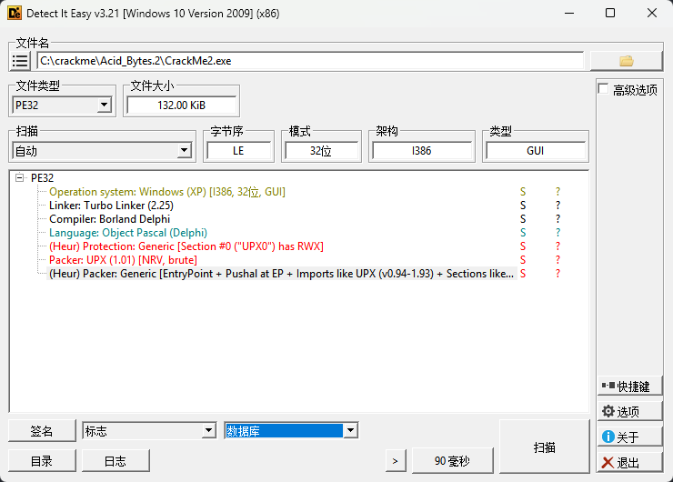

DIE 将文件识别为 32 位 Windows 图形界面程序，并给出 Delphi 和 UPX 1.01 特征。UPX（Ultimate Packer for eXecutables）是一种可执行文件压缩器；它通常把原程序压缩后保存到文件中，再加入一段运行时恢复代码。

单个工具也可能误判，因此继续检查文件本身。在 010 Editor 中按 <kbd>Ctrl</kbd> + <kbd>F</kbd>，按文本搜索 `UPX 1.01`，可以找到两条 UPX 标记字符串：

```text
$Info: This file is packed with the UPX executable packer http://upx.tsx.org $
$Id: UPX 1.01 Copyright (C) 1996-2000 the UPX Team. All Rights Reserved. $
```

DIE 识别结果和文件内字符串相互吻合，现在可以把“样本使用 UPX 1.01”作为高可信度判断。检测器和标记字符串仍可能被伪造，后面还要用入口指令和运行时内存变化验证它是否真的具有 UPX 解压行为。

### 用 010 Editor 检查三个节

用 010 Editor 打开样本并运行 PE 模板，再展开 `NtHeader -> SectionHeaders[3]`。模板把 `VirtualSize` 放在 `Misc` 联合体中，读取某个节时还要继续展开该节下面的 `Misc`。

| 节名    | VirtualAddress | VirtualSize | SizeOfRawData |
| ------- | -------------- | ----------- | ------------- |
| `UPX0`  | `0x1000`       | `0x35000`   | `0`           |
| `UPX1`  | `0x36000`      | `0x20000`   | `0x1FA00`     |
| `.rsrc` | `0x56000`      | `0x2000`    | `0x1200`      |

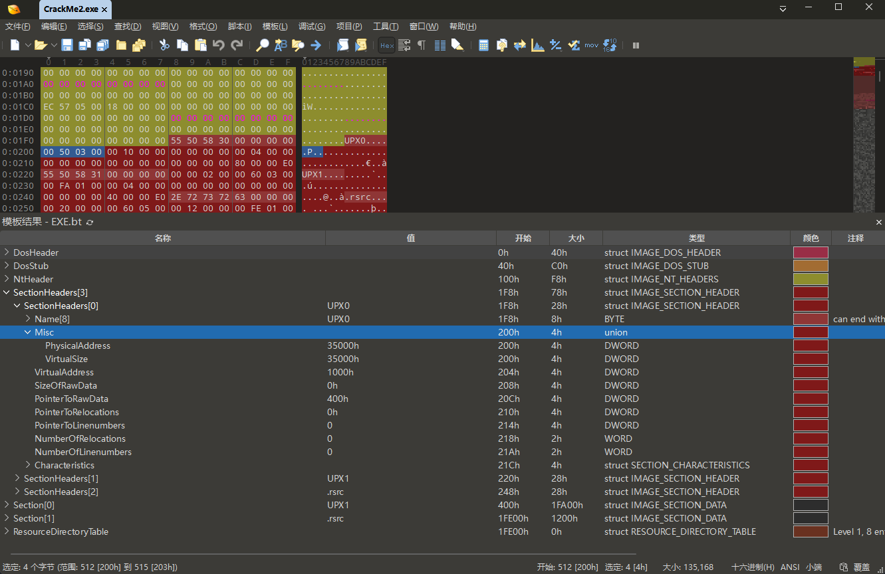

`UPX0` 的 `SizeOfRawData = 0`，表示磁盘文件没有为它保存节数据；但 `VirtualSize = 0x35000`，表示 Windows 仍会在内存映像中映射出一大片零初始化区域。结合 `UPX0` 节名，可以先提出一个待验证的推测：壳可能会在运行时向这里写入恢复结果。该区域运行时是否真的可写，稍后再用 x32dbg 的 Memory Map 验证。

再展开 `NtHeader -> OptionalHeader`，读取 `AddressOfEntryPoint` 和 `ImageBase`：

```text
AddressOfEntryPoint = RVA 0x55690
ImageBase           = 0x400000
```

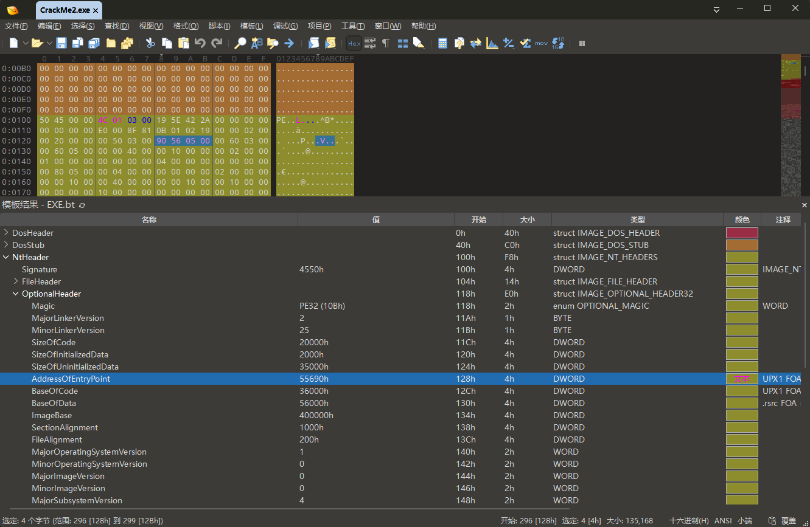

把入口 RVA 加到 PE 文件请求的首选基址上，可以得到首选入口 VA：

```text
首选入口 VA = 0x400000 + 0x55690
              = 0x455690
```

这是根据文件字段得到的静态地址，不代表程序运行时一定装载到 `0x400000`。实际模块基址留到 x32dbg 阶段确认。

`UPX1.VirtualAddress = 0x36000` 表示该节装入内存后从 RVA `0x36000` 开始，`VirtualSize = 0x20000` 表示它在内存中占用 `0x20000` 字节。

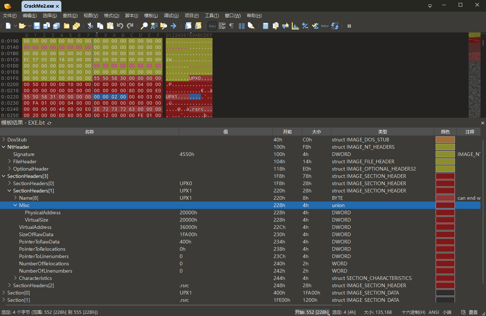

先计算该节结束后的第一个地址：

```text
0x36000 + 0x20000 = 0x56000
```

因此 `UPX1` 实际包含的 RVA 是 `0x36000～0x55FFF`，`0x56000` 已经属于下一个节。入口 RVA `0x55690` 满足下面的范围关系：

```text
0x36000 <= 0x55690 < 0x56000
```

所以入口位于 `UPX1`，而且接近节尾。现在只得到一个静态结论：PE 入口位于带有 UPX 名称、包含磁盘数据且可执行的节中。它究竟做什么，还要查看入口指令。

010 Editor 已经回答“入口位于哪个节”，但还没有解释入口代码具体做什么。接下来转到 IDA 查看入口指令的数据流。

## 在 IDA 中观察壳入口

IDA 加载样本时可能显示 IAT 位于输入文件内存范围之外的警告。它只表示 IDA 无法按普通未加壳文件的方式解释当前 IAT，不影响查看入口指令，点击 **OK** 继续即可。不同 IDA 版本可能只能恢复出部分导入，甚至无法列出 Imports；在程序尚未运行时，不应把这个窗口当成原程序完整的导入列表。

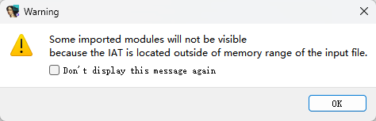

自动分析结束后，先看反汇编窗口当前地址。本例通常已经停在 `UPX1:00455690 start`，不需要再次跳转；如果当前地址不同，按 <kbd>G</kbd> 打开 **Jump to address**，输入 `0x455690`。

入口处的前几条指令是：

```asm
0x455690  pusha
0x455691  mov esi, 0x436000
0x455696  lea edi, [esi-35000]
```

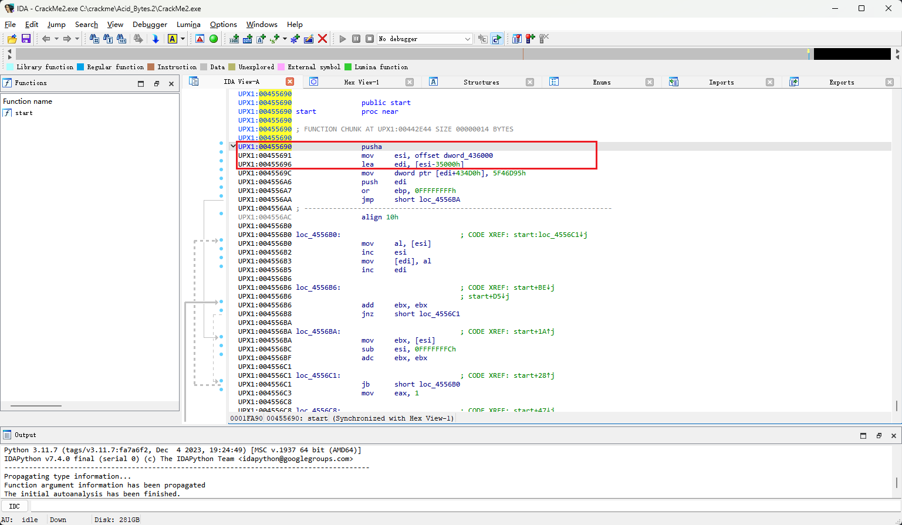

IDA 在 32 位模式下显示 `pusha`，x32dbg 通常显示 `pushad`。两者在这里是同一条指令，都会保存 8 个 32 位通用寄存器；后面的动态调试部分统一沿用 x32dbg 的 `pushad` 写法。

先逐条翻译后两条指令。

```asm
mov esi, 0x436000
```

`mov` 把右边的数值复制到左边，因此这条指令执行后，`ESI = 0x436000`。IDA 也可能把右边显示成 `offset dword_436000`；其中 `offset` 表示取地址，最终放进 `ESI` 的仍是 `0x436000`。

```asm
lea edi, [esi-35000]
```

`lea` 只计算方括号中的地址表达式，不读取该地址中的内存。把上一条得到的 `ESI = 0x436000` 代入：

```text
EDI = 0x436000 - 0x35000
    = 0x401000
```

执行完这两条指令后，可以确定 `ESI = 0x436000`、`EDI = 0x401000`。先把它们与前面读到的节表对照：

```text
UPX1 首选起始 VA = ImageBase + UPX1.VirtualAddress
                   = 0x400000 + 0x36000
                   = 0x436000

UPX0 首选起始 VA = ImageBase + UPX0.VirtualAddress
                   = 0x400000 + 0x1000
                   = 0x401000
```

因此，`ESI` 将被设置为 `UPX1` 的起点，`EDI` 将被设置为 `UPX0` 的起点。下面继续按执行顺序查看入口到第一条跳转之间的指令。

### 先读入口到第一次跳转

`pusha`、`mov esi` 和 `lea edi` 已经解释完，接下来是三条准备指令：

```asm
0x45569C  mov [edi+434D0], 0x5F46D95
0x4556A6  push edi
0x4556A7  or ebp, 0xFFFFFFFF
```

第一条以当前的 `EDI = 0x401000` 为起点，计算实际写入地址：

```text
0x401000 + 0x434D0 = 0x4444D0
```

因此，它会向 `0x4444D0` 写入固定的 4 字节数值 `0x05F46D95`。这个地址位于 `UPX1`。该指令没有读取 `[ESI]`，也没有移动 `ESI` 或 `EDI`，所以它不是后面要寻找的连续数据复制操作。

第二条 `push edi` 把当前 `EDI` 的值 `0x401000` 保存到栈中。解压代码结束后，`0x45576A` 的 `pop esi` 会把这个值取回，因此这里是在保留 `UPX0` 的起始地址。

第三条 `or ebp, 0xFFFFFFFF` 会把 `EBP` 的每一位都设为 1，结果是 `EBP = 0xFFFFFFFF`。后面的 `lea edx, [edi+ebp]` 会使用 `EBP` 参与地址计算，因此这里是在初始化后续复制操作需要的偏移状态。

三条准备指令执行完后，来到第一条跳转：

```asm
0x4556AA  jmp 0x4556BA
```

这是无条件跳转，所以下一条执行位置一定是 `0x4556BA`。IDA 中的 `loc_4556BA` 是这个地址的自动名称，双击名称即可查看跳转目标。中间显示的 `align 10h` 是对齐填充，已经被 `jmp` 跳过，不会执行。

把入口到第一次跳转之间的指令汇总如下：

| 地址       | 指令                         | 执行结果                                 |
| ---------- | ---------------------------- | ---------------------------------------- |
| `0x455690` | `pusha`                      | 保存进入壳时的 8 个通用寄存器            |
| `0x455691` | `mov esi, 0x436000`          | `ESI` 被设置为 `UPX1` 起点               |
| `0x455696` | `lea edi, [esi-35000]`       | `EDI` 被设置为 `UPX0` 起点 `0x401000`    |
| `0x45569C` | `mov [edi+434D0], 0x5F46D95` | 向地址 `0x4444D0` 写入固定的 4 字节数值  |
| `0x4556A6` | `push edi`                   | 把 `UPX0` 起始地址 `0x401000` 保存到栈中 |
| `0x4556A7` | `or ebp, 0xFFFFFFFF`         | 将 `EBP` 设置为 `0xFFFFFFFF`             |
| `0x4556AA` | `jmp 0x4556BA`               | 下一条执行位置变为 `0x4556BA`            |

分析到这里，已经得到四条线索：

1. `ESI` 从 `UPX1` 起点开始取值，`EDI` 从 `UPX0` 起点开始取值。
2. 代码会先修改 `UPX1` 中的一个固定位置，再保存 `UPX0` 起始地址并初始化 `EBP`。
3. 这些准备指令还没有展示连续的数据复制，因此暂时不能只凭它们确认解压过程。
4. 无条件跳转已经明确给出下一处要读的代码：`0x4556BA`。

### 跟随 jmp 查看 0x4556BA

`0x4556BA` 从下面四条指令开始：

```asm
0x4556BA  mov ebx, [esi]
0x4556BC  sub esi, 0xFFFFFFFC
0x4556BF  adc ebx, ebx
0x4556C1  jb 0x4556B0
```

第一条 `mov ebx, [esi]` 从 `ESI` 指向的内存读取 4 字节。下一条中的 `0xFFFFFFFC` 是 `-4` 的 32 位表示，因此 `sub esi, 0xFFFFFFFC` 实际让 `ESI` 增加 4，指向后面的数据。

`adc` 和 `jb` 使用刚才读入的内容决定下一步走哪条路径。完整解释这两条指令怎样逐位解析数据，会进入 UPX 压缩算法内部；本章当前只需要知道，`jb` 条件成立时会跳到 `0x4556B0`，条件不成立时会继续执行 `0x4556C3`。

静态分析时两个方向都可能执行。本章先查看 `jb` 明确给出的目标 `0x4556B0`，但不把它当成程序第一次运行时必然选择的方向。

来到 `0x4556B0` 后，可以看到：

```asm
0x4556B0  mov al, [esi]
0x4556B2  inc esi
0x4556B3  mov [edi], al
0x4556B5  inc edi
```

| 指令            | 直接效果                              |
| --------------- | ------------------------------------- |
| `mov al, [esi]` | 从 `ESI` 指向的内存读取 1 字节到 `AL` |
| `inc esi`       | `ESI` 前进 1 字节                     |
| `mov [edi], al` | 把 `AL` 中的字节写到 `EDI` 指向的内存 |
| `inc edi`       | `EDI` 前进 1 字节                     |

现在找到了一条完整的数据传递路径：当程序进入 `0x4556B0` 时，会把当前 `[ESI]` 中的字节复制到当前 `[EDI]`。前面已经知道这两个寄存器分别从 `UPX1` 起点和 `UPX0` 起点开始取值，随后又会不断递增，因此这组指令支持“`ESI` 是输入指针、`EDI` 是输出指针”的静态判断。确切的首次分支方向和实际写入范围仍要在动态调试中确认。

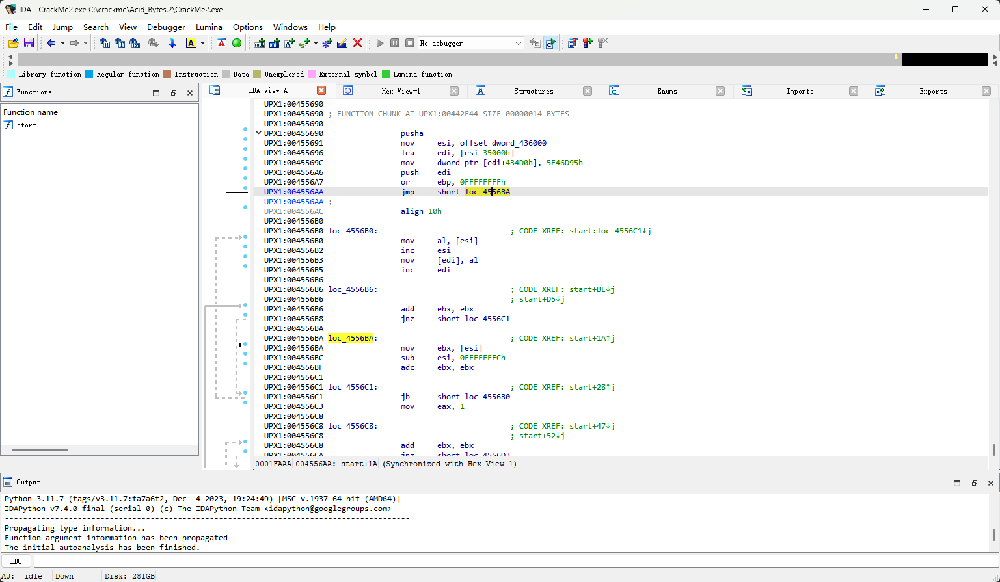

### 把方法带到其他样本

以后分析类似入口时，可以重复下面的步骤；寄存器不一定仍是 `ESI` 和 `EDI`，要根据当前样本重新确定：

1. 记录入口把哪些地址放进了哪些寄存器。
2. 将地址与节表对照，确认它们落在哪些区域，但暂时不猜用途。
3. 优先检查修改候选寄存器、通过候选寄存器访问内存，以及改变控制流的指令。
4. 遇到无条件 `jmp` 时直接跟随目标；遇到条件跳转时分别检查跳转目标和顺序执行位置，不能静态假定某一边必然执行。
5. 如果某个方向出现“从候选地址读取、向另一个候选地址写入”，记录这条数据路径；若要还原完整算法，再继续检查其他方向以及它们重新汇合的位置。
6. 对暂时无关的栈操作和状态初始化，只记录直接效果；当后续指令再次使用这些值时再连接前后关系。
7. 静态分析得到候选数据路径后，用调试器比较运行前后的内存，确认该路径在运行时确实产生了预期变化。

按照这套方法，本例可以形成一个有指令依据的静态判断：入口处很可能是 UPX 加入的**解压存根**（decompression stub）。代码将输入指针初始化到 `UPX1` 起点，将输出指针初始化到 `UPX0` 起点，并存在从当前输入地址读取、向当前输出地址写入的数据路径。这里的 `UPX0` 只是输出起点，不表示恢复结果只能写在 `UPX0` 内。

还要区分节大小和压缩数据大小。`UPX1.VirtualSize = 0x20000` 表示整个 `UPX1` 节映射到内存后的大小；`SizeOfRawData = 0x1FA00` 表示该节在文件中占用的原始数据大小。这里面同时包含压缩内容、解压代码和恢复信息，因此不能把 `0x20000` 直接理解成纯压缩数据的大小。解压结果从 `UPX0` 起点开始写，最终写到哪里则要通过运行时内存变化确认。

现在可以把静态证据放回开头的壳模型中：入口的 `pusha` 和地址初始化符合壳头的准备工作，后面的读写路径符合壳身恢复数据的行为。此时还没有找到负责恢复寄存器并离开壳代码的位置，也不知道壳会把控制权交给哪里；这正是 x32dbg 阶段要继续解决的问题。

## 在 x32dbg 中记录解压前状态

IDA 中的 `0x455690` 使用 PE 文件请求的首选基址。进入动态调试后，应该先确认本次运行的实际模块基址，再决定断点地址。

1. 用 x32dbg 打开 `CrackMe2.exe`。
2. 在第一次暂停时打开 **Memory Map**，找到属于 `CrackMe2.exe` 的映射区域。
3. 确认本次运行的模块基址为 `0x400000`。
4. 用实际基址加入口 RVA：`0x400000 + 0x55690 = 0x455690`。
5. 如果 EIP 已经位于 `0x455690`，直接继续；如果尚未到达，就在 CPU 窗口按 <kbd>Ctrl</kbd> + <kbd>G</kbd> 跳到该地址，按 <kbd>F2</kbd> 设置临时软件执行断点，再按 <kbd>F9</kbd> 运行到断点。
6. 只有手动设置过这个临时断点时，才在命中后将其删除。

确认当前 EIP 为：

```text
EIP = 0x455690
```

x32dbg 可以配置为加载程序后自动运行到主模块入口并暂停。此时即使 `0x455690` 没有红色断点标记，断点列表里也没有对应项目，EIP 仍会停在这里；这是调试器产生的模块入口暂停事件，不是按 <kbd>F2</kbd> 创建的软件断点，不需要删除。

Memory Map 右侧有“页面保护”和“初始保护”两列。本章读取左侧的“页面保护”，因为它表示当前实际生效的权限；截图中右侧重复显示的 `ERWC-` 是初始保护，不用它判断各节当前的访问权限。

三个节当前的地址和页面保护如下：

```text
0x401000～0x435FFF  UPX0   ERW--
0x436000～0x455FFF  UPX1   ERWC-
0x456000～0x457FFF  .rsrc  -RW--
```

x32dbg 依次用 `E`、`R`、`W`、`C`、`G` 表示可执行、可读、可写、写时复制和保护页。因此 `UPX0` 当前可执行、可读、可写；`UPX1` 当前可执行、可读、可写，并采用 **Copy-on-write（写时复制）**；`.rsrc` 当前可读、可写。`W` 已经说明解压代码能够修改 `UPX1`。额外的 `C` 说明第一次写入时，Windows 会为当前进程建立该页面的私有副本，修改不会直接写回磁盘上的 `CrackMe2.exe`。

上面的范围包含每个节的最后一个字节，因此末地址按下面的公式计算：

```text
末地址 = 起始地址 + 大小 - 1
```

以 `UPX0` 为例：

```text
0x401000 + 0x35000 - 1 = 0x435FFF
```

这些节按 `0x1000` 字节对齐，下一个区域从以 `000` 结尾的地址开始，所以前一个区域的最后一个地址通常以 `FFF` 结尾。

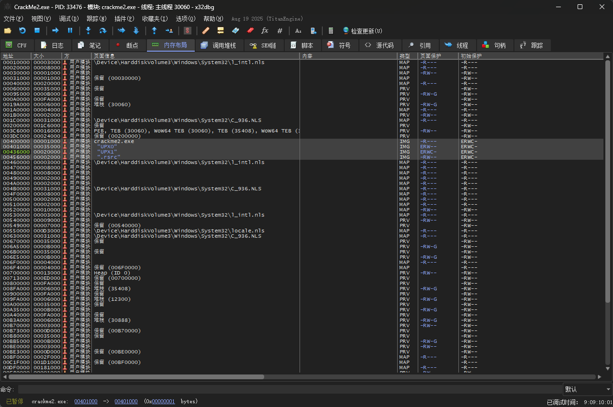

在 CPU 窗口下方的 Dump 区域按 <kbd>Ctrl</kbd> + <kbd>G</kbd> 跳到 `0x401000`。入口指令尚未执行时，这里的开头是全零：

```text
00401000  00 00 00 00 00 00 00 00
00401008  00 00 00 00 00 00 00 00
```

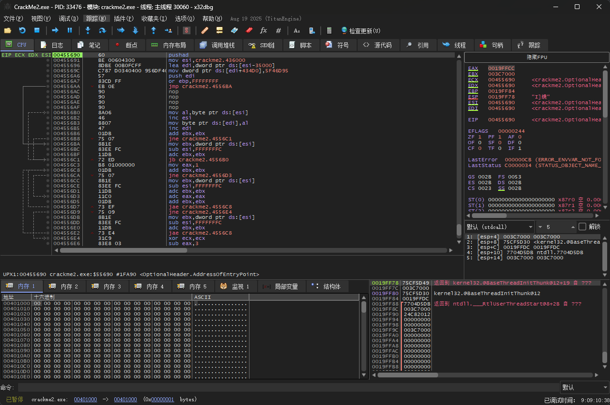

这与 `UPX0.SizeOfRawData = 0` 对应：磁盘没有原始数据，Windows 映射该节时先得到补零内存。

现在还不知道壳尾会跳到哪个地址，因此不要提前寻找 OEP。这里只记录已经由节表推导出的 `UPX0` 起点；跳转目标要由后面的断点实验发现。

## 监视栈保存区，寻找恢复现场的位置

入口的第一条指令 `pushad` 会把 8 个通用寄存器保存到栈中，总共写入 `0x20` 字节。壳保存这些值，通常是为了在完成自己的工作后恢复进入壳之前的寄存器状态。现在还不知道恢复发生在哪里，可以监视这片保存区何时再次被访问。

这提供了一个不必预先知道壳尾地址的实验方法：

```text
入口执行 pushad
→ 记录新的 ESP
→ 监视 [ESP] 何时再次被访问
→ 断点触发后检查是哪条指令访问了保存区
→ 再观察后续控制流
```

### 执行 pushad 并记录 ESP

确认 EIP 位于 `0x455690` 后，按一次 <kbd>F7</kbd> 执行 `pushad`。EIP 到达 `0x455691`，ESP 比执行前减少 `0x20`。

本次调试中：

```text
执行前 ESP = 0x19FF78
执行后 ESP = 0x19FF58
```

`pushad` 固定压入 8 个 DWORD，共 `8 × 4 = 0x20` 字节，因此执行后的 ESP 一定等于执行前 ESP 减 `0x20`。本次执行前 `ESP = 0x19FF78`，所以执行后为 `0x19FF58`。不同运行环境中的初始 ESP 可能不同，不要直接照抄 `0x19FF58`；应根据自己调试器里的执行前 ESP 计算，或在执行 `pushad` 后直接读取当前 ESP。

`pushad` 执行后的保存区布局如下。地址从新 ESP 向上增长，最下面的 DWORD 保存 `EDI`：

```text
[ESP+00]  保存的 EDI  ← 新 ESP 指向这里
[ESP+04]  保存的 ESI
[ESP+08]  保存的 EBP
[ESP+0C]  执行 pushad 前的 ESP
[ESP+10]  保存的 EBX
[ESP+14]  保存的 EDX
[ESP+18]  保存的 ECX
[ESP+1C]  保存的 EAX
```

如果后面使用 `popad` 恢复现场，它首先读取的就是新 `[ESP]` 中保存的 `EDI`，随后按相反顺序恢复其余寄存器，并跳过保存旧 ESP 的槽位。因此这里只需要监视保存区起始处的一个 DWORD；其中保存的具体数值并不重要。

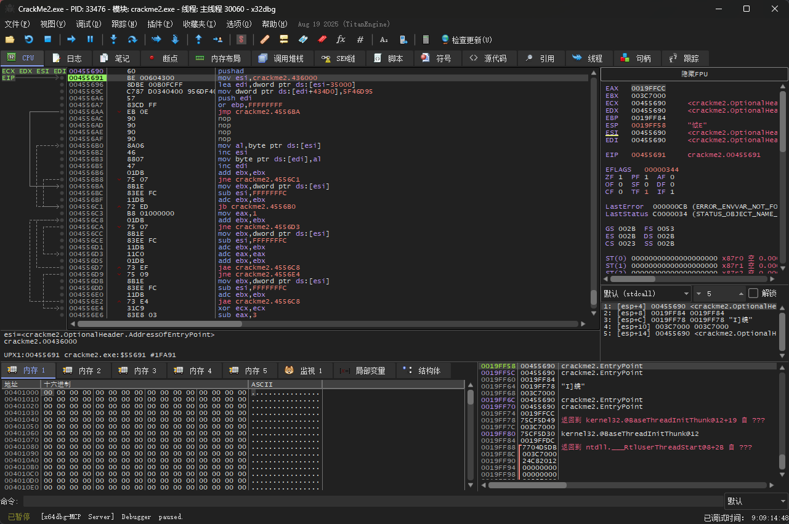

### 对当前 [ESP] 指向的内存设置断点

设置新断点前，先打开上方的 **Breakpoints** 页面。x32dbg 会把以前设置的断点保存在当前程序的数据库中，重新打开样本时可能自动恢复。如果列表里存在地址 `0x401000` 的硬件写入断点，应先删除或禁用它：`0x401000` 是 `UPX0` 起点，不是程序入口；保留这个断点会让程序在解压循环第一次写入 `UPX0` 时提前暂停。

清理遗留断点后，再设置栈保存区断点：

1. 在寄存器窗口右击 ESP 的当前值，选择 **Follow in Dump**，让 Dump 跳到当前 ESP。不要选择继续解引用 DWORD 的项目，后者会把 `[ESP]` 中的值当作另一个地址继续跟随。
2. 确认 Dump 左侧第一行是本次运行的当前 ESP，例如 `0x19FF58`，再右击该行的 DWORD。
3. 选择 **Breakpoint -> Hardware -> Access -> DWORD**。

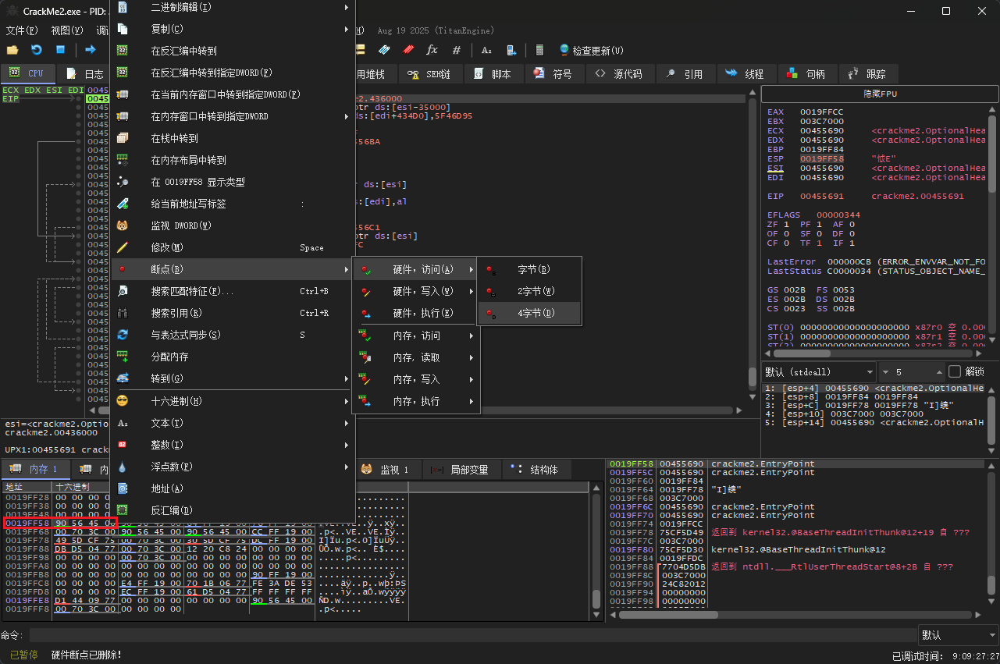

这个断点监视的是 ESP 当前指向的 **4 字节内存**，不是 ESP 寄存器本身，也不是按 <kbd>F2</kbd> 设置的代码执行断点。

必须先执行 `pushad`，再读取新的 ESP 并设置断点。执行前的旧 ESP 不在 `pushad` 保存区内；如果提前监视旧地址，通常会错过 `popad` 对保存区的读取。

设置后回到 **Breakpoints** 页面核对：地址应是本次运行的新 ESP，类型为硬件断点，状态为已启用，监视类型为 Access/DWORD。如果右键菜单已经显示 **Remove Hardware Breakpoint**，也说明当前位置的硬件断点已经存在。按 <kbd>F9</kbd> 前只保留这个栈地址的访问断点，不保留 `0x401000` 的写入断点。

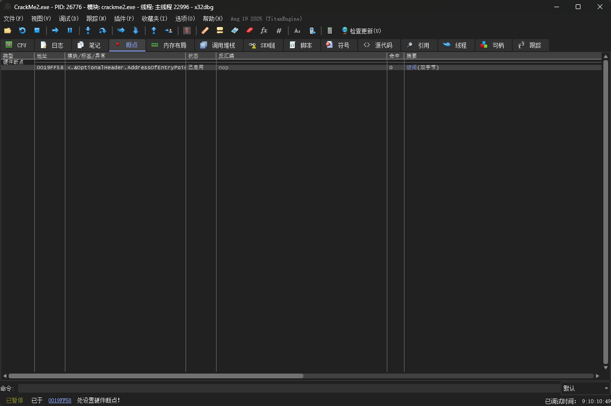

按 <kbd>F9</kbd> 运行。这个断点不监视输出区域，所以存根向 `UPX0` 写数据时不会因此反复暂停。

断点触发后，当前 `EIP = 0x4557E7`，尚未执行的指令是 `jmp 0x442E44`。向上查看一条，可以看到刚刚执行完的 `0x4557E6 popad`：

```asm
0x4557E6  popad           ; 已经执行完
0x4557E7  jmp 0x442E44   ; EIP 当前停在这里，尚未执行
```

为什么监视 `0x19FF58`，调试器却停在代码地址 `0x4557E7`？执行 `pushad` 后，`0x19FF58` 是新 ESP 指向的栈地址，其中保存的是原来的 `EDI`，不是 `EIP`。壳尾执行 `popad` 时，首先读取 `[ESP]`，刚好访问了被硬件断点监视的 `0x19FF58`，于是触发断点。

硬件数据断点在引发访问的指令执行完成后报告。因此 x32dbg 暂停时，`0x4557E6 popad` 已经执行完，EIP 自然指向下一条尚未执行的 `0x4557E7 jmp 0x442E44`。程序不是从 `0x19FF58` 跳到了 `0x4557E7`：前者是被监视的数据地址，后者是访问完成后的代码执行位置。

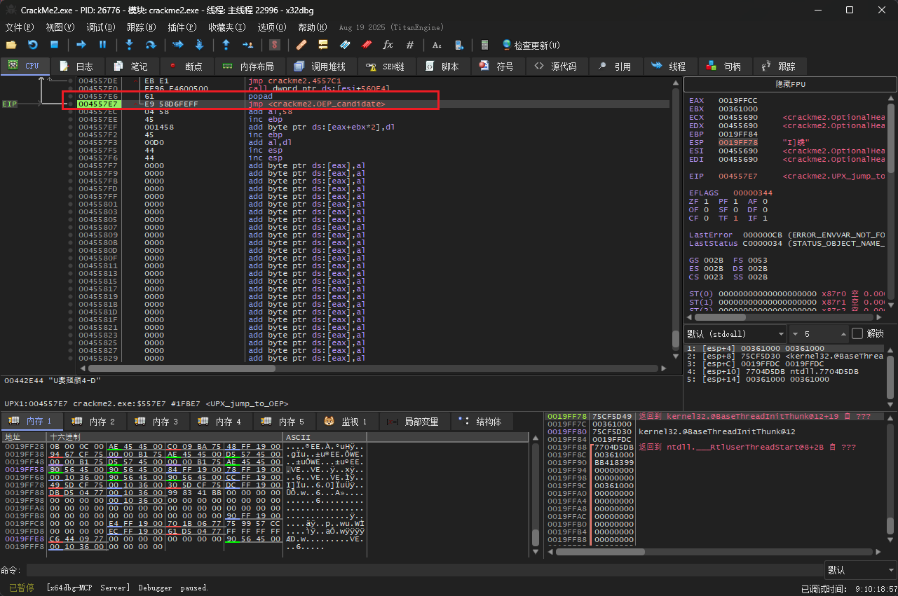

现在可以把当前结果与开头的壳模型对应起来：

```text
入口 pusha          保存寄存器
中间读写代码        执行疑似恢复数据的读写操作
壳尾 popad          恢复入口处保存的寄存器
紧随其后的 jmp     把控制权交给另一个地址
```

这里的“壳尾”指壳完成主要工作后，恢复现场并准备离开壳代码的最后阶段，不是 PE 文件中的字段。单独看到 `popad` 或 `jmp` 都不足以判断壳尾；本例之所以把这里视为壳尾候选，是因为入口先用 `pusha` 保存现场，中间出现疑似恢复数据的读写代码，最后又用配对的 `popad` 恢复现场，并立即执行跳转。下一节还要通过内存变化验证中间代码确实产生了恢复结果。

OEP 是壳结束后原程序开始执行的位置。当前 `jmp` 正好位于恢复现场之后，所以它的目标 `0x442E44` 有可能就是 OEP。但它也可能只是另一层壳、后续修复代码或中间跳板，因此现在只能称为 **OEP 候选**，还要继续检查目标地址在解压前后的内容和实际执行结果。

## 验证 0x442E44 是 OEP

`popad` 后面的跳转给出了候选地址，但还不能只凭一个 `jmp` 就宣布找到 OEP。接下来要确认目标地址从壳入口 `0x455690` 运行到壳尾 `0x4557E7` 的过程中发生了变化，并且变化后能够解释成连贯代码。

### 对比运行前后的两个地址

解压前，`UPX0` 起点 `0x401000` 全零。停在 `0x4557E7` 后再次查看同一位置，可以看到：

```text
00401000  04 10 40 00 03 07 42 6F 6F 6C 65 61 6E 01 00 00
00401010  00 00 01 00 00 00 00 10 40 00 05 46 61 6C 73 65
00401020  04 54 72 75 65 8D 40 00 2C 10 40 00 02 04 43 68
```

先同时看 Dump 左侧的十六进制字节和右侧的 ASCII。三个单词前面分别有一个长度字节：

```text
07 42 6F 6F 6C 65 61 6E  → 长度 7，后面是 Boolean
05 46 61 6C 73 65        → 长度 5，后面是 False
04 54 72 75 65           → 长度 4，后面是 True
```

这就是 Pascal `ShortString` 常见的存储方式：先用 1 字节记录长度，再保存对应数量的字符。结合 DIE 先前给出的 Borland Delphi 识别结果，可以把这些内容视为恢复出的 Delphi 数据。`False` 和 `True` 两个单词本身不能单独证明编译器类型，这里的判断来自工具识别和字节排列相互印证。

> [!NOTE]- 为什么 Boolean、False、True 会连续出现
> 可以把 RTTI（Run-Time Type Information，运行时类型信息）简单理解成编译器放进程序里的“类型说明书”。程序运行时可能需要知道一个类型叫什么、有哪些取值，因此 Delphi 会保存类似下面的信息：
>
> ```text
> 类型名称：Boolean
> 可选值 0：False
> 可选值 1：True
> ```
>
> 这些名称再按 Pascal 长度前缀字符串保存，就会形成 `07 Boolean`、`05 False`、`04 True`。想继续核对完整结构，可以查阅 Delphi `System.TypInfo` 单元中的枚举 RTTI 布局；本章不需要进一步解析这些字段。

对当前实验最重要的直接证据是：`0x401000` 从全零变成了有规律的非零数据。这证明入口处的循环确实向原来的空白区域写入了恢复结果，前面的解压存根判断至此得到动态验证。

解压前

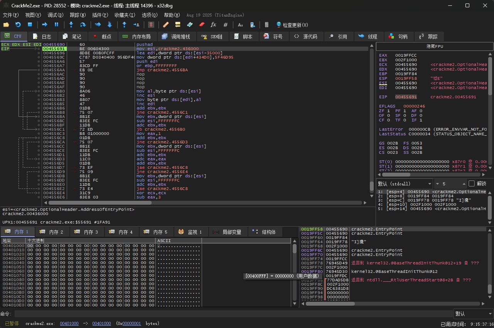

解压后

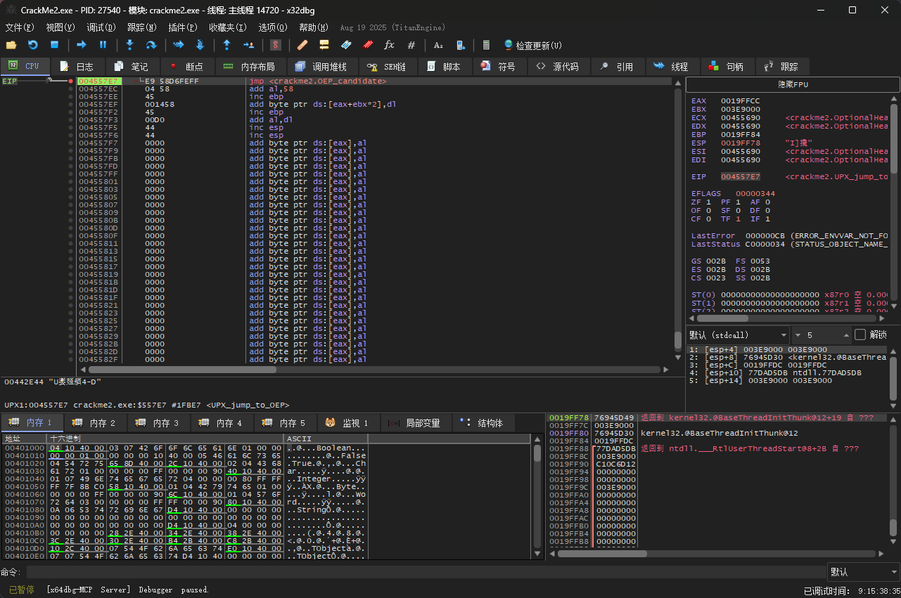

### 重启程序，对比候选地址

`0x442E44` 是刚才运行到壳尾后才发现的地址。为了避免预先使用答案，现在重启程序，专门为这个候选地址补做一次运行前后对比：

第一次运行已经通过 ESP 硬件访问断点找到壳尾 `0x4557E7`。这次直接在该地址按 <kbd>F2</kbd> 设置软件断点，不需要重新执行 `pushad`、计算新 ESP 和设置栈硬件断点：

1. 重启 `CrackMe2.exe`，停在壳入口 `0x455690`，并清空 **Breakpoints**。
2. 在 Dump 中查看 `0x442E44`，记录壳运行前的字节。
3. 在 `0x4557E7` 按 <kbd>F2</kbd> 设置软件断点，在 **Breakpoints** 中确认已启用，再返回当前 EIP `0x455690`。
4. 按 <kbd>F9</kbd> 运行到 `0x4557E7`。此时 `popad` 已执行，`jmp 0x442E44` 尚未执行。
5. 删除临时断点，再次查看 `0x442E44`。

同一地址的前后 16 个字节如下：

```text
壳运行前：BD B1 38 55 83 14 59 CC 64 EC 61 B0 8C 85 3F 8B
壳运行后：55 8B EC 83 C4 F4 B8 34 2D 44 00 E8 50 2D FC FF
```

比较发生在同一个地址，因此可以确认：程序从壳入口 `0x455690` 运行到壳尾 `0x4557E7` 的过程中改写了 `0x442E44`。计算该地址距离输出起点有多远：

```text
0x442E44 - 0x401000 = 0x41E44
```

`UPX0` 的 `VirtualSize` 只有 `0x35000`，而 `0x41E44 > 0x35000`，所以恢复结果已经越过 `UPX0` 的末尾。`0x442E44` 位于 `UPX1` 起点之后：

```text
0x442E44 - 0x436000 = 0xCE44
```

这说明解压代码虽然从 `UPX0` 起点开始写入，但输出范围最终延伸到了加壳文件的 `UPX1` 地址范围。`UPX1` 当前具有 `W` 权限，所以解压代码可以修改它；额外的 `C` 表示修改发生在当前进程的私有页面中，不会直接改变磁盘文件。UPX 会安排输入布局和读取顺序，避免在使用压缩数据之前覆盖仍需读取的内容，本章不继续还原这部分算法。

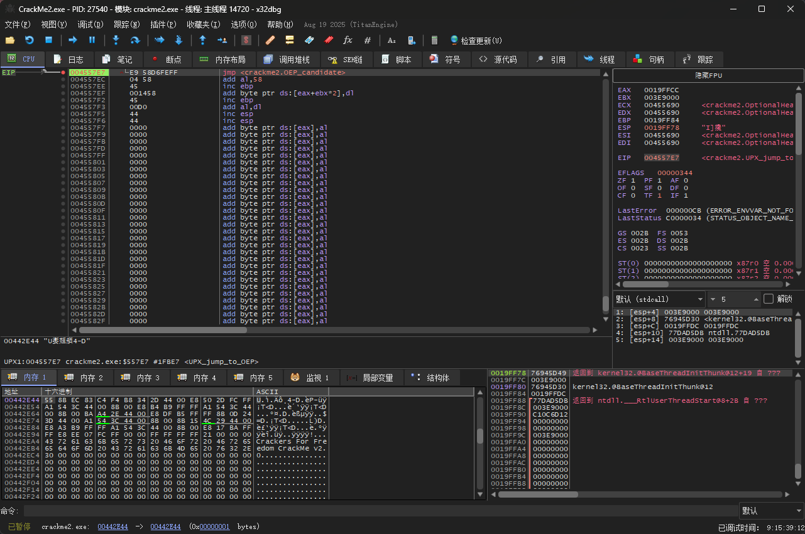

把变化后的字节按指令解释，可以得到连续代码：

在 CPU 反汇编区域按 <kbd>Ctrl</kbd> + <kbd>G</kbd> 浏览 `0x442E44`。这个操作只改变反汇编窗口的显示位置，不会修改 EIP，也不会执行跳转。

> [!WARNING] 向上滚动 CPU 窗口，`0x442E44` 不见了？
> 如果你在 CPU 窗口向上滚动，可能会突然发现原来的 `0x442E44  push ebp` 不再显示。这不是地址或内存内容消失了，而是因为 x86 指令长度不固定：x32dbg 从更早的字节重新反汇编时，可能把 `0x442E44` 开头的 `55 8B` 合并进上一条错误指令。
>
> 重新按 <kbd>Ctrl</kbd> + <kbd>G</kbd>，精确跳到 `0x442E44`，就能恢复正确的指令边界。如果 Dump 中该地址仍以 `55 8B EC 83 C4 F4` 开头，也能确认内存没有变化，只是 CPU 窗口的反汇编方式发生了错位。

```asm
0x442E44  push ebp
0x442E45  mov ebp, esp
0x442E47  add esp, -0x0C
0x442E4A  mov eax, 0x442D34
0x442E4F  call 0x405BA4
```

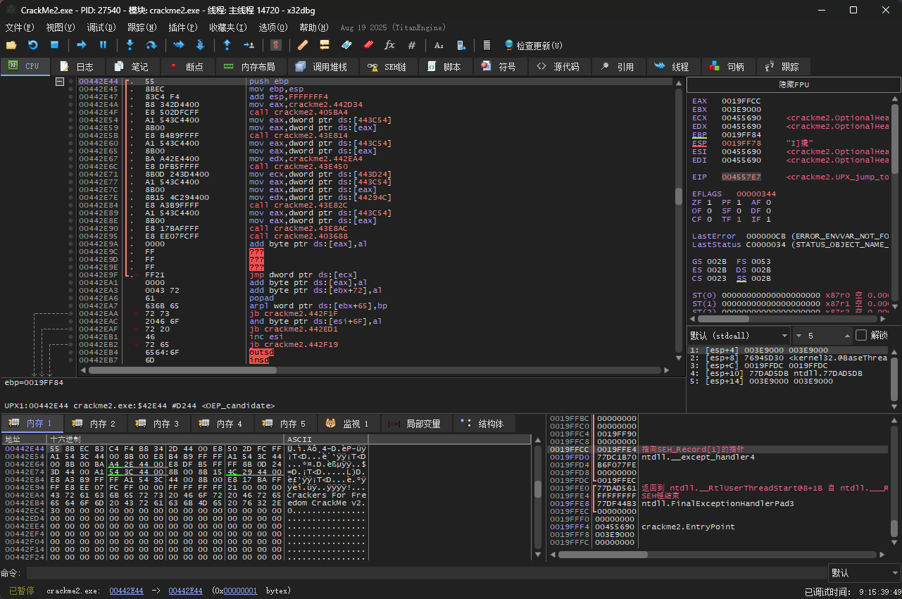

`push ebp`、`mov ebp, esp` 建立栈帧，随后调用当前模块内已经恢复的函数。结合前后的同址字节变化，可以确认这里不是原先保存在 `UPX1` 中的数据，也不是刚才观察的解压循环，而是运行时恢复出的入口代码。

### 单步进入 OEP

1. 确认前面设置的 `0x4557E7` 临时软件断点已经删除，当前 EIP 仍停在 `0x4557E7`。
2. 在寄存器窗口右击 EIP，选择 **Follow in Disassembler**，确认当前指令是 `0x4557E7  jmp 0x442E44`。
3. 按一次 <kbd>F7</kbd> 执行这条跳转，确认 EIP 到达 `0x442E44`，当前尚未执行的指令为 `push ebp`。

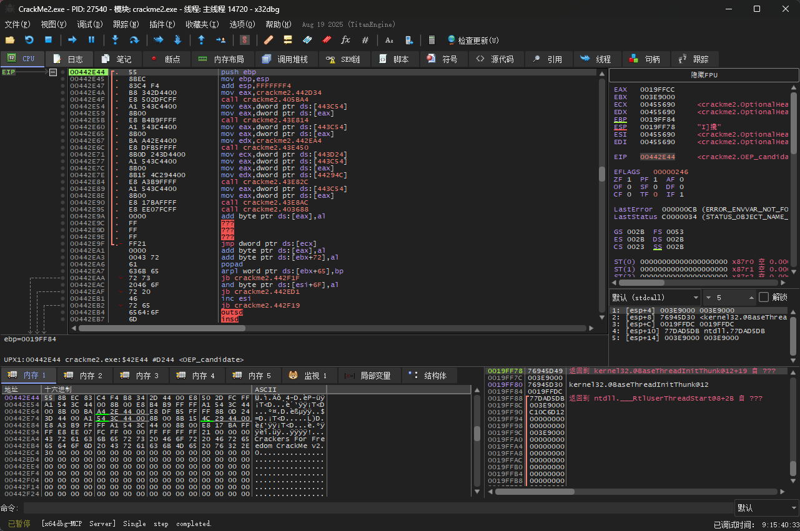

OEP 的 RVA 为：

```text
OEP RVA = 0x442E44 - 0x400000
        = 0x42E44
```

现在可以把 OEP 的证据链收拢起来：

```text
壳入口位于 UPX1
→ pushad 保存现场
→ 解压存根从 UPX1 读取并从 UPX0 起点开始写入
→ 0x401000 和 0x442E44 的内容均发生变化
→ popad 恢复现场
→ jmp 离开解压存根
→ 跳转目标已经变成连贯的入口代码
→ EIP 到达 0x442E44，当前指令尚未执行
```

因此，本例的 OEP 是 VA `0x442E44`，对应 RVA `0x42E44`。

> [!IMPORTANT]
> OEP 不一定位于名为 `UPX0` 的节中。本例的 `EDI` 从 `UPX0` 起点开始写入，但随着指针不断递增，写入范围并不受 `UPX0` 节边界限制；`0x442E44` 的同址对比证明恢复过程最终覆盖到了 `UPX1` 的虚拟范围。判断依据应是运行前后的字节变化、壳尾控制流和目标代码，而不是节名。

## 其他寻找 OEP 的方法

栈保存区硬件断点法适合本例，因为 UPX 1.01 使用明显的 `pushad`/`popad` 保存和恢复现场。它演示的是：在尚不知道壳尾地址时，怎样通过运行时访问发现恢复现场的位置。

本例其实还有一条更短的静态路线。IDA 已经把 `0x4557E7` 识别为解压存根末尾的无条件跳转，下一地址 `0x4557EC` 则被识别为 TLS 目录数据。因此可以直接把跳转目标 `0x442E44` 列为 OEP 候选，在 `0x4557E7` 设置断点后，再通过目标地址的字节变化和单步跳转完成验证。

不过，`popad` 并不是所有 32 位壳都会使用的指令。其他壳可能逐个恢复寄存器、只恢复部分寄存器，或者通过 `ret`、间接跳转等方式离开；64 位模式也不支持 `pushad`/`popad`。程序只需要在交出控制权前建立后续代码所需的运行状态，不一定恢复入口处的全部寄存器。因此，“寻找最后一个 `popad` 或 `jmp`”只能作为当前壳特征提供的捷径，不能当成通用 OEP 定位规则。

> [!NOTE]- 其他常见方法
>
> - **监视解压目标**：对可写可执行区域设置写入或执行断点，能够观察自解压行为，但通常触发频繁。
> - **官方自动脱壳**：未修改的 UPX 通常可以尝试 `upx -d`。实际工作中应优先使用可靠自动工具，但学习手动流程能解释 OEP、内存恢复和后续 Dump 的依据。

## 本章到哪里结束

现在已经找到并验证 OEP，但磁盘上的 `CrackMe2.exe` 仍是加壳文件。当前已经恢复、可以直接反汇编的内存映像尚未保存为新文件；如果此时关闭调试器，这个运行时状态也会消失。

后续章节将从已经确认的 OEP `0x442E44` 继续，处理 Dump、入口点修正和导入重建。本章不提前展开这些操作。

## 常见误区

### 把当前入口点当成 OEP

PE 头中的入口 RVA `0x55690` 指向 UPX 解压存根，只是加壳文件当前的入口。OEP 是解压完成后跳转到的原程序入口，本例为 RVA `0x42E44`。

### 在执行 pushad 前设置 ESP 断点

`pushad` 会让 ESP 减少 `0x20`，执行后的新 ESP 才指向保存区最低地址，也是 `popad` 首先访问的位置。如果提前监视旧 ESP，通常会监视错误地址并错过壳尾。

### 只凭一条跳转或节名判断 OEP

壳代码可能包含多个跳转，OEP 也不一定位于 `UPX0`。还应确认跳转发生在解压和现场恢复之后，目标地址已经变成连贯的原程序代码，并单步确认 EIP 确实到达目标。

## 小结

本章从 UPX 壳入口追踪到原程序入口：

```text
PE 首选入口 VA 0x455690
→ pushad 保存寄存器
→ ESI 指向 UPX1 压缩数据
→ 指令从 [ESI] 读取并向 [EDI] 写入
→ [ESP] 硬件断点等待 popad
→ 0x4557E7 jmp 0x442E44
→ OEP VA 0x442E44 / RVA 0x42E44
```

识别 OEP 的关键不是记住某个固定地址，而是理解壳的阶段变化：入口先保存现场，解压并恢复原程序映像，恢复现场后再把控制流交还给有效代码。

## 练习

1. 已知 `ImageBase = 0x400000`、`AddressOfEntryPoint = 0x55690`，计算 PE 的首选入口 VA，并说明它位于哪个节。

   > [!NOTE]- 参考答案
   >
   > ```text
   > 首选入口 VA = 0x400000 + 0x55690 = 0x455690
   > ```
   >
   > `UPX1` 的 RVA 范围是 `0x36000～0x55FFF`，所以入口位于 `UPX1`。

2. `UPX0.VirtualSize = 0x35000`，但 `SizeOfRawData = 0`。这两个字段共同说明什么？

   > [!NOTE]- 参考答案
   > 文件中没有 UPX0 的节数据，但 Windows 会在内存映像中映射出 `0x35000` 字节的零初始化区域；壳可以在运行时从这里开始写入解压结果。

3. 下面四条指令为什么能证明代码在把数据从输入位置复制到输出位置？

   ```asm
   mov al, [esi]
   inc esi
   mov [edi], al
   inc edi
   ```

   > [!NOTE]- 参考答案
   > 第一条从 `ESI` 指向的位置读取一个字节，第二条把输入指针移到下一字节；第三条把读到的字节写到 `EDI` 指向的位置，第四条把输出指针移到下一位置。这构成了一次“读取输入、写入输出”的复制操作。

4. 为什么栈地址硬件断点必须在执行 `pushad` 后设置？

   > [!NOTE]- 参考答案
   > `pushad` 会将 8 个寄存器写入栈，使 ESP 减少 `0x20`。执行后得到的新 ESP 才指向保存区最低地址，也是 `popad` 首先访问的位置；提前使用旧 ESP 会监视错误地址。

5. 硬件断点触发后，x32dbg 停在 `0x4557E7`，前一条是 `popad`，当前指令是 `jmp 0x442E44`。为什么这个位置值得重点检查？还需要哪些证据才能把目标确认成 OEP？

   > [!NOTE]- 参考答案
   > `popad` 表明壳已恢复入口处保存的寄存器，紧随其后的无条件跳转很可能把控制流交给原程序。还要比较目标地址运行前后的字节，确认它已经变成连贯代码，并单步确认 EIP 确实到达目标。

6. 已知 OEP VA 为 `0x442E44`、模块基址为 `0x400000`，计算 OEP RVA。

   > [!NOTE]- 参考答案
   >
   > ```text
   > OEP RVA = 0x442E44 - 0x400000 = 0x42E44
   > ```
