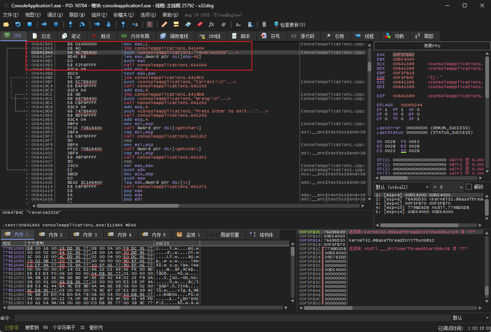
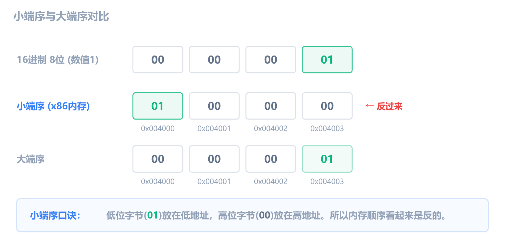
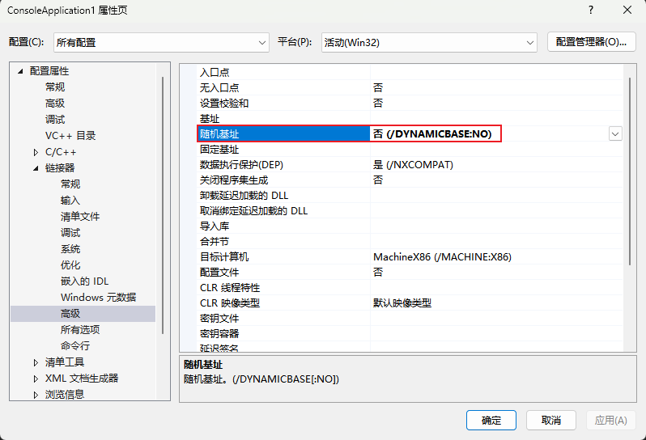
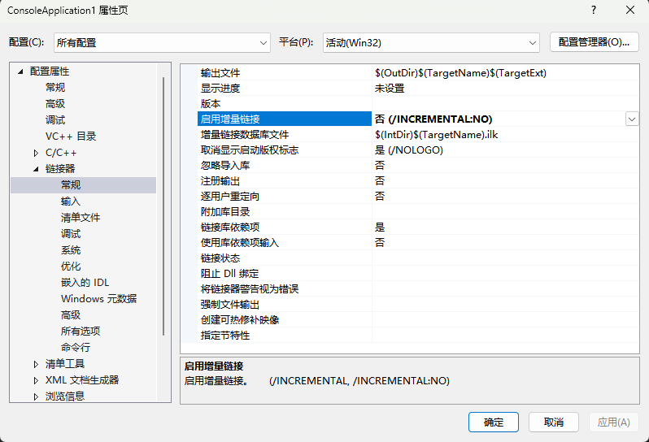
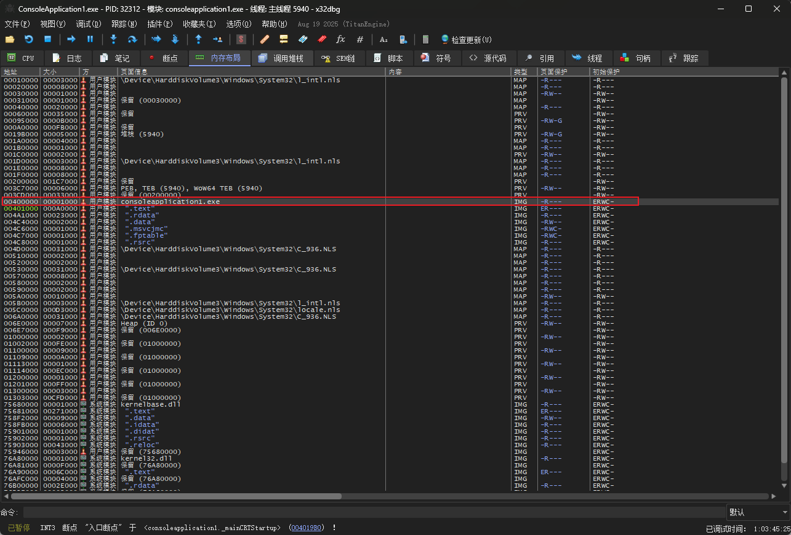
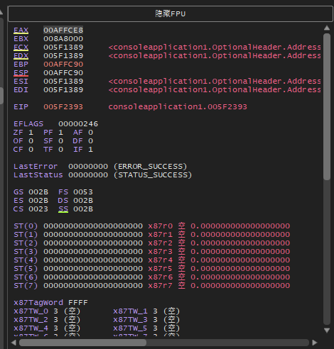
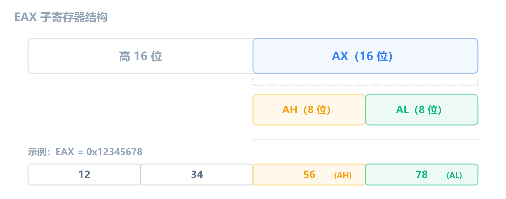
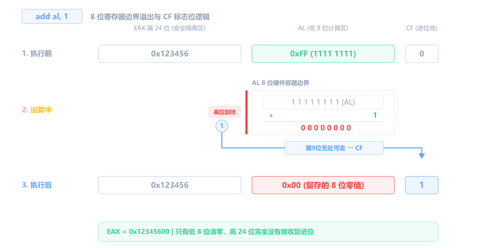
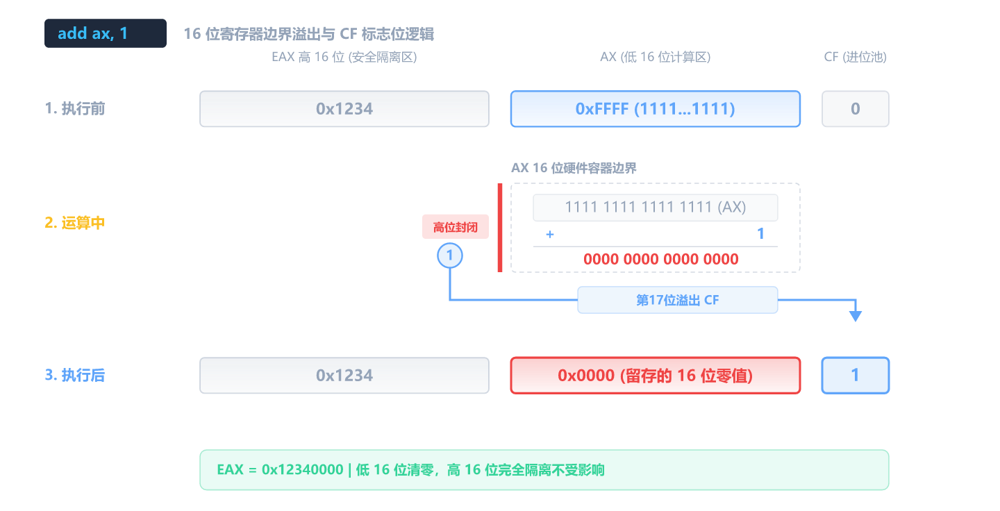
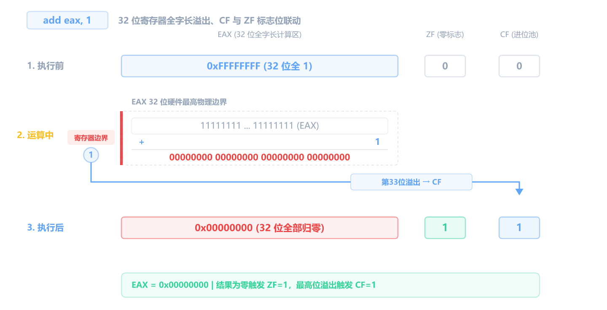

上一章搞懂了十六进制和补码，现在打开 x64dbg 看看这些数字在调试器里到底长什么样。

## 汇编长什么样

在 x64dbg 的 CPU 窗口里，每一行汇编有四列：



图上是 CPU 窗口对应部分。你每次打开程序看到的指令都不一样，这不影响，四列结构是不变的。下面用一组固定示例来讲解每列的含义：

| 地址       | 机器码        | 指令                         | 注释            |
| ---------- | ------------- | ---------------------------- | --------------- |
| `00401000` | `B8 01000000` | `mov eax, 1`                 | ; 把 1 放进 eax |
| `00401005` | `8945 FC`     | `mov dword ptr [ebp-4], eax` |                 |
| `00401008` | `8B45 FC`     | `mov eax, dword ptr [ebp-4]` |                 |

从左到右：

1. **地址** — 这行代码在内存中的位置。每次编译都不同，不用管它
2. **机器码** — CPU 实际执行的二进制数据，用十六进制显示。比如 `B8 01000000` 就是 `mov eax, 1` 的 CPU 编码，`B8` 告诉 CPU "把后面的 4 字节放进 EAX"
3. **指令** — 反汇编结果，人类可读。**这是你最需要关注的列**
4. **注释** — x64dbg 自动添加的说明（有时有，有时没有）

你可能好奇：`01000000` 怎么就是 1？因为 x86 CPU 用 **小端序（Little Endian）** 存数据，即低位字节放在前面，高位字节放在后面。数值 `1` 的 32 位十六进制是 `0x00000001`，按小端序从低到高排列就是 `01 00 00 00`。x64dbg 按地址顺序显示，所以你看到的是 `01 00 00 00`，从右往左读回去就是 `00000001` = 1。后面的章节会正式讲这个概念，现在只要知道"字节顺序是反的"就行。



机器码和指令说的是同一件事，`B8 01000000` 就是 `mov eax, 1`。第 1 章你用 `Ctrl+9` 把 `jne` 填充成 NOP，其实就是把机器码 `75 xx` 改成了 `90 90`（`90` 就是 NOP 的机器码）。

指令的基本格式是：

```asm
操作码   目的操作数, 源操作数
mov      eax,       1
```

方向是**从右往左**：把源（右边）放到目的（左边）。`mov eax, 1` 就是把 `1` 放进 `eax`。

## 深入理解地址、机器码和内存

上一节认识了 CPU 窗口的四列，但留了几个问题：地址到底是什么？地址里存的是机器码吗？为什么地址跳得不均匀？同一个地址能在不同窗口看到吗？

### 地址是什么

**地址就是内存的"门牌号"。** 你电脑的内存（RAM）可以想象成一条很长的街道，每个字节（8 位）有一个唯一的门牌号，比如 `0x00401000`。

地址范围从 `0x00000000` 到 `0xFFFFFFFF`（理论上 4 GB），但不是每个门牌号后面都有房子，大部分地址是空的（未分配），访问到空地址程序就崩溃了。

你可能好奇为什么地址经常从 `0x00401000` 开始，这是 Windows 32 位 PE 程序的**默认加载基址** `0x00400000`，代码从基址偏移 `0x1000` 处开始（前面是 PE 文件头）。所以你看到的第一条指令几乎总是在 `0x00401xxx` 附近。

但新版 VS Studio 默认开了两个选项，会让每次编译/运行时地址都变。为了让后续练习中地址固定、方便对照，建议把这两个选项关掉：

1. 在 VS 顶部菜单栏点 **调试** -> **ConsoleApplication1 属性**（项目名不同就选你自己的项目属性）

2. **关闭 ASLR（地址随机化）**：配置属性 -> 链接器 -> 高级 -> **随机基地址** 改为 **否 (/DYNAMICBASE:NO)**



3. **关闭增量链接**：配置属性 -> 链接器 -> 常规 -> **启用增量链接** 改为 **否 (/INCREMENTAL:NO)**



改完后重新编译（<kbd>Ctrl</kbd>+<kbd>B</kbd>），之后每次加载 exe 地址都是固定的 `0x00401xxx` 了。

你可以按 **Alt+M** 打开 Memory Map 窗口，看到当前程序实际占用了哪些内存区域：



你实际看到的地址、文件名都跟我的不一样，这取决于 Windows 版本、程序大小、加载的 DLL。**不用记具体地址**，只要记住几个概念：

- **找到你的 exe**：在"内容"列里找你的程序名（比如 `consoleapplication1.exe`），那几行就是你程序的代码和数据
- **系统模块**：DLL 文件（kernel32、ntdll、MSVCR 等）是系统库，暂时不用管
- **低地址 0x00000000** 附近是空指针陷阱区，访问就崩溃
- **高地址**是内核空间，用户程序不能碰，调试器也看不到

### 地址里存的是什么

**地址里存的永远是字节（byte）。** 一个地址对应一个字节。至于这些字节代表什么，取决于你怎么解读它：

| 同一段字节       | 当代码看       | 当数据看                  |
| ---------------- | -------------- | ------------------------- |
| `B8 01 00 00 00` | `mov eax, 1`   | 五个数值：184, 1, 0, 0, 0 |
| `48 65 6C 6C 6F` | 乱七八糟的指令 | 字符串 "Hello"            |
| `90 90`          | 两条 nop       | 数字 144, 144             |

第三行就是第 1 章你用过的 NOP，`0x90` 当代码看是空操作，当数据看就是数字 144。

**同一个字节，可以是代码，也可以是数据，取决于你怎么解读它。** x64dbg 的 CPU 窗口按代码解读（把字节翻译成指令），内存窗口按原始数据解读（直接显示十六进制字节）。这就是为什么同一个地址 `0x00401000`，在 CPU 窗口看到 `mov eax, 1`，切到内存窗口看到 `B8 01 00 00 00`，**同一块内存，两种视角**。

### 机器码和地址的关系

机器码就存在对应的地址里。看这个例子：

```text
地址          机器码          指令
00401000    B8 01000000    mov eax, 1
00401005    8945 FC        mov dword ptr [ebp-4], eax
```

- 地址 `00401000` 这一行，机器码 `B8 01 00 00 00` 占了 **5 个字节**
- 所以**下一条**指令的地址 = `00401000 + 5` = `00401005`
- 地址 `00401005` 这一行，机器码 `89 45 FC` 占了 **3 个字节**
- 再下一条 = `00401005 + 3` = `00401008`

**地址的增长量 = 上一条指令机器码的字节数。** 不同指令长度不同（1 到 15 字节都有），所以地址增长不均匀，有的隔 2，有的隔 5，有的隔 7。这就是"为什么地址没有规律"。

### 为什么改了代码后地址就变了

每次重新打开 x64dbg 加载同一个 exe，地址是一样的（比如都是从 `00401000` 开始）。但如果你**改了代码重新编译**，地址可能就变了，因为代码长度变了，链接器重新安排了位置。

### 同一个地址在不同窗口之间跳转

x64dbg 有好几个窗口可以显示内存内容，同一个地址可以在不同窗口之间跳转：

| 窗口     | 显示什么                | 怎么跳转                                                        |
| -------- | ----------------------- | --------------------------------------------------------------- |
| CPU 窗口 | 机器码反汇编成汇编指令  | 直接就在这，最常用的窗口                                        |
| 内存窗口 | 原始十六进制字节        | 在地址上右键 -> Follow in Memory / 在内存窗口按 Ctrl+G 输入地址 |
| 堆栈窗口 | 以 ESP 为基准显示栈内容 | 在 ESP 寄存器上右键 -> Follow in Stack                          |

**实操试试**：在 CPU 窗口随便点击一行指令，看一下它的地址（比如 `00401000`）。然后切换到内存窗口，按 Ctrl+G，输入同一个地址，你会看到这行指令的机器码字节就躺在那。

反过来也行：在内存窗口看到一堆字节，不知道是什么，可以在起始地址上右键 -> Follow in Disassembler，CPU 窗口就会跳到那里，把字节反汇编成指令给你看。

## x64dbg 寄存器窗口全景

打开 x64dbg 随便加载一个程序，右上角的寄存器窗口会显示一大堆东西。初学者一看就懵，但你只需要关注其中一小部分。



下面是你在 x64dbg 寄存器窗口里会看到的所有内容，按"需要关注"和"暂时忽略"分类：

### 需要关注的（本节和后续章节会讲）

**通用寄存器（8 个）：**

```text
EAX : 00000000
EBX : 00000000
ECX : A5970000
EDX : 00000000
EBP : 012FF310
ESP : 012FF2E4
ESI : 013E2DA0
EDI : 0104D000
```

这 8 个是 CPU 的"工作台"，后面细讲。

**程序计数器：**

```text
EIP : 00401000
```

EIP 永远指向**下一条要执行的指令**。后面有专门一节详细讲它。

**标志寄存器：**

```text
EFLAGS : 00000246
  CF : 0          进位标志
  PF : 1          奇偶标志
  AF : 0          辅助进位
  ZF : 1          零标志
  SF : 0          符号标志
  TF : 0          陷阱标志
  IF : 1          中断标志
  DF : 0          方向标志
  OF : 0          溢出标志
```

EFLAGS 是一个 32 位寄存器，每一位都是一个独立的"开关"，记录运算结果的状态。上面列出了 x64dbg 显示的 9 个标志位。**其中 CF、ZF、SF 三个最重要**，条件跳转指令就是读它们来决定是否跳转的。后面有专门一节详细讲。

### 暂时忽略的（用到时再讲）

```text
GS : 002B      <- 段寄存器，不用管
ES : 002B
CS : 0023
FS : 0053
DS : 002B
SS : 002B
LastError  : 00000000     <- Windows 错误码
LastStatus : 00000000
```

这些段寄存器是操作系统层面的东西，普通程序根本碰不到，跳过就行。

你可能还会在寄存器窗口最下方看到其他几组：

- **ST(0) ~ ST(7)、x87TagWord、x87ControlWord、x87StatusWord** — x87 FPU 浮点寄存器。旧式浮点运算用的"寄存器栈"，现代编译器已经很少用了
- **XMM0 ~ XMM7** — SSE 向量/浮点寄存器（128 位）。现代编译器做浮点运算和 SIMD 并行计算用的
- **MXCSR** — SSE 控制/状态寄存器
- **K0 ~ K7** — AVX-512 掩码寄存器
- **DR0 ~ DR7** — 调试寄存器。硬件断点用的，x64dbg 自己用的就是这些

如果你在寄存器窗口上方点了一下"显示 FPU"按钮，会弹出一个**浮点寄存器详细窗口**，里面按区域显示 FPU 状态字、MXCSR 各标志位、XMM 寄存器、调试寄存器，以及当前函数的堆栈参数。这个窗口入门阶段完全不用看，关掉就行。

## 八个通用寄存器

寄存器是 CPU 内部的小存储空间，速度极快，数量很少。32 位 x86 有 8 个通用寄存器，每个能存 32 位（4 字节）数据：

| 寄存器  | 常见用途                  | 记忆                      |
| ------- | ------------------------- | ------------------------- |
| **EAX** | 函数返回值、算术运算      | **A**ccumulator           |
| **EBX** | 通用，偶尔做基址          | **B**ase                  |
| **ECX** | 循环计数器、this 指针     | **C**ounter               |
| **EDX** | 乘除法辅助、I/O           | **D**ata                  |
| **ESI** | 源地址（字符串/数组操作） | **S**ource **I**ndex      |
| **EDI** | 目标地址                  | **D**estination **I**ndex |
| **EBP** | 栈帧基址                  | **B**ase **P**ointer      |
| **ESP** | 栈顶指针                  | **S**tack **P**ointer     |

虽然叫"通用"，但每个都有习惯用法：

- **EAX** — 很多 32 位函数的整数或指针返回值会放在 `EAX` 里。调用一个函数后，先看 `EAX` 往往就能知道返回了什么。第 1 章 `strcmp` 的返回值就在 `EAX` 里
- **ECX** — 循环的计数器。你看到 `dec ecx` + `jne`（Jump if Not Equal，后面会讲），多半是个循环
- **EBP / ESP** — 这两个定义了当前函数的"栈帧"（后面第 9 章详细讲）。简单说：`[ebp-4]`、`[ebp-8]` 就是局部变量，`ESP` 始终指向栈顶
- **ESI / EDI** — 成对出现，通常一个指向"源数据"，一个指向"目标数据"，常见于字符串操作和内存复制

### 子寄存器

每个 32 位寄存器可以按需访问更小的部分。以 EAX 为例：



- **EAX** — 完整的 32 位
- **AX** — 低 16 位
- **AH** — 低 16 位中的高 8 位
- **AL** — 低 8 位

修改 AL 会影响 EAX 的最低字节，但不会改变高 24 位。比如 EAX = `0x12345678`，执行 `mov al, 0xFF` 后 EAX 变成 `0x123456FF`。

| 32 位 | 16 位 | 高 8 位 | 低 8 位 |
| ----- | ----- | ------- | ------- |
| EAX   | AX    | AH      | AL      |
| EBX   | BX    | BH      | BL      |
| ECX   | CX    | CH      | CL      |
| EDX   | DX    | DH      | DL      |
| ESI   | SI    | —       | —       |
| EDI   | DI    | —       | —       |
| EBP   | BP    | —       | —       |
| ESP   | SP    | —       | —       |

注意只有 EAX/EBX/ECX/EDX 四个支持 AH/AL 拆分，其余四个只能访问 16 位（SI/DI/BP/SP）。

**这些子寄存器共享同一组底层位**，修改 AL 就是修改 EAX 的最低字节，不是独立的存储空间。

### 子寄存器的溢出不会"传染"

子寄存器溢出时，**不会向高位进位**，超出部分直接被丢弃：

**AL 溢出（8 位，最大 0xFF）：**



比如 EAX = `0x123456FF`，`add al, 1` 之后 EAX = `0x12345600`（AL 从 FF 变成 00，高 24 位不变）。

**AX 溢出（16 位，最大 0xFFFF）：**



比如 EAX = `0x1234FFFF`，`add ax, 1` 之后 EAX = `0x12340000`（AX 从 FFFF 变成 0000，高 16 位不变）。

**EAX 溢出（32 位，最大 0xFFFFFFFF）：**



32 位全字长溢出时，CF 和 ZF 同时被触发，结果为零所以 ZF=1，加法最高位产生进位所以 CF=1。

**总结**：操作子寄存器时，溢出只在那个大小的范围内发生，不会"进位"到高位。修改 AL 不会碰 AH，修改 AX 不会碰 EAX 高 16 位。

## EIP：程序计数器

**EIP（Extended Instruction Pointer）** 存的是下一条要执行的指令的内存地址。

你没法直接修改 EIP（没有 `mov eip, xxx` 这种指令）。EIP 的变化由 CPU 自动管理：

- 正常执行时，每执行一条指令，EIP 自动跳到下一条
- 遇到 `jmp` 指令，EIP 被直接设为目标地址
- 遇到 `call` 指令，EIP 被设为函数入口地址
- 遇到 `ret` 指令，EIP 被设为栈上保存的返回地址

在 x64dbg 里，**高亮（黄色背景）的那行就是 EIP 指向的位置**。你按：

- **F7**（Step Into）— 执行当前高亮的指令，EIP 移到下一条（遇到 call 会进入函数内部）
- **F8**（Step Over）— 同上，但遇到 call 时一口气执行完整个函数，不停在里面
- **F9**（Run）— 全速运行，不停下来，直到遇到断点或程序结束

**每按一次 F7 或 F8，你应该养成习惯：看 EIP 移到了哪里、寄存器窗口哪些值变了（x64dbg 会把变化的值标红）。**

## EFLAGS：标志寄存器

EFLAGS 是一个 32 位寄存器，但它的每一位都是一个独立的"开关"。大多数标志位记录上一条运算指令的结果状态，后续的条件跳转指令读取这些标志位来决定是否跳转。

**打个比方**：EFLAGS 是一张"快递单"。运算指令（cmp、add、test 等）填单子，跳转指令（je、jne 等）读单子。

x64dbg 显示了 9 个标志位，每个对应 EFLAGS 中的固定一位。先看**最重要的三个**：

| 标志   | 含义                | 怎么看                               |
| ------ | ------------------- | ------------------------------------ |
| **CF** | 加法进位 / 减法借位 | 加法最高位有进位或减法不够减 -> CF=1 |
| **ZF** | 结果是否为零        | 结果 = 0 -> ZF=1，否则 ZF=0          |
| **SF** | 结果最高位是否为 1  | 最高位=1 -> SF=1，最高位=0 -> SF=0   |

条件跳转指令就是读这三个标志位来决定是否跳转。**初学者只记这三个就够了。**

**关于 SF 的几个细节**：

- **SF 不等于"负数"**，它只是机械地看结果的最高位。运算结果本身不分有符号无符号，`0x80000000 + 1` 不管你怎么解读，结果都是 `0x80000001`。但当你用有符号视角看时，SF=1 对应"负数"；用无符号视角看时，SF 没有特殊含义，无符号比较看的是 CF
- **"最高位"取决于操作数大小**：操作 `al`（8 位）时 SF 看第 7 位，操作 `ax`（16 位）时看第 15 位，操作 `eax`（32 位）时看第 31 位。比如 `mov al, 0x80` + `add al, 1`，结果 `0x81`，第 7 位是 1，SF=1

其余六个了解一下就行，用到时再查：

| 标志   | 含义                                               | 什么时候用         |
| ------ | -------------------------------------------------- | ------------------ |
| **OF** | 有符号溢出（两个正数加出负数，或两个负数加出正数） | 讲溢出时再细讲     |
| **PF** | 结果最低字节中 1 的个数是否为偶数                  | 很少手动关注       |
| **AF** | 低 4 位向高 4 位进位                               | BCD 运算用，极少碰 |
| **TF** | 单步调试陷阱                                       | CPU 自动控制       |
| **IF** | 允许中断                                           | 调试时始终为 1     |
| **DF** | 字符串操作方向                                     | 讲字符串时再提     |

你可能好奇：x64dbg 顶部显示的 `EFLAGS : 00000246` 这个整体值和上面 9 个标志位是怎么对上的？答案是它们就是同一个东西，每个标志位占据 EFLAGS 的固定一位，值为 1 的位加起来就等于 EFLAGS 整体值。

**你不用自己算这个，看单个标志位就够了，整体值基本不用管。** 如果你好奇的话，`0x246` = bit1(固定1) + PF(bit2) + ZF(bit6) + IF(bit9) = 2+4+64+512 = 582 = `0x246`。记住有这回事就行，逆向时从来不需要手算。

在 x64dbg 里，标志位发生变化时会**变红**，非常直观。

上面列出了 9 个标志位的含义。你可能觉得有点抽象，这些标志位会在运算时发生变化。等后面学了 add/sub 等算术指令后，我们会用大量案例深入讲解 CF、ZF、SF、OF、PF 每一个标志位的变化。现在你只需要知道：**它们存在，它们会变红，它们是条件跳转的依据**。

## 32 位还是 64 位？

前面一直在说 EAX、EBX、EIP 这些 32 位寄存器。如果你打开的是一个 64 位程序，寄存器会变成这样：

- 通用寄存器从 EAX/EBX/... 扩展为 64 位的 RAX/RBX/...，外加新增 R8-R15 八个寄存器
- 指令指针 EIP 变成 RIP（64 位）
- 函数参数不再全走栈，前四个参数走 RCX、RDX、R8、R9

但这些差异不影响你现在学的东西，指令名字、标志位、内存模型都是一样的。等后面分析 64 位程序时，这些差异几页纸就能讲清楚，现在不用担心。

## 练习

1. **窗口跳转**：在 CPU 窗口随便点一行指令，记下它的地址。然后切到内存窗口，按 Ctrl+G 输入同一个地址，你能看到对应的机器码字节吗？反过来，在内存窗口右键 -> Follow in Disassembler，能回到 CPU 窗口吗？

   > [!NOTE]- 参考答案
   > 能看到。CPU 窗口和内存窗口显示的是同一块内存，只是视角不同，CPU 窗口把字节解释成指令，内存窗口显示原始字节。

2. **Memory Map**：按 Alt+M 打开 Memory Map，找到你的 exe 那几行。你程序的代码大概从哪个地址开始？

   > [!NOTE]- 参考答案
   > 取决于你的程序，但关闭 ASLR 后通常从 `0x00401000` 开始。

3. **子寄存器计算**：如果 EAX = `0x12345678`，执行 `mov ah, 0xAA` 后 EAX 变成多少？执行 `mov ax, 0x0000` 后呢？

   > [!NOTE]- 参考答案
   > `mov ah, 0xAA`：AH 是 AX 的高 8 位（即 EAX 的 bit 15-8）。`0x12345678` 中 AH 原来是 `0x56`，改成 `0xAA` 后 EAX = `0x1234AA78`。`mov ax, 0x0000`：AX 覆盖低 16 位，EAX = `0x12340000`。

4. **溢出预测**：AL = `0xFE`，执行 `add al, 5` 后 AL 是多少？CF 是 0 还是 1？

   > [!NOTE]- 参考答案
   > `0xFE + 5 = 0x103`，但 AL 只有 8 位，截断后 AL = `0x03`。产生了进位，CF = 1。
