## 动手目标

这一章我们先自己写一个最简单的密码验证程序，再用 `x64dbg` 找到它的判断逻辑，并改掉关键跳转。

你现在不需要先懂汇编，也不用先理解所有窗口。先把这次破解完整做下来，后面的章节再一点点拆开它。

## 准备工具

你需要两样东西：

1. **Visual Studio** — 微软的 IDE，免费社区版就够。安装时勾选"使用 C++ 的桌面开发"

安装器里你只需要确认这一项：**勾选“使用 C++ 的桌面开发”**。

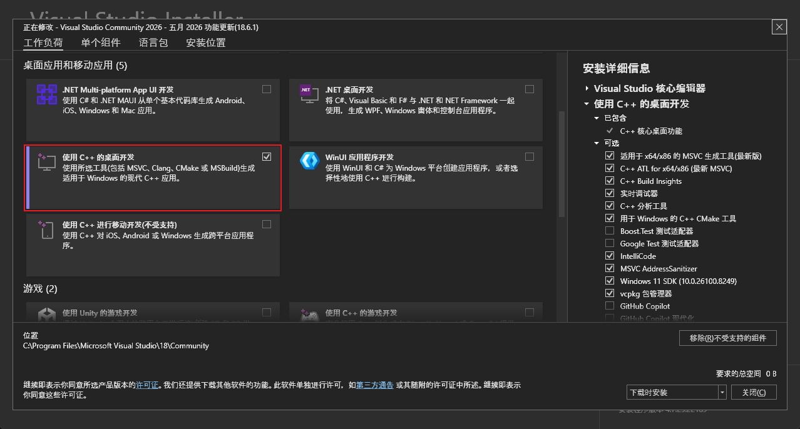

2. **x64dbg** — 免费开源的调试器，去 [x64dbg.com](https://x64dbg.com/) 下载最新版，解压就能用

官网页面只看一件事：下载最新版压缩包，解压后就能用。

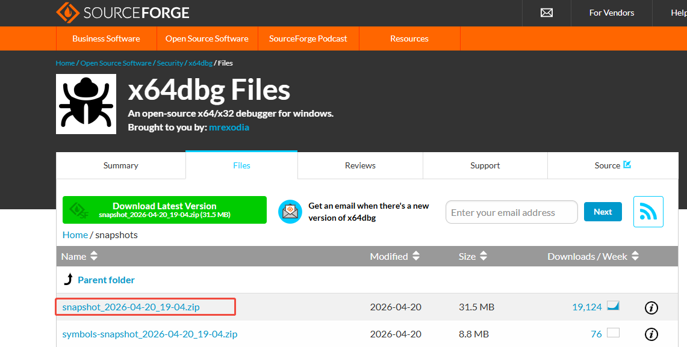

解压后先认两个文件名：`x32dbg.exe` 和 `x64dbg.exe`。这一章只用前者。

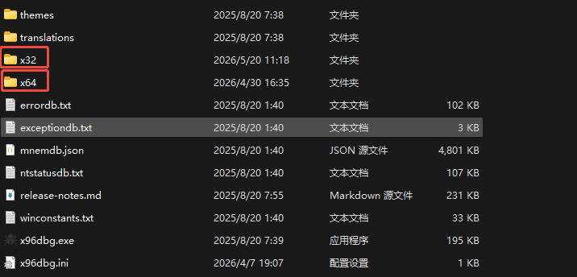

## 自己写一个 CrackMe

我们先自己写一个最简单的密码验证程序，编译成 exe，然后用 x64dbg 去破解它。

先按这两步做：

1. 打开 VS，创建一个新的 **空项目**（C++ Empty Project）或 **控制台应用**项目

下面这张图只看项目类型：能建出一个最普通的 C++ 桌面/控制台项目就够了。

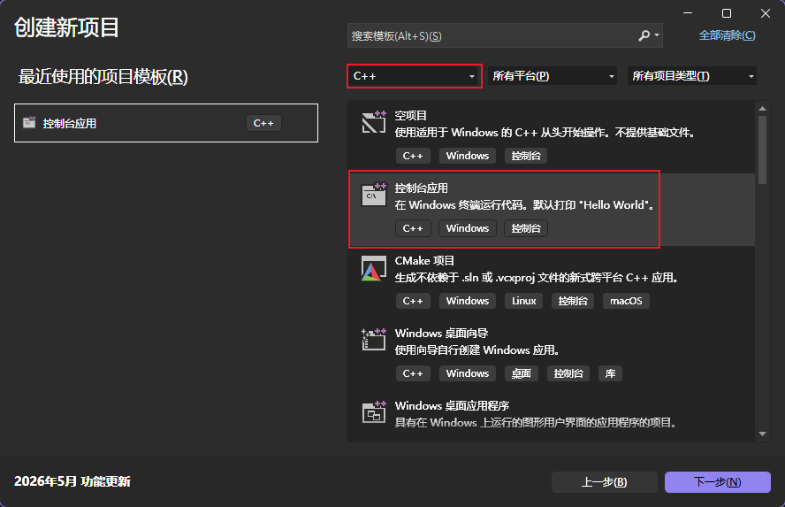

2. 把主文件内容替换成：

```c
#define _CRT_SECURE_NO_WARNINGS
#include <stdio.h>
#include <string.h>

int main() {
    char input[64] = {0};
    printf("Enter password: ");
    if (scanf("%63s", input) != 1) {
        return 1;
    }

    if (strcmp(input, "reverse2026") == 0) {
        printf("Correct!\n");
    } else {
        printf("Wrong!\n");
    }

    printf("Press Enter to exit...");
    getchar();
    getchar();

    return 0;
}
```

代码很简单：让你输入密码，和 `"reverse2026"` 比较，对了输出 Correct，错了输出 Wrong。最后加了等待输入，防止控制台窗口一闪而过。

> [!IMPORTANT]
> 后面的所有步骤都默认你用的是 **Debug + x86**。如果这里配成 `Release` 或 `x64`，后面的界面和搜索结果可能会对不上。

1. 顶部工具栏把配置改成 **Debug**，平台改成 **x86**（即 Win32，不是 x64）

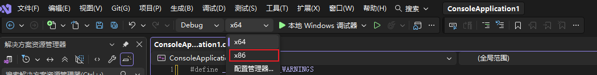

2. 按 <kbd>Ctrl</kbd>+<kbd>B</kbd> 生成解决方案
3. 编译好后，在项目目录的 `Debug/` 文件夹里找到 `.exe` 文件

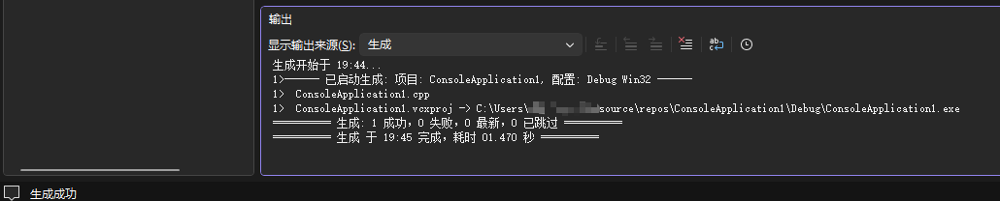

这里故意用 32 位程序：寄存器更少，指令更短，第一次上手更容易。

## 用 x64dbg 打开程序

按这两步把程序丢进调试器：

1. 打开 x64dbg 解压目录下的 **x32dbg.exe**（32 位版本，不是 `x64dbg.exe`）

下面这张图只帮你认位置：这一章要点开的是 `x32dbg.exe`。


2. 把刚编译好的 exe 直接**拖到 x32dbg 窗口上**

程序加载后会**自动暂停**。停下来的位置通常在 `ntdll.dll` 的系统代码里，不是你的程序——这是正常的；Windows 在启动程序之前要先执行一些系统初始化。现在你先不用展开这些启动细节，只要继续走到程序代码区域就行。

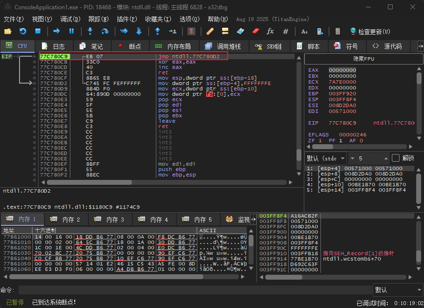

按 <kbd>Alt</kbd>+<kbd>F9</kbd>（执行到用户代码），让 CPU 继续跑到你的程序代码区域。你可能会看到类似 `jmp _mainCRTStartup` 的指令，这是 C 运行时（CRT）的启动代码。不用现在就读懂它；这一步的目标只有一个：**让暂停点进入你自己的程序区域**。

下面这张图只看一件事：按 <kbd>Alt</kbd>+<kbd>F9</kbd> 之后，暂停点已经从系统代码进入你的程序启动代码。

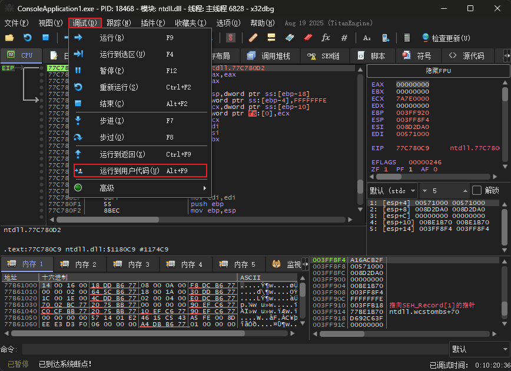

接下来这张图只帮你先认四个主要区域，不要求你现在就看懂每个窗口的细节。

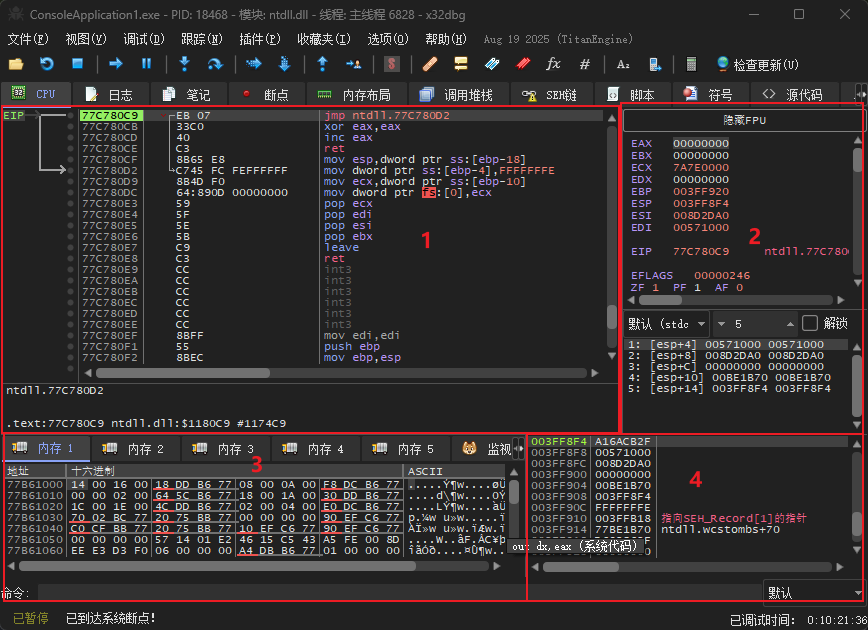

你先只记住下面这张对照表：

|序号| 区域       | 内容                                       | 你需要关注的 |
|---| ---------- | ------------------------------------------ | ------------ |
|1| CPU 窗口   | 反汇编代码（左边地址，中间指令，右边注释） | 这里是核心   |
|2| 寄存器窗口 | CPU 的"变量"（EAX、EBX、ECX 等）           | 观察值的变化 |
|3| 内存窗口   | 程序的内存数据                             | 偶尔用       |
|4| 堆栈窗口   | 函数调用栈                                 | 后面章节讲   |

这一章后面主要盯左边的 CPU 窗口；其他窗口现在只要先知道名字就够了。

## 找到关键跳转

大多数验证程序的逻辑都是：**比较输入和正确密码 → 相等就成功，不等就失败**。这个"相等/不等"在汇编里就是一条跳转指令。

操作步骤：

1. 在 CPU 窗口的反汇编代码区域里**右键**

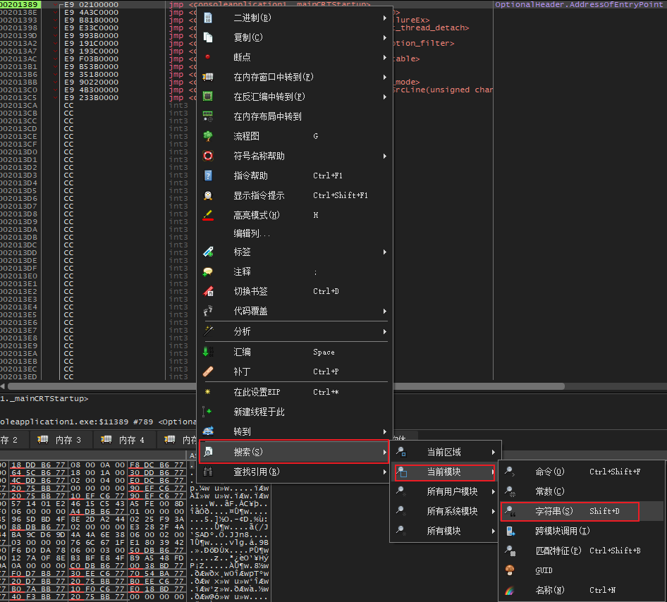

2. 弹出菜单中选择 **搜索** → **当前模块** → **字符串**

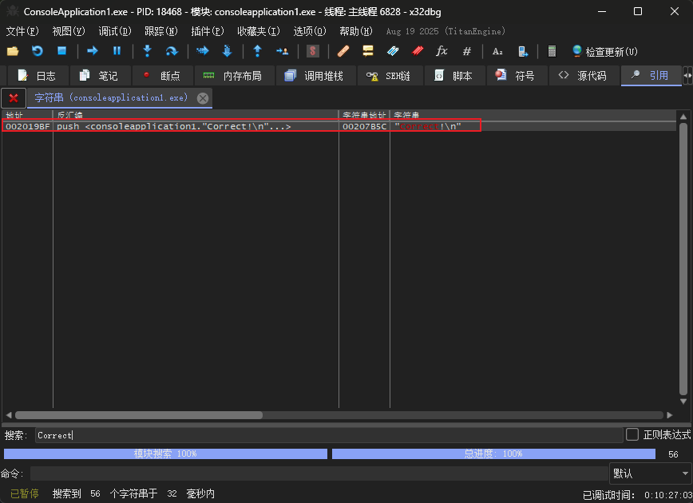

3. 在弹出的窗口里找到 **"Correct!"** 或 **"Wrong!"**，**双击**它

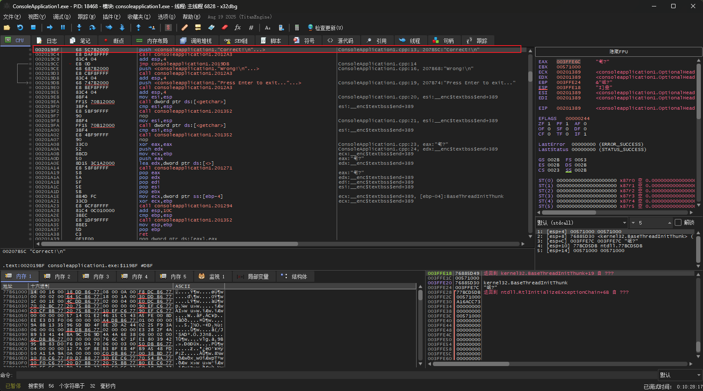

双击后，x64dbg 会跳到引用 "Correct!" 的那行代码（通常是 `push <..."Correct!"...>`），**高亮的那行就是跳转目标。你要往上看**（往上滚几行），找验证逻辑。

**你不需要读懂所有代码**，只需要在 "Correct!" 和 "Wrong!" 附近找这个固定模式：

```text {1,3,4}
push    <..."reverse2026"...>         ← 正确密码明文写死在这里！
...（几行 push 和 call）...
test    eax,eax                       ← 检查比较结果
jne     <某个地址>                     ← 紧接着一条 jne（关键！）
push    <..."Correct!\n"...>          ← 你双击跳转到的那行
...（几行 push 和 call）...
jmp     <某个地址>                     ← 一条 jmp 跳过下面
push    <..."Wrong!\n"...>            ← Wrong 分支
```

看不懂中间的 push 和 call 没关系，只要在 "Correct!" 和 "Wrong!" 附近找到 **`test eax,eax` + `jne`** 这两行就够了。

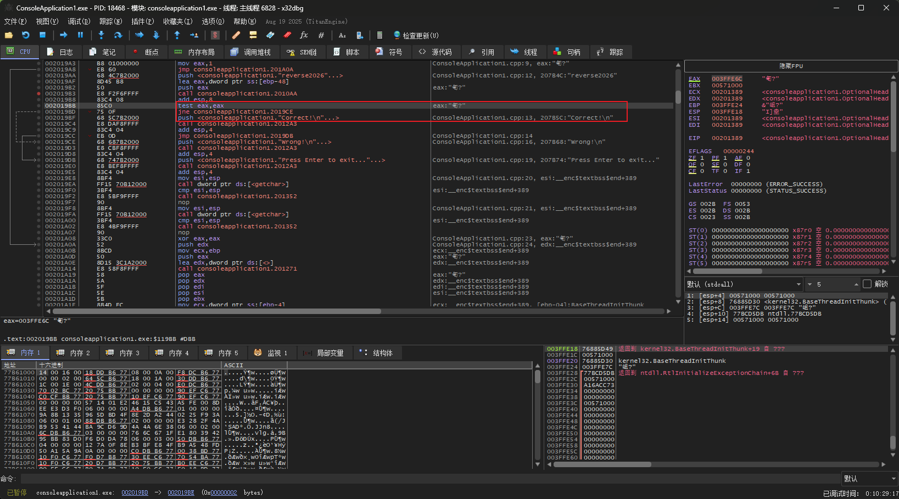

高亮的三行就是破解的关键：

1. **`push <..."reverse2026"...>`** — 正确密码直接写死在程序里，明文！逆向时你一眼就能看到
2. **`test eax,eax`** — 检查 strcmp 的返回值，0 表示相等
3. **`jne <Wrong分支>`** — 不相等就跳到 Wrong 分支

你只需要盯住高亮的这三行。

> [!NOTE]
> 你实际看到的代码会比我写的更长，函数名可能显示为 `call consoleapplication1.xxxxx` 而不是 `call <strcmp>`。没关系，**位置和结构是一样的**——在 "Correct!" 和 "Wrong!" 附近找到 `test eax,eax` 和 `jne` 就行。

> [!WARNING]
> 如果连 `"Correct!"` 都搜不到，先检查是不是用了 **Debug + x86**。这是最常见的原因。
>
> 还不行的话，再按这个顺序试：
>
> 1. 搜 `"Wrong!"` 试试
> 2. 把 exe 重新拖进 `x32dbg`，再搜一次

## 改一个字节

找到高亮的 `jne` 那行后，我们要让它"失效"——不管比较结果如何，都走成功的路。

**方法一：NOP 掉（推荐）**

把跳转指令替换成 NOP（No Operation，空操作）。程序走到这里就直接往下执行，不再跳转：

1. 点击选中 `jne` 那行

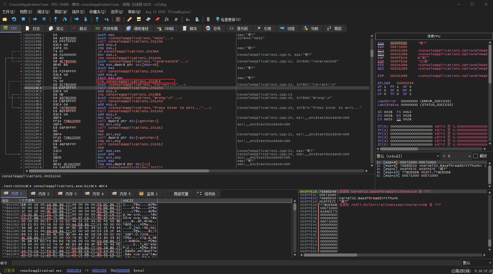

2. 按 <kbd>Ctrl</kbd>+<kbd>9</kbd>（或右键 → 二进制 → 用 NOP 填充）

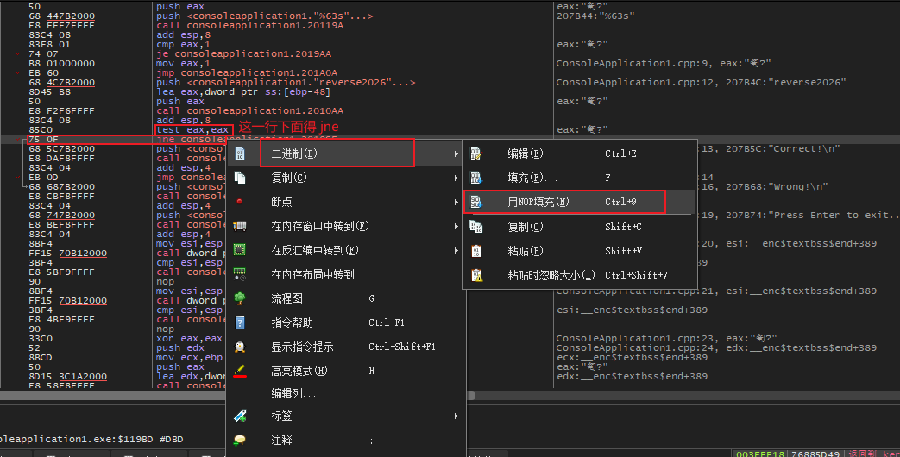

这样 x64dbg 会自动把 `jne` 的所有字节都填充为 `NOP`，一步到位。

下面两张图分别看两件事：先确认当前这条跳转已经变成 `nop`，再确认整段替换已经完成。

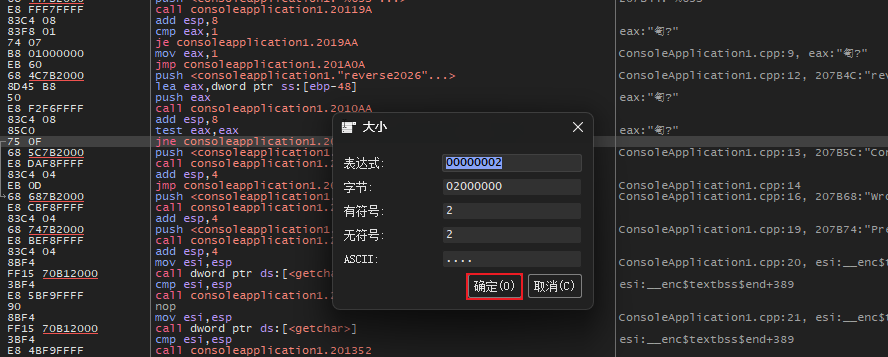

第二张图再确认替换已经完成，后续运行时不会再跳到 Wrong 分支。

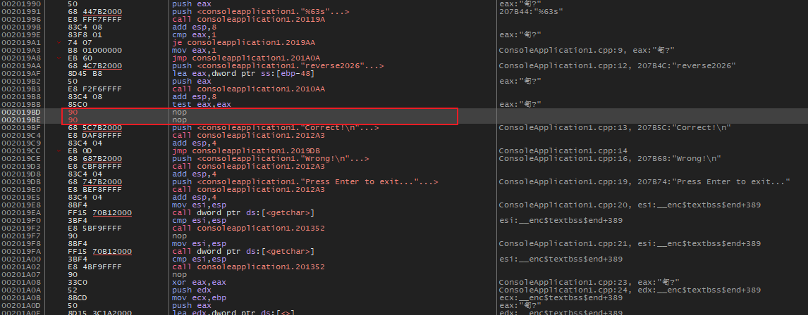

**方法二：取反跳转**

把 `jne`（不相等则跳）改成 `je`（相等则跳）。这样效果完全反过来了：密码正确反而显示 Wrong，密码错误反而显示 Correct。

> [!NOTE]- `jne` 和 `jnz` 是同一条指令
> `jne`（Jump if Not Equal）和 `jnz`（Jump if Not Zero）其实是同一条机器码，只是两种不同的助记符写法。零标志位 `ZF = 0` 意味着“结果不为零”，也就是“不相等”，所以它们完全等价。x64dbg 里可能显示 `jne`，也可能显示 `jnz`，取决于上下文；同理，`je` 和 `jz` 也是同一条指令。

操作方法：

1. 点击选中 `jne` 那行
2. 按 <kbd>空格</kbd>，弹出汇编编辑框（里面显示的是当前的 `jne` 指令）
3. 把 `jne` 删掉，输入 `je`，后面的地址不用改（保持原来的目标地址）
4. 点确定

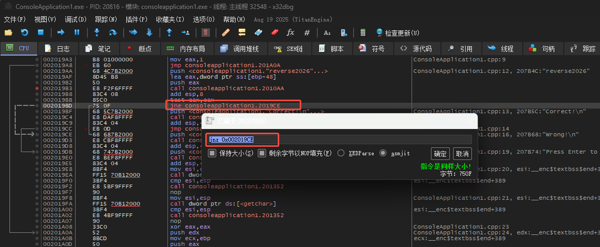

改完后，按 <kbd>F9</kbd>（运行）。这时程序的控制台窗口会出现，在控制台里随便输入一个错误密码，按回车：

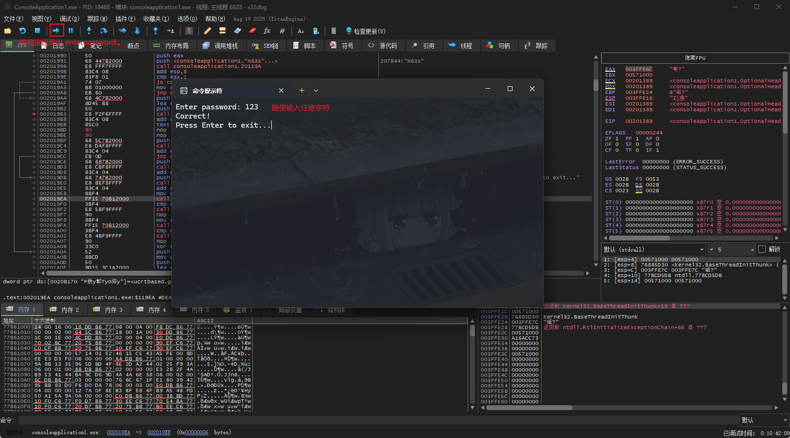

恭喜，你刚刚完成了人生第一次逆向。你输入了错误的密码，但程序告诉你"正确"。

## 你刚才做了什么

回顾一下整个过程：

1. **自己写了一个验证程序** — 你完全知道它的逻辑
2. **用 x64dbg 打开它** — 搜索字符串定位验证代码
3. **NOP 掉条件跳转** — 绕过了密码验证

这就是逆向最核心的操作：**找到关键的判断，然后绕过它**。

你可能会问：如果程序不是我自己写的，我不知道逻辑怎么办？答案是一样的——搜索字符串、找条件跳转、NOP 掉。**不管程序多复杂，验证逻辑最终都会走到一个条件跳转。** 找到它，你就赢了。

后面所有章节都是在这个基础上展开的。

## 练习

把 `jne` 改成 `je`（取反跳转）试试效果：输入正确密码 "reverse2026" 会显示什么？输入错误密码呢？

> [!TIP]
> 恢复原始字节：如果改完后想恢复，在改过的那行按 <kbd>Ctrl</kbd>+<kbd>Z</kbd>（撤销修改）。如果撤销不了，直接把 exe 重新拖进 x32dbg 就行——磁盘上的 exe 没有被修改，x64dbg 的修改只在内存里生效。
