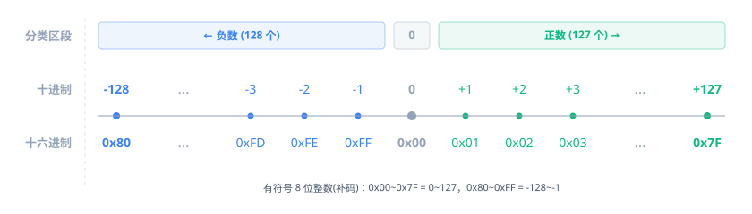
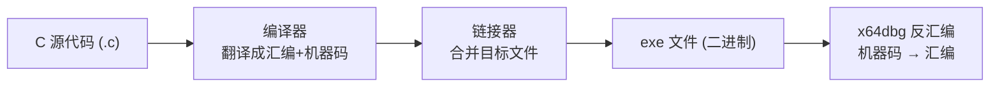

# 十六进制、位与字节

## 为什么要学汇编

上一章你破解了自己的第一个程序，在 x64dbg 里看到了一堆汇编指令。当时说"不用读懂，照着做就行"。但如果每次都靠搜索字符串碰运气，效率太低了。

**汇编就是 CPU 能读懂的语言。** 你用 C 写的代码，编译器翻译成汇编，CPU 执行的是汇编。所以看懂汇编，就等于看到了程序的"源代码"。

好消息是：逆向用到的汇编指令不多，常用的就十几条。接下来的几章把最重要的过一遍，后面章节会反复练习。

## 前置知识：十六进制、位和字节

在看汇编之前，你必须先搞懂三个基础概念——因为后面每一页都在用它们。

### 位（bit）

**位是计算机最小的数据单位，只有两个值：0 或 1。** 计算机内部所有数据都用位表示。

一位就是一个开关：开（1）或关（0）。你平时见到的所有数据——数字、文字、图片、程序——底层都是一堆 0 和 1。

单独一个位能表示的信息很少（只有两种），所以位通常**组合起来用**。

### 字节（byte）

**8 个位排在一起就是一个字节。** 这是计算机处理数据的基本单位。

一个字节 = 8 位，能表示 2^8 = 256 种不同的值（0–255，或 0x00–0xFF）。

为什么是 8 个一组？因为早期计算机用 8 位刚好够表示一个英文字母（ASCII 编码）。这个传统延续至今——内存的最小可寻址单位就是字节，不是位。

你后面会反复看到的几个术语：

| 名称 | 英文  | 位数 | 字节数 | 无符号范围        |
| ---- | ----- | ---- | ------ | ----------------- |
| 字节 | byte  | 8    | 1      | 0 – 255           |
| 字   | word  | 16   | 2      | 0 – 65,535        |
| 双字 | dword | 32   | 4      | 0 – 4,294,967,295 |

32 位程序里，一个 int 就是 4 字节（双字），一个地址也是 4 字节。暂时不会碰到 64 位的四字（qword）。

### 十六进制

你在 x64dbg 里看到的数值几乎全是**十六进制（hexadecimal）**——用 0–9 和 A–F 这 16 个符号来表示数值。

为什么不用十进制？因为十六进制和二进制之间的转换非常整齐：**每 4 个二进制位 = 1 个十六进制位。** 这让十六进制成为"人类可读的二进制"。

```
二进制      十六进制    十进制
0000        0           0
0001        1           1
0010        2           2
...
1001        9           9
1010        A           10
1011        B           11
1100        C           12
1101        D           13
1110        E           14
1111        F           15
```

所以一个字节（8 位）恰好用两位十六进制表示：

```
二进制:     1011 0100
十六进制:   B     4      → 0xB4 = 180
```

**在 x64dbg 和 C 代码里，十六进制通常用 `0x` 前缀**，比如 `0xFF`、`0x00401000`。有时也用 `h` 后缀，比如 `B4h`。没有前缀也没有后缀的数字默认是十进制。

### 正数和负数：一个字节的故事

到目前为止，我们说的都是"无符号"——一个字节存 0–255。但程序里经常要用负数。那一个字节怎么既存正数又存负数呢？

**答案是：把 256 个状态劈成两半。** 最高位当符号位：0 开头的是正数，1 开头的是负数。

用数轴看最直观：



几个关键点：

1. **正数从 `0x01` 到 `0x7F`**（0 开头，最高位是 0）。最大正数 = `0x7F` = 127
2. **负数从 `0x80` 到 `0xFF`**（1 开头，最高位是 1）。最小负数 = `0x80` = -128
3. **0 在正数那边**（`0x00`，符号位为 0）。所以正数只有 127 个（+1 ~ +127），负数有 128 个（-128 ~ -1），总共还是 256 = 2^8

**负数怎么跟十六进制对应？** 计算机用**补码（Two's Complement）**编码，规则是：**取反加一**。

举个例子，`-2` 在一个字节里长什么样？

```
第1步：取绝对值   2 = 0000 0010
第2步：取反       1111 1101
第3步：加一       1111 1110 = 0xFE

所以 -2 = 0xFE（8 位）
```

反过来，看到 `0xFE` 怎么知道是 -2？同样的操作再做一遍：

```
0xFE = 1111 1110，最高位是 1，是负数

第1步：取反       0000 0001
第2步：加一       0000 0010 = 2

所以 0xFE = -2
```

自己验证一下：`0xFF` 取反加一得到多少？——取反 `0000 0000`，加一 `0000 0001` = 1，所以 `0xFF = -1`。

**为什么"取反加一"就行？** 因为任何数加上自己的取反结果，每一位都是 `0+1=1`，所以 `x + ~x = 0xFF...FF`（全 1）。全 1 再加 1 就变成 `0x00...00` 并进位溢出。也就是说 `x + (~x + 1) = 0`，而加起来等于 0 的那个数就是 `-x`。所以 `~x + 1`（取反加一）就是 `-x` 的编码。

**快速判断负数**：十六进制最高位 ≥ 8（即 8、9、A、B、C、D、E、F），说明二进制最高位是 1，作为有符号数就是负数。比如 `0xFE`（F ≥ 8）是负数，`0x7F`（7 < 8）是正数。

### 8 位、16 位、32 位的范围

上面用 8 位讲的原理，对 16 位和 32 位完全一样——只是位数多了，范围更大：

| 位数 | 最大无符号值         | 有符号范围（简写） | 最大正数     | 最小负数     |
| ---- | -------------------- | ------------------ | ------------ | ------------ |
| 8    | `0xFF` = 255         | -128 – +127        | `0x7F`       | `0x80`       |
| 16   | `0xFFFF` ≈ 6.5 万    | ≈ ±3.2 万          | `0x7FFF`     | `0x8000`     |
| 32   | `0xFFFFFFFF` ≈ 43 亿 | ≈ ±21 亿           | `0x7FFFFFFF` | `0x80000000` |

32 位那个 `0xFFFFFFFF` ≈ 43 亿，看起来很大，但其实就是四个字节全填 F。在 x64dbg 里你看到的地址和 int 值都是 32 位的，所以这个范围你每天都会碰到。

规律一眼能看出来：

- **最大正数**永远是 `0x7F...F`（最高位 0，其余全 1）
- **最小负数**永远是 `0x80...0`（最高位 1，其余全 0）
- **-1** 永远是全 F：`0xFF`（8 位）、`0xFFFF`（16 位）、`0xFFFFFFFF`（32 位）

**核心结论**：同一个十六进制值，可以有"无符号"和"有符号"两种解读。`0xFFFFFFFF` 作为无符号是最大值，作为有符号就是 -1。程序把它当哪种用，取决于上下文。后面学到 EFLAGS 标志位时，你会看到 CPU 怎么同时算出两组标志位（CF 和 OF），分别服务于这两种解读。

### 小数怎么办？

到目前为止我们只讲了整数。程序里当然也有小数——C 语言里的 `float` 和 `double`。

但小数在计算机里的编码方式（叫 **IEEE 754 浮点数**）跟整数完全不同：它把 32 位拆成三段——符号位、指数、尾数——用类似科学计数法的方式存。比如 `0.1` 在内存里不是你想的那样存的，`0.1 + 0.2` 在计算机里也不精确等于 `0.3`。

好消息是：**逆向实战中 95% 遇到的都是整数运算。** CrackMe、注册码、游戏辅助，几乎全是整数。浮点主要出现在图形计算、物理引擎等场景。

所以我们先不展开浮点，等后面碰到浮点指令（`movss`、`addss` 之类的 SSE 指令）时再专门讲，有具体场景会更好理解。

## 从 C 源码到机器码

搞懂了基础概念，现在看看汇编在整体流程中的位置。

你写 C 代码 → 编译器编译 → 生成 exe → 你用 x64dbg 打开 exe → 看到汇编。这个流程是这样的：



几个关键概念：

- **源代码** — 你写的 C 代码，人类可读
- **编译** — 编译器把 C 翻译成汇编，再把汇编翻译成机器码（二进制）。这一步是**不可逆**的——编译完成后，变量名、注释、函数名的信息就丢了
- **链接** — 把多个目标文件和库合并成一个 exe
- **反汇编** — 逆向工程的第一步。x64dbg 把 exe 里的机器码翻译回汇编，给我们看。**但原始的 C 代码是拿不回来的**
- **反编译** — 更高级的工具（如 IDA、Ghidra）尝试从汇编还原出接近 C 的代码。但这只是"尽力而为"，不可能完美还原——变量名没了、注释没了、有些代码结构变了

**所以汇编是逆向工程师能看到的"最接近源代码"的东西。** 看懂汇编 = 看懂程序在做什么。

### 回顾第一章：你改的那个字节到底改了什么

还记得第一章吗？你把 `jne` 改成 `je`（方法二），效果就反过来了——输错密码反而显示 Correct，输对密码反而显示 Wrong。

现在你已经有了理解它的知识：

- `jne` 的意思是"Jump if Not Equal"——如果 ZF=0 就跳转
- 程序比较你输入的序列号和正确的序列号，相等时 ZF=1，不相等时 ZF=0
- 原本 `jne` 检查 ZF=0（不相等）→ 跳到"错误"分支，ZF=1（相等）→ 不跳，走"正确"分支
- 你改成 `je` 后，跳转条件反过来了：ZF=1（相等）→ 跳到"错误"分支，ZF=0（不相等）→ 不跳，走"正确"分支
- 所以**输错密码时 ZF=0，`je` 不跳，走了 Correct 分支**

这一个小字节的改动，本质上是把条件跳转的判断逻辑**取反**了。

下一章我们会打开 x64dbg，亲眼看到这些寄存器、标志位和内存地址。

## 练习

1. **手动算补码**：用 8 位表示 `-5`，写出二进制和十六进制。再用"取反加一"验证回去。
2. **十六进制转二进制**：`0x3C` 和 `0xA5` 各等于什么二进制？（提示：每位十六进制 = 4 位二进制，逐位展开就行）
3. **二进制转十六进制**：`1100 1010` 和 `0001 1111` 各等于什么十六进制？
4. **读十六进制**：`0xFFFFFFFE` 作为 32 位有符号数是多少？作为无符号数是多少？
5. **判断正负**：下列十六进制值作为有符号数是正数还是负数？`0x3A`、`0xA0`、`0x7FFFFFFF`、`0x80000001`
